# WalletMind Engineering Design Bible

## PROJECT_PLAN.md

> **Version:** 1.0.0  
> **Status:** Living Document (Source of Truth)  
> **Document Owner:** WalletMind Contributors  
> **Primary Audience:** Engineers, AI Agents (Antigravity), Contributors, Competition Judges  
> **Last Updated:** July 2026

---

# Part I — Foundation

> **Purpose**
>
> This document is the authoritative engineering specification for WalletMind.
>
> It is intentionally written as an engineering design document rather than a traditional Product Requirements Document (PRD). The objective is to provide a single source of truth that defines the product vision, architectural philosophy, engineering standards, development workflow, and implementation strategy for every contributor—human or AI.
>
> Every future architectural decision, implementation detail, notebook, prompt, and documentation page should trace back to this document or one of its linked design specifications.
>
> If implementation and documentation disagree, **the documentation takes precedence until intentionally revised through an Architecture Decision Record (ADR).**

---

# Table of Contents

## Part I — Foundation

1. Executive Summary
2. AI Development Contract
3. Product Vision
4. Competition Strategy
5. Product Philosophy

Future sections are intentionally omitted from this part and will be added in subsequent revisions of this document.

---

# 1. Executive Summary

## 1.1 Overview

WalletMind is a **reasoning-first AI Financial Concierge** built using Google's **Agent Development Kit (ADK)** and a planner-driven multi-agent architecture.

Unlike traditional personal finance applications that focus on recording financial history, WalletMind focuses on understanding a user's financial goals, reasoning about future outcomes, coordinating specialized AI agents, and producing explainable recommendations.

WalletMind is **not** designed to replace financial advisors or banking software. Instead, it demonstrates how modern agentic AI systems can collaborate to solve complex, long-horizon financial planning problems that cannot be reliably addressed by a single language model prompt.

The project is intentionally optimized for the **Google ADK Multi-Agent Competition**, where the primary evaluation criteria emphasize intelligent agent orchestration, reasoning quality, modular architecture, and effective use of ADK capabilities.

---

## 1.2 Project Objectives

WalletMind has three primary objectives:

### Objective 1 — Demonstrate Advanced Agentic Reasoning

Build a planner-centric system capable of decomposing complex financial requests into smaller reasoning tasks that are delegated to specialized AI agents.

Examples include:

- Planning for early retirement
- Evaluating home purchase affordability
- Responding to unexpected income loss
- Optimizing savings strategies
- Balancing multiple financial goals

---

### Objective 2 — Showcase Google ADK

WalletMind serves as a reference implementation demonstrating best practices for:

- Multi-agent orchestration
- Planner-driven execution
- Context sharing
- Tool integration
- Persistent memory
- Structured communication
- Modular AI architectures

---

### Objective 3 — Deliver an Explainable AI Experience

Every recommendation generated by WalletMind should answer three questions:

1. Why was this recommendation made?
2. Which agents contributed?
3. How confident is the system?

Users should understand not only **what** WalletMind recommends but **how** the recommendation was produced.

---

## 1.3 Guiding Principles

WalletMind is guided by five foundational principles:

### Goal-Oriented Reasoning

Users express financial goals rather than requesting isolated calculations.

---

### Planner-Centric Intelligence

The Planner Agent is responsible for deciding **how** a problem should be solved.

Individual agents are responsible only for **their specialized reasoning domains**.

---

### Persistent Context

Financial planning spans months and years.

WalletMind continuously builds long-term understanding of:

- user preferences
- goals
- financial history
- constraints
- behavior

---

### Explainability

Every recommendation must be explainable through structured reasoning traces.

---

### Extensibility

New agents, tools, memories, and planners should be addable without requiring major architectural changes.

---

## 1.4 High-Level Architecture

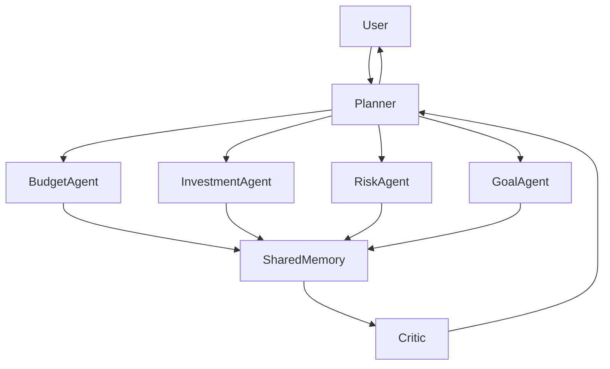

This diagram illustrates the core architectural philosophy:

- Planner coordinates
- Agents specialize
- Memory persists context
- Critic validates reasoning
- Planner produces final response

---

## 1.5 Source of Truth Policy

The WalletMind Engineering Design Bible is the canonical specification for the project.

The following hierarchy applies:

| Priority | Artifact               | Purpose                           |
| -------- | ---------------------- | --------------------------------- |
| 1        | PROJECT_PLAN.md        | Engineering source of truth       |
| 2        | Architecture Documents | Detailed subsystem specifications |
| 3        | ADRs                   | Record architectural decisions    |
| 4        | Source Code            | Implementation                    |
| 5        | Notebook               | Demonstration                     |

Implementation must never become the source of architectural truth.

---

# 2. AI Development Contract

## 2.1 Purpose

WalletMind is designed to be developed collaboratively by humans and AI coding assistants.

To ensure consistency, maintainability, and architectural integrity, every AI-assisted contribution must follow a shared development contract.

This contract applies to:

- Antigravity
- Future AI coding agents
- Human contributors using LLMs
- Automated code generation workflows

---

## 2.2 Core Principle

> AI does not invent architecture.

AI implements architecture.

Architectural decisions originate from documented specifications, not generated code.

Whenever uncertainty exists, the AI must consult documentation before producing implementation.

---

## 2.3 Responsibilities of AI Contributors

Every AI assistant working on WalletMind must:

- Read PROJECT_PLAN.md before implementation.
- Follow documented architecture.
- Preserve modularity.
- Prefer extension over modification.
- Produce deterministic, readable code.
- Explain non-trivial implementation decisions.
- Avoid introducing hidden coupling.
- Never silently change public interfaces.

---

## 2.4 Responsibilities of Human Contributors

Human contributors are responsible for:

- Maintaining documentation.
- Reviewing architectural changes.
- Validating AI-generated code.
- Updating ADRs when architecture evolves.
- Ensuring alignment with competition goals.

---

## 2.5 Documentation-First Workflow

Every significant feature follows the same lifecycle:

1. Document the idea.
2. Review architecture.
3. Update design documentation.
4. Implement.
5. Test.
6. Demonstrate in notebook.
7. Merge.

Code should never precede architectural intent.

---

## 2.6 Change Management

Major architectural changes require:

- Updated documentation
- New ADR
- Review of downstream impacts
- Updated diagrams
- Updated notebook if user-facing behavior changes

---

## 2.7 AI Constraints

AI contributors must not:

- invent APIs
- duplicate business logic
- bypass Planner
- bypass Memory
- bypass validation
- create undocumented dependencies

---

## 2.8 AI Success Criteria

An AI-generated implementation is considered successful when it:

- matches documented architecture
- is modular
- is testable
- is deterministic where appropriate
- improves maintainability
- preserves explainability

---

# 3. Product Vision

## 3.1 Vision Statement

> **To build the WalletMind demonstrates how planner-driven multi-agent systems can provide personalized financial reasoning using Google's Agent Development Kit. that helps people make better financial decisions through collaborative, explainable, and personalized AI reasoning.**

WalletMind aims to redefine personal finance software by moving beyond transaction tracking toward intelligent financial guidance.

Rather than functioning as a passive dashboard, WalletMind acts as an active collaborator that understands user goals, evaluates alternatives, anticipates risks, and recommends meaningful actions.

---

## 3.2 Long-Term Vision

Over time, WalletMind should evolve into an intelligent financial operating system capable of:

- understanding life events
- adapting to changing financial circumstances
- coordinating multiple specialized reasoning agents
- learning from user feedback
- supporting increasingly complex financial planning scenarios

The architecture should support gradual expansion without requiring fundamental redesign.

---

## 3.3 Design Philosophy

Every feature introduced into WalletMind should satisfy at least one of the following objectives:

- Improve reasoning quality
- Improve explainability
- Improve personalization
- Improve user trust
- Improve modularity
- Improve extensibility

Features that do not contribute to these objectives should be reconsidered.

---

## 3.4 Success Definition

WalletMind succeeds when users can confidently answer questions such as:

- Can I afford to buy a house?
- Should I pay off debt or invest?
- What happens if my income changes?
- How should I prioritize competing goals?
- What financial risks should I address first?

The system should not merely provide answers but explain the reasoning behind them.

---

# 4. Competition Strategy

## 4.1 Purpose

WalletMind is intentionally engineered to align with the evaluation philosophy of the Google ADK Multi-Agent Competition.

The project prioritizes demonstrable reasoning capabilities over feature breadth.

---

## 4.2 Architectural Focus Areas

The architecture emphasizes:

- Planner-driven orchestration
- Specialized AI agents
- Dynamic task decomposition
- Persistent contextual memory
- Structured communication
- Validation through a Critic Agent
- Transparent reasoning

These capabilities collectively demonstrate advanced agentic workflows rather than isolated language model interactions.

---

## 4.3 Guiding Principle

The project is evaluated not by the number of implemented features but by the quality of its reasoning architecture.

Consequently, every subsystem should answer the question:

> "How does this improve the system's ability to reason, collaborate, or explain?"

---

## 4.4 Competition Design Priorities

| Priority | Design Focus              | Rationale                                 |
| -------- | ------------------------- | ----------------------------------------- |
| High     | Planner Intelligence      | Demonstrates orchestration capabilities   |
| High     | Multi-Agent Collaboration | Showcases ADK strengths                   |
| High     | Persistent Memory         | Enables long-term reasoning               |
| High     | Explainability            | Builds user trust and aids evaluation     |
| High     | Notebook Experience       | Provides a clear demonstration narrative  |
| Medium   | UI Polish                 | Supports usability but is secondary       |
| Medium   | Performance Optimization  | Important after architectural correctness |
| Low      | Production Scalability    | Outside the scope of the competition      |

---

## 4.5 Notebook as Evaluation Artifact

The competition notebook is not merely a technical demonstration.

It is the primary storytelling medium through which judges experience the architecture.

Every notebook scenario should clearly illustrate:

1. User intent
2. Planner reasoning
3. Agent collaboration
4. Memory retrieval
5. Validation process
6. Final recommendation

The notebook should make the system's reasoning transparent and reproducible.

---

# 5. Product Philosophy

## 5.1 WalletMind Is Not an Expense Tracker

Traditional personal finance applications focus on historical data:

- categorizing transactions
- visualizing spending
- tracking budgets

While valuable, these functions address only part of the user's financial journey.

WalletMind shifts the focus from **recording the past** to **planning the future**.

---

## 5.2 The Financial Concierge Model

WalletMind is designed as a digital financial concierge.

A concierge does not merely answer questions.

A concierge:

- understands context
- anticipates needs
- coordinates specialists
- provides personalized guidance
- adapts over time

WalletMind applies this model to financial planning through collaborative AI agents.

---

## 5.3 Goal-First Interaction

The user's journey begins with aspirations rather than data entry.

Examples of user goals include:

- Save for a home
- Build an emergency fund
- Retire early
- Reduce financial stress
- Pay off debt
- Start investing
- Plan for education expenses

The system interprets these goals, identifies relevant reasoning tasks, and orchestrates the necessary agents to produce actionable recommendations.

---

## 5.4 Explainability as a Product Feature

Trust is essential in financial decision-making.

Accordingly, WalletMind treats explainability as a core product capability rather than an optional enhancement.

Every recommendation should include:

- contributing agents
- supporting evidence
- assumptions
- confidence indicators
- potential trade-offs

Users should understand both the recommendation and the reasoning process that produced it.

---

## 5.5 Extensibility by Design

WalletMind is expected to evolve continuously.

The architecture should accommodate:

- new reasoning agents
- additional financial domains
- external tool integrations
- richer memory models
- improved planning strategies

without requiring disruptive architectural changes.

This commitment to modularity ensures that WalletMind remains adaptable as both AI capabilities and user needs evolve.

---

# Part II — Problem Definition & Product Design

> **Purpose**
>
> This section establishes the product requirements that drive every architectural decision in WalletMind. Rather than describing features in isolation, it explains the reasoning problems WalletMind is designed to solve and how those problems translate into user experience, system behavior, and engineering requirements.

---

# Table of Contents

6. Problem Statement
7. Existing Solutions and Their Limitations
8. Why AI Agents?
9. Why Multi-Agent Architecture?
10. User Personas
11. User Journeys
12. Functional Requirements
13. Non-Functional Requirements
14. Product Scope
15. Out of Scope
16. Success Metrics
17. Product Design Principles

---

# 6. Problem Statement

## 6.1 The Core Problem

Financial planning is fundamentally a reasoning problem rather than a data problem.

Most modern financial applications successfully collect, categorize, and visualize information. However, they rarely help users make complex decisions involving uncertainty, competing priorities, changing circumstances, and long-term goals.

Users are typically presented with dashboards rather than guidance.

WalletMind exists to bridge this gap by transforming financial data into collaborative, explainable reasoning.

---

## 6.2 Nature of Financial Decisions

Real financial decisions are rarely isolated.

Changing one aspect of a person's finances often affects multiple others.

Examples include:

- purchasing a home
- changing careers
- relocating
- starting a family
- investing more aggressively
- paying off debt
- reducing working hours

Each decision creates dependencies across income, expenses, savings, investments, taxes, and long-term objectives.

This interconnected nature makes financial planning unsuitable for simplistic rule-based automation.

---

## 6.3 Characteristics of the Problem Domain

WalletMind is designed around six characteristics of financial reasoning.

| Characteristic      | Description                                                 |
| ------------------- | ----------------------------------------------------------- |
| Long Horizon        | Decisions affect months or years.                           |
| Uncertainty         | Future outcomes cannot be known with certainty.             |
| Multiple Objectives | Users pursue several goals simultaneously.                  |
| Personal Context    | Recommendations depend heavily on individual circumstances. |
| Dynamic State       | Financial conditions evolve continuously.                   |
| Explainability      | Users must understand recommendations before acting.        |

---

## 6.4 Engineering Implications

These characteristics imply that WalletMind requires:

- persistent contextual memory
- adaptive planning
- modular reasoning
- explainable recommendations
- iterative validation
- dynamic execution

The architecture is therefore centered around reasoning rather than transaction processing.

---

# 7. Existing Solutions and Their Limitations

## 7.1 Current Landscape

Existing financial software generally falls into one of four categories.

| Category             | Strength             | Limitation              |
| -------------------- | -------------------- | ----------------------- |
| Expense Trackers     | Historical reporting | No planning             |
| Budget Managers      | Spending control     | Limited personalization |
| Investment Platforms | Portfolio analysis   | Narrow financial scope  |
| Banking Apps         | Account management   | Minimal intelligence    |

---

## 7.2 Common Architectural Pattern

Most systems follow this execution model.

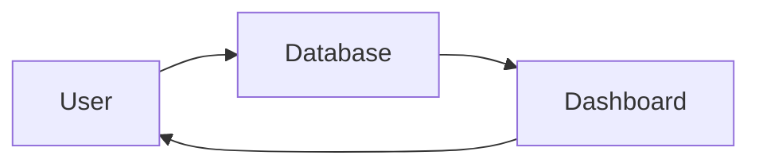

This architecture excels at answering:

- What happened?
- Where did my money go?
- How much did I spend?

It struggles to answer:

- What should I do next?
- What are my options?
- What are the trade-offs?
- Which decision best supports my goals?

---

## 7.3 Limitations of Existing Applications

### Reactive Rather Than Proactive

Most applications describe historical behavior.

WalletMind reasons about future possibilities.

---

### Transaction-Centric

Traditional applications organize around transactions.

WalletMind organizes around user goals.

---

### Static Rules

Conventional systems depend heavily on predefined rules.

WalletMind adapts reasoning according to context.

---

### Limited Personalization

Many products personalize dashboards.

WalletMind personalizes reasoning.

---

### No Collaborative Intelligence

Most tools perform a single computation.

WalletMind coordinates multiple specialized reasoning agents.

---

# 8. Why AI Agents?

## 8.1 Why Not One Prompt?

A natural question is:

> Why not ask one large language model to answer every financial question?

While this approach is attractive for simple tasks, it becomes increasingly unreliable as problems grow in complexity.

---

## 8.2 Limitations of Monolithic Prompting

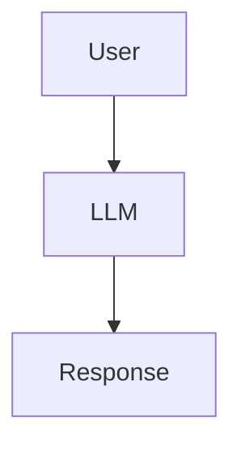

Advantages:

- simple
- inexpensive
- minimal orchestration

Limitations:

- no explicit planning
- no specialization
- difficult to validate
- limited transparency
- poor extensibility
- no ownership of persistent state

---

## 8.3 Agent-Based Reasoning

WalletMind separates responsibilities into independent reasoning components.

Each agent owns a specific capability.

Examples include:

- budgeting
- cash-flow forecasting
- risk analysis
- goal planning
- recommendation synthesis
- validation

This mirrors how human specialists collaborate when solving complex financial problems.

---

## 8.4 Benefits of AI Agents

| Benefit         | Explanation                                     |
| --------------- | ----------------------------------------------- |
| Modularity      | Independent capabilities can evolve separately. |
| Explainability  | Each reasoning step is attributable.            |
| Maintainability | Smaller components are easier to improve.       |
| Testing         | Agents can be evaluated independently.          |
| Extensibility   | New capabilities integrate without redesign.    |

---

## 8.5 Design Principle

Agents exist because financial reasoning is heterogeneous.

No single reasoning strategy is optimal for every financial question.

---

# 9. Why Multi-Agent Architecture?

## 9.1 Planner-Driven Collaboration

WalletMind models financial planning as collaborative reasoning.

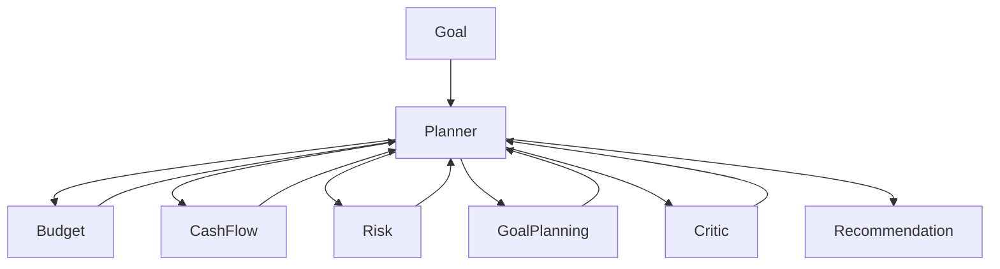

---

## 9.2 Dynamic Planning

The Planner determines execution dynamically.

Example:

User:

> I lost my job.

Planner may choose:

- Cash Flow Agent
- Budget Agent
- Risk Agent

Investment reasoning is unnecessary.

Conversely, a user asking:

> Should I rebalance my investments?

may invoke:

- Investment Agent
- Risk Agent

without involving Budget Analysis.

Agent selection is context dependent.

---

## 9.3 Separation of Responsibilities

| Component | Responsibility                        |
| --------- | ------------------------------------- |
| Planner   | Decides how work should be performed. |
| Agents    | Solve specialized reasoning tasks.    |
| Memory    | Maintains long-term context.          |
| Critic    | Validates outputs.                    |

No component should perform another component's responsibility.

---

## 9.4 Architectural Goals

The multi-agent architecture should support:

- dynamic execution
- parallel reasoning
- modular growth
- traceable decisions
- reusable capabilities

---

# 10. User Personas

WalletMind is designed for users seeking guidance rather than bookkeeping.

---

## Persona 1 — Early Career Professional

### Goals

- build savings
- reduce debt
- create emergency fund

### Needs

- budgeting
- spending optimization
- financial education

---

## Persona 2 — Family Planner

### Goals

- purchase a home
- education planning
- long-term stability

### Needs

- cash-flow forecasting
- scenario analysis
- goal prioritization

---

## Persona 3 — Independent Professional

### Goals

- manage irregular income
- optimize taxes
- stabilize cash flow

### Needs

- forecasting
- liquidity planning
- risk management

---

## Persona 4 — Long-Term Investor

### Goals

- wealth accumulation
- retirement planning
- portfolio optimization

### Needs

- investment reasoning
- risk evaluation
- long-horizon planning

---

# 11. User Journeys

## 11.1 Goal-First Experience

WalletMind begins with intention rather than transactions.


---

## 11.2 Example Journey

Scenario:

"I want to buy a house in five years."

Planner workflow:

1. Understand objective.
2. Identify constraints.
3. Retrieve financial profile.
4. Build execution plan.
5. Invoke required agents.
6. Aggregate findings.
7. Validate recommendation.
8. Update memory.
9. Present explanation.

---

## 11.3 User Experience Principles

Every interaction should be:

- conversational
- explainable
- personalized
- actionable
- goal-oriented

---

# 12. Functional Requirements

The following requirements define the minimum expected capabilities of WalletMind.

## Must Have (MoSCoW)

| Requirement               | Description                                     |
| ------------------------- | ----------------------------------------------- |
| Goal Understanding        | Interpret user financial objectives.            |
| Planner Orchestration     | Dynamically coordinate reasoning agents.        |
| Persistent Memory         | Maintain long-term user context.                |
| Multi-Agent Collaboration | Delegate specialized reasoning tasks.           |
| Recommendation Generation | Produce actionable guidance.                    |
| Explainability            | Show reasoning process and contributing agents. |
| Validation                | Critic reviews recommendations before delivery. |

---

## Should Have

- scenario simulation
- confidence scoring
- financial forecasting
- recommendation history
- personalized preferences

---

## Could Have

- voice interactions
- document ingestion
- calendar integration
- proactive reminders

---

## Won't Have (Current Scope)

- banking services
- payment processing
- tax filing
- investment execution
- regulated financial advice

---

# 13. Non-Functional Requirements

## Reliability

Recommendations should remain consistent for equivalent inputs.

---

## Explainability

Every recommendation must include:

- contributing agents
- reasoning summary
- assumptions
- confidence level

---

## Modularity

New agents should integrate with minimal architectural change.

---

## Observability

Planner execution should be traceable through structured logs and execution traces.

---

## Testability

Each planner decision and agent capability should be independently testable.

---

## Security

Sensitive financial information must remain isolated, encrypted, and accessed only when required.

---

## Maintainability

The architecture should favor composition over tightly coupled implementations.

---

# 14. Product Scope

## Included

WalletMind focuses on:

- financial reasoning
- planning
- recommendations
- forecasting
- personalized guidance
- goal management
- explainable AI

---

## Future Expansion

Potential future capabilities include:

- insurance planning
- retirement optimization
- tax reasoning
- estate planning
- business finance

These capabilities should integrate as additional agents without requiring architectural redesign.

---

# 15. Out of Scope

The following are intentionally excluded from the current project.

- banking infrastructure
- payment processing
- brokerage execution
- lending
- cryptocurrency trading
- accounting software
- ERP functionality

WalletMind reasons about financial decisions.

It does not execute regulated financial operations.

---

# 16. Success Metrics

Because WalletMind is a reasoning system rather than a traditional SaaS product, success is measured primarily through architecture and reasoning quality.

| Dimension      | Success Indicator                              |
| -------------- | ---------------------------------------------- |
| Planner        | Correct agent selection and task decomposition |
| Collaboration  | Effective coordination among agents            |
| Explainability | Transparent reasoning traces                   |
| Memory         | Relevant contextual retrieval                  |
| Validation     | Reduced inconsistent recommendations           |
| Notebook       | Clear demonstration of reasoning workflow      |
| Extensibility  | New agents added without redesign              |

---

# 17. Product Design Principles

Every feature added to WalletMind should satisfy the following principles.

## Goal First

Design around user objectives rather than financial records.

---

## Planner First

The Planner owns orchestration.

No feature should bypass planning.

---

## Memory First

Reasoning should leverage accumulated context whenever appropriate.

---

## Explainability First

Recommendations without explanations are considered incomplete.

---

## Validation Before Delivery

Every significant recommendation should be reviewed by the Critic before reaching the user.

---

## Progressive Intelligence

WalletMind should become more helpful as it learns more about the user over time, while remaining transparent about what information is remembered and why.

---

## Modularity

Capabilities should be encapsulated within well-defined agents, tools, and services so the system can evolve incrementally without introducing architectural coupling.

---

# Part II Summary

This section establishes the product and reasoning foundations of WalletMind.

The remainder of the Engineering Design Bible builds upon these principles by specifying **how** the Planner, Agent Ecosystem, Memory System, MCP interfaces, and engineering architecture implement the product vision defined here.

Every subsequent architectural decision should be evaluated against the requirements and design principles established in this section.

# Part IIIA — Engineering & Architecture Principles

> **Purpose**
>
> This section defines the engineering philosophy and architectural principles that govern every implementation within WalletMind. Unlike implementation guides, these principles describe _why_ the system is structured the way it is and establish the constraints that all future development must respect.
>
> Every subsystem, AI agent, service, tool, and workflow described in later sections inherits these principles.

---

# Table of Contents

18. Engineering Principles
19. Architecture Principles
20. System Design Philosophy
21. Layered Architecture
22. Planner-Centric Design
23. System Boundaries
24. Data Flow Principles
25. State Management Principles
26. Architectural Constraints
27. Engineering Decision Framework

---

# 18. Engineering Principles

Engineering principles define the non-negotiable values that guide implementation decisions.

These principles take precedence over convenience, premature optimization, or feature velocity.

## 18.1 Documentation Before Implementation

WalletMind follows a documentation-first development workflow.

Every architectural change must be documented before implementation begins.

Expected workflow:

```text
Idea
 ↓
Design Discussion
 ↓
Documentation Update
 ↓
ADR (if required)
 ↓
Implementation
 ↓
Testing
 ↓
Notebook Demonstration
```

Benefits include:

- shared understanding
- easier onboarding
- consistent architecture
- AI-assisted development
- maintainable code

---

## 18.2 Composition Over Complexity

WalletMind favors many focused components over a few large components.

Preferred:

```text
Planner
 ├── Budget Agent
 ├── Risk Agent
 ├── Goal Agent
 └── Critic Agent
```

Avoid:

```text
FinanceAgent
 ├── Budget Logic
 ├── Risk Logic
 ├── Planning Logic
 ├── Validation Logic
 └── Memory Logic
```

Large components become difficult to understand, test, and extend.

---

## 18.3 Single Responsibility

Every architectural component should have one primary responsibility.

Examples:

| Component    | Responsibility        |
| ------------ | --------------------- |
| Planner      | Orchestrate execution |
| Budget Agent | Spending analysis     |
| Memory       | Context storage       |
| Critic       | Validation            |
| Tool         | External interaction  |

A component should never assume another component's responsibility.

---

## 18.4 Explainability by Default

Every reasoning step should be explainable.

For any recommendation, the system should be able to answer:

- What information was used?
- Which agents participated?
- Which assumptions were made?
- Why was this recommendation chosen?
- What alternatives were considered?

Explainability is considered a functional requirement rather than an optional feature.

---

## 18.5 Deterministic Interfaces

Although language models are probabilistic, the interfaces surrounding them should remain deterministic.

Every agent should expose:

- explicit inputs
- explicit outputs
- documented schemas
- validation rules

No component should depend on undocumented prompt behavior.

---

## 18.6 Incremental Evolution

WalletMind is expected to evolve over multiple development iterations.

New capabilities should be introduced through extension rather than modification.

Preferred:

```text
Planner

↓

Add Retirement Agent
```

Avoid:

```text
Modify Budget Agent
Modify Investment Agent
Modify Planner
Modify Memory
Modify UI
```

Adding new capabilities should minimize ripple effects.

---

# 19. Architecture Principles

Architecture principles describe how the system is organized.

---

## 19.1 Planner-First Architecture

The Planner is the central orchestration engine.

It is responsible for deciding:

- what needs to happen
- which agents participate
- execution order
- dependency resolution
- retries
- aggregation

The Planner never performs financial reasoning itself.

---

## 19.2 Capability Ownership

Every capability belongs to exactly one owner.

Example:

| Capability          | Owner               |
| ------------------- | ------------------- |
| Budget optimization | Budget Agent        |
| Risk evaluation     | Risk Agent          |
| Goal prioritization | Goal Planning Agent |
| Validation          | Critic Agent        |

Ownership prevents duplicated logic.

---

## 19.3 Loose Coupling

Agents communicate through contracts rather than direct implementation knowledge.

Incorrect:

```text
BudgetAgent
      ↓
calls
      ↓
RiskAgent
```

Correct:

```text
Planner

↓

Budget Agent

↓

Planner

↓

Risk Agent
```

This ensures independent evolution.

---

## 19.4 Explicit Contracts

Every interaction must define:

- input schema
- output schema
- expected confidence
- possible errors
- ownership

No undocumented message formats are permitted.

---

## 19.5 Observability

Every execution should produce sufficient information to reconstruct the reasoning process.

Observed information includes:

- planner decisions
- selected agents
- skipped agents
- tool usage
- memory retrieval
- validation outcomes
- execution duration

Observability supports debugging, evaluation, and notebook storytelling.

---

# 20. System Design Philosophy

WalletMind is designed around reasoning rather than computation.

Traditional software answers deterministic questions.

WalletMind addresses problems that involve uncertainty, trade-offs, and incomplete information.

Accordingly, the architecture emphasizes:

- decomposition
- collaboration
- validation
- context
- iterative reasoning

rather than procedural workflows.

---

## 20.1 Goal-Oriented Execution

Every interaction begins with a user objective.

Examples:

- Buy a home
- Reduce financial stress
- Prepare for retirement
- Recover after income loss

The system reasons toward the objective rather than executing predefined workflows.

---

## 20.2 Progressive Intelligence

WalletMind should become more useful over time.

As user context grows, recommendations should become:

- more relevant
- more personalized
- more proactive

while remaining transparent about remembered information.

---

## 20.3 Human-Centered AI

WalletMind assists rather than replaces decision making.

Recommendations should:

- explain assumptions
- present trade-offs
- acknowledge uncertainty
- avoid overstating confidence

The user remains the final decision maker.

---

# 21. Layered Architecture

WalletMind follows a layered architecture to separate concerns.

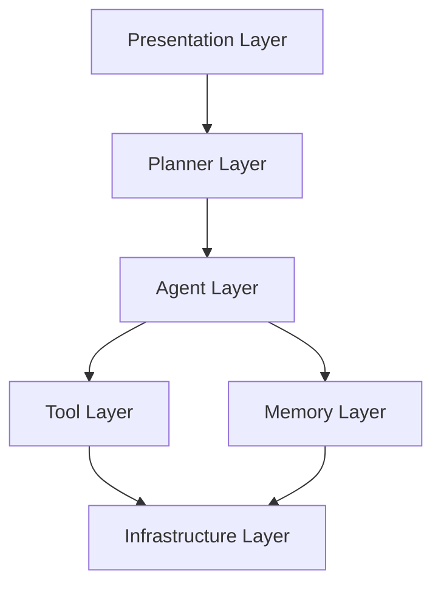

Each layer communicates only with adjacent layers unless explicitly documented.

---

## 21.1 Presentation Layer

Responsibilities:

- user interaction
- visualization
- notebook rendering
- execution traces

The presentation layer performs no business reasoning.

---

## 21.2 Planner Layer

Responsibilities:

- orchestration
- scheduling
- coordination
- execution planning
- aggregation

The planner contains no financial expertise.

---

## 21.3 Agent Layer

Responsibilities:

- domain reasoning
- structured outputs
- confidence estimation

Agents remain independent of one another.

---

## 21.4 Tool Layer

Responsibilities:

- API interaction
- calculations
- retrieval
- simulation
- external systems

Tools never make autonomous decisions.

---

## 21.5 Memory Layer

Responsibilities:

- persistent state
- retrieval
- storage
- indexing
- semantic search

Memory should remain independent of planner logic.

---

# 22. Planner-Centric Design

The Planner is the intelligence coordinator.

Every user request passes through the Planner.

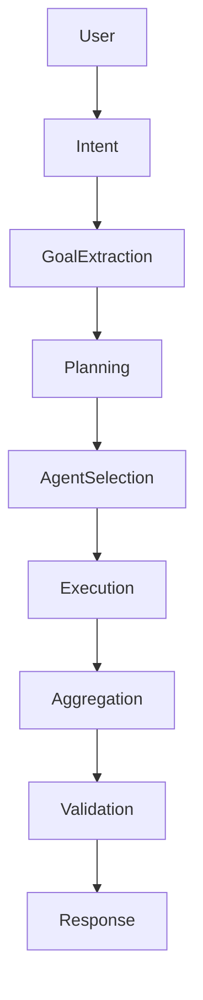

---

## 22.1 Responsibilities

The Planner owns:

- intent recognition
- goal extraction
- capability discovery
- execution planning
- dependency analysis
- scheduling
- retry management
- aggregation
- confidence synthesis

---

## 22.2 Non-Responsibilities

The Planner does **not**:

- calculate budgets
- forecast investments
- score financial risk
- query external APIs directly
- permanently store user data

These responsibilities belong elsewhere.

---

## 22.3 Dynamic Planning

Planner decisions depend on context.

Example:

```text
Goal:
Reduce monthly expenses

↓

Budget Agent

↓

Recommendation
```

versus

```text
Goal:
Plan retirement

↓

Goal Agent

↓

Investment Agent

↓

Risk Agent

↓

Recommendation
```

Planning is generated rather than hardcoded.

---

# 23. System Boundaries

WalletMind deliberately limits responsibilities.

The system performs:

- reasoning
- planning
- forecasting
- explanation
- recommendation

The system does not perform:

- banking
- investing
- lending
- payments
- tax filing

Maintaining clear boundaries reduces legal and architectural complexity.

---

# 24. Data Flow Principles

All data movement follows a controlled lifecycle.

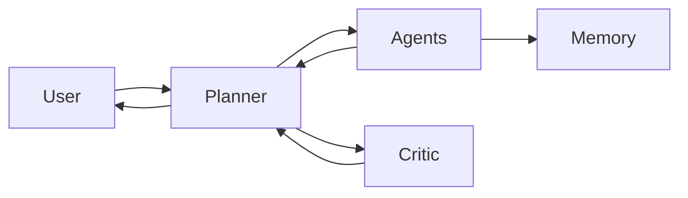

No component should bypass the Planner unless explicitly documented.

---

## 24.1 Immutable Inputs

User requests remain immutable during execution.

Derived context is stored separately.

---

## 24.2 Structured Outputs

Every agent produces structured responses.

Typical response includes:

- summary
- evidence
- assumptions
- confidence
- recommendations
- metadata

Free-form text alone is insufficient.

---

# 25. State Management Principles

WalletMind distinguishes between execution state and user state.

| State Type      | Lifetime                |
| --------------- | ----------------------- |
| Request State   | Single execution        |
| Session State   | Active interaction      |
| User State      | Persistent              |
| Knowledge State | Shared system knowledge |

Each state has different ownership and persistence rules.

---

## 25.1 Stateless Agents

Agents should remain stateless wherever possible.

Persistent knowledge belongs to the Memory subsystem.

Benefits include:

- easier testing
- predictable behavior
- horizontal scalability
- reproducibility

---

## 25.2 Planner Execution State

The Planner maintains temporary execution state including:

- active tasks
- completed tasks
- pending dependencies
- retries
- execution graph

This state expires after request completion.

---

# 26. Architectural Constraints

To preserve consistency, the following constraints are mandatory.

| Constraint             | Requirement                                         |
| ---------------------- | --------------------------------------------------- |
| Planner Required       | Every request begins with Planner orchestration     |
| Validation Required    | Significant recommendations require Critic review   |
| Memory Isolation       | Agents never own persistent memory                  |
| Structured Contracts   | Agent communication must use defined schemas        |
| No Hidden Dependencies | Cross-component assumptions are prohibited          |
| Documentation Required | Architectural changes require documentation updates |

Violating these constraints requires an approved Architecture Decision Record (ADR).

---

# 27. Engineering Decision Framework

When multiple implementation approaches are possible, evaluate them using the following priorities.

| Priority | Evaluation Question                         |
| -------- | ------------------------------------------- |
| 1        | Does it improve reasoning quality?          |
| 2        | Does it preserve planner ownership?         |
| 3        | Does it improve explainability?             |
| 4        | Does it reduce coupling?                    |
| 5        | Does it simplify future extension?          |
| 6        | Does it improve testability?                |
| 7        | Does it align with documented architecture? |

If a proposed implementation scores poorly on these criteria, it should be reconsidered before development.

---

# Part IIIA Summary

This section establishes the engineering philosophy that governs WalletMind's implementation. The following sections build upon these principles by specifying the concrete behavior of the Planner, Agent Ecosystem, Memory System, and inter-agent communication model.

Every architectural decision made throughout the remainder of this Engineering Design Bible should be consistent with the engineering and architectural principles defined above.

# Part IIIB — Core System Architecture

> **Purpose**
>
> This section defines the architectural model that governs how WalletMind executes reasoning tasks. While Part IIIA established the engineering philosophy and architectural principles, this section specifies the major architectural components, their interactions, ownership boundaries, execution lifecycle, and system-wide contracts.
>
> These definitions are intentionally implementation-agnostic and serve as the canonical architecture specification for all future development.

---

# Table of Contents

28. Core Architectural Components
29. Request Lifecycle
30. Planner Execution Model
31. Agent Execution Model
32. Communication Model
33. Task Graph Model
34. Failure Handling Strategy
35. Validation Architecture
36. Extensibility Model
37. Architectural Anti-Patterns
38. Architecture Review Checklist

---

# 28. Core Architectural Components

WalletMind is organized around a small set of architectural building blocks.

Each component has a clearly defined ownership boundary.

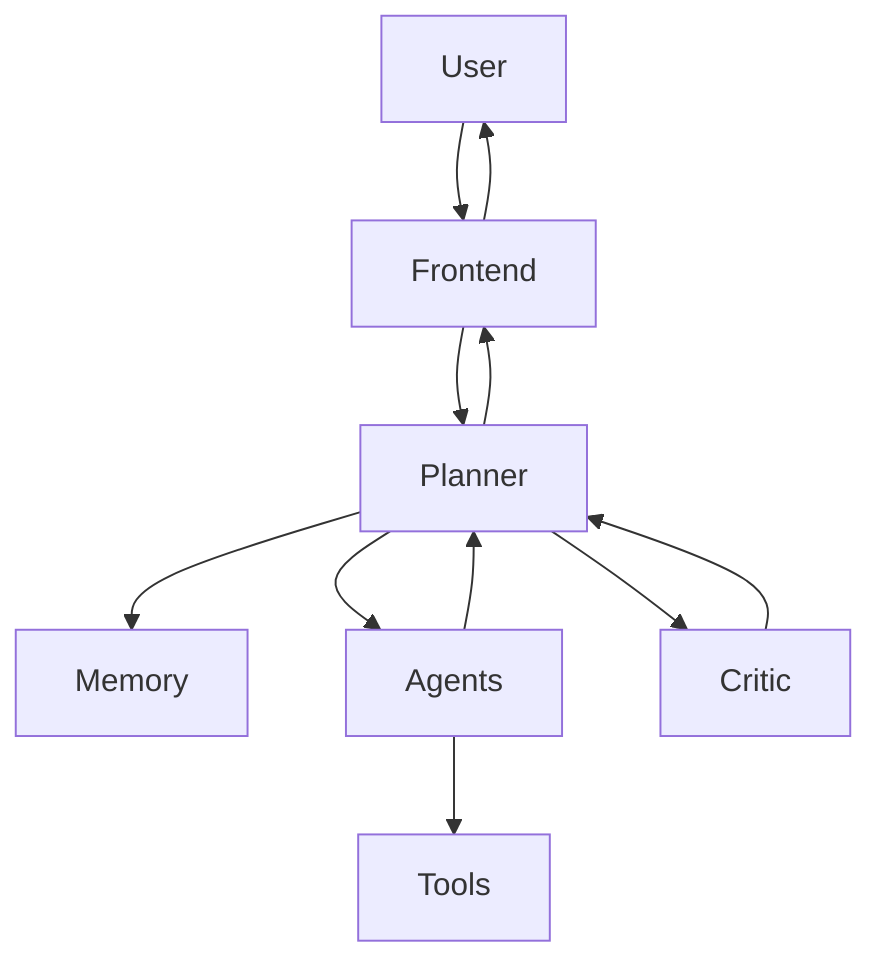

The architecture intentionally minimizes direct dependencies between components.

---

## 28.1 Component Responsibilities

| Component      | Primary Responsibility                   |
| -------------- | ---------------------------------------- |
| Frontend       | User interaction and visualization       |
| Planner        | Orchestration and execution planning     |
| Agent          | Domain-specific reasoning                |
| Memory         | Persistent contextual knowledge          |
| Tool           | External capabilities and data retrieval |
| Critic         | Validation and quality assurance         |
| Infrastructure | Storage, networking, runtime services    |

Every architectural decision should preserve these ownership boundaries.

---

## 28.2 Ownership Principle

Each responsibility must have exactly one architectural owner.

For example:

- Planner owns orchestration.
- Agents own reasoning.
- Memory owns persistence.
- Critic owns validation.
- Tools own external interactions.

No responsibility should be duplicated across components.

---

# 29. Request Lifecycle

Every user interaction follows the same high-level lifecycle regardless of complexity.

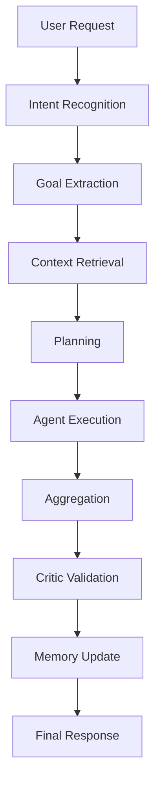

Each stage exists to solve a specific reasoning problem.

Skipping stages is discouraged unless explicitly documented.

---

## 29.1 Stage Definitions

### Intent Recognition

Determine what the user is trying to accomplish.

Examples:

- Ask a question
- Compare alternatives
- Build a plan
- Evaluate a decision
- Forecast outcomes

---

### Goal Extraction

Translate natural language into structured objectives.

Example:

"I want to buy a house in five years."

becomes

Goal:

- Purchase home

Constraint:

- Five-year horizon

Priority:

- High

---

### Context Retrieval

Relevant long-term context is retrieved before planning begins.

Examples include:

- financial goals
- spending behavior
- investment preferences
- prior recommendations
- user feedback
- risk tolerance

---

### Planning

The Planner determines:

- required capabilities
- participating agents
- execution order
- dependencies
- validation strategy

---

### Agent Execution

Selected agents perform specialized reasoning.

Each execution produces structured outputs rather than conversational text.

---

### Aggregation

The Planner combines independent reasoning results into a unified intermediate recommendation.

Aggregation is intentionally separate from validation.

---

### Validation

The Critic evaluates:

- consistency
- completeness
- unsupported claims
- conflicting recommendations
- confidence

---

### Memory Update

Only validated information should be persisted.

Rejected or uncertain reasoning should not become long-term memory.

---

# 30. Planner Execution Model

The Planner is the architectural brain of WalletMind.

Its purpose is coordination—not expertise.

---

## 30.1 Planner Responsibilities

The Planner owns:

- intent recognition
- goal extraction
- capability discovery
- task decomposition
- dependency analysis
- execution scheduling
- result aggregation
- retry orchestration
- confidence synthesis

---

## 30.2 Planner Workflow

```mermaid
flowchart TD

Intent

--> Goal

--> Constraints

--> Capability Discovery

--> Task Graph

--> Scheduling

--> Agent Execution

--> Aggregation

--> Critic

--> Final Response
```

The Planner must never embed domain-specific financial logic.

---

## 30.3 Dynamic Capability Discovery

Agent selection should always be data-driven.

Example:

User Goal:

> "I want to retire ten years earlier."

Planner may activate:

- Goal Planning Agent
- Investment Agent
- Cash Flow Agent
- Risk Agent

Budget analysis may not be required.

Conversely:

User Goal:

> "Help me reduce grocery expenses."

Planner may invoke only:

- Budget Agent

This dynamic behavior is fundamental to WalletMind.

---

# 31. Agent Execution Model

Agents perform reasoning.

They do not orchestrate.

---

## 31.1 Agent Lifecycle

Every agent follows the same lifecycle.

```mermaid
flowchart LR

Input

--> Validation

--> Reasoning

--> Evidence

--> Confidence

--> Structured Output
```

---

## 31.2 Agent Responsibilities

Every agent should:

- understand assigned task
- retrieve required context
- perform reasoning
- generate evidence
- estimate confidence
- return structured output

Agents must never directly invoke other agents.

---

## 31.3 Agent Independence

Agents should remain independent of:

- implementation details
- internal planner state
- UI logic
- storage implementation
- external infrastructure

This allows agents to evolve independently.

---

# 32. Communication Model

WalletMind uses structured communication throughout the architecture.

Natural language is reserved for user interaction.

Machine-to-machine communication should remain structured.

---

## 32.1 Message Contract

Every message should include:

| Field      | Purpose             |
| ---------- | ------------------- |
| Request ID | Traceability        |
| Task ID    | Execution tracking  |
| Agent ID   | Ownership           |
| Capability | Requested reasoning |
| Input      | Structured request  |
| Context    | Relevant memory     |
| Output     | Structured result   |
| Confidence | Estimated certainty |
| Metadata   | Diagnostics         |

---

## 32.2 Communication Principles

Communication should be:

- explicit
- typed
- versioned
- deterministic
- observable

Implicit communication is prohibited.

---

# 33. Task Graph Model

Planner execution is modeled as a task graph rather than a sequential workflow.

```mermaid
flowchart TD

Goal

--> Budget Analysis

Goal

--> Investment Analysis

Goal

--> Risk Assessment

Budget Analysis

--> Recommendation

Investment Analysis

--> Recommendation

Risk Assessment

--> Recommendation
```

Tasks may execute sequentially or in parallel depending on dependencies.

---

## 33.1 Task Types

The Planner supports several task categories.

| Type       | Purpose                     |
| ---------- | --------------------------- |
| Analysis   | Evaluate financial state    |
| Forecast   | Predict future outcomes     |
| Planning   | Build strategies            |
| Validation | Verify recommendations      |
| Memory     | Retrieve or persist context |

---

## 33.2 Parallel Execution

Independent tasks should execute concurrently whenever possible.

Benefits include:

- reduced latency
- modular execution
- improved scalability
- clearer reasoning boundaries

---

# 34. Failure Handling Strategy

Failures are expected.

Architecture should degrade gracefully.

---

## 34.1 Failure Categories

| Failure            | Example                 |
| ------------------ | ----------------------- |
| Tool Failure       | API unavailable         |
| Agent Failure      | Invalid output          |
| Planner Failure    | Missing capability      |
| Memory Failure     | Retrieval timeout       |
| Validation Failure | Contradictory reasoning |

---

## 34.2 Retry Strategy

Retries should occur only when meaningful.

Examples:

Retry:

- transient tool failure
- malformed structured output
- incomplete reasoning

Do not retry:

- unsupported user requests
- policy restrictions
- invalid user input

---

## 34.3 Graceful Degradation

If one capability is unavailable, the Planner should determine whether a partial recommendation remains appropriate.

Partial results should clearly communicate any limitations.

---

# 35. Validation Architecture

Validation is a mandatory architectural stage.

Recommendations should not be delivered directly from reasoning agents.

---

## 35.1 Critic Responsibilities

The Critic evaluates:

- logical consistency
- unsupported assumptions
- conflicting evidence
- completeness
- confidence alignment

---

## 35.2 Validation Outcomes

Possible outcomes include:

| Result       | Action                        |
| ------------ | ----------------------------- |
| Pass         | Continue                      |
| Minor Issues | Planner refines response      |
| Major Issues | Retry execution               |
| Failure      | Return transparent limitation |

---

## 35.3 Confidence Philosophy

Confidence represents the system's assessment of its recommendation quality.

Confidence should never imply certainty.

Whenever confidence is reduced, the system should explain why.

---

# 36. Extensibility Model

WalletMind is designed for continuous expansion.

Adding capabilities should require extension rather than modification.

Examples include:

- Retirement Agent
- Insurance Agent
- Tax Planning Agent
- Education Planning Agent

Existing agents should remain unchanged whenever possible.

---

## 36.1 Plugin Philosophy

Future components should integrate through documented interfaces rather than internal implementation details.

Extension points include:

- new agents
- new tools
- new planners
- additional memories
- evaluation modules

---

# 37. Architectural Anti-Patterns

The following patterns are prohibited.

### God Agent

One agent responsible for multiple unrelated reasoning domains.

---

### Planner Bypass

Components communicating without Planner coordination unless explicitly documented.

---

### Hidden Memory

Persistent state maintained inside agents.

---

### Undocumented Contracts

Message formats that exist only in implementation.

---

### Circular Dependencies

Agents depending upon each other's internal behavior.

---

### Implicit Reasoning

Recommendations that cannot explain how they were produced.

---

# 38. Architecture Review Checklist

Every architectural change should be evaluated using the following checklist.

| Question                                     | Required       |
| -------------------------------------------- | -------------- |
| Does it preserve Planner ownership?          | ✓              |
| Does it reduce coupling?                     | ✓              |
| Does it improve explainability?              | ✓              |
| Does it maintain structured contracts?       | ✓              |
| Does it preserve modularity?                 | ✓              |
| Does it introduce undocumented dependencies? | Must be **No** |
| Does it require an ADR?                      | Evaluate       |

If any answer violates the architectural principles defined in Parts I–III, the proposed change should be reviewed before implementation.

---

# Part IIIB Summary

Parts IIIA and IIIB together establish the engineering philosophy and core architecture of WalletMind. They define the boundaries, responsibilities, execution lifecycle, and interaction model that every subsystem must follow.

Subsequent sections of the Engineering Design Bible will build upon this foundation by specifying the detailed design of the Planner, Agent Ecosystem, Memory System, Model Context Protocol (MCP), Security Model, Repository Standards, and Engineering Workflow.

> **Architecture is the contract. Implementation is an expression of that contract.**

# Part IVA — Planner Architecture

> **Purpose**
>
> The Planner is the central orchestration engine of WalletMind. It is responsible for transforming an ambiguous user request into an executable reasoning plan by selecting the appropriate capabilities, coordinating specialized agents, managing execution state, and synthesizing a validated response.
>
> The Planner is intentionally designed as an orchestrator rather than a domain expert. Financial reasoning belongs to specialized agents; orchestration belongs exclusively to the Planner.

---

# Table of Contents

39. Planner Overview
40. Planner Objectives
41. Planner Responsibilities
42. Planner Execution Pipeline
43. Intent Recognition
44. Goal Extraction
45. Constraint Detection
46. Capability Discovery
47. Task Graph Generation
48. Execution Scheduling
49. Result Aggregation
50. Retry & Recovery Strategy
51. Confidence Synthesis
52. Planner Design Principles

---

# 39. Planner Overview

The Planner is the first reasoning component invoked for every user request.

No agent, tool, or memory operation should execute before the Planner has determined the execution strategy.

The Planner answers a single architectural question:

> **"Given the user's objective and current context, what is the best reasoning strategy?"**

It does **not** answer financial questions directly.

Instead, it coordinates the specialists that do.

---

## 39.1 Architectural Position

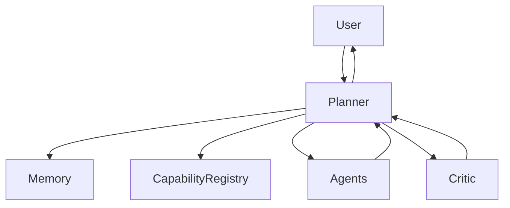

The Planner acts as the coordination hub for the entire system.

---

## 39.2 Design Goals

The Planner is designed to:

- understand user intent
- convert natural language into structured objectives
- discover required capabilities
- generate execution plans
- coordinate specialized agents
- manage dependencies
- aggregate results
- coordinate validation
- produce explainable execution traces

---

# 40. Planner Objectives

The Planner exists to satisfy the following objectives.

| Objective      | Description                                   |
| -------------- | --------------------------------------------- |
| Orchestration  | Coordinate reasoning without performing it    |
| Adaptability   | Select execution dynamically based on context |
| Explainability | Produce traceable execution decisions         |
| Efficiency     | Avoid unnecessary agent execution             |
| Robustness     | Recover gracefully from failures              |
| Extensibility  | Support new capabilities without redesign     |

These objectives should guide all future Planner enhancements.

---

# 41. Planner Responsibilities

The Planner owns orchestration and nothing else.

Its responsibilities include:

- Intent recognition
- Goal extraction
- Constraint identification
- Context retrieval requests
- Capability discovery
- Task decomposition
- Task graph construction
- Scheduling
- Parallel execution decisions
- Dependency management
- Result aggregation
- Validation coordination
- Retry orchestration
- Confidence synthesis

The Planner must never:

- perform budgeting calculations
- assess investment risk
- forecast cash flow
- permanently store user data
- bypass the Critic for significant recommendations

---

# 42. Planner Execution Pipeline

Every request follows the same conceptual pipeline.


Each stage has a clearly defined purpose.

---

## Stage 1 — Intent Recognition

Determine what the user wants to accomplish.

---

## Stage 2 — Goal Extraction

Convert conversational language into structured objectives.

---

## Stage 3 — Constraint Detection

Identify limitations that influence planning.

Examples include:

- budget limits
- target dates
- risk tolerance
- geographic constraints
- income uncertainty

---

## Stage 4 — Context Retrieval

Retrieve only the information required for planning.

The Planner should request context, not directly query storage.

---

## Stage 5 — Capability Discovery

Determine which reasoning capabilities are required.

Capabilities—not agents—are planned first.

---

## Stage 6 — Task Planning

Construct a directed task graph describing execution.

---

## Stage 7 — Execution

Dispatch tasks to the appropriate agents.

---

## Stage 8 — Aggregation

Merge outputs into a coherent intermediate recommendation.

---

## Stage 9 — Validation

Forward aggregated reasoning to the Critic.

---

## Stage 10 — Response

Produce an explainable recommendation for the user.

---

# 43. Intent Recognition

Intent recognition determines the fundamental purpose of the interaction.

Typical intent categories include:

| Intent       | Example                        |
| ------------ | ------------------------------ |
| Planning     | "Help me retire early."        |
| Analysis     | "Why did my savings decrease?" |
| Optimization | "Reduce my monthly expenses."  |
| Comparison   | "Rent or buy?"                 |
| Simulation   | "What if my income drops?"     |
| Education    | "Explain compound interest."   |

Intent recognition influences every downstream planning decision.

---

## Multiple Intents

Requests may contain several intents.

Example:

> "Can I buy a house and continue investing?"

Planner identifies:

- Home purchase planning
- Investment planning
- Trade-off analysis

This results in multiple coordinated tasks.

---

# 44. Goal Extraction

Goals represent structured planning objectives.

Example:

User Input:

> I want to buy a house in five years while maintaining an emergency fund.

Extracted Goals:

| Goal                    | Priority |
| ----------------------- | -------- |
| Purchase a home         | High     |
| Maintain emergency fund | High     |

The Planner should preserve multiple simultaneous goals.

---

## Goal Hierarchy

Goals may contain sub-goals.

```text
Primary Goal
│
├── Save Down Payment
├── Maintain Emergency Fund
└── Reduce Debt
```

The Planner should maintain these relationships throughout execution.

---

# 45. Constraint Detection

Constraints define the boundaries within which planning occurs.

Examples include:

- available income
- timeline
- acceptable risk
- existing debt
- liquidity requirements
- family obligations

Constraints influence:

- capability selection
- task ordering
- recommendation generation

---

## Constraint Categories

| Category   | Example                     |
| ---------- | --------------------------- |
| Financial  | Monthly budget              |
| Temporal   | Five-year target            |
| Personal   | Dependents                  |
| Behavioral | Conservative investor       |
| Regulatory | Jurisdiction-specific rules |

Constraints are first-class planning inputs.

---

# 46. Capability Discovery

The Planner reasons about **capabilities**, not implementations.

Example:

Goal:

> Reduce financial stress.

Required capabilities may include:

- spending analysis
- cash-flow forecasting
- emergency planning

The Capability Registry maps these capabilities to specific agents.

This indirection allows new agents to be introduced without changing Planner logic.

---

## Capability Selection Principles

The Planner should:

- execute only necessary capabilities
- avoid redundant reasoning
- reuse existing capabilities
- support future expansion

---

# 47. Task Graph Generation

After discovering capabilities, the Planner constructs a directed task graph.

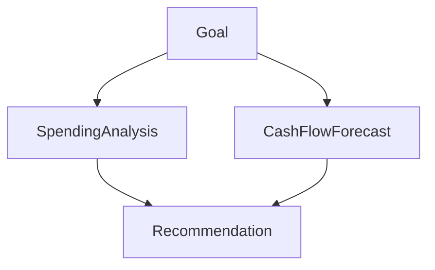

The graph represents logical dependencies rather than execution order.

---

## Task Types

WalletMind supports multiple task categories.

| Type       | Description                |
| ---------- | -------------------------- |
| Analysis   | Evaluate current state     |
| Forecast   | Predict future outcomes    |
| Planning   | Build strategies           |
| Validation | Review outputs             |
| Memory     | Retrieve or update context |

Every task must define:

- owner
- inputs
- outputs
- dependencies
- completion criteria

---

# 48. Execution Scheduling

The Planner converts the task graph into an execution schedule.

Scheduling decisions include:

- sequential execution
- parallel execution
- dependency ordering
- retry sequencing

---

## Parallel Execution

Independent tasks should execute concurrently.

Example:

```text
Goal

↓

Budget Analysis
        ╲
         ╲
          ╲
Cash Flow Analysis

↓

Aggregation
```

Parallel execution reduces latency without sacrificing modularity.

---

## Dependency Resolution

Some tasks require upstream outputs.

Example:

Retirement recommendation depends on:

- cash-flow forecast
- investment analysis
- risk assessment

The Planner should delay dependent tasks until prerequisites are satisfied.

---

# 49. Result Aggregation

Agent outputs must be combined into a coherent intermediate recommendation.

Aggregation responsibilities include:

- removing duplication
- resolving terminology
- preserving evidence
- maintaining traceability
- highlighting disagreements

Aggregation should never invent new reasoning.

---

## Conflict Handling

Agents may disagree.

Example:

Investment Agent:

> Increase equity exposure.

Risk Agent:

> Reduce portfolio volatility.

The Planner should preserve both viewpoints and delegate conflict resolution to the Critic.

---

# 50. Retry & Recovery Strategy

Failures are expected in distributed reasoning systems.

The Planner should classify failures before retrying.

| Failure                   | Retry? |
| ------------------------- | ------ |
| Temporary tool timeout    | Yes    |
| Invalid structured output | Yes    |
| Missing required input    | No     |
| Unsupported request       | No     |
| Policy restriction        | No     |

Retries should be targeted rather than repeating the entire workflow.

---

## Recovery Principles

Recovery should:

- preserve completed work
- retry only failed tasks
- avoid duplicate execution
- maintain execution trace integrity

---

# 51. Confidence Synthesis

Each agent produces an individual confidence estimate.

The Planner synthesizes these into an overall execution confidence.

Confidence should consider:

- agreement between agents
- completeness of information
- quality of retrieved context
- validation outcome
- unresolved assumptions

Confidence is an aid to interpretation—not a guarantee of correctness.

---

## Presenting Confidence

Recommendations should communicate:

- overall confidence
- contributing factors
- known limitations
- assumptions requiring user confirmation

This transparency helps users make informed decisions.

---

# 52. Planner Design Principles

Every future enhancement to the Planner must satisfy the following principles.

| Principle                  | Description                                           |
| -------------------------- | ----------------------------------------------------- |
| Planner Owns Coordination  | Orchestration belongs exclusively to the Planner      |
| Capabilities Before Agents | Plan using capabilities, then resolve implementations |
| Dynamic Planning           | Never hardcode execution paths                        |
| Stateless Planning         | Persistent knowledge belongs to Memory                |
| Explainable Decisions      | Every planning decision should be traceable           |
| Minimize Work              | Execute only required capabilities                    |
| Preserve Modularity        | Planner should remain independent of agent internals  |

---

# Part IVA Summary

The Planner is the architectural heart of WalletMind. It transforms user intent into structured execution plans, coordinates specialized reasoning components, and ensures that every recommendation is explainable, validated, and context-aware.

Subsequent sections will define the **Agent Ecosystem**, including each agent's responsibilities, lifecycle, capability contracts, and interaction patterns, building directly upon the Planner architecture specified here.

# Part IVA — Planner Architecture

> **Purpose**
>
> The Planner is the central orchestration engine of WalletMind. It is responsible for transforming an ambiguous user request into an executable reasoning plan by selecting the appropriate capabilities, coordinating specialized agents, managing execution state, and synthesizing a validated response.
>
> The Planner is intentionally designed as an orchestrator rather than a domain expert. Financial reasoning belongs to specialized agents; orchestration belongs exclusively to the Planner.

---

# Table of Contents

39. Planner Overview
40. Planner Objectives
41. Planner Responsibilities
42. Planner Execution Pipeline
43. Intent Recognition
44. Goal Extraction
45. Constraint Detection
46. Capability Discovery
47. Task Graph Generation
48. Execution Scheduling
49. Result Aggregation
50. Retry & Recovery Strategy
51. Confidence Synthesis
52. Planner Design Principles

---

# 39. Planner Overview

The Planner is the first reasoning component invoked for every user request.

No agent, tool, or memory operation should execute before the Planner has determined the execution strategy.

The Planner answers a single architectural question:

> **"Given the user's objective and current context, what is the best reasoning strategy?"**

It does **not** answer financial questions directly.

Instead, it coordinates the specialists that do.

---

## 39.1 Architectural Position


The Planner acts as the coordination hub for the entire system.

---

## 39.2 Design Goals

The Planner is designed to:

- understand user intent
- convert natural language into structured objectives
- discover required capabilities
- generate execution plans
- coordinate specialized agents
- manage dependencies
- aggregate results
- coordinate validation
- produce explainable execution traces

---

# 40. Planner Objectives

The Planner exists to satisfy the following objectives.

| Objective      | Description                                   |
| -------------- | --------------------------------------------- |
| Orchestration  | Coordinate reasoning without performing it    |
| Adaptability   | Select execution dynamically based on context |
| Explainability | Produce traceable execution decisions         |
| Efficiency     | Avoid unnecessary agent execution             |
| Robustness     | Recover gracefully from failures              |
| Extensibility  | Support new capabilities without redesign     |

These objectives should guide all future Planner enhancements.

---

# 41. Planner Responsibilities

The Planner owns orchestration and nothing else.

Its responsibilities include:

- Intent recognition
- Goal extraction
- Constraint identification
- Context retrieval requests
- Capability discovery
- Task decomposition
- Task graph construction
- Scheduling
- Parallel execution decisions
- Dependency management
- Result aggregation
- Validation coordination
- Retry orchestration
- Confidence synthesis

The Planner must never:

- perform budgeting calculations
- assess investment risk
- forecast cash flow
- permanently store user data
- bypass the Critic for significant recommendations

---

# 42. Planner Execution Pipeline

Every request follows the same conceptual pipeline.


Each stage has a clearly defined purpose.

---

## Stage 1 — Intent Recognition

Determine what the user wants to accomplish.

---

## Stage 2 — Goal Extraction

Convert conversational language into structured objectives.

---

## Stage 3 — Constraint Detection

Identify limitations that influence planning.

Examples include:

- budget limits
- target dates
- risk tolerance
- geographic constraints
- income uncertainty

---

## Stage 4 — Context Retrieval

Retrieve only the information required for planning.

The Planner should request context, not directly query storage.

---

## Stage 5 — Capability Discovery

Determine which reasoning capabilities are required.

Capabilities—not agents—are planned first.

---

## Stage 6 — Task Planning

Construct a directed task graph describing execution.

---

## Stage 7 — Execution

Dispatch tasks to the appropriate agents.

---

## Stage 8 — Aggregation

Merge outputs into a coherent intermediate recommendation.

---

## Stage 9 — Validation

Forward aggregated reasoning to the Critic.

---

## Stage 10 — Response

Produce an explainable recommendation for the user.

---

# 43. Intent Recognition

Intent recognition determines the fundamental purpose of the interaction.

Typical intent categories include:

| Intent       | Example                        |
| ------------ | ------------------------------ |
| Planning     | "Help me retire early."        |
| Analysis     | "Why did my savings decrease?" |
| Optimization | "Reduce my monthly expenses."  |
| Comparison   | "Rent or buy?"                 |
| Simulation   | "What if my income drops?"     |
| Education    | "Explain compound interest."   |

Intent recognition influences every downstream planning decision.

---

## Multiple Intents

Requests may contain several intents.

Example:

> "Can I buy a house and continue investing?"

Planner identifies:

- Home purchase planning
- Investment planning
- Trade-off analysis

This results in multiple coordinated tasks.

---

# 44. Goal Extraction

Goals represent structured planning objectives.

Example:

User Input:

> I want to buy a house in five years while maintaining an emergency fund.

Extracted Goals:

| Goal                    | Priority |
| ----------------------- | -------- |
| Purchase a home         | High     |
| Maintain emergency fund | High     |

The Planner should preserve multiple simultaneous goals.

---

## Goal Hierarchy

Goals may contain sub-goals.

```text
Primary Goal
│
├── Save Down Payment
├── Maintain Emergency Fund
└── Reduce Debt
```

The Planner should maintain these relationships throughout execution.

---

# 45. Constraint Detection

Constraints define the boundaries within which planning occurs.

Examples include:

- available income
- timeline
- acceptable risk
- existing debt
- liquidity requirements
- family obligations

Constraints influence:

- capability selection
- task ordering
- recommendation generation

---

## Constraint Categories

| Category   | Example                     |
| ---------- | --------------------------- |
| Financial  | Monthly budget              |
| Temporal   | Five-year target            |
| Personal   | Dependents                  |
| Behavioral | Conservative investor       |
| Regulatory | Jurisdiction-specific rules |

Constraints are first-class planning inputs.

---

# 46. Capability Discovery

The Planner reasons about **capabilities**, not implementations.

Example:

Goal:

> Reduce financial stress.

Required capabilities may include:

- spending analysis
- cash-flow forecasting
- emergency planning

The Capability Registry maps these capabilities to specific agents.

This indirection allows new agents to be introduced without changing Planner logic.

---

## Capability Selection Principles

The Planner should:

- execute only necessary capabilities
- avoid redundant reasoning
- reuse existing capabilities
- support future expansion

---

# 47. Task Graph Generation

After discovering capabilities, the Planner constructs a directed task graph.


The graph represents logical dependencies rather than execution order.

---

## Task Types

WalletMind supports multiple task categories.

| Type       | Description                |
| ---------- | -------------------------- |
| Analysis   | Evaluate current state     |
| Forecast   | Predict future outcomes    |
| Planning   | Build strategies           |
| Validation | Review outputs             |
| Memory     | Retrieve or update context |

Every task must define:

- owner
- inputs
- outputs
- dependencies
- completion criteria

---

# 48. Execution Scheduling

The Planner converts the task graph into an execution schedule.

Scheduling decisions include:

- sequential execution
- parallel execution
- dependency ordering
- retry sequencing

---

## Parallel Execution

Independent tasks should execute concurrently.

Example:

```text
Goal

↓

Budget Analysis
        ╲
         ╲
          ╲
Cash Flow Analysis

↓

Aggregation
```

Parallel execution reduces latency without sacrificing modularity.

---

## Dependency Resolution

Some tasks require upstream outputs.

Example:

Retirement recommendation depends on:

- cash-flow forecast
- investment analysis
- risk assessment

The Planner should delay dependent tasks until prerequisites are satisfied.

---

# 49. Result Aggregation

Agent outputs must be combined into a coherent intermediate recommendation.

Aggregation responsibilities include:

- removing duplication
- resolving terminology
- preserving evidence
- maintaining traceability
- highlighting disagreements

Aggregation should never invent new reasoning.

---

## Conflict Handling

Agents may disagree.

Example:

Investment Agent:

> Increase equity exposure.

Risk Agent:

> Reduce portfolio volatility.

The Planner should preserve both viewpoints and delegate conflict resolution to the Critic.

---

# 50. Retry & Recovery Strategy

Failures are expected in distributed reasoning systems.

The Planner should classify failures before retrying.

| Failure                   | Retry? |
| ------------------------- | ------ |
| Temporary tool timeout    | Yes    |
| Invalid structured output | Yes    |
| Missing required input    | No     |
| Unsupported request       | No     |
| Policy restriction        | No     |

Retries should be targeted rather than repeating the entire workflow.

---

## Recovery Principles

Recovery should:

- preserve completed work
- retry only failed tasks
- avoid duplicate execution
- maintain execution trace integrity

---

# 51. Confidence Synthesis

Each agent produces an individual confidence estimate.

The Planner synthesizes these into an overall execution confidence.

Confidence should consider:

- agreement between agents
- completeness of information
- quality of retrieved context
- validation outcome
- unresolved assumptions

Confidence is an aid to interpretation—not a guarantee of correctness.

---

## Presenting Confidence

Recommendations should communicate:

- overall confidence
- contributing factors
- known limitations
- assumptions requiring user confirmation

This transparency helps users make informed decisions.

---

# 52. Planner Design Principles

Every future enhancement to the Planner must satisfy the following principles.

| Principle                  | Description                                           |
| -------------------------- | ----------------------------------------------------- |
| Planner Owns Coordination  | Orchestration belongs exclusively to the Planner      |
| Capabilities Before Agents | Plan using capabilities, then resolve implementations |
| Dynamic Planning           | Never hardcode execution paths                        |
| Stateless Planning         | Persistent knowledge belongs to Memory                |
| Explainable Decisions      | Every planning decision should be traceable           |
| Minimize Work              | Execute only required capabilities                    |
| Preserve Modularity        | Planner should remain independent of agent internals  |

---

# Part IVA Summary

The Planner is the architectural heart of WalletMind. It transforms user intent into structured execution plans, coordinates specialized reasoning components, and ensures that every recommendation is explainable, validated, and context-aware.

Subsequent sections will define the **Agent Ecosystem**, including each agent's responsibilities, lifecycle, capability contracts, and interaction patterns, building directly upon the Planner architecture specified here.

# Part IVB-2 — Specialized Financial Reasoning Agents

> **Purpose**
>
> This section defines the remaining domain-specific reasoning agents responsible for financial forecasting, investment analysis, and risk assessment. These agents are invoked exclusively by the Planner and must conform to the lifecycle, contracts, and design principles established in Part IVB-1.

---

# Table of Contents

62. Cash Flow Agent
63. Investment Agent
64. Risk Assessment Agent

---

# 62. Cash Flow Agent

## 62.1 Purpose

The Cash Flow Agent evaluates a user's expected income, expenses, and liquidity over time. Its primary responsibility is to forecast financial capacity under current assumptions and identify potential cash flow risks.

Unlike the Budget Agent, which analyzes historical spending patterns, the Cash Flow Agent focuses on **future financial movement**.

---

## 62.2 Responsibilities

The Cash Flow Agent owns:

- income forecasting
- expense forecasting
- recurring payment analysis
- liquidity projections
- emergency fund runway estimation
- cash surplus or deficit identification
- scenario-based cash flow simulation

The Cash Flow Agent does **not** own:

- investment recommendations
- budget optimization
- risk scoring
- goal prioritization

---

## 62.3 Inputs

Planner provides:

- current income
- recurring expenses
- historical spending trends
- savings balance
- liabilities
- user goals
- planning horizon
- relevant memory context

---

## 62.4 Outputs

| Output             | Description              |
| ------------------ | ------------------------ |
| Forecast Summary   | High-level projection    |
| Monthly Cash Flow  | Predicted inflow/outflow |
| Liquidity Analysis | Expected available funds |
| Risks              | Potential cash shortages |
| Assumptions        | Forecast assumptions     |
| Confidence         | Forecast confidence      |
| Metadata           | Execution diagnostics    |

---

## 62.5 Example Execution

User Goal:

> "Can I afford to take a six-month career break?"

Planner invokes:

- Cash Flow Agent

Agent determines:

- projected expenses
- emergency fund duration
- monthly burn rate
- expected liquidity

Planner forwards results to downstream agents if required.

---

## 62.6 Success Criteria

The Cash Flow Agent succeeds when forecasts are:

- internally consistent
- assumption-driven
- transparent
- explainable
- useful for downstream planning

---

# 63. Investment Agent

## 63.1 Purpose

The Investment Agent evaluates investment-related questions in the context of the user's overall financial objectives.

Its responsibility is **strategic reasoning**, not investment execution.

---

## 63.2 Responsibilities

Owns:

- portfolio evaluation
- diversification analysis
- allocation review
- investment goal alignment
- long-term growth reasoning
- portfolio trade-off analysis

Does not own:

- brokerage integration
- order execution
- market prediction
- financial regulation

---

## 63.3 Guiding Principles

Recommendations should:

- align with user goals
- respect risk tolerance
- acknowledge uncertainty
- explain assumptions
- avoid deterministic guarantees

---

## 63.4 Inputs

Planner provides:

- investment holdings
- user objectives
- planning horizon
- risk profile
- cash flow projections
- financial constraints
- historical preferences

---

## 63.5 Outputs

| Output            | Description                 |
| ----------------- | --------------------------- |
| Portfolio Summary | Current investment position |
| Goal Alignment    | Alignment with objectives   |
| Trade-offs        | Benefits and drawbacks      |
| Recommendations   | Suggested strategic actions |
| Confidence        | Reasoning confidence        |
| Assumptions       | Required assumptions        |

---

## 63.6 Example Execution

User Goal:

> "Should I invest more or pay down debt?"

Planner invokes:

- Investment Agent
- Risk Assessment Agent
- Cash Flow Agent

The Investment Agent evaluates investment implications while remaining independent of debt optimization logic.

---

## 63.7 Success Criteria

Recommendations should be:

- goal-aware
- evidence-backed
- appropriately cautious
- transparent regarding uncertainty

---

# 64. Risk Assessment Agent

## 64.1 Purpose

The Risk Assessment Agent identifies financial vulnerabilities that may affect the feasibility or safety of recommendations produced by other agents.

It acts as the system's financial risk specialist.

---

## 64.2 Responsibilities

Owns:

- liquidity risk assessment
- debt exposure analysis
- concentration risk
- emergency preparedness evaluation
- scenario risk identification
- financial resilience assessment

Does not own:

- budgeting
- investment planning
- goal decomposition
- recommendation synthesis

---

## 64.3 Inputs

Planner provides:

- cash flow projections
- liabilities
- income stability
- investment exposure
- emergency savings
- user preferences
- planning objectives

---

## 64.4 Outputs

| Output              | Description         |
| ------------------- | ------------------- |
| Risk Summary        | Overall assessment  |
| Identified Risks    | Structured list     |
| Severity            | Low / Medium / High |
| Supporting Evidence | Observations        |
| Mitigation Options  | Possible actions    |
| Confidence          | Assessment quality  |

---

## 64.5 Risk Categories

| Category   | Example                        |
| ---------- | ------------------------------ |
| Liquidity  | Insufficient emergency savings |
| Income     | Dependence on one employer     |
| Debt       | High repayment burden          |
| Investment | Over-concentration             |
| Goal       | Unrealistic timeline           |

---

## 64.6 Example

User Goal:

> "Can I retire five years earlier?"

The Risk Assessment Agent evaluates whether the proposed strategy introduces unacceptable financial risks before recommendations reach the user.

---

## 64.7 Success Criteria

Risk assessments should be:

- proportional
- evidence-based
- understandable
- actionable
- free from unsupported certainty

---

# Part IVB-2 Summary

These agents extend WalletMind's reasoning capabilities beyond historical analysis into forecasting, investment evaluation, and financial resilience. Together they provide the Planner with specialized domain expertise while preserving strict separation of responsibilities.

# Part IVB-3 — Recommendation & Validation Agents

> **Purpose**
>
> This section defines the agents responsible for synthesizing recommendations and validating reasoning before results are presented to the user.

---

# Table of Contents

65. Insights Agent
66. Critic Agent

---

# 65. Insights Agent

## 65.1 Purpose

The Insights Agent converts validated analytical outputs into coherent, user-centered recommendations.

It does **not** perform new financial analysis. Instead, it synthesizes evidence generated by other agents.

---

## 65.2 Responsibilities

Owns:

- recommendation synthesis
- prioritization of actions
- explanation generation
- trade-off communication
- action sequencing

Does not own:

- forecasting
- budgeting
- investment reasoning
- validation

---

## 65.3 Inputs

Planner provides:

- aggregated agent outputs
- supporting evidence
- user goals
- confidence scores
- relevant memory

---

## 65.4 Outputs

| Output              | Description               |
| ------------------- | ------------------------- |
| Executive Summary   | High-level recommendation |
| Recommended Actions | Ordered action plan       |
| Supporting Evidence | Key reasoning             |
| Trade-offs          | Benefits and costs        |
| Assumptions         | Important conditions      |
| Confidence          | Overall confidence        |

---

## 65.5 Design Principles

Recommendations should:

- remain actionable
- avoid unnecessary complexity
- prioritize user goals
- communicate uncertainty
- preserve traceability

---

# 66. Critic Agent

## 66.1 Purpose

The Critic Agent is WalletMind's quality assurance layer.

No significant recommendation should be delivered without Critic review.

---

## 66.2 Responsibilities

The Critic evaluates:

- logical consistency
- contradictory findings
- unsupported assumptions
- completeness
- confidence alignment
- policy compliance

---

## 66.3 Validation Workflow

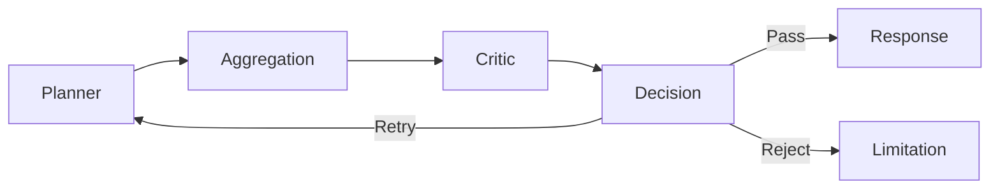

---

## 66.4 Validation Outcomes

| Result       | Planner Action                |
| ------------ | ----------------------------- |
| Pass         | Deliver response              |
| Minor Issues | Refine response               |
| Major Issues | Retry selected tasks          |
| Failure      | Return transparent limitation |

---

## 66.5 Confidence Review

The Critic reviews whether:

- evidence supports conclusions
- confidence matches evidence quality
- assumptions are disclosed
- recommendations remain internally consistent

---

## 66.6 Design Principles

The Critic should be:

- conservative
- evidence-driven
- transparent
- deterministic where possible
- independent of reasoning agents

---

# Part IVB-3 Summary

The Insights Agent transforms specialized analyses into understandable guidance, while the Critic Agent safeguards quality through independent validation. Together they ensure that WalletMind produces recommendations that are both useful and trustworthy.

# Part IVB-4 — Agent Registration, Capability Registry & Evaluation

> **Purpose**
>
> This section specifies how agents are registered, discovered, evaluated, and governed throughout the WalletMind architecture.

---

# Table of Contents

67. Agent Registration
68. Capability Registry Extensions
69. Tool Ownership
70. Agent Evaluation
71. Part IVB Summary

---

# 67. Agent Registration

Every production agent must register its capabilities before it can participate in Planner execution.

Registration metadata includes:

| Field         | Purpose                            |
| ------------- | ---------------------------------- |
| Agent ID      | Unique identifier                  |
| Version       | Compatibility tracking             |
| Capabilities  | Supported reasoning domains        |
| Input Schema  | Accepted requests                  |
| Output Schema | Structured responses               |
| Dependencies  | Required tools or services         |
| Status        | Active / Deprecated / Experimental |

The Planner should never invoke unregistered agents.

---

# 68. Capability Registry Extensions

The Capability Registry provides an abstraction layer between planning and implementation.

```mermaid
flowchart TD

Planner
-->
CapabilityRegistry

CapabilityRegistry
--> BudgetAgent

CapabilityRegistry
--> CashFlowAgent

CapabilityRegistry
--> InvestmentAgent

CapabilityRegistry
--> RiskAgent

CapabilityRegistry
--> InsightsAgent

CapabilityRegistry
--> CriticAgent
```

Future capabilities (e.g., Retirement Planning, Insurance Analysis, Tax Planning) should be added through the registry without requiring Planner redesign.

---

# 69. Tool Ownership

Agents own reasoning, while tools own external interactions.

| Tool Category         | Typical Owner         |
| --------------------- | --------------------- |
| Transaction Retrieval | Budget Agent          |
| Market Data           | Investment Agent      |
| Forecast Models       | Cash Flow Agent       |
| Risk Calculators      | Risk Assessment Agent |
| Memory Retrieval      | Planner (coordinated) |

Tools should:

- be stateless
- expose deterministic interfaces
- avoid business reasoning
- return structured outputs

---

# 70. Agent Evaluation

Each agent should be evaluated independently before system-level testing.

Evaluation dimensions include:

| Dimension         | Success Indicator                            |
| ----------------- | -------------------------------------------- |
| Correctness       | Accurate reasoning                           |
| Explainability    | Clear evidence and assumptions               |
| Schema Compliance | Valid structured output                      |
| Robustness        | Graceful handling of incomplete data         |
| Latency           | Acceptable execution time                    |
| Consistency       | Stable recommendations for equivalent inputs |

System-wide evaluation should additionally verify:

- correct Planner orchestration
- appropriate capability selection
- successful Critic validation
- memory consistency
- execution trace completeness

---

# 71. Part IVB Summary

The Agent Ecosystem defines WalletMind's reasoning workforce. Each agent owns a narrowly defined capability, operates through standardized contracts, and collaborates exclusively through the Planner.

Key architectural guarantees established in Part IVB are:

- Every capability has a single owner.
- Agents remain stateless and independently testable.
- Planner coordinates all collaboration.
- Memory owns persistence.
- Tools own external interactions.
- The Critic validates significant recommendations before delivery.
- New capabilities are introduced through registration and the Capability Registry rather than Planner modification.

These principles ensure that WalletMind remains modular, explainable, extensible, and aligned with the planner-centric architecture established throughout the Engineering Design Bible.

# Part VA — Memory Philosophy & Architecture

> **Purpose**
>
> Memory is one of the foundational capabilities that differentiates WalletMind from a traditional chatbot or financial dashboard. Rather than treating every interaction as an isolated conversation, WalletMind maintains structured, persistent knowledge about the user's financial context, goals, preferences, and historical decisions.
>
> This chapter establishes the architectural philosophy governing the Memory subsystem. It defines why memory exists, what responsibilities it owns, how it interacts with the Planner and Agents, and the guiding principles that all future memory implementations must follow.

---

# Table of Contents

72. Memory Philosophy
73. Why Memory Matters
74. Memory Design Principles
75. Memory Architecture Overview
76. Memory Layers
77. Memory Ownership
78. Memory Lifecycle

---

# 72. Memory Philosophy

## 72.1 Memory as a Core Capability

Memory is not an optimization.

Memory is a **core architectural capability**.

Without memory, WalletMind behaves like a traditional conversational AI that forgets prior interactions after each request.

With memory, WalletMind becomes a long-term financial concierge capable of understanding:

- financial goals
- personal preferences
- historical recommendations
- changing circumstances
- behavioral patterns
- long-term planning context

Memory transforms isolated conversations into continuous financial guidance.

---

## 72.2 Design Intent

The Memory subsystem exists to answer one architectural question:

> **"What should the system remember in order to make better future decisions?"**

The answer is not "everything."

WalletMind intentionally stores only information that improves future reasoning while respecting privacy, transparency, and user control.

---

## 72.3 Memory vs Conversation History

Conversation history is not memory.

Conversation history records **what was said**.

Memory captures **what was learned**.

Example:

Conversation:

> "I want to retire by age 55."

Memory:

```text
Goal:
Retire at age 55

Priority:
High

Created:
2026-07-01

Status:
Active
```

This distinction allows WalletMind to retain meaningful knowledge rather than replaying previous conversations.

---

# 73. Why Memory Matters

## 73.1 Financial Planning is Long-Term

Financial planning is fundamentally longitudinal.

Decisions made today often influence outcomes months or years later.

Examples include:

- retirement planning
- debt reduction
- education savings
- home ownership
- investment growth

A reasoning system without persistent memory cannot maintain continuity across these long-term objectives.

---

## 73.2 Personalization Requires Memory

Meaningful personalization depends upon accumulated knowledge.

WalletMind should remember:

- recurring goals
- preferred planning style
- investment preferences
- risk appetite
- feedback on previous recommendations
- important life events

Without this context, every recommendation begins from zero.

---

## 73.3 Memory Improves Reasoning

Persistent context enables the Planner and Agents to:

- avoid redundant questions
- identify conflicting goals
- compare current decisions with historical behavior
- adapt recommendations
- provide continuity across sessions

Memory is therefore a reasoning multiplier rather than a storage mechanism.

---

# 74. Memory Design Principles

The following principles govern every component of the Memory subsystem.

---

## 74.1 Structured Knowledge

Memory should store structured knowledge rather than raw conversations whenever possible.

Preferred:

```text
Goal:
Emergency Fund

Target:
₹600,000

Current Progress:
₹240,000
```

Avoid:

```text
User once mentioned wanting an emergency fund.
```

Structured memory improves retrieval, validation, and explainability.

---

## 74.2 Planner-Controlled Access

The Planner owns memory orchestration.

Agents should never retrieve arbitrary memories independently.

Instead:

```mermaid
flowchart LR

Planner --> Memory

Memory --> Planner

Planner --> Agent
```

This preserves centralized context management and minimizes unnecessary data access.

---

## 74.3 Minimal Context Principle

Only the information required for the current reasoning task should be retrieved.

Benefits include:

- reduced context size
- improved reasoning quality
- lower inference cost
- enhanced privacy

Memory retrieval should be purposeful rather than exhaustive.

---

## 74.4 Explainable Memory

Every recommendation should be able to answer:

- Which memories influenced this recommendation?
- Why were those memories retrieved?
- When were they created?
- Are they still valid?

Users should never be surprised by remembered information.

---

## 74.5 User-Centric Ownership

The user's financial profile belongs to the user.

WalletMind manages memory on the user's behalf but should support:

- inspection
- correction
- deletion
- updates

Transparency is essential for trust.

---

# 75. Memory Architecture Overview

WalletMind separates memory into distinct architectural layers.

```mermaid
flowchart TD

Planner

--> Memory Manager

Memory Manager

--> Short-Term Memory

Memory Manager

--> Long-Term Memory

Memory Manager

--> Semantic Index

Memory Manager

--> Knowledge Store

Agents --> Planner
```

The Memory Manager acts as the gateway between reasoning components and persistent storage.

---

## 75.1 Architectural Responsibilities

| Component       | Responsibility                        |
| --------------- | ------------------------------------- |
| Planner         | Requests required context             |
| Memory Manager  | Coordinates retrieval and persistence |
| Memory Store    | Stores structured information         |
| Semantic Index  | Enables similarity search             |
| Knowledge Store | Shared system knowledge               |

This separation allows memory technologies to evolve without affecting Planner logic.

---

# 76. Memory Layers

WalletMind distinguishes multiple forms of memory.

Each serves a different purpose.

---

## 76.1 Request Memory

Lifetime:

One Planner execution.

Contains:

- active tasks
- execution graph
- temporary variables
- intermediate results

Destroyed after request completion.

---

## 76.2 Session Memory

Lifetime:

Current interaction.

Contains:

- conversation context
- clarifications
- unresolved questions
- temporary assumptions

Expires when the session ends unless promoted.

---

## 76.3 Long-Term User Memory

Lifetime:

Persistent.

Contains:

- financial goals
- user preferences
- investment style
- risk appetite
- financial profile
- historical recommendations

This layer powers personalization.

---

## 76.4 Shared Knowledge Memory

Stores information that is not user-specific.

Examples include:

- financial concepts
- planning heuristics
- product knowledge
- policy references

This memory is shared across all users.

---

## 76.5 Semantic Memory

Supports retrieval based on meaning rather than exact matching.

Example:

User asks:

> "How close am I to buying a home?"

Semantic retrieval may identify:

- mortgage goal
- savings milestones
- previous affordability analyses

without requiring identical wording.

---

# 77. Memory Ownership

Ownership is a key architectural principle.

Every memory object has exactly one owner.

| Memory Type      | Owner             |
| ---------------- | ----------------- |
| Request State    | Planner           |
| Session State    | Planner           |
| User Profile     | Memory Manager    |
| Financial Goals  | Memory Manager    |
| Shared Knowledge | Knowledge Service |
| Semantic Index   | Retrieval Engine  |

Agents consume memory but do not own it.

---

## 77.1 Write Responsibilities

Only designated components may modify memory.

| Operation             | Owner                      |
| --------------------- | -------------------------- |
| Create Goal           | Planner via Memory Manager |
| Update Preference     | Planner via Memory Manager |
| Store Recommendation  | Planner via Memory Manager |
| Store Execution Trace | Planner                    |
| Update Knowledge Base | Administrative process     |

Restricting write access preserves consistency.

---

# 78. Memory Lifecycle

Every memory object follows a controlled lifecycle.

```mermaid
flowchart LR

Created

-->

Validated

-->

Stored

-->

Retrieved

-->

Updated

-->

Archived

-->

Deleted
```

---

## 78.1 Creation

New memories originate from:

- explicit user input
- validated Planner outputs
- confirmed preferences
- accepted recommendations

Speculative reasoning should never be stored directly.

---

## 78.2 Validation

Before persistence, memory should be checked for:

- completeness
- schema compliance
- duplication
- consistency
- ownership

Invalid memory should be rejected.

---

## 78.3 Retrieval

Memory retrieval should be:

- relevant
- explainable
- minimal
- deterministic where possible

The Planner decides what information is needed.

---

## 78.4 Updates

Existing memories evolve over time.

Examples:

- goal progress
- income changes
- preference updates
- life events

Updates should preserve historical integrity where appropriate.

---

## 78.5 Archival

Inactive memories may be archived when they are:

- completed
- superseded
- obsolete

Archived memories remain available for historical reasoning but are excluded from normal retrieval.

---

## 78.6 Deletion

Users should be able to request deletion of their stored memories.

Deletion should:

- remove personal information
- preserve system integrity
- maintain auditability where required
- comply with applicable privacy policies

---

# Part VA Summary

The Memory subsystem is a foundational component of WalletMind's architecture. It enables long-term reasoning, personalization, and continuity while preserving transparency, modularity, and user trust.

The principles established in this chapter define **why** memory exists and **how** it should behave. Subsequent chapters will specify the concrete memory models, retrieval strategies, governance policies, and evaluation framework that implement this philosophy.

> **Architectural Principle:** Memory should capture knowledge that improves future reasoning—not simply preserve past conversations.

# Part VB-1 — Memory Model Specification

## User Profile Memory & Financial Profile Memory

> **Purpose**
>
> This chapter defines the foundational memory objects that represent a WalletMind user.
>
> Unlike conversational AI systems that retain chat history, WalletMind maintains structured domain knowledge describing the user's identity, financial circumstances, preferences, and planning context.
>
> These memory objects form the foundation upon which every Planner decision, Agent execution, recommendation, and long-term reasoning process is built.
>
> Every future memory model extends these foundational schemas.

---

# Table of Contents

79. Memory Object Model
80. Canonical Memory Principles
81. User Profile Memory
82. Financial Profile Memory

---

# 79. Memory Object Model

## 79.1 Philosophy

Memory in WalletMind is modeled as a collection of structured knowledge objects.

Rather than storing conversations, the system stores facts.

For example,

Instead of remembering:

> "The user mentioned wanting to retire by 55."

WalletMind stores:

```text
Goal

Type:
Retirement

Target Age:
55

Priority:
High

Status:
Active

Confidence:
Confirmed
```

Knowledge becomes queryable, versionable, explainable, and reusable across future planning sessions.

---

## 79.2 Memory Object Definition

Every memory object represents a single domain concept.

Examples include:

- User Profile
- Financial Profile
- Financial Goal
- User Preference
- Investment Preference
- Life Event
- Recommendation
- Behavioral Pattern

Each object owns its own lifecycle.

---

## 79.3 Canonical Memory Structure

Every persistent memory object must contain common metadata.

| Field       | Purpose                     |
| ----------- | --------------------------- |
| Memory ID   | Globally unique identifier  |
| Memory Type | Object category             |
| Owner       | User identifier             |
| Created At  | Creation timestamp          |
| Updated At  | Last modification           |
| Source      | Origin of information       |
| Confidence  | Reliability estimate        |
| Status      | Active / Archived / Deleted |
| Version     | Schema version              |

Example

```json
{
  "memory_id": "goal-000142",
  "memory_type": "financial_goal",
  "owner": "user-001",
  "created_at": "2026-07-01T10:15:00Z",
  "updated_at": "2026-07-01T10:15:00Z",
  "source": "planner",
  "confidence": 0.98,
  "status": "active",
  "schema_version": "1.0"
}
```

---

## 79.4 Memory Classification

WalletMind classifies memories by purpose rather than storage technology.

```mermaid
flowchart TD

Memory

--> Identity

Memory

--> Financial

Memory

--> Goals

Memory

--> Preferences

Memory

--> Behavioral

Memory

--> Episodic

Memory

--> Semantic

Memory

--> Recommendations
```

Each category follows independent validation rules.

---

## 79.5 Memory Relationships

Memory objects rarely exist independently.

Example

```text
User Profile

↓

Financial Profile

↓

Financial Goals

↓

Recommendations

↓

Behavior Updates
```

These relationships enable richer reasoning than isolated memory entries.

---

# 80. Canonical Memory Principles

Every persistent memory implementation must satisfy the following principles.

---

## 80.1 Single Source of Truth

Every fact should exist exactly once.

Incorrect

Income

↓

User Profile

↓

Financial Profile

↓

Budget Agent Cache

↓

Planner Cache

Correct

Income

↓

Financial Profile

↓

Referenced Everywhere

Duplication introduces inconsistency.

---

## 80.2 Schema Before Storage

Memory objects must be validated against documented schemas before persistence.

The Memory subsystem should reject:

- missing fields
- invalid values
- duplicate identifiers
- inconsistent relationships

No undocumented fields are permitted.

---

## 80.3 Planner-Controlled Persistence

Only the Planner may request permanent memory updates.

Agents may recommend memory changes.

They never write memory directly.

Architecture

```mermaid
flowchart LR

Agent

-->

Planner

-->

Memory Manager

-->

Storage
```

This prevents uncontrolled memory mutation.

---

## 80.4 Versioned Memory

Schemas evolve.

Old memories must remain readable.

Every memory object therefore contains:

- schema version
- migration path
- compatibility metadata

Memory evolution should never require deleting historical information.

---

## 80.5 Explainable Memory

Every memory retrieved during reasoning should answer:

- Why was this retrieved?
- Which Planner decision requested it?
- Which recommendation depends upon it?

Memory should never become invisible system state.

---

# 81. User Profile Memory

## 81.1 Purpose

User Profile Memory stores stable personal characteristics that influence reasoning.

It answers:

> "Who is this user?"

This memory changes infrequently.

---

## 81.2 Responsibilities

Stores:

- preferred name
- age range
- household composition
- occupation
- employment status
- country
- currency
- language
- timezone

Does not store:

- financial transactions
- investment portfolio
- recommendations
- planner execution state

---

## 81.3 Ownership

Owner

Memory Manager

Consumers

- Planner
- Goal Planning Agent
- Budget Agent
- Risk Agent
- Investment Agent

---

## 81.4 Update Frequency

Updated only when:

- user edits profile
- verified life event occurs
- employment changes
- residency changes

Not updated during ordinary Planner execution.

---

## 81.5 Canonical Schema

```yaml
UserProfile

user_id:

display_name:

country:

currency:

language:

timezone:

employment_status:

occupation:

household_size:

dependents:

created_at:

updated_at:
```

---

## 81.6 Example

```yaml
user_id: user-001

display_name: Alex

country: India

currency: INR

language: English

timezone: Asia/Kolkata

employment_status: Salaried

occupation: Software Engineer

household_size: 3

dependents: 1
```

---

## 81.7 Design Principles

The User Profile should be:

- stable
- concise
- verified
- privacy-aware

Temporary information belongs elsewhere.

---

# 82. Financial Profile Memory

## 82.1 Purpose

Financial Profile Memory represents the user's current financial position.

It answers:

> "What is this user's financial situation?"

Unlike the User Profile, this object changes continuously.

---

## 82.2 Responsibilities

Stores:

- monthly income
- recurring expenses
- assets
- liabilities
- savings
- emergency fund
- investment balance
- debt
- insurance coverage

Does not store:

- recommendations
- goals
- planner tasks
- execution history

---

## 82.3 Ownership

Owner

Memory Manager

Primary Producers

- Planner
- Verified Financial Imports
- User Updates

Primary Consumers

- Budget Agent
- Cash Flow Agent
- Investment Agent
- Risk Assessment Agent

---

## 82.4 Canonical Schema

```yaml
FinancialProfile

monthly_income:

monthly_expenses:

cash_balance:

emergency_fund:

investments:

total_assets:

total_liabilities:

debt:

credit_score_optional:

last_updated:
```

---

## 82.5 Derived Metrics

Some values are calculated rather than stored.

Examples

- savings rate
- debt-to-income ratio
- liquidity ratio
- investment allocation
- emergency fund runway

Derived metrics should be recalculated when source values change.

---

## 82.6 Example

```yaml
monthly_income: 180000

monthly_expenses: 90000

cash_balance: 420000

emergency_fund: 600000

investments: 3500000

total_assets: 4700000

total_liabilities: 950000

debt: 450000
```

---

## 82.7 Planner Usage

During planning,

Planner may retrieve only the required subset.

Example

User

"I want to buy a car."

Planner retrieves

✓ income

✓ savings

✓ liabilities

Planner does **not** retrieve

✗ investment allocation

✗ retirement goals

✗ recommendation history

This follows the **Minimal Context Principle** established in Part VA.

---

## 82.8 Validation Rules

Financial Profile updates must satisfy:

- monetary values are non-negative where applicable
- currencies remain consistent
- derived metrics are recalculated
- historical snapshots preserved when required
- updates timestamped
- source identified

Invalid financial updates must be rejected.

---

# Part VB-1 Summary

This chapter establishes the two foundational memory objects upon which the remainder of WalletMind's Memory subsystem is built.

The **User Profile Memory** captures stable identity and contextual attributes that shape personalization, while the **Financial Profile Memory** represents the user's evolving financial state. Together they provide the Planner and specialized Agents with a trusted, structured understanding of _who the user is_ and _what their current financial situation looks like_.

Subsequent chapters extend this foundation with **Goals Memory**, **Preference Memory**, **Constraint Memory**, and **Life Event Memory**, enabling WalletMind to reason not only about a user's current state but also about their long-term intentions and evolving circumstances.

# Part VB-2 — Goal Memory, Preference Memory, Constraint Memory & Life Event Memory

> **Purpose**
>
> While the User Profile and Financial Profile describe **who the user is** and **their current financial position**, the memory models defined in this chapter describe **what the user wants**, **how they prefer to achieve it**, **what limitations they operate under**, and **which significant life events influence future planning**.
>
> These memory models allow WalletMind to reason beyond static financial information and continuously adapt recommendations as the user's circumstances evolve.

---

# Table of Contents

83. Goal Memory
84. Preference Memory
85. Constraint Memory
86. Life Event Memory

---

# 83. Goal Memory

## 83.1 Purpose

Goal Memory is the most important persistent memory within WalletMind.

It captures the user's long-term financial objectives and enables the Planner to reason across multiple sessions.

Unlike temporary Planner goals, Goal Memory represents **persistent intentions**.

Examples include:

- Purchase a home
- Retire early
- Build an emergency fund
- Pay off debt
- Save for children's education
- Start a business
- Achieve financial independence

---

## 83.2 Why Goal Memory Exists

Traditional finance applications organize around transactions.

WalletMind organizes around goals.

Goals become the central planning objects that drive:

- Planner decisions
- Agent selection
- Recommendation prioritization
- Memory retrieval
- Progress tracking

Every recommendation should ultimately support one or more goals.

---

## 83.3 Ownership

Owner

Memory Manager

Primary Producers

- Planner
- Goal Planning Agent
- User

Primary Consumers

- Planner
- Budget Agent
- Investment Agent
- Cash Flow Agent
- Risk Assessment Agent
- Insights Agent

---

## 83.4 Goal Lifecycle

Every goal follows the same lifecycle.

```mermaid
flowchart LR

Created

-->

Validated

-->

Active

-->

Updated

-->

Completed

-->

Archived
```

Goals should never disappear silently.

Historical goals remain valuable for behavioral reasoning.

---

## 83.5 Goal Categories

WalletMind supports multiple goal categories.

| Category               | Examples             |
| ---------------------- | -------------------- |
| Savings                | Emergency fund       |
| Asset Purchase         | Home, vehicle        |
| Debt                   | Loan repayment       |
| Investment             | Portfolio growth     |
| Retirement             | Early retirement     |
| Education              | Tuition planning     |
| Lifestyle              | Career break, travel |
| Financial Independence | FIRE                 |

Future categories should extend rather than replace existing ones.

---

## 83.6 Canonical Schema

```yaml
GoalMemory

goal_id:

title:

category:

priority:

status:

target_value:

current_progress:

target_date:

dependencies:

constraints:

created_at:

updated_at:
```

---

## 83.7 Goal Relationships

Goals frequently depend upon one another.

Example

```text
Purchase Home

↓

Emergency Fund Complete

↓

Debt Below Target

↓

Down Payment Saved
```

Planner should preserve these relationships during execution.

---

## 83.8 Goal Priority

Each goal should contain:

- urgency
- importance
- planning horizon

Priority should never be inferred solely from creation date.

---

# 84. Preference Memory

## 84.1 Purpose

Preference Memory captures how the user prefers recommendations to be generated.

It answers:

> "How should WalletMind reason for this user?"

Preferences influence reasoning rather than financial facts.

---

## 84.2 Examples

Examples include:

- conservative investing
- aggressive saving
- minimal debt
- sustainable spending
- monthly reporting
- detailed explanations
- short recommendations

---

## 84.3 Ownership

Owner

Memory Manager

Updated by

- User
- Planner (only after explicit confirmation)

Agents must never infer permanent preferences without user approval.

---

## 84.4 Canonical Schema

```yaml
PreferenceMemory

investment_style:

risk_tolerance:

budgeting_style:

notification_preferences:

preferred_currency:

report_detail_level:

communication_style:

updated_at:
```

---

## 84.5 Preference Categories

| Category      | Examples                 |
| ------------- | ------------------------ |
| Communication | Brief, detailed          |
| Planning      | Conservative, aggressive |
| Investment    | Growth, income           |
| Budgeting     | Strict, flexible         |
| Reporting     | Weekly, monthly          |

---

## 84.6 Design Principles

Preferences should be:

- user-controlled
- editable
- transparent
- versioned
- explainable

WalletMind should never silently change user preferences.

---

# 85. Constraint Memory

## 85.1 Purpose

Constraint Memory stores persistent limitations that influence planning.

Constraints define what recommendations are realistic.

They are different from goals.

Goals define:

> What the user wants.

Constraints define:

> What the user must work within.

---

## 85.2 Examples

Examples include:

- maximum monthly budget
- retirement age limit
- required emergency fund
- debt obligations
- family commitments
- relocation restrictions

---

## 85.3 Planner Usage

During planning,

constraints influence:

- capability selection
- recommendation filtering
- scenario simulation
- optimization

Planner should always consider constraints before generating task graphs.

---

## 85.4 Canonical Schema

```yaml
ConstraintMemory

constraint_id:

type:

description:

severity:

effective_date:

expiration_date:

source:

status:
```

---

## 85.5 Constraint Categories

| Category   | Examples                  |
| ---------- | ------------------------- |
| Financial  | Budget ceiling            |
| Time       | Deadline                  |
| Legal      | Regulatory requirement    |
| Personal   | Dependents                |
| Health     | Medical expenses          |
| Geographic | Country-specific planning |

---

## 85.6 Validation

Constraints should be:

- explicit
- measurable
- time-aware
- independently verifiable when possible

Hidden constraints should not exist.

---

# 86. Life Event Memory

## 86.1 Purpose

Life Event Memory records major events that materially change financial planning.

Examples include:

- marriage
- divorce
- birth of child
- job loss
- career change
- relocation
- inheritance
- retirement
- major illness

These events frequently trigger Planner replanning.

---

## 86.2 Why Life Events Matter

Financial reasoning changes significantly after major life events.

Example

Job Loss

↓

Cash Flow Changes

↓

Emergency Fund Usage

↓

Risk Assessment

↓

Budget Optimization

↓

Updated Recommendations

Without Life Event Memory, WalletMind cannot adapt effectively.

---

## 86.3 Ownership

Owner

Memory Manager

Created by

- User
- Planner (after confirmation)

Consumers

All planning agents

---

## 86.4 Event Lifecycle

```mermaid
flowchart LR

Detected

-->

Confirmed

-->

Stored

-->

Referenced

-->

Archived
```

Only confirmed events become permanent memory.

---

## 86.5 Canonical Schema

```yaml
LifeEventMemory

event_id:

event_type:

event_date:

description:

financial_impact:

status:

source:

created_at:

updated_at:
```

---

## 86.6 Financial Impact

Every life event should include an estimated financial impact.

Example

```yaml
Event

Job Loss

Impact

Income Reduction

Expected Duration

Unknown

Confidence

High
```

This information assists Planner decision making.

---

## 86.7 Design Principles

Life events should be:

- verified
- timestamped
- explainable
- auditable
- revisable

Incorrect life events should be correctable without deleting historical records.

---

# Memory Relationships

The memory models introduced so far form the core of WalletMind's long-term user understanding.

```mermaid
flowchart TD

UserProfile

-->

FinancialProfile

FinancialProfile

-->

GoalMemory

GoalMemory

-->

ConstraintMemory

GoalMemory

-->

PreferenceMemory

LifeEventMemory

-->

FinancialProfile

LifeEventMemory

-->

GoalMemory

PreferenceMemory

-->

Planner
```

These relationships allow the Planner to construct richer execution plans using interconnected knowledge rather than isolated facts.

---

# Design Rules

The memory models defined in Parts VB-1 and VB-2 must satisfy the following architectural rules.

| Rule               | Requirement                                    |
| ------------------ | ---------------------------------------------- |
| Single Ownership   | Every memory object has exactly one owner      |
| Planner Controlled | Planner requests updates                       |
| Structured         | All memory follows documented schemas          |
| Explainable        | Every retrieved memory must be traceable       |
| Versioned          | Schema evolution must preserve compatibility   |
| User Controlled    | Users may inspect and modify personal memories |
| Minimal Retrieval  | Retrieve only required context                 |

---

# Part VB-2 Summary

This chapter extends WalletMind's persistent memory model from **identity** and **financial state** into **intent**, **behavioral preferences**, **planning constraints**, and **life events**.

Together, these memory objects enable the Planner to answer four fundamental questions:

1. **Who is the user?** (User Profile)
2. **What is their financial situation?** (Financial Profile)
3. **What are they trying to achieve?** (Goal Memory)
4. **How should the system reason for them?** (Preferences, Constraints, and Life Events)

These models form the core knowledge graph that supports personalized, long-horizon financial reasoning across every Planner execution.

# Part VB-3 — Behavioral Memory, Recommendation Memory, Episodic Memory & Conversation Memory

> **Purpose**
>
> The memories defined in this chapter capture how the user behaves over time, how the system has previously advised them, what significant reasoning episodes have occurred, and what temporary conversational context should be preserved during active interactions.
>
> Unlike User Profile or Goal Memory, these memory models evolve continuously and enable WalletMind to improve recommendations through experience rather than repetition.

---

# Table of Contents

87. Behavioral Memory
88. Recommendation Memory
89. Episodic Memory
90. Conversation Memory

---

# 87. Behavioral Memory

## Purpose

Behavioral Memory captures **patterns**, not individual events.

It enables WalletMind to learn how users actually manage money instead of relying only on what they say.

Example observations:

- saves immediately after salary
- consistently exceeds dining budget
- ignores investment recommendations
- frequently pays bills late
- maintains emergency fund
- prefers conservative decisions

Behavior should emerge from repeated observations rather than single transactions.

---

## Ownership

Owner

Memory Manager

Produced by

- Planner
- Analytics Engine
- Behavioral Analysis

Consumed by

- Budget Agent
- Risk Agent
- Goal Planning Agent
- Insights Agent

---

## Categories

| Category  | Example                |
| --------- | ---------------------- |
| Spending  | Overspends weekends    |
| Saving    | Saves 20% monthly      |
| Investing | Avoids equity          |
| Debt      | Pays early             |
| Planning  | Delays long-term goals |

---

## Canonical Schema

```yaml
BehaviorMemory

behavior_id:

category:

description:

frequency:

confidence:

first_observed:

last_observed:

supporting_events:
```

---

## Design Rules

Behavior should be:

- evidence-based
- explainable
- continuously updated
- reversible if new evidence appears

Behavior is inferred—not assumed.

---

# 88. Recommendation Memory

## Purpose

Recommendation Memory records every significant recommendation made by WalletMind and the user's response.

This allows the system to avoid repeating ineffective advice and measure long-term recommendation quality.

---

## Why It Exists

Without Recommendation Memory:

Planner repeatedly suggests the same actions.

With Recommendation Memory:

Planner understands:

- accepted advice
- rejected advice
- ignored advice
- completed advice
- abandoned plans

---

## Recommendation Lifecycle

```mermaid
flowchart LR

Generated

-->

Presented

-->

Accepted

-->

Completed

OR

Rejected

OR

Ignored
```

---

## Schema

```yaml
RecommendationMemory

recommendation_id:

goal:

summary:

supporting_agents:

confidence:

status:

user_feedback:

created_at:

completed_at:
```

---

## Planner Usage

Before producing recommendations Planner should ask:

- Have we suggested this before?
- Was it accepted?
- Did it improve outcomes?
- Should we propose an alternative?

---

# 89. Episodic Memory

## Purpose

Episodic Memory stores significant planning sessions rather than permanent facts.

It answers:

"What happened during an important planning event?"

Examples:

- retirement planning session
- first home affordability analysis
- job loss planning
- emergency fund review

---

## Difference From Goal Memory

Goal Memory

↓

Stores

Persistent Objective

Episodic Memory

↓

Stores

Planning Experience

---

## Schema

```yaml
EpisodeMemory

episode_id:

title:

goal:

planner_summary:

participating_agents:

key_findings:

recommendations:

timestamp:
```

---

## Retrieval

Episodes should be retrieved when they provide useful historical context.

Example:

User

"I'm reconsidering buying a house."

Planner retrieves

Previous affordability analysis.

---

# 90. Conversation Memory

## Purpose

Conversation Memory stores temporary context required during an active interaction.

It is **not** permanent memory.

---

## Contents

Examples

- clarification questions
- temporary assumptions
- unfinished reasoning
- partial planner outputs
- current execution state

---

## Lifetime

Conversation Memory exists only for the active session.

At session completion:

Planner decides whether information should become:

- Goal Memory
- Preference Memory
- Behavioral Memory

or be discarded.

---

## Promotion Rules

Permanent memory requires:

- explicit confirmation
- sufficient confidence
- architectural ownership

Conversation should never automatically become permanent memory.

---

## Schema

```yaml
ConversationMemory

session_id:

active_goal:

pending_questions:

temporary_context:

planner_state:

created_at:

expires_at:
```

---

# Memory Relationships

```mermaid
flowchart TD

ConversationMemory

-->

Planner

Planner

-->

RecommendationMemory

Planner

-->

BehaviorMemory

Planner

-->

EpisodeMemory

GoalMemory

-->

EpisodeMemory

BehaviorMemory

-->

InsightsAgent

RecommendationMemory

-->

Planner
```

---

# Cross-Memory Principles

All memory objects must satisfy the following:

| Principle        | Description                    |
| ---------------- | ------------------------------ |
| Structured       | Schema validated               |
| Explainable      | Traceable origin               |
| Versioned        | Backward compatible            |
| Timestamped      | Full lifecycle                 |
| Confidence Aware | Confidence recorded            |
| User Controlled  | Editable where appropriate     |
| Planner Managed  | Updates coordinated by Planner |

---

# Memory Promotion Pipeline

```mermaid
flowchart LR

Conversation

-->

Planner Review

-->

Validation

-->

Memory Manager

-->

Persistent Memory
```

Only validated knowledge becomes permanent memory.

---

# Part VB-3 Summary

This chapter introduces four dynamic memory models that enable WalletMind to learn from experience.

Behavioral Memory captures long-term financial habits.

Recommendation Memory tracks the effectiveness of previous advice.

Episodic Memory preserves important planning sessions for future reference.

Conversation Memory maintains temporary execution context and serves as the staging area for future memory creation.

Together, these models allow WalletMind to evolve from a reactive assistant into a continuously learning financial concierge while preserving explainability, traceability, and user control.

# Part VB-4 — Semantic Memory, Knowledge Memory, Memory Graph & Canonical Schemas

> **Purpose**
>
> The previous chapters defined the individual memory objects that describe a user and their financial journey.
>
> This chapter defines how those memory objects become an interconnected knowledge system through semantic retrieval, shared knowledge, canonical schemas, validation, and graph relationships.
>
> Together, these components transform WalletMind from a collection of stored records into a continuously evolving financial knowledge graph capable of supporting intelligent planning over months and years.

---

# Table of Contents

91. Semantic Memory
92. Knowledge Memory
93. Memory Graph
94. Canonical Memory Schemas
95. Memory Validation
96. Memory Design Rules
97. Part VB Summary

---

# 91. Semantic Memory

## 91.1 Purpose

Semantic Memory enables WalletMind to retrieve information based on **meaning rather than exact matching**.

Instead of searching for identical words, the system retrieves conceptually related memories.

Example

User asks:

> "Can I finally buy my dream house?"

Planner should retrieve

- Home Purchase Goal
- Down Payment Progress
- Mortgage Analysis
- Previous House Planning Episode

even though the exact phrase _dream house_ never appeared previously.

---

## 91.2 Why Semantic Memory Exists

Traditional retrieval relies on keyword matching.

Financial planning requires contextual understanding.

Examples

Query

> I want more financial stability.

Relevant memories

- Emergency fund
- Income volatility
- Job loss episode
- Cash flow risks

Semantic retrieval allows Planner reasoning to remain natural and user-centric.

---

## 91.3 Responsibilities

Semantic Memory owns:

- embedding generation
- similarity search
- semantic ranking
- contextual retrieval
- relationship discovery

It does **not** own:

- Planner decisions
- recommendation generation
- validation
- persistent schema management

---

## 91.4 Semantic Index

Every eligible memory object should maintain a semantic representation.

Examples include:

- Goal Memory
- Recommendation Memory
- Behavioral Memory
- Episodic Memory
- Preference Memory

Certain structured values (IDs, timestamps) are indexed only as metadata rather than embeddings.

---

## 91.5 Retrieval Pipeline

```mermaid
flowchart LR

User Query

-->

Planner

-->

Semantic Search

-->

Relevant Memories

-->

Context Builder

-->

Planner
```

The Semantic Index supports retrieval but never determines which memories become final context.

Planner retains that responsibility.

---

# 92. Knowledge Memory

## 92.1 Purpose

Knowledge Memory stores information that is **not specific to any individual user**.

Unlike User Memory, this knowledge is shared across every Planner execution.

Examples include:

- financial planning heuristics
- budgeting frameworks
- investment concepts
- retirement guidelines
- inflation models
- financial terminology

---

## 92.2 Architectural Role

Knowledge Memory supplements reasoning.

It does not replace language model knowledge.

Instead it provides:

- curated information
- domain-specific guidance
- reusable financial concepts
- Planner reference material

---

## 92.3 Ownership

Owner

Knowledge Service

Consumers

- Planner
- Budget Agent
- Investment Agent
- Risk Assessment Agent
- Goal Planning Agent

Knowledge Memory is read-only during ordinary Planner execution.

---

## 92.4 Categories

| Category             | Examples                   |
| -------------------- | -------------------------- |
| Finance Concepts     | Inflation, diversification |
| Planning Frameworks  | 50/30/20 budgeting         |
| Risk Models          | Emergency fund heuristics  |
| Regulatory Knowledge | Region-specific guidance   |
| Product Knowledge    | Savings accounts, loans    |

---

# 93. Memory Graph

## 93.1 Philosophy

WalletMind should not treat memories as isolated records.

Instead, memories form a connected graph describing the user's financial life.

```mermaid
flowchart TD

User

--> UserProfile

UserProfile

--> FinancialProfile

FinancialProfile

--> GoalMemory

GoalMemory

--> RecommendationMemory

GoalMemory

--> BehavioralMemory

BehavioralMemory

--> EpisodicMemory

RecommendationMemory

--> LifeEventMemory

LifeEventMemory

--> FinancialProfile
```

The graph allows Planner reasoning to traverse relationships rather than searching independent objects.

---

## 93.2 Relationship Types

Memory objects may define relationships such as:

- depends_on
- supports
- replaces
- references
- derived_from
- influenced_by
- supersedes

Example

Emergency Fund Goal

↓

supports

↓

Home Purchase Goal

These relationships improve planning quality.

---

## 93.3 Planner Traversal

Planner should retrieve memory using graph traversal rather than exhaustive search.

Typical traversal

Goal

↓

Dependencies

↓

Relevant Behaviors

↓

Past Recommendations

↓

Life Events

↓

Financial Profile

↓

Context Assembly

Only the required subgraph should be loaded.

---

# 94. Canonical Memory Schemas

Every memory object follows a shared structural contract.

```yaml
MemoryObject

memory_id:

memory_type:

owner:

schema_version:

created_at:

updated_at:

status:

confidence:

source:

relationships:

metadata:

payload:
```

The payload contains memory-specific fields.

Metadata remains consistent across all memory types.

---

## 94.1 Required Metadata

Every object must define:

| Field      | Description                |
| ---------- | -------------------------- |
| Memory ID  | Globally unique identifier |
| Type       | Memory category            |
| Owner      | User                       |
| Source     | Origin                     |
| Confidence | Reliability                |
| Version    | Schema version             |
| Status     | Active, Archived, Deleted  |
| Created    | Creation timestamp         |
| Updated    | Modification timestamp     |

---

## 94.2 Confidence Metadata

Every memory stores confidence.

Example

```yaml
confidence

value: 0.96

source: UserConfirmed

last_verified: 2026-07-01
```

Planner should consider confidence during retrieval.

Lower confidence memories should not dominate reasoning.

---

# 95. Memory Validation

Before persistence every memory passes validation.

Validation includes:

- schema verification
- ownership verification
- duplicate detection
- relationship validation
- confidence verification
- timestamp verification

Invalid memory should never enter persistent storage.

---

## 95.1 Validation Pipeline

```mermaid
flowchart LR

Candidate Memory

-->

Schema Validation

-->

Relationship Validation

-->

Confidence Check

-->

Storage
```

---

## 95.2 Duplicate Detection

Examples

Incorrect

Two active retirement goals with identical targets.

Correct

One goal.

Updated over time.

Duplicate memory fragments reduce Planner consistency.

---

## 95.3 Relationship Validation

Memory relationships should never contain:

- cycles
- broken references
- unknown objects
- invalid ownership

Graph integrity must remain consistent.

---

# 96. Memory Design Rules

Every future memory implementation must satisfy these architectural rules.

---

## Rule 1

Memory stores knowledge.

Not conversations.

---

## Rule 2

Planner owns retrieval.

Agents consume context.

---

## Rule 3

Memory objects have one owner.

Never multiple.

---

## Rule 4

All memory is schema validated.

---

## Rule 5

Every memory has confidence.

---

## Rule 6

Every memory has provenance.

---

## Rule 7

Only validated information becomes persistent.

---

## Rule 8

Memory retrieval follows the Minimal Context Principle.

---

## Rule 9

Memory relationships are explicit.

Never implicit.

---

## Rule 10

Memory evolution must preserve backward compatibility.

---

# Memory Architecture Summary

```mermaid
flowchart TD

Planner

-->

Memory Manager

Memory Manager

--> User Profile

Memory Manager

--> Financial Profile

Memory Manager

--> Goals

Memory Manager

--> Preferences

Memory Manager

--> Constraints

Memory Manager

--> Life Events

Memory Manager

--> Behaviors

Memory Manager

--> Episodes

Memory Manager

--> Recommendations

Memory Manager

--> Semantic Index

Memory Manager

--> Knowledge Store
```

Memory Manager becomes the single architectural gateway to all persistent knowledge.

---

# 97. Part VB Summary

Parts VB-1 through VB-4 collectively define the canonical Memory Model Specification for WalletMind.

The Memory subsystem is organized around four foundational concepts:

- **Identity** — who the user is.
- **State** — the user's current financial position.
- **Intent** — what the user wants to achieve.
- **Experience** — what the system has learned over time.

Rather than storing isolated records, WalletMind maintains a structured financial knowledge graph that supports personalized, explainable, and long-horizon reasoning.

Every Planner execution should treat Memory as an active reasoning partner rather than a passive database.

This architecture enables WalletMind to evolve continuously while preserving consistency, traceability, extensibility, and user trust.

---

> **Architectural Principle**
>
> Memory should not answer questions.
>
> Memory should provide the Planner with the minimum validated knowledge required to reason effectively.

# Part VC — Retrieval & Context Assembly

> **Purpose**
>
> Having defined what WalletMind remembers, this chapter specifies **how memories are discovered, ranked, assembled, and delivered** to the Planner and specialized agents.
>
> The Retrieval & Context Assembly subsystem ensures that every reasoning task receives the **minimum, most relevant, and highest-quality context** required for execution. This improves reasoning quality, reduces hallucinations, minimizes token usage, and preserves user privacy.
>
> The Planner remains the sole orchestrator of context retrieval. Neither agents nor tools retrieve long-term memory directly.

---

# Table of Contents

98. Retrieval Philosophy
99. Context Retrieval Pipeline
100.  Retrieval Strategies
101.  Memory Ranking & Scoring
102.  Context Assembly
103.  Context Window Management
104.  Planner–Memory Interaction
105.  Agent–Memory Contracts
106.  Retrieval Optimization
107.  Context Validation
108.  Part VC Summary

---

# 98. Retrieval Philosophy

## 98.1 Context Is Not Memory

Memory stores knowledge.

Context is the subset of knowledge required for one reasoning task.

For example:

User asks:

> "Can I afford to buy a house in three years?"

WalletMind should **not** retrieve the user's complete financial history.

Instead, it retrieves only information relevant to answering that question.

---

## 98.2 Minimal Context Principle

WalletMind follows the principle:

> **Retrieve the minimum validated knowledge required for high-quality reasoning.**

Benefits include:

- improved reasoning quality
- lower inference cost
- fewer distractions for language models
- stronger privacy guarantees
- more deterministic execution

---

# 99. Context Retrieval Pipeline

Every Planner execution follows the same retrieval lifecycle.

```mermaid
flowchart LR

User Request

-->

Planner

-->

Capability Discovery

-->

Retrieval Request

-->

Memory Manager

-->

Memory Ranking

-->

Context Assembly

-->

Planner

-->

Agent Execution
```

The Planner defines **what is needed**.

The Memory Manager determines **where it exists**.

---

## 99.1 Retrieval Stages

| Stage           | Responsibility                       |
| --------------- | ------------------------------------ |
| Intent Analysis | Determine planning objective         |
| Context Request | Planner specifies required knowledge |
| Memory Search   | Identify candidate memories          |
| Ranking         | Order by relevance                   |
| Assembly        | Build execution context              |
| Validation      | Ensure completeness                  |
| Delivery        | Provide structured context           |

---

# 100. Retrieval Strategies

Different planning tasks require different retrieval strategies.

---

## 100.1 Direct Retrieval

Used when the Planner knows exactly which object is required.

Example:

Retrieve Financial Profile.

---

## 100.2 Semantic Retrieval

Used when meaning is more important than keywords.

Example:

User:

> "I feel financially stressed."

Planner retrieves:

- emergency fund status
- cash flow concerns
- recent recommendations
- debt obligations

---

## 100.3 Relationship Traversal

Uses the Memory Graph.

Example

Goal

↓

Dependencies

↓

Relevant Behaviors

↓

Life Events

↓

Recommendations

---

## 100.4 Hybrid Retrieval

Planner combines:

- structured lookup
- semantic similarity
- graph traversal

Hybrid retrieval should become the default strategy for complex planning tasks.

---

# 101. Memory Ranking & Scoring

Multiple memories may satisfy a retrieval request.

The Memory Manager ranks them before context assembly.

---

## 101.1 Ranking Factors

| Factor            | Description                  |
| ----------------- | ---------------------------- |
| Relevance         | Semantic similarity          |
| Confidence        | Reliability of memory        |
| Recency           | Freshness                    |
| Importance        | Planning significance        |
| Goal Alignment    | Relationship to active goals |
| User Confirmation | Explicitly confirmed by user |

---

## 101.2 Composite Score

Conceptually,

```text
Final Score

=

Relevance

+

Confidence

+

Importance

+

Recency

-

Conflict Penalty
```

Exact weighting is implementation specific.

---

## 101.3 Retrieval Priority

Highest priority:

- active goals
- active constraints
- recent life events

Lower priority:

- archived goals
- completed recommendations
- historical episodes

---

# 102. Context Assembly

The Context Builder transforms ranked memories into Planner-ready context.

It should not simply concatenate retrieved records.

Instead it constructs a coherent reasoning package.

---

## 102.1 Context Structure

Typical execution context includes:

```text
User Profile

↓

Financial Profile

↓

Active Goals

↓

Relevant Constraints

↓

Relevant Behaviors

↓

Relevant Episodes

↓

Relevant Recommendations

↓

Knowledge References
```

---

## 102.2 Assembly Rules

Context should be:

- ordered
- deduplicated
- schema validated
- confidence aware
- capability specific

---

## 102.3 Capability-Aware Assembly

Different agents require different context.

Example:

Budget Agent

Receives:

- expenses
- spending behavior
- savings goals

Investment Agent

Receives:

- portfolio
- risk tolerance
- investment goals

The Planner should never provide unnecessary context.

---

# 103. Context Window Management

Large language models operate within finite context windows.

WalletMind should actively manage context size.

---

## 103.1 Priority Levels

| Priority | Included                                |
| -------- | --------------------------------------- |
| Critical | Active goals, current financial profile |
| High     | Relevant preferences, constraints       |
| Medium   | Recent episodes                         |
| Low      | Archived history                        |

---

## 103.2 Compression

Older information may be summarized rather than discarded.

Example

Instead of:

Twenty recommendation objects

Planner receives:

"Previous budgeting recommendations were consistently accepted over the last six months."

Compression must preserve important reasoning signals.

---

# 104. Planner–Memory Interaction

The Planner is the only component authorized to coordinate retrieval.

```mermaid
flowchart TD

Planner

-->

Memory Manager

Memory Manager

-->

Context Builder

Context Builder

-->

Planner

Planner

-->

Agent
```

Agents consume prepared context only.

---

## 104.1 Planner Responsibilities

The Planner decides:

- what information is needed
- when retrieval occurs
- which memories are updated
- when persistence is required

---

# 105. Agent–Memory Contracts

Agents never retrieve persistent memory directly.

Instead they receive:

| Field                | Description               |
| -------------------- | ------------------------- |
| Context ID           | Retrieval identifier      |
| Relevant Memories    | Structured memory objects |
| Confidence Metadata  | Memory quality indicators |
| Knowledge References | Shared financial concepts |

This preserves architectural separation.

---

## 105.1 Agent Restrictions

Agents must not:

- query storage
- mutate persistent memory
- bypass the Planner
- cache long-term user data

---

# 106. Retrieval Optimization

Retrieval should improve over time.

Optimization opportunities include:

- semantic indexing
- graph caching
- frequently accessed memories
- incremental updates
- duplicate elimination

Optimization must never change retrieval correctness.

---

# 107. Context Validation

Before delivery, assembled context should be validated.

Validation checks include:

- schema compliance
- duplicate removal
- relationship integrity
- confidence thresholds
- required object presence

If required context cannot be assembled, the Planner should:

1. request clarification,
2. execute with reduced confidence, or
3. terminate gracefully with an explanation.

---

## 107.1 Missing Context

Example:

User asks:

> "Should I retire next year?"

Planner discovers:

Missing:

- retirement goal
- current investments

Planner requests clarification before continuing.

Incomplete context should never be silently fabricated.

---

# 108. Part VC Summary

Retrieval & Context Assembly transforms WalletMind's persistent knowledge into actionable reasoning context.

Rather than exposing the entire Memory subsystem to every agent, the Planner requests only the information required for the current task. The Memory Manager retrieves, ranks, validates, and assembles this information into structured context packages.

This architecture provides:

- personalized reasoning
- explainable context selection
- efficient context windows
- improved planner performance
- stronger privacy guarantees
- scalable long-term memory

# Part VD — Memory Governance & Evaluation

> **Purpose**
>
> Previous chapters defined **what WalletMind remembers** and **how memory is retrieved**.
>
> This chapter defines **how memory is governed throughout its lifecycle**.
>
> Governance ensures that WalletMind's long-term memory remains accurate, explainable, secure, auditable, privacy-preserving, and continuously useful.
>
> Memory should improve reasoning—not accumulate noise.

---

# Table of Contents

109. Memory Governance Philosophy
110. Memory Lifecycle Management
111. Memory Updates
112. Memory Versioning
113. Memory Retention
114. Memory Privacy
115. Memory Security
116. Memory Auditing
117. Memory Evaluation
118. Memory Failure Handling
119. Memory Quality Metrics
120. Future Memory Evolution
121. Part V Summary

---

# 109. Memory Governance Philosophy

## 109.1 Purpose

Memory governance defines the rules that ensure persistent knowledge remains:

- correct
- trustworthy
- explainable
- secure
- relevant

Unlike conversation history, persistent memory becomes part of future reasoning.

Poor memory quality directly reduces recommendation quality.

---

## 109.2 Governance Principles

WalletMind follows six governance principles.

| Principle      | Description                     |
| -------------- | ------------------------------- |
| Accuracy       | Store validated facts           |
| Transparency   | Explain stored information      |
| User Ownership | Users control personal memories |
| Traceability   | Every memory has provenance     |
| Minimality     | Store only useful knowledge     |
| Evolution      | Memory improves over time       |

---

# 110. Memory Lifecycle Management

Every memory object follows a managed lifecycle.

```mermaid
flowchart LR

Created

-->

Validated

-->

Stored

-->

Retrieved

-->

Updated

-->

Archived

-->

Deleted
```

No memory should bypass lifecycle validation.

---

## 110.1 Creation

Memory originates from:

- explicit user input
- confirmed Planner conclusions
- validated imports
- approved system updates

Speculative reasoning is never persisted.

---

## 110.2 Validation

Every candidate memory passes:

- schema validation
- relationship validation
- ownership validation
- confidence validation
- duplication detection

Only validated memories become persistent.

---

## 110.3 Retrieval

Retrieval should always be:

- explainable
- deterministic where possible
- confidence-aware
- minimal

---

## 110.4 Update

Updates modify existing memories while preserving history.

Example:

Emergency Fund Goal

Old Progress

↓

40%

New Progress

↓

55%

Historical versions remain recoverable.

---

## 110.5 Archive

Completed memories transition to archive.

Examples:

- completed goals
- finished recommendations
- expired constraints

Archived memories remain searchable but are excluded from ordinary planning.

---

## 110.6 Deletion

Deletion should occur only when:

- user requests removal
- legal requirements demand deletion
- data becomes invalid

Deletion policies must preserve system integrity.

---

# 111. Memory Updates

Memory updates must be intentional.

---

## 111.1 Update Sources

Updates may originate from:

| Source               | Allowed             |
| -------------------- | ------------------- |
| User                 | ✓                   |
| Planner              | ✓                   |
| Verified Import      | ✓                   |
| Agent Recommendation | Proposed only       |
| External API         | Requires validation |

Agents never update memory directly.

---

## 111.2 Update Workflow

```mermaid
flowchart LR

Candidate Update

-->

Planner Review

-->

Memory Validation

-->

Memory Manager

-->

Storage
```

---

## 111.3 Conflict Resolution

If conflicting information exists:

Planner should:

1. compare confidence
2. compare recency
3. request clarification if necessary

Planner should never silently overwrite trusted memories.

---

# 112. Memory Versioning

Memory evolves.

Schemas evolve.

Users evolve.

Versioning preserves compatibility.

---

## 112.1 Version Metadata

Every memory stores:

```yaml
version:

schema_version:

created_at:

updated_at:

previous_version:
```

---

## 112.2 Migration Principles

Future schema changes should:

- preserve existing data
- support migration
- remain backward compatible

Breaking schema changes require an ADR.

---

# 113. Memory Retention

Not every memory should live forever.

---

## 113.1 Retention Categories

| Category            | Retention                  |
| ------------------- | -------------------------- |
| User Profile        | Permanent                  |
| Financial Profile   | Current snapshot + history |
| Goals               | Until archived             |
| Recommendations     | Historical                 |
| Conversation Memory | Session only               |
| Episodes            | Long-term                  |
| Temporary Context   | Request lifetime           |

---

## 113.2 Retention Rules

Retention should consider:

- usefulness
- legal requirements
- planner relevance
- storage efficiency

---

# 114. Memory Privacy

Privacy is a design requirement.

---

## 114.1 User Control

Users should be able to:

- inspect memories
- edit memories
- remove memories
- export memories

No hidden personal memory should exist.

---

## 114.2 Data Minimization

WalletMind stores only information that improves reasoning.

Avoid storing:

- unnecessary identifiers
- unrelated conversations
- irrelevant financial details

---

## 114.3 Consent

Persistent memories inferred by AI should require confirmation when appropriate.

Example:

Planner infers

"User prefers conservative investing."

Planner asks

> "Would you like me to remember this preference?"

Only confirmed preferences become permanent.

---

# 115. Memory Security

Memory contains sensitive financial information.

Security is mandatory.

---

## 115.1 Security Principles

Memory should be:

- encrypted
- authenticated
- authorized
- isolated
- auditable

---

## 115.2 Access Control

| Component      | Read         | Write   |
| -------------- | ------------ | ------- |
| Planner        | ✓            | Request |
| Memory Manager | ✓            | ✓       |
| Agents         | Context Only | ✗       |
| User           | ✓            | ✓       |
| External Tools | ✗            | ✗       |

---

## 115.3 Encryption

Persistent memory should support:

- encryption at rest
- encryption in transit
- secure key management

Implementation technology is intentionally unspecified.

---

# 116. Memory Auditing

Every modification should be traceable.

---

## 116.1 Audit Log

Audit entries include:

- timestamp
- actor
- operation
- previous value
- new value
- justification

---

## 116.2 Example

```yaml
timestamp: 2026-07-01T14:12Z

actor: Planner

operation: UpdateGoal

goal: Retirement

old_progress: 48%

new_progress: 53%
```

---

# 117. Memory Evaluation

Memory quality should be measured continuously.

---

## 117.1 Evaluation Dimensions

| Dimension         | Description                   |
| ----------------- | ----------------------------- |
| Accuracy          | Stored information is correct |
| Completeness      | Required information exists   |
| Freshness         | Information is current        |
| Consistency       | No contradictions             |
| Explainability    | Provenance available          |
| Retrieval Quality | Relevant memories selected    |

---

## 117.2 Evaluation Pipeline

```mermaid
flowchart LR

Stored Memory

-->

Quality Checks

-->

Evaluation Report

-->

Improvement Actions
```

---

## 117.3 Planner Feedback

Planner should provide retrieval feedback including:

- useful memories
- ignored memories
- missing memories
- incorrect memories

This feedback supports future optimization.

---

# 118. Memory Failure Handling

Memory systems fail.

Architecture should remain resilient.

---

## 118.1 Failure Types

| Failure           | Planner Response |
| ----------------- | ---------------- |
| Missing Memory    | Ask user         |
| Corrupt Memory    | Reject           |
| Retrieval Timeout | Retry            |
| Invalid Schema    | Ignore           |
| Duplicate Memory  | Merge            |
| Low Confidence    | Reduce reliance  |

---

## 118.2 Graceful Degradation

If memory becomes unavailable,

Planner should continue where possible using:

- current conversation
- user clarification
- reduced confidence

Never fabricate missing context.

---

# 119. Memory Quality Metrics

Memory quality should be observable.

---

## Recommended Metrics

| Metric               | Goal |
| -------------------- | ---- |
| Retrieval Precision  | High |
| Retrieval Recall     | High |
| Average Confidence   | High |
| Duplicate Rate       | Low  |
| Schema Violations    | Zero |
| Update Success Rate  | High |
| Planner Satisfaction | High |

These metrics support continuous evaluation.

---

# 120. Future Memory Evolution

The Memory architecture is expected to evolve.

Future enhancements may include:

- graph databases
- hybrid vector retrieval
- long-term behavioral learning
- proactive memory refresh
- memory summarization
- temporal reasoning
- multi-user relationship graphs
- federated memory architectures

These enhancements should preserve the architectural contracts established throughout Part V.

---

# Memory Governance Overview

```mermaid
flowchart TD

Planner

-->

Memory Manager

Memory Manager

-->

Validation

Validation

-->

Storage

Storage

-->

Retrieval

Retrieval

-->

Evaluation

Evaluation

-->

Planner Feedback

Planner Feedback

-->

Continuous Improvement
```

---

# 121. Part V Summary

Part V defines the complete Memory Architecture for WalletMind.

Together, the four chapters establish:

## Part VA

Memory Philosophy

- Why memory exists
- Memory architecture
- Memory ownership

---

## Part VB

Memory Model Specification

- User Profile
- Financial Profile
- Goals
- Preferences
- Constraints
- Life Events
- Behaviors
- Episodes
- Recommendations
- Semantic Memory
- Knowledge Memory

---

## Part VC

Retrieval & Context Assembly

- Retrieval pipeline
- Ranking
- Context assembly
- Planner interaction

---

## Part VD

Memory Governance

- Lifecycle
- Updates
- Security
- Privacy
- Evaluation
- Quality
- Auditing

---

Collectively, these chapters establish Memory as a **first-class architectural subsystem** rather than a storage mechanism.

Within WalletMind:

- The **Planner** decides **what information is required**.
- The **Memory Manager** decides **how that information is retrieved, validated, and persisted**.
- **Agents** consume structured context without owning persistent state.
- **Users** retain visibility and control over their long-term memories.

This separation of responsibilities ensures that WalletMind remains modular, explainable, secure, and capable of supporting long-horizon financial reasoning.

> **Architectural Principle**
>
> Memory is not the system's intelligence.
>
> Memory is the trusted knowledge foundation that enables intelligent planning.

# Part VIA — Communication Philosophy & MCP Principles

> **Purpose**
>
> Previous sections defined the Planner, Agent Ecosystem, and Memory Architecture.
>
> This chapter defines **how every component communicates**.
>
> Communication is one of the most important architectural concerns in WalletMind.
>
> Rather than allowing arbitrary interaction between agents, WalletMind adopts a planner-centric communication model inspired by distributed systems and Google's Agent Development Kit (ADK).
>
> This architecture minimizes coupling, maximizes explainability, and allows the system to evolve without introducing fragile dependencies.

---

# Table of Contents

122. Communication Philosophy
123. Why Communication Architecture Matters
124. Communication Principles
125. Planner-Centric Communication
126. MCP Philosophy
127. Communication Patterns
128. Communication Lifecycle
129. Communication Constraints
130. Communication Design Rules
131. Part VIA Summary

---

# 122. Communication Philosophy

## 122.1 Communication as Architecture

WalletMind treats communication as an architectural subsystem rather than an implementation detail.

Every interaction between components should be:

- intentional
- observable
- traceable
- structured
- deterministic where possible

Communication defines system behavior.

Poor communication architecture creates hidden dependencies, duplicated reasoning, and unpredictable execution.

---

## 122.2 Why Planner-Centric Communication

Many multi-agent systems allow agents to communicate freely.

Example

```text
Budget Agent

↓

Risk Agent

↓

Investment Agent

↓

Goal Agent
```

Although flexible, this architecture quickly becomes difficult to understand.

Instead WalletMind adopts:

```mermaid
flowchart TD

Planner

--> Budget Agent

Planner

--> Cash Flow Agent

Planner

--> Investment Agent

Planner

--> Risk Agent

Planner

--> Goal Agent

Budget Agent --> Planner

Cash Flow Agent --> Planner

Investment Agent --> Planner

Risk Agent --> Planner

Goal Agent --> Planner
```

Planner becomes the communication hub.

---

# 123. Why Communication Architecture Matters

Communication determines:

- execution order
- information flow
- observability
- debugging
- scalability
- explainability

A well-designed communication model allows WalletMind to add new agents without modifying existing ones.

---

## Problems Without Communication Standards

Without standardized communication:

- duplicated APIs
- hidden dependencies
- inconsistent outputs
- brittle integrations
- planner bypasses
- poor traceability

WalletMind explicitly avoids these issues through structured contracts.

---

# 124. Communication Principles

Every communication pathway must satisfy the following principles.

---

## 124.1 Planner Owns Coordination

Agents never coordinate themselves.

Planner decides:

- who executes
- when execution begins
- dependency ordering
- retries
- aggregation

---

## 124.2 Structured Messages

Every message must follow a documented schema.

Messages should never depend on prompt formatting alone.

---

## 124.3 Capability-Based Routing

Planner routes work according to capability.

Not according to implementation.

Example

Planner requests

Budget Analysis

↓

Capability Registry

↓

Budget Agent

This allows implementations to evolve independently.

---

## 124.4 Stateless Communication

Messages should contain everything required for execution.

Agents should not depend on previous hidden state.

---

## 124.5 Observable Communication

Every message should produce traceable logs.

Observed fields include:

- sender
- receiver
- timestamp
- request ID
- execution ID
- capability
- duration
- status

---

# 125. Planner-Centric Communication

Planner serves as the communication backbone.

```mermaid
flowchart TD

User

-->

Planner

Planner

-->

Memory Manager

Planner

-->

Capability Registry

Capability Registry

-->

Agent

Agent

-->

Planner

Planner

-->

Critic

Critic

-->

Planner

Planner

-->

User
```

No reasoning agent communicates directly with another reasoning agent.

---

## Responsibilities

Planner owns:

- routing
- scheduling
- orchestration
- dependency management
- retries
- aggregation

Agents own:

- reasoning

Nothing more.

---

# 126. MCP Philosophy

## 126.1 Why MCP

WalletMind adopts MCP-compatible communication principles to standardize interaction between:

- Planner
- Agents
- Tools
- External services
- Future extensions

Rather than embedding tool logic inside prompts, capabilities are exposed through explicit interfaces.

---

## 126.2 MCP Objectives

The communication layer should provide:

- discoverability
- interoperability
- portability
- structured contracts
- standardized execution

---

## 126.3 Communication Layers

```mermaid
flowchart TD

Planner

-->

Communication Layer

Communication Layer

--> Agents

Communication Layer

--> Memory

Communication Layer

--> Tools

Communication Layer

--> External Services
```

The communication layer abstracts implementation details.

---

# 127. Communication Patterns

WalletMind supports several communication patterns.

---

## Request–Response

Planner requests capability.

Agent returns structured result.

Used for:

- budgeting
- forecasting
- recommendations

---

## Parallel Fan-Out

Planner invokes multiple agents simultaneously.

```text
Planner

↓

Budget

Cash Flow

Risk

Investment

↓

Aggregation
```

---

## Sequential Workflow

Used when outputs become dependencies.

Example

Goal Analysis

↓

Cash Flow

↓

Risk

↓

Recommendation

---

## Validation Loop

Planner

↓

Insights Agent

↓

Critic

↓

Planner

↓

User

Validation always occurs before user delivery.

---

# 128. Communication Lifecycle

Every communication follows the same lifecycle.

```mermaid
flowchart LR

Request

-->

Validation

-->

Routing

-->

Execution

-->

Response

-->

Aggregation

-->

Logging
```

Each stage should be independently observable.

---

# 129. Communication Constraints

The following constraints are mandatory.

| Constraint          | Requirement                                    |
| ------------------- | ---------------------------------------------- |
| Planner Required    | Every reasoning request passes through Planner |
| Structured Messages | Free-form communication prohibited             |
| Capability Routing  | Planner routes by capability                   |
| Stateless Agents    | Messages contain required context              |
| Traceability        | Every interaction logged                       |
| Validation          | Critical outputs reviewed by Critic            |

Violations require an Architecture Decision Record.

---

# 130. Communication Design Rules

Every future communication mechanism must satisfy:

Rule 1

Planner owns orchestration.

---

Rule 2

Agents never invoke other agents directly.

---

Rule 3

Messages use canonical schemas.

---

Rule 4

Communication remains observable.

---

Rule 5

Capabilities remain discoverable.

---

Rule 6

Context flows through Planner.

---

Rule 7

Communication should be deterministic whenever possible.

---

Rule 8

External systems are accessed only through registered tools.

---

# Communication Overview

```mermaid
flowchart TD

User

-->

Planner

Planner

-->

Communication Layer

Communication Layer

--> Memory Manager

Communication Layer

--> Capability Registry

Communication Layer

--> Tool Registry

Capability Registry

--> Budget Agent

Capability Registry

--> Goal Agent

Capability Registry

--> Investment Agent

Capability Registry

--> Risk Agent

Capability Registry

--> Critic Agent
```

---

# 131. Part VIA Summary

This chapter establishes WalletMind's communication architecture.

Rather than allowing unrestricted agent interaction, WalletMind adopts a Planner-centric model in which:

- the Planner coordinates execution,
- agents perform isolated reasoning,
- communication occurs through structured contracts,
- external systems are accessed through registered tools,
- every interaction is observable and explainable.

These principles provide the foundation for the next chapter, which specifies the canonical message contracts, communication protocols, and execution envelopes used throughout the system.

> **Architectural Principle**
>
> Components should communicate through documented contracts—not implementation knowledge.

# Part VIB — Message Contracts & Communication Protocols

> **Purpose**
>
> Part VIA established the communication philosophy and Planner-centric orchestration model.
>
> This chapter defines the **canonical communication contracts** used throughout WalletMind.
>
> Every Planner, Agent, Memory component, Tool, and External Service must communicate using documented message structures rather than implementation-specific payloads.
>
> These contracts provide consistency, observability, interoperability, and extensibility while remaining compatible with Google's Agent Development Kit (ADK).

---

# Table of Contents

132. Communication Protocol Overview
133. Canonical Message Envelope
134. Planner Request Contract
135. Agent Response Contract
136. Event Messages
137. Tool Invocation Contract
138. Memory Communication Contract
139. Error & Retry Protocol
140. Execution Metadata
141. Traceability & Correlation
142. Streaming Communication
143. Communication Security
144. Protocol Design Rules
145. Part VIB Summary

---

# 132. Communication Protocol Overview

## 132.1 Philosophy

WalletMind follows a **contract-first communication architecture**.

Components exchange structured messages rather than arbitrary JSON or prompt text.

Every interaction must be:

- schema validated
- versioned
- traceable
- explainable
- deterministic where appropriate

---

## 132.2 High-Level Flow

```mermaid
flowchart LR

Planner

-->

Message Bus

-->

Agent

Agent

-->

Message Bus

-->

Planner

Planner

-->

Critic

Critic

-->

Planner

Planner

-->

User
```

The Message Bus is a logical communication layer.

It may be implemented directly within ADK orchestration or through future messaging infrastructure.

---

# 133. Canonical Message Envelope

Every message exchanged inside WalletMind follows the same outer envelope.

```yaml
Message

message_id:

trace_id:

correlation_id:

sender:

receiver:

message_type:

timestamp:

schema_version:

priority:

payload:
```

---

## Required Fields

| Field          | Purpose                    |
| -------------- | -------------------------- |
| message_id     | Unique message identifier  |
| trace_id       | Entire execution trace     |
| correlation_id | Links related messages     |
| sender         | Origin component           |
| receiver       | Destination                |
| message_type   | Request / Response / Event |
| timestamp      | Creation time              |
| schema_version | Contract version           |
| priority       | Execution priority         |
| payload        | Business content           |

---

## Design Principle

The envelope remains identical regardless of payload type.

Only the payload changes.

---

# 134. Planner Request Contract

Planner communicates work using explicit capability requests.

Example

```yaml
PlannerRequest

request_id:

capability:

objective:

context:

constraints:

required_outputs:

timeout:

priority:
```

---

## Example

```yaml
request_id: req-204

capability: BudgetAnalysis

objective:

Reduce monthly expenses

constraints:

No investment changes

priority:

High
```

---

## Planner Responsibilities

Planner specifies:

- capability
- objective
- constraints
- expected outputs
- execution deadline

Agents should never infer missing execution requirements.

---

# 135. Agent Response Contract

Agents always return structured outputs.

```yaml
AgentResponse

request_id:

agent:

status:

summary:

findings:

recommendations:

assumptions:

confidence:

execution_time:

metadata:
```

---

## Response States

| Status   | Meaning                    |
| -------- | -------------------------- |
| Success  | Task completed             |
| Partial  | Completed with limitations |
| Retry    | Planner should retry       |
| Failed   | Execution failed           |
| Rejected | Invalid request            |

---

## Confidence

Every response includes:

```yaml
confidence

score:

reason:

evidence:
```

Confidence becomes an input to the Critic Agent.

---

# 136. Event Messages

Not all communication is request-response.

WalletMind also supports events.

Examples

- Goal Updated
- Memory Stored
- Recommendation Accepted
- Planner Completed
- Agent Registered

---

## Event Contract

```yaml
Event

event_id:

event_type:

source:

timestamp:

payload:
```

Events are immutable.

---

## Event Lifecycle

```mermaid
flowchart LR

Created

-->

Published

-->

Consumed

-->

Archived
```

---

# 137. Tool Invocation Contract

Planner does not invoke external APIs directly.

Planner requests tools through the Tool Registry.

```yaml
ToolRequest

tool:

operation:

parameters:

timeout:

security_context:
```

---

## Tool Response

```yaml
ToolResponse

tool:

status:

result:

latency:

metadata:
```

Tools should never return free-form responses.

---

## Tool Design Rules

Tools must be:

- deterministic
- idempotent where possible
- independently testable
- stateless

---

# 138. Memory Communication Contract

Planner interacts with Memory Manager through explicit contracts.

---

## Retrieval Request

```yaml
MemoryRequest

query:

required_types:

filters:

maximum_results:

minimum_confidence:
```

---

## Retrieval Response

```yaml
MemoryResponse

results:

retrieval_reason:

ranking:

confidence:

metadata:
```

Memory Manager decides retrieval strategy.

Planner decides what information is required.

---

# 139. Error & Retry Protocol

Errors are first-class architectural objects.

---

## Error Contract

```yaml
Error

error_code:

component:

severity:

description:

recoverable:

recommended_action:
```

---

## Retry Contract

Planner may retry when:

- timeout
- temporary API failure
- partial response
- low confidence

Planner should never retry indefinitely.

---

## Retry Lifecycle

```mermaid
flowchart LR

Failure

-->

Retry Decision

-->

Retry

-->

Success

OR

Failure
```

---

# 140. Execution Metadata

Every execution should produce metadata.

Examples include:

```yaml
ExecutionMetadata

planner_version:

agent_version:

execution_duration:

memory_used:

tool_calls:

tokens:

cost_estimate:
```

Metadata improves evaluation and debugging.

---

# 141. Traceability & Correlation

Every execution receives:

## Trace ID

Tracks one complete user request.

Example

User

↓

Planner

↓

Budget

↓

Risk

↓

Critic

↓

User

All share one Trace ID.

---

## Correlation ID

Groups related sub-operations.

Example

Retirement Planning

↓

Budget Analysis

↓

Investment Analysis

↓

Risk Analysis

Each task receives its own Correlation ID.

---

## Trace Graph

```mermaid
flowchart TD

Trace

-->

Planner

Planner

--> Budget

Planner

--> Investment

Planner

--> Risk

Planner

--> Critic
```

This enables complete execution replay.

---

# 142. Streaming Communication

Some Planner operations may stream intermediate progress.

Example

```text
Planner

↓

Budget Complete

↓

Investment Running

↓

Risk Running

↓

Critic Reviewing

↓

Completed
```

Streaming improves notebook demonstrations and user experience.

---

## Streaming Events

Examples

- Planning Started
- Agent Started
- Agent Finished
- Memory Retrieved
- Validation Started
- Recommendation Ready

Streaming remains optional.

---

# 143. Communication Security

Every message should satisfy:

- authenticated sender
- authorized receiver
- encrypted transport
- immutable identifiers
- validated schemas

Messages should never expose unnecessary user information.

---

## Sensitive Information

Sensitive payloads include:

- income
- investments
- liabilities
- personally identifiable information

Sensitive fields should be shared only when required.

---

# 144. Protocol Design Rules

Every future protocol extension must satisfy:

Rule 1

Messages are immutable.

---

Rule 2

Every message has a schema.

---

Rule 3

Every message has a trace.

---

Rule 4

Every message has an owner.

---

Rule 5

Planner owns routing.

---

Rule 6

Components communicate through contracts.

---

Rule 7

Messages should remain implementation independent.

---

Rule 8

Protocol evolution must preserve backward compatibility.

---

# Communication Architecture

```mermaid
flowchart TD

Planner

-->

Communication Layer

Communication Layer

--> Memory Manager

Communication Layer

--> Tool Registry

Communication Layer

--> Capability Registry

Capability Registry

--> Agents

Agents

-->

Communication Layer

Communication Layer

-->

Planner

Planner

-->

Critic

Critic

-->

Planner
```

---

# 145. Part VIB Summary

This chapter defines the canonical communication protocol for WalletMind.

Rather than exchanging arbitrary prompts or implementation-specific objects, every subsystem communicates through structured, versioned, and traceable message contracts.

Key architectural principles include:

- Standardized message envelopes
- Explicit Planner requests
- Structured agent responses
- Immutable event messages
- Contract-based memory access
- Deterministic tool invocation
- Traceable execution
- Secure communication
- Versioned schemas

Together with the Planner architecture, Agent Ecosystem, and Memory subsystem, these communication protocols establish a robust foundation for scalable multi-agent orchestration and seamless integration with Google's Agent Development Kit (ADK).

> **Architectural Principle**
>
> Communication is a product interface—not an implementation detail.
>
> Every message exchanged within WalletMind should be structured, observable, versioned, and explainable.

# Part VIC — Tool Registry, External Services & ADK Integration

> **Purpose**
>
> The Planner and Agents provide reasoning capabilities, but reasoning alone is insufficient for real-world financial planning.
>
> WalletMind requires calculators, simulators, financial data providers, retrieval systems, and future external integrations.
>
> Rather than allowing agents to invoke arbitrary APIs, WalletMind introduces a centralized Tool Registry that provides secure, discoverable, and versioned access to external capabilities.
>
> This architecture is fully compatible with Google's Agent Development Kit (ADK) and Model Context Protocol (MCP), ensuring future extensibility while preserving Planner-centric orchestration.

---

# Table of Contents

146. Tool Philosophy
147. Why a Tool Registry?
148. Tool Architecture
149. Tool Categories
150. Tool Registry
151. Capability Registry
152. MCP Integration
153. Google ADK Integration
154. External Services
155. Tool Lifecycle
156. Tool Security
157. Tool Evaluation
158. Future Tool Expansion
159. Part VIC Summary

---

# 146. Tool Philosophy

## 146.1 Why Tools Exist

Large Language Models excel at reasoning but are not authoritative sources for:

- numerical calculations
- financial simulations
- real-time market information
- document retrieval
- structured data processing

WalletMind separates **reasoning** from **execution**.

Agents reason.

Tools execute.

---

## 146.2 Separation of Responsibilities

| Component     | Responsibility          |
| ------------- | ----------------------- |
| Planner       | Orchestration           |
| Agents        | Financial reasoning     |
| Tools         | External capabilities   |
| Memory        | Persistent knowledge    |
| State Manager | Runtime execution state |

No tool should contain business reasoning.

---

# 147. Why a Tool Registry?

Without a registry:

```text
Planner

↓

Agent

↓

API
```

Each agent would implement:

- authentication
- retries
- logging
- caching
- validation

This duplicates logic.

Instead:

```mermaid
flowchart TD

Planner

-->

Tool Registry

Tool Registry

--> Calculator

Tool Registry

--> Simulation

Tool Registry

--> Financial APIs

Tool Registry

--> Retrieval

Tool Registry

--> MCP Servers
```

The Tool Registry becomes the single gateway.

---

# 148. Tool Architecture

## Layered Design

```mermaid
flowchart TD

Planner

-->

Agents

Agents

-->

Tool Registry

Tool Registry

-->

Tools

Tools

-->

External Services
```

Each layer has a single responsibility.

---

## Tool Principles

Tools should be:

- deterministic
- stateless
- reusable
- independently testable
- versioned
- observable

---

# 149. Tool Categories

WalletMind organizes tools by capability.

---

## Financial Calculation Tools

Examples:

- loan calculator
- EMI calculator
- compound interest calculator
- affordability calculator
- savings projection
- debt payoff simulator

---

## Financial Simulation Tools

Examples:

- retirement simulation
- FIRE projection
- investment growth
- inflation adjustment
- cash flow forecasting
- scenario comparison

---

## Retrieval Tools

Examples:

- document retrieval
- semantic search
- policy lookup
- historical recommendations

---

## Market Information Tools

Examples:

- exchange rates
- inflation data
- benchmark interest rates
- public market information

These tools provide reference data only.

They never provide investment advice.

---

## Utility Tools

Examples:

- currency conversion
- date calculations
- timeline generation
- chart generation
- report formatting

---

# 150. Tool Registry

The Tool Registry manages all available tools.

Responsibilities include:

- registration
- discovery
- version management
- access control
- execution
- monitoring

---

## Tool Metadata

Every registered tool contains:

```yaml
Tool

tool_id:

name:

version:

category:

description:

input_schema:

output_schema:

owner:

status:
```

---

## Tool Registration Flow

```mermaid
flowchart LR

Tool

-->

Registration

-->

Validation

-->

Registry

-->

Planner Discovery
```

---

## Tool Discovery

Planner discovers tools by capability.

Example:

Capability

↓

Retirement Simulation

↓

Tool Registry

↓

Retirement Simulator

Planner never hardcodes implementations.

---

# 151. Capability Registry

The Capability Registry maps reasoning capabilities to implementations.

Example:

| Capability            | Implementation   |
| --------------------- | ---------------- |
| Budget Analysis       | Budget Agent     |
| Investment Analysis   | Investment Agent |
| Retirement Simulation | Simulation Tool  |
| Currency Conversion   | Utility Tool     |

This abstraction allows implementations to evolve independently.

---

## Registry Principles

Capabilities should be:

- discoverable
- versioned
- extensible
- implementation-independent

---

# 152. MCP Integration

WalletMind adopts Model Context Protocol (MCP) principles for standardized tool interoperability.

---

## Why MCP?

MCP provides:

- standardized tool interfaces
- consistent discovery
- portable integrations
- vendor-neutral communication

WalletMind treats MCP servers as first-class tool providers.

---

## MCP Architecture

```mermaid
flowchart TD

Planner

-->

Tool Registry

Tool Registry

-->

MCP Server

MCP Server

-->

Financial Tools

MCP Server

-->

Knowledge Services

MCP Server

-->

Document Retrieval
```

---

## MCP Responsibilities

MCP servers provide:

- capability discovery
- standardized invocation
- structured responses
- tool metadata

WalletMind remains independent of any single MCP implementation.

---

# 153. Google ADK Integration

WalletMind is designed as an ADK-native application.

---

## ADK Responsibilities

Google ADK provides:

- agent orchestration
- execution runtime
- tool integration
- workflow coordination
- observability
- execution tracing

WalletMind provides:

- financial reasoning
- Planner architecture
- memory system
- communication contracts
- domain-specific intelligence

---

## ADK Mapping

| WalletMind Component | ADK Concept      |
| -------------------- | ---------------- |
| Planner              | Root Agent       |
| Specialized Agents   | Child Agents     |
| Tool Registry        | Tool Provider    |
| Memory Manager       | Context Provider |
| Communication Layer  | Agent Runtime    |
| State Manager        | Session Runtime  |

---

# 154. External Services

WalletMind may integrate with external systems.

Examples include:

- financial institutions
- public economic datasets
- exchange rate providers
- inflation APIs
- document repositories

External services are always accessed through registered tools.

Agents never call APIs directly.

---

## External Integration Principles

External services should be:

- authenticated
- monitored
- replaceable
- isolated
- versioned

---

# 155. Tool Lifecycle

Every tool follows the same lifecycle.

```mermaid
flowchart LR

Develop

-->

Register

-->

Validate

-->

Deploy

-->

Monitor

-->

Upgrade

-->

Retire
```

---

## Versioning

Every tool should expose:

- semantic version
- supported schemas
- compatibility metadata

Breaking changes require Planner compatibility review.

---

# 156. Tool Security

Tools interact with sensitive financial information.

Security principles include:

- least privilege
- authenticated access
- encrypted communication
- audit logging
- secret management

Sensitive credentials must never appear inside prompts.

---

## Access Control

Planner determines:

- which tools execute
- when execution occurs
- what information is shared

Tools should receive only the minimum required context.

---

# 157. Tool Evaluation

Every tool should be independently evaluated.

Evaluation dimensions include:

| Dimension     | Success Criteria         |
| ------------- | ------------------------ |
| Correctness   | Accurate results         |
| Reliability   | Consistent execution     |
| Latency       | Acceptable response time |
| Availability  | Stable operation         |
| Security      | No unauthorized access   |
| Compatibility | Schema compliance        |

---

## Observability

Tool execution should record:

- execution time
- failures
- retries
- inputs
- outputs
- version
- planner request

This supports notebook demonstrations and debugging.

---

# 158. Future Tool Expansion

WalletMind's architecture should allow future tools without Planner redesign.

Examples include:

- OCR document analysis
- tax estimation
- insurance comparison
- retirement optimization
- expense categorization
- voice transcription
- financial education assistants
- banking integrations (read-only)

Future tools register through the Tool Registry using existing contracts.

---

# Overall Tool Architecture

```mermaid
flowchart TD

Planner

-->

Capability Registry

Capability Registry

-->

Agents

Agents

-->

Tool Registry

Tool Registry

--> Calculator Tools

Tool Registry

--> Simulation Tools

Tool Registry

--> Retrieval Tools

Tool Registry

--> MCP Servers

Tool Registry

--> External APIs

Planner

--> Memory Manager

Planner

--> State Manager
```

---

# 159. Part VIC Summary

This chapter establishes WalletMind's Tool & Integration Architecture.

The Tool Registry provides a centralized, secure, and extensible mechanism for exposing external capabilities to the Planner and specialized agents.

By separating reasoning from execution, WalletMind ensures that:

- Agents remain focused on financial reasoning.
- Tools remain deterministic and reusable.
- External services are isolated behind standardized interfaces.
- Planner retains complete control over orchestration.
- ADK and MCP integrations remain implementation-independent.

Together, the Capability Registry, Tool Registry, and Communication Layer create a scalable foundation for integrating new financial capabilities without modifying the core Planner architecture.

> **Architectural Principle**
>
> Agents should never know _how_ a capability is implemented.
>
> They should only know _what capability_ they require.

# Part VID — State Manager, Execution Graph & Event System

> **Purpose**
>
> Previous chapters defined:
>
> - what WalletMind knows (Memory),
> - who performs reasoning (Agents),
> - how components communicate (Communication Layer),
> - and how external capabilities are accessed (Tool Registry).
>
> This chapter defines **how execution itself is managed**.
>
> The State Manager is the runtime operating system of WalletMind. It coordinates execution state, task scheduling, dependency tracking, retries, event propagation, and execution tracing while remaining independent of long-term memory.
>
> The Planner owns reasoning.
>
> The State Manager owns execution.

---

# Table of Contents

160. Runtime Philosophy
161. Why State Management?
162. State Manager Architecture
163. Runtime State Model
164. Execution Graph
165. Task Scheduling
166. Dependency Resolution
167. Parallel Execution
168. Retry Manager
169. Event System
170. Execution Timeline
171. Observability
172. Runtime Recovery
173. Runtime Design Rules
174. Part VID Summary

---

# 160. Runtime Philosophy

## 160.1 State Is Not Memory

WalletMind distinguishes between:

| Memory              | State               |
| ------------------- | ------------------- |
| Long-term knowledge | Temporary execution |
| Persistent          | Ephemeral           |
| User-centric        | Request-centric     |
| Planner retrieves   | State Manager owns  |

Example

Memory

```
Goal:
Buy House
```

Runtime State

```
Planner

↓

Budget Agent Running

↓

Cash Flow Pending

↓

Risk Waiting
```

State disappears after execution.

Memory remains.

---

## 160.2 Why Separate State?

Separating runtime state from memory improves:

- modularity
- scalability
- reproducibility
- debugging
- testing

It prevents execution artifacts from polluting persistent knowledge.

---

# 161. Why State Management?

Complex financial planning is not a single function call.

Example:

```
Goal

↓

Goal Analysis

↓

Budget Analysis

↓

Cash Flow Forecast

↓

Investment Review

↓

Risk Assessment

↓

Recommendation

↓

Critic Review
```

Multiple tasks execute simultaneously.

Dependencies change dynamically.

Failures occur.

Retries happen.

A dedicated runtime manager is therefore required.

---

# 162. State Manager Architecture

```mermaid
flowchart TD

Planner

-->

State Manager

State Manager

--> Task Scheduler

State Manager

--> Execution Graph

State Manager

--> Retry Manager

State Manager

--> Event Bus

State Manager

--> Runtime Store

Task Scheduler --> Agents

Agents --> Event Bus

Event Bus --> State Manager
```

---

## Responsibilities

The State Manager owns:

- runtime state
- task queue
- execution graph
- dependency tracking
- scheduling
- retries
- event propagation
- execution metadata

It never owns:

- financial reasoning
- memory persistence
- recommendation generation

---

# 163. Runtime State Model

WalletMind maintains four categories of runtime state.

| State           | Lifetime            |
| --------------- | ------------------- |
| Request State   | One request         |
| Execution State | Planner execution   |
| Agent State     | Individual task     |
| Session State   | Active conversation |

All runtime state expires naturally.

---

## Request State

Contains:

- request ID
- trace ID
- planner status
- execution objective

---

## Execution State

Contains:

- active tasks
- completed tasks
- failed tasks
- dependencies
- scheduling metadata

---

## Agent State

Contains:

- status
- execution time
- retries
- outputs
- confidence

---

## Session State

Contains:

- active conversation
- clarification requests
- temporary assumptions

Session state never becomes long-term memory automatically.

---

# 164. Execution Graph

Planner execution is represented as a Directed Acyclic Graph (DAG).

```mermaid
flowchart TD

Goal

-->

Goal Agent

Goal Agent

--> Budget

Goal Agent

--> Cash Flow

Cash Flow

--> Risk

Budget

--> Risk

Risk

--> Insights

Insights

--> Critic

Critic

--> Response
```

Every node represents a task.

Edges represent dependencies.

---

## Graph Benefits

The execution graph enables:

- dependency tracking
- parallel execution
- retry isolation
- visualization
- notebook storytelling

---

# 165. Task Scheduling

The Scheduler determines when tasks execute.

It evaluates:

- readiness
- dependencies
- priority
- available resources

---

## Task States

| State     | Description       |
| --------- | ----------------- |
| Pending   | Waiting           |
| Ready     | Can execute       |
| Running   | Active            |
| Completed | Finished          |
| Failed    | Error             |
| Retrying  | Retry scheduled   |
| Cancelled | Planner cancelled |

---

## Scheduling Principles

Planner defines tasks.

Scheduler determines execution timing.

---

# 166. Dependency Resolution

Not all tasks are independent.

Example

```
Goal Analysis

↓

Cash Flow

↓

Risk Assessment

↓

Recommendation
```

Risk cannot execute until Cash Flow completes.

---

## Dependency Rules

Scheduler executes only tasks whose dependencies are satisfied.

Independent tasks should execute concurrently.

---

## Dependency Validation

Planner verifies:

- cycles do not exist
- prerequisites satisfied
- graph remains valid

---

# 167. Parallel Execution

Independent agents execute simultaneously.

Example

```mermaid
flowchart TD

Planner

--> Budget

Planner

--> Investment

Planner

--> Cash Flow

Budget --> Planner

Investment --> Planner

Cash Flow --> Planner
```

Benefits:

- reduced latency
- improved throughput
- better resource utilization

Planner aggregates results after completion.

---

# 168. Retry Manager

Failures are expected.

Retries should be controlled.

---

## Retry Strategy

Planner evaluates:

- transient failure
- timeout
- partial response
- external service error

Retries should be selective.

---

## Retry Limits

Default principles:

- exponential backoff
- maximum retry count
- timeout thresholds

Persistent failures are escalated to the Planner.

---

## Retry Flow

```mermaid
flowchart LR

Failure

-->

Retry Manager

-->

Retry

-->

Success

OR

Planner Decision
```

---

# 169. Event System

Execution generates events.

Examples include:

- Planner Started
- Task Created
- Agent Started
- Agent Completed
- Memory Retrieved
- Tool Invoked
- Retry Scheduled
- Critic Approved
- Response Delivered

---

## Event Bus

```mermaid
flowchart TD

Planner

-->

Event Bus

Agents

-->

Event Bus

Memory Manager

-->

Event Bus

Tool Registry

-->

Event Bus

State Manager

-->

Event Bus
```

The Event Bus enables loose coupling between runtime components.

---

## Event Properties

Every event contains:

```yaml
event_id:

trace_id:

source:

timestamp:

event_type:

payload:
```

Events are immutable.

---

# 170. Execution Timeline

Every request produces a timeline.

Example

```
00:00 Planner Started

00:02 Goal Analysis

00:04 Budget Agent

00:04 Cash Flow Agent

00:07 Risk Agent

00:09 Critic Review

00:11 Final Recommendation
```

The notebook should visualize this timeline.

---

# 171. Observability

Runtime execution should be completely observable.

Metrics include:

- execution duration
- agent latency
- retry count
- memory retrieval time
- tool latency
- planner decisions
- graph depth

---

## Trace Visualization

Execution traces should support:

- debugging
- evaluation
- notebook demonstrations
- architecture validation

---

# 172. Runtime Recovery

Unexpected failures should not terminate execution unnecessarily.

Planner may:

- retry task
- skip optional task
- request clarification
- continue with reduced confidence
- terminate gracefully

Graceful degradation is preferred over abrupt failure.

---

# 173. Runtime Design Rules

Every runtime implementation must satisfy:

Rule 1

State is temporary.

---

Rule 2

Planner owns reasoning.

State Manager owns execution.

---

Rule 3

Execution follows a DAG.

---

Rule 4

Tasks execute only when dependencies are satisfied.

---

Rule 5

Independent tasks execute in parallel whenever possible.

---

Rule 6

Retries are controlled.

---

Rule 7

Every execution produces traceable events.

---

Rule 8

Runtime state never becomes persistent memory automatically.

---

Rule 9

Execution must remain reproducible.

---

Rule 10

Observability is mandatory.

---

# Runtime Architecture Overview

```mermaid
flowchart TD

User

-->

Planner

Planner

-->

State Manager

State Manager

--> Scheduler

State Manager

--> Execution Graph

State Manager

--> Runtime Store

State Manager

--> Event Bus

Scheduler --> Agents

Agents --> Tool Registry

Agents --> Memory Manager

Agents --> Event Bus

Event Bus --> Planner

Planner --> Critic

Critic --> User
```

---

# 174. Part VID Summary

This chapter completes WalletMind's runtime execution architecture.

The **State Manager** acts as the execution operating system, coordinating task scheduling, dependency management, retries, event propagation, and execution tracing without owning financial reasoning or long-term memory.

Together with the Planner, Memory Manager, Communication Layer, and Tool Registry, it enables a planner-centric, observable, modular, and scalable execution model.

The key architectural separation is:

- **Planner** decides **what should happen**.
- **State Manager** manages **how execution progresses**.
- **Memory Manager** provides **what the system knows**.
- **Agents** contribute **specialized reasoning**.
- **Tools** provide **deterministic capabilities**.
- **Critic** validates **reasoning quality** before delivery.

> **Architectural Principle**
>
> Execution is a managed process, not a sequence of function calls.
>
> Every reasoning task should be scheduled, observable, recoverable, and reproducible.

# Part VIIA — Security Architecture & Trust Principles

> **Purpose**
>
> WalletMind processes sensitive financial information and produces recommendations that may influence important life decisions.
>
> Consequently, security, privacy, explainability, and trust are not optional implementation details—they are fundamental architectural requirements.
>
> This chapter establishes the security philosophy, trust model, privacy principles, and governance framework that apply to every subsystem of WalletMind.
>
> Every future implementation must satisfy these principles before being considered production-ready.

---

# Table of Contents

175. Security Philosophy

176. Trust Model

177. Security Architecture

178. Authentication

179. Authorization

180. Data Protection

181. Privacy Principles

182. Financial AI Safety

183. Explainability & User Trust

184. Secure AI Principles

185. Security Design Rules

186. Part VIIA Summary

---

# 175. Security Philosophy

## 175.1 Security as Architecture

Security is not a feature.

Security is an architectural property.

Every subsystem should assume:

- failures occur
- attackers exist
- sensitive information requires protection
- AI systems can make mistakes

WalletMind therefore adopts a **defense-in-depth** strategy.

---

## 175.2 Core Objectives

The architecture should guarantee:

- confidentiality
- integrity
- availability
- accountability
- explainability

---

## 175.3 Financial Data Sensitivity

Financial information includes:

- income
- savings
- investments
- liabilities
- financial goals
- spending habits
- recommendations

These should always be treated as confidential.

---

# 176. Trust Model

WalletMind's trust model is based on five pillars.

```mermaid
flowchart TD

Explainability

--> Trust

Security

--> Trust

Transparency

--> Trust

Validation

--> Trust

User Control

--> Trust
```

Trust is earned through architecture rather than marketing.

---

## 176.1 Explainability

Every recommendation should answer:

- Why?
- Based on what?
- Which agents participated?
- What assumptions were made?

---

## 176.2 Transparency

Users should understand:

- what data is stored
- why it is stored
- how it is used
- when it changes

---

## 176.3 Validation

Every significant recommendation should pass through the Critic Agent before presentation.

---

## 176.4 User Control

Users remain owners of their information.

WalletMind assists decision making.

It never replaces user judgment.

---

# 177. Security Architecture

```mermaid
flowchart TD

User

-->

Authentication

-->

Planner

Planner

-->

Memory Manager

Planner

-->

State Manager

Planner

-->

Tool Registry

Planner

-->

Agents

Memory Manager

-->

Encrypted Storage

Tool Registry

-->

External Services

Event Bus

-->

Audit Logs
```

Each subsystem protects a different aspect of system security.

---

# 178. Authentication

Authentication verifies identity.

WalletMind should support:

- OAuth
- Google Sign-In
- Enterprise SSO (future)
- API tokens (service integrations)

Authentication should remain independent from authorization.

---

## Authentication Principles

Every request should have:

- authenticated identity
- session identifier
- request trace ID

Anonymous execution should be limited to demonstration scenarios.

---

# 179. Authorization

Authorization determines access.

WalletMind follows the Principle of Least Privilege.

Every component receives only the permissions required.

---

## Access Matrix

| Component      | Read          | Write           |
| -------------- | ------------- | --------------- |
| Planner        | Limited       | Request updates |
| Memory Manager | Yes           | Yes             |
| Agents         | Context only  | No              |
| Tool Registry  | Tool metadata | No              |
| User           | Own data      | Own data        |
| External APIs  | None          | None            |

---

## Design Principle

Agents should never gain unrestricted access to user memory.

Planner determines what information is shared.

---

# 180. Data Protection

Financial data requires multiple protection layers.

---

## Encryption

Sensitive information should support:

- encryption at rest
- encryption in transit

---

## Data Isolation

Each user's information should remain logically isolated.

Planner should never retrieve another user's memory.

---

## Secure Storage

Persistent memory should support:

- backups
- integrity checks
- version history
- controlled recovery

---

# 181. Privacy Principles

WalletMind adopts a privacy-first architecture.

---

## Data Minimization

Only store information required for reasoning.

Avoid:

- unnecessary personal information
- irrelevant conversations
- duplicate records

---

## User Visibility

Users should always be able to:

- inspect memory
- edit memory
- delete memory
- export memory

Hidden long-term memory should not exist.

---

## Consent

Planner should request confirmation before permanently storing inferred information.

Example:

Planner:

> "Would you like me to remember that you prefer conservative investments?"

Only confirmed preferences become persistent.

---

# 182. Financial AI Safety

Financial recommendations require additional safeguards.

WalletMind should:

- communicate uncertainty
- explain assumptions
- identify trade-offs
- avoid deterministic promises

Examples of prohibited statements:

- "This investment is guaranteed."
- "You cannot lose money."
- "This plan will certainly succeed."

Instead:

- "Based on current assumptions..."
- "One possible strategy is..."
- "This recommendation assumes..."

---

## Human Decision Principle

Users remain responsible for financial decisions.

WalletMind provides reasoning assistance—not regulated financial advice.

---

# 183. Explainability & User Trust

Explainability is a product capability.

Every recommendation should include:

- participating agents
- supporting evidence
- retrieved memories
- assumptions
- confidence score

Users should never receive unexplained recommendations.

---

## Recommendation Card

Example output

```text
Recommendation

Increase emergency savings.

Reason

Cash Flow Agent

Risk Assessment Agent

Confidence

92%

Based on

Income stability

Current savings

Emergency fund goal
```

---

# 184. Secure AI Principles

Every AI component should satisfy:

- deterministic interfaces
- structured outputs
- documented prompts
- bounded responsibilities
- validated inputs
- explainable reasoning

Prompts should never become hidden business logic.

---

## Prompt Safety

Prompts should:

- avoid sensitive leakage
- reject unsupported claims
- preserve user privacy
- remain version controlled

---

# 185. Security Design Rules

Rule 1

Security is mandatory.

---

Rule 2

Trust requires explainability.

---

Rule 3

Users own their data.

---

Rule 4

Planner controls data sharing.

---

Rule 5

Agents receive minimum context.

---

Rule 6

Memory remains encrypted.

---

Rule 7

Every recommendation is explainable.

---

Rule 8

Validation precedes delivery.

---

Rule 9

Sensitive operations produce audit logs.

---

Rule 10

Security evolves continuously.

---

# Security Overview

```mermaid
flowchart TD

User

-->

Authentication

-->

Planner

Planner

-->

Authorization

Authorization

--> Memory Manager

Authorization

--> Tool Registry

Planner

--> Agents

Agents

--> Critic

Critic

--> User

Memory Manager

-->

Encrypted Storage

Planner

-->

Audit Logs
```

---

# 186. Part VIIA Summary

Security and trust are foundational architectural concerns within WalletMind.

Rather than relying solely on infrastructure security, WalletMind embeds trust throughout the reasoning lifecycle by combining:

- Planner-controlled access
- structured communication
- explainable recommendations
- Critic validation
- encrypted memory
- least-privilege authorization
- user-controlled data
- transparent reasoning

Together, these principles ensure that WalletMind remains secure, trustworthy, and aligned with responsible AI practices while preserving the modular architecture established throughout this Engineering Design Bible.

> **Architectural Principle**

> Users should trust WalletMind because its reasoning is transparent, its architecture is secure, and its recommendations are explainable—not because it claims authority.

# Part VIIB — Frontend, Backend & Notebook Philosophy

> **Purpose**
>
> The Planner, Agents, Memory, Communication Layer, and Runtime Architecture define **how WalletMind works**.
>
> This chapter defines **how WalletMind is experienced**.
>
> Unlike traditional SaaS applications, WalletMind is intentionally designed around a **Notebook-first demonstration strategy** while maintaining a clean separation between presentation, backend services, and AI orchestration.
>
> Every screen, notebook cell, API endpoint, and visualization should reinforce one objective:
>
> **Make the system's reasoning understandable.**

---

# Table of Contents

187. Experience Philosophy

188. Notebook-First Philosophy

189. Judge Journey

190. User Experience Principles

191. Frontend Philosophy

192. Backend Philosophy

193. API Design Principles

194. Notebook Architecture

195. Visualization Standards

196. Explainability UX

197. Demo Scenarios

198. Part VIIB Summary

---

# 187. Experience Philosophy

## 187.1 Reasoning Before Interface

WalletMind is not judged by visual complexity.

It is judged by reasoning quality.

Therefore,

the interface exists to reveal reasoning—

not hide it.

Every interaction should answer:

- What happened?
- Why did it happen?
- Which agents participated?
- What assumptions were made?

---

## 187.2 Product Philosophy

WalletMind is **not**

an expense tracker.

WalletMind is

an AI Financial Concierge.

The experience should feel like working with a team of financial advisors rather than navigating spreadsheets.

---

# 188. Notebook-First Philosophy

## 188.1 Why Notebook First?

The Google ADK competition is evaluated primarily through notebooks.

Therefore,

the notebook is not documentation.

The notebook is the primary product experience.

---

## 188.2 Notebook Objectives

The notebook should demonstrate:

- Planner intelligence
- Dynamic planning
- Multi-agent collaboration
- Memory retrieval
- Tool execution
- Critic validation
- Explainable recommendations

Every notebook cell should tell part of the system's story.

---

## 188.3 Notebook Structure

Recommended flow:

```text
Introduction

↓

Architecture Overview

↓

User Persona

↓

Financial Goal

↓

Planner Analysis

↓

Execution Graph

↓

Agent Collaboration

↓

Memory Retrieval

↓

Critic Validation

↓

Final Recommendation

↓

Reflection
```

The notebook should read like a guided walkthrough rather than a technical log.

---

# 189. Judge Journey

The notebook should optimize for the judge's experience.

---

## Judge Flow

```mermaid
flowchart TD

Problem

-->

Goal

-->

Planner

-->

Agents

-->

Memory

-->

Critic

-->

Recommendation

-->

Explanation
```

Judges should understand the reasoning process without reading source code.

---

## Storytelling Principles

Each scenario should clearly demonstrate:

1. User objective
2. Planner reasoning
3. Agent selection
4. Tool usage
5. Memory retrieval
6. Validation
7. Final recommendation

---

# 190. User Experience Principles

WalletMind interactions should always be:

- conversational
- explainable
- contextual
- trustworthy
- goal-oriented

The system should guide rather than overwhelm.

---

## Progressive Disclosure

Present information gradually.

Example

Summary

↓

Reasoning

↓

Evidence

↓

Execution Trace

↓

Technical Details

This prevents cognitive overload.

---

# 191. Frontend Philosophy

The frontend visualizes reasoning.

It does not perform reasoning.

---

## Responsibilities

Frontend owns:

- user interaction
- visualization
- notebook rendering
- charts
- execution timeline
- recommendation presentation

The frontend should remain stateless whenever possible.

---

## Design Principles

The interface should emphasize:

- clarity
- accessibility
- transparency
- consistency
- minimalism

Animations should support understanding—not decoration.

---

## Core Views

WalletMind should eventually support:

- Dashboard
- Goal Planning
- Recommendation View
- Memory Explorer
- Execution Timeline
- Agent Activity
- Settings

---

# 192. Backend Philosophy

The backend coordinates execution.

Responsibilities include:

- API orchestration
- Planner invocation
- session management
- authentication
- runtime coordination
- persistence

Business reasoning belongs to agents—not backend controllers.

---

## Backend Layers

```mermaid
flowchart TD

API

-->

Planner

Planner

-->

State Manager

Planner

-->

Memory Manager

Planner

-->

Agents

Agents

-->

Tools
```

Each layer has a clearly defined responsibility.

---

# 193. API Design Principles

WalletMind APIs should be:

- resource-oriented
- versioned
- documented
- idempotent where appropriate
- observable

---

## Example Endpoints

```text
POST /goals

POST /plan

POST /recommendations

GET /memory

GET /execution

GET /timeline
```

These are logical interfaces.

Implementation details remain technology-independent.

---

# 194. Notebook Architecture

Each notebook section should represent one architectural concern.

Example

```text
Section 1

Introduction

↓

Section 2

Architecture

↓

Section 3

Planner

↓

Section 4

Memory

↓

Section 5

Agents

↓

Section 6

Execution

↓

Section 7

Recommendation
```

Notebook structure should mirror the Engineering Design Bible.

---

# 195. Visualization Standards

Visualizations should explain reasoning.

Recommended visualizations include:

- Planner task graph
- Execution timeline
- Memory graph
- Agent collaboration graph
- Recommendation cards
- Confidence indicators

Charts should prioritize understanding over aesthetics.

---

## Mermaid Usage

Use Mermaid diagrams for:

- architecture
- execution flow
- memory graph
- communication
- runtime state

Mermaid diagrams become part of the engineering documentation.

---

# 196. Explainability UX

Every recommendation should expose:

- summary
- supporting agents
- retrieved memories
- assumptions
- confidence
- alternatives

Users should always be able to expand the reasoning.

---

## Recommendation Card

```text
Recommendation

Increase monthly savings.

Confidence

91%

Reason

Cash Flow Agent

Budget Agent

Risk Agent

Assumptions

Income remains stable.

Trade-offs

Lower discretionary spending.

Next Step

Increase automated savings by ₹10,000.
```

---

# 197. Demo Scenarios

The competition notebook should demonstrate multiple scenarios.

Recommended scenarios include:

### Scenario 1

Buying a House

Demonstrates:

- Planner
- Cash Flow
- Risk
- Goal Planning

---

### Scenario 2

Job Loss

Demonstrates:

- Dynamic Planning
- Memory
- Budget Agent
- Risk Assessment

---

### Scenario 3

Retirement Planning

Demonstrates:

- Investment Agent
- Goal Planning
- Simulation
- Critic

---

### Scenario 4

Emergency Fund

Demonstrates:

- Budget
- Cash Flow
- Recommendation History

---

### Scenario 5

Changing Financial Goals

Demonstrates:

- Memory Updates
- Planner Replanning
- Goal Prioritization

---

# Experience Overview

```mermaid
flowchart TD

User

-->

Notebook

Notebook

-->

Planner

Planner

-->

Memory

Planner

-->

Agents

Agents

-->

Critic

Critic

-->

Recommendation

Recommendation

-->

Visualization
```

The notebook becomes the visual representation of the Planner's reasoning process.

---

# 198. Part VIIB Summary

This chapter defines WalletMind's experience architecture.

Unlike traditional products that emphasize interface complexity, WalletMind prioritizes **reasoning transparency**.

The notebook serves as the primary demonstration medium, guiding judges through the Planner's decisions, agent collaboration, memory retrieval, execution flow, and validated recommendations.

The frontend visualizes reasoning.

The backend coordinates execution.

The notebook tells the story.

Together, they transform WalletMind from a collection of AI components into a coherent, explainable financial concierge experience.

> **Architectural Principle**

> The best interface for an AI reasoning system is one that makes its reasoning visible.

# Part VIIIA — Repository Standards & Repository Structure

> **Purpose**
>
> The repository is the physical representation of the WalletMind architecture.
>
> Its organization should make the system understandable before any source code is read.
>
> Every directory, package, notebook, document, prompt, test, and asset has a clearly defined responsibility.
>
> A consistent repository structure improves collaboration between human developers and AI coding assistants while supporting long-term maintainability and extensibility.

---

# Table of Contents

199. Repository Philosophy

200. Repository Strategy

201. Repository Layout

202. Directory Responsibilities

203. Documentation Hierarchy

204. Architecture Decision Records (ADRs)

205. Configuration Management

206. Dependency Management

207. Naming Standards

208. File Organization

209. Repository Governance

210. Part VIIIA Summary

---

# 199. Repository Philosophy

## 199.1 Repository as Architecture

The WalletMind repository mirrors the architecture of the system.

A contributor should understand:

- the major architectural layers,
- the responsibilities of each subsystem,
- how components interact,

simply by navigating the repository.

The repository itself is considered part of the system architecture.

---

## 199.2 Design Goals

The repository should always remain:

- modular
- discoverable
- documentation-first
- AI-friendly
- scalable
- easy to navigate
- easy to extend

Each directory should have a single primary responsibility.

Multiple unrelated concerns should never be combined into the same package.

---

# 200. Repository Strategy

WalletMind adopts a **single-repository (monorepo)** strategy.

The repository contains:

- Python application packages
- backend services
- frontend application
- notebooks
- documentation
- prompts
- evaluation assets
- tests
- research material
- project assets

A monorepo provides:

- unified versioning
- consistent documentation
- simplified dependency management
- shared architectural standards
- AI-friendly project navigation

Documentation and implementation evolve together within the same repository.

---

# 201. Repository Layout

```text
WalletMind/

├── .github/
│   └── workflows/
│
├── .vscode/
│
├── assets/
│   ├── branding/
│   ├── diagrams/
│   ├── icons/
│   ├── notebook/
│   └── screenshots/
│
├── backend/
│
├── frontend/
│
├── notebook/
│   ├── WalletMind.ipynb
│   ├── notebook_config.py
│   └── assets/
│
├── walletmind/
│   ├── agents/
│   ├── config/
│   ├── core/
│   ├── evaluation/
│   ├── memory/
│   ├── prompts/
│   ├── schemas/
│   ├── security/
│   ├── services/
│   ├── tools/
│   ├── ui/
│   ├── utils/
│   └── __init__.py
│
├── docs/
│
├── storage/
│
├── tests/
│
├── research/
│
├── sample_data/
│
├── outputs/
│
├── logs/
│
├── scripts/
│
├── examples/
│
├── .env.example
├── .gitignore
├── CHANGELOG.md
├── CONTRIBUTING.md
├── Dockerfile
├── LICENSE
├── PROJECT_PLAN.md
├── README.md
├── pyproject.toml
└── requirements.txt
```

The repository layout reflects the architectural layers defined throughout the WalletMind Engineering Design Bible.

---

# 202. Directory Responsibilities

## .github/

Contains repository automation.

Examples:

- Continuous Integration
- automated testing
- release workflows

---

## assets/

Contains reusable project assets.

Subdirectories include:

- branding
- architecture diagrams
- icons
- notebook figures
- screenshots

Assets are shared across:

- documentation
- README
- notebooks
- presentations
- demonstrations

---

## backend/

Contains backend application code and deployment-specific components.

Examples:

- APIs
- background services
- runtime integrations

The backend should use the `walletmind` package as its core business logic.

---

## frontend/

Contains the user interface.

Examples:

- dashboards
- web applications
- interactive visualizations

Frontend components communicate with backend services through documented interfaces.

---

## notebook/

Contains demonstration notebooks.

The notebook directory is intended for:

- experimentation
- tutorials
- competition submissions
- reproducible demonstrations

Notebook code should consume reusable modules from `walletmind` rather than duplicate business logic.

---

## walletmind/

The primary Python package.

This package contains all reusable application logic.

Major packages include:

### agents/

Implements specialized AI agents.

Each agent owns a single capability and should not perform orchestration.

---

### core/

Contains the execution framework.

Responsibilities include:

- planning
- orchestration
- runtime state
- event coordination

Core components include:

- planner.py
- orchestrator.py
- state.py
- events.py

---

### config/

Contains application configuration.

Examples:

- settings
- runtime configuration
- model selection
- feature flags

Configuration should never be hardcoded.

---

### evaluation/

Contains evaluation utilities, benchmarks, and scoring logic.

---

### memory/

Contains memory management.

Responsibilities include:

- conversation memory
- long-term memory
- retrieval
- indexing

---

### prompts/

Stores production prompts.

Prompts are version-controlled architectural assets.

---

### schemas/

Defines structured data exchanged between components.

Examples:

- request schemas
- response schemas
- state models

---

### security/

Contains authentication, authorization, validation, and security utilities.

---

### services/

Contains reusable application services.

Examples:

- LLM services
- storage services
- reporting services

---

### tools/

Contains tool implementations and external integrations.

Examples:

- financial calculators
- portfolio tools
- search utilities
- external APIs

---

### ui/

Contains reusable UI components shared between notebooks and applications.

---

### utils/

Contains generic utilities.

Utilities should remain independent of business logic whenever possible.

---

## docs/

Contains all project documentation.

Documentation is considered the architectural source of truth.

---

## storage/

Persistent and temporary application data.

Recommended organization:

```text
storage/

cache/

memory/

reports/

sessions/

uploads/
```

Examples:

- uploaded financial statements
- generated reports
- cached computations
- session state

Storage contents should not be committed unless explicitly intended.

---

## tests/

Contains all automated tests.

Recommended organization:

```text
tests/

agents/

core/

integration/

notebook/

security/

tools/

sample_inputs/

evaluation_data/
```

Production code and test code remain separate.

---

## research/

Contains research notes, experiments, papers, and design exploration.

Research artifacts should not become production code without review.

---

## sample_data/

Contains sample datasets used for testing and demonstrations.

No sensitive user information should be stored here.

---

## outputs/

Contains generated outputs.

Examples:

- reports
- exports
- generated artifacts

Outputs are typically excluded from version control.

---

## logs/

Contains runtime logs.

Logs should never contain sensitive information.

---

## scripts/

Contains development and automation scripts.

Examples:

- setup
- formatting
- maintenance
- deployment helpers

---

## examples/

Contains minimal usage examples demonstrating the public APIs.

Examples should remain concise and easy to understand.

---

# 203. Documentation Hierarchy

Documentation is organized by concern.

```text
docs/

architecture/

api/

deployment/

evaluation/

notebook/

prompts/

security/

decisions/
```

Each major subsystem should have its own architecture document.

Documentation should always be updated before implementation changes are merged.

---

## Documentation Priority

| Priority | Artifact                      |
| -------- | ----------------------------- |
| 1        | PROJECT_PLAN.md               |
| 2        | Architecture Documents        |
| 3        | Architecture Decision Records |
| 4        | API Documentation             |
| 5        | Notebook Documentation        |
| 6        | Source Code                   |

Documentation defines architecture.

Source code implements it.

---

# 204. Architecture Decision Records (ADRs)

Major architectural decisions require an Architecture Decision Record.

WalletMind stores ADRs in:

```text
docs/

decisions/
```

Each ADR should include:

- Title
- Status
- Context
- Decision
- Alternatives
- Consequences
- References

Examples include:

- Planner-first orchestration
- Memory architecture
- Tool registry
- Evaluation framework
- Frontend/backend separation

ADRs explain **why** architectural decisions exist.

---

# 205. Configuration Management

Configuration must remain externalized.

Examples include:

- model selection
- API keys
- runtime parameters
- feature flags
- storage locations
- environment settings

Configuration should be:

- versioned
- documented
- validated
- environment-aware

Secrets must never be committed to the repository.

---

# 206. Dependency Management

Dependencies should remain minimal.

Principles:

- prefer the Python standard library where practical
- isolate third-party integrations
- avoid duplicated functionality
- document significant dependencies

Dependency direction should always be:

```text
Applications

↓

Core

↓

Agents

↓

Services

↓

Tools

↓

Utilities
```

Dependencies should flow downward.

Circular dependencies are prohibited.

---

# 207. Naming Standards

Consistency improves readability and AI-assisted development.

## Directories

Use:

```
snake_case
```

Examples:

```
sample_data

memory_manager

goal_agent
```

---

## Packages

Use:

```
snake_case
```

---

## Classes

Use:

```
PascalCase
```

Examples:

```
Planner

MemoryManager

PortfolioAgent
```

---

## Functions

Use:

```
snake_case
```

Examples:

```
retrieve_context()

plan_execution()

generate_report()
```

---

## Constants

Use:

```
UPPER_SNAKE_CASE
```

---

## Files

Each file should have one primary responsibility.

Avoid excessively large modules.

---

# 208. File Organization

Packages should remain focused and predictable.

As a package grows, common files may include:

```text
README.md

models.py

schemas.py

service.py

interfaces.py

tests/
```

Not every package requires every file.

Only introduce additional files when they improve clarity and maintainability.

---

## README Requirement

Every major package should include a README describing:

- purpose
- ownership
- public interfaces
- dependencies
- usage examples

---

# 209. Repository Governance

Repository quality is enforced through documentation, testing, and code review.

---

## Pull Requests

Every pull request should include:

- architectural impact
- documentation updates
- tests
- notebook impact
- ADR when required

---

## Review Checklist

Before merging:

- documentation updated
- architecture preserved
- tests passing
- interfaces documented
- prompts reviewed
- notebook validated
- security considered

---

## Source of Truth

Repository precedence is:

1. PROJECT_PLAN.md
2. Architecture Documents
3. Architecture Decision Records
4. Module Documentation
5. Source Code
6. Demonstration Notebook

Implementation must always remain aligned with documented architecture.

---

# 210. Part VIIIA Summary

This chapter defines the structural foundation of the WalletMind repository.

The repository is intentionally organized to mirror the architecture described throughout this Engineering Design Bible.

Key principles include:

- documentation-first development
- monorepo organization
- modular Python package design
- clear ownership boundaries
- architecture-driven evolution
- consistent naming conventions
- AI-friendly project organization

By aligning repository organization with architectural principles, WalletMind enables contributors—both human and AI—to understand, extend, and maintain the system without introducing unnecessary complexity.

> **Repository Principle**
>
> The repository should communicate the architecture before a single line of source code is read.

# Part VIIIB — Coding Standards, Prompt Engineering Standards & AI Development Workflow

> **Purpose**
>
> A robust architecture is only valuable if it is implemented consistently.
>
> This chapter establishes the engineering standards that govern every contribution to WalletMind, whether authored by a human developer or generated by an AI coding assistant.
>
> These standards ensure that the codebase remains modular, maintainable, testable, explainable, and aligned with the architectural principles defined throughout this Engineering Design Bible.
>
> Every contributor is expected to follow these standards unless an approved Architecture Decision Record (ADR) explicitly states otherwise.

---

# Table of Contents

211. Engineering Philosophy

212. Coding Standards

213. Project Structure Standards

214. API Design Standards

215. Prompt Engineering Standards

216. AI Development Workflow

217. Git Workflow

218. Testing Philosophy

219. Code Review Standards

220. Documentation Standards

221. AI Contributor Contract

222. Continuous Improvement

223. Part VIIIB Summary

---

# 211. Engineering Philosophy

WalletMind is built around one guiding principle:

> **Readable architecture is more valuable than clever implementation.**

Engineering decisions should prioritize:

- correctness
- architectural consistency
- readability
- maintainability
- explainability
- extensibility
- testability

Optimization should only be pursued after correctness and maintainability have been established.

---

## Engineering Priorities

| Priority | Goal                      |
| -------- | ------------------------- |
| 1        | Correctness               |
| 2        | Architectural Consistency |
| 3        | Readability               |
| 4        | Testability               |
| 5        | Maintainability           |
| 6        | Performance               |
| 7        | Optimization              |

---

## Engineering Principles

Every implementation should strive to be:

- deterministic
- modular
- reusable
- composable
- observable
- well documented

Complexity should be introduced only when it provides measurable architectural value.

---

# 212. Coding Standards

## General Principles

Every module should:

- have one clear responsibility
- expose a minimal public interface
- avoid unnecessary dependencies
- remain independently testable
- document non-obvious behavior

---

## Naming Conventions

| Element   | Convention       |
| --------- | ---------------- |
| Variables | snake_case       |
| Functions | snake_case       |
| Methods   | snake_case       |
| Classes   | PascalCase       |
| Constants | UPPER_SNAKE_CASE |
| Packages  | snake_case       |
| Modules   | snake_case       |

Examples:

```python
class PortfolioAgent:
    ...

def generate_report():
    ...

DEFAULT_TIMEOUT = 30
```

---

## Function Design

Functions should:

- perform one task
- receive explicit inputs
- return structured outputs
- avoid hidden side effects
- remain small and readable

Avoid functions that simultaneously perform business logic, I/O, and orchestration.

---

## Class Design

Each class should encapsulate one concept.

Examples:

Good:

```text
Planner

MemoryManager

PortfolioAgent

ReportService
```

Avoid:

```text
FinanceSystem

EverythingManager

WalletMindEngine
```

Large responsibilities should be decomposed into smaller collaborating classes.

---

## Error Handling

Errors should:

- be explicit
- include sufficient context
- use meaningful exception types
- support retries when appropriate
- never fail silently

All recoverable errors should produce actionable messages for developers and users.

---

## Logging

Logging should provide operational insight without exposing sensitive information.

Log:

- execution milestones
- warnings
- recoverable failures
- performance metrics

Never log:

- API keys
- authentication tokens
- personally identifiable information
- confidential financial data

---

# 213. Project Structure Standards

WalletMind follows a modular package structure.

The primary Python package is:

```text
walletmind/
```

Each subpackage has a single architectural responsibility.

Example:

```text
walletmind/

agents/

core/

memory/

services/

tools/

schemas/

config/

security/

evaluation/

ui/

utils/
```

---

## Package Responsibilities

### core/

Contains:

- planner
- orchestrator
- runtime state
- event coordination

Business logic should not be implemented here.

---

### agents/

Each agent owns one capability.

Agents should never perform:

- orchestration
- scheduling
- persistence
- runtime management

---

### services/

Contains reusable services shared across multiple components.

Examples:

- LLM service
- reporting service
- storage service

---

### tools/

Contains reusable tools and integrations.

Examples:

- calculators
- market data
- external APIs

---

### schemas/

Defines structured models exchanged between components.

---

### utils/

Contains generic helper functions.

Utilities should remain free of business logic whenever possible.

---

## Module Organization

As packages grow, a typical layout may include:

```text
module/

README.md

models.py

schemas.py

service.py

interfaces.py

tests/
```

Not every package requires every file.

Files should only be introduced when they improve maintainability.

---

## Package README

Every major package should include a README describing:

- purpose
- ownership
- dependencies
- public interfaces
- usage examples

---

# 214. API Design Standards

WalletMind APIs should remain:

- predictable
- documented
- versioned
- testable
- backward compatible whenever practical

---

## Response Structure

Every API response should follow a consistent schema:

```yaml
status:

data:

metadata:

errors:
```

---

## Error Responses

Errors should include:

- machine-readable error code
- human-readable message
- optional recovery suggestion
- relevant metadata

---

## Versioning

Breaking API changes require:

- documentation updates
- version increment
- migration guidance
- review through an ADR if architectural

---

# 215. Prompt Engineering Standards

Prompts are architectural assets.

Production prompts belong in:

```text
walletmind/prompts/
```

Prompt documentation belongs in:

```text
docs/prompts/
```

---

## Prompt Principles

Every prompt should specify:

- role
- objective
- available context
- instructions
- constraints
- expected output

---

## Prompt Template

```text
Role

Objective

Available Context

Instructions

Constraints

Expected Output
```

---

## Prompt Rules

Prompts should:

- produce structured outputs
- avoid hidden business logic
- reference documented schemas
- remain deterministic where practical
- be reusable

Prompt changes should be version-controlled.

---

## Prompt Metadata

Each production prompt should define:

```yaml
prompt_id:

version:

owner:

last_updated:
```

---

# 216. AI Development Workflow

WalletMind follows a documentation-first engineering workflow.

```text
Requirement

↓

PROJECT_PLAN Update

↓

Architecture Documentation

↓

Architecture Review

↓

Implementation

↓

Testing

↓

Notebook Validation

↓

Checklist

↓

Merge
```

Implementation should never precede architecture.

---

## AI Responsibilities

AI coding assistants should:

- read PROJECT_PLAN.md before implementation
- follow architecture documentation
- preserve package boundaries
- avoid inventing undocumented APIs
- explain non-trivial implementations
- update documentation when architecture changes

---

## Human Responsibilities

Human contributors should:

- review AI-generated code
- validate architectural alignment
- approve structural changes
- update documentation
- verify notebook compatibility

---

# 217. Git Workflow

WalletMind follows a lightweight Git workflow.

---

## Branch Strategy

```text
main

feature/*

```

---

## Commit Messages

Recommended format:

```text
feat(core): add execution planner

feat(agents): implement portfolio agent

fix(memory): resolve retrieval issue

docs(architecture): update orchestration design

test(core): add planner evaluation
```

---

## Pull Request Requirements

Every pull request should describe:

- architectural impact
- documentation updates
- testing performed
- notebook impact
- deployment considerations (if applicable)

---

# 218. Testing Philosophy

Testing validates architecture as well as implementation.

WalletMind follows a layered testing strategy.

```text
Notebook Validation

↓

Integration Tests

↓

Agent Tests

↓

Core Tests

↓

Unit Tests
```

---

## Test Organization

Tests are organized within:

```text
tests/

agents/

core/

integration/

notebook/

security/

tools/

sample_inputs/

evaluation_data/
```

Production code should never contain test logic.

---

## Required Test Types

| Test        | Purpose                       |
| ----------- | ----------------------------- |
| Unit        | Individual functions          |
| Core        | Planner and orchestration     |
| Agent       | Agent behavior                |
| Memory      | Retrieval accuracy            |
| Tool        | Tool correctness              |
| Integration | End-to-end workflows          |
| Notebook    | Demonstration validation      |
| Security    | Authentication and validation |

---

## Evaluation

Evaluation should verify:

- correctness
- determinism
- robustness
- latency
- architectural behavior

Benchmark datasets should be stored separately from production code.

---

# 219. Code Review Standards

Every review should evaluate:

- architectural alignment
- readability
- correctness
- maintainability
- documentation
- testing
- security

---

## Review Checklist

Before approval:

- documentation updated
- tests passing
- architecture preserved
- interfaces documented
- prompts reviewed
- notebook unaffected or updated
- security considerations addressed

Code should be reviewed for clarity as well as correctness.

---

# 220. Documentation Standards

Documentation is part of the implementation.

---

## Documentation Levels

| Level        | Example           |
| ------------ | ----------------- |
| Project      | PROJECT_PLAN.md   |
| Architecture | docs/architecture |
| Decisions    | docs/decisions    |
| Module       | README.md         |
| API          | docs/api          |
| Notebook     | docs/notebook     |
| Code         | Docstrings        |

---

## Documentation Rules

Every public module should explain:

- purpose
- responsibilities
- public interfaces
- dependencies
- usage examples

Documentation should evolve alongside implementation.

---

# 221. AI Contributor Contract

Every AI contributor agrees to preserve the documented architecture.

AI should:

- implement documented designs
- preserve modularity
- avoid hidden coupling
- produce deterministic interfaces
- explain architectural decisions
- update documentation when appropriate

AI should not:

- invent architecture
- bypass the planner
- bypass memory management
- duplicate business logic
- modify public interfaces without documentation

---

## Success Criteria

AI-generated code is successful when it:

- follows documented architecture
- remains readable
- is independently testable
- is well documented
- improves maintainability

---

# 222. Continuous Improvement

WalletMind is expected to evolve over time.

Architectural improvements should occur through:

- Architecture Decision Records
- documentation updates
- evaluation findings
- incremental refactoring
- benchmark results
- notebook improvements

Architecture should evolve intentionally rather than accidentally.

---

## Engineering Lifecycle

```text
Requirement

↓

Documentation

↓

Architecture Review

↓

Implementation

↓

Testing

↓

Notebook Validation

↓

Checklist

↓

Merge

↓

Evaluation

↓

Continuous Improvement
```

---

# 223. Part VIIIB Summary

This chapter establishes the engineering standards that govern every WalletMind contribution.

By adopting a documentation-first, architecture-driven workflow supported by consistent coding standards, prompt engineering practices, testing principles, and AI-assisted development guidelines, WalletMind remains understandable, extensible, and maintainable as it grows.

Together with the repository standards defined in Part VIIIA, these engineering practices provide a shared foundation for collaborative development across human contributors and AI coding assistants.

> **Engineering Principle**
>
> Good software is not measured by the amount of code written, but by how well the implementation preserves the documented architecture while remaining simple, maintainable, and understandable.

# Part IXA — Testing Strategy & Evaluation Framework

> **Purpose**
>
> WalletMind is an AI reasoning system rather than a traditional software application.
>
> Therefore, correctness cannot be measured solely through unit tests.
>
> The evaluation framework must verify not only software quality, but also planning quality, agent collaboration, memory retrieval, explainability, and recommendation consistency.
>
> This chapter establishes the testing philosophy and evaluation framework that every feature, agent, planner, and workflow must satisfy before release.

---

# Table of Contents

224. Evaluation Philosophy

225. Quality Objectives

226. Testing Pyramid

227. Unit Testing

228. Planner Evaluation

229. Agent Evaluation

230. Memory Evaluation

231. Runtime Evaluation

232. End-to-End Scenario Testing

233. Notebook Validation

234. AI Reasoning Evaluation

235. Performance Metrics

236. Continuous Evaluation

237. Part IXA Summary

---

# 224. Evaluation Philosophy

## 224.1 Testing Software vs Testing Intelligence

Traditional software verifies:

- outputs
- algorithms
- APIs

WalletMind must additionally verify:

- reasoning
- planning
- collaboration
- consistency
- explainability

Testing therefore becomes multi-dimensional.

---

## 224.2 Core Evaluation Goals

WalletMind should demonstrate:

- correct planning
- correct agent selection
- appropriate memory usage
- explainable recommendations
- reliable execution

---

# 225. Quality Objectives

The architecture should satisfy five quality objectives.

| Objective       | Description                              |
| --------------- | ---------------------------------------- |
| Correctness     | Recommendations are logically valid      |
| Consistency     | Similar inputs produce similar reasoning |
| Explainability  | Reasoning remains understandable         |
| Robustness      | Graceful handling of uncertainty         |
| Maintainability | Components remain independently testable |

---

# 226. Testing Pyramid

WalletMind extends the traditional testing pyramid.

```mermaid
flowchart TD

Notebook Evaluation

-->

End-to-End Scenarios

-->

Planner Evaluation

-->

Agent Evaluation

-->

Unit Tests
```

Each layer validates a different architectural concern.

---

## Test Distribution

| Level       | Focus                 |
| ----------- | --------------------- |
| Unit        | Individual logic      |
| Agent       | Specialized reasoning |
| Planner     | Orchestration         |
| Integration | Full execution        |
| Notebook    | Demonstration         |

---

# 227. Unit Testing

Every module should include automated unit tests.

Examples:

- calculations
- schemas
- validators
- parsers
- utility functions

---

## Unit Test Principles

Tests should be:

- deterministic
- isolated
- repeatable
- fast

Mocks should replace external dependencies.

---

# 228. Planner Evaluation

The Planner is the architectural heart of WalletMind.

Its behavior requires dedicated evaluation.

---

## Planner Evaluation Dimensions

| Dimension             | Example                                |
| --------------------- | -------------------------------------- |
| Intent Recognition    | Correctly identifies user objective    |
| Task Decomposition    | Breaks problems appropriately          |
| Agent Selection       | Chooses relevant agents                |
| Dependency Resolution | Executes in valid order                |
| Aggregation           | Combines outputs correctly             |
| Critic Invocation     | Always validates major recommendations |

---

## Example Test

User:

> "I lost my job."

Expected behavior:

✓ Budget Agent

✓ Cash Flow Agent

✓ Risk Assessment Agent

✗ Investment Agent

Planner should justify why certain agents were omitted.

---

# 229. Agent Evaluation

Each agent should be evaluated independently.

---

## Evaluation Criteria

| Dimension           | Description                  |
| ------------------- | ---------------------------- |
| Domain Accuracy     | Correct financial reasoning  |
| Explainability      | Clear reasoning summary      |
| Confidence          | Appropriate confidence score |
| Contract Compliance | Valid response schema        |
| Performance         | Acceptable execution time    |

---

## Agent Regression Tests

Every agent should maintain benchmark scenarios.

Changes should not reduce reasoning quality.

---

# 230. Memory Evaluation

Memory quality directly affects planning quality.

---

## Evaluation Areas

- retrieval precision
- retrieval recall
- semantic ranking
- duplicate detection
- confidence handling
- context completeness

---

## Example Retrieval Test

Query:

> "Plan for retirement."

Expected retrieval:

- retirement goal
- investment profile
- risk preference
- previous retirement episode

Irrelevant memories should not be retrieved.

---

# 231. Runtime Evaluation

Runtime architecture should be observable.

---

## Runtime Metrics

| Metric                | Goal    |
| --------------------- | ------- |
| Scheduler correctness | High    |
| Retry success rate    | High    |
| Graph validity        | 100%    |
| Event completeness    | 100%    |
| Parallel execution    | Correct |

---

## Failure Recovery

Verify:

- retries
- graceful degradation
- timeout handling
- event generation

---

# 232. End-to-End Scenario Testing

WalletMind should be validated using realistic financial scenarios.

---

## Recommended Scenarios

### Buying a Home

Validates:

- Goal Planning
- Cash Flow
- Risk
- Memory

---

### Job Loss

Validates:

- Dynamic Planning
- Budget Agent
- Risk Agent
- Critic

---

### Retirement Planning

Validates:

- Investment
- Simulation
- Goal Planning

---

### Emergency Fund

Validates:

- Budget
- Cash Flow
- Recommendations

---

### Multiple Competing Goals

Validates:

- prioritization
- planner reasoning
- dependency management

---

# 233. Notebook Validation

The notebook is part of the product.

It should be evaluated like software.

---

## Notebook Checklist

Every scenario should demonstrate:

✓ Planner reasoning

✓ Agent collaboration

✓ Memory retrieval

✓ Tool usage

✓ Critic review

✓ Final explanation

---

## Judge Experience

The notebook should answer:

- Why did the Planner choose these agents?
- How was memory used?
- Why is the recommendation trustworthy?

---

# 234. AI Reasoning Evaluation

Reasoning quality requires dedicated metrics.

---

## Metrics

| Metric                 | Description             |
| ---------------------- | ----------------------- |
| Planning Accuracy      | Correct decomposition   |
| Agent Utilization      | Appropriate specialists |
| Context Relevance      | Useful retrieved memory |
| Recommendation Quality | Actionable guidance     |
| Explanation Quality    | Clear reasoning         |
| Validation Success     | Critic effectiveness    |

---

## Human Review

Selected benchmark scenarios should be manually reviewed to ensure recommendations remain sensible and aligned with documented architecture.

---

# 235. Performance Metrics

Performance remains secondary to reasoning quality but should be monitored.

---

## Suggested Metrics

| Metric           | Target     |
| ---------------- | ---------- |
| Planner latency  | Low        |
| Agent latency    | Acceptable |
| Memory retrieval | Fast       |
| Tool execution   | Reliable   |
| Retry rate       | Low        |
| Success rate     | High       |

Performance optimization should never compromise explainability.

---

# 236. Continuous Evaluation

Evaluation is continuous throughout development.

Every feature should trigger:

```text
Implementation

↓

Unit Tests

↓

Planner Tests

↓

Integration Tests

↓

Notebook Validation

↓

Checklist

↓

Merge
```

Regression testing protects architectural integrity.

---

## Evaluation Dashboard

Recommended project metrics include:

- planner accuracy
- agent accuracy
- retrieval quality
- recommendation acceptance
- notebook coverage
- test coverage
- execution reliability

These metrics provide ongoing insight into system quality.

---

# Testing & Evaluation Overview

```mermaid
flowchart TD

Code Changes

-->

Unit Tests

-->

Agent Tests

-->

Planner Tests

-->

Integration Tests

-->

Notebook Validation

-->

Evaluation Report

-->

Release Decision
```

Every release should be supported by measurable evidence.

---

# 237. Part IXA Summary

This chapter establishes WalletMind's comprehensive testing and evaluation strategy.

Unlike traditional software projects, WalletMind evaluates both software quality and reasoning quality.

The framework combines:

- automated testing,
- planner validation,
- agent benchmarking,
- memory evaluation,
- runtime verification,
- notebook validation,
- and human review.

Together, these practices ensure that WalletMind remains reliable, explainable, and architecturally consistent as it evolves.

> **Engineering Principle**

> A reasoning system is trustworthy only when its reasoning can be consistently evaluated, reproduced, and explained.

# Part IXB — Competition Strategy, Sprint Roadmap & Acceptance Criteria

> **Purpose**
>
> WalletMind is intentionally designed for the Google ADK Multi-Agent Competition.
>
> This chapter translates the architectural vision into an executable delivery plan by mapping project capabilities to evaluation goals, defining sprint objectives, acceptance criteria, development milestones, and engineering success metrics.
>
> The roadmap is architecture-driven rather than feature-driven. Each sprint delivers a complete architectural capability rather than isolated functionality.

---

# Table of Contents

238. Competition Strategy

239. Competition Mapping

240. Engineering Milestones

241. Sprint Roadmap

242. Sprint Acceptance Criteria

243. Definition of Ready

244. Definition of Done

245. Risk Register

246. Project Success Metrics

247. Release Readiness Checklist

248. Part IXB Summary

---

# 238. Competition Strategy

## 238.1 Guiding Principle

WalletMind is evaluated primarily as an **AI reasoning system**, not as a financial application.

The primary objective is to demonstrate:

- Planner intelligence
- Dynamic orchestration
- Multi-agent collaboration
- Long-term memory
- Explainable reasoning
- Effective ADK usage

Features exist to showcase architecture.

Architecture does not exist to showcase features.

---

## 238.2 Design Priorities

| Priority | Focus                  |
| -------- | ---------------------- |
| Critical | Planner reasoning      |
| Critical | Agent collaboration    |
| Critical | Dynamic planning       |
| Critical | Memory retrieval       |
| Critical | Critic validation      |
| High     | Notebook storytelling  |
| High     | Explainability         |
| Medium   | UI polish              |
| Low      | Production scalability |

---

# 239. Competition Mapping

Each architectural capability supports one or more judging objectives.

| Capability           | Competition Value         |
| -------------------- | ------------------------- |
| Planner              | Intelligent orchestration |
| Capability Registry  | Dynamic agent discovery   |
| Agent Ecosystem      | Multi-agent collaboration |
| Memory Architecture  | Long-term personalization |
| State Manager        | Runtime orchestration     |
| Tool Registry        | ADK tool integration      |
| Critic Agent         | Validation & reliability  |
| Notebook             | Clear demonstration       |
| Explainability       | Transparency              |
| Structured Contracts | Engineering maturity      |

---

## Demonstration Matrix

| Notebook Section | Capability Demonstrated |
| ---------------- | ----------------------- |
| Goal Definition  | Intent Recognition      |
| Planning         | Dynamic Planner         |
| Agent Execution  | Collaboration           |
| Memory Retrieval | Personalization         |
| Tool Invocation  | ADK Integration         |
| Critic Review    | Validation              |
| Recommendation   | Explainability          |

---

# 240. Engineering Milestones

Development progresses through architecture milestones.

---

## Milestone 1

Foundation

Deliverables:

- repository
- documentation
- architecture
- CI setup

---

## Milestone 2

Planner Runtime

Deliverables:

- Planner
- execution graph
- scheduler
- communication layer

---

## Milestone 3

Agent Ecosystem

Deliverables:

- Budget Agent
- Cash Flow Agent
- Goal Agent
- Investment Agent
- Risk Agent
- Insights Agent
- Critic Agent

---

## Milestone 4

Memory Platform

Deliverables:

- Memory Manager
- semantic retrieval
- context assembly
- memory governance

---

## Milestone 5

Notebook Experience

Deliverables:

- notebook scenarios
- architecture visualization
- execution traces
- recommendation cards

---

## Milestone 6

Competition Submission

Deliverables:

- complete notebook
- documentation
- evaluation report
- final release

---

# 241. Sprint Roadmap

Development follows incremental architecture sprints.

---

## Sprint 1 — Project Foundation

Goals

- repository
- documentation
- CI/CD
- coding standards

Deliverable

Engineering foundation established.

---

## Sprint 2 — Planner Architecture

Goals

- Planner
- execution planning
- capability registry
- communication contracts

Deliverable

Planner executes basic workflows.

---

## Sprint 3 — Agent Ecosystem

Goals

- implement core agents
- structured responses
- agent registration

Deliverable

Planner collaborates with specialized agents.

---

## Sprint 4 — Memory Architecture

Goals

- Memory Manager
- semantic retrieval
- context assembly
- memory updates

Deliverable

Persistent contextual reasoning.

---

## Sprint 5 — Runtime & Tooling

Goals

- State Manager
- execution graph
- Tool Registry
- ADK integration

Deliverable

Complete execution runtime.

---

## Sprint 6 — Notebook Experience

Goals

- notebook
- diagrams
- evaluation
- storytelling

Deliverable

Competition-ready demonstration.

---

## Sprint 7 — Hardening

Goals

- testing
- optimization
- documentation
- bug fixes

Deliverable

Submission candidate.

---

# 242. Sprint Acceptance Criteria

A sprint is complete only when all acceptance criteria are satisfied.

---

## Architecture

- documentation updated
- ADR created if required
- diagrams revised

---

## Code

- implementation complete
- follows coding standards
- planner ownership preserved
- module boundaries maintained

---

## Testing

- unit tests passing
- planner tests passing
- integration tests passing

---

## Notebook

- scenario updated if applicable
- visualizations verified
- execution trace accurate

---

## Documentation

- README updated
- architecture documents updated
- public interfaces documented

---

# 243. Definition of Ready

Work may begin only when:

- objective defined
- architecture identified
- dependencies understood
- acceptance criteria written
- documentation planned

Incomplete requirements should not enter implementation.

---

# 244. Definition of Done

A feature is complete only when:

✓ Architecture implemented

✓ Tests passing

✓ Documentation updated

✓ Notebook updated (if applicable)

✓ Code reviewed

✓ Public interfaces documented

✓ Prompt changes versioned

✓ No critical defects remain

---

# 245. Risk Register

## Architectural Risks

| Risk                       | Mitigation                    |
| -------------------------- | ----------------------------- |
| Planner becomes monolithic | Preserve capability ownership |
| Agent duplication          | Capability Registry           |
| Memory inconsistency       | Memory governance             |
| Tight coupling             | Communication contracts       |
| Prompt drift               | Version-controlled prompts    |

---

## Delivery Risks

| Risk                    | Mitigation                   |
| ----------------------- | ---------------------------- |
| Scope expansion         | Maintain sprint boundaries   |
| Notebook incompleteness | Validate every sprint        |
| Integration failures    | Continuous integration       |
| Late documentation      | Documentation-first workflow |

---

# 246. Project Success Metrics

Success is measured through architecture quality rather than feature count.

---

## Engineering Metrics

| Metric                     | Target   |
| -------------------------- | -------- |
| Planner correctness        | High     |
| Agent coverage             | Complete |
| Memory retrieval precision | High     |
| Notebook completeness      | 100%     |
| Documentation coverage     | Complete |
| Test pass rate             | 100%     |

---

## Competition Metrics

WalletMind should clearly demonstrate:

- dynamic planning
- multi-agent reasoning
- explainability
- memory usage
- ADK integration
- architectural maturity

---

# 247. Release Readiness Checklist

Before submission:

## Documentation

- PROJECT_PLAN complete
- Architecture docs complete
- ADRs current

---

## Code

- Planner stable
- Agents implemented
- Memory operational
- Runtime operational
- Tool Registry operational

---

## Notebook

- all scenarios execute
- diagrams render
- traces visible
- recommendations explainable

---

## Quality

- tests passing
- no critical defects
- security review complete
- evaluation complete

---

# Delivery Roadmap

```mermaid
flowchart LR

Foundation

-->

Planner

-->

Agents

-->

Memory

-->

Runtime

-->

Notebook

-->

Testing

-->

Submission
```

Each milestone builds upon the previous architectural layer.

---

# 248. Part IXB Summary

This chapter converts WalletMind's architecture into a structured execution plan.

Rather than organizing development around isolated features, the roadmap delivers complete architectural capabilities through incremental sprints.

By combining:

- competition mapping,
- milestone planning,
- sprint acceptance criteria,
- engineering governance,
- and measurable success metrics,

WalletMind maintains continuous alignment between implementation and the objectives of the Google ADK Multi-Agent Competition.

Every sprint should leave the project in a demonstrably improved architectural state.

> **Engineering Principle**

> Progress is measured by completed architectural capabilities—not lines of code or feature count.

# Part IXC — Release Management, Deployment & Operations

> **Purpose**
>
> Previous chapters defined how WalletMind is designed, implemented, tested, and evaluated.
>
> This chapter defines how WalletMind is packaged, deployed, monitored, configured, and operated throughout its lifecycle.
>
> Although WalletMind is primarily developed for the Google ADK Multi-Agent Competition, the architecture is intentionally designed so that it can evolve into a production-grade AI platform without requiring fundamental architectural changes.
>
> Operational excellence begins during development—not after deployment.

---

# Table of Contents

249. Deployment Philosophy

250. Environment Strategy

251. Configuration Management

252. Release Management

253. CI/CD Philosophy

254. Monitoring & Observability

255. Logging Standards

256. Incident Management

257. Backup & Recovery

258. Operational Readiness

259. Deployment Architecture

260. Part IXC Summary

---

# 249. Deployment Philosophy

## 249.1 Build Once, Deploy Anywhere

WalletMind should be portable across environments.

The architecture should avoid environment-specific assumptions.

Deployment targets may include:

- Local Development
- Google Colab
- Google Cloud
- Docker
- Kubernetes
- Future Enterprise Environments

The deployment mechanism should not influence architectural decisions.

---

## 249.2 Immutable Releases

Every release should be:

- reproducible
- versioned
- documented
- testable
- reversible

Production behavior should always be traceable to a specific version.

---

# 250. Environment Strategy

WalletMind defines multiple execution environments.

| Environment         | Purpose                   |
| ------------------- | ------------------------- |
| Development         | Feature implementation    |
| Testing             | Automated validation      |
| Notebook            | Competition demonstration |
| Staging             | Integration verification  |
| Production (Future) | Public deployment         |

Each environment should maintain isolated configuration.

---

## Environment Separation

```mermaid
flowchart LR

Developer

-->

Development

-->

Testing

-->

Notebook

-->

Staging

-->

Production
```

No environment should share mutable runtime state.

---

# 251. Configuration Management

Configuration should be externalized from source code.

Examples include:

- API keys
- model selection
- feature flags
- environment variables
- logging levels
- timeout settings

---

## Configuration Principles

Configuration must be:

- version controlled (where appropriate)
- validated
- environment-specific
- documented

Secrets must never be committed to the repository.

---

## Configuration Hierarchy

```
Default Configuration

↓

Environment Overrides

↓

Runtime Overrides
```

Runtime overrides should remain temporary.

---

# 252. Release Management

WalletMind follows semantic versioning.

Example:

```
v1.0.0

Major

Minor

Patch
```

---

## Release Categories

| Version | Meaning              |
| ------- | -------------------- |
| Major   | Architectural change |
| Minor   | New capability       |
| Patch   | Bug fix              |

---

## Release Checklist

Every release should include:

- documentation updates
- test results
- notebook validation
- architecture review
- changelog

---

# 253. CI/CD Philosophy

Continuous Integration protects architectural quality.

Every change should automatically execute:

```
Lint

↓

Unit Tests

↓

Planner Tests

↓

Integration Tests

↓

Notebook Validation

↓

Documentation Checks

↓

Package Build
```

Only successful builds should be eligible for release.

---

## CI Objectives

The pipeline should verify:

- architecture integrity
- test coverage
- documentation completeness
- dependency health

---

# 254. Monitoring & Observability

Operational visibility is essential.

WalletMind should monitor:

- planner execution
- agent execution
- tool usage
- memory retrieval
- runtime events
- API performance

---

## Recommended Metrics

| Metric                | Purpose              |
| --------------------- | -------------------- |
| Planner Latency       | Planning performance |
| Agent Duration        | Agent efficiency     |
| Memory Retrieval Time | Context quality      |
| Tool Latency          | External performance |
| Retry Count           | Reliability          |
| Error Rate            | Stability            |

---

## Execution Dashboard

Future deployments should visualize:

- execution graph
- active tasks
- planner timeline
- tool calls
- event stream

---

# 255. Logging Standards

Logging should support:

- debugging
- auditing
- evaluation
- notebook replay

---

## Log Categories

| Category | Examples              |
| -------- | --------------------- |
| Planner  | Planning decisions    |
| Agent    | Agent execution       |
| Memory   | Retrieval events      |
| Runtime  | Scheduler activity    |
| Tool     | Tool invocation       |
| Security | Authentication events |

---

## Logging Principles

Logs should be:

- structured
- timestamped
- traceable
- privacy-aware

Sensitive financial information should not appear in plain text logs.

---

# 256. Incident Management

Unexpected failures should be anticipated.

---

## Failure Categories

| Type    | Example            |
| ------- | ------------------ |
| Planner | Invalid task graph |
| Agent   | Failed reasoning   |
| Tool    | API unavailable    |
| Memory  | Retrieval failure  |
| Runtime | Scheduler timeout  |

---

## Incident Workflow

```mermaid
flowchart LR

Failure

-->

Detection

-->

Diagnosis

-->

Recovery

-->

Validation

-->

Documentation
```

Major incidents should result in an ADR if architectural changes are required.

---

# 257. Backup & Recovery

Persistent information should support recovery.

---

## Backup Scope

Future deployments should include:

- memory database
- configuration
- prompt versions
- evaluation artifacts

---

## Recovery Principles

Recovery should preserve:

- consistency
- integrity
- audit history
- schema compatibility

Recovery should never introduce duplicate memories.

---

# 258. Operational Readiness

Before deployment, the system should satisfy:

---

## Functional Readiness

✓ Planner operational

✓ Agents registered

✓ Memory available

✓ Tool Registry operational

✓ Runtime validated

---

## Quality Readiness

✓ Tests passing

✓ Documentation complete

✓ Notebook validated

✓ Architecture reviewed

---

## Security Readiness

✓ Secrets protected

✓ Access control verified

✓ Encryption enabled

✓ Audit logging active

---

# 259. Deployment Architecture

```mermaid
flowchart TD

User

-->

Frontend

Frontend

-->

Backend API

Backend API

-->

Planner

Planner

--> State Manager

Planner

--> Memory Manager

Planner

--> Agents

Agents

--> Tool Registry

Tool Registry

--> External Services

Memory Manager

--> Persistent Storage

State Manager

--> Runtime Store

Planner

--> Event Bus

Event Bus

--> Monitoring

Monitoring

--> Dashboard
```

The deployment architecture preserves the layered architecture defined throughout this Engineering Design Bible.

---

# Operational Principles

Every deployment should satisfy:

Rule 1

Deploy from versioned releases only.

---

Rule 2

Configuration remains external.

---

Rule 3

Secrets never enter source control.

---

Rule 4

Every execution is observable.

---

Rule 5

Monitoring is continuous.

---

Rule 6

Logging remains structured.

---

Rule 7

Recoverability is mandatory.

---

Rule 8

Documentation accompanies every release.

---

# 260. Part IXC Summary

This chapter defines WalletMind's operational architecture.

Although the project is developed for the Google ADK Multi-Agent Competition, the engineering practices described here ensure that the system can evolve into a production-quality AI platform.

The operational model combines:

- reproducible releases,
- environment isolation,
- structured configuration,
- continuous integration,
- runtime monitoring,
- security,
- observability,
- and operational governance.

By treating deployment and operations as architectural concerns rather than afterthoughts, WalletMind preserves consistency between development, demonstration, and future production environments.

> **Engineering Principle**
>
> A successful release is not merely software that runs.
>
> It is software that is reproducible, observable, recoverable, and understandable.

# Part IXD — Future Roadmap, ADR Index & Closing Principles

> **Purpose**
>
> This chapter concludes the WalletMind Engineering Design Bible.
>
> It establishes the long-term architectural vision, defines how future decisions are recorded through Architecture Decision Records (ADRs), outlines the project's evolution roadmap, and summarizes the engineering principles that govern every future contribution.
>
> This document is intended to remain a **living specification**. As WalletMind evolves, this Engineering Design Bible should evolve with it.

---

# Table of Contents

261. Architectural Evolution

262. Future Roadmap

263. Architecture Decision Record (ADR) Index

264. Known Limitations

265. Research Opportunities

266. Engineering Principles Recap

267. Glossary

268. References

269. Document Governance

270. Final Closing Statement

---

# 261. Architectural Evolution

## 261.1 Living Architecture

WalletMind is expected to evolve continuously.

Future changes should improve:

- Planner intelligence
- Agent specialization
- Memory quality
- Runtime efficiency
- Explainability
- User trust

Evolution should be **incremental** rather than disruptive.

---

## 261.2 Backward Compatibility

Future architectural changes should preserve:

- public interfaces
- message contracts
- memory schemas
- notebook compatibility

Breaking changes require:

- ADR approval
- migration strategy
- updated documentation

---

## 261.3 Evolution Principles

Every architectural evolution should answer:

1. Does this improve reasoning quality?
2. Does this preserve Planner ownership?
3. Does this improve explainability?
4. Does this reduce coupling?
5. Does this improve extensibility?

If the answer is **no**, reconsider the change.

---

# 262. Future Roadmap

WalletMind is intentionally designed for incremental expansion.

---

## Phase 1 — Competition Release

Deliverables:

- Planner
- Core Agent Ecosystem
- Memory Architecture
- Runtime
- Tool Registry
- Notebook
- Documentation

---

## Phase 2 — Enhanced Financial Planning

Potential additions:

- Tax Planning Agent
- Insurance Agent
- Retirement Optimization Agent
- Debt Strategy Agent
- Estate Planning Agent

---

## Phase 3 — Multimodal Intelligence

Future capabilities:

- document understanding
- OCR for financial statements
- receipt analysis
- voice conversations
- speech-to-text
- chart interpretation

---

## Phase 4 — Proactive Concierge

Future Planner capabilities:

- proactive recommendations
- anomaly detection
- financial health monitoring
- scheduled goal reviews
- recurring financial checkups

---

## Phase 5 — Enterprise Platform

Long-term possibilities:

- multi-user households
- advisor collaboration
- enterprise policy engines
- organization-level planning
- audit dashboards

---

## Technology Roadmap

Future improvements may include:

- graph databases
- hybrid vector retrieval
- workflow optimization
- distributed execution
- advanced evaluation pipelines
- richer visualization

Architecture should evolve without changing the Planner-first philosophy.

---

# 263. Architecture Decision Record (ADR) Index

Architectural decisions should be tracked using ADRs.

---

## Initial ADR Catalog

| ADR     | Title                                       |
| ------- | ------------------------------------------- |
| ADR-001 | Planner-First Architecture                  |
| ADR-002 | Specialized Agent Ecosystem                 |
| ADR-003 | Memory Manager Separation                   |
| ADR-004 | State Manager Introduction                  |
| ADR-005 | Planner-Centric Communication               |
| ADR-006 | Tool Registry                               |
| ADR-007 | Critic Agent Validation                     |
| ADR-008 | Documentation-First Development             |
| ADR-009 | Notebook-First Demonstration                |
| ADR-010 | Engineering Design Bible as Source of Truth |

---

## ADR Lifecycle

```mermaid
flowchart LR

Proposal

-->

Discussion

-->

Approval

-->

Implementation

-->

Documentation

-->

Review
```

ADRs record **why** decisions were made, not merely **what** changed.

---

# 264. Known Limitations

WalletMind intentionally limits its scope.

Current limitations include:

- no banking transactions
- no investment execution
- no tax filing
- no regulated financial advice
- no payment processing

These limitations are deliberate architectural decisions rather than missing features.

---

## AI Limitations

Language models may:

- misunderstand ambiguous goals
- produce uncertain recommendations
- require clarification
- depend on available context

The Planner and Critic mitigate—but cannot eliminate—these limitations.

---

# 265. Research Opportunities

WalletMind provides a foundation for future research.

Potential research areas include:

- adaptive planning
- planner self-improvement
- reinforcement learning from user feedback
- lifelong memory
- multi-agent negotiation
- uncertainty estimation
- explainable financial reasoning
- human-AI collaboration

The architecture intentionally supports experimentation without redesign.

---

# 266. Engineering Principles Recap

Throughout this document, several principles appear repeatedly.

They form the foundation of WalletMind.

---

## Product Principles

- Goal-first interaction
- Financial concierge philosophy
- Explainability by default
- User trust
- Personalization

---

## Architectural Principles

- Planner-first orchestration
- Specialized agents
- Memory as knowledge
- State as execution
- Contract-based communication
- Modular design

---

## Engineering Principles

- Documentation before implementation
- Composition over complexity
- Single responsibility
- Explicit ownership
- Deterministic interfaces
- Continuous evaluation

---

## Operational Principles

- Version everything
- Observe everything
- Test continuously
- Secure by design
- Recover gracefully

---

# 267. Glossary

| Term                | Definition                               |
| ------------------- | ---------------------------------------- |
| Planner             | Orchestrates reasoning workflows         |
| Agent               | Performs specialized financial reasoning |
| Critic              | Validates recommendations                |
| Memory Manager      | Owns persistent knowledge                |
| State Manager       | Owns runtime execution state             |
| Tool Registry       | Discovers and executes tools             |
| Capability Registry | Maps capabilities to implementations     |
| Context             | Information assembled for one execution  |
| Episode             | Historical planning session              |
| ADR                 | Architecture Decision Record             |

This glossary should expand as new architectural concepts are introduced.

---

# 268. References

The following documents complement this Engineering Design Bible.

---

## Core Documents

- PROJECT_PLAN.md
- README.md
- CONTRIBUTING.md
- CHANGELOG.md

---

## Architecture

- docs/architecture/overview.md
- docs/architecture/planner.md
- docs/architecture/agents.md
- docs/architecture/memory.md
- docs/architecture/runtime.md
- docs/architecture/communication.md

---

## Product

- docs/product/vision.md
- docs/product/personas.md
- docs/product/user_journeys.md
- docs/product/features.md

---

## Engineering

- docs/security/
- docs/deployment/
- docs/prompts/
- docs/evaluation/
- docs/adr/

Together, these documents form the complete engineering knowledge base for WalletMind.

---

# 269. Document Governance

## Ownership

This Engineering Design Bible is maintained by the WalletMind Contributors.

---

## Source of Truth

Documentation precedence:

1. PROJECT_PLAN.md
2. ADRs
3. Architecture Documents
4. Source Code
5. Notebook

Implementation should always align with documented architecture.

---

## Review Policy

The document should be reviewed:

- before every major milestone
- before every release
- after significant architectural changes
- after competition feedback

---

## Versioning

Major architectural revisions should increment the document version.

Example:

```
v1.0

Competition Release

↓

v1.1

Architecture Refinement

↓

v2.0

Production Evolution
```

---

# Engineering Architecture Overview

```mermaid
flowchart TD

Vision

-->

Architecture

Architecture

-->

Planner

Architecture

-->

Agents

Architecture

-->

Memory

Architecture

-->

Runtime

Architecture

-->

Communication

Architecture

-->

Notebook

Notebook

-->

Evaluation

Evaluation

-->

Continuous Improvement
```

The Engineering Design Bible remains the foundation from which every subsystem evolves.

---

# 270. Final Closing Statement

WalletMind was conceived not as another personal finance application, but as a demonstration of what modern AI systems can achieve when reasoning, planning, memory, and collaboration are treated as first-class architectural concerns.

Throughout this document, the architecture has been intentionally designed around a few enduring ideas:

- Users express **goals**, not commands.
- The **Planner** decides how problems are solved.
- Specialized **Agents** contribute focused expertise.
- **Memory** preserves long-term understanding.
- The **State Manager** coordinates execution.
- **Tools** provide deterministic capabilities.
- The **Critic** validates important recommendations.
- The **Notebook** tells the story of the system.
- Documentation remains the primary source of architectural truth.

WalletMind is therefore more than an application.

It is a reference architecture for planner-driven, multi-agent financial reasoning built on Google's Agent Development Kit.

As the project evolves, new capabilities should strengthen these principles rather than replace them.

Future contributors—whether human engineers or AI coding assistants—should view this Engineering Design Bible not as static documentation, but as the shared contract that defines what WalletMind is, why it exists, and how it should continue to grow.

> **Final Engineering Principle**
>
> Great AI systems are not distinguished by the number of models they use.
>
> They are distinguished by the clarity of their architecture, the transparency of their reasoning, the quality of their engineering, and the trust they earn from the people who use them.
