# WalletMind

AI-powered Personal Financial Intelligence Platform


WalletMind transforms raw bank statements into explainable financial intelligence using a coordinator-led multi-agent architecture built with Google ADK and exposed through both REST and MCP.

## Why WalletMind

Traditional finance apps mostly visualize transactions. WalletMind adds orchestration, explainability, and actionable recommendations:

- Coordinator-based intent routing with explicit execution strategy.
- Specialized AI agents for health, insights, budget, report, assistant, and processing.
- Deterministic Function Tools to preserve auditable business logic boundaries.
- Shared core reused by both REST and MCP, avoiding logic duplication.
- Judge-facing transparency via Agent Playground timeline and per-agent result cards.

## Architecture (Code-Derived)

### Overall System Architecture

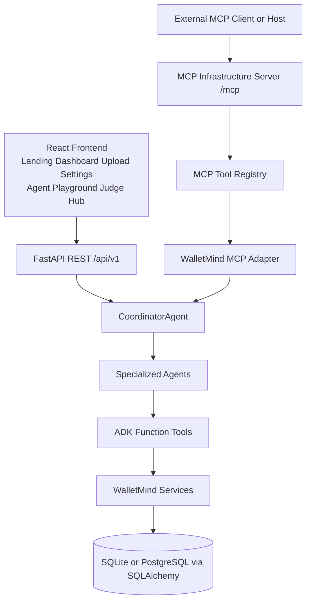

### ADK Runtime Diagram

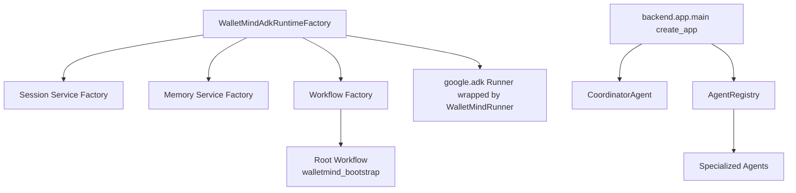

### Coordinator Decision Flow

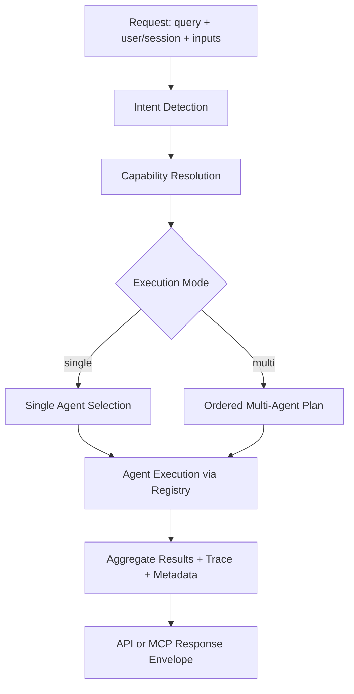

### Specialized Agent Diagram

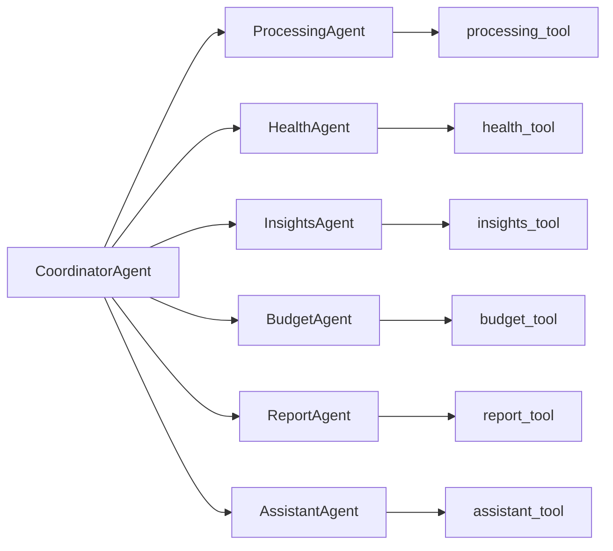

### Function Tool Diagram

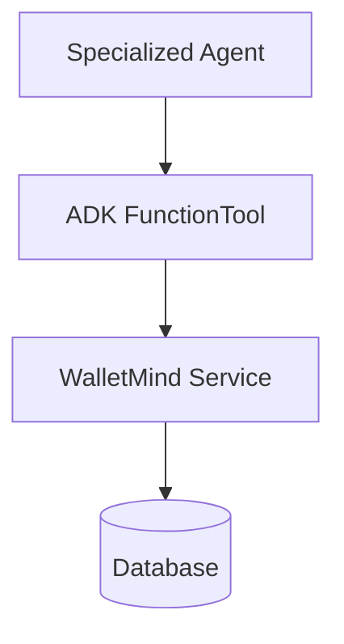

### MCP Architecture

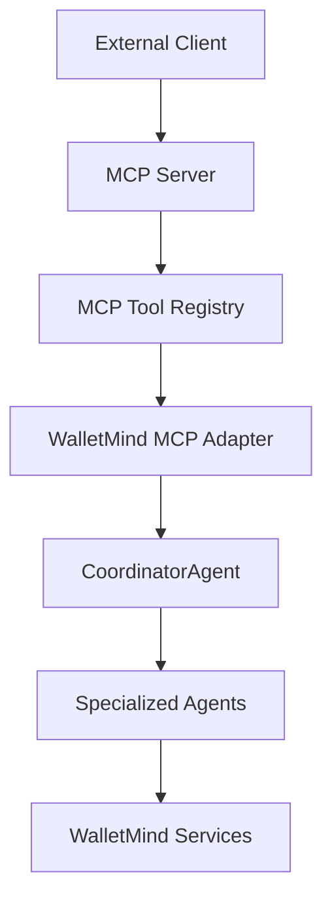

### REST + MCP Shared Core

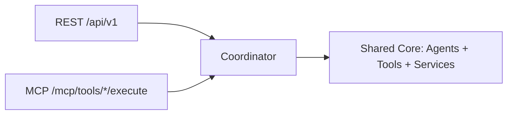

### Frontend Architecture

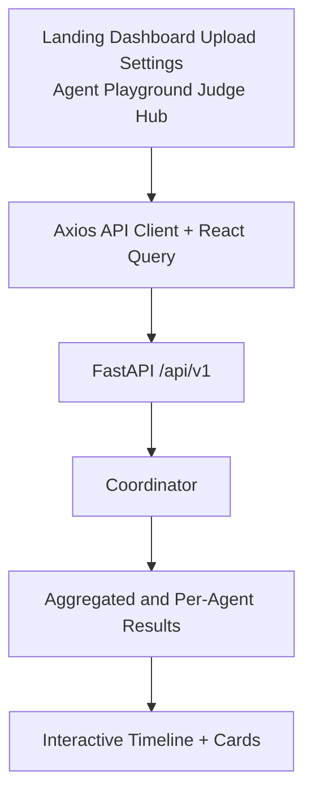

## Product Preview

### Landing Page

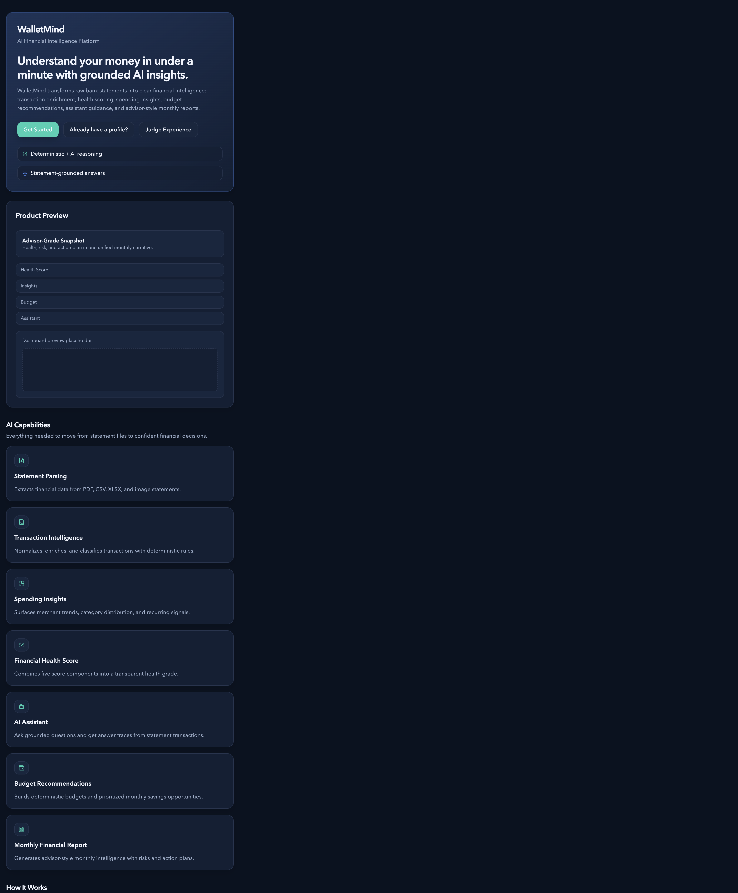

### Dashboard


### Statement Upload


### Agent Playground


### Judge Hub


### Execution Timeline

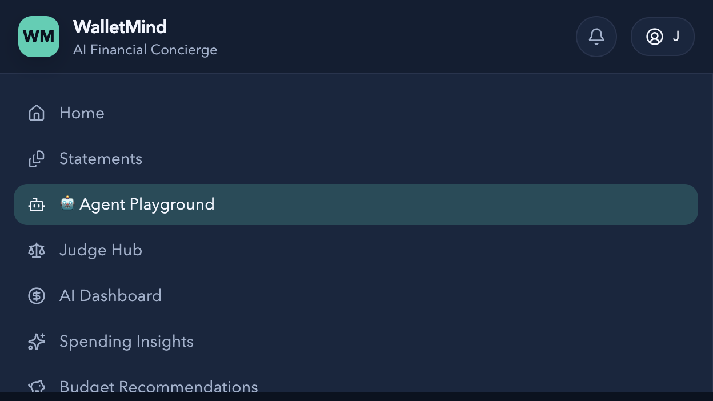

### Financial Health


### Budget


### Insights


### Monthly Report


### AI Assistant


### REST Swagger

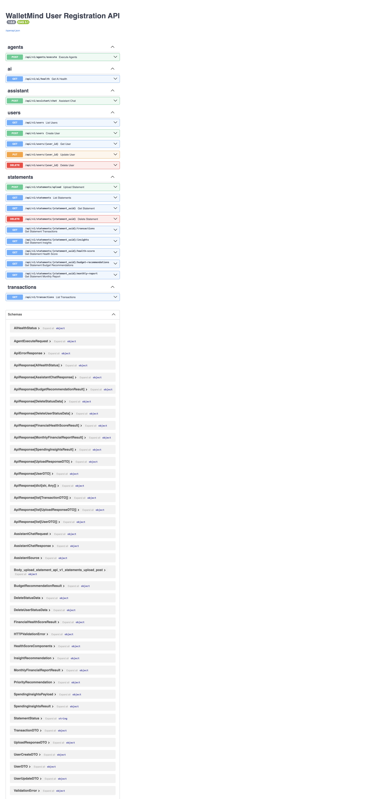

### MCP Swagger

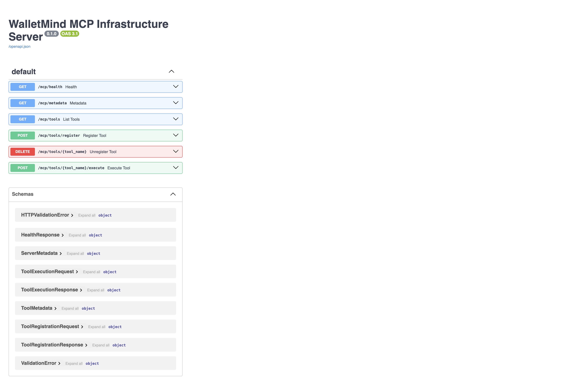

## Technology Stack

| Layer            | Technology                          | Purpose                                          |
| ---------------- | ----------------------------------- | ------------------------------------------------ |
| Frontend         | React + TypeScript + Vite           | Product UI and judge workflow                    |
| State/Data       | React Query + Axios                 | Data fetching and cache lifecycle                |
| Backend API      | FastAPI + Pydantic                  | Versioned API contracts                          |
| Persistence      | SQLAlchemy                          | Statement, transaction, and analysis persistence |
| AI Runtime       | Google ADK + Gemini                 | Coordinator and specialized-agent reasoning      |
| Tool Boundary    | ADK FunctionTool                    | Deterministic service invocation                 |
| Protocol Interop | MCP                                 | Tool discovery and execution for AI hosts        |
| Testing          | Pytest + Vitest + Testing Library   | Backend, MCP, ADK, and frontend quality gates    |
| Deployment       | Render + Vercel + GitHub Actions CI | Repeatable delivery workflow                     |

## Security and Configuration

- Session middleware with signed cookies and configurable policy.
- CORS allowlist loaded from environment variables.
- Request context binding for per-request state.
- Environment-driven AI configuration and model controls.
- Session-scoped AI key management with validation and status endpoints.

See: [docs/security/security.md](docs/security/security.md)

## Quick Start

### Backend

```bash
python -m venv .venv
source .venv/bin/activate
pip install -r requirements.txt
python -m backend.app.main
```

Backend: `http://127.0.0.1:8000`

### Frontend

```bash
cd frontend
npm install
npm run dev
```

Frontend: `http://localhost:5173`

### MCP

```bash
cd ..
source .venv/bin/activate
python -m backend.app.mcp.server
```

MCP: `http://127.0.0.1:8100`

### Swagger

- REST Swagger: `http://127.0.0.1:8000/docs`
- MCP Swagger: `http://127.0.0.1:8100/docs`

### Judge Routes

- Agent Playground: `http://localhost:5173/app/agent-playground`
- Judge Hub: `http://localhost:5173/app/judge`

## Evaluation and Evidence

| Requirement       | Evidence                                                                                    |
| ----------------- | ------------------------------------------------------------------------------------------- |
| Google ADK        | `backend/app/adk/`, `backend/app/agents/`                                                   |
| Coordinator       | `backend/app/agents/coordinator_agent.py`                                                   |
| Multi-Agent       | `backend/app/agents/*_agent.py`                                                             |
| Function Tools    | `backend/app/tools/`                                                                        |
| MCP               | `backend/app/mcp/`                                                                          |
| REST API          | `backend/app/routers/`, `backend/app/api/router.py`                                         |
| Frontend Judge UX | `frontend/src/pages/app-agent-playground-page.tsx`, `frontend/src/pages/judge-hub-page.tsx` |
| Tests             | `tests/core/`, `tests/api/`, `frontend/src/**/*.test.tsx`                                   |

## Judge Resources

| Resource                                                   | Description                                    |
| ---------------------------------------------------------- | ---------------------------------------------- |
| [Quick Start](docs/judge/QUICK_START.md)                   | Fast local run path for judges                 |
| [Architecture](docs/judge/ARCHITECTURE.md)                 | Code-derived architecture and diagrams         |
| [Rubric Mapping](docs/judge/RUBRIC_MAPPING.md)             | Rubric-to-evidence matrix                      |
| [API Examples](docs/judge/API_EXAMPLES.md)                 | Copy/paste REST and MCP requests               |
| [Evaluation Summary](docs/judge/EVALUATION_SUMMARY.md)     | Capstone concepts checklist                    |
| [Demo Guide](docs/judge/DEMO_GUIDE.md)                     | Scenario walkthrough for recording and judging |
| [Notebook](notebooks/walletmind_capstone_submission.ipynb) | Kaggle-facing narrative notebook               |

## Deployment

- Backend deployment spec: [render.yaml](render.yaml)
- Frontend deployment config: [frontend/vercel.json](frontend/vercel.json)
- CI pipeline: [.github/workflows/ci.yml](.github/workflows/ci.yml)

## License

This project is licensed under the [MIT License](LICENSE).
