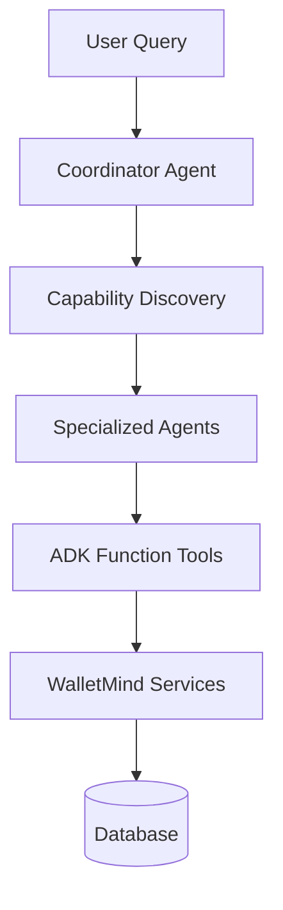

# WalletMind

AI-powered Personal Financial Intelligence Platform


WalletMind transforms raw bank statements into explainable financial intelligence using a coordinator-led multi-agent architecture built with Google ADK and exposed through both REST and MCP.

## System Architecture


Architecture highlights:

- Coordinator for intent routing and orchestration strategy.
- Agent Registry for capability-to-agent discovery.
- Specialized agents for health, insights, budget, report, assistant, and processing.
- ADK Function Tools as deterministic execution boundaries.
- Shared WalletMind service layer as the single source of business logic.
- REST APIs for product workflows and MCP endpoints for AI-host interoperability.
- Persistent storage through SQLAlchemy-backed data models.

## Product Preview

### Landing Page


### Dashboard


### Statement Upload


### Agent Playground


### Judge Hub


### Execution Timeline


### Financial Health


### Budget


### Insights


### Monthly Report


### AI Assistant


### REST Swagger


### MCP Swagger


## Why WalletMind?

Traditional finance apps visualize historical transactions. WalletMind reasons about finances.

- Coordinator-led orchestration routes each request to the right capability mix.
- Multi-agent execution decomposes complex financial analysis into specialized tasks.
- Deterministic tools keep outputs auditable and grounded in real statement data.
- Explainable recommendations show decision traces, not opaque answers.
- REST + MCP enable both product UX and standards-based AI-host integration.

## Key Features

- [x] Google ADK multi-agent system
- [x] Coordinator Agent orchestration layer
- [x] Specialized domain agents
- [x] Agent Registry discovery model
- [x] Function Tool execution boundary
- [x] Standalone MCP server
- [x] Versioned REST APIs
- [x] Agent Playground with timeline
- [x] Judge Hub navigation experience
- [x] Explainable financial analysis
- [x] Budget recommendations
- [x] Monthly financial reports
- [x] Retrieval-grounded AI Assistant

## Google AI Agents Concepts Demonstrated

| Concept | Implementation |
| --- | --- |
| Google ADK | Coordinator + specialized ADK agents |
| Multi-Agent | Coordinator capability routing and aggregation |
| Function Tools | WalletMind Function Tool layer in `backend/app/tools/` |
| MCP | Standalone MCP server + adapter + registry |
| Shared Services | Single source of business logic in WalletMind services |
| Explainability | Decision records, timeline traces, and per-agent outputs |

## AI Execution Flow



## Technology Stack

| Layer | Technology | Purpose |
| --- | --- | --- |
| Frontend | React + TypeScript + Vite | Interactive financial product UX |
| State/Data | React Query + Axios | Async API state and request orchestration |
| Backend API | FastAPI + Pydantic | Versioned API contracts and validation |
| Persistence | SQLAlchemy | Statement, transaction, and analysis storage |
| AI Runtime | Google ADK + Gemini | Planner-driven agent reasoning |
| Tool Boundary | ADK FunctionTool | Deterministic service invocation contracts |
| Protocol Interop | Model Context Protocol (MCP) | Tool discovery and execution for AI hosts |
| Testing | Pytest + Vitest + Testing Library | Backend and frontend quality gates |

## Quick Start

### Backend

```bash
python -m venv .venv
source .venv/bin/activate
pip install -r requirements.txt
python -m backend.app.main
```

Backend: `http://127.0.0.1:8000`

### Frontend

```bash
cd frontend
npm install
npm run dev
```

Frontend: `http://127.0.0.1:5173`

### MCP

```bash
cd ..
source .venv/bin/activate
python -m backend.app.mcp.server
```

MCP: `http://127.0.0.1:8100`

### Swagger

- REST Swagger: `http://127.0.0.1:8000/docs`
- MCP Swagger: `http://127.0.0.1:8100/docs`

### Agent Playground

- `http://127.0.0.1:5173/app/agent-playground`

### Judge Hub

- `http://127.0.0.1:5173/app/judge`

## Demo Flow

1. Upload Statement
2. Dashboard
3. Agent Playground
4. Coordinator Decision
5. Execution Timeline
6. Judge Hub
7. REST Swagger
8. MCP Swagger

## Judge Resources

| Resource | Description |
| --- | --- |
| [📘 Quick Start](docs/judge/QUICK_START.md) | Fastest local setup path for evaluation. |
| [🏗 Architecture](docs/judge/ARCHITECTURE.md) | System design, diagrams, and execution topology. |
| [🎯 Rubric Mapping](docs/judge/RUBRIC_MAPPING.md) | Direct mapping from judging criteria to evidence. |
| [🧪 API Examples](docs/judge/API_EXAMPLES.md) | Copy-paste REST and MCP validation requests. |
| [📑 Evaluation Summary](docs/judge/EVALUATION_SUMMARY.md) | Compact capstone evidence cheat sheet. |
| [▶ Demo Guide](docs/judge/DEMO_GUIDE.md) | Scenario-driven walkthrough for live judging. |
| [✅ Judge Checklist](docs/judge/JUDGE_CHECKLIST.md) | Fast verification checklist during review. |

## Future Roadmap

- Export-ready PDF reporting.
- Multi-statement trend and seasonality intelligence.
- Goal simulation and what-if planning depth.
- Extended collaboration flows for households/advisors.
- Optional advanced MCP service integrations.

## License

This project is licensed under the [MIT License](LICENSE).
