# AI Agent Design Specification

> **Version:** 1.0.0  
> **Status:** Architecture Specification (Authoritative)  
> **Document Type:** AI Agent Architecture  
> **Primary Components:** `agents/*`  
> **Audience:** Contributors, AI Coding Assistants, Google ADK Evaluators, Kaggle Judges  
> **Last Updated:** July 2026

---

# Purpose

This document defines the complete architectural specification for every AI agent within WalletMind.

It serves as the authoritative engineering reference for the implementation of the multi-agent ecosystem.

Unlike implementation documentation, this specification focuses on:

- agent responsibilities
- architectural boundaries
- reasoning ownership
- communication protocols
- planner interactions
- memory integration
- tool usage
- runtime behaviour
- structured outputs
- validation
- extensibility

Each future agent implementation should conform to the architecture defined in this document.

If implementation differs from this specification, this document takes precedence until updated through an Architecture Decision Record (ADR).

---

# Relationship to the System Architecture

The agent ecosystem is built on top of the Planner architecture.

```
overview.md
      │
      ▼
planner.md
      │
      ▼
agents.md
      │
      ├── memory.md
      ├── tools.md
      ├── mcp.md
      └── runtime.md
```

The Planner defines **how execution is coordinated**.

This document defines **how reasoning is performed**.

---

# Purpose of AI Agents

Financial planning spans multiple reasoning domains.

A single conversational model is expected to simultaneously understand:

- budgeting
- spending behaviour
- investments
- cash flow
- debt
- financial risk
- long-term planning
- behavioural coaching
- scenario analysis

As reasoning complexity increases, a monolithic AI model becomes increasingly difficult to:

- explain
- validate
- extend
- test
- reuse

WalletMind therefore distributes reasoning across specialized AI agents.

Each agent owns one reasoning capability.

---

# Why Specialized Agents

WalletMind intentionally separates financial reasoning into focused agents.

Instead of:

```
Financial Agent

↓

Everything
```

WalletMind adopts:

```
Planner

↓

Specialized Agents

↓

Budget

Investment

Risk

Forecast

Goals

Coach

Reports
```

This separation dramatically improves architectural clarity.

---

# Why Agent-Based Reasoning

Planner-driven execution alone is not sufficient.

The Planner understands **how work should be coordinated**.

Agents understand **how work should be reasoned about**.

This distinction keeps orchestration independent from expertise.

---

## Traditional LLM Architecture


Advantages:

- Simple

Limitations:

- No specialization
- Difficult validation
- Limited explainability
- Poor modularity

---

## Multi-Agent Architecture

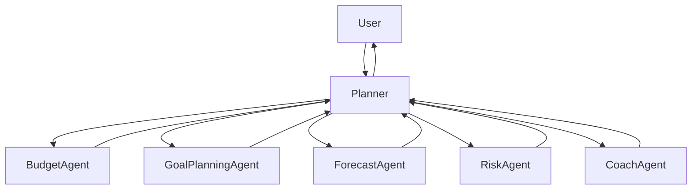

The Planner coordinates.

Agents reason.

---

# Agent Philosophy

WalletMind follows one central architectural principle.

> **One Agent. One Capability.**

Each agent owns one clearly defined reasoning responsibility.

No reasoning capability should have multiple architectural owners.

Likewise, no single agent should own multiple unrelated reasoning domains.

---

# Agent Objectives

Every WalletMind agent should satisfy the following objectives.

| Objective      | Description                                    |
| -------------- | ---------------------------------------------- |
| Expertise      | Solve one reasoning problem exceptionally well |
| Explainability | Produce transparent reasoning                  |
| Modularity     | Operate independently                          |
| Reusability    | Participate in multiple workflows              |
| Determinism    | Produce structured outputs                     |
| Extensibility  | Support future capabilities                    |

These objectives define the architectural identity of every agent.

---

# Architectural Position

Agents occupy the reasoning layer of WalletMind.

```mermaid
flowchart TD

Presentation

-->

Planner

-->

Agent Layer

-->

Tool Layer

-->

MCP Layer

-->

Infrastructure
```

Agents never communicate directly with infrastructure.

---

# Responsibilities of AI Agents

Agents own financial reasoning.

Typical responsibilities include:

- analysing information
- generating recommendations
- evaluating alternatives
- estimating confidence
- producing structured outputs
- explaining reasoning

Agents do **not** own:

- orchestration
- scheduling
- dependency management
- memory persistence
- validation
- presentation

These responsibilities belong to other architectural components.

---

# Agent Lifecycle

Every agent follows the same conceptual lifecycle.

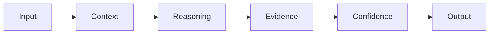

Each stage has one responsibility.

---

# Agent Lifecycle Stages

| Stage               | Purpose                        |
| ------------------- | ------------------------------ |
| Receive Input       | Accept Planner request         |
| Retrieve Context    | Access relevant memory         |
| Reason              | Perform domain analysis        |
| Generate Evidence   | Produce supporting rationale   |
| Estimate Confidence | Assess reasoning quality       |
| Return Output       | Structured response to Planner |

Agents should never skip lifecycle stages.

---

# Agent Runtime Behaviour

Agents are activated by the Planner.

Agents never initiate execution.

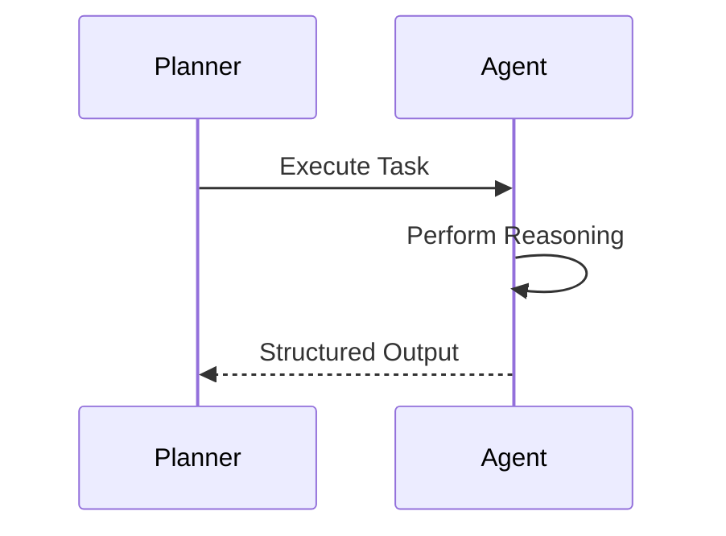

Planner ownership remains absolute.

---

# Agent Independence

Agents are intentionally isolated.

Incorrect:

```
Budget Agent

↓

Risk Agent

↓

Investment Agent
```

Preferred:

```
Planner

↓

Budget Agent

Planner

↓

Risk Agent

Planner

↓

Investment Agent
```

Every interaction passes through the Planner.

---

# Agent Communication Architecture

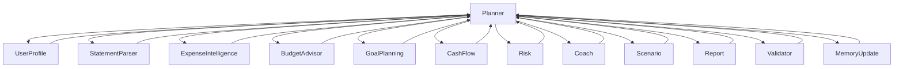

The Planner remains the only coordination hub.

---

# Planner → Agent Interaction

Every execution follows the same communication pattern.

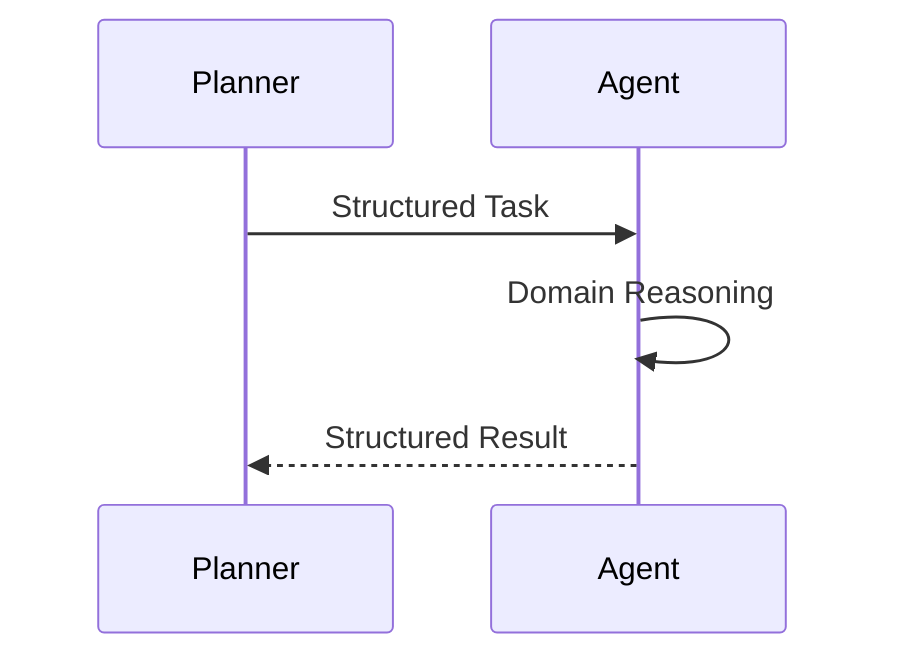

Agents do not decide execution order.

---

# Why Agents Never Call Each Other

Allowing agents to invoke one another introduces:

- circular dependencies
- hidden execution paths
- duplicated orchestration
- poor observability
- inconsistent retries

Instead, every collaboration passes through the Planner.

Benefits include:

- centralized coordination
- deterministic execution
- simplified debugging
- easier testing
- improved explainability

---

# Agent Design Principles

Every WalletMind agent should satisfy these principles.

## Single Responsibility

Each agent owns one reasoning capability.

---

## Planner Driven

Agents execute only when instructed by the Planner.

---

## Stateless

Persistent knowledge belongs to Memory.

Agents should maintain only temporary execution state.

---

## Structured Communication

Inputs and outputs use documented contracts.

---

## Explainable

Every recommendation should include supporting reasoning.

---

## Tool Assisted

Agents may use tools.

They should never directly communicate with infrastructure.

---

## Observable

Planner execution traces should clearly show:

- why an agent executed
- inputs received
- outputs produced
- confidence returned

---

# Agent Success Criteria

A successful WalletMind agent should consistently demonstrate:

| Characteristic            | Description                                                |
| ------------------------- | ---------------------------------------------------------- |
| Accurate Domain Reasoning | Produces high-quality recommendations within its specialty |
| Modular Behaviour         | Operates independently of other agents                     |
| Explainability            | Returns evidence alongside recommendations                 |
| Structured Outputs        | Produces deterministic contracts                           |
| Planner Compatibility     | Integrates seamlessly into Planner workflows               |
| Tool Awareness            | Uses deterministic tools appropriately                     |
| Memory Awareness          | Consumes relevant context without owning persistent state  |
| Reusability               | Participates in multiple execution plans                   |

---

# Planned Agent Ecosystem

WalletMind currently defines the following specialized agents.

| Agent                      | Primary Responsibility            |
| -------------------------- | --------------------------------- |
| User Profile Agent         | Understand user financial profile |
| Statement Parser Agent     | Extract structured financial data |
| Expense Intelligence Agent | Categorize and analyze spending   |
| Budget Advisor Agent       | Budget optimization               |
| Goal Planning Agent        | Financial goal decomposition      |
| Cash Flow Forecast Agent   | Forecast future finances          |
| Risk Analysis Agent        | Evaluate financial resilience     |
| Financial Coach Agent      | Behavioural coaching              |
| Scenario Simulator Agent   | What-if analysis                  |
| Report Generator Agent     | Generate explainable reports      |
| Validator / Critic Agent   | Validate reasoning quality        |
| Memory Update Agent        | Persist validated knowledge       |

Each agent is specified independently in the following sections.

---

# Part I Summary

This section establishes the architectural foundation for the WalletMind agent ecosystem.

Every agent is designed to be:

- specialized
- planner-driven
- stateless
- explainable
- modular
- reusable
- independently implementable

The following section defines the **standard agent architecture**, including the common template, runtime model, input/output contracts, state transitions, prompt philosophy, retry behaviour, communication protocol, and JSON schemas that every WalletMind agent must implement before introducing the individual agent specifications.

---

# Part II — Standard Agent Architecture

Every AI agent within WalletMind follows a common architectural model.

This standardization is intentional.

Although each agent specializes in a different financial reasoning domain, every agent should behave consistently from the perspective of the Planner.

The Planner should not require agent-specific orchestration logic.

Instead, every agent exposes the same conceptual interface while implementing different reasoning capabilities.

This section defines that common architecture.

---

# Standard Agent Philosophy

Every WalletMind agent follows four architectural principles.

> **One Capability**

Each agent owns one reasoning capability.

---

> **One Responsibility**

Each agent performs one type of financial reasoning exceptionally well.

---

> **One Contract**

Every agent communicates using standardized Planner contracts.

---

> **One Lifecycle**

Every agent follows the same execution lifecycle.

These principles ensure that new agents can be added without changing Planner behavior.

---

# Standard Agent Architecture

```mermaid
flowchart TD

Planner

-->

Agent Runtime

Agent Runtime

-->

Memory

Agent Runtime

-->

Tools

Tools

-->

MCP

Agent Runtime

-->

Reasoning Engine

Reasoning Engine

-->

Structured Output

Structured Output

-->

Planner
```

Every WalletMind agent follows this architecture regardless of specialization.

---

# Agent Components

Conceptually, every agent consists of six architectural components.

| Component            | Responsibility             |
| -------------------- | -------------------------- |
| Runtime              | Execute Planner request    |
| Context Manager      | Retrieve required context  |
| Reasoning Engine     | Domain-specific reasoning  |
| Tool Interface       | Invoke deterministic tools |
| Response Builder     | Produce structured outputs |
| Confidence Estimator | Estimate reasoning quality |

These components are conceptual.

Implementations may organize them differently while preserving the same behavior.

---

# Standard Agent Responsibilities

Every agent is responsible for:

- understanding Planner instructions
- retrieving required context
- performing domain reasoning
- invoking tools when necessary
- generating supporting evidence
- estimating confidence
- returning structured outputs

Agents should not perform orchestration.

---

# Responsibilities Explicitly Excluded

The following responsibilities belong elsewhere.

| Responsibility        | Owner            |
| --------------------- | ---------------- |
| Planning              | Planner          |
| Scheduling            | Planner          |
| Task Graph Management | Planner          |
| Validation            | Validator Agent  |
| Long-Term Storage     | Memory           |
| Infrastructure        | Tool Layer / MCP |
| Presentation          | Notebook / UI    |

Maintaining these boundaries preserves modularity.

---

# Standard Agent Lifecycle

Every agent follows the same execution lifecycle.

```mermaid
flowchart LR

Receive Task

-->

Validate Input

-->

Retrieve Context

-->

Reason

-->

Use Tools

-->

Generate Evidence

-->

Estimate Confidence

-->

Create Response

-->

Return Output
```

Each lifecycle stage has one responsibility.

---

# Lifecycle Stages

## Receive Task

The Planner dispatches a structured task.

The agent should never execute without Planner authorization.

---

## Validate Input

The agent verifies that required information exists.

Typical checks include:

- required fields
- supported task
- capability match
- input consistency

Invalid requests should return structured errors.

---

## Retrieve Context

If additional context is required, the agent requests it through the documented Memory interface.

Examples:

- user profile
- financial goals
- historical recommendations
- spending preferences

Agents should retrieve only the context they require.

---

## Reason

This stage represents the agent's core expertise.

Examples include:

- budgeting
- forecasting
- risk analysis
- coaching
- recommendation generation

This is the only stage that differs significantly between agents.

---

## Tool Usage

When deterministic computation is required, the agent invokes documented tools.

Examples include:

- financial calculators
- forecasting tools
- document retrieval
- simulations
- MCP services

Reasoning should remain separate from deterministic execution.

---

## Generate Evidence

Every recommendation should include supporting rationale.

Examples:

- calculations
- assumptions
- retrieved context
- financial principles
- supporting observations

Evidence improves explainability.

---

## Estimate Confidence

The agent estimates confidence for its own reasoning.

This estimate is later synthesized by the Planner.

Agents should never estimate overall execution confidence.

---

## Create Response

The final stage produces a structured response.

Responses should be deterministic and machine-readable.

---

# Agent Runtime Model

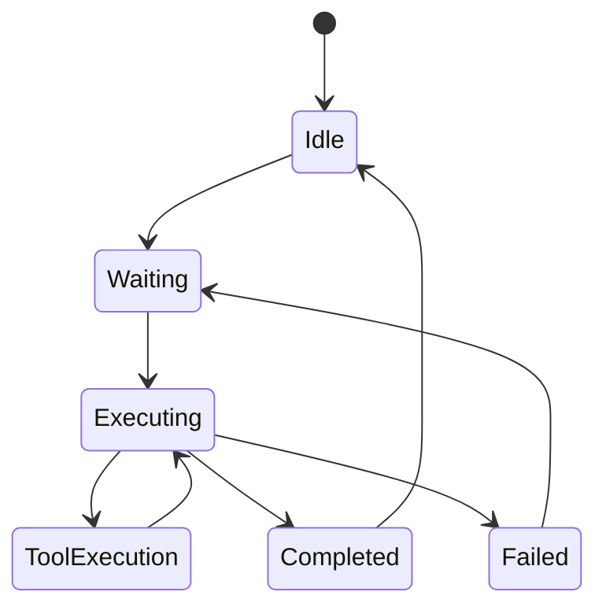

This runtime model applies to every WalletMind agent.

---

# Planner Interaction

Every agent communicates exclusively with the Planner.

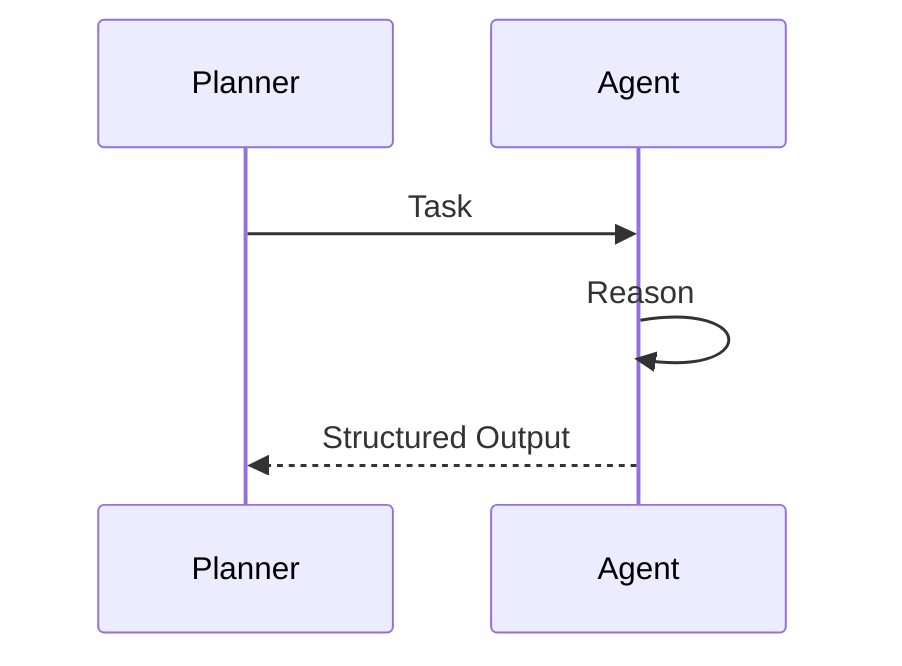

The Planner determines execution order.

Agents never coordinate execution.

---

# Memory Interaction

Agents may retrieve contextual information when instructed by the Planner.

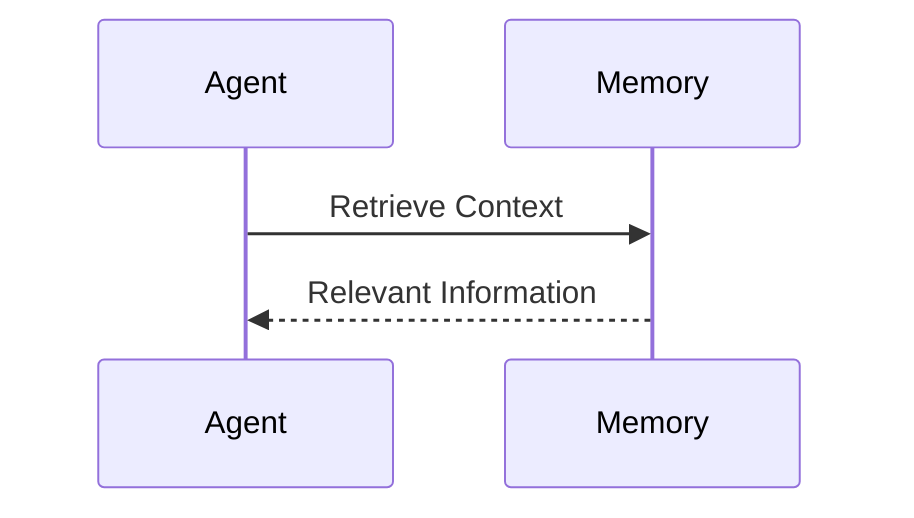

Agents never modify persistent memory directly.

---

# Tool Interaction

Agents invoke tools only when deterministic operations are required.

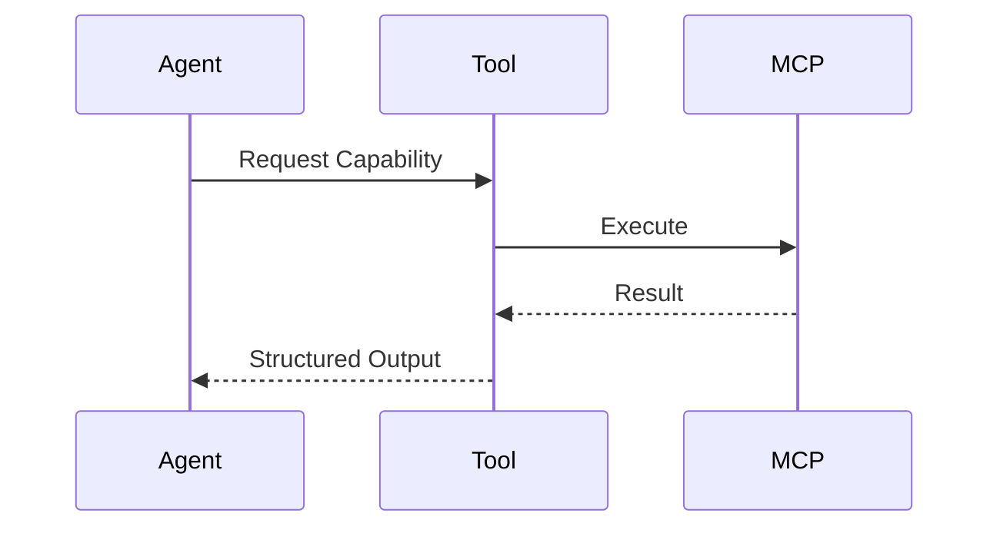

Tool usage should remain transparent.

---

# Communication Protocol

Every Planner → Agent interaction follows the same conceptual protocol.

```
Planner

↓

Task

↓

Agent

↓

Reasoning

↓

Evidence

↓

Confidence

↓

Structured Response

↓

Planner
```

Communication remains synchronous from the Planner's perspective even if implementation uses asynchronous execution.

---

# Standard Input Contract

Every agent receives a structured request.

Example:

```json
{
  "request_id": "string",
  "task_id": "string",
  "capability": "string",
  "context": {},
  "inputs": {},
  "constraints": [],
  "metadata": {}
}
```

---

# Standard Output Contract

Every agent returns the same conceptual structure.

```json
{
  "agent": "string",
  "task_id": "string",
  "status": "completed",
  "reasoning": {},
  "evidence": [],
  "recommendations": [],
  "confidence": 0.92,
  "metadata": {}
}
```

---

# Error Contract

Failures should also be structured.

```json
{
  "agent": "string",
  "status": "failed",
  "error_type": "validation_error",
  "message": "...",
  "recoverable": true
}
```

This allows the Planner to make deterministic recovery decisions.

---

# Prompt Philosophy

Although implementation details are intentionally omitted, every WalletMind agent should follow a common prompting philosophy.

Each prompt should encourage the model to:

1. Stay within its domain.
2. Ignore unrelated reasoning.
3. Explain conclusions.
4. Produce structured outputs.
5. Avoid unsupported assumptions.
6. Identify uncertainty.
7. Recommend escalation when outside its expertise.

This keeps reasoning focused and modular.

---

# Failure Handling

Agents should classify failures rather than attempting complex recovery.

Typical categories include:

| Failure             | Example                         |
| ------------------- | ------------------------------- |
| Invalid Input       | Missing required fields         |
| Missing Context     | Required memory unavailable     |
| Tool Failure        | Calculator unavailable          |
| MCP Failure         | External capability unavailable |
| Unsupported Request | Outside agent capability        |
| Internal Reasoning  | Unable to produce result        |

The Planner determines the recovery strategy.

---

# Retry Behaviour

Agents should remain passive.

If a retry is required:

1. Agent reports structured failure.
2. Planner evaluates retry policy.
3. Planner decides whether to retry.

Agents should never retry autonomously.

---

# Success Criteria

Every agent should satisfy the following criteria.

| Requirement           | Description                     |
| --------------------- | ------------------------------- |
| Correct Capability    | Solves assigned reasoning task  |
| Structured Output     | Produces deterministic response |
| Explainability        | Includes supporting evidence    |
| Confidence Estimate   | Reports reasoning confidence    |
| Planner Compatibility | Obeys Planner contract          |
| Tool Awareness        | Uses tools appropriately        |
| Memory Awareness      | Retrieves only required context |

---

# Standard Agent State Machine

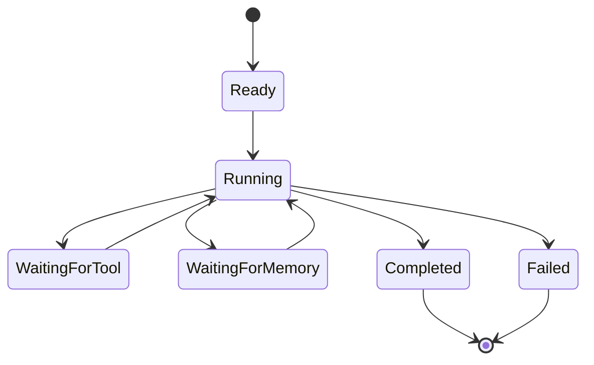

Every agent should expose equivalent runtime states.

---

# Example Execution

Example task:

```
Capability

Budget Analysis

↓

Planner

↓

Budget Advisor Agent

↓

Retrieve Spending History

↓

Analyze Budget

↓

Generate Recommendations

↓

Estimate Confidence

↓

Return Structured Output
```

Every WalletMind agent should follow this execution pattern.

---

# Design Principles

Every future WalletMind agent should satisfy the following principles.

| Principle      | Description                                  |
| -------------- | -------------------------------------------- |
| One Capability | Single reasoning domain                      |
| Planner Driven | Planner owns execution                       |
| Stateless      | Persistent knowledge belongs to Memory       |
| Explainable    | Every recommendation includes evidence       |
| Structured     | Machine-readable communication               |
| Tool Assisted  | Deterministic work delegated to tools        |
| Extensible     | New capabilities require no Planner redesign |

---

# Agent Compliance Checklist

Before an agent is considered complete, it should satisfy the following architectural checklist.

| Requirement                    | Status |
| ------------------------------ | ------ |
| Purpose defined                | ✓      |
| Responsibility defined         | ✓      |
| Inputs documented              | ✓      |
| Outputs documented             | ✓      |
| Planner interaction documented | ✓      |
| Memory interaction documented  | ✓      |
| Tool usage documented          | ✓      |
| Failure handling defined       | ✓      |
| Retry behaviour defined        | ✓      |
| Confidence strategy defined    | ✓      |
| JSON contracts documented      | ✓      |
| State transitions defined      | ✓      |
| Example execution included     | ✓      |
| Future improvements identified | ✓      |

Every agent specification in the following sections inherits this architecture.

---

# Part II Summary

This section defines the standard architecture that governs every AI agent within WalletMind.

Rather than allowing each agent to evolve independently, WalletMind establishes a common execution model, communication protocol, lifecycle, contracts, state machine, and design philosophy.

The remaining sections apply this template to each specialized financial reasoning agent, ensuring that every agent is independently implementable while remaining fully compatible with the Planner and the broader WalletMind architecture.

---

# Part III — User Profile Agent

The User Profile Agent is responsible for constructing and maintaining a structured understanding of the user.

Unlike analytical agents, it does **not** provide financial advice or recommendations.

Instead, it transforms fragmented user information into a coherent financial profile that can be used by other reasoning agents.

This profile enables WalletMind to personalize recommendations while maintaining consistent context across conversations.

---

# Purpose

The User Profile Agent answers one architectural question:

> **"Who is the user that WalletMind is reasoning for?"**

It establishes the contextual foundation upon which all future reasoning depends.

---

# Primary Responsibility

The User Profile Agent owns profile understanding.

Its responsibilities include:

- understanding user demographics
- identifying financial characteristics
- recognizing financial preferences
- identifying behavioural patterns
- understanding financial priorities
- organizing profile information
- identifying missing profile information

It does **not** provide financial recommendations.

---

# Architectural Position

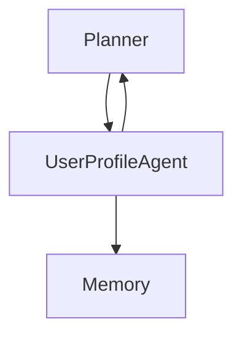

The Planner invokes this agent whenever user understanding is required.

---

# Inputs

The User Profile Agent typically receives:

| Input                | Description                      |
| -------------------- | -------------------------------- |
| User Request         | Current natural language request |
| Existing Profile     | Stored user profile              |
| Financial Goals      | Known objectives                 |
| Preferences          | User preferences                 |
| Conversation Context | Relevant dialogue                |
| Planner Metadata     | Execution context                |

The Planner determines which context is provided.

---

# Outputs

The User Profile Agent produces a structured profile summary.

Typical outputs include:

- financial profile
- identified preferences
- behavioural observations
- financial priorities
- missing information
- confidence estimate

Outputs should remain structured and deterministic.

---

# Internal Reasoning

The User Profile Agent reasons about the user's characteristics rather than financial outcomes.

Examples include:

- income stability
- spending habits
- savings behaviour
- investment preferences
- financial literacy
- risk tolerance
- life stage
- planning horizon

These observations provide context for downstream agents.

---

# Planner Interactions

The Planner invokes the User Profile Agent when:

- profile information is incomplete
- personalization is required
- new user information has been provided
- recommendations depend on user preferences

The Planner remains responsible for orchestration.

---

# Memory Interactions

The User Profile Agent retrieves relevant information from the Memory subsystem.

Typical retrieval includes:

- profile history
- preferences
- financial goals
- previous corrections
- behavioural observations

The agent does **not** update persistent memory.

Memory updates are delegated to the Memory Update Agent.

---

# Tool Usage

The User Profile Agent typically requires minimal tool usage.

Possible tools include:

- profile retrieval
- preference lookup
- demographic normalization
- identity validation

It should not invoke financial calculators or forecasting tools.

---

# Dependencies

The User Profile Agent depends upon:

- Planner
- Memory subsystem
- User profile retrieval tools

It has no dependency on analytical agents.

---

# Failure Handling

Potential failures include:

| Failure                 | Example                |
| ----------------------- | ---------------------- |
| Missing profile         | New user               |
| Missing preferences     | Incomplete onboarding  |
| Conflicting information | User corrections       |
| Insufficient context    | Too little information |

The agent should report structured limitations rather than guessing.

---

# Retry Behaviour

Retries are controlled exclusively by the Planner.

The User Profile Agent simply reports:

- recoverable failures
- non-recoverable failures
- missing information

The Planner determines subsequent actions.

---

# Success Criteria

The User Profile Agent is successful when it:

- accurately summarizes the user's financial profile
- identifies relevant preferences
- detects missing information
- avoids unsupported assumptions
- produces structured outputs
- enables downstream personalization

---

# Prompt Philosophy

The User Profile Agent should reason like an experienced financial advisor conducting an initial client interview.

It should:

- infer cautiously
- avoid financial advice
- organize information clearly
- identify uncertainty
- request clarification when required

Its purpose is understanding rather than recommendation.

---

# Input JSON Contract

```json
{
  "request_id": "...",
  "task_id": "...",
  "user_context": {},
  "existing_profile": {},
  "conversation_history": [],
  "metadata": {}
}
```

---

# Output JSON Contract

```json
{
  "agent": "UserProfileAgent",
  "status": "completed",
  "profile_summary": {
    "life_stage": "",
    "risk_tolerance": "",
    "financial_priorities": [],
    "preferences": []
  },
  "missing_information": [],
  "confidence": 0.94
}
```

---

# Runtime State Transitions

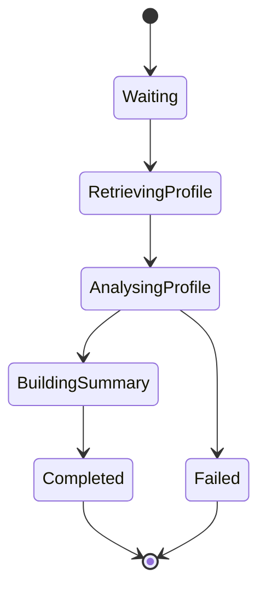

---

# Communication Protocol

The User Profile Agent follows the standard Planner communication protocol.

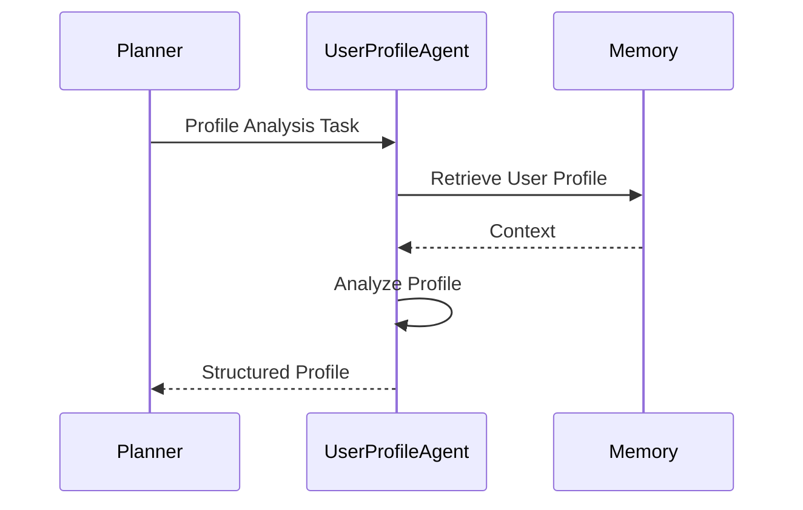

The agent communicates only with the Planner and Memory subsystem.

---

# Example Execution

User request:

> "I'm 32, recently married, and want to buy my first house in five years."

Execution:

```
Planner

↓

User Profile Agent

↓

Retrieve Existing Profile

↓

Identify New Information

↓

Life Stage:
Young Family

↓

Primary Goal:
Home Ownership

↓

Planning Horizon:
Five Years

↓

Confidence:
High

↓

Return Structured Profile
```

The output becomes contextual input for downstream planning agents.

---

# Design Decisions

| Decision                  | Rationale                        |
| ------------------------- | -------------------------------- |
| No financial advice       | Preserve single responsibility   |
| Memory retrieval only     | Avoid persistent state ownership |
| Structured outputs        | Support Planner orchestration    |
| Profile-centric reasoning | Enable personalization           |
| Conservative inference    | Avoid unsupported assumptions    |

---

# Future Improvements

Potential enhancements include:

- behavioural profiling
- financial personality assessment
- life event detection
- profile completeness scoring
- adaptive preference learning
- multilingual profile understanding
- confidence calibration
- profile versioning

These enhancements should strengthen contextual understanding without expanding the agent beyond profile reasoning.

---

# Agent Summary

| Property                   | Value                      |
| -------------------------- | -------------------------- |
| Agent Name                 | User Profile Agent         |
| Primary Capability         | User Profile Understanding |
| Planner Invoked            | Yes                        |
| Uses Memory                | Yes                        |
| Uses Tools                 | Minimal                    |
| Produces Recommendations   | No                         |
| Produces Structured Output | Yes                        |
| Updates Memory             | No                         |
| Retry Managed By           | Planner                    |
| Validation Required        | Yes                        |

---

## Part III Summary

The User Profile Agent establishes the contextual foundation for WalletMind by transforming user information into a structured financial profile.

Rather than performing financial analysis, it focuses exclusively on understanding the user's characteristics, preferences, priorities, and planning context. This specialization enables downstream agents to deliver personalized, context-aware reasoning while preserving clear architectural boundaries.

The next section introduces the **Statement Parser Agent** and **Expense Intelligence Agent**, which transform raw financial documents and transactions into structured financial insights that power budgeting, forecasting, and spending analysis.

---

# Part IV — Statement Parser Agent

The Statement Parser Agent is responsible for transforming raw financial documents into structured financial data.

Unlike analytical agents, it performs **information extraction**, not financial reasoning.

Its outputs become the primary inputs for downstream financial analysis agents.

---

# Purpose

The Statement Parser Agent answers one architectural question:

> **"What financial information is contained within this document?"**

It converts unstructured financial documents into normalized machine-readable information.

---

# Primary Responsibility

The Statement Parser Agent owns document understanding.

Responsibilities include:

- parsing bank statements
- parsing credit card statements
- parsing transaction exports
- extracting account metadata
- identifying transactions
- normalizing monetary values
- identifying statement periods
- detecting document inconsistencies

It intentionally avoids interpreting spending behaviour or making recommendations.

---

# Architectural Position

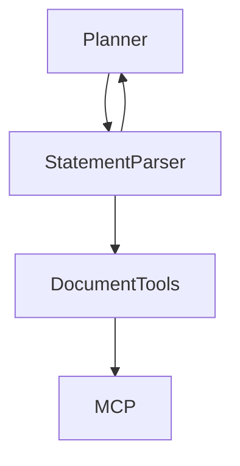

---

# Inputs

Typical inputs include:

| Input                     | Description               |
| ------------------------- | ------------------------- |
| Uploaded Statement        | PDF, CSV, XLSX, OFX, etc. |
| Planner Metadata          | Runtime context           |
| Existing Account Metadata | Optional                  |
| Parsing Configuration     | Optional                  |

---

# Outputs

The Statement Parser Agent produces structured financial records.

Examples include:

- account information
- transaction list
- balances
- statement period
- detected currencies
- parsing confidence
- anomalies

---

# Internal Reasoning

The Statement Parser Agent performs document understanding rather than financial analysis.

Typical reasoning includes:

- identifying tables
- recognizing transaction formats
- resolving date formats
- normalizing merchant names
- detecting duplicate transactions
- identifying missing values

---

# Planner Interaction

The Planner invokes this agent whenever financial documents require processing.

Typical execution:

```
Planner

↓

Statement Parser

↓

Structured Transactions

↓

Expense Intelligence
```

---

# Memory Interaction

The Statement Parser Agent generally does **not** require long-term memory.

It may retrieve:

- known account identifiers
- merchant normalization rules

It should never persist extracted information directly.

---

# Tool Usage

Typical tools include:

- PDF parser
- CSV reader
- OCR service
- Document retrieval
- Transaction normalization
- Currency normalization

---

# Failure Handling

Possible failures include:

| Failure              | Response             |
| -------------------- | -------------------- |
| Unsupported document | Structured error     |
| Corrupted file       | Parsing failure      |
| Missing pages        | Partial extraction   |
| OCR uncertainty      | Reduced confidence   |
| Unknown format       | Planner notification |

---

# Success Criteria

The agent succeeds when:

- transactions are accurately extracted
- account metadata is identified
- values are normalized
- parsing confidence is reported
- downstream agents receive structured data

---

# Prompt Philosophy

The Statement Parser Agent behaves like a document extraction specialist.

It should:

- prioritize accuracy
- avoid interpretation
- avoid financial advice
- preserve original information
- identify ambiguity

---

# Input JSON Schema

```json
{
  "task_id": "...",
  "document": {},
  "document_type": "bank_statement",
  "metadata": {}
}
```

---

# Output JSON Schema

```json
{
  "agent": "StatementParserAgent",
  "status": "completed",
  "accounts": [],
  "transactions": [],
  "statement_period": {},
  "confidence": 0.96
}
```

---

# Runtime State

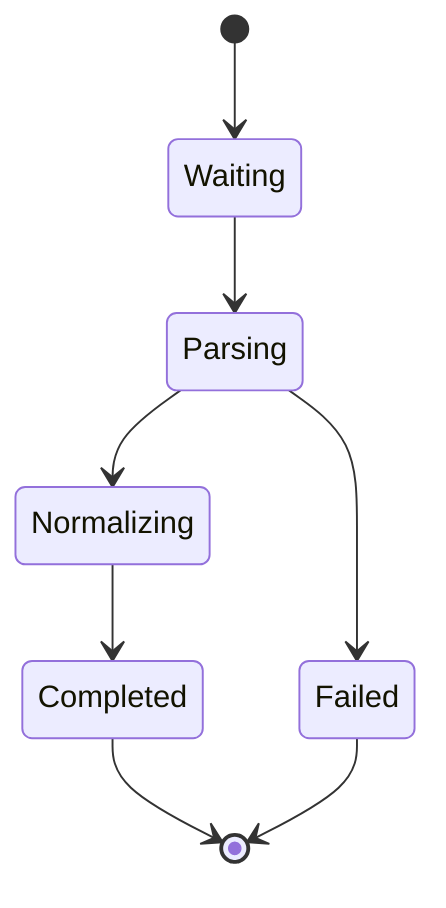

---

# Example Execution

```
Planner

↓

Statement Parser

↓

Read PDF

↓

Extract Transactions

↓

Normalize Data

↓

Return Structured Transactions
```

---

# Future Improvements

Potential future enhancements include:

- receipt parsing
- invoice understanding
- multi-bank support
- multilingual statements
- automatic anomaly detection
- investment statement parsing
- tax document parsing

---

# Agent Summary

| Property                   | Value                      |
| -------------------------- | -------------------------- |
| Capability                 | Financial Document Parsing |
| Uses Memory                | Minimal                    |
| Uses Tools                 | Extensive                  |
| Produces Advice            | No                         |
| Produces Structured Output | Yes                        |

---

# Expense Intelligence Agent

The Expense Intelligence Agent transforms structured transaction data into meaningful financial insights.

Unlike the Statement Parser Agent, it performs **financial reasoning** rather than information extraction.

---

# Purpose

The Expense Intelligence Agent answers one question:

> **"What do the user's spending patterns reveal?"**

It converts transaction history into explainable behavioural insights.

---

# Primary Responsibility

Responsibilities include:

- transaction categorization
- spending analysis
- recurring expense detection
- behavioural trend analysis
- discretionary spending identification
- unusual spending detection
- spending summaries

It does **not** recommend budgets.

Budget optimization belongs to the Budget Advisor Agent.

---

# Architectural Position

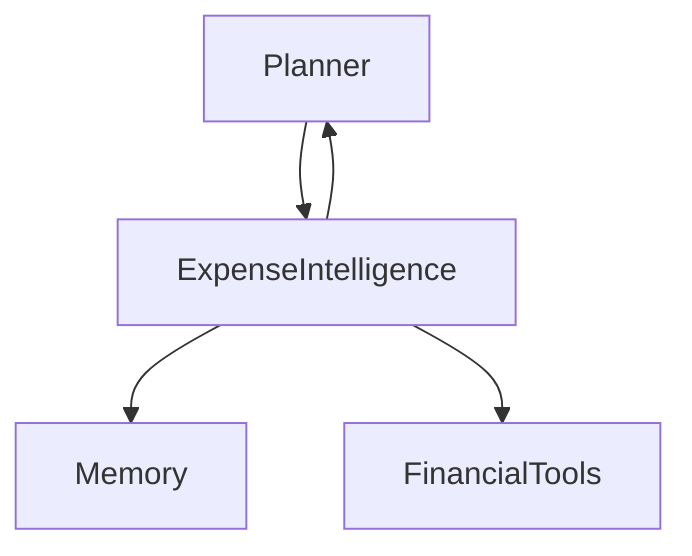

---

# Inputs

Typical inputs include:

| Input                   | Description           |
| ----------------------- | --------------------- |
| Structured Transactions | From Statement Parser |
| User Profile            | Optional              |
| Spending History        | Memory                |
| Planner Context         | Runtime metadata      |

---

# Outputs

Typical outputs include:

- spending categories
- monthly summaries
- recurring subscriptions
- behavioural observations
- spending anomalies
- spending trends
- confidence estimate

---

# Internal Reasoning

The Expense Intelligence Agent reasons about financial behaviour.

Typical reasoning includes:

- identifying lifestyle spending
- distinguishing fixed vs variable expenses
- detecting recurring payments
- recognizing spending growth
- comparing categories
- identifying behavioural changes

---

# Planner Interaction

Typical workflow:

```
Planner

↓

Expense Intelligence

↓

Analyze Transactions

↓

Generate Spending Insights

↓

Planner
```

---

# Memory Interaction

The agent retrieves:

- historical spending
- known subscriptions
- recurring merchants
- previous expense classifications

Persistent updates are delegated to the Memory Update Agent.

---

# Tool Usage

Typical tools include:

- category classifier
- merchant lookup
- statistics calculator
- trend analysis
- anomaly detection

---

# Failure Handling

| Failure              | Response                     |
| -------------------- | ---------------------------- |
| Missing transactions | Request clarification        |
| Unknown merchants    | Reduced confidence           |
| Missing history      | Continue with available data |
| Tool unavailable     | Planner retry                |

---

# Success Criteria

The Expense Intelligence Agent succeeds when it:

- categorizes spending accurately
- identifies recurring expenses
- explains spending behaviour
- detects meaningful trends
- produces structured insights

---

# Prompt Philosophy

The Expense Intelligence Agent should behave like a financial analyst reviewing several months of spending.

It should:

- identify patterns
- avoid unsupported conclusions
- explain observations
- distinguish facts from interpretations
- quantify important findings

---

# Input JSON Schema

```json
{
  "task_id": "...",
  "transactions": [],
  "user_profile": {},
  "history": {}
}
```

---

# Output JSON Schema

```json
{
  "agent": "ExpenseIntelligenceAgent",
  "status": "completed",
  "categories": [],
  "trends": [],
  "recurring_expenses": [],
  "anomalies": [],
  "confidence": 0.91
}
```

---

# Runtime State

```mermaid
stateDiagram-v2

[*] --> Waiting

Waiting --> Categorizing

Categorizing --> TrendAnalysis

TrendAnalysis --> InsightGeneration

InsightGeneration --> Completed

InsightGeneration --> Failed

Completed --> [*]

Failed --> [*]
```

---

# Communication Protocol

```mermaid
sequenceDiagram

participant Planner
participant ExpenseAgent
participant Memory

Planner->>ExpenseAgent: Spending Analysis Task

ExpenseAgent->>Memory: Retrieve Spending History

Memory-->>ExpenseAgent: Historical Data

ExpenseAgent->>ExpenseAgent: Analyze Spending

ExpenseAgent-->>Planner: Structured Insights
```

---

# Example Execution

```
Planner

↓

Expense Intelligence

↓

Categorize Transactions

↓

Detect Recurring Payments

↓

Compare Historical Spending

↓

Identify Trends

↓

Return Spending Insights
```

---

# Future Improvements

Future enhancements may include:

- lifestyle segmentation
- cash-flow sensitivity analysis
- seasonal spending models
- subscription optimization
- merchant intelligence
- inflation-adjusted analysis
- behavioural forecasting

---

# Agent Summary

| Property                   | Value                       |
| -------------------------- | --------------------------- |
| Capability                 | Spending Behaviour Analysis |
| Uses Memory                | Yes                         |
| Uses Tools                 | Yes                         |
| Produces Advice            | No                          |
| Produces Structured Output | Yes                         |

---

## Part IV Summary

The Statement Parser Agent and Expense Intelligence Agent establish WalletMind's financial data understanding pipeline.

The Statement Parser Agent converts raw financial documents into normalized transaction data, while the Expense Intelligence Agent transforms those transactions into structured behavioural insights.

By separating document extraction from financial analysis, WalletMind maintains clear architectural boundaries, improves explainability, and allows each capability to evolve independently.

The next section introduces the **Budget Advisor Agent** and **Goal Planning Agent**, which use these insights to generate personalized financial planning recommendations.

---

# Part V — Budget Advisor Agent

The Budget Advisor Agent is responsible for evaluating the user's spending habits and producing actionable budget recommendations.

Unlike the Expense Intelligence Agent, which explains **what happened**, the Budget Advisor Agent focuses on **what should change**.

It converts financial observations into realistic, personalized budgeting strategies.

---

# Purpose

The Budget Advisor Agent answers one architectural question:

> **"How can the user improve their budget while respecting their financial goals and lifestyle?"**

It is the primary optimization agent within WalletMind.

---

# Primary Responsibility

The Budget Advisor Agent owns budget optimization.

Responsibilities include:

- analyzing income vs expenses
- identifying overspending
- recommending budget allocations
- detecting savings opportunities
- balancing essential and discretionary spending
- identifying financial inefficiencies
- prioritizing financial improvements

It intentionally does **not** perform long-term financial forecasting.

---

# Architectural Position

```mermaid
flowchart TD

Planner

-->

BudgetAdvisor

BudgetAdvisor

-->

Memory

BudgetAdvisor

-->

FinancialTools

FinancialTools

-->

MCP

BudgetAdvisor

-->

Planner
```

---

# Inputs

Typical inputs include:

| Input            | Description                |
| ---------------- | -------------------------- |
| Expense Analysis | Expense Intelligence Agent |
| User Profile     | Financial preferences      |
| Monthly Income   | Structured financial data  |
| Financial Goals  | Current goals              |
| Planner Context  | Runtime metadata           |

---

# Outputs

Typical outputs include:

- optimized budget
- spending recommendations
- savings opportunities
- discretionary spending adjustments
- recommended budget categories
- confidence estimate

---

# Internal Reasoning

The Budget Advisor Agent reasons about financial optimization.

Typical reasoning includes:

- spending efficiency
- essential vs discretionary expenses
- achievable savings
- budget sustainability
- trade-off analysis
- financial prioritization

---

# Planner Interactions

The Planner invokes the Budget Advisor Agent when:

- spending optimization is required
- budgeting recommendations are requested
- financial goals require budget adjustments
- expense analysis has completed

---

# Memory Interactions

The Budget Advisor Agent retrieves:

- historical budgets
- financial goals
- user preferences
- recurring expenses
- previous recommendations

Persistent updates are handled exclusively by the Memory Update Agent.

---

# Tool Usage

Typical tools include:

- budget calculator
- savings calculator
- expense aggregation
- statistical analysis
- category summaries

---

# Dependencies

Primary dependencies include:

- Expense Intelligence Agent
- User Profile Agent
- Memory subsystem
- Financial calculation tools

---

# Failure Handling

Possible failures include:

| Failure            | Response                                     |
| ------------------ | -------------------------------------------- |
| Missing income     | Request clarification                        |
| Missing expenses   | Reduced confidence                           |
| Incomplete profile | Continue with assumptions clearly identified |
| Tool unavailable   | Planner retry                                |

---

# Retry Behaviour

Retry decisions remain under Planner control.

The Budget Advisor Agent reports:

- recoverable failures
- unsupported scenarios
- incomplete financial information

---

# Success Criteria

The Budget Advisor Agent succeeds when it:

- produces realistic budgets
- identifies meaningful savings opportunities
- respects user preferences
- provides explainable recommendations
- avoids unrealistic financial assumptions

---

# Prompt Philosophy

The Budget Advisor Agent should behave like an experienced financial planner.

It should:

- prioritize practicality
- recommend gradual improvements
- preserve user quality of life
- explain every recommendation
- distinguish facts from suggestions

---

# Input JSON Schema

```json
{
  "task_id": "...",
  "income": {},
  "expenses": [],
  "expense_analysis": {},
  "financial_goals": [],
  "user_profile": {}
}
```

---

# Output JSON Schema

```json
{
  "agent": "BudgetAdvisorAgent",
  "status": "completed",
  "recommended_budget": {},
  "savings_opportunities": [],
  "recommendations": [],
  "confidence": 0.92
}
```

---

# Runtime State

```mermaid
stateDiagram-v2

[*] --> Waiting

Waiting --> BudgetAnalysis

BudgetAnalysis --> Optimization

Optimization --> RecommendationGeneration

RecommendationGeneration --> Completed

RecommendationGeneration --> Failed

Completed --> [*]

Failed --> [*]
```

---

# Communication Protocol

```mermaid
sequenceDiagram

participant Planner
participant BudgetAgent
participant Memory

Planner->>BudgetAgent: Budget Optimization Task

BudgetAgent->>Memory: Retrieve Financial Context

Memory-->>BudgetAgent: User Preferences

BudgetAgent->>BudgetAgent: Optimize Budget

BudgetAgent-->>Planner: Structured Budget Plan
```

---

# Example Execution

```
Planner

↓

Budget Advisor

↓

Analyze Monthly Spending

↓

Identify Savings Opportunities

↓

Optimize Budget Allocation

↓

Generate Recommendations

↓

Return Budget Plan
```

---

# Future Improvements

Potential future enhancements include:

- AI-assisted envelope budgeting
- adaptive spending targets
- inflation-aware budgets
- family budgeting
- zero-based budgeting
- tax-aware budgeting
- personalized budgeting styles

---

# Agent Summary

| Property                   | Value               |
| -------------------------- | ------------------- |
| Capability                 | Budget Optimization |
| Uses Memory                | Yes                 |
| Uses Tools                 | Yes                 |
| Produces Recommendations   | Yes                 |
| Produces Structured Output | Yes                 |

---

# Goal Planning Agent

The Goal Planning Agent transforms financial aspirations into structured, achievable financial plans.

Rather than focusing on current finances, it reasons about future objectives, priorities, dependencies, and long-term planning strategies.

---

# Purpose

The Goal Planning Agent answers one question:

> **"How can the user's financial goals be transformed into an achievable roadmap?"**

---

# Primary Responsibility

Responsibilities include:

- identifying financial goals
- prioritizing competing goals
- decomposing complex goals
- estimating planning horizons
- identifying financial milestones
- recognizing goal conflicts
- generating structured goal plans

It intentionally avoids detailed financial calculations.

---

# Architectural Position

```mermaid
flowchart TD

Planner

-->

GoalPlanning

GoalPlanning

-->

Memory

GoalPlanning

-->

Planner
```

---

# Inputs

Typical inputs include:

| Input                  | Description         |
| ---------------------- | ------------------- |
| User Request           | Financial objective |
| User Profile           | Preferences         |
| Existing Goals         | Memory              |
| Budget Recommendations | Optional            |
| Planner Context        | Runtime information |

---

# Outputs

Typical outputs include:

- structured goals
- planning roadmap
- milestones
- priorities
- planning assumptions
- confidence estimate

---

# Internal Reasoning

The Goal Planning Agent reasons about:

- long-term priorities
- competing objectives
- financial sequencing
- dependency between goals
- milestone planning
- planning feasibility

---

# Planner Interactions

The Planner invokes this agent when:

- new goals are introduced
- long-term planning is requested
- multiple goals require prioritization
- execution requires structured planning

---

# Memory Interactions

The agent retrieves:

- existing goals
- historical planning decisions
- accepted recommendations
- planning preferences

The agent never writes directly to persistent memory.

---

# Tool Usage

Typical tools include:

- planning templates
- milestone calculators
- timeline estimators
- dependency analysis

---

# Dependencies

Primary dependencies include:

- User Profile Agent
- Memory subsystem
- Budget Advisor Agent (optional)

---

# Failure Handling

Possible failures include:

| Failure                   | Response                   |
| ------------------------- | -------------------------- |
| Ambiguous goal            | Request clarification      |
| Conflicting goals         | Return structured conflict |
| Missing financial context | Reduced confidence         |
| Impossible objective      | Explain limitations        |

---

# Retry Behaviour

Planner-controlled.

The Goal Planning Agent never retries independently.

---

# Success Criteria

The Goal Planning Agent succeeds when it:

- identifies clear goals
- prioritizes objectives logically
- produces realistic milestones
- identifies conflicts
- creates explainable planning strategies

---

# Prompt Philosophy

The Goal Planning Agent should behave like a long-term financial strategist.

It should:

- think hierarchically
- balance competing priorities
- explain trade-offs
- avoid unrealistic optimism
- encourage achievable progress

---

# Input JSON Schema

```json
{
  "task_id": "...",
  "user_goals": [],
  "profile": {},
  "budget_context": {},
  "constraints": []
}
```

---

# Output JSON Schema

```json
{
  "agent": "GoalPlanningAgent",
  "status": "completed",
  "goals": [],
  "milestones": [],
  "roadmap": [],
  "conflicts": [],
  "confidence": 0.94
}
```

---

# Runtime State

```mermaid
stateDiagram-v2

[*] --> Waiting

Waiting --> GoalAnalysis

GoalAnalysis --> PriorityPlanning

PriorityPlanning --> RoadmapGeneration

RoadmapGeneration --> Completed

RoadmapGeneration --> Failed

Completed --> [*]

Failed --> [*]
```

---

# Communication Protocol

```mermaid
sequenceDiagram

participant Planner
participant GoalAgent
participant Memory

Planner->>GoalAgent: Goal Planning Task

GoalAgent->>Memory: Retrieve Existing Goals

Memory-->>GoalAgent: Goal History

GoalAgent->>GoalAgent: Build Goal Roadmap

GoalAgent-->>Planner: Structured Goal Plan
```

---

# Example Execution

```
Planner

↓

Goal Planning Agent

↓

Identify Goals

↓

Prioritize Objectives

↓

Create Milestones

↓

Generate Financial Roadmap

↓

Return Structured Plan
```

---

# Future Improvements

Potential future enhancements include:

- hierarchical goal trees
- adaptive milestone generation
- dependency optimization
- collaborative family planning
- retirement strategy integration
- AI-assisted goal negotiation
- long-horizon planning

---

# Agent Summary

| Property                   | Value                   |
| -------------------------- | ----------------------- |
| Capability                 | Financial Goal Planning |
| Uses Memory                | Yes                     |
| Uses Tools                 | Moderate                |
| Produces Recommendations   | Yes                     |
| Produces Structured Output | Yes                     |

---

## Part V Summary

The Budget Advisor Agent and Goal Planning Agent transform financial observations into actionable financial strategies.

The Budget Advisor Agent optimizes present-day financial decisions by recommending realistic budget improvements, while the Goal Planning Agent focuses on future-oriented planning by converting financial aspirations into structured roadmaps.

Together, these agents bridge the gap between financial analysis and strategic planning, enabling WalletMind to deliver personalized, explainable, and goal-oriented financial guidance while maintaining clear architectural boundaries.

The next section introduces the **Cash Flow Forecast Agent** and **Risk Analysis Agent**, which evaluate future financial outcomes and assess the resilience of the user's financial plans under changing conditions.

---

# Part VI — Cash Flow Forecast Agent

The Cash Flow Forecast Agent is responsible for forecasting the user's future financial position based on current income, expenses, financial goals, and expected changes.

Unlike the Budget Advisor Agent, which focuses on optimizing today's financial decisions, this agent reasons about future financial outcomes.

It provides the predictive foundation for long-term planning.

---

# Purpose

The Cash Flow Forecast Agent answers one architectural question:

> **"Given the current financial situation, what is the user's future cash flow likely to look like?"**

---

# Primary Responsibility

The Cash Flow Forecast Agent owns future financial forecasting.

Responsibilities include:

- forecasting monthly cash flow
- estimating future savings
- projecting account balances
- identifying future cash shortages
- evaluating income and expense trends
- estimating financial sustainability
- identifying future planning risks

It intentionally avoids investment advice and budgeting decisions.

---

# Architectural Position

```mermaid
flowchart TD

Planner

-->

CashFlowForecast

CashFlowForecast

-->

Memory

CashFlowForecast

-->

ForecastTools

ForecastTools

-->

MCP

CashFlowForecast

-->

Planner
```

---

# Inputs

Typical inputs include:

| Input                  | Description          |
| ---------------------- | -------------------- |
| Income Information     | Current income       |
| Expense Analysis       | Spending trends      |
| Budget Recommendations | Optional             |
| Financial Goals        | Long-term objectives |
| User Profile           | Planning preferences |
| Planner Context        | Runtime metadata     |

---

# Outputs

Typical outputs include:

- projected cash flow
- future balances
- savings projections
- financial sustainability indicators
- forecast assumptions
- confidence estimate

---

# Internal Reasoning

The Cash Flow Forecast Agent reasons about:

- recurring income
- recurring expenses
- expected financial growth
- projected savings
- future affordability
- financial trend continuation

Forecasts should remain explainable and assumption-driven.

---

# Planner Interactions

The Planner invokes this agent whenever future-oriented reasoning is required.

Typical examples include:

- retirement planning
- home affordability
- education planning
- emergency fund forecasting
- income change simulations

---

# Memory Interactions

The Cash Flow Forecast Agent retrieves:

- historical income
- historical expenses
- planning assumptions
- recurring payments
- historical forecasts

Persistent updates remain the responsibility of the Memory Update Agent.

---

# Tool Usage

Typical tools include:

- cash flow calculator
- forecasting engine
- inflation assumptions
- financial projection utilities
- deterministic calculators

---

# Dependencies

Primary dependencies include:

- Expense Intelligence Agent
- Budget Advisor Agent
- Goal Planning Agent
- Memory subsystem
- Financial tools

---

# Failure Handling

Possible failures include:

| Failure            | Response                  |
| ------------------ | ------------------------- |
| Missing income     | Reduced confidence        |
| Missing expenses   | Forecast with assumptions |
| Incomplete history | Short-term forecast only  |
| Tool unavailable   | Planner retry             |

---

# Retry Behaviour

Retries are managed by the Planner.

The Cash Flow Forecast Agent reports:

- recoverable failures
- missing assumptions
- unsupported forecast scenarios

---

# Success Criteria

The Cash Flow Forecast Agent succeeds when it:

- produces realistic forecasts
- explains forecast assumptions
- identifies future risks
- communicates uncertainty
- returns structured projections

---

# Prompt Philosophy

The Cash Flow Forecast Agent should behave like a financial forecasting specialist.

It should:

- avoid unrealistic certainty
- explain assumptions
- distinguish forecasts from facts
- identify uncertainty
- present multiple possible outcomes where appropriate

---

# Input JSON Schema

```json
{
  "task_id": "...",
  "income": {},
  "expenses": [],
  "financial_goals": [],
  "planning_horizon": {},
  "user_profile": {}
}
```

---

# Output JSON Schema

```json
{
  "agent": "CashFlowForecastAgent",
  "status": "completed",
  "cash_flow_projection": {},
  "balance_projection": {},
  "forecast_assumptions": [],
  "confidence": 0.89
}
```

---

# Runtime State

```mermaid
stateDiagram-v2

[*] --> Waiting

Waiting --> ForecastPreparation

ForecastPreparation --> ForecastGeneration

ForecastGeneration --> ProjectionAnalysis

ProjectionAnalysis --> Completed

ProjectionAnalysis --> Failed

Completed --> [*]

Failed --> [*]
```

---

# Communication Protocol

```mermaid
sequenceDiagram

participant Planner
participant ForecastAgent
participant Memory

Planner->>ForecastAgent: Forecast Task

ForecastAgent->>Memory: Retrieve Historical Data

Memory-->>ForecastAgent: Financial History

ForecastAgent->>ForecastAgent: Generate Forecast

ForecastAgent-->>Planner: Cash Flow Projection
```

---

# Example Execution

```
Planner

↓

Cash Flow Forecast Agent

↓

Retrieve Financial History

↓

Estimate Future Income

↓

Estimate Future Expenses

↓

Project Cash Flow

↓

Return Forecast
```

---

# Future Improvements

Potential enhancements include:

- inflation-adjusted forecasting
- probabilistic forecasting
- seasonal cash flow models
- AI-assisted forecasting
- macroeconomic assumptions
- confidence intervals
- multi-scenario forecasting

---

# Agent Summary

| Property                   | Value                 |
| -------------------------- | --------------------- |
| Capability                 | Cash Flow Forecasting |
| Uses Memory                | Yes                   |
| Uses Tools                 | Extensive             |
| Produces Advice            | No                    |
| Produces Structured Output | Yes                   |

---

# Risk Analysis Agent

The Risk Analysis Agent evaluates the resilience of the user's financial position by identifying financial vulnerabilities, uncertainty, and potential downside scenarios.

Unlike the Cash Flow Forecast Agent, which predicts likely outcomes, the Risk Analysis Agent evaluates how well the user can withstand unfavorable conditions.

---

# Purpose

The Risk Analysis Agent answers one architectural question:

> **"How resilient is the user's financial plan under uncertainty?"**

---

# Primary Responsibility

The Risk Analysis Agent owns financial risk assessment.

Responsibilities include:

- evaluating financial resilience
- identifying financial vulnerabilities
- estimating emergency preparedness
- assessing debt exposure
- evaluating goal feasibility
- identifying planning risks
- summarizing financial resilience

It intentionally avoids creating financial plans.

---

# Architectural Position

```mermaid
flowchart TD

Planner

-->

RiskAnalysis

RiskAnalysis

-->

Memory

RiskAnalysis

-->

RiskTools

RiskTools

-->

MCP

RiskAnalysis

-->

Planner
```

---

# Inputs

Typical inputs include:

| Input              | Description             |
| ------------------ | ----------------------- |
| Cash Flow Forecast | Future projections      |
| User Profile       | Risk tolerance          |
| Financial Goals    | Objectives              |
| Budget Plan        | Current recommendations |
| Planner Context    | Runtime metadata        |

---

# Outputs

Typical outputs include:

- financial risks
- resilience assessment
- vulnerability summary
- mitigation suggestions
- confidence estimate

---

# Internal Reasoning

The Risk Analysis Agent reasons about:

- emergency fund adequacy
- debt burden
- income dependency
- financial resilience
- goal uncertainty
- downside exposure
- planning sensitivity

---

# Planner Interactions

Typical Planner requests include:

- evaluate retirement risk
- assess affordability risk
- review emergency preparedness
- evaluate financial resilience
- identify planning vulnerabilities

---

# Memory Interactions

The agent retrieves:

- historical risk assessments
- user risk tolerance
- emergency fund history
- previous recommendations

Persistent updates remain outside the agent.

---

# Tool Usage

Typical tools include:

- debt ratio calculator
- emergency fund calculator
- affordability analysis
- stress testing utilities
- financial ratio calculators

---

# Dependencies

Primary dependencies include:

- Cash Flow Forecast Agent
- Goal Planning Agent
- User Profile Agent
- Memory subsystem

---

# Failure Handling

Possible failures include:

| Failure          | Response                 |
| ---------------- | ------------------------ |
| Missing forecast | Reduced assessment       |
| Missing profile  | Conservative assumptions |
| Missing goals    | Limited analysis         |
| Tool failure     | Planner retry            |

---

# Retry Behaviour

Planner controlled.

The Risk Analysis Agent reports failures without autonomous retries.

---

# Success Criteria

The Risk Analysis Agent succeeds when it:

- identifies important risks
- explains uncertainty
- quantifies resilience
- avoids unsupported conclusions
- produces structured assessments

---

# Prompt Philosophy

The Risk Analysis Agent should behave like a financial risk analyst.

It should:

- remain objective
- communicate uncertainty clearly
- distinguish probability from possibility
- explain reasoning
- avoid unnecessary alarm

---

# Input JSON Schema

```json
{
  "task_id": "...",
  "cash_flow_projection": {},
  "financial_goals": [],
  "user_profile": {},
  "budget_plan": {}
}
```

---

# Output JSON Schema

```json
{
  "agent": "RiskAnalysisAgent",
  "status": "completed",
  "identified_risks": [],
  "resilience_score": {},
  "mitigation_options": [],
  "confidence": 0.9
}
```

---

# Runtime State

```mermaid
stateDiagram-v2

[*] --> Waiting

Waiting --> RiskEvaluation

RiskEvaluation --> ResilienceAssessment

ResilienceAssessment --> RecommendationGeneration

RecommendationGeneration --> Completed

RecommendationGeneration --> Failed

Completed --> [*]

Failed --> [*]
```

---

# Communication Protocol

```mermaid
sequenceDiagram

participant Planner
participant RiskAgent
participant Memory

Planner->>RiskAgent: Risk Assessment Task

RiskAgent->>Memory: Retrieve Risk Context

Memory-->>RiskAgent: Historical Risk Data

RiskAgent->>RiskAgent: Assess Financial Risk

RiskAgent-->>Planner: Structured Risk Assessment
```

---

# Example Execution

```
Planner

↓

Risk Analysis Agent

↓

Retrieve Financial Context

↓

Assess Cash Flow Risk

↓

Assess Goal Risk

↓

Evaluate Resilience

↓

Return Risk Assessment
```

---

# Future Improvements

Potential future enhancements include:

- Monte Carlo risk simulations
- portfolio risk analysis
- macroeconomic stress testing
- insurance adequacy analysis
- AI-assisted resilience scoring
- scenario sensitivity analysis
- longitudinal risk tracking

---

# Agent Summary

| Property                   | Value                     |
| -------------------------- | ------------------------- |
| Capability                 | Financial Risk Assessment |
| Uses Memory                | Yes                       |
| Uses Tools                 | Extensive                 |
| Produces Recommendations   | Yes                       |
| Produces Structured Output | Yes                       |

---

## Part VI Summary

The Cash Flow Forecast Agent and Risk Analysis Agent extend WalletMind's reasoning from present-day financial optimization into future-oriented decision support.

The Cash Flow Forecast Agent projects how the user's financial situation may evolve under expected conditions, while the Risk Analysis Agent evaluates the resilience of those projections under uncertainty and adverse scenarios.

Together they provide the predictive and defensive reasoning required for trustworthy long-term financial planning, enabling the Planner to generate recommendations that are not only achievable but also resilient to future change.

The next section introduces the **Financial Coach Agent** and **Scenario Simulator Agent**, which translate analytical findings into personalized coaching and interactive "what-if" simulations.

---

# Part VII — Financial Coach Agent

The Financial Coach Agent is responsible for translating analytical findings into personalized, understandable, and actionable financial guidance.

Unlike analytical agents that focus on calculations or predictions, the Financial Coach Agent focuses on **communication, education, and behavioural improvement**.

It acts as WalletMind's financial mentor.

---

# Purpose

The Financial Coach Agent answers one architectural question:

> **"Given everything the system has learned, what should the user do next?"**

It bridges the gap between financial analysis and user action.

---

# Primary Responsibility

The Financial Coach Agent owns personalized financial coaching.

Responsibilities include:

- translating technical analysis into practical advice
- prioritizing recommendations
- explaining trade-offs
- encouraging positive financial behaviour
- identifying achievable next steps
- improving financial literacy
- adapting communication to the user's profile

The Financial Coach Agent does **not** perform financial calculations.

---

# Architectural Position

```mermaid
flowchart TD

Planner

-->

FinancialCoach

FinancialCoach

-->

Memory

FinancialCoach

-->

KnowledgeTools

KnowledgeTools

-->

MCP

FinancialCoach

-->

Planner
```

---

# Inputs

Typical inputs include:

| Input                  | Description                        |
| ---------------------- | ---------------------------------- |
| Budget Recommendations | Budget Advisor Agent               |
| Goal Plan              | Goal Planning Agent                |
| Risk Assessment        | Risk Analysis Agent                |
| Cash Flow Forecast     | Forecast Agent                     |
| User Profile           | Preferences and financial literacy |
| Planner Context        | Runtime metadata                   |

---

# Outputs

Typical outputs include:

- prioritized recommendations
- action plan
- coaching insights
- educational explanations
- behavioural suggestions
- confidence estimate

---

# Internal Reasoning

The Financial Coach Agent reasons about:

- recommendation priority
- behavioural change
- achievable improvements
- financial habits
- educational opportunities
- communication style

Its reasoning should always remain user-centric.

---

# Planner Interactions

Typical Planner requests include:

- summarize recommendations
- explain trade-offs
- prioritize actions
- provide financial coaching
- simplify technical analysis

---

# Memory Interactions

The Financial Coach Agent retrieves:

- user preferences
- financial literacy level
- historical recommendations
- accepted advice
- coaching history

It never updates persistent memory directly.

---

# Tool Usage

Typical tools include:

- financial knowledge retrieval
- educational content lookup
- explanation templates
- terminology simplification

---

# Dependencies

Primary dependencies include:

- Budget Advisor Agent
- Goal Planning Agent
- Cash Flow Forecast Agent
- Risk Analysis Agent
- User Profile Agent

---

# Failure Handling

Possible failures include:

| Failure                      | Response                         |
| ---------------------------- | -------------------------------- |
| Missing recommendations      | Request Planner clarification    |
| Incomplete context           | Produce limited coaching         |
| Missing profile              | Use neutral communication style  |
| Knowledge lookup unavailable | Continue with internal reasoning |

---

# Retry Behaviour

Retry decisions remain Planner-controlled.

The Financial Coach Agent reports:

- missing context
- unsupported requests
- recoverable failures

---

# Success Criteria

The Financial Coach Agent succeeds when it:

- communicates clearly
- prioritizes recommendations effectively
- motivates constructive financial action
- avoids overwhelming the user
- preserves factual accuracy

---

# Prompt Philosophy

The Financial Coach Agent should behave like an experienced financial mentor.

It should:

- educate without lecturing
- encourage gradual improvement
- explain reasoning
- avoid fear-based messaging
- adapt explanations to the user's experience level

---

# Input JSON Schema

```json
{
  "task_id": "...",
  "recommendations": [],
  "user_profile": {},
  "risk_summary": {},
  "goal_plan": {}
}
```

---

# Output JSON Schema

```json
{
  "agent": "FinancialCoachAgent",
  "status": "completed",
  "action_plan": [],
  "coaching_summary": "",
  "educational_notes": [],
  "confidence": 0.95
}
```

---

# Runtime State

```mermaid
stateDiagram-v2

[*] --> Waiting

Waiting --> ContextReview

ContextReview --> Coaching

Coaching --> ResponseGeneration

ResponseGeneration --> Completed

ResponseGeneration --> Failed

Completed --> [*]

Failed --> [*]
```

---

# Communication Protocol

```mermaid
sequenceDiagram

participant Planner
participant Coach

Planner->>Coach: Coaching Task

Coach->>Coach: Analyze Recommendations

Coach->>Coach: Prioritize Advice

Coach-->>Planner: Coaching Response
```

---

# Example Execution

```
Planner

↓

Financial Coach

↓

Review Planner Findings

↓

Prioritize Advice

↓

Generate Action Plan

↓

Explain Trade-offs

↓

Return Coaching Summary
```

---

# Future Improvements

Potential enhancements include:

- adaptive coaching styles
- behavioural finance modelling
- habit tracking integration
- motivational planning
- financial wellness scoring
- personalized educational pathways

---

# Agent Summary

| Property                   | Value              |
| -------------------------- | ------------------ |
| Capability                 | Financial Coaching |
| Uses Memory                | Yes                |
| Uses Tools                 | Moderate           |
| Produces Recommendations   | Yes                |
| Produces Structured Output | Yes                |

---

# Scenario Simulator Agent

The Scenario Simulator Agent evaluates hypothetical financial situations before they occur.

Rather than predicting one future, it compares multiple possible futures.

It enables users to explore financial decisions safely.

---

# Purpose

The Scenario Simulator Agent answers one architectural question:

> **"What happens if this financial situation changes?"**

---

# Primary Responsibility

The Scenario Simulator Agent owns financial scenario analysis.

Responsibilities include:

- evaluating hypothetical situations
- comparing financial outcomes
- identifying planning sensitivity
- estimating financial resilience
- explaining trade-offs
- supporting decision making

It intentionally avoids selecting the "best" scenario.

Decision making remains Planner-driven.

---

# Architectural Position

```mermaid
flowchart TD

Planner

-->

ScenarioSimulator

ScenarioSimulator

-->

SimulationTools

SimulationTools

-->

MCP

ScenarioSimulator

-->

Planner
```

---

# Inputs

Typical inputs include:

| Input           | Description           |
| --------------- | --------------------- |
| User Scenario   | Hypothetical change   |
| Forecast Data   | Cash flow projections |
| Risk Assessment | Existing risks        |
| Financial Goals | Planning objectives   |
| Planner Context | Runtime metadata      |

---

# Outputs

Typical outputs include:

- scenario comparison
- financial impact
- key assumptions
- sensitivity observations
- confidence estimate

---

# Internal Reasoning

The Scenario Simulator Agent reasons about:

- income changes
- expense changes
- investment outcomes
- financial resilience
- planning flexibility
- long-term consequences

---

# Planner Interactions

Typical Planner requests include:

- simulate salary increase
- simulate job loss
- compare renting vs buying
- simulate retirement age changes
- compare investment strategies

---

# Memory Interactions

The Scenario Simulator Agent retrieves:

- baseline financial profile
- previous simulations
- planning assumptions
- financial goals

Simulation results are not automatically stored.

---

# Tool Usage

Typical tools include:

- simulation engine
- financial calculators
- forecasting utilities
- comparison tools

---

# Dependencies

Primary dependencies include:

- Cash Flow Forecast Agent
- Risk Analysis Agent
- Goal Planning Agent
- Financial calculation tools

---

# Failure Handling

Possible failures include:

| Failure             | Response              |
| ------------------- | --------------------- |
| Impossible scenario | Explain limitation    |
| Missing forecast    | Reduced simulation    |
| Missing assumptions | Planner clarification |
| Tool unavailable    | Planner retry         |

---

# Retry Behaviour

Planner-controlled.

The Scenario Simulator Agent never retries independently.

---

# Success Criteria

The Scenario Simulator Agent succeeds when it:

- compares scenarios objectively
- explains assumptions
- highlights trade-offs
- identifies uncertainty
- produces structured outputs

---

# Prompt Philosophy

The Scenario Simulator Agent should behave like a financial planning analyst.

It should:

- compare alternatives fairly
- distinguish assumptions from outcomes
- communicate uncertainty
- avoid recommending scenarios prematurely

---

# Input JSON Schema

```json
{
  "task_id": "...",
  "baseline_finances": {},
  "scenario": {},
  "forecast": {},
  "constraints": []
}
```

---

# Output JSON Schema

```json
{
  "agent": "ScenarioSimulatorAgent",
  "status": "completed",
  "scenario_results": [],
  "assumptions": [],
  "comparisons": [],
  "confidence": 0.9
}
```

---

# Runtime State

```mermaid
stateDiagram-v2

[*] --> Waiting

Waiting --> ScenarioPreparation

ScenarioPreparation --> Simulation

Simulation --> Comparison

Comparison --> Completed

Comparison --> Failed

Completed --> [*]

Failed --> [*]
```

---

# Communication Protocol

```mermaid
sequenceDiagram

participant Planner
participant Simulator

Planner->>Simulator: Scenario Task

Simulator->>Simulator: Execute Simulation

Simulator->>Simulator: Compare Outcomes

Simulator-->>Planner: Structured Scenario Analysis
```

---

# Example Execution

```
Planner

↓

Scenario Simulator

↓

Baseline Financial Model

↓

Apply Scenario

↓

Forecast Outcomes

↓

Compare Results

↓

Return Scenario Analysis
```

---

# Future Improvements

Potential enhancements include:

- Monte Carlo simulations
- macroeconomic scenarios
- tax policy simulations
- retirement strategy comparisons
- AI-generated scenario suggestions
- sensitivity heatmaps
- interactive scenario exploration

---

# Agent Summary

| Property                   | Value                         |
| -------------------------- | ----------------------------- |
| Capability                 | Financial Scenario Simulation |
| Uses Memory                | Yes                           |
| Uses Tools                 | Extensive                     |
| Produces Recommendations   | No                            |
| Produces Structured Output | Yes                           |

---

## Part VII Summary

The Financial Coach Agent and Scenario Simulator Agent transform WalletMind from an analytical system into an interactive financial decision-support platform.

The Financial Coach Agent converts complex analytical findings into personalized, actionable guidance, while the Scenario Simulator Agent enables users to explore hypothetical financial futures before making important decisions.

Together, these agents improve user understanding, encourage informed decision making, and strengthen WalletMind's explainability by clearly connecting analytical insights with practical financial actions.

The next section introduces the **Report Generator Agent**, **Validator / Critic Agent**, and **Memory Update Agent**, completing the WalletMind agent ecosystem.

---

# Part VIII — Report Generator Agent

The Report Generator Agent is responsible for transforming structured outputs from multiple reasoning agents into coherent, explainable reports.

Unlike the Financial Coach Agent, which focuses on recommendations and behavioral guidance, the Report Generator Agent focuses on **presentation, summarization, and traceability**.

It ensures users understand **what was concluded, why it was concluded, and which agents contributed**.

---

# Purpose

The Report Generator Agent answers one architectural question:

> **"How should the system present its reasoning in a clear, structured, and explainable way?"**

---

# Primary Responsibility

Responsibilities include:

- combining agent outputs
- generating executive summaries
- organizing recommendations
- preserving reasoning traceability
- formatting structured reports
- highlighting assumptions
- presenting confidence levels

The Report Generator Agent never performs financial reasoning.

---

# Architectural Position

```mermaid
flowchart TD

Planner

-->

ReportGenerator

ReportGenerator

-->

Planner
```

---

# Inputs

Typical inputs include:

| Input              | Description                |
| ------------------ | -------------------------- |
| Planner Summary    | Aggregated reasoning       |
| Agent Outputs      | Structured recommendations |
| Validation Result  | Critic output              |
| Confidence Summary | Planner confidence         |
| Planner Metadata   | Runtime context            |

---

# Outputs

Typical outputs include:

- executive summary
- detailed report
- reasoning trace
- recommendation list
- assumptions
- confidence summary

---

# Internal Reasoning

The Report Generator Agent reasons about communication rather than finance.

Typical reasoning includes:

- organizing information
- removing duplication
- prioritizing important findings
- preserving evidence
- improving readability

---

# Planner Interaction

The Planner invokes this agent after validation has completed successfully.

---

# Memory Interaction

The Report Generator Agent does not retrieve or update long-term memory.

---

# Tool Usage

Typical tools include:

- markdown formatter
- report templates
- visualization helpers
- explanation formatter

---

# Failure Handling

Possible failures include:

| Failure                | Response                    |
| ---------------------- | --------------------------- |
| Missing agent output   | Produce partial report      |
| Validation unavailable | Clearly indicate limitation |
| Formatting issue       | Return structured fallback  |

---

# Retry Behaviour

Planner-controlled.

---

# Success Criteria

The Report Generator Agent succeeds when it:

- preserves explainability
- accurately summarizes findings
- attributes reasoning correctly
- avoids introducing new conclusions
- produces structured reports

---

# Prompt Philosophy

The Report Generator Agent should behave like a technical report writer.

It should:

- remain objective
- preserve evidence
- avoid inventing reasoning
- explain assumptions
- communicate uncertainty clearly

---

# Output JSON Schema

```json
{
  "agent": "ReportGeneratorAgent",
  "status": "completed",
  "executive_summary": "",
  "recommendations": [],
  "reasoning_trace": [],
  "confidence": {}
}
```

---

# Runtime State

```mermaid
stateDiagram-v2

[*] --> Waiting

Waiting --> Aggregating

Aggregating --> Formatting

Formatting --> Completed

Formatting --> Failed

Completed --> [*]

Failed --> [*]
```

---

# Example Execution

```
Planner

↓

Report Generator

↓

Aggregate Agent Outputs

↓

Generate Summary

↓

Create Explainable Report

↓

Return Structured Report
```

---

# Future Improvements

Potential enhancements include:

- interactive reports
- notebook visualizations
- financial dashboards
- multilingual reporting
- adaptive report styles
- executive summaries
- PDF generation

---

# Agent Summary

| Property                   | Value                         |
| -------------------------- | ----------------------------- |
| Capability                 | Explainable Report Generation |
| Uses Memory                | No                            |
| Uses Tools                 | Moderate                      |
| Produces Recommendations   | No                            |
| Produces Structured Output | Yes                           |

---

# Validator / Critic Agent

The Validator (Critic) Agent independently reviews Planner outputs before they are presented to the user.

It provides quality assurance for reasoning rather than additional financial analysis.

This separation improves reliability and explainability.

---

# Purpose

The Validator Agent answers one architectural question:

> **"Can the generated recommendation be trusted?"**

---

# Primary Responsibility

Responsibilities include:

- validating reasoning
- checking consistency
- identifying contradictions
- detecting unsupported assumptions
- verifying completeness
- reviewing confidence alignment

The Validator Agent never creates new recommendations.

---

# Architectural Position

```mermaid
flowchart TD

Planner

-->

Validator

Validator

-->

Planner
```

---

# Inputs

Typical inputs include:

| Input              | Description          |
| ------------------ | -------------------- |
| Planner Summary    | Aggregated reasoning |
| Agent Outputs      | Structured results   |
| Planner Confidence | Combined confidence  |
| Execution Trace    | Planner runtime      |

---

# Outputs

Typical outputs include:

- validation status
- identified issues
- refinement suggestions
- confidence adjustment
- validation notes

---

# Internal Reasoning

The Validator Agent evaluates:

- logical consistency
- completeness
- conflicting outputs
- unsupported assumptions
- recommendation quality

---

# Planner Interaction

The Planner invokes the Validator before memory updates and report generation.

---

# Memory Interaction

None.

Validation remains independent of persistent memory.

---

# Tool Usage

Typical tools include:

- rule validation
- consistency checking
- reasoning comparison

---

# Failure Handling

| Failure               | Response           |
| --------------------- | ------------------ |
| Missing evidence      | Warning            |
| Contradictory outputs | Validation failure |
| Incomplete reasoning  | Request refinement |

---

# Retry Behaviour

Planner-controlled.

---

# Success Criteria

The Validator succeeds when it:

- detects reasoning issues
- improves trustworthiness
- preserves explainability
- prevents unsupported recommendations

---

# Prompt Philosophy

The Validator should behave like an independent reviewer.

It should:

- challenge assumptions
- remain objective
- avoid introducing new reasoning
- explain every concern

---

# Output JSON Schema

```json
{
  "agent": "ValidatorAgent",
  "status": "completed",
  "validation_status": "pass",
  "issues": [],
  "confidence_adjustment": "none"
}
```

---

# Runtime State

```mermaid
stateDiagram-v2

[*] --> Waiting

Waiting --> Reviewing

Reviewing --> Validating

Validating --> Completed

Validating --> Failed

Completed --> [*]

Failed --> [*]
```

---

# Example Execution

```
Planner

↓

Validator

↓

Review Agent Outputs

↓

Check Consistency

↓

Approve

↓

Return Validation
```

---

# Future Improvements

Potential enhancements include:

- rule-based validation
- self-consistency checks
- citation verification
- confidence calibration
- automated regression evaluation

---

# Agent Summary

| Property                   | Value                  |
| -------------------------- | ---------------------- |
| Capability                 | Independent Validation |
| Uses Memory                | No                     |
| Uses Tools                 | Minimal                |
| Produces Recommendations   | No                     |
| Produces Structured Output | Yes                    |

---

# Memory Update Agent

The Memory Update Agent is responsible for persisting validated knowledge into the Memory subsystem.

It acts as the architectural boundary between runtime execution and long-term memory.

Only validated information may cross this boundary.

---

# Purpose

The Memory Update Agent answers one architectural question:

> **"What information should become part of the user's long-term financial memory?"**

---

# Primary Responsibility

Responsibilities include:

- identifying persistent knowledge
- preparing memory updates
- preventing invalid persistence
- maintaining memory consistency
- recording accepted recommendations
- updating goals and preferences

---

# Architectural Position

```mermaid
flowchart TD

Planner

-->

MemoryUpdate

MemoryUpdate

-->

Memory

Memory

-->

Planner
```

---

# Inputs

Typical inputs include:

| Input                    | Description          |
| ------------------------ | -------------------- |
| Validation Result        | Critic output        |
| Planner Summary          | Final reasoning      |
| Accepted Recommendations | Validated advice     |
| Existing Memory          | Current user context |

---

# Outputs

Typical outputs include:

- memory updates
- updated goals
- preference changes
- recommendation history
- persistence status

---

# Internal Reasoning

The Memory Update Agent reasons about persistence rather than finance.

Typical decisions include:

- should this be remembered?
- is this temporary?
- has it been validated?
- does it replace existing information?

---

# Planner Interaction

The Planner invokes this agent only after successful validation.

---

# Memory Interaction

Unlike other agents, this agent writes to the Memory subsystem.

It never performs financial reasoning.

---

# Tool Usage

Typical tools include:

- memory storage
- profile updates
- semantic indexing
- memory versioning

---

# Failure Handling

| Failure               | Response            |
| --------------------- | ------------------- |
| Storage unavailable   | Planner retry       |
| Validation missing    | Reject update       |
| Duplicate information | Merge intelligently |

---

# Retry Behaviour

Planner-controlled.

---

# Success Criteria

The Memory Update Agent succeeds when it:

- persists only validated knowledge
- avoids storing temporary reasoning
- preserves consistency
- prevents duplicate memory

---

# Prompt Philosophy

The Memory Update Agent should behave like a careful librarian.

It should:

- store only important knowledge
- preserve consistency
- reject unsupported information
- avoid unnecessary persistence

---

# Output JSON Schema

```json
{
  "agent": "MemoryUpdateAgent",
  "status": "completed",
  "memory_updates": [],
  "persistence_status": "success"
}
```

---

# Runtime State

```mermaid
stateDiagram-v2

[*] --> Waiting

Waiting --> Evaluating

Evaluating --> Persisting

Persisting --> Completed

Persisting --> Failed

Completed --> [*]

Failed --> [*]
```

---

# Example Execution

```
Planner

↓

Memory Update

↓

Review Validation

↓

Identify Persistent Knowledge

↓

Update Memory

↓

Return Status
```

---

# Future Improvements

Potential enhancements include:

- semantic memory ranking
- episodic memory support
- memory versioning
- memory aging
- conflict resolution
- adaptive memory pruning

---

# Agent Summary

| Property                   | Value              |
| -------------------------- | ------------------ |
| Capability                 | Memory Persistence |
| Uses Memory                | Read & Write       |
| Uses Tools                 | Yes                |
| Produces Recommendations   | No                 |
| Produces Structured Output | Yes                |

---

## Part VIII Summary

The Report Generator Agent, Validator Agent, and Memory Update Agent complete the WalletMind agent ecosystem by providing the architectural capabilities required for explainability, quality assurance, and long-term personalization.

Together they ensure that recommendations are:

- clearly communicated,
- independently validated,
- transparently explained, and
- safely persisted.

These system-level agents separate presentation, validation, and memory management from financial reasoning, preserving WalletMind's modular architecture and supporting robust planner-driven execution.

The next section describes **agent collaboration**, including Planner-to-Agent orchestration, parallel execution strategies, structured communication protocols, and inter-agent coordination patterns.

---

# Part IX — Multi-Agent Collaboration & Communication Architecture

The previous sections defined each WalletMind agent independently.

This section explains how those agents collaborate to solve complex financial planning problems.

Rather than operating as isolated AI components, WalletMind agents form a coordinated reasoning ecosystem directed entirely by the Planner.

No agent independently coordinates execution.

The Planner remains the sole orchestration authority.

---

# Collaboration Philosophy

WalletMind follows one fundamental collaboration principle.

> **Agents reason independently.  
> The Planner reasons collectively.**

Each specialized agent contributes expertise within its own financial domain.

The Planner integrates these independent reasoning outputs into a unified financial recommendation.

This architecture preserves:

- modularity
- explainability
- determinism
- scalability
- independent evolution

---

# Agent Collaboration Architecture

```mermaid
flowchart TD

User

-->

Planner

Planner

--> UserProfile

Planner

--> StatementParser

Planner

--> ExpenseIntelligence

Planner

--> BudgetAdvisor

Planner

--> GoalPlanning

Planner

--> CashFlowForecast

Planner

--> RiskAnalysis

Planner

--> FinancialCoach

Planner

--> ScenarioSimulator

Planner

--> ReportGenerator

Planner

--> Validator

Planner

--> MemoryUpdate

UserProfile --> Planner
StatementParser --> Planner
ExpenseIntelligence --> Planner
BudgetAdvisor --> Planner
GoalPlanning --> Planner
CashFlowForecast --> Planner
RiskAnalysis --> Planner
FinancialCoach --> Planner
ScenarioSimulator --> Planner
ReportGenerator --> Planner
Validator --> Planner
MemoryUpdate --> Planner
```

Every reasoning pathway begins and ends with the Planner.

---

# Planner-Centric Communication

WalletMind intentionally avoids direct agent-to-agent communication.

Instead, every interaction follows this architecture.

```text
Planner

↓

Agent A

↓

Planner

↓

Agent B

↓

Planner

↓

Agent C
```

This guarantees:

- complete execution visibility
- centralized scheduling
- deterministic retries
- explainable reasoning
- simpler debugging

---

# Why Agents Never Call Each Other

Allowing direct communication introduces several architectural problems.

| Problem                   | Impact                 |
| ------------------------- | ---------------------- |
| Hidden execution paths    | Reduced explainability |
| Circular dependencies     | Difficult maintenance  |
| Distributed orchestration | Planner loses control  |
| Duplicate retries         | Inconsistent recovery  |
| Complex debugging         | Reduced observability  |

Planner-mediated communication avoids these issues.

---

# Planner → Agent Protocol

Every agent receives work through the same conceptual protocol.

```mermaid
sequenceDiagram

participant Planner
participant Agent

Planner->>Agent: Task Request

Agent->>Agent: Domain Reasoning

Agent-->>Planner: Structured Result
```

The Planner remains responsible for:

- task creation
- scheduling
- retries
- aggregation
- validation

---

# Agent Communication Principles

Every communication between components should satisfy these principles.

| Principle     | Description                  |
| ------------- | ---------------------------- |
| Planner Owned | Planner initiates execution  |
| Structured    | JSON-based communication     |
| Stateless     | No hidden runtime context    |
| Explainable   | Every interaction observable |
| Deterministic | Consistent contract format   |
| Versionable   | Future-compatible schemas    |

---

# Structured Agent Outputs

Every agent produces structured information rather than free-form text.

Conceptually:

```json
{
  "agent": "...",
  "status": "...",
  "reasoning": {},
  "recommendations": [],
  "confidence": 0.91,
  "metadata": {}
}
```

This enables the Planner to aggregate heterogeneous reasoning consistently.

---

# Planner Aggregation

The Planner combines outputs from multiple agents into a unified reasoning package.

```mermaid
flowchart LR

Budget

-->

Planner

Goal Planning

-->

Planner

Cash Flow

-->

Planner

Risk

-->

Planner

Planner

-->

Aggregation

Aggregation

-->

Validator
```

Aggregation never modifies the reasoning produced by agents.

Instead, it organizes, prioritizes, and synthesizes their outputs.

---

# Parallel Execution

One of WalletMind's major architectural strengths is dynamic parallel reasoning.

Whenever dependencies allow, multiple agents execute simultaneously.

Example:

```mermaid
flowchart TD

Planner

-->

Budget Advisor

Planner

-->

Cash Flow Forecast

Planner

-->

Risk Analysis

Planner

-->

Scenario Simulator

Budget Advisor

-->

Planner

Cash Flow Forecast

-->

Planner

Risk Analysis

-->

Planner

Scenario Simulator

-->

Planner
```

Parallel execution improves responsiveness while preserving architectural simplicity.

---

# Sequential Execution

Certain reasoning tasks depend upon previous outputs.

Example:

```mermaid
flowchart TD

Statement Parser

-->

Expense Intelligence

-->

Budget Advisor

-->

Cash Flow Forecast

-->

Risk Analysis

-->

Financial Coach
```

The Planner enforces these dependency relationships explicitly.

---

# Mixed Execution Example

Most financial planning workflows contain both sequential and parallel stages.

```mermaid
flowchart TD

Planner

-->

Statement Parser

Statement Parser

-->

Expense Intelligence

Expense Intelligence

-->

Budget Advisor

Expense Intelligence

-->

Cash Flow Forecast

Budget Advisor

-->

Risk Analysis

Cash Flow Forecast

-->

Risk Analysis

Risk Analysis

-->

Financial Coach

Financial Coach

-->

Report Generator

Report Generator

-->

Validator

Validator

-->

Memory Update
```

The Planner dynamically schedules each stage.

---

# Example Collaboration Workflow

User request:

> "Can I buy a home in five years?"

Execution:

```
Planner

↓

User Profile

↓

Goal Planning

↓

Expense Intelligence

↓

Budget Advisor

↓

Cash Flow Forecast

↓

Risk Analysis

↓

Financial Coach

↓

Report Generator

↓

Validator

↓

Memory Update
```

Each agent contributes one specialized reasoning capability.

---

# Agent Dependency Matrix

| Agent                | Depends On                    |
| -------------------- | ----------------------------- |
| User Profile         | Memory                        |
| Statement Parser     | Document Tools                |
| Expense Intelligence | Statement Parser              |
| Budget Advisor       | Expense Intelligence          |
| Goal Planning        | User Profile                  |
| Cash Flow Forecast   | Budget Advisor, Goal Planning |
| Risk Analysis        | Cash Flow Forecast            |
| Financial Coach      | Budget, Goals, Risk           |
| Scenario Simulator   | Forecast, Risk                |
| Report Generator     | Planner Aggregation           |
| Validator            | Planner Aggregation           |
| Memory Update        | Validator                     |

Dependencies describe information requirements rather than execution order.

---

# Collaboration Patterns

WalletMind uses several collaboration patterns.

## Fan-Out

One Planner request activates multiple independent agents.

```text
Planner

├── Budget

├── Forecast

├── Risk

└── Goals
```

---

## Fan-In

Multiple agent outputs return to the Planner.

```text
Budget

↓

Forecast

↓

Risk

↓

Planner
```

---

## Pipeline

Output from one reasoning stage enables another.

```text
Parser

↓

Expense Analysis

↓

Budget

↓

Forecast
```

---

## Validation

Completed reasoning undergoes independent review.

```text
Planner

↓

Validator

↓

Planner
```

---

# Communication Lifecycle

```mermaid
sequenceDiagram

participant Planner
participant Agent
participant Validator

Planner->>Agent: Execute Task

Agent-->>Planner: Structured Output

Planner->>Validator: Validate

Validator-->>Planner: Validation

Planner-->>Planner: Aggregate
```

This lifecycle remains consistent across all agent interactions.

---

# Runtime Observability

Every collaboration step should generate observable execution events.

Examples include:

- task dispatched
- agent started
- memory retrieved
- tool invoked
- reasoning completed
- validation completed
- aggregation completed

These events support:

- notebook demonstrations
- debugging
- evaluation
- explainability

---

# Collaboration Design Principles

Every collaboration should satisfy the following principles.

| Principle                 | Description                                   |
| ------------------------- | --------------------------------------------- |
| Planner Owns Coordination | No decentralized orchestration                |
| Specialized Reasoning     | One capability per agent                      |
| Structured Communication  | Standardized contracts                        |
| Explainable Execution     | Full reasoning trace                          |
| Parallel Where Possible   | Independent agents execute concurrently       |
| Sequential When Required  | Dependencies respected                        |
| Validation Required       | Significant outputs reviewed                  |
| Memory Isolation          | Agents never write persistent memory directly |

---

# Future Collaboration Enhancements

Future Planner versions may support additional collaboration capabilities.

Examples include:

- dynamic agent discovery
- multiple agents per capability
- confidence-weighted aggregation
- collaborative consensus reasoning
- planner-directed debate
- hierarchical agent teams
- adaptive execution scheduling
- planner self-reflection

These enhancements should extend the existing collaboration architecture rather than replace it.

---

# Part IX Summary

The WalletMind agent ecosystem is intentionally designed around **Planner-mediated collaboration**.

Each specialized agent performs one reasoning task, while the Planner coordinates execution, resolves dependencies, aggregates results, and maintains explainability.

By preventing direct agent-to-agent orchestration and enforcing structured communication through the Planner, WalletMind achieves a modular, observable, and extensible multi-agent architecture that aligns closely with Google's Agent Development Kit and showcases advanced AI agent engineering suitable for the Kaggle AI Agents Capstone Project.

The final section maps the agent architecture to Google ADK principles, Kaggle judging criteria, future extensibility, and long-term architectural evolution, completing the `agents.md` specification.

---

# Part X — Architectural Alignment, Google ADK Mapping & Future Evolution

The previous sections defined the WalletMind agent ecosystem, the responsibilities of each specialized agent, and the collaboration model coordinated by the Planner.

This final section explains **why the architecture is designed this way**, how it aligns with Google's Agent Development Kit (ADK), how it supports the Kaggle AI Agents: Intensive Vibe Coding Capstone Project, and how the architecture can evolve while preserving its core principles.

This document should remain the authoritative reference for all future WalletMind agent implementations.

---

# Architectural Philosophy

WalletMind treats AI agents as **specialized reasoning experts** rather than autonomous assistants.

Each agent owns exactly one financial reasoning capability.

The Planner is responsible for deciding:

- when an agent should execute
- why an agent should execute
- how agent outputs are combined
- how failures are handled
- how reasoning is validated

Agents therefore optimize for expertise rather than orchestration.

---

# Why Specialization Improves Reasoning

Financial planning is inherently multidisciplinary.

A single request often requires expertise in multiple domains simultaneously.

Example:

> "Can I retire five years earlier while paying off my mortgage and saving for my child's education?"

This request requires reasoning about:

- financial goals
- budgeting
- cash flow forecasting
- financial risk
- scenario analysis
- user preferences
- behavioral coaching

Attempting to solve all of these within a single prompt produces several challenges:

- prompt complexity
- inconsistent reasoning
- poor explainability
- limited reuse
- difficult validation

WalletMind instead decomposes reasoning into specialized agents coordinated by the Planner.

---

# Monolithic vs Multi-Agent Reasoning

## Monolithic Model

```mermaid
flowchart LR

User

-->

Large LLM Prompt

-->

Single Response
```

Advantages:

- simple architecture

Limitations:

- no specialization
- difficult debugging
- poor explainability
- limited modularity

---

## WalletMind Multi-Agent Model

```mermaid
flowchart TD

User

-->

Planner

Planner

--> Specialized Agents

Specialized Agents

-->

Planner

Planner

-->

Validator

Validator

-->

Report Generator

Report Generator

-->

User
```

Advantages:

- specialized reasoning
- modular architecture
- explainable execution
- reusable capabilities
- independent testing
- easier AI-assisted implementation

---

# Google ADK Alignment

WalletMind intentionally follows the architectural philosophy promoted by Google's Agent Development Kit.

Rather than simply using ADK APIs, WalletMind adopts ADK's core concepts as first-class architectural principles.

---

## ADK Concept Mapping

| Google ADK Concept        | WalletMind Architecture          |
| ------------------------- | -------------------------------- |
| Planner                   | Planner Layer                    |
| Specialized Agents        | Agent Ecosystem                  |
| Tools                     | Tool Layer                       |
| Memory                    | Memory Subsystem                 |
| Context Management        | Planner + Memory                 |
| Multi-Agent Collaboration | Planner Orchestration            |
| Structured Outputs        | Agent JSON Contracts             |
| Explainability            | Planner Execution Trace          |
| Validation                | Validator Agent                  |
| Modular Design            | Independent Agent Specifications |

---

# ADK Best Practices Demonstrated

WalletMind demonstrates multiple recommended ADK patterns.

## Planner-Centric Execution

The Planner owns all orchestration decisions.

---

## Capability-Based Reasoning

The Planner selects capabilities rather than hardcoded agents.

---

## Specialized Agents

Each agent owns one reasoning capability.

---

## Structured Communication

Agents exchange structured contracts instead of conversational messages.

---

## Explainable Workflows

Every planning decision can be visualized in notebook demonstrations.

---

## Tool-Oriented Architecture

Deterministic computation remains separate from LLM reasoning.

---

## Memory-Aware Agents

Agents retrieve context while remaining stateless.

---

# Educational Value

One of WalletMind's primary goals is education.

The architecture intentionally exposes internal reasoning rather than hiding it.

Notebook demonstrations should visualize:

1. Planner decisions
2. Agent selection
3. Task graph
4. Agent execution
5. Tool usage
6. Memory retrieval
7. Validation
8. Confidence synthesis
9. Final report generation

This transparency helps readers understand how multi-agent systems operate.

---

# Kaggle Competition Alignment

WalletMind has been designed specifically for the Google Kaggle AI Agents Capstone.

The agent architecture contributes directly to multiple judging dimensions.

---

## Competition Mapping

| Kaggle Objective        | WalletMind Agent Architecture    |
| ----------------------- | -------------------------------- |
| Multi-Agent Design      | Specialized reasoning agents     |
| Planner-Based Reasoning | Planner-driven orchestration     |
| Memory                  | Memory-aware agents              |
| Tool Usage              | Dedicated tool interfaces        |
| MCP Integration         | External capability abstraction  |
| Explainability          | Structured reasoning traces      |
| Modularity              | Independent agent specifications |
| Notebook Storytelling   | Observable execution lifecycle   |
| Educational Value       | Transparent architectural design |
| AI Engineering          | Capability-oriented architecture |

---

# Extending the Agent Ecosystem

The architecture is intentionally open for extension.

New reasoning capabilities should be introduced by creating new specialized agents rather than modifying existing ones.

Example future agents include:

- Tax Planning Agent
- Insurance Advisor Agent
- Portfolio Optimization Agent
- Debt Strategy Agent
- Estate Planning Agent
- Small Business Finance Agent
- ESG Investment Agent
- Retirement Withdrawal Agent
- Credit Improvement Agent
- Financial Fraud Detection Agent

The Planner integrates these agents through capability discovery rather than architectural redesign.

---

# Agent Evolution Guidelines

Future agents should inherit the standard architecture defined in Part II.

Every new agent should define:

- purpose
- responsibilities
- planner interactions
- memory interactions
- tool usage
- failure handling
- retry behavior
- prompt philosophy
- JSON contracts
- state transitions
- example execution

Maintaining a common template ensures long-term consistency.

---

# Architectural Constraints

The following architectural constraints should remain invariant.

| Constraint                                           | Rationale                         |
| ---------------------------------------------------- | --------------------------------- |
| Planner owns orchestration                           | Prevent fragmented execution      |
| One capability per agent                             | Preserve specialization           |
| Agents remain stateless                              | Centralize long-term memory       |
| Memory writes occur only through Memory Update Agent | Protect memory integrity          |
| Validation is independent                            | Improve trustworthiness           |
| Structured outputs are mandatory                     | Simplify aggregation              |
| Tool usage is deterministic                          | Separate reasoning from execution |
| Direct agent-to-agent orchestration is prohibited    | Maintain observability            |

Any proposal that violates these constraints should be documented through an Architecture Decision Record (ADR).

---

# Implementation Guidance

Future implementations should prioritize:

1. Architectural correctness
2. Planner compatibility
3. Explainability
4. Modular design
5. Reusable reasoning
6. Structured communication
7. Deterministic outputs

Implementation details may evolve, but these principles should remain stable.

---

# Relationship to Other Architecture Documents

This specification describes the AI agent ecosystem.

Additional architectural documents expand specific areas.

| Document      | Purpose                         |
| ------------- | ------------------------------- |
| `overview.md` | Overall WalletMind architecture |
| `planner.md`  | Planner architecture            |
| `memory.md`   | Memory subsystem                |
| `tools.md`    | Tool subsystem                  |
| `mcp.md`      | MCP integration                 |
| `runtime.md`  | Runtime orchestration           |
| `notebook.md` | Notebook demonstrations         |
| `frontend.md` | Optional presentation layer     |

Together these documents define the complete WalletMind architecture.

---

# Complete Agent Ecosystem

The WalletMind architecture currently defines the following specialized agents.

| Agent                      | Capability                 |
| -------------------------- | -------------------------- |
| User Profile Agent         | User understanding         |
| Statement Parser Agent     | Financial document parsing |
| Expense Intelligence Agent | Spending analysis          |
| Budget Advisor Agent       | Budget optimization        |
| Goal Planning Agent        | Goal decomposition         |
| Cash Flow Forecast Agent   | Financial forecasting      |
| Risk Analysis Agent        | Financial resilience       |
| Financial Coach Agent      | Personalized coaching      |
| Scenario Simulator Agent   | What-if analysis           |
| Report Generator Agent     | Explainable reporting      |
| Validator / Critic Agent   | Independent validation     |
| Memory Update Agent        | Persistent memory updates  |

Each agent owns one clearly defined architectural responsibility.

---

# Engineering Summary

The WalletMind agent architecture is designed around four complementary principles.

### Specialization

Each agent solves one reasoning problem exceptionally well.

### Orchestration

The Planner coordinates all execution.

### Explainability

Every decision, interaction, and recommendation is observable.

### Extensibility

New capabilities are added by introducing new agents rather than modifying existing ones.

Together these principles create an architecture that is modular, understandable, reusable, and straightforward for AI coding assistants to implement.

---

# Revision Policy

This document is the authoritative engineering specification for the WalletMind agent ecosystem.

Changes affecting:

- agent responsibilities
- communication protocols
- planner interactions
- memory interactions
- tool usage
- structured contracts
- execution lifecycle
- validation
- collaboration

should be reflected here before implementation.

---

# Final Summary

WalletMind adopts a Planner-driven, multi-agent architecture in which each AI agent specializes in a single financial reasoning capability.

The Planner transforms user requests into structured execution plans, specialized agents contribute domain expertise, the Validator ensures reasoning quality, the Report Generator produces explainable outputs, and the Memory Update Agent preserves validated knowledge for future interactions.

This architecture emphasizes:

- modular AI design
- Planner-driven reasoning
- explainable execution
- structured communication
- memory-aware personalization
- deterministic orchestration
- educational notebook storytelling

By aligning closely with Google's Agent Development Kit principles and the objectives of the Kaggle AI Agents: Intensive Vibe Coding Capstone Project, the WalletMind agent ecosystem serves both as a practical implementation blueprint and as a comprehensive reference architecture for modern multi-agent AI systems.

**End of Agent Design Specification**
