# Data Models Architecture

**Document:** `docs/architecture/data_models.md`

---

# Part I — Data Modeling Foundations

> **Purpose**
>
> This document defines the canonical data contracts that govern every interaction inside WalletMind.
>
> Unlike implementation models or ORM schemas, these contracts describe the conceptual structure, ownership, lifecycle, and relationships of information exchanged between the Planner, Agents, Memory System, Tools, MCP integrations, Notebook demonstrations, and the user.
>
> The objective is to establish a single authoritative blueprint from which future Pydantic models, JSON schemas, API contracts, notebook examples, and validation rules can be derived.
>
> This document intentionally remains implementation-independent and focuses on architecture rather than code.

---

# Table of Contents

## Part I — Data Modeling Foundations

1. Purpose
2. Design Philosophy
3. Data Modeling Principles
4. Canonical Data Categories
5. Common Model Structure
6. Model Ownership
7. Data Lifecycle Philosophy
8. Validation Philosophy
9. Relationship Architecture
10. Canonical Entity Relationships
11. Cross-Cutting Metadata
12. Versioning Strategy
13. Design Constraints
14. Google ADK Mapping
15. Kaggle Competition Mapping

---

# 1. Purpose

WalletMind is fundamentally a **reasoning system** rather than a transaction processing application.

Consequently, its data model is designed to represent:

- financial knowledge
- reasoning context
- execution state
- planner coordination
- agent collaboration
- long-term memory
- explainable recommendations

rather than simply storing financial records.

Every object described in this document exists to support one or more of the following architectural goals:

- Planner-driven orchestration
- Multi-agent collaboration
- Persistent contextual memory
- Explainable reasoning
- Structured communication
- Notebook reproducibility
- Future extensibility

These models become the canonical contracts shared across the entire architecture.

---

# 2. Design Philosophy

WalletMind adopts a **contract-first** data modeling philosophy.

Rather than allowing implementation to define data structures, the architecture defines stable conceptual contracts that implementations must follow.

```mermaid
flowchart LR

Architecture
-->
Data Contracts
-->
Validation Rules
-->
Implementation
-->
Notebook Demonstrations
```

This ensures that:

- planners communicate consistently
- agents remain interchangeable
- memory remains portable
- notebooks remain reproducible
- AI coding assistants generate compatible implementations

---

## Why Contract-First?

Traditional applications often evolve data models alongside implementation.

WalletMind deliberately reverses this process.

```text
Traditional

Implementation
        ↓
Database
        ↓
Documentation

WalletMind

Architecture
        ↓
Data Contracts
        ↓
Implementation
```

This approach improves:

- explainability
- maintainability
- AI-assisted development
- testing
- architectural consistency

---

# 3. Data Modeling Principles

Every model defined within WalletMind follows a common set of architectural principles.

---

## 3.1 Explicit Structure

Every model should expose clearly defined fields.

Hidden or implicit properties are prohibited.

Each field should have:

- purpose
- ownership
- validation rules
- lifecycle expectations

---

## 3.2 Single Ownership

Every model has exactly one architectural owner.

Examples:

| Model           | Owner                    |
| --------------- | ------------------------ |
| Transaction     | Statement Parser Agent   |
| Goal            | Goal Planning Agent      |
| Budget          | Budget Advisor Agent     |
| Recommendation  | Report Generator Agent   |
| Forecast        | Cash Flow Forecast Agent |
| Risk            | Risk Analysis Agent      |
| MemoryRecord    | Memory Update Agent      |
| PlannerRequest  | Planner                  |
| PlannerResponse | Planner                  |

Ownership defines responsibility for creation, modification, and validation.

---

## 3.3 Immutable Inputs

Planner requests, agent requests, and user-provided financial records should be treated as immutable during execution.

Derived information should be represented by new models rather than mutating existing ones.

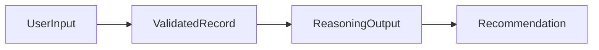

This improves:

- reproducibility
- traceability
- explainability

---

## 3.4 Structured Communication

Machine-to-machine communication should always use structured contracts.

Natural language belongs exclusively to:

- user interaction
- notebook presentation
- report generation

Planner and agent communication should remain deterministic.

---

## 3.5 Explainability by Design

Every reasoning-related model should preserve enough information to reconstruct:

- why it exists
- which component created it
- supporting evidence
- assumptions
- confidence

The data model itself therefore becomes an explainability mechanism.

---

# 4. Canonical Data Categories

WalletMind organizes all models into six conceptual categories.

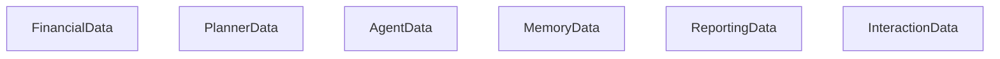

---

## Financial Data

Represents user financial information.

Includes:

- Transaction
- Statement
- Budget
- Goal

---

## Planner Data

Represents orchestration state.

Includes:

- PlannerRequest
- PlannerResponse

---

## Agent Data

Represents communication between Planner and agents.

Includes:

- AgentRequest
- AgentResponse

---

## Memory Data

Represents persistent contextual knowledge.

Includes:

- MemoryRecord

---

## Reporting Data

Represents explainable outputs.

Includes:

- Recommendation
- Forecast
- Risk
- Report

---

## Interaction Data

Represents user communication.

Includes:

- Conversation
- Feedback

---

# 5. Common Model Structure

Although every model serves a different purpose, all contracts share a common architectural structure.

```text
Identity
Metadata
Domain Data
Relationships
Validation
Lifecycle
Ownership
Version
```

Each model should therefore answer the following questions:

| Question                          | Purpose                 |
| --------------------------------- | ----------------------- |
| What is this object?              | Identity                |
| Why does it exist?                | Description             |
| Who owns it?                      | Architectural ownership |
| What information does it contain? | Fields                  |
| How is it validated?              | Validation rules        |
| What does it relate to?           | Relationships           |
| How does it evolve?               | Lifecycle               |
| Can it change?                    | Mutability              |
| Is it compatible?                 | Versioning              |

---

# 6. Model Ownership

Ownership is fundamental to WalletMind's architecture.

No data object should have multiple competing owners.

```mermaid
flowchart LR

Planner
--> Planner Models

Agents
--> Domain Models

Memory
--> Memory Records

Reports
--> Report Models
```

---

## Ownership Responsibilities

Model owners are responsible for:

- creation
- validation
- lifecycle management
- schema evolution
- relationship integrity

Consumers should never assume ownership.

---

## Ownership Matrix

| Category          | Primary Owner          |
| ----------------- | ---------------------- |
| Financial Records | Statement Parser Agent |
| Planner Models    | Planner                |
| Agent Models      | Planner + Agent        |
| Memory Models     | Memory Update Agent    |
| Reports           | Report Generator Agent |
| Conversations     | Conversation Manager   |
| Feedback          | Feedback Manager       |

---

# 7. Data Lifecycle Philosophy

Every model progresses through a predictable lifecycle.

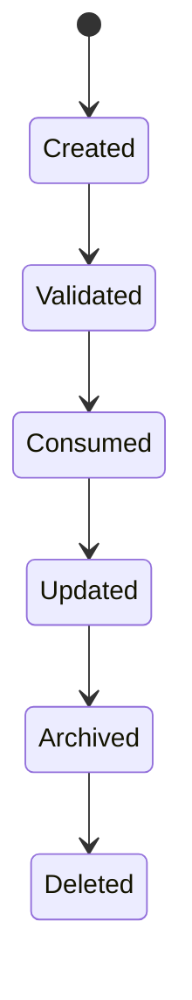

Not every object reaches every stage.

For example:

PlannerRequest

```text
Created

↓

Validated

↓

Consumed

↓

Expired
```

MemoryRecord

```text
Created

↓

Validated

↓

Stored

↓

Retrieved

↓

Updated

↓

Archived
```

Different lifecycles exist because different information serves different architectural purposes.

---

# 8. Validation Philosophy

Validation occurs at multiple architectural layers.


---

## Schema Validation

Ensures required fields exist.

Examples:

- identifiers
- timestamps
- required financial values

---

## Semantic Validation

Ensures values make sense.

Examples:

- amount ≥ 0 where appropriate
- dates are valid
- supported currencies
- valid categories

---

## Planner Validation

Ensures planner contracts are complete.

Examples:

- task dependencies
- execution identifiers
- agent routing

---

## Agent Validation

Ensures reasoning outputs satisfy contracts.

Examples:

- confidence present
- evidence included
- structured recommendations

---

## Critic Validation

Final architectural verification before user-facing output.

Ensures:

- consistency
- completeness
- explainability

---

# 9. Relationship Architecture

WalletMind intentionally models relationships rather than duplication.

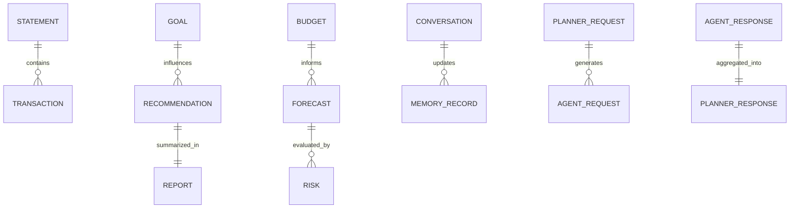

Relationships should reference objects conceptually rather than embedding unnecessary duplication.

---

# 10. Canonical Entity Relationships

The following diagram illustrates how the primary models collaborate throughout a typical WalletMind execution.

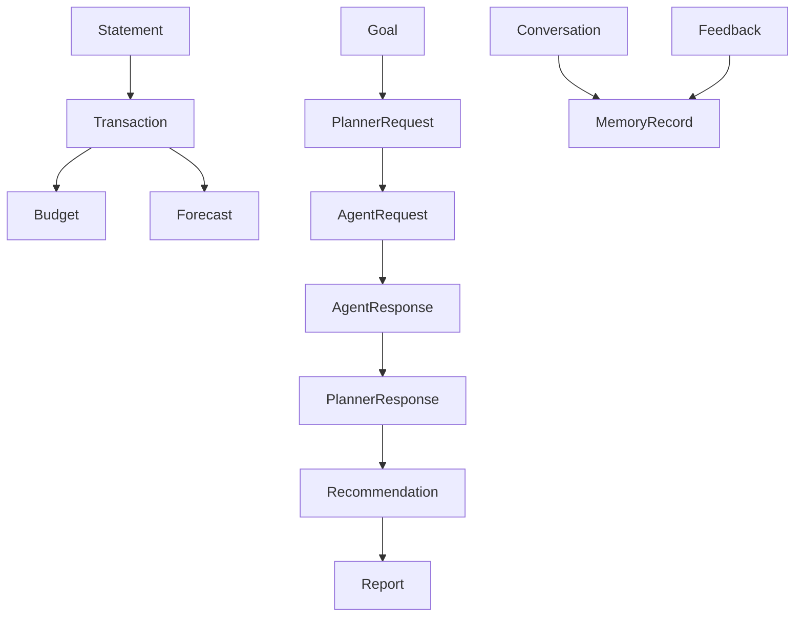

This relationship graph emphasizes:

- Planner-centered orchestration
- Modular reasoning
- Persistent memory
- Explainable outputs

---

# 11. Cross-Cutting Metadata

Every model should include conceptual metadata.

Typical metadata categories include:

| Metadata     | Purpose                             |
| ------------ | ----------------------------------- |
| Identifier   | Unique reference                    |
| Version      | Schema compatibility                |
| Source       | Originating component               |
| Created Time | Traceability                        |
| Updated Time | Lifecycle                           |
| Confidence   | Reasoning quality (when applicable) |
| Tags         | Classification                      |
| Status       | Lifecycle tracking                  |

Metadata enables:

- planner observability
- notebook demonstrations
- debugging
- replay
- evaluation

---

# 12. Versioning Strategy

WalletMind treats data contracts as long-lived architectural interfaces.

Every model should define a conceptual schema version.

```text
Major.Minor

1.0

1.1

2.0
```

Guidelines:

| Change                 | Version |
| ---------------------- | ------- |
| New optional field     | Minor   |
| New validation rule    | Minor   |
| Breaking schema change | Major   |
| Field removal          | Major   |

Stable contracts improve compatibility between:

- Planner
- Agents
- Memory
- MCP tools
- Notebook demonstrations

---

# 13. Design Constraints

Every future data model should satisfy the following constraints.

| Constraint         | Requirement                     |
| ------------------ | ------------------------------- |
| Structured         | No implicit fields              |
| Explainable        | Preserve reasoning context      |
| Immutable Inputs   | Requests should not mutate      |
| Planner Compatible | Support orchestration           |
| Agent Compatible   | Support modular reasoning       |
| Memory Compatible  | Persist only meaningful context |
| Notebook Friendly  | Easy to visualize               |
| JSON Serializable  | Portable across tools           |
| Validation Ready   | Suitable for schema enforcement |
| Extensible         | New fields without redesign     |

These constraints preserve architectural consistency across the entire project.

---

# 14. Google ADK Mapping

The WalletMind data model aligns closely with the design philosophy of Google's Agent Development Kit.

| ADK Concept        | WalletMind Data Model           |
| ------------------ | ------------------------------- |
| Planner Context    | PlannerRequest                  |
| Agent Task         | AgentRequest                    |
| Agent Result       | AgentResponse                   |
| Shared Context     | MemoryRecord                    |
| Tool Invocation    | Tool Payload (future extension) |
| Execution Trace    | PlannerResponse                 |
| Reasoning Artifact | Recommendation / Report         |

This separation of contracts supports:

- planner-driven orchestration
- reusable agent interfaces
- deterministic communication
- explainable execution

---

# 15. Kaggle Competition Mapping

The data model directly supports the evaluation objectives of the Google Kaggle **AI Agents: Intensive Vibe Coding Capstone Project**.

| Competition Focus         | Supporting Models                           |
| ------------------------- | ------------------------------------------- |
| Multi-Agent Collaboration | PlannerRequest, AgentRequest, AgentResponse |
| Planner Intelligence      | PlannerResponse                             |
| Persistent Memory         | MemoryRecord                                |
| Explainability            | Recommendation, Report                      |
| Structured Reasoning      | Risk, Forecast                              |
| Notebook Storytelling     | Conversation, Report                        |
| Reproducibility           | Versioned Contracts                         |
| Extensibility             | Modular Entity Relationships                |

By defining every interaction as a structured architectural contract, WalletMind becomes easier to understand, evaluate, reproduce, and extend—qualities that are central to both Google ADK best practices and the competition's judging philosophy.

---

## Next Part

**Part II — Core Financial Models**

- Transaction
- Statement
- Budget
- Goal

Each model will include:

- Description
- Ownership
- Responsibilities
- Field Specifications
- Validation Rules
- Relationships
- Example JSON
- Lifecycle
- Design Rationale
- Future Extension Notes

# Part II — Core Financial Models

> **Purpose**
>
> This section defines the foundational financial entities that represent the user's financial world.
>
> Unlike internal planner or agent contracts, these models represent domain knowledge that persists across conversations and reasoning sessions.
>
> These models serve as the canonical financial language shared by every Planner, Agent, Tool, Memory component, Notebook demonstration, and Report.
>
> Every higher-level reasoning artifact ultimately derives from these foundational entities.

---

# Table of Contents

16. Financial Data Model Overview
17. Transaction Model
18. Statement Model
19. Budget Model
20. Goal Model
21. Financial Model Relationships
22. Cross-Model Validation Rules

---

# 16. Financial Data Model Overview

Financial data is the foundation upon which all reasoning within WalletMind is built.

Unlike traditional budgeting applications, WalletMind does not treat these entities as merely historical records.

Instead, they become reasoning inputs used to support:

- planning
- forecasting
- budgeting
- risk analysis
- recommendation generation
- long-term personalization

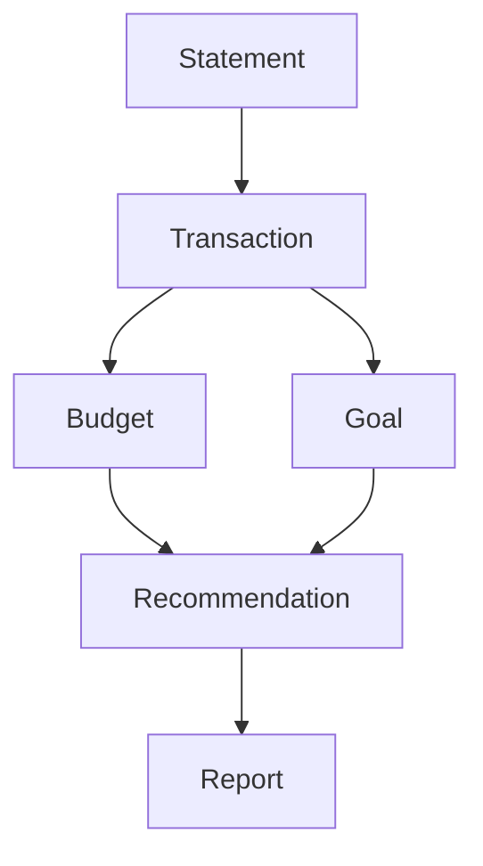

Each financial entity answers a different architectural question.

| Model       | Primary Question                    |
| ----------- | ----------------------------------- |
| Transaction | What financial activity occurred?   |
| Statement   | Where did financial data originate? |
| Budget      | What spending strategy exists?      |
| Goal        | What future outcome is desired?     |

---

# 17. Transaction Model

## 17.1 Description

The Transaction model represents the smallest unit of financial activity within WalletMind.

A transaction describes the movement of money between parties or accounts.

Transactions are immutable records once validated.

Derived classifications or analytical insights should never overwrite the original transaction.

Instead, additional reasoning artifacts should reference the transaction.

---

## 17.2 Architectural Purpose

The Transaction model exists to provide:

- financial history
- spending analysis
- merchant intelligence
- budgeting inputs
- forecasting inputs
- anomaly detection
- recommendation evidence

Nearly every financial reasoning workflow begins with transactions.

---

## 17.3 Ownership

Primary Owner

**Statement Parser Agent**

Secondary Consumers

- Expense Intelligence Agent
- Budget Advisor Agent
- Cash Flow Forecast Agent
- Risk Analysis Agent
- Report Generator Agent
- Memory Update Agent

---

## 17.4 Field Specifications

| Field               | Type         | Required | Description                     |
| ------------------- | ------------ | -------- | ------------------------------- |
| transaction_id      | UUID         | Yes      | Unique identifier               |
| statement_id        | UUID         | Yes      | Parent statement                |
| account_id          | UUID         | Optional | Source account                  |
| transaction_date    | Date         | Yes      | Effective transaction date      |
| posting_date        | Date         | Optional | Bank posting date               |
| amount              | Decimal      | Yes      | Transaction amount              |
| currency            | ISO Currency | Yes      | Currency code                   |
| direction           | Enum         | Yes      | Debit or Credit                 |
| merchant_name       | String       | Optional | Raw merchant                    |
| normalized_merchant | String       | Optional | Standardized merchant           |
| category            | Enum         | Optional | Spending category               |
| subcategory         | String       | Optional | Detailed category               |
| payment_method      | Enum         | Optional | Card, UPI, Transfer, Cash, etc. |
| location            | String       | Optional | Merchant location               |
| description         | String       | Optional | Original description            |
| tags                | Array        | Optional | User/system tags                |
| confidence          | Float        | Optional | Extraction confidence           |
| metadata            | Object       | Optional | Source metadata                 |

---

## 17.5 Validation Rules

Required

- transaction_id unique
- amount present
- currency valid ISO code
- transaction_date valid
- direction valid

Business Validation

- amount > 0
- category belongs to supported taxonomy
- confidence between 0 and 1
- normalized merchant must preserve original merchant reference

Rejected Transactions

Examples:

- missing amount
- invalid date
- malformed currency
- duplicate identifier

---

## 17.6 Relationships

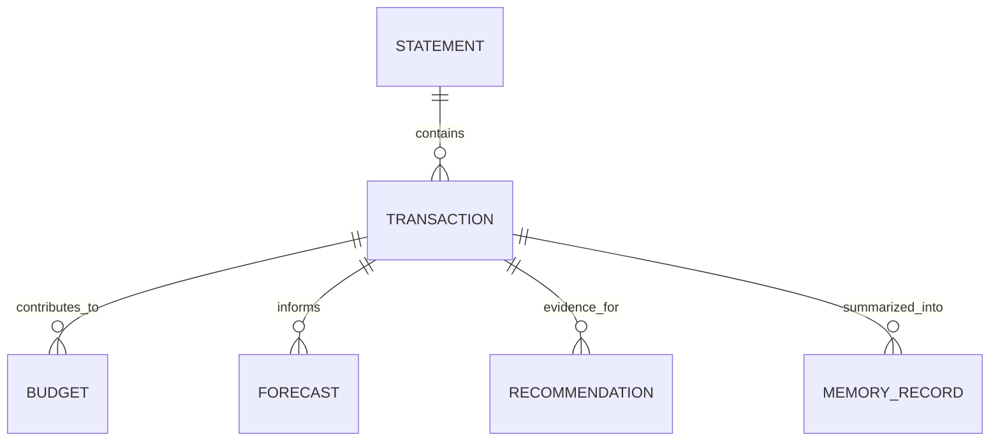

---

## 17.7 Example JSON

```json
{
  "transaction_id": "txn_001",
  "statement_id": "stmt_001",
  "transaction_date": "2026-06-10",
  "amount": 84.5,
  "currency": "USD",
  "direction": "debit",
  "merchant_name": "Whole Foods",
  "normalized_merchant": "Whole Foods Market",
  "category": "Groceries",
  "payment_method": "Credit Card",
  "confidence": 0.98
}
```

---

## 17.8 Lifecycle

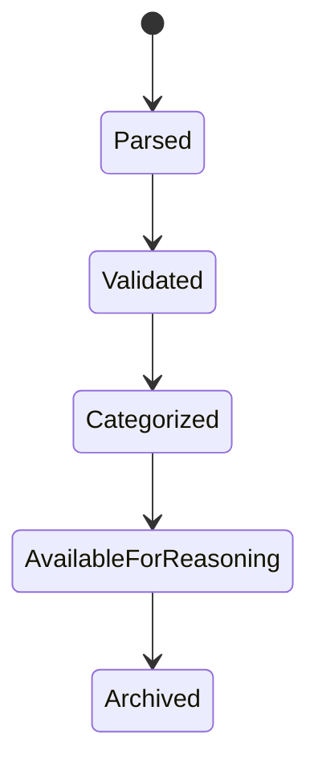

---

## 17.9 Design Rationale

Transactions remain immutable because they represent objective historical evidence.

Reasoning evolves.

Evidence should not.

---

# 18. Statement Model

## 18.1 Description

A Statement represents a financial document that serves as the authoritative source for one or more transactions.

Examples include:

- bank statements
- credit card statements
- CSV exports
- PDF statements
- spreadsheet exports

WalletMind reasons primarily over transactions while preserving the statement as provenance.

---

## 18.2 Architectural Purpose

Statements provide:

- provenance
- ingestion tracking
- parser metadata
- auditability
- document relationships

---

## 18.3 Ownership

Primary Owner

**Statement Parser Agent**

Consumers

- Transaction Extractor
- Validator Agent
- Memory Update Agent
- Report Generator

---

## 18.4 Field Specifications

| Field                  | Type      | Required | Description               |
| ---------------------- | --------- | -------- | ------------------------- |
| statement_id           | UUID      | Yes      | Identifier                |
| document_name          | String    | Yes      | Original filename         |
| source_type            | Enum      | Yes      | PDF, CSV, XLSX            |
| institution            | String    | Optional | Financial institution     |
| account_name           | String    | Optional | Account reference         |
| statement_period_start | Date      | Yes      | Coverage start            |
| statement_period_end   | Date      | Yes      | Coverage end              |
| transaction_count      | Integer   | Optional | Parsed transactions       |
| parser_version         | String    | Optional | Parser metadata           |
| ingestion_timestamp    | Timestamp | Yes      | Import time               |
| checksum               | String    | Optional | Duplicate detection       |
| extraction_confidence  | Float     | Optional | Overall parser confidence |

---

## 18.5 Validation Rules

- period start before end
- unique checksum where available
- supported source type
- parser confidence between 0 and 1

---

## 18.6 Relationships

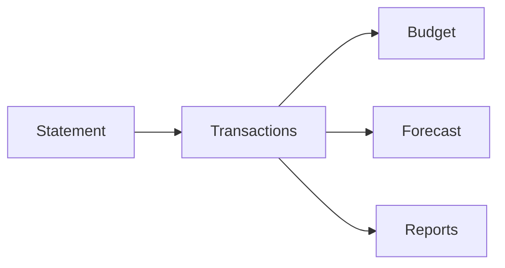

---

## 18.7 Example JSON

```json
{
  "statement_id": "stmt_001",
  "document_name": "May2026.pdf",
  "source_type": "PDF",
  "institution": "Example Bank",
  "statement_period_start": "2026-05-01",
  "statement_period_end": "2026-05-31",
  "transaction_count": 142,
  "extraction_confidence": 0.97
}
```

---

## 18.8 Lifecycle

```text
Uploaded

↓

Parsed

↓

Validated

↓

Transactions Extracted

↓

Archived
```

---

## 18.9 Design Rationale

Statements preserve the origin of financial information without becoming the primary reasoning artifact.

Reasoning should occur on structured financial records rather than raw documents.

---

# 19. Budget Model

## 19.1 Description

The Budget model represents an intentional spending strategy rather than historical spending.

It captures desired allocation of financial resources toward categories, goals, or constraints.

Budgets may evolve over time as user priorities change.

---

## 19.2 Architectural Purpose

Budgets support:

- spending optimization
- variance analysis
- savings recommendations
- forecasting
- planner reasoning

---

## 19.3 Ownership

Primary Owner

**Budget Advisor Agent**

Consumers

- Forecast Agent
- Goal Planning Agent
- Recommendation Generator
- Report Generator

---

## 19.4 Field Specifications

| Field                | Type         | Required | Description             |
| -------------------- | ------------ | -------- | ----------------------- |
| budget_id            | UUID         | Yes      | Identifier              |
| user_id              | UUID         | Yes      | Budget owner            |
| name                 | String       | Yes      | Budget name             |
| period               | Enum         | Yes      | Monthly, Weekly, Annual |
| total_budget         | Decimal      | Yes      | Total allocation        |
| categories           | Array        | Yes      | Category allocations    |
| savings_target       | Decimal      | Optional | Planned savings         |
| emergency_allocation | Decimal      | Optional | Reserve allocation      |
| currency             | ISO Currency | Yes      | Currency                |
| effective_date       | Date         | Yes      | Start date              |
| expiration_date      | Date         | Optional | End date                |
| status               | Enum         | Yes      | Active, Draft, Archived |

---

## 19.5 Validation Rules

- total budget > 0
- category totals should not exceed total budget
- dates valid
- supported currency
- status valid

---

## 19.6 Relationships

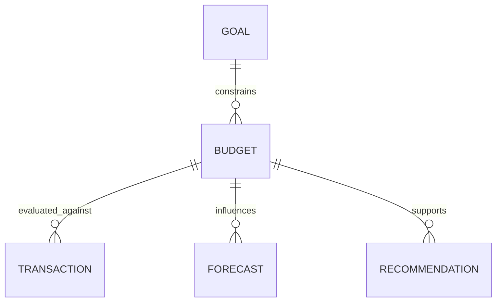

---

## 19.7 Example JSON

```json
{
  "budget_id": "budget_001",
  "name": "Monthly Budget",
  "period": "Monthly",
  "total_budget": 4500,
  "currency": "USD",
  "categories": [
    {
      "name": "Housing",
      "allocation": 1600
    },
    {
      "name": "Food",
      "allocation": 650
    }
  ],
  "status": "Active"
}
```

---

## 19.8 Lifecycle

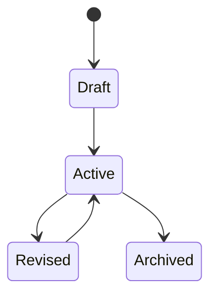

---

## 19.9 Design Rationale

Budgets are planning artifacts.

They describe intended financial behavior rather than observed behavior.

---

# 20. Goal Model

## 20.1 Description

Goals represent the desired future financial outcomes that drive WalletMind's planner-driven reasoning.

Goals are first-class architectural entities.

Nearly every Planner execution begins by retrieving or updating goals.

---

## 20.2 Architectural Purpose

Goals enable:

- planner orchestration
- recommendation prioritization
- forecasting
- scenario simulation
- progress tracking
- personalization

---

## 20.3 Ownership

Primary Owner

**Goal Planning Agent**

Consumers

- Planner
- Forecast Agent
- Risk Agent
- Financial Coach
- Recommendation Generator
- Memory System

---

## 20.4 Field Specifications

| Field          | Type    | Required | Description                                     |
| -------------- | ------- | -------- | ----------------------------------------------- |
| goal_id        | UUID    | Yes      | Identifier                                      |
| user_id        | UUID    | Yes      | Goal owner                                      |
| title          | String  | Yes      | Goal title                                      |
| description    | String  | Optional | Goal details                                    |
| goal_type      | Enum    | Yes      | Savings, Debt, Investment, Purchase, Retirement |
| target_amount  | Decimal | Optional | Financial target                                |
| current_amount | Decimal | Optional | Current progress                                |
| target_date    | Date    | Optional | Desired completion                              |
| priority       | Enum    | Yes      | High, Medium, Low                               |
| status         | Enum    | Yes      | Planned, Active, Completed, Archived            |
| dependencies   | Array   | Optional | Related goals                                   |
| assumptions    | Array   | Optional | Planning assumptions                            |

---

## 20.5 Validation Rules

- priority required
- target amount positive
- current amount non-negative
- target date valid
- supported goal type

---

## 20.6 Relationships

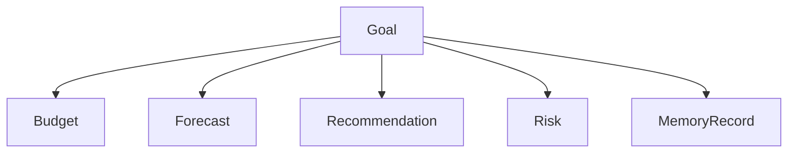

---

## 20.7 Example JSON

```json
{
  "goal_id": "goal_001",
  "title": "Buy a Home",
  "goal_type": "Home Purchase",
  "target_amount": 80000,
  "current_amount": 18000,
  "target_date": "2030-06-01",
  "priority": "High",
  "status": "Active"
}
```

---

## 20.8 Lifecycle

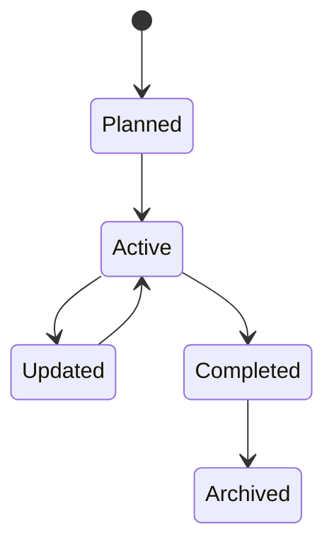

---

## 20.9 Design Rationale

Goals define **why** the Planner performs reasoning.

Transactions describe history.

Goals define intent.

This distinction allows WalletMind to shift from retrospective financial analysis to future-oriented financial planning.

---

# 21. Financial Model Relationships

The four foundational financial models form the basis of all downstream reasoning.

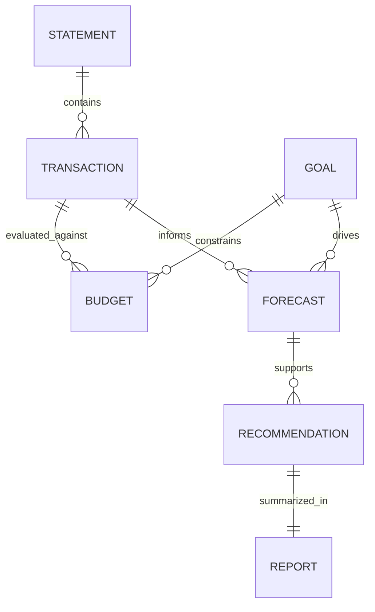

These relationships intentionally avoid circular ownership while preserving traceability from raw financial evidence to user-facing recommendations.

---

# 22. Cross-Model Validation Rules

To ensure consistency across all financial entities, WalletMind applies the following architectural validation rules.

| Rule                                      | Applies To                | Purpose          |
| ----------------------------------------- | ------------------------- | ---------------- |
| Unique identifiers                        | All models                | Traceability     |
| ISO currency codes                        | Transaction, Budget, Goal | Interoperability |
| Immutable financial evidence              | Transaction, Statement    | Auditability     |
| Positive monetary values where applicable | Transaction, Budget, Goal | Data integrity   |
| Explicit lifecycle state                  | Budget, Goal, Statement   | State management |
| Referential integrity                     | All relationships         | Consistency      |
| Version compatibility                     | All models                | Schema evolution |

These rules ensure that every financial model can be safely consumed by the Planner, specialized agents, Memory subsystem, reporting pipeline, and notebook demonstrations without ambiguity.

---

## Next Part

**Part III — AI Reasoning Models**

The next section specifies the core reasoning contracts used by WalletMind's planner-driven architecture:

- Recommendation
- Risk
- Forecast
- PlannerRequest
- PlannerResponse
- AgentRequest
- AgentResponse

These models define the structured language used for multi-agent collaboration, orchestration, explainability, and execution within the Google ADK ecosystem.

# Part III — AI Reasoning Models

> **Purpose**
>
> This section defines the canonical reasoning contracts used by WalletMind's Planner-driven multi-agent architecture.
>
> Unlike the financial models defined in Part II, these models do not represent financial facts. Instead, they represent **reasoning artifacts**, **execution contracts**, and **collaboration interfaces** exchanged between the Planner, specialized agents, Memory subsystem, Critic Agent, and Report Generator.
>
> These models form the structured communication language of WalletMind and are intentionally designed to align with Google Agent Development Kit (ADK) orchestration patterns while remaining implementation-independent.

---

# Table of Contents

23. AI Reasoning Model Overview
24. Recommendation Model
25. Risk Model
26. Forecast Model
27. PlannerRequest Model
28. PlannerResponse Model
29. AgentRequest Model
30. AgentResponse Model
31. Cross-Model Relationships
32. Reasoning Validation Rules

---

# 23. AI Reasoning Model Overview

The Planner coordinates reasoning by exchanging structured contracts rather than natural language.


Each reasoning model has a single architectural responsibility.

| Model           | Purpose                                   |
| --------------- | ----------------------------------------- |
| Recommendation  | User-facing financial guidance            |
| Risk            | Structured financial risk assessment      |
| Forecast        | Future financial projection               |
| PlannerRequest  | Planner execution contract                |
| PlannerResponse | Planner execution result                  |
| AgentRequest    | Task assigned to an agent                 |
| AgentResponse   | Structured reasoning returned by an agent |

These models are transient execution artifacts rather than persistent financial records.

---

# 24. Recommendation Model

## 24.1 Description

The Recommendation model represents WalletMind's primary user-facing reasoning artifact.

It communicates **what** the system recommends, **why** the recommendation exists, **which agents contributed**, and **how confident** the system is.

Recommendations should never consist solely of generated text.

Instead, they combine structured reasoning with explainable summaries.

---

## 24.2 Architectural Purpose

Recommendations support:

- financial guidance
- explainability
- notebook storytelling
- planner aggregation
- report generation
- memory summarization

---

## 24.3 Ownership

Primary Owner

**Report Generator Agent**

Contributors

- Budget Advisor Agent
- Goal Planning Agent
- Cash Flow Forecast Agent
- Risk Analysis Agent
- Financial Coach Agent
- Scenario Simulator Agent
- Planner

---

## 24.4 Field Specifications

| Field               | Type      | Required | Description                             |
| ------------------- | --------- | -------- | --------------------------------------- |
| recommendation_id   | UUID      | Yes      | Unique identifier                       |
| title               | String    | Yes      | Recommendation title                    |
| summary             | String    | Yes      | Executive summary                       |
| recommendation_type | Enum      | Yes      | Budget, Savings, Investment, Goal, Risk |
| rationale           | String    | Yes      | Why the recommendation exists           |
| supporting_evidence | Array     | Yes      | Evidence references                     |
| assumptions         | Array     | Optional | Planning assumptions                    |
| trade_offs          | Array     | Optional | Benefits and drawbacks                  |
| contributing_agents | Array     | Yes      | Participating agents                    |
| confidence          | Float     | Yes      | Overall confidence                      |
| priority            | Enum      | Yes      | High, Medium, Low                       |
| related_goals       | Array     | Optional | Referenced goals                        |
| generated_at        | Timestamp | Yes      | Creation timestamp                      |

---

## 24.5 Validation Rules

- confidence between 0 and 1
- at least one contributing agent
- rationale required
- summary required
- supporting evidence cannot be empty
- priority valid

---

## 24.6 Relationships

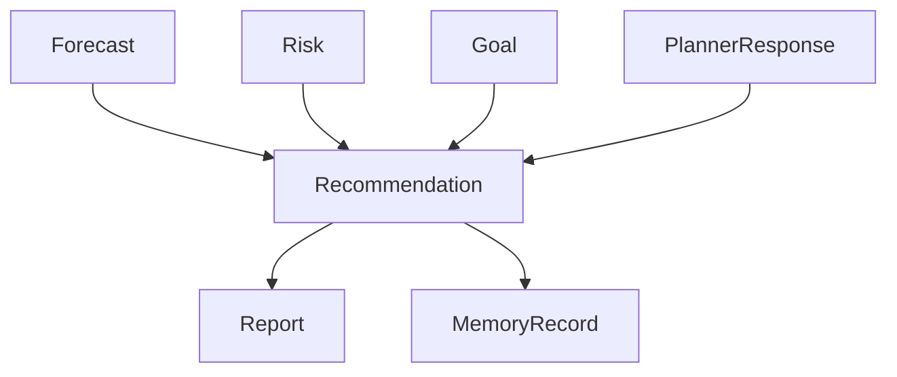

---

## 24.7 Example JSON

```json
{
  "recommendation_id": "rec_001",
  "title": "Increase Monthly Savings",
  "summary": "Increase monthly savings by 10% to meet your home purchase goal.",
  "recommendation_type": "Savings",
  "rationale": "Current savings trajectory will miss the target date.",
  "confidence": 0.92,
  "priority": "High",
  "contributing_agents": ["Goal Planning Agent", "Cash Flow Forecast Agent"]
}
```

---

## 24.8 Lifecycle

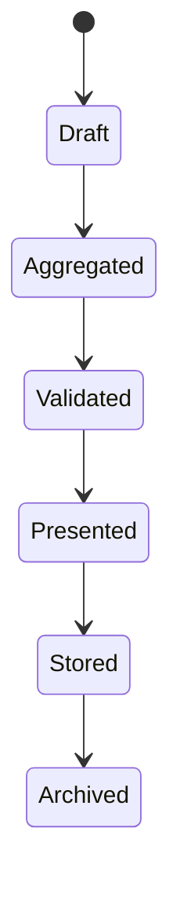

---

## 24.9 Design Rationale

Recommendations represent synthesized reasoning rather than raw analytical output.

They intentionally preserve explainability and traceability.

---

# 25. Risk Model

## 25.1 Description

The Risk model represents structured financial vulnerabilities identified during reasoning.

Unlike recommendations, risks describe potential negative outcomes rather than proposed actions.

---

## 25.2 Architectural Purpose

The Risk model supports:

- Planner decision making
- recommendation validation
- scenario simulation
- financial resilience analysis
- report generation

---

## 25.3 Ownership

Primary Owner

**Risk Analysis Agent**

Consumers

- Planner
- Critic Agent
- Scenario Simulator
- Report Generator

---

## 25.4 Field Specifications

| Field               | Type   | Required | Description                               |
| ------------------- | ------ | -------- | ----------------------------------------- |
| risk_id             | UUID   | Yes      | Identifier                                |
| title               | String | Yes      | Risk title                                |
| category            | Enum   | Yes      | Liquidity, Debt, Income, Goal, Investment |
| description         | String | Yes      | Structured explanation                    |
| severity            | Enum   | Yes      | Low, Medium, High                         |
| likelihood          | Enum   | Yes      | Low, Medium, High                         |
| impact              | String | Yes      | Expected consequence                      |
| mitigation_options  | Array  | Optional | Possible actions                          |
| supporting_evidence | Array  | Yes      | Evidence references                       |
| confidence          | Float  | Yes      | Assessment confidence                     |

---

## 25.5 Validation Rules

- severity valid
- likelihood valid
- confidence between 0 and 1
- supporting evidence required

---

## 25.6 Relationships

```mermaid
flowchart LR

Forecast

-->

Risk

Goal

-->

Risk

Risk

-->

Recommendation

Risk

-->

Report
```

---

## 25.7 Example JSON

```json
{
  "risk_id": "risk_001",
  "title": "Emergency Fund Shortfall",
  "category": "Liquidity",
  "severity": "High",
  "likelihood": "Medium",
  "impact": "Emergency savings may be depleted within four months.",
  "confidence": 0.9
}
```

---

## 25.8 Lifecycle

```text
Detected

↓

Analyzed

↓

Validated

↓

Referenced

↓

Archived
```

---

## 25.9 Design Rationale

Separating risks from recommendations allows WalletMind to distinguish between observed vulnerabilities and proposed actions.

---

# 26. Forecast Model

## 26.1 Description

The Forecast model represents projected future financial outcomes based on explicit assumptions.

Forecasts are scenario-dependent rather than predictions of certainty.

---

## 26.2 Architectural Purpose

Forecasts support:

- goal planning
- cash flow analysis
- scenario simulation
- planner reasoning
- recommendation generation

---

## 26.3 Ownership

Primary Owner

**Cash Flow Forecast Agent**

Consumers

- Planner
- Goal Planning Agent
- Risk Analysis Agent
- Report Generator

---

## 26.4 Field Specifications

| Field            | Type      | Required | Description                             |
| ---------------- | --------- | -------- | --------------------------------------- |
| forecast_id      | UUID      | Yes      | Identifier                              |
| forecast_type    | Enum      | Yes      | Cash Flow, Savings, Debt, Goal Progress |
| planning_horizon | String    | Yes      | Time horizon                            |
| assumptions      | Array     | Yes      | Modeling assumptions                    |
| projected_values | Array     | Yes      | Structured projections                  |
| confidence       | Float     | Yes      | Forecast confidence                     |
| scenario         | String    | Optional | Scenario name                           |
| created_at       | Timestamp | Yes      | Creation timestamp                      |

---

## 26.5 Validation Rules

- assumptions required
- confidence between 0 and 1
- planning horizon required
- projected values not empty

---

## 26.6 Relationships

```mermaid
flowchart TD

Transaction

-->

Forecast

Budget

-->

Forecast

Goal

-->

Forecast

Forecast

-->

Recommendation

Forecast

-->

Risk
```

---

## 26.7 Example JSON

```json
{
  "forecast_id": "forecast_001",
  "forecast_type": "Cash Flow",
  "planning_horizon": "24 Months",
  "scenario": "Baseline",
  "confidence": 0.89,
  "assumptions": ["Income remains stable", "Current spending continues"]
}
```

---

## 26.8 Lifecycle

```mermaid
stateDiagram-v2

[*] --> Generated

Generated --> Reviewed

Reviewed --> Consumed

Consumed --> Archived
```

---

## 26.9 Design Rationale

Forecasts intentionally preserve assumptions because future reasoning is only meaningful when users understand the conditions under which projections were generated.

---

# 27. PlannerRequest Model

## 27.1 Description

PlannerRequest is the canonical entry contract for every Planner execution.

Every user interaction becomes a PlannerRequest before orchestration begins.

---

## 27.2 Architectural Purpose

PlannerRequest provides:

- execution context
- user intent
- execution identifiers
- planner metadata
- routing information

---

## 27.3 Ownership

Primary Owner

**Planner**

---

## 27.4 Field Specifications

| Field              | Type   | Required | Description          |
| ------------------ | ------ | -------- | -------------------- |
| request_id         | UUID   | Yes      | Execution identifier |
| session_id         | UUID   | Yes      | Session identifier   |
| user_id            | UUID   | Optional | User identifier      |
| user_prompt        | String | Yes      | Original request     |
| detected_intent    | Enum   | Optional | Planner intent       |
| goals              | Array  | Optional | Extracted goals      |
| constraints        | Array  | Optional | Planning constraints |
| retrieved_context  | Array  | Optional | Memory references    |
| execution_metadata | Object | Optional | Planner metadata     |

---

## 27.5 Validation Rules

- request ID required
- session ID required
- user prompt required

---

## 27.6 Example JSON

```json
{
  "request_id": "planner_001",
  "session_id": "session_001",
  "user_prompt": "Can I retire five years earlier?",
  "detected_intent": "Planning"
}
```

---

## 27.7 Lifecycle

```text
Created

↓

Validated

↓

Planned

↓

Executed

↓

Completed
```

---

# 28. PlannerResponse Model

## 28.1 Description

PlannerResponse represents the complete reasoning outcome of a Planner execution.

It summarizes orchestration rather than financial reasoning.

---

## 28.2 Field Specifications

| Field                | Type   | Required | Description                  |
| -------------------- | ------ | -------- | ---------------------------- |
| request_id           | UUID   | Yes      | Associated request           |
| execution_plan       | Object | Yes      | Planned workflow             |
| participating_agents | Array  | Yes      | Executed agents              |
| completed_tasks      | Array  | Yes      | Finished tasks               |
| failed_tasks         | Array  | Optional | Failed tasks                 |
| aggregated_outputs   | Array  | Yes      | Agent outputs                |
| validation_status    | Enum   | Yes      | Critic outcome               |
| confidence           | Float  | Yes      | Overall execution confidence |
| execution_summary    | String | Yes      | Planner explanation          |

---

## 28.3 Relationships

```mermaid
flowchart LR

PlannerRequest

-->

PlannerResponse

PlannerResponse

-->

Recommendation

PlannerResponse

-->

Report
```

---

## 28.4 Example JSON

```json
{
  "request_id": "planner_001",
  "participating_agents": ["Goal Planning Agent", "Risk Analysis Agent"],
  "validation_status": "Passed",
  "confidence": 0.91
}
```

---

## 28.5 Lifecycle

```text
Aggregating

↓

Validated

↓

Returned

↓

Archived
```

---

# 29. AgentRequest Model

## 29.1 Description

AgentRequest defines the standardized task contract sent from the Planner to a specialized agent.

Agents should receive only the context necessary to perform their assigned reasoning.

---

## 29.2 Ownership

Primary Owner

**Planner**

---

## 29.3 Field Specifications

| Field            | Type   | Required | Description          |
| ---------------- | ------ | -------- | -------------------- |
| task_id          | UUID   | Yes      | Task identifier      |
| request_id       | UUID   | Yes      | Planner request      |
| target_agent     | String | Yes      | Agent name           |
| capability       | String | Yes      | Requested capability |
| task_description | String | Yes      | Planner instruction  |
| context          | Object | Optional | Relevant memory      |
| inputs           | Object | Yes      | Structured inputs    |
| dependencies     | Array  | Optional | Required tasks       |

---

## 29.4 Example JSON

```json
{
  "task_id": "task_101",
  "target_agent": "Risk Analysis Agent",
  "capability": "Liquidity Assessment"
}
```

---

## 29.5 Lifecycle

```mermaid
stateDiagram-v2

[*] --> Created

Created --> Assigned

Assigned --> Executing

Executing --> Completed
```

---

# 30. AgentResponse Model

## 30.1 Description

AgentResponse is the canonical reasoning artifact returned by every specialized agent.

All agents share this common interface regardless of their domain.

---

## 30.2 Ownership

Primary Owner

**Executing Agent**

Consumer

**Planner**

---

## 30.3 Field Specifications

| Field             | Type   | Required | Description           |
| ----------------- | ------ | -------- | --------------------- |
| task_id           | UUID   | Yes      | Associated task       |
| agent_name        | String | Yes      | Responding agent      |
| reasoning_summary | String | Yes      | Structured reasoning  |
| findings          | Array  | Yes      | Analytical findings   |
| evidence          | Array  | Yes      | Supporting evidence   |
| assumptions       | Array  | Optional | Reasoning assumptions |
| confidence        | Float  | Yes      | Agent confidence      |
| recommendations   | Array  | Optional | Suggested actions     |
| metadata          | Object | Optional | Diagnostics           |

---

## 30.4 Validation Rules

- evidence required
- confidence between 0 and 1
- findings required
- reasoning summary required

---

## 30.5 Example JSON

```json
{
  "task_id": "task_101",
  "agent_name": "Risk Analysis Agent",
  "reasoning_summary": "Emergency savings are below the recommended threshold.",
  "confidence": 0.93
}
```

---

## 30.6 Lifecycle

```text
Reasoning

↓

Validated

↓

Returned

↓

Aggregated

↓

Archived
```

---

## 30.7 Design Rationale

A standardized AgentResponse enables the Planner to aggregate results consistently, regardless of which specialized agent produced them.

---

# 31. Cross-Model Relationships

The reasoning models collaborate to support Planner-driven orchestration.

```mermaid
flowchart TD

PlannerRequest

-->

Planner

Planner

-->

AgentRequest

AgentRequest

-->

AgentResponse

AgentResponse

-->

PlannerResponse

PlannerResponse

-->

Recommendation

Recommendation

-->

Report

Recommendation

-->

MemoryRecord
```

This architecture reinforces:

- structured communication
- loose coupling
- explainability
- deterministic orchestration

---

# 32. Reasoning Validation Rules

All reasoning contracts must satisfy the following architectural constraints.

| Rule                          | Applies To                                                     | Purpose                     |
| ----------------------------- | -------------------------------------------------------------- | --------------------------- |
| Unique execution identifiers  | PlannerRequest, AgentRequest                                   | Traceability                |
| Confidence required           | Recommendation, Risk, Forecast, AgentResponse, PlannerResponse | Explainability              |
| Evidence required             | Recommendation, Risk, AgentResponse                            | Justification               |
| Explicit assumptions          | Forecast, Recommendation                                       | Transparency                |
| Structured outputs only       | PlannerResponse, AgentResponse                                 | Deterministic communication |
| Immutable execution contracts | PlannerRequest, AgentRequest                                   | Reproducibility             |
| Planner ownership preserved   | Planner models                                                 | Architectural integrity     |

These constraints ensure that every reasoning artifact remains compatible with Google ADK orchestration, WalletMind's planner-driven architecture, notebook demonstrations, and future Pydantic implementations.

---

## Next Part

**Part IV — Memory & Interaction Models**

This section defines the persistent contextual entities that enable long-term personalization and continuous learning:

- MemoryRecord
- Conversation
- Feedback

These models provide the architectural foundation for WalletMind's memory subsystem, conversational continuity, and adaptive reasoning.

# Part IV — Memory & Interaction Models

> **Purpose**
>
> This section defines the canonical models that enable WalletMind to maintain long-term contextual understanding, conversational continuity, and continuous improvement.
>
> Unlike the transient reasoning contracts described in Part III, these models represent information that persists beyond a single Planner execution.
>
> They form the architectural foundation of WalletMind's memory subsystem, allowing specialized agents to reason using accumulated knowledge while preserving transparency, explainability, and user control.
>
> These models are intentionally aligned with the Memory Architecture document and should be treated as the canonical contracts for persistent contextual knowledge.

---

# Table of Contents

33. Memory Model Overview
34. MemoryRecord Model
35. Conversation Model
36. Feedback Model
37. Cross-Model Relationships
38. Memory Validation Rules

---

# 33. Memory Model Overview

WalletMind distinguishes between **execution state** and **persistent knowledge**.

Execution state exists only for the duration of a Planner execution.

Persistent knowledge survives across multiple conversations.

```mermaid
flowchart TD

Conversation

-->

Planner

Planner

-->

AgentExecution

AgentExecution

-->

MemoryUpdate

MemoryUpdate

-->

MemoryRecord

MemoryRecord

-->

FuturePlannerRequest
```

The models in this section answer three fundamental questions.

| Model        | Purpose                                      |
| ------------ | -------------------------------------------- |
| MemoryRecord | What should WalletMind permanently remember? |
| Conversation | What occurred during this interaction?       |
| Feedback     | How should future reasoning improve?         |

These entities collectively enable long-term personalization without violating the architectural principle that agents remain stateless.

---

# 34. MemoryRecord Model

## 34.1 Description

The MemoryRecord model represents the smallest unit of persistent contextual knowledge within WalletMind.

Unlike financial transactions, which describe objective financial events, MemoryRecords describe **knowledge** derived from user interactions, planner executions, and validated reasoning.

Only information that improves future reasoning should become long-term memory.

---

## 34.2 Architectural Purpose

MemoryRecords support:

- user personalization
- planner context retrieval
- long-term goal tracking
- preference learning
- execution continuity
- recommendation refinement
- notebook demonstrations

Memory should never become a raw conversation archive.

Instead, it represents curated, structured knowledge.

---

## 34.3 Ownership

Primary Owner

**Memory Update Agent**

Consumers

- Planner
- User Profile Agent
- Goal Planning Agent
- Financial Coach Agent
- Recommendation Generator
- Memory Retrieval Tool

---

## 34.4 Field Specifications

| Field                 | Type      | Required | Description                                                                   |
| --------------------- | --------- | -------- | ----------------------------------------------------------------------------- |
| memory_id             | UUID      | Yes      | Unique identifier                                                             |
| user_id               | UUID      | Yes      | Memory owner                                                                  |
| memory_type           | Enum      | Yes      | Preference, Goal, Profile, Financial, Conversation Summary, Planner, Feedback |
| title                 | String    | Yes      | Short summary                                                                 |
| content               | Object    | Yes      | Structured memory payload                                                     |
| source                | Enum      | Yes      | Planner, Agent, User, Tool                                                    |
| originating_component | String    | Yes      | Creating component                                                            |
| related_entities      | Array     | Optional | Linked goals, reports, conversations                                          |
| importance            | Enum      | Yes      | High, Medium, Low                                                             |
| confidence            | Float     | Optional | Confidence in remembered information                                          |
| created_at            | Timestamp | Yes      | Creation timestamp                                                            |
| updated_at            | Timestamp | Optional | Last modification                                                             |
| expires_at            | Timestamp | Optional | Expiration policy                                                             |
| version               | String    | Yes      | Schema version                                                                |

---

## 34.5 Validation Rules

Required

- unique memory identifier
- memory type present
- structured content
- valid owner
- valid source

Business Validation

- confidence between 0 and 1
- importance valid
- expiration later than creation
- memory payload compatible with memory type

Only validated reasoning may become memory.

---

## 34.6 Relationships

```mermaid
erDiagram

CONVERSATION ||--o{ MEMORY_RECORD : summarizes

GOAL ||--o{ MEMORY_RECORD : references

RECOMMENDATION ||--o{ MEMORY_RECORD : stores

FEEDBACK ||--o{ MEMORY_RECORD : updates

PLANNER_RESPONSE ||--o{ MEMORY_RECORD : summarizes
```

---

## 34.7 Example JSON

```json
{
  "memory_id": "mem_001",
  "user_id": "user_001",
  "memory_type": "Goal",
  "title": "Primary Financial Goal",
  "content": {
    "goal": "Purchase a home",
    "target_year": 2030
  },
  "source": "Planner",
  "originating_component": "Goal Planning Agent",
  "importance": "High",
  "confidence": 0.96
}
```

---

## 34.8 Lifecycle

```mermaid
stateDiagram-v2

[*] --> Proposed

Proposed --> Validated

Validated --> Stored

Stored --> Retrieved

Retrieved --> Updated

Updated --> Stored

Stored --> Archived

Archived --> Deleted
```

---

## 34.9 Design Rationale

Memory should capture **knowledge**, not conversations.

For example:

Store:

- preferred budgeting style
- long-term financial goals
- investment preference
- recurring financial constraints

Do not store:

- every greeting
- transient reasoning
- intermediate planner state

This distinction keeps memory concise, useful, and explainable.

---

# 35. Conversation Model

## 35.1 Description

The Conversation model represents a complete interaction session between the user and WalletMind.

Unlike MemoryRecord, which stores curated knowledge, Conversation preserves the execution context and dialogue associated with a single reasoning session.

Conversations primarily support:

- explainability
- notebook replay
- execution tracing
- memory summarization
- report generation

---

## 35.2 Architectural Purpose

Conversation enables:

- conversational continuity
- planner traceability
- execution replay
- notebook demonstrations
- explainable reasoning
- report references

---

## 35.3 Ownership

Primary Owner

**Conversation Manager**

Consumers

- Planner
- Memory Update Agent
- Report Generator
- Notebook Demonstrations

---

## 35.4 Field Specifications

| Field             | Type      | Required | Description                 |
| ----------------- | --------- | -------- | --------------------------- |
| conversation_id   | UUID      | Yes      | Identifier                  |
| session_id        | UUID      | Yes      | Session identifier          |
| user_id           | UUID      | Optional | User reference              |
| started_at        | Timestamp | Yes      | Conversation start          |
| ended_at          | Timestamp | Optional | Conversation end            |
| user_messages     | Array     | Yes      | User prompts                |
| planner_requests  | Array     | Yes      | Planner inputs              |
| planner_responses | Array     | Yes      | Planner outputs             |
| reports_generated | Array     | Optional | Produced reports            |
| recommendations   | Array     | Optional | Delivered recommendations   |
| summary           | String    | Optional | Generated summary           |
| status            | Enum      | Yes      | Active, Completed, Archived |

---

## 35.5 Validation Rules

- session identifier required
- conversation identifier unique
- chronological timestamps
- planner references valid
- conversation status valid

---

## 35.6 Relationships

```mermaid
flowchart TD

Conversation

-->

PlannerRequest

PlannerRequest

-->

PlannerResponse

PlannerResponse

-->

Recommendation

Conversation

-->

Report

Conversation

-->

MemoryRecord
```

---

## 35.7 Example JSON

```json
{
  "conversation_id": "conv_001",
  "session_id": "session_001",
  "started_at": "2026-07-01T10:00:00Z",
  "status": "Completed",
  "summary": "Retirement planning discussion with scenario analysis."
}
```

---

## 35.8 Lifecycle

```mermaid
stateDiagram-v2

[*] --> Started

Started --> Active

Active --> Completed

Completed --> Summarized

Summarized --> Archived
```

---

## 35.9 Design Rationale

Conversation provides historical context for a reasoning session.

Memory extracts only the durable knowledge from that conversation.

This separation prevents conversational history from becoming long-term memory.

---

# 36. Feedback Model

## 36.1 Description

The Feedback model captures explicit user evaluation of WalletMind's recommendations, reports, explanations, and reasoning quality.

Feedback enables continuous architectural improvement without modifying historical reasoning artifacts.

Feedback is never treated as financial truth.

Instead, it represents user perception of system usefulness.

---

## 36.2 Architectural Purpose

Feedback supports:

- recommendation refinement
- personalization
- memory updates
- planner improvement
- notebook evaluation
- explainability assessment

---

## 36.3 Ownership

Primary Owner

**Feedback Manager**

Consumers

- Memory Update Agent
- Planner
- Financial Coach Agent
- Recommendation Generator

---

## 36.4 Field Specifications

| Field             | Type      | Required | Description                                  |
| ----------------- | --------- | -------- | -------------------------------------------- |
| feedback_id       | UUID      | Yes      | Identifier                                   |
| conversation_id   | UUID      | Yes      | Related conversation                         |
| recommendation_id | UUID      | Optional | Evaluated recommendation                     |
| report_id         | UUID      | Optional | Evaluated report                             |
| feedback_type     | Enum      | Yes      | Recommendation, Explanation, Planner, Report |
| rating            | Integer   | Optional | Numeric rating                               |
| sentiment         | Enum      | Optional | Positive, Neutral, Negative                  |
| comments          | String    | Optional | User comments                                |
| improvement_tags  | Array     | Optional | Suggested improvements                       |
| submitted_at      | Timestamp | Yes      | Submission time                              |

---

## 36.5 Validation Rules

- feedback identifier unique
- referenced entities valid
- supported feedback type
- rating within permitted range
- timestamp required

---

## 36.6 Relationships

```mermaid
flowchart LR

Feedback

-->

Recommendation

Feedback

-->

Conversation

Feedback

-->

MemoryRecord

Feedback

-->

Planner
```

---

## 36.7 Example JSON

```json
{
  "feedback_id": "feedback_001",
  "conversation_id": "conv_001",
  "recommendation_id": "rec_001",
  "feedback_type": "Recommendation",
  "rating": 5,
  "sentiment": "Positive",
  "comments": "The explanation clearly described the trade-offs."
}
```

---

## 36.8 Lifecycle

```mermaid
stateDiagram-v2

[*] --> Submitted

Submitted --> Validated

Validated --> Processed

Processed --> Incorporated

Incorporated --> Archived
```

---

## 36.9 Design Rationale

Feedback should influence future reasoning through Memory rather than directly altering historical recommendations.

This preserves reproducibility while allowing WalletMind to become progressively more personalized over time.

---

# 37. Cross-Model Relationships

The persistent models interact closely with Planner execution while remaining architecturally independent.

```mermaid
flowchart TD

Conversation

-->

PlannerRequest

PlannerRequest

-->

PlannerResponse

PlannerResponse

-->

Recommendation

Recommendation

-->

Feedback

Conversation

-->

MemoryRecord

Feedback

-->

MemoryRecord

MemoryRecord

-->

FuturePlannerRequest
```

This architecture ensures that:

- conversations provide execution history
- feedback refines future behavior
- memory preserves durable knowledge
- planners retrieve only relevant context

---

# 38. Memory Validation Rules

The following architectural constraints apply to every persistent model.

| Rule                                           | Applies To        | Purpose                   |
| ---------------------------------------------- | ----------------- | ------------------------- |
| Unique identifiers                             | All models        | Traceability              |
| Structured payloads                            | MemoryRecord      | Deterministic retrieval   |
| Immutable conversation history                 | Conversation      | Explainability            |
| Feedback never alters historical reasoning     | Feedback          | Reproducibility           |
| Memory created only from validated information | MemoryRecord      | Trustworthiness           |
| Explicit ownership                             | All models        | Architectural consistency |
| Schema version required                        | MemoryRecord      | Long-term compatibility   |
| Referential integrity                          | All relationships | Consistency               |

These validation rules ensure that WalletMind's persistent knowledge remains reliable, explainable, and reusable across Planner executions while supporting notebook demonstrations and long-term personalization.

---

## Next Part

**Part V — Reporting Models**

The next section defines the user-facing presentation contracts:

- Report
- Report Metadata
- Report Sections
- Explainability Objects

These models specify how WalletMind transforms validated multi-agent reasoning into structured, explainable financial reports suitable for users, notebook demonstrations, and Kaggle evaluation.

# Part V — Reporting Models & Cross-Cutting Data Contracts

> **Purpose**
>
> This section defines the canonical reporting contracts used to transform validated multi-agent reasoning into structured, explainable, and reproducible outputs.
>
> Reports are the primary user-facing artifacts of WalletMind. They consolidate Planner orchestration, specialized agent reasoning, supporting evidence, assumptions, confidence, and actionable recommendations into a single coherent object.
>
> These models are intentionally notebook-friendly and designed to showcase WalletMind's reasoning process for the Google ADK architecture and Kaggle AI Agents Capstone evaluation.

---

# Table of Contents

39. Report Model
40. Report Metadata
41. Report Sections
42. Explainability Object
43. Supporting Evidence Model
44. Assumption Model
45. Confidence Model
46. Report Relationships
47. Cross-Model Validation Rules
48. Complete Report Example
49. Report Lifecycle
50. Versioning Strategy
51. Google ADK Mapping
52. Kaggle Competition Mapping
53. Engineering Summary

---

# 39. Report Model

## 39.1 Description

The Report represents the final deliverable produced by WalletMind after Planner orchestration, multi-agent collaboration, Critic validation, and recommendation synthesis have completed.

Unlike a Recommendation, which captures one actionable insight, a Report represents the complete reasoning package for a user request.

A Report should allow users—and competition judges—to understand:

- what WalletMind concluded
- how the conclusion was reached
- which agents participated
- which assumptions were made
- which evidence was considered
- how confident the system is
- what actions are recommended

---

## 39.2 Architectural Purpose

Reports support:

- user communication
- notebook demonstrations
- explainability
- planner traceability
- report history
- reproducibility
- educational storytelling

---

## 39.3 Ownership

Primary Owner

**Report Generator Agent**

Contributors

- Planner
- Critic Agent
- All participating reasoning agents

---

## 39.4 Field Specifications

| Field             | Type      | Required | Description                                |
| ----------------- | --------- | -------- | ------------------------------------------ |
| report_id         | UUID      | Yes      | Report identifier                          |
| request_id        | UUID      | Yes      | Planner request                            |
| conversation_id   | UUID      | Yes      | Related conversation                       |
| report_type       | Enum      | Yes      | Planning, Budget, Goal, Forecast, Scenario |
| title             | String    | Yes      | Report title                               |
| executive_summary | String    | Yes      | High-level summary                         |
| report_sections   | Array     | Yes      | Structured sections                        |
| recommendations   | Array     | Yes      | Included recommendations                   |
| risks             | Array     | Optional | Risk summaries                             |
| forecasts         | Array     | Optional | Forecast summaries                         |
| explainability    | Object    | Yes      | Explainability contract                    |
| confidence        | Object    | Yes      | Confidence summary                         |
| metadata          | Object    | Yes      | Report metadata                            |
| generated_at      | Timestamp | Yes      | Generation timestamp                       |
| version           | String    | Yes      | Schema version                             |

---

## 39.5 Validation Rules

- report identifier required
- executive summary required
- at least one report section
- at least one recommendation
- explainability object required
- confidence object required

---

## 39.6 Relationships

```mermaid
flowchart TD

PlannerResponse

-->

Recommendation

Recommendation

-->

Report

Forecast

-->

Report

Risk

-->

Report

Report

-->

MemoryRecord
```

---

## 39.7 Example JSON

```json
{
  "report_id": "report_001",
  "report_type": "Goal Planning",
  "title": "Five-Year Home Purchase Plan",
  "executive_summary": "Your current savings trajectory is unlikely to reach the required down payment within five years without increasing monthly savings.",
  "version": "1.0"
}
```

---

## 39.8 Lifecycle

```mermaid
stateDiagram-v2

[*] --> Draft

Draft --> Generated

Generated --> Validated

Validated --> Delivered

Delivered --> Archived
```

---

## 39.9 Design Rationale

Reports are immutable historical artifacts.

Future recommendations should generate new reports rather than modifying existing ones.

---

# 40. Report Metadata

## Description

Metadata captures contextual information about report generation without affecting financial reasoning.

---

## Fields

| Field                | Description            |
| -------------------- | ---------------------- |
| report_version       | Schema version         |
| generator            | Report Generator Agent |
| planner_version      | Planner version        |
| execution_duration   | Total reasoning time   |
| participating_agents | Agent list             |
| memory_records_used  | Retrieved memories     |
| notebook_id          | Notebook reference     |
| generated_at         | Timestamp              |

---

## Example JSON

```json
{
  "planner_version": "1.0",
  "participating_agents": [
    "Goal Planning Agent",
    "Risk Analysis Agent",
    "Cash Flow Forecast Agent"
  ]
}
```

---

## Lifecycle

Created during report generation and remains immutable.

---

# 41. Report Sections

## Description

Reports are composed of modular sections rather than monolithic text.

This improves:

- notebook visualization
- explainability
- extensibility
- future UI rendering

---

## Canonical Sections

| Section            | Purpose                    |
| ------------------ | -------------------------- |
| Executive Summary  | High-level outcome         |
| User Goals         | Planning objectives        |
| Financial Snapshot | Current state              |
| Forecast Analysis  | Future projections         |
| Risk Assessment    | Identified risks           |
| Recommendations    | Action plan                |
| Trade-offs         | Alternative considerations |
| Assumptions        | Planning assumptions       |
| Explainability     | Reasoning trace            |
| Next Steps         | Suggested actions          |

---

## Example Structure

```text
Report

├── Executive Summary

├── Financial Snapshot

├── Forecast

├── Risk Assessment

├── Recommendations

├── Explainability

└── Next Steps
```

---

# 42. Explainability Object

## Description

Explainability is treated as a first-class architectural object rather than embedded text.

Every report should include a structured explanation of how reasoning occurred.

---

## Fields

| Field                | Description                   |
| -------------------- | ----------------------------- |
| planner_summary      | Planner reasoning             |
| participating_agents | Agent list                    |
| planner_decisions    | Major orchestration decisions |
| supporting_evidence  | Evidence references           |
| assumptions          | Planning assumptions          |
| validation_result    | Critic outcome                |
| reasoning_trace      | High-level reasoning path     |

---

## Example JSON

```json
{
  "planner_summary": "Planner selected three specialized agents based on detected retirement planning intent.",
  "participating_agents": [
    "Goal Planning Agent",
    "Cash Flow Forecast Agent",
    "Risk Analysis Agent"
  ],
  "validation_result": "Passed"
}
```

---

## Design Rationale

This object exists primarily to support:

- transparency
- notebook demonstrations
- judge evaluation
- future debugging

---

# 43. Supporting Evidence Model

## Description

Evidence represents the factual basis supporting recommendations.

Evidence should reference existing structured entities rather than duplicate information.

---

## Fields

| Field            | Description                         |
| ---------------- | ----------------------------------- |
| evidence_id      | Identifier                          |
| source_type      | Transaction, Forecast, Memory, Goal |
| source_reference | Entity identifier                   |
| explanation      | Why evidence matters                |
| confidence       | Evidence confidence                 |

---

## Relationships

```mermaid
flowchart LR

Transaction

-->

Evidence

Forecast

-->

Evidence

Goal

-->

Evidence

Evidence

-->

Recommendation
```

---

## Example JSON

```json
{
  "source_type": "Forecast",
  "source_reference": "forecast_001",
  "explanation": "Projected savings shortfall detected."
}
```

---

# 44. Assumption Model

## Description

Financial reasoning depends on assumptions.

Making assumptions explicit improves user trust and reproducibility.

---

## Fields

| Field         | Description                  |
| ------------- | ---------------------------- |
| assumption_id | Identifier                   |
| statement     | Assumption text              |
| category      | Income, Spending, Investment |
| impact        | Expected influence           |
| confidence    | Reliability                  |

---

## Example JSON

```json
{
  "statement": "Monthly income remains stable.",
  "category": "Income",
  "confidence": 0.88
}
```

---

## Design Rationale

Future Planner executions may invalidate assumptions without invalidating historical reports.

---

# 45. Confidence Model

## Description

Confidence summarizes the quality of WalletMind's reasoning.

Confidence is not a prediction of correctness.

Instead, it communicates the quality of available information and agreement among participating agents.

---

## Fields

| Field            | Description                |
| ---------------- | -------------------------- |
| overall          | Overall confidence         |
| planner          | Planner confidence         |
| critic           | Critic confidence          |
| agent_confidence | Per-agent confidence       |
| limiting_factors | Factors reducing certainty |

---

## Example JSON

```json
{
  "overall": 0.91,
  "planner": 0.94,
  "critic": 0.9,
  "limiting_factors": ["Income assumptions extend five years into the future."]
}
```

---

## Design Rationale

Separating confidence into its own model avoids duplication across reports and recommendations.

---

# 46. Report Relationships

```mermaid
erDiagram

REPORT ||--o{ REPORT_SECTION : contains

REPORT ||--o{ RECOMMENDATION : includes

REPORT ||--o{ FORECAST : summarizes

REPORT ||--o{ RISK : summarizes

REPORT ||--|| EXPLAINABILITY : explains

REPORT ||--|| CONFIDENCE : evaluates

REPORT ||--o{ EVIDENCE : references

REPORT ||--o{ ASSUMPTION : documents

REPORT ||--o{ MEMORY_RECORD : summarized_into
```

---

# 47. Cross-Model Validation Rules

Every reporting artifact must satisfy the following architectural constraints.

| Rule                              | Applies To           | Purpose          |
| --------------------------------- | -------------------- | ---------------- |
| Executive summary required        | Report               | User readability |
| Recommendations required          | Report               | Actionability    |
| Explainability required           | Report               | Transparency     |
| Evidence references only          | Evidence             | Traceability     |
| Confidence object required        | Report               | Interpretation   |
| Assumptions explicitly documented | Assumption           | Trust            |
| Immutable after validation        | Report               | Reproducibility  |
| Versioned schema                  | All reporting models | Compatibility    |

---

# 48. Complete Report Example

```text
Report

Executive Summary

↓

Financial Snapshot

↓

Goal Progress

↓

Forecast Analysis

↓

Risk Assessment

↓

Recommendations

↓

Trade-offs

↓

Explainability

↓

Confidence

↓

Next Steps
```

This standardized structure ensures that every report presents reasoning consistently across notebook demonstrations and future interfaces.

---

# 49. Report Lifecycle

```mermaid
stateDiagram-v2

[*] --> Requested

Requested --> Generated

Generated --> CriticReviewed

CriticReviewed --> Delivered

Delivered --> Stored

Stored --> Retrieved

Retrieved --> Archived
```

Reports are immutable after Critic validation.

Subsequent Planner executions generate new reports rather than modifying historical ones.

---

# 50. Versioning Strategy

Reporting contracts follow semantic versioning.

| Change                    | Version Increment |
| ------------------------- | ----------------- |
| New optional field        | Minor             |
| Additional report section | Minor             |
| Breaking schema change    | Major             |
| Removed field             | Major             |
| Validation enhancement    | Minor             |

Backward compatibility should be preserved whenever possible to support notebook reproducibility and historical report interpretation.

---

# 51. Google ADK Mapping

The reporting models align with Google ADK's philosophy of structured, explainable agent collaboration.

| Google ADK Concept | WalletMind Model |
| ------------------ | ---------------- |
| Planner Output     | PlannerResponse  |
| Agent Results      | AgentResponse    |
| Shared Context     | MemoryRecord     |
| Reasoning Artifact | Recommendation   |
| User Deliverable   | Report           |
| Execution Trace    | Explainability   |
| Evaluation Signal  | Confidence       |

This mapping ensures that WalletMind's reporting architecture naturally complements Planner-driven execution and multi-agent workflows.

---

# 52. Kaggle Competition Mapping

The reporting layer is intentionally designed to highlight the judging criteria of the Google Kaggle **AI Agents: Intensive Vibe Coding Capstone Project**.

| Competition Focus         | Supporting Reporting Models |
| ------------------------- | --------------------------- |
| Planner Intelligence      | Explainability              |
| Multi-Agent Collaboration | Report Metadata             |
| Structured Reasoning      | Recommendation              |
| Explainability            | Explainability Object       |
| Memory Integration        | MemoryRecord References     |
| Notebook Storytelling     | Modular Report Sections     |
| Educational Value         | Assumptions & Evidence      |
| Reproducibility           | Versioned Report Contracts  |

These reporting contracts transform WalletMind from a collection of AI agents into a coherent, explainable reasoning system suitable for demonstration and evaluation.

---

# 53. Engineering Summary

The data model architecture defines the canonical information contracts that connect every subsystem within WalletMind.

Together, Parts I–V establish a comprehensive blueprint for:

- Financial domain entities
- Planner orchestration contracts
- Multi-agent communication
- Persistent memory
- User interaction
- Explainable reporting

These contracts are implementation-independent yet sufficiently detailed to derive future:

- Pydantic models
- JSON Schemas
- Validation rules
- Agent interfaces
- Planner contracts
- Notebook demonstrations
- MCP payloads

By separating financial data, reasoning artifacts, memory, and reporting into distinct architectural domains, WalletMind achieves:

- **Modularity** through clearly owned models.
- **Explainability** through structured reasoning contracts.
- **Reproducibility** through immutable, versioned artifacts.
- **Extensibility** through stable interfaces and semantic versioning.
- **Google ADK alignment** through planner-centric, multi-agent communication.
- **Kaggle optimization** through notebook-friendly, educational, and transparent data representations.

---

# Document Completion

`docs/architecture/data_models.md` is now complete.

This specification serves as the authoritative blueprint for all future WalletMind data contracts and provides the architectural foundation from which Pydantic models, JSON schemas, planner interfaces, agent messages, memory objects, and reporting structures can be implemented consistently by future AI coding assistants.
