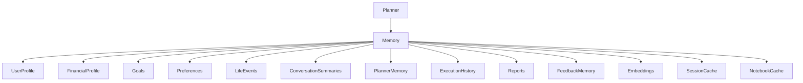
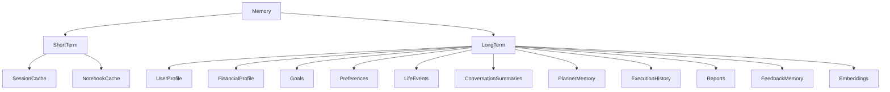
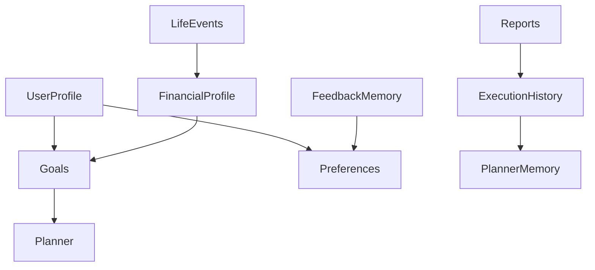
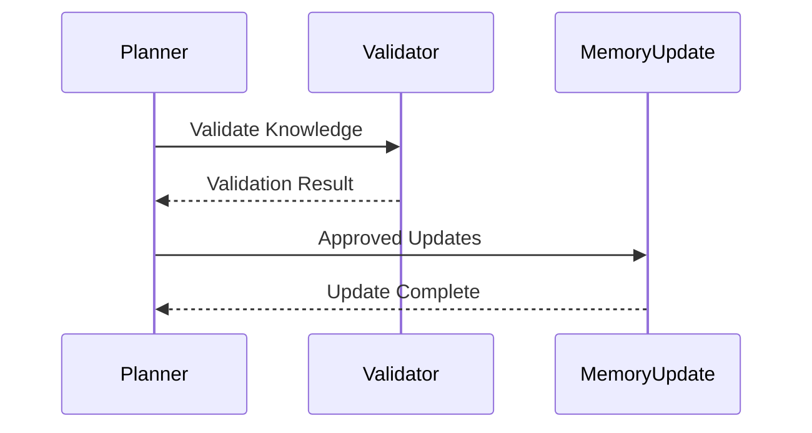
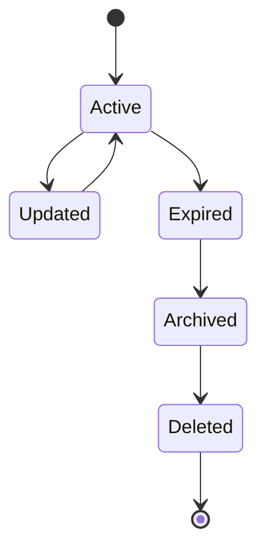
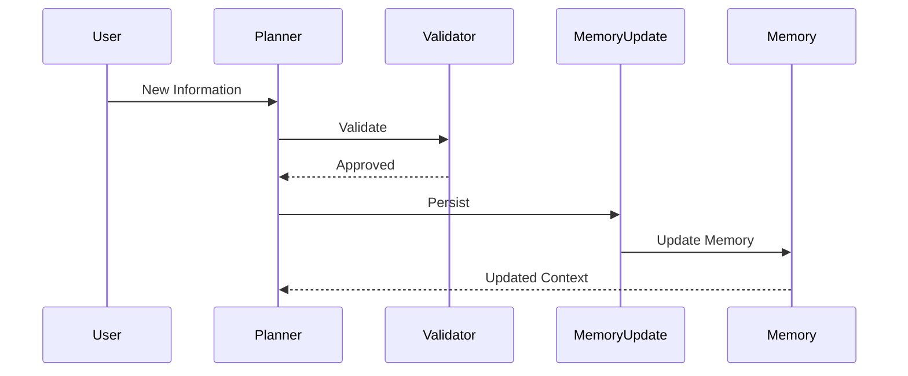
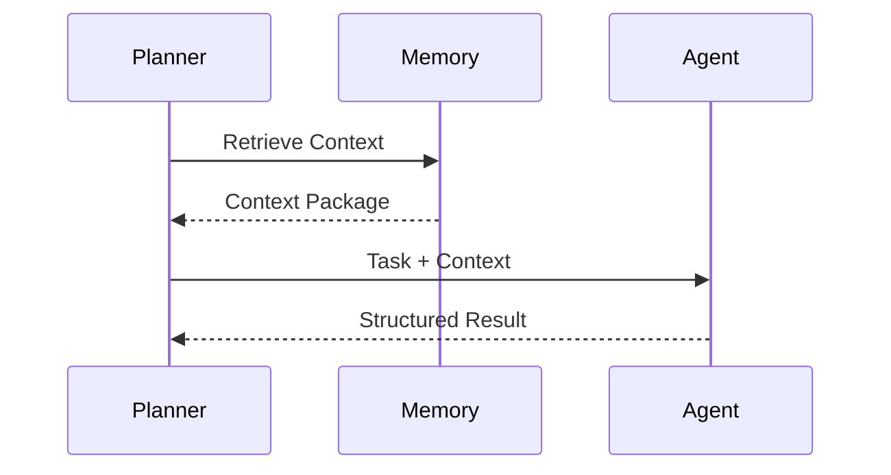
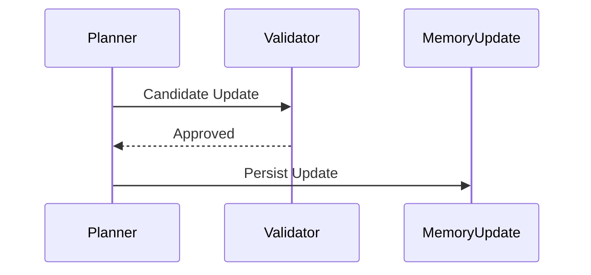

# Memory Architecture

> **Version:** 1.0.0  
> **Status:** Architecture Specification (Authoritative)  
> **Document Type:** Memory Architecture  
> **Primary Components:** `memory/*`  
> **Audience:** Contributors, AI Coding Assistants, Google ADK Evaluators, Kaggle Judges  
> **Last Updated:** July 2026

---

# Purpose

Memory is one of the foundational architectural components of WalletMind.

Unlike traditional conversational AI systems that primarily store conversation history, WalletMind treats memory as **structured financial knowledge** that improves future reasoning.

The Memory subsystem enables the Planner and specialized AI agents to reason consistently across multiple requests, sessions, and notebook demonstrations while maintaining explainability and clear ownership.

This document defines the complete architectural specification for the WalletMind Memory subsystem.

It describes:

- memory philosophy
- memory responsibilities
- memory types
- ownership
- lifecycle
- retrieval
- updates
- synchronization
- privacy boundaries
- future evolution

This specification intentionally avoids database implementation details.

Instead, it focuses on **how memory supports reasoning**.

---

# Relationship to the System Architecture

Memory is a core subsystem positioned between the Planner and the AI agents.

```
overview.md
      │
      ▼
planner.md
      │
      ▼
memory.md
      │
      ├── agents.md
      ├── tools.md
      ├── mcp.md
      └── runtime.md
```

The Planner decides **when memory should be accessed**.

This document defines **what memory contains and how it behaves**.

---

# Why WalletMind Uses Structured Memory

Financial planning is fundamentally cumulative.

Every recommendation depends upon knowledge accumulated over time.

Examples include:

- financial goals
- income history
- spending habits
- investment preferences
- life events
- accepted recommendations
- behavioural patterns

Treating each conversation independently would require the user to repeatedly provide the same information.

WalletMind instead preserves relevant financial knowledge to improve future reasoning.

---

# Conversation History vs Structured Memory

WalletMind intentionally separates conversation history from long-term knowledge.

Conversation history records **what was said**.

Memory records **what was learned**.

| Conversation History         | Structured Memory                  |
| ---------------------------- | ---------------------------------- |
| Temporary                    | Persistent                         |
| Raw dialogue                 | Organized knowledge                |
| Chronological                | Semantic                           |
| Difficult to search          | Easy to retrieve                   |
| Includes irrelevant content  | Stores only meaningful information |
| Poor for long-term reasoning | Optimized for planning             |

This distinction is fundamental to the WalletMind architecture.

---

# Memory Philosophy

WalletMind follows one central principle.

> **Remember knowledge, not conversations.**

The system should remember facts that improve future financial reasoning.

It should not remember every interaction.

Examples of valuable knowledge include:

- long-term financial goals
- user preferences
- recurring financial patterns
- accepted financial advice
- important life changes

Examples of information that should not become memory include:

- temporary calculations
- intermediate reasoning
- discarded recommendations
- failed execution attempts
- conversational filler

---

# Why Memory Exists

The Memory subsystem exists to answer one architectural question.

> **"What information should influence future financial reasoning?"**

Memory is therefore an architectural capability rather than a storage mechanism.

Its primary purpose is to provide relevant context for intelligent planning.

---

# High-Level Responsibilities

The Memory subsystem owns the following responsibilities.

| Responsibility                  | Description                                       |
| ------------------------------- | ------------------------------------------------- |
| Preserve important knowledge    | Maintain long-term financial context              |
| Provide contextual retrieval    | Supply relevant information to Planner and agents |
| Organize structured knowledge   | Maintain semantic organization                    |
| Support personalization         | Adapt reasoning to the individual user            |
| Improve consistency             | Avoid repeated information gathering              |
| Maintain explainability         | Clearly identify retrieved knowledge              |
| Support notebook demonstrations | Visualize contextual reasoning                    |

Memory intentionally does **not** perform reasoning.

Reasoning belongs to the Planner and specialized AI agents.

---

# High-Level Architecture

```mermaid
flowchart TD

User

-->

Planner

Planner

--> Memory

Planner

--> AI Agents

Memory

--> Planner

Memory

--> AI Agents

AI Agents

--> Planner

Planner

--> MemoryUpdateAgent

MemoryUpdateAgent

--> Memory
```

The Planner owns memory coordination.

The Memory subsystem provides structured knowledge.

---

# Architectural Position

Memory occupies the contextual reasoning layer.

```mermaid
flowchart TD

Presentation Layer

-->

Planner Layer

-->

Memory Layer

-->

Tool Layer

-->

MCP Layer
```

Memory is positioned beside the Planner rather than inside individual agents.

---

# Core Memory Principles

Every WalletMind memory component should satisfy the following principles.

## Structured

Memory stores structured knowledge rather than free-form conversations.

---

## Explainable

Every retrieved memory should be identifiable within the Planner's execution trace.

---

## Relevant

Only information that improves future reasoning should be remembered.

---

## Planner-Coordinated

The Planner decides when memory should be retrieved or updated.

---

## Agent-Accessible

Agents may retrieve contextual information but never own persistent memory.

---

## Modular

Memory remains independent from implementation technology.

---

## Privacy-Aware

Only necessary information should be retained.

---

# Memory Design Goals

WalletMind's memory architecture optimizes for the following goals.

| Goal              | Description                                   |
| ----------------- | --------------------------------------------- |
| Personalization   | Tailor recommendations to the individual user |
| Consistency       | Preserve important financial context          |
| Explainability    | Make retrieved knowledge observable           |
| Reusability       | Support multiple planning workflows           |
| Educational Value | Demonstrate contextual reasoning in notebooks |
| Extensibility     | Allow new memory types without redesign       |

---

# Memory Categories Overview

WalletMind defines multiple complementary memory types.

| Memory Category        | Purpose                        |
| ---------------------- | ------------------------------ |
| Short-Term Memory      | Active execution context       |
| Long-Term Memory       | Persistent financial knowledge |
| User Profile           | User characteristics           |
| Financial Profile      | Financial situation            |
| Goals                  | Financial objectives           |
| Preferences            | User preferences               |
| Life Events            | Significant personal changes   |
| Conversation Summaries | Condensed interaction history  |
| Planner Memory         | Planning context               |
| Execution History      | Previous Planner executions    |
| Reports                | Generated financial reports    |
| Feedback Memory        | User feedback                  |
| Embeddings             | Semantic retrieval             |
| Session Cache          | Active session optimization    |
| Notebook Cache         | Demonstration optimization     |

Each category has distinct ownership and lifecycle rules.

---

# Memory Context Diagram



Each memory type contributes different contextual knowledge.

---

# Memory as Context

Memory should be viewed as contextual knowledge rather than permanent storage.

Conceptually:

```
Past Experiences

↓

Structured Knowledge

↓

Relevant Context

↓

Planner

↓

Reasoning

↓

Better Recommendations
```

Memory influences reasoning without performing reasoning itself.

---

# Memory and Explainability

Every Planner execution should clearly identify:

- which memories were retrieved
- why they were relevant
- how they influenced reasoning
- whether new memory was created

This transparency is essential for user trust and notebook storytelling.

---

# Memory Ownership

Memory follows strict ownership boundaries.

| Component           | Responsibility                    |
| ------------------- | --------------------------------- |
| Planner             | Coordinates retrieval and updates |
| AI Agents           | Consume contextual memory         |
| Memory Update Agent | Persists validated knowledge      |
| Memory Subsystem    | Stores structured knowledge       |

No component other than the Memory Update Agent should modify persistent memory.

---

# Notebook Perspective

One of WalletMind's educational goals is to visualize contextual reasoning.

Notebook demonstrations should expose:

1. Retrieved memories
2. Relevant user goals
3. Financial profile
4. Planner decisions
5. Updated knowledge
6. Memory influence on recommendations

Memory should therefore be observable rather than hidden.

---

# Design Principles

Every future enhancement should preserve these architectural principles.

| Principle          | Description                    |
| ------------------ | ------------------------------ |
| Remember Knowledge | Not conversations              |
| Planner Controlled | Planner coordinates memory     |
| Structured         | Organized semantic information |
| Explainable        | Every retrieval is observable  |
| Independent        | Separate from reasoning        |
| Privacy Aware      | Minimize retained information  |
| Extensible         | Support future memory types    |

---

# Part I Summary

This section establishes the philosophical and architectural foundation of WalletMind's Memory subsystem.

Rather than functioning as a conversation archive, Memory serves as a structured knowledge layer that preserves only the information required to improve future financial reasoning.

By separating knowledge from dialogue and assigning clear ownership to the Planner and Memory Update Agent, WalletMind achieves personalized, explainable, and reusable contextual reasoning while remaining modular and implementation-independent.

The following section defines every memory category in detail, including its purpose, ownership, lifecycle, retrieval strategy, update policy, and role within the overall architecture.

---

# Part II — Memory Model

WalletMind treats memory as a collection of specialized knowledge domains rather than a single repository.

Each memory category has a clearly defined purpose, ownership, lifecycle, and retrieval strategy.

This specialization improves:

- reasoning quality
- explainability
- modularity
- retrieval accuracy
- future extensibility

Rather than asking:

> "What should be stored?"

WalletMind asks:

> "What type of knowledge is this, and how should it influence future reasoning?"

---

# Memory Hierarchy

The Memory subsystem is organized into multiple logical layers.



Each memory type has distinct responsibilities.

---

# Memory Classification

WalletMind divides memory into two broad categories.

| Category          | Purpose                        |
| ----------------- | ------------------------------ |
| Short-Term Memory | Active execution context       |
| Long-Term Memory  | Persistent financial knowledge |

Short-term memory supports execution.

Long-term memory supports reasoning across sessions.

---

# Short-Term Memory

Short-Term Memory contains temporary information required only for the current Planner execution.

It exists exclusively during runtime.

Examples include:

- execution context
- intermediate reasoning
- active task graph
- temporary calculations
- planner state
- agent outputs before validation

This memory is discarded when execution completes.

---

## Characteristics

| Property               | Value             |
| ---------------------- | ----------------- |
| Lifetime               | Current execution |
| Owner                  | Planner           |
| Persistent             | No                |
| Retrieved Later        | No                |
| Shared Across Sessions | No                |

---

# Session Cache

Session Cache stores temporary contextual information shared during one user session.

Typical contents include:

- active conversation context
- recently retrieved memories
- temporary planner variables
- active execution metadata

Its purpose is efficiency rather than personalization.

---

## Session Cache Lifecycle

```
Session Begins

↓

Cache Created

↓

Planner Uses Cache

↓

Session Ends

↓

Cache Destroyed
```

---

# Notebook Cache

Notebook Cache exists only for demonstrations.

It stores temporary information that enables notebook visualizations.

Examples include:

- execution traces
- visualization data
- intermediate graphs
- educational artifacts

Notebook Cache never influences financial reasoning.

---

# Long-Term Memory

Long-Term Memory stores validated financial knowledge that should influence future reasoning.

Unlike Session Cache, Long-Term Memory persists across multiple conversations.

It contains only structured information.

---

## Characteristics

| Property     | Value               |
| ------------ | ------------------- |
| Lifetime     | Long-term           |
| Owner        | Memory Subsystem    |
| Updated By   | Memory Update Agent |
| Retrieved By | Planner & Agents    |
| Persistent   | Yes                 |

---

# User Profile Memory

User Profile Memory describes **who the user is**.

It represents relatively stable characteristics.

Typical information includes:

- occupation
- household information
- financial literacy
- risk tolerance
- preferred communication style
- planning horizon

This memory enables personalization.

---

## Ownership

| Property     | Value                       |
| ------------ | --------------------------- |
| Updated By   | Memory Update Agent         |
| Retrieved By | Planner, User Profile Agent |
| Frequency    | Moderate                    |

---

# Financial Profile Memory

Financial Profile Memory describes **the user's financial situation**.

Examples include:

- income
- recurring expenses
- assets
- liabilities
- savings
- investments
- debt profile

Unlike the User Profile, this memory changes more frequently.

---

## Purpose

Financial Profile Memory supports:

- budgeting
- forecasting
- risk analysis
- goal planning
- scenario simulation

---

# Goals Memory

Goals Memory stores the user's long-term financial objectives.

Examples include:

- retirement
- home purchase
- education savings
- emergency fund
- debt reduction

Goals influence almost every planning workflow.

---

## Typical Metadata

Each goal should include:

- priority
- target amount
- target date
- progress
- current status

Goals remain independent from execution history.

---

# Preferences Memory

Preferences describe how the user prefers WalletMind to reason and communicate.

Examples include:

- investment style
- budgeting philosophy
- preferred report format
- explanation depth
- notification preferences

Preferences personalize recommendations without changing financial facts.

---

# Life Events Memory

Life Events represent significant changes in the user's circumstances.

Examples include:

- marriage
- new child
- home purchase
- career change
- retirement
- relocation

Life events frequently change financial planning assumptions.

---

## Characteristics

Life Events are:

- infrequent
- highly significant
- long-lasting
- context-rich

---

# Conversation Summaries

WalletMind intentionally avoids storing complete conversations.

Instead it stores concise summaries when conversations produce meaningful knowledge.

Example:

```
Conversation

↓

Important Insights

↓

Summary

↓

Memory
```

Summaries improve retrieval while reducing irrelevant context.

---

# Planner Memory

Planner Memory stores planning-specific knowledge.

Examples include:

- planning assumptions
- accepted execution strategies
- recurring planning preferences
- reasoning metadata

Planner Memory supports future orchestration.

---

# Execution History

Execution History records completed Planner executions.

Typical information includes:

- execution timestamp
- participating agents
- confidence
- validation status
- execution outcome

Execution History supports explainability rather than personalization.

---

# Reports Memory

Reports Memory stores generated financial reports.

Examples include:

- quarterly summaries
- annual reviews
- financial plans
- recommendation history

Reports provide historical reference for future planning.

---

# Feedback Memory

Feedback Memory records how users respond to recommendations.

Examples include:

- accepted recommendations
- rejected advice
- corrected assumptions
- user preferences
- satisfaction indicators

Feedback improves future personalization.

---

# Embeddings

Embeddings provide semantic retrieval rather than user-visible memory.

They enable:

- contextual search
- semantic similarity
- relevant retrieval
- memory ranking

Embeddings are an architectural retrieval mechanism rather than user knowledge.

---

# Memory Relationships



These relationships improve contextual reasoning.

---

# Retrieval Characteristics

Different memory types are retrieved differently.

| Memory Type            | Retrieval Frequency |
| ---------------------- | ------------------- |
| User Profile           | High                |
| Financial Profile      | High                |
| Goals                  | High                |
| Preferences            | Medium              |
| Life Events            | Medium              |
| Conversation Summaries | Medium              |
| Planner Memory         | Medium              |
| Execution History      | Low                 |
| Reports                | Low                 |
| Feedback               | Medium              |
| Session Cache          | Very High           |
| Notebook Cache         | Notebook Only       |

The Planner determines retrieval based on execution requirements.

---

# Update Characteristics

Memory categories also differ in how often they change.

| Memory Type       | Update Frequency |
| ----------------- | ---------------- |
| User Profile      | Low              |
| Financial Profile | High             |
| Goals             | Medium           |
| Preferences       | Low              |
| Life Events       | Very Low         |
| Planner Memory    | Medium           |
| Execution History | Every Execution  |
| Reports           | Every Report     |
| Feedback          | As Received      |
| Session Cache     | Continuous       |
| Notebook Cache    | Continuous       |

Update frequency influences synchronization policies.

---

# Ownership Matrix

| Memory Type       | Primary Owner          |
| ----------------- | ---------------------- |
| Short-Term Memory | Planner                |
| Session Cache     | Planner                |
| Notebook Cache    | Notebook Runtime       |
| User Profile      | Memory Update Agent    |
| Financial Profile | Memory Update Agent    |
| Goals             | Memory Update Agent    |
| Preferences       | Memory Update Agent    |
| Life Events       | Memory Update Agent    |
| Planner Memory    | Planner                |
| Execution History | Planner                |
| Reports           | Report Generator Agent |
| Feedback Memory   | Memory Update Agent    |
| Embeddings        | Memory Subsystem       |

Ownership determines update authority.

---

# Design Principles

Each memory category should satisfy the following principles.

| Principle        | Description                            |
| ---------------- | -------------------------------------- |
| Specialized      | One responsibility per memory type     |
| Structured       | Organized semantic knowledge           |
| Explainable      | Retrieval remains observable           |
| Planner-Aware    | Planner coordinates usage              |
| Agent-Accessible | Agents consume context safely          |
| Independent      | Memory categories evolve independently |

---

# Part II Summary

The WalletMind Memory Model separates contextual knowledge into specialized memory categories, each with its own purpose, ownership, retrieval strategy, and lifecycle.

By distinguishing between temporary execution context and persistent financial knowledge, WalletMind enables personalized, explainable reasoning while maintaining clear architectural boundaries between planning, memory management, and financial analysis.

The following section defines the complete **Memory Lifecycle**, including creation, retrieval, updates, synchronization, pruning, expiration, and deletion, illustrating how knowledge evolves throughout the lifetime of the system.

---

# Part III — Memory Lifecycle

Memory is not static.

Financial knowledge continuously evolves as users interact with WalletMind, update their goals, change financial habits, and receive recommendations.

The Memory subsystem therefore manages the complete lifecycle of knowledge rather than simply storing information.

Every memory object progresses through a well-defined lifecycle from creation to eventual removal.

---

# Memory Lifecycle Philosophy

WalletMind follows one guiding principle.

> **Knowledge should evolve as the user's financial life evolves.**

Memory should never become a permanent archive.

Instead, it should remain:

- relevant
- trustworthy
- explainable
- validated
- useful for future reasoning

---

# High-Level Lifecycle

Every persistent memory follows the same conceptual lifecycle.

```mermaid
flowchart LR

New Knowledge

-->

Validation

-->

Memory Creation

-->

Retrieval

-->

Usage

-->

Update

-->

Synchronization

-->

Pruning

-->

Expiration

-->

Deletion
```

Each stage has one architectural responsibility.

---

# Lifecycle Overview

| Stage              | Purpose                        |
| ------------------ | ------------------------------ |
| Knowledge Creation | Candidate knowledge identified |
| Validation         | Verify correctness             |
| Memory Creation    | Store structured knowledge     |
| Retrieval          | Provide contextual information |
| Usage              | Influence Planner reasoning    |
| Update             | Modify existing knowledge      |
| Synchronization    | Maintain consistency           |
| Pruning            | Remove obsolete knowledge      |
| Expiration         | Mark inactive knowledge        |
| Deletion           | Remove permanently             |

---

# Stage 1 — Knowledge Creation

Memory begins as candidate knowledge.

Sources include:

- user input
- planner conclusions
- accepted recommendations
- confirmed profile updates
- validated life events
- user feedback

Not all candidate knowledge becomes memory.

---

# Knowledge Sources

```mermaid
flowchart TD

User

-->

Candidate Knowledge

Planner

-->

Candidate Knowledge

Agents

-->

Candidate Knowledge

Feedback

-->

Candidate Knowledge

Candidate Knowledge

-->

Validation
```

Candidate knowledge must always be validated before persistence.

---

# Stage 2 — Validation

Validation protects memory integrity.

The Validator Agent and Planner determine whether knowledge is sufficiently trustworthy.

Validation considers:

- consistency
- confidence
- evidence
- completeness
- user confirmation

Only validated knowledge proceeds to memory creation.

---

# Validation Sequence



---

# Stage 3 — Memory Creation

After validation, structured knowledge becomes persistent memory.

Examples include:

- new financial goal
- updated salary
- changed risk tolerance
- new life event
- accepted financial preference

Memory creation always uses structured schemas.

---

# Memory Creation Principles

Every new memory should be:

- structured
- versionable
- explainable
- attributable
- timestamped

---

# Stage 4 — Retrieval

Memory exists to improve future reasoning.

The Planner retrieves only the knowledge relevant to the current request.

Retrieval should be:

- contextual
- selective
- explainable
- deterministic

Memory retrieval never loads every stored object.

---

# Retrieval Flow

```mermaid
flowchart TD

Planner Request

-->

Context Analysis

-->

Memory Retrieval

-->

Relevant Memories

-->

Planner
```

---

# Stage 5 — Memory Usage

Retrieved memory becomes contextual input.

Examples include:

```
User Profile

↓

Planner

↓

Budget Agent
```

or

```
Goals

↓

Planner

↓

Goal Planning Agent
```

Memory itself never performs reasoning.

---

# Stage 6 — Memory Updates

Existing memory evolves over time.

Typical updates include:

- salary changes
- new goals
- changed preferences
- completed milestones
- corrected financial profile

Updates replace outdated knowledge rather than duplicating it.

---

# Update Workflow

```mermaid
flowchart TD

Existing Memory

-->

New Knowledge

-->

Validation

-->

Merge

-->

Updated Memory
```

---

# Update Principles

Updates should:

- preserve consistency
- maintain history
- avoid duplication
- retain explainability

---

# Stage 7 — Synchronization

Multiple memory categories often depend upon each other.

Example:

```
Life Event

↓

Financial Profile

↓

Goals

↓

Planner
```

When one category changes, dependent memory may require synchronization.

---

# Synchronization Example

Marriage recorded.

↓

Household information updated.

↓

Financial goals updated.

↓

Budget assumptions updated.

↓

Planner reasoning improves.

Synchronization maintains consistency across memory categories.

---

# Memory Synchronization Diagram

```mermaid
flowchart TD

Life Events

-->

Financial Profile

Financial Profile

-->

Goals

Goals

-->

Planner Memory

Planner Memory

-->

Execution History
```

---

# Stage 8 — Pruning

Not every memory remains useful forever.

Pruning removes obsolete or low-value knowledge while preserving important information.

Examples:

Prune:

- outdated planner metadata
- obsolete execution traces
- expired notebook artifacts

Retain:

- financial goals
- user preferences
- accepted recommendations

---

# Pruning Principles

Memory pruning should:

- preserve valuable knowledge
- remove redundancy
- improve retrieval quality
- reduce irrelevant context

---

# Stage 9 — Expiration

Some memories naturally become inactive.

Examples:

- completed goals
- obsolete preferences
- temporary planner assumptions

Expiration marks memories as inactive without immediate deletion.

---

# Expiration State



Expiration preserves historical value while reducing retrieval priority.

---

# Stage 10 — Deletion

Deletion permanently removes memory.

Deletion should occur only when:

- information becomes invalid
- user requests removal
- knowledge is obsolete
- architectural policies require deletion

Deletion should be deliberate rather than automatic.

---

# Complete Lifecycle Example

User says:

> "I received a promotion."

Execution:

```
Planner

↓

Candidate Knowledge

↓

Validation

↓

Financial Profile Updated

↓

Memory Stored

↓

Future Planning Uses Updated Salary

↓

Old Salary Archived
```

---

# Memory Lifecycle Sequence



---

# Lifecycle Ownership

| Stage              | Owner               |
| ------------------ | ------------------- |
| Knowledge Creation | Planner             |
| Validation         | Validator Agent     |
| Memory Creation    | Memory Update Agent |
| Retrieval          | Planner             |
| Usage              | Planner & Agents    |
| Update             | Memory Update Agent |
| Synchronization    | Memory Subsystem    |
| Pruning            | Memory Subsystem    |
| Expiration         | Memory Subsystem    |
| Deletion           | Memory Subsystem    |

Ownership remains clearly separated.

---

# Lifecycle Guarantees

The Memory subsystem should guarantee:

- only validated knowledge is stored
- obsolete knowledge is eventually removed
- retrieval remains explainable
- updates preserve consistency
- synchronization maintains integrity
- deletion follows architectural policy

---

# Design Principles

Every lifecycle stage should satisfy the following principles.

| Principle                  | Description                           |
| -------------------------- | ------------------------------------- |
| Validation First           | Knowledge must be verified            |
| Structured Updates         | Memory evolves predictably            |
| Explainable Retrieval      | Context remains transparent           |
| Controlled Persistence     | Only meaningful knowledge is retained |
| Graceful Aging             | Knowledge may expire before deletion  |
| Consistent Synchronization | Related memories remain aligned       |

---

# Part III Summary

The Memory Lifecycle defines how knowledge evolves within WalletMind.

Rather than treating memory as static storage, the architecture manages the continuous creation, validation, retrieval, update, synchronization, pruning, expiration, and deletion of structured financial knowledge.

This lifecycle ensures that memory remains relevant, trustworthy, and explainable while providing the Planner and specialized agents with high-quality contextual information for future reasoning.

The following section defines the **Memory Retrieval Architecture**, including retrieval strategies, Planner coordination, semantic retrieval, ranking, contextual selection, and retrieval contracts.

---

# Part IV — Memory Retrieval Architecture

The primary purpose of the Memory subsystem is not storage.

Its primary purpose is **context retrieval**.

Knowledge only becomes valuable when the Planner can retrieve the right information at the right moment to improve reasoning.

WalletMind therefore treats retrieval as an architectural reasoning capability rather than a database operation.

---

# Retrieval Philosophy

WalletMind follows one guiding principle.

> **Retrieve only the knowledge that improves the current reasoning task.**

Retrieving excessive context:

- increases reasoning complexity
- reduces explainability
- introduces irrelevant information
- decreases execution efficiency

Retrieval should therefore be selective rather than exhaustive.

---

# Retrieval Objectives

Memory retrieval should achieve the following objectives.

| Objective         | Description                                      |
| ----------------- | ------------------------------------------------ |
| Relevance         | Retrieve only useful knowledge                   |
| Explainability    | Every retrieved memory should be observable      |
| Context Awareness | Retrieval depends on Planner goals               |
| Efficiency        | Avoid unnecessary retrieval                      |
| Determinism       | Same context should produce consistent retrieval |
| Modularity        | Independent from storage implementation          |

---

# High-Level Retrieval Architecture

```mermaid
flowchart TD

User Request

-->

Planner

Planner

-->

Context Analysis

Context Analysis

-->

Memory Retrieval

Memory Retrieval

-->

Relevant Memory

Relevant Memory

-->

Planner

Planner

-->

Agents
```

The Planner determines **what** should be retrieved.

The Memory subsystem determines **how** that knowledge is organized.

---

# Planner-Centric Retrieval

The Planner owns retrieval decisions.

The Memory subsystem never decides what reasoning requires.

Instead:

```
Planner

↓

Determine Context

↓

Request Memory

↓

Receive Relevant Knowledge

↓

Continue Planning
```

This preserves separation between reasoning and memory management.

---

# Retrieval Workflow

Every retrieval follows the same conceptual lifecycle.

```mermaid
flowchart LR

Planner Request

-->

Context Identification

-->

Memory Selection

-->

Retrieval

-->

Context Package

-->

Planner
```

---

# Retrieval Stages

| Stage                  | Responsibility                        |
| ---------------------- | ------------------------------------- |
| Context Identification | Planner identifies required knowledge |
| Memory Selection       | Select relevant memory categories     |
| Retrieval              | Load structured knowledge             |
| Context Package        | Organize retrieved information        |
| Planner Integration    | Use retrieved context during planning |

---

# Context Identification

Before retrieving memory, the Planner determines:

- user intent
- financial goals
- required capabilities
- participating agents
- execution scope

Example:

```
User

↓

"I want to retire earlier."

↓

Planner

↓

Required Context

• Goals

• Financial Profile

• Cash Flow

• Risk Tolerance

• Previous Retirement Plans
```

Retrieval begins only after planning context is understood.

---

# Memory Selection

Different requests require different memory.

Example:

Buying a house:

Retrieve:

- Financial Profile
- Goals
- Cash Flow
- Budget
- Risk Tolerance

Do not retrieve:

- Notebook Cache
- Old Reports
- Planner Metadata

Retrieval should remain purpose-driven.

---

# Retrieval Categories

WalletMind retrieves memory from specialized categories.

| Memory Type            | Typical Usage         |
| ---------------------- | --------------------- |
| User Profile           | Personalization       |
| Financial Profile      | Financial reasoning   |
| Goals                  | Planning              |
| Preferences            | Recommendation style  |
| Life Events            | Context adaptation    |
| Conversation Summaries | Historical context    |
| Planner Memory         | Planning optimization |
| Execution History      | Explainability        |
| Reports                | Historical reference  |
| Feedback Memory        | Personalization       |
| Session Cache          | Runtime optimization  |

Each category contributes different contextual knowledge.

---

# Retrieval Decision Matrix

| Request             | Retrieved Memory                         |
| ------------------- | ---------------------------------------- |
| Budget Review       | Financial Profile, Expenses, Preferences |
| Retirement Planning | Goals, Financial Profile, Risk Tolerance |
| Spending Analysis   | Expenses, Preferences, Historical Trends |
| Investment Question | Financial Profile, Risk Profile, Goals   |
| Scenario Simulation | Forecasts, Goals, Risk Assessment        |

The Planner determines retrieval requirements dynamically.

---

# Context Package

Retrieved memories are organized into a structured context package before reasoning begins.

Conceptually:

```json
{
  "user_profile": {},
  "financial_profile": {},
  "goals": [],
  "preferences": {},
  "life_events": [],
  "planner_context": {}
}
```

The Planner passes this package to relevant agents.

---

# Agent Retrieval

Agents never retrieve arbitrary memory.

They receive only the contextual information required for their capability.

Example:

```
Budget Advisor

↓

Income

Expenses

Goals

Preferences

↓

Recommendations
```

The Budget Advisor does not need execution history or notebook cache.

---

# Planner Retrieval Flow



Memory retrieval always passes through the Planner.

---

# Selective Retrieval

WalletMind intentionally avoids loading every available memory object.

Instead:

```
Total Memory

↓

Planner Filters

↓

Relevant Knowledge

↓

Reasoning
```

Selective retrieval improves:

- efficiency
- explainability
- reasoning quality

---

# Semantic Retrieval

Some memories cannot be retrieved through exact matching.

Examples include:

- similar financial goals
- recurring spending behaviour
- related life events
- previous planning strategies

Semantic retrieval enables context-aware reasoning.

The retrieval mechanism remains implementation-independent.

---

# Structured Retrieval

Other memories require exact retrieval.

Examples include:

- current income
- current savings
- active financial goals
- preferred currency

Structured retrieval provides deterministic context.

---

# Hybrid Retrieval

Most Planner executions use both retrieval strategies.

```mermaid
flowchart TD

Planner

-->

Structured Retrieval

Planner

-->

Semantic Retrieval

Structured Retrieval

-->

Context Package

Semantic Retrieval

-->

Context Package

Context Package

-->

Planner
```

This hybrid approach balances precision with flexibility.

---

# Retrieval Ranking

When multiple memories are relevant, the Memory subsystem prioritizes them conceptually using factors such as:

- relevance to current goal
- recency
- validation status
- confidence
- relationship to current context

Ranking improves retrieval quality without exposing implementation details.

---

# Retrieval Examples

## Example 1 — Retirement Planning

User request:

> "Can I retire at 55?"

Retrieved memory:

- User Profile
- Financial Profile
- Retirement Goal
- Investment Preferences
- Risk Tolerance
- Previous Retirement Plan

Ignored:

- Notebook Cache
- Execution Metadata
- Temporary Planner State

---

## Example 2 — Budget Optimization

Retrieved memory:

- Income
- Spending History
- Budget Preferences
- Recurring Expenses
- Savings Goal

Ignored:

- Old Reports
- Planner Metadata
- Completed Simulations

---

## Example 3 — Scenario Simulation

Retrieved memory:

- Financial Profile
- Forecast
- Goals
- Risk Assessment
- User Preferences

Ignored:

- Conversation Summary
- Notebook Cache

---

# Retrieval Ownership

| Responsibility          | Owner               |
| ----------------------- | ------------------- |
| Decide Required Context | Planner             |
| Organize Memory         | Memory Subsystem    |
| Retrieve Knowledge      | Memory Subsystem    |
| Consume Context         | Planner & Agents    |
| Persist Changes         | Memory Update Agent |

Ownership remains intentionally separated.

---

# Retrieval Guarantees

The Memory subsystem should guarantee:

- relevant context only
- explainable retrieval
- structured outputs
- deterministic behavior
- modular retrieval
- Planner-controlled access

---

# Retrieval Design Principles

Every retrieval operation should satisfy these principles.

| Principle      | Description                          |
| -------------- | ------------------------------------ |
| Planner Driven | Planner owns retrieval decisions     |
| Context Aware  | Retrieval depends on reasoning task  |
| Selective      | Avoid unnecessary information        |
| Explainable    | Every retrieved memory is visible    |
| Structured     | Machine-readable context packages    |
| Extensible     | New memory types integrate naturally |

---

# Part IV Summary

Memory retrieval is the mechanism through which WalletMind transforms stored financial knowledge into contextual reasoning.

Rather than exposing raw memory to every component, the Planner identifies the knowledge required for each request, retrieves only the relevant memory categories, assembles a structured context package, and distributes that context to specialized agents.

This Planner-driven retrieval architecture keeps reasoning focused, improves explainability, and ensures that memory remains a contextual resource rather than an unstructured knowledge store.

The following section defines **Memory Updates and Synchronization**, including how validated knowledge becomes persistent memory, conflict resolution, duplicate detection, synchronization across memory categories, and architectural ownership of memory modifications.

---

# Part V — Memory Updates & Synchronization

Memory is valuable only if it remains accurate.

As a user's financial situation evolves, WalletMind must continuously determine:

- what new knowledge should become memory
- what existing memory should be updated
- what knowledge should remain unchanged
- how related memory should stay consistent

For this reason, WalletMind treats memory updates as a controlled architectural process rather than simple data storage.

---

# Update Philosophy

WalletMind follows one guiding principle.

> **Only validated knowledge becomes persistent memory.**

Every memory update must improve future reasoning.

Temporary information should never become permanent knowledge.

---

# Update Architecture

Memory updates are coordinated by the Planner.

Persistent changes are performed exclusively by the Memory Update Agent.

```mermaid
flowchart TD

Planner

-->

Validator

Validator

-->

Memory Update Agent

Memory Update Agent

-->

Memory

Memory

-->

Planner
```

This architecture guarantees that memory remains trustworthy.

---

# Why Agents Cannot Update Memory

Specialized agents perform reasoning.

They do **not** own persistent knowledge.

Allowing agents to update memory independently would introduce:

- inconsistent knowledge
- duplicate information
- conflicting updates
- hidden side effects
- reduced explainability

Instead, every update passes through a centralized validation workflow.

---

# Memory Update Workflow

```mermaid
flowchart LR

Candidate Knowledge

-->

Validation

-->

Memory Update

-->

Synchronization

-->

Persistent Memory
```

Each stage has one responsibility.

---

# Memory Update Lifecycle

| Stage                    | Responsibility      |
| ------------------------ | ------------------- |
| Candidate Identification | Planner             |
| Validation               | Validator Agent     |
| Update Preparation       | Memory Update Agent |
| Synchronization          | Memory Subsystem    |
| Completion               | Planner             |

---

# Candidate Knowledge

Candidate knowledge may originate from:

- user corrections
- planner conclusions
- accepted recommendations
- confirmed life events
- profile changes
- feedback
- goal completion

Candidate knowledge is not memory.

It becomes memory only after validation.

---

# Example Candidate

User says:

> "I changed jobs and now earn ₹150,000 per month."

Planner identifies:

```
Candidate Knowledge

↓

Income Changed

↓

Financial Profile Update
```

The update proceeds only after validation.

---

# Validation Before Update

The Validator determines whether candidate knowledge should become persistent.

Validation considers:

- evidence
- consistency
- confidence
- conflicts
- completeness

Example:



---

# Memory Update Responsibilities

The Memory Update Agent is responsible for:

- creating new memory
- updating existing memory
- preventing duplication
- resolving conflicts
- preserving consistency
- generating update summaries

It performs no financial reasoning.

---

# Memory Update Categories

Different memory types require different update behavior.

| Memory Type       | Typical Update              |
| ----------------- | --------------------------- |
| User Profile      | Replace outdated attributes |
| Financial Profile | Update current values       |
| Goals             | Create, modify, complete    |
| Preferences       | Replace latest preference   |
| Life Events       | Append verified event       |
| Reports           | Add new report              |
| Execution History | Append execution            |
| Feedback          | Record user response        |

---

# Update Strategies

WalletMind supports multiple conceptual update strategies.

## Replace

Example:

```
Income

Old

₹120,000

↓

New

₹150,000
```

Only one current income should exist.

---

## Merge

Example:

```
Preferences

Existing

Conservative Investing

+

New

Monthly Reports

↓

Merged Preferences
```

---

## Append

Example:

```
Life Events

↓

Marriage

↓

Child

↓

Home Purchase
```

Historical events remain valuable.

---

## Complete

Example:

```
Goal

Emergency Fund

↓

Completed
```

Completed goals remain part of financial history.

---

# Synchronization Philosophy

Memory categories should remain internally consistent.

Changes to one category may require updates elsewhere.

Example:

```
New Salary

↓

Financial Profile

↓

Budget Assumptions

↓

Cash Flow Forecast

↓

Planner Context
```

Synchronization maintains architectural integrity.

---

# Synchronization Flow

```mermaid
flowchart TD

Memory Update

-->

Affected Categories

Affected Categories

-->

Synchronization

Synchronization

-->

Consistent Memory
```

---

# Synchronization Examples

## Example 1

Life Event:

```
Marriage

↓

Household Size

↓

Financial Goals

↓

Budget Assumptions
```

---

## Example 2

Income Increase

```
Financial Profile

↓

Cash Flow

↓

Savings Potential

↓

Planner Context
```

---

## Example 3

Goal Completion

```
Goal Status

↓

Reports

↓

Execution History

↓

Planner Memory
```

---

# Conflict Resolution

Occasionally new knowledge conflicts with existing memory.

Example:

```
Existing Salary

₹120,000

↓

New Salary

₹150,000
```

The Memory Update Agent prepares the update.

The Planner determines whether user clarification is required.

---

# Conflict Categories

| Conflict                  | Typical Resolution    |
| ------------------------- | --------------------- |
| Duplicate Information     | Merge                 |
| Updated Information       | Replace               |
| Contradictory Information | Planner clarification |
| Temporary Information     | Discard               |
| Invalid Information       | Reject                |

---

# Duplicate Detection

Memory should avoid storing equivalent knowledge multiple times.

Examples:

Duplicate goals

↓

Merge

Duplicate preferences

↓

Replace

Duplicate reports

↓

Ignore or version

Duplicate detection improves retrieval quality.

---

# Memory Consistency

Consistency means related memory never contradicts itself.

Example:

Incorrect:

```
Income

₹150,000

Retirement Plan

Based on ₹80,000
```

Correct:

```
Income

↓

Planner

↓

Updated Forecast

↓

Updated Retirement Plan
```

---

# Update Sequence

```mermaid
sequenceDiagram

participant Planner
participant Validator
participant MemoryUpdate
participant Memory

Planner->>Validator: Validate Update

Validator-->>Planner: Approved

Planner->>MemoryUpdate: Apply Update

MemoryUpdate->>Memory: Synchronize

Memory-->>Planner: Updated Context
```

---

# Memory Synchronization Matrix

| Changed Memory    | Synchronize With  |
| ----------------- | ----------------- |
| User Profile      | Preferences       |
| Financial Profile | Goals, Forecast   |
| Goals             | Reports           |
| Preferences       | Coach             |
| Life Events       | Financial Profile |
| Reports           | Execution History |
| Feedback          | Preferences       |

---

# Update Ownership

| Activity               | Owner               |
| ---------------------- | ------------------- |
| Detect Candidate       | Planner             |
| Validate               | Validator Agent     |
| Prepare Update         | Memory Update Agent |
| Synchronize            | Memory Subsystem    |
| Consume Updated Memory | Planner & Agents    |

No other component modifies persistent memory.

---

# Update JSON Contract

Conceptual update request:

```json
{
  "memory_type": "financial_profile",
  "operation": "replace",
  "candidate": {},
  "validation_status": "approved",
  "metadata": {}
}
```

---

# Synchronization Contract

```json
{
  "updated_memory": "financial_profile",
  "affected_memories": ["goals", "planner_memory"],
  "synchronization_required": true
}
```

---

# Example Update

User request:

> "I have paid off my car loan."

Execution:

```
Planner

↓

Validator

↓

Memory Update Agent

↓

Debt Removed

↓

Financial Profile Updated

↓

Cash Flow Context Updated

↓

Future Planning Improved
```

---

# Memory Update Guarantees

The Memory subsystem should guarantee:

- validated knowledge only
- no duplicate memory
- consistent updates
- explainable synchronization
- deterministic ownership
- Planner-controlled persistence

---

# Design Principles

Every memory update should satisfy these principles.

| Principle           | Description                               |
| ------------------- | ----------------------------------------- |
| Validation First    | Never persist unverified knowledge        |
| Centralized Updates | Only Memory Update Agent writes memory    |
| Synchronization     | Related memory remains consistent         |
| Conflict Awareness  | Contradictions are resolved explicitly    |
| Explainability      | Every update is observable                |
| Extensibility       | New memory categories integrate naturally |

---

# Part V Summary

Memory updates transform validated knowledge into persistent financial context.

Rather than allowing every agent to modify memory independently, WalletMind centralizes all persistence through the Planner and the Memory Update Agent, ensuring consistent ownership, validation, synchronization, and explainability.

This controlled update architecture protects the integrity of long-term financial knowledge while allowing the system to continuously adapt as the user's financial situation evolves.

The following section defines **Memory Governance**, including what should be remembered, what should never be remembered, memory ownership rules, privacy considerations, pruning strategies, expiration policies, and architectural boundaries.

---

# Part VI — Memory Governance & Architectural Policies

Memory is one of the most valuable architectural resources within WalletMind.

Incorrect memory is often more harmful than no memory.

For this reason, WalletMind applies strict governance rules that determine:

- what may become memory
- what must never become memory
- who owns memory
- when memory should expire
- how memory influences future reasoning
- how privacy is preserved

Governance ensures that memory remains trustworthy, explainable, and beneficial for long-term financial planning.

---

# Governance Philosophy

WalletMind follows one fundamental principle.

> **Remember only knowledge that improves future reasoning.**

Memory is **not** intended to archive everything the user says.

Instead, it stores carefully selected knowledge that provides lasting value.

---

# Memory Decision Framework

Before any information becomes persistent memory, the Planner should conceptually evaluate the following questions.

```
Is the information useful?

↓

Will it improve future reasoning?

↓

Has it been validated?

↓

Is it sufficiently stable?

↓

Should it become memory?
```

Only information that satisfies these questions should be persisted.

---

# What Should Be Remembered

WalletMind should retain knowledge that remains useful across future financial planning sessions.

Examples include:

### User Identity

- preferred name
- household information
- occupation
- family structure

---

### Financial Profile

- recurring income
- recurring expenses
- assets
- liabilities
- debt
- savings
- investment accounts

---

### Financial Goals

Examples include:

- retirement
- home purchase
- education fund
- emergency fund
- debt reduction

Goals are long-lived and directly influence future planning.

---

### User Preferences

Examples:

- investment philosophy
- preferred budgeting style
- explanation depth
- preferred report format
- communication style

Preferences personalize future recommendations.

---

### Life Events

Examples:

- marriage
- divorce
- childbirth
- relocation
- career changes
- retirement

Life events often change long-term planning assumptions.

---

### Accepted Recommendations

Examples:

- adopted budget
- accepted savings strategy
- updated spending target
- confirmed financial plan

Accepted recommendations become part of the user's financial history.

---

### Feedback

Useful feedback includes:

- recommendations accepted
- recommendations rejected
- corrected assumptions
- user satisfaction
- planner corrections

Feedback improves personalization.

---

# What Should Never Be Remembered

Some information should never become long-term memory.

Examples include:

### Temporary Reasoning

Examples:

- intermediate Planner reasoning
- chain-of-thought
- temporary calculations
- discarded plans

These exist only during execution.

---

### Failed Executions

Examples:

- planner retries
- tool failures
- parsing failures
- temporary runtime errors

Execution failures should not influence future reasoning.

---

### Transient Conversation

Examples:

- greetings
- acknowledgements
- conversational filler
- temporary requests

Conversation is not knowledge.

---

### Unsupported Assumptions

Examples:

- speculative income
- guessed expenses
- uncertain goals
- inferred life events without confirmation

Only validated knowledge should persist.

---

### Internal System State

Examples include:

- planner state machine
- temporary agent outputs
- runtime variables
- execution cache

These belong exclusively to runtime memory.

---

# Remember vs Do Not Remember

| Remember          | Do Not Remember            |
| ----------------- | -------------------------- |
| Financial goals   | Greetings                  |
| Income            | Temporary calculations     |
| Risk tolerance    | Planner reasoning process  |
| User preferences  | Runtime state              |
| Accepted advice   | Failed retries             |
| Life events       | Parsing errors             |
| Financial profile | Intermediate agent outputs |
| User feedback     | Temporary prompts          |

This distinction is fundamental to WalletMind's memory philosophy.

---

# Memory Ownership

WalletMind follows strict ownership rules.

Only one architectural component owns each memory category.

| Memory Category   | Owner               |
| ----------------- | ------------------- |
| User Profile      | Memory Update Agent |
| Financial Profile | Memory Update Agent |
| Goals             | Memory Update Agent |
| Preferences       | Memory Update Agent |
| Life Events       | Memory Update Agent |
| Planner Memory    | Planner             |
| Session Cache     | Planner             |
| Notebook Cache    | Notebook Runtime    |
| Execution History | Planner             |
| Reports           | Report Generator    |
| Feedback          | Memory Update Agent |

Clear ownership prevents conflicting updates.

---

# Memory Access Policy

Different components interact with memory differently.

| Component           | Read    | Write               |
| ------------------- | ------- | ------------------- |
| Planner             | ✓       | Limited             |
| AI Agents           | ✓       | ✗                   |
| Validator           | ✓       | ✗                   |
| Report Generator    | ✓       | ✗                   |
| Memory Update Agent | ✓       | ✓                   |
| Notebook Runtime    | Limited | Notebook Cache Only |

Persistent writes remain centralized.

---

# Memory Influence on Reasoning

Memory exists to improve future planning.

Examples include:

```
Stored Goal

↓

Planner

↓

Goal Planning Agent

↓

More Personalized Roadmap
```

Another example:

```
Stored Risk Tolerance

↓

Risk Analysis Agent

↓

Appropriate Recommendations
```

Memory should influence reasoning without controlling it.

---

# Privacy Principles

WalletMind adopts a privacy-aware memory philosophy.

Memory should satisfy the following principles.

## Data Minimization

Store only information required for financial planning.

---

## Purpose Limitation

Every memory object should have a clear planning purpose.

---

## Explainability

Users should be able to understand why information is remembered.

---

## Controlled Persistence

Only validated information becomes long-term memory.

---

## Separation of Concerns

Runtime execution and persistent memory remain independent.

---

# Memory Boundaries

```mermaid
flowchart TD

Runtime

-->

Temporary Memory

Temporary Memory

-. Never Persist .-> Deleted

Validated Knowledge

-->

Memory Update Agent

Memory Update Agent

-->

Persistent Memory
```

Only validated knowledge crosses the persistence boundary.

---

# Memory Aging

Not every memory remains equally valuable over time.

Examples:

Recent goals

↓

High priority

Old completed goals

↓

Historical reference

Old planner metadata

↓

Pruning candidate

Memory importance naturally changes as the user's financial situation evolves.

---

# Memory Expiration Policy

Some memory types naturally expire.

| Memory                    | Typical Behaviour         |
| ------------------------- | ------------------------- |
| Session Cache             | Destroy after session     |
| Notebook Cache            | Destroy after notebook    |
| Temporary Planner Context | Remove after execution    |
| Completed Goals           | Archive                   |
| Reports                   | Retain                    |
| Life Events               | Retain                    |
| User Profile              | Update rather than expire |
| Financial Profile         | Continuously replace      |

Expiration reduces retrieval noise.

---

# Memory Pruning Policy

Pruning removes low-value information while preserving important financial history.

Typical pruning candidates include:

- obsolete planner metadata
- expired temporary assumptions
- notebook artifacts
- duplicate summaries
- outdated execution traces

Pruning should never remove meaningful financial history without policy justification.

---

# Explainability Requirements

Every memory update should answer:

- Why was this remembered?
- Who created it?
- When was it created?
- Which Planner execution created it?
- Which future reasoning may use it?

These answers improve user trust and notebook storytelling.

---

# Governance Decision Matrix

| Question                   | Action                |
| -------------------------- | --------------------- |
| Improves future reasoning? | Consider storing      |
| Temporary execution only?  | Discard               |
| User confirmed?            | Persist               |
| Validation failed?         | Reject                |
| Duplicate knowledge?       | Merge                 |
| Contradictory information? | Request clarification |
| Historical value?          | Archive               |

---

# Governance Sequence

```mermaid
sequenceDiagram

participant Planner
participant Validator
participant MemoryUpdate
participant Memory

Planner->>Validator: Candidate Memory

Validator-->>Planner: Approved

Planner->>MemoryUpdate: Persist

MemoryUpdate->>Memory: Store

Memory-->>Planner: Updated Context
```

Governance is enforced before persistence.

---

# Architectural Constraints

The following constraints should remain invariant.

| Constraint                            | Rationale                   |
| ------------------------------------- | --------------------------- |
| Memory must be validated              | Prevent incorrect knowledge |
| Agents cannot write persistent memory | Preserve ownership          |
| Planner coordinates persistence       | Centralized governance      |
| Temporary reasoning is never stored   | Prevent memory pollution    |
| Retrieval remains explainable         | Improve trust               |
| Updates remain structured             | Maintain consistency        |

Future implementations should preserve these constraints.

---

# Future Governance Enhancements

Potential future improvements include:

- memory confidence scoring
- user-controlled memory editing
- adaptive retention policies
- semantic memory aging
- automatic conflict detection
- explainable memory auditing
- planner-assisted memory reviews
- personalized retention preferences

These enhancements should strengthen governance without changing the architectural principles.

---

# Governance Principles

Every future memory capability should satisfy the following principles.

| Principle           | Description                          |
| ------------------- | ------------------------------------ |
| Remember Knowledge  | Never conversations                  |
| Validate First      | Persistence follows validation       |
| One Owner           | Every memory type has a single owner |
| Explainable         | Every memory is traceable            |
| Privacy Aware       | Retain only necessary information    |
| Planner Coordinated | Planner controls memory usage        |
| Extensible          | New memory types integrate cleanly   |

---

# Part VI Summary

Memory Governance defines the policies that protect WalletMind's long-term knowledge.

By clearly distinguishing valuable financial knowledge from temporary execution state, assigning explicit ownership, enforcing validation before persistence, and adopting privacy-aware retention policies, WalletMind ensures that memory remains a trusted source of contextual knowledge for future reasoning.

The following section defines the **Memory Contracts**, including standardized JSON schemas for user profiles, financial profiles, goals, preferences, execution history, reports, feedback, retrieval requests, update requests, and synchronization messages that enable consistent communication across the Planner, Memory subsystem, and specialized AI agents.

---

# Part VII — Memory Contracts & Structured Schemas

The Memory subsystem communicates with the Planner and specialized AI agents through structured memory contracts.

These contracts define the logical shape of memory rather than implementation details.

They ensure:

- consistent retrieval
- predictable updates
- explainable reasoning
- modular evolution
- Planner compatibility

The schemas shown below are conceptual and intentionally independent of any database or storage technology.

---

# Memory Contract Philosophy

WalletMind follows one principle.

> **Every memory object should be self-describing.**

Every memory should answer:

- What is this?
- Why does it exist?
- When was it created?
- Who created it?
- How should it influence reasoning?

---

# Common Memory Metadata

Every persistent memory object should contain common metadata.

Conceptual schema:

```json
{
  "memory_id": "uuid",
  "memory_type": "goal",
  "created_at": "ISO-8601",
  "updated_at": "ISO-8601",
  "created_by": "MemoryUpdateAgent",
  "confidence": 0.95,
  "version": 1,
  "status": "active"
}
```

This metadata supports traceability and lifecycle management.

---

# User Profile Schema

The User Profile represents relatively stable personal information.

```json
{
  "user_profile": {
    "name": "",
    "age_range": "",
    "occupation": "",
    "household": {},
    "financial_literacy": "",
    "risk_tolerance": "",
    "planning_horizon": "",
    "communication_preferences": {}
  }
}
```

Purpose:

- personalization
- Planner context
- coaching adaptation

---

# Financial Profile Schema

The Financial Profile captures the user's current financial position.

```json
{
  "financial_profile": {
    "income": {},
    "expenses": [],
    "assets": [],
    "liabilities": [],
    "savings": {},
    "investments": [],
    "currency": ""
  }
}
```

Purpose:

- budgeting
- forecasting
- risk analysis
- scenario simulation

---

# Financial Goal Schema

Goals describe long-term objectives.

```json
{
  "goal": {
    "goal_id": "",
    "category": "",
    "priority": "",
    "target_amount": 0,
    "target_date": "",
    "progress": 0,
    "status": "active"
  }
}
```

Goals remain independent from execution history.

---

# Preferences Schema

Preferences personalize reasoning.

```json
{
  "preferences": {
    "budgeting_style": "",
    "investment_style": "",
    "report_format": "",
    "explanation_depth": "",
    "notification_preferences": {}
  }
}
```

Preferences affect communication rather than financial facts.

---

# Life Event Schema

Life Events capture significant changes affecting financial planning.

```json
{
  "life_event": {
    "event_type": "",
    "event_date": "",
    "description": "",
    "financial_impact": "",
    "status": "confirmed"
  }
}
```

Examples:

- marriage
- promotion
- retirement
- relocation

---

# Conversation Summary Schema

WalletMind stores summaries rather than full conversations.

```json
{
  "conversation_summary": {
    "summary": "",
    "key_insights": [],
    "topics": [],
    "planner_notes": []
  }
}
```

These summaries support contextual retrieval.

---

# Planner Memory Schema

Planner Memory stores reusable planning knowledge.

```json
{
  "planner_memory": {
    "planning_preferences": [],
    "planning_assumptions": [],
    "execution_patterns": [],
    "planner_notes": []
  }
}
```

This memory supports future orchestration.

---

# Execution History Schema

Execution History records completed Planner executions.

```json
{
  "execution_history": {
    "execution_id": "",
    "timestamp": "",
    "request_type": "",
    "participating_agents": [],
    "validation_status": "",
    "confidence": 0.94
  }
}
```

Execution History improves explainability.

---

# Report Schema

Generated reports become structured historical artifacts.

```json
{
  "report": {
    "report_id": "",
    "report_type": "",
    "generated_at": "",
    "summary": "",
    "recommendations": [],
    "confidence": {}
  }
}
```

Reports provide historical context for future planning.

---

# Feedback Memory Schema

Feedback captures how users respond to WalletMind.

```json
{
  "feedback": {
    "recommendation": "",
    "user_response": "",
    "accepted": true,
    "comments": "",
    "timestamp": ""
  }
}
```

Feedback improves personalization.

---

# Embedding Reference Schema

Embeddings are represented conceptually.

```json
{
  "embedding": {
    "memory_reference": "",
    "embedding_type": "",
    "last_indexed": "",
    "semantic_tags": []
  }
}
```

Embeddings support semantic retrieval.

---

# Session Cache Schema

Session Cache stores temporary execution context.

```json
{
  "session_cache": {
    "session_id": "",
    "planner_state": {},
    "retrieved_memory": [],
    "active_agents": [],
    "expires_at": ""
  }
}
```

Session Cache is destroyed after the session ends.

---

# Notebook Cache Schema

Notebook Cache supports demonstrations.

```json
{
  "notebook_cache": {
    "execution_trace": [],
    "visualizations": [],
    "temporary_outputs": []
  }
}
```

Notebook Cache never influences Planner reasoning.

---

# Retrieval Request Contract

Conceptual retrieval request:

```json
{
  "request_id": "",
  "planner_goal": "",
  "required_memory": ["user_profile", "financial_profile", "goals"],
  "execution_context": {}
}
```

The Planner defines retrieval requirements.

---

# Retrieval Response Contract

Conceptual retrieval response:

```json
{
  "retrieved_memory": {
    "user_profile": {},
    "financial_profile": {},
    "goals": []
  },
  "retrieval_summary": {
    "memory_count": 3,
    "confidence": 0.96
  }
}
```

The response becomes the Planner's context package.

---

# Memory Update Request Contract

Updates follow a standardized request.

```json
{
  "memory_type": "financial_profile",
  "operation": "replace",
  "candidate": {},
  "validation_status": "approved",
  "reason": ""
}
```

Only validated updates proceed.

---

# Memory Update Response Contract

```json
{
  "status": "success",
  "updated_memory": "financial_profile",
  "affected_categories": ["goals", "planner_memory"],
  "synchronization_completed": true
}
```

The Planner receives confirmation before continuing.

---

# Synchronization Contract

Conceptual synchronization message:

```json
{
  "source_memory": "financial_profile",
  "dependent_memories": ["goals", "cash_flow_context"],
  "status": "completed"
}
```

Synchronization maintains consistency across memory categories.

---

# Memory Retrieval Example

Planner request:

```
User wants to buy a house.
```

Retrieval request:

```json
{
  "required_memory": [
    "financial_profile",
    "goals",
    "risk_profile",
    "preferences"
  ]
}
```

Retrieved context:

```json
{
  "financial_profile": {},
  "goals": [],
  "preferences": {},
  "risk_profile": {}
}
```

Only relevant memory is retrieved.

---

# Memory Update Example

User says:

> "I have paid off my student loan."

Conceptual update:

```json
{
  "memory_type": "financial_profile",
  "operation": "replace",
  "candidate": {
    "liabilities": []
  },
  "validation_status": "approved"
}
```

The Planner coordinates the update through the Memory Update Agent.

---

# Contract Design Principles

Every future contract should satisfy the following principles.

| Principle          | Description                        |
| ------------------ | ---------------------------------- |
| Structured         | Machine-readable                   |
| Versionable        | Backward-compatible evolution      |
| Explainable        | Traceable metadata                 |
| Modular            | Independent schemas                |
| Planner-Compatible | Supports Planner orchestration     |
| Extensible         | Additional fields without redesign |

---

# Relationship Between Contracts

```mermaid
flowchart TD

Planner

-->

RetrievalRequest

RetrievalRequest

-->

Memory

Memory

-->

RetrievalResponse

RetrievalResponse

-->

Planner

Planner

-->

MemoryUpdateRequest

MemoryUpdateRequest

-->

MemoryUpdateAgent

MemoryUpdateAgent

-->

MemoryUpdateResponse

MemoryUpdateResponse

-->

Planner
```

The Planner remains the central coordinator for every contract.

---

# Contract Evolution

Future versions may extend schemas with:

- confidence history
- semantic relationships
- memory lineage
- source attribution
- validation evidence
- planner annotations
- retrieval statistics
- lifecycle metadata

New fields should extend existing contracts without breaking compatibility.

---

# Part VII Summary

Memory Contracts define the structured interfaces that connect the Planner, Memory subsystem, Memory Update Agent, and specialized AI agents.

By representing user profiles, financial profiles, goals, preferences, reports, execution history, feedback, and retrieval operations as explicit logical contracts, WalletMind achieves predictable communication, explainable reasoning, and implementation-independent architecture.

The following section concludes the Memory architecture by mapping these design decisions to Google ADK principles, Kaggle evaluation criteria, notebook demonstrations, and the long-term evolution of WalletMind's contextual knowledge system.

---

# Part VIII — Architectural Alignment, Google ADK Mapping & Future Evolution

The previous sections defined the complete Memory architecture of WalletMind, including memory categories, lifecycle, retrieval, updates, governance, and structured contracts.

This final section explains why the Memory subsystem has been designed this way, how it aligns with Google's Agent Development Kit (ADK), how it supports the Kaggle AI Agents Capstone Project, and how the architecture can evolve without changing its core principles.

This document should remain the authoritative architectural reference for every future memory implementation.

---

# Architectural Philosophy

WalletMind views memory as **structured financial knowledge** rather than persistent conversation history.

Memory is not intended to remember everything.

Instead, it remembers only information that improves future financial reasoning.

This philosophy creates four architectural benefits:

- personalization
- consistency
- explainability
- modularity

The Memory subsystem therefore functions as a contextual knowledge layer rather than a conversational archive.

---

# Why Structured Memory

Many conversational AI systems simply append previous conversations into prompts.

While simple, this approach introduces several limitations.

| Conversation History      | Structured Memory            |
| ------------------------- | ---------------------------- |
| Large prompts             | Targeted retrieval           |
| Redundant information     | Relevant knowledge only      |
| Difficult personalization | Explicit user profile        |
| Limited explainability    | Traceable memory usage       |
| Poor scalability          | Modular knowledge categories |

WalletMind intentionally adopts structured memory because financial planning depends upon long-term knowledge rather than conversational recall.

---

# Memory and Planner Collaboration

Memory never performs reasoning.

The Planner remains responsible for:

- deciding when memory is needed
- determining which memory categories should be retrieved
- selecting participating agents
- deciding whether new knowledge should be stored

Conceptually:

```mermaid
flowchart TD

User

-->

Planner

Planner

-->

Memory

Memory

-->

Planner

Planner

-->

Agents

Agents

-->

Planner

Planner

-->

Memory Update Agent

Memory Update Agent

-->

Memory
```

This separation preserves architectural clarity.

---

# How Memory Improves Future Reasoning

Memory enables WalletMind to evolve from reactive question answering into contextual financial planning.

Example:

Without memory:

```
User

↓

Explain income

↓

Planner

↓

Budget Recommendation
```

Every session begins from zero.

---

With memory:

```
Stored Goals

+

Financial Profile

+

Preferences

+

Life Events

↓

Planner

↓

Personalized Recommendation
```

Reasoning becomes cumulative rather than repetitive.

---

# Relationship to the Agent Ecosystem

The Memory subsystem supports every specialized agent without being owned by any of them.

| Agent                      | Memory Usage                 |
| -------------------------- | ---------------------------- |
| User Profile Agent         | Retrieve profile context     |
| Statement Parser Agent     | Merchant normalization       |
| Expense Intelligence Agent | Historical spending          |
| Budget Advisor Agent       | Existing budget context      |
| Goal Planning Agent        | Current goals                |
| Cash Flow Forecast Agent   | Historical finances          |
| Risk Analysis Agent        | Risk tolerance               |
| Financial Coach Agent      | Communication preferences    |
| Scenario Simulator Agent   | Baseline financial state     |
| Report Generator Agent     | Historical reports           |
| Validator Agent            | Read-only validation context |
| Memory Update Agent        | Persistent updates           |

This architecture keeps agents stateless while enabling rich contextual reasoning.

---

# Google ADK Alignment

WalletMind intentionally mirrors the architectural philosophy promoted by Google's Agent Development Kit.

Rather than treating memory as an implementation detail, WalletMind elevates it into a first-class architectural subsystem.

---

## ADK Concept Mapping

| Google ADK Concept       | WalletMind Memory Architecture |
| ------------------------ | ------------------------------ |
| Context                  | Structured Memory              |
| Memory                   | Memory Subsystem               |
| Planner Context          | Planner Retrieval              |
| Agent Context            | Context Package                |
| Structured State         | Memory Categories              |
| Multi-Agent Coordination | Planner-mediated retrieval     |
| Long-Term Knowledge      | Persistent Memory              |
| Session Context          | Session Cache                  |

---

# ADK Best Practices Demonstrated

The Memory architecture demonstrates several recommended ADK patterns.

## Planner-Owned Context

The Planner determines required context.

---

## Stateless Agents

Agents consume memory but never own it.

---

## Structured Retrieval

Context is organized before reasoning begins.

---

## Controlled Persistence

Validated knowledge becomes long-term memory.

---

## Explainable Context

Every retrieved memory is observable within notebook demonstrations.

---

## Modular Memory Categories

Different knowledge types remain independent.

---

# Notebook Storytelling

WalletMind emphasizes educational transparency.

Notebook demonstrations should visualize:

1. planner request
2. retrieved memory categories
3. context package construction
4. participating agents
5. memory influence on reasoning
6. validated updates
7. synchronized memory
8. final persistent knowledge

Readers should be able to follow the complete contextual reasoning process.

---

# Kaggle Competition Alignment

The Memory subsystem contributes directly to multiple judging dimensions.

| Kaggle Objective         | Memory Contribution            |
| ------------------------ | ------------------------------ |
| Multi-Agent Architecture | Shared contextual knowledge    |
| Planner Reasoning        | Planner-controlled retrieval   |
| Memory                   | Structured long-term knowledge |
| Explainability           | Observable retrieval           |
| Notebook Storytelling    | Memory lifecycle visualization |
| AI Engineering           | Memory governance              |
| Modular Design           | Independent memory categories  |
| Personalization          | User profile and preferences   |
| Reproducibility          | Structured memory contracts    |

Memory therefore becomes one of WalletMind's strongest architectural differentiators.

---

# Architectural Strengths

The Memory architecture provides several important advantages.

### Personalization

Recommendations improve over time.

---

### Consistency

Financial context persists across sessions.

---

### Explainability

Retrieved knowledge remains visible.

---

### Modularity

New memory categories can be added independently.

---

### Reusability

Memory supports multiple planning workflows.

---

### Educational Value

Memory operations are easy to visualize within notebooks.

---

# Future Memory Evolution

Future versions of WalletMind may introduce additional memory capabilities while preserving the architecture described in this document.

Possible enhancements include:

## Episodic Memory

Remember significant financial experiences.

Examples:

- first home purchase
- retirement milestone
- debt payoff

---

## Semantic Memory Graphs

Represent relationships between:

- goals
- life events
- financial profile
- recommendations

---

## Adaptive Memory Ranking

Retrieve memories based on:

- historical usefulness
- planner confidence
- execution success
- user feedback

---

## Memory Confidence Scores

Associate confidence with every persistent memory object.

Example:

```
Income

Confidence: 0.99

Source:
Validated User Update
```

---

## User Memory Review

Allow users to inspect:

- remembered goals
- financial profile
- preferences
- stored life events
- recommendation history

This improves transparency and trust.

---

## Planner Self-Reflection

Future Planner versions may evaluate:

- whether memory retrieval was useful
- unnecessary retrieval
- missing contextual information
- retrieval optimization opportunities

---

## Semantic Forgetting

Instead of abrupt deletion:

```
Important

↓

Frequently Retrieved

↓

Less Relevant

↓

Archived

↓

Removed
```

Knowledge naturally ages rather than disappearing immediately.

---

# Evolution Principles

Future enhancements should preserve the following architectural principles.

| Principle            | Description                              |
| -------------------- | ---------------------------------------- |
| Planner Controlled   | Planner owns retrieval decisions         |
| Structured Knowledge | Never revert to raw conversation storage |
| Explainable          | Every memory remains observable          |
| Modular              | Independent memory categories            |
| Privacy Aware        | Minimize retained information            |
| Stateless Agents     | Persistent memory remains centralized    |
| Validation First     | Knowledge must be verified               |

These principles should remain stable even as implementation evolves.

---

# Relationship to Other Architecture Documents

This specification focuses exclusively on the Memory subsystem.

Additional architectural documents describe related responsibilities.

| Document      | Relationship                    |
| ------------- | ------------------------------- |
| `overview.md` | Overall WalletMind architecture |
| `planner.md`  | Planner coordination of memory  |
| `agents.md`   | Agent interactions with memory  |
| `tools.md`    | External deterministic tools    |
| `mcp.md`      | External capability integration |
| `runtime.md`  | Runtime execution lifecycle     |
| `notebook.md` | Memory visualization            |

Together these documents define WalletMind's complete architectural model.

---

# Engineering Summary

The WalletMind Memory architecture is built upon four complementary principles.

### Structured Knowledge

Memory stores meaningful financial knowledge rather than conversations.

### Planner Coordination

The Planner owns retrieval and persistence decisions.

### Explainability

Every memory retrieval and update remains observable.

### Controlled Evolution

Knowledge evolves through validation, synchronization, pruning, and governed updates.

Together these principles create a Memory subsystem that is modular, explainable, and reusable while remaining implementation-independent.

---

# Revision Policy

This document is the authoritative architectural specification for the WalletMind Memory subsystem.

Changes affecting:

- memory categories
- retrieval policies
- update lifecycle
- ownership
- synchronization
- governance
- contracts
- privacy boundaries

should be reflected here before implementation.

---

# Final Summary

WalletMind treats memory as a structured knowledge layer that enables contextual financial reasoning across sessions.

Rather than preserving raw conversations, the Memory subsystem organizes validated financial knowledge into specialized categories such as user profiles, financial profiles, goals, preferences, life events, reports, execution history, and feedback.

The Planner coordinates memory retrieval, specialized agents consume contextual information, the Validator protects memory quality, and the Memory Update Agent governs persistence and synchronization.

This architecture emphasizes:

- structured knowledge
- Planner-driven context management
- explainable retrieval
- centralized memory ownership
- privacy-aware persistence
- modular evolution
- educational notebook visualization

By aligning closely with Google ADK principles and the goals of the Kaggle AI Agents: Intensive Vibe Coding Capstone Project, the WalletMind Memory architecture provides a robust foundation for personalized, explainable, and extensible AI-driven financial planning.

**End of Memory Architecture Specification**
