# WalletMind System Architecture

> **Version:** 1.0.0  
> **Status:** Architecture Specification (Authoritative)  
> **Document Type:** System Architecture Overview  
> **Audience:** Contributors, AI Coding Assistants, Google ADK Evaluators, Kaggle Judges  
> **Last Updated:** July 2026

---

# Purpose

This document defines the complete system architecture for **WalletMind**, a planner-driven, multi-agent AI Financial Concierge built using **Google's Agent Development Kit (ADK)**.

Unlike implementation guides, this document describes the architectural vision, system responsibilities, component boundaries, execution model, and design rationale that govern every implementation decision throughout the repository.

It intentionally avoids low-level implementation details in favor of describing **how the system is organized**, **why it is organized that way**, and **how every subsystem collaborates**.

This document serves as the architectural foundation for every other document inside `docs/architecture/`.

If implementation and architecture disagree, **this document takes precedence until revised through an Architecture Decision Record (ADR).**

---

# Relationship to PROJECT_PLAN.md

`PROJECT_PLAN.md` defines the product vision, engineering philosophy, and architectural principles.

This document translates those principles into a complete architectural model for WalletMind.

The relationship is intentionally hierarchical.

```
PROJECT_PLAN.md
        │
        ▼
System Architecture (this document)
        │
        ├── Planner Architecture
        ├── Agent Architecture
        ├── Memory Architecture
        ├── MCP Architecture
        ├── Tool Architecture
        ├── Notebook Architecture
        ├── Security Architecture
        └── Runtime Architecture
```

This document should be treated as the single architectural reference for the repository.

---

# Architecture Goals

WalletMind is intentionally designed as a **competition-quality AI Agent system**, not as a production financial SaaS.

Every architectural decision is evaluated against six primary goals.

| Goal                        | Description                                                        |
| --------------------------- | ------------------------------------------------------------------ |
| Planner-Driven Intelligence | Demonstrate dynamic planning rather than hardcoded workflows       |
| Multi-Agent Collaboration   | Showcase specialized AI agents collaborating through orchestration |
| Explainability              | Make every recommendation transparent and traceable                |
| Modularity                  | Enable independent evolution of agents, tools, and memory          |
| Educational Value           | Help readers understand modern agentic AI architecture             |
| Reproducibility             | Ensure notebooks consistently demonstrate architectural behavior   |

These goals align directly with the evaluation philosophy of Google's AI Agent Development Kit competition.

---

# Scope

This architecture defines:

- overall system organization
- component responsibilities
- execution lifecycle
- planner responsibilities
- agent ecosystem
- memory architecture
- tool architecture
- MCP integration model
- notebook execution model
- explainability strategy
- runtime relationships
- architectural constraints
- future extension points

This document intentionally excludes implementation-specific concerns such as:

- infrastructure provisioning
- Kubernetes
- production deployment
- SLA/SLO management
- enterprise operations
- production monitoring
- CI/CD pipelines
- organizational processes

These concerns are outside the educational and architectural scope of WalletMind.

---

# WalletMind at a Glance

WalletMind is a planner-centric reasoning system that transforms high-level financial goals into coordinated reasoning tasks executed by specialized AI agents.

Instead of relying on a single language model prompt, WalletMind decomposes complex financial problems into smaller reasoning tasks that can be independently solved, validated, and recombined into an explainable recommendation.

The architecture revolves around a single design philosophy:

> **The Planner decides how work should be performed. Specialized agents decide how individual reasoning tasks are solved.**

This separation of responsibilities enables:

- dynamic execution
- modular reasoning
- reusable capabilities
- explainable decision making
- long-term personalization

---

# Why WalletMind Uses a Planner-Driven Architecture

Traditional LLM applications generally follow a simple execution model.


While suitable for simple conversational tasks, this architecture becomes increasingly difficult to extend as reasoning complexity grows.

Complex financial planning requires:

- multiple reasoning domains
- dependency management
- contextual memory
- validation
- iterative refinement
- transparent execution

These requirements exceed what can be reliably achieved through a single prompt.

WalletMind therefore adopts a planner-driven architecture.

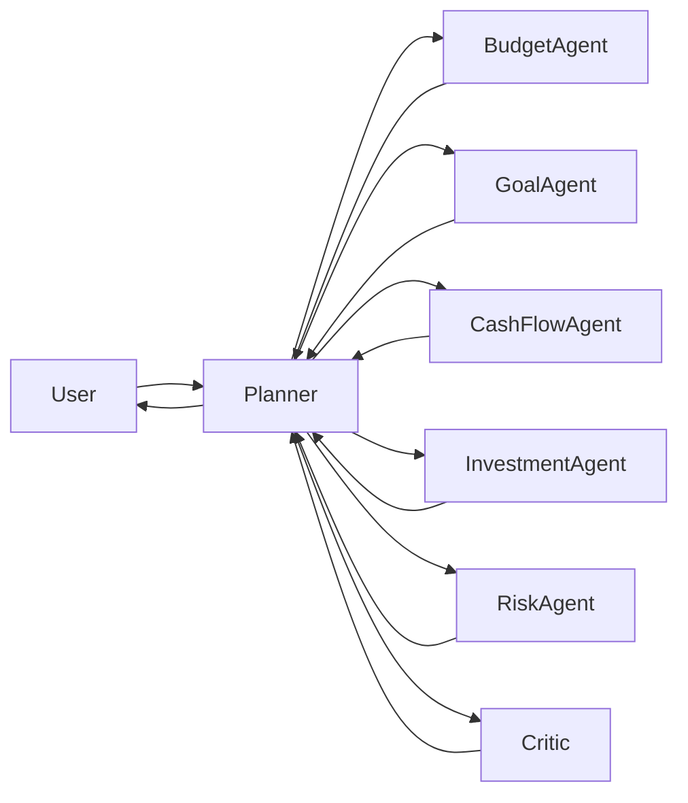

The Planner owns orchestration rather than financial expertise.

This distinction is fundamental throughout the architecture.

---

# Why AI Agents

Financial planning is inherently multidisciplinary.

A recommendation about purchasing a home may require reasoning across:

- budgeting
- savings
- investments
- cash flow
- debt
- financial risk
- long-term goals

Rather than forcing a single language model to reason across every domain simultaneously, WalletMind delegates specialized reasoning to independent agents.

Each agent owns a well-defined capability.

| Agent                 | Primary Responsibility   |
| --------------------- | ------------------------ |
| Budget Agent          | Spending optimization    |
| Goal Planning Agent   | Goal decomposition       |
| Cash Flow Agent       | Financial forecasting    |
| Investment Agent      | Portfolio reasoning      |
| Risk Assessment Agent | Financial resilience     |
| Insights Agent        | Recommendation synthesis |
| Critic Agent          | Validation               |

The Planner dynamically selects only the agents required for a given request.

This enables:

- dynamic execution
- reusable capabilities
- easier testing
- independent evolution
- better explainability
- improved modularity

---

# Why Google ADK

WalletMind is intentionally optimized for Google's Agent Development Kit (ADK).

The architecture embraces ADK's core design philosophy:

- planner-driven execution
- agent orchestration
- structured communication
- tool abstraction
- memory integration
- modular agent composition

Instead of treating ADK as a library, WalletMind treats ADK as the architectural foundation of the system.

This allows the repository to serve as both:

- a competition submission
- a reference architecture for planner-driven AI systems

---

# High-Level System Overview

At the highest level, WalletMind consists of six architectural layers.

1. User Interaction
2. Planning
3. Specialized AI Agents
4. Memory
5. Tool & MCP Integration
6. Explainable Response Generation

Every user interaction passes through these layers before a recommendation is produced.

No reasoning component bypasses the Planner.

No recommendation bypasses validation.

---

# System Context Diagram

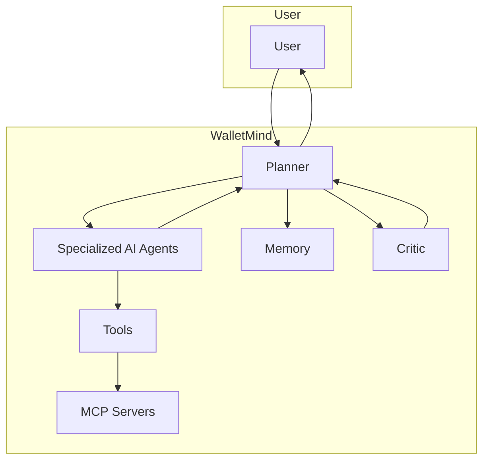

This diagram illustrates the highest-level view of the WalletMind architecture.

The Planner serves as the orchestration hub connecting all reasoning components while preserving clear ownership boundaries.

---

# Core Architectural Philosophy

WalletMind is built around a small set of architectural principles that guide every subsystem.

## Planner Owns Coordination

The Planner determines:

- what work is required
- which agents participate
- execution order
- dependency management
- aggregation
- validation

The Planner never performs financial reasoning.

---

## Agents Own Expertise

Each reasoning capability has a single architectural owner.

Examples include:

- budgeting
- forecasting
- investment analysis
- risk assessment
- recommendation synthesis

No capability should be duplicated across multiple agents.

---

## Memory Owns Context

Persistent knowledge belongs exclusively to the Memory subsystem.

Agents remain stateless whenever possible.

Long-term context is retrieved through documented interfaces rather than internal storage.

---

## Tools Own External Interaction

Agents never communicate directly with external systems.

External interactions are delegated to reusable tools.

This allows reasoning logic to remain independent of external infrastructure.

---

## Validation Before Delivery

Every significant recommendation passes through an independent validation stage before reaching the user.

Validation ensures:

- logical consistency
- supporting evidence
- confidence alignment
- reasoning completeness

This architectural constraint improves trust while supporting explainability.

---

# Architecture Principles

Every architectural decision throughout WalletMind should satisfy the following principles.

| Principle                   | Description                                             |
| --------------------------- | ------------------------------------------------------- |
| Planner First               | Every request begins with orchestration                 |
| Goal First                  | User objectives drive execution                         |
| Explainability First        | Every recommendation must be traceable                  |
| Memory First                | Long-term context improves reasoning                    |
| Capability Ownership        | One owner per reasoning capability                      |
| Composition Over Complexity | Many focused agents over monolithic systems             |
| Extension Over Modification | New capabilities should integrate without redesign      |
| Structured Communication    | Components exchange typed, deterministic data           |
| Notebook First              | Every subsystem should be demonstrable inside notebooks |

These principles collectively define the architectural identity of WalletMind and provide the foundation for every subsequent architecture document in this repository.

---

# Component Architecture

WalletMind is organized as a collection of loosely coupled architectural components that collaborate through the Planner.

Each component has a single responsibility, communicates through well-defined contracts, and can evolve independently without introducing hidden dependencies.

Unlike traditional applications that centralize business logic, WalletMind distributes reasoning across specialized AI agents while centralizing orchestration within the Planner.

This separation of responsibilities improves:

- Explainability
- Modularity
- Testability
- Extensibility
- Educational clarity
- AI-assisted implementation

The architecture follows a hub-and-spoke model where the Planner acts as the coordination hub while every other component specializes in a particular responsibility.

---

## Component Responsibilities

| Component           | Primary Responsibility             | Owns                              |
| ------------------- | ---------------------------------- | --------------------------------- |
| User Interface      | User interaction                   | Conversations & visualization     |
| Planner             | Execution orchestration            | Task decomposition & coordination |
| Capability Registry | Capability discovery               | Agent selection                   |
| Specialized Agents  | Financial reasoning                | Domain expertise                  |
| Memory              | Persistent context                 | User knowledge                    |
| Tools               | External capabilities              | APIs, calculations, retrieval     |
| MCP Layer           | Standardized external connectivity | MCP servers                       |
| Critic              | Validation                         | Quality assurance                 |
| Response Composer   | Final explanation                  | User-facing recommendation        |

No component should assume another component's responsibility.

---

## Architectural Component Diagram

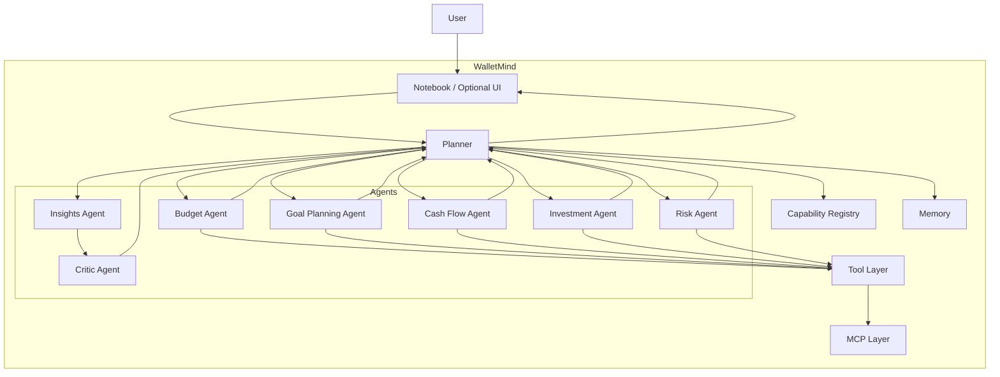

---

# Layered Architecture

WalletMind follows a layered architecture that separates user interaction, orchestration, reasoning, external capabilities, and persistent context.

Each layer exposes clearly defined responsibilities while hiding internal implementation details.

Layers communicate only through documented interfaces.

This separation enables independent development and straightforward AI-assisted implementation.

---

## Layer Overview

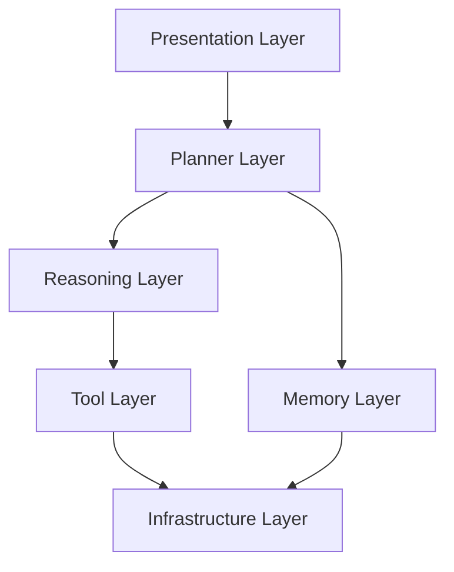

---

## Presentation Layer

### Purpose

The Presentation Layer is responsible for every interaction between the user and WalletMind.

It contains no financial reasoning.

Typical responsibilities include:

- notebook demonstrations
- conversational interface
- execution visualization
- reasoning traces
- charts
- recommendation rendering

This layer should remain replaceable.

Examples include:

- Kaggle Notebook
- Streamlit interface
- Web application
- Command-line interface

All communicate with the Planner using the same architectural contract.

---

## Planner Layer

The Planner Layer is the architectural heart of WalletMind.

Its purpose is orchestration rather than expertise.

Responsibilities include:

- understanding intent
- extracting goals
- retrieving context
- discovering capabilities
- generating task graphs
- scheduling execution
- coordinating agents
- aggregating results
- invoking validation

The Planner never performs financial reasoning.

---

## Reasoning Layer

The Reasoning Layer contains specialized AI agents.

Each agent owns exactly one reasoning capability.

Examples include:

| Agent               | Responsibility           |
| ------------------- | ------------------------ |
| Budget Agent        | Spending optimization    |
| Goal Planning Agent | Goal decomposition       |
| Cash Flow Agent     | Financial forecasting    |
| Investment Agent    | Investment reasoning     |
| Risk Agent          | Financial resilience     |
| Insights Agent      | Recommendation synthesis |
| Critic Agent        | Validation               |

Agents remain independent of one another.

Communication occurs exclusively through the Planner.

---

## Memory Layer

The Memory Layer manages persistent contextual knowledge.

Responsibilities include:

- user profile
- financial preferences
- goals
- historical recommendations
- interaction history
- semantic retrieval
- episodic memory
- long-term context

Memory never performs reasoning.

It only stores and retrieves context.

---

## Tool Layer

Tools encapsulate every interaction with external capabilities.

Examples include:

- financial calculators
- forecasting engines
- document retrieval
- web search
- exchange rate lookup
- investment data
- simulation utilities

Tools expose deterministic interfaces.

Tools never make autonomous decisions.

---

## Infrastructure Layer

The Infrastructure Layer supports the architectural components.

Responsibilities include:

- storage
- vector databases
- model providers
- MCP transport
- file system
- configuration

Infrastructure remains hidden behind architectural interfaces.

This allows implementation technologies to change without affecting higher layers.

---

# Runtime Architecture

The runtime architecture describes how WalletMind behaves while processing an individual request.

Rather than executing a fixed workflow, WalletMind dynamically constructs an execution strategy according to user intent.

This architecture allows identical infrastructure to solve vastly different financial problems through different execution paths.

---

## Runtime Overview


Every execution creates a temporary runtime context that exists only for the duration of the request.

Persistent user knowledge remains inside the Memory subsystem.

---

## Runtime Responsibilities

| Runtime Component | Responsibility             |
| ----------------- | -------------------------- |
| Planner           | Execution strategy         |
| Task Graph        | Dependency representation  |
| Scheduler         | Execution ordering         |
| Agent Runtime     | Task execution             |
| Aggregator        | Merge outputs              |
| Critic            | Validate reasoning         |
| Memory            | Retrieve & persist context |

---

## Runtime Characteristics

WalletMind's runtime is designed to be:

### Dynamic

Execution plans are generated rather than hardcoded.

### Goal-Oriented

Planning begins with user objectives rather than predefined workflows.

### Explainable

Every runtime decision can be reconstructed after execution.

### Observable

Planner decisions, agent participation, tool usage, and validation outcomes are visible through execution traces.

### Modular

Runtime behavior changes by selecting different agents rather than modifying core architecture.

---

# Notebook Architecture

The Kaggle Notebook is the primary demonstration environment for WalletMind.

Unlike a production interface, the notebook is intentionally designed to expose architectural behavior.

The notebook acts as both:

- interactive application
- educational walkthrough

Every notebook should clearly demonstrate:

1. User request
2. Planner reasoning
3. Retrieved memory
4. Generated task graph
5. Selected agents
6. Tool usage
7. Validation
8. Final recommendation

---

## Notebook Execution Flow

```mermaid
flowchart TD

Scenario["Notebook Scenario"]

-->

Planner

-->

Execution Trace

-->

Agent Outputs

-->

Critic

-->

Explanation

-->

Visualization
```

Notebook cells should progressively reveal the reasoning process rather than hiding architectural details.

This makes the notebook an effective storytelling artifact for Kaggle judges.

---

## Notebook Design Principles

Every notebook should be:

- deterministic
- reproducible
- educational
- visually explainable
- modular
- easy to follow

Each notebook scenario should illustrate a different aspect of the architecture rather than repeating identical execution patterns.

---

# Optional Frontend Architecture

Although WalletMind is notebook-first, the architecture intentionally supports optional presentation layers.

These frontends are interchangeable because all communication occurs through the Planner.

Possible interfaces include:

| Interface       | Purpose                   |
| --------------- | ------------------------- |
| Kaggle Notebook | Competition demonstration |
| Streamlit       | Interactive demo          |
| Web UI          | Future showcase           |
| CLI             | Developer testing         |
| API             | Programmatic integration  |

Each presentation layer communicates through identical architectural contracts.

---

## Frontend Context Diagram

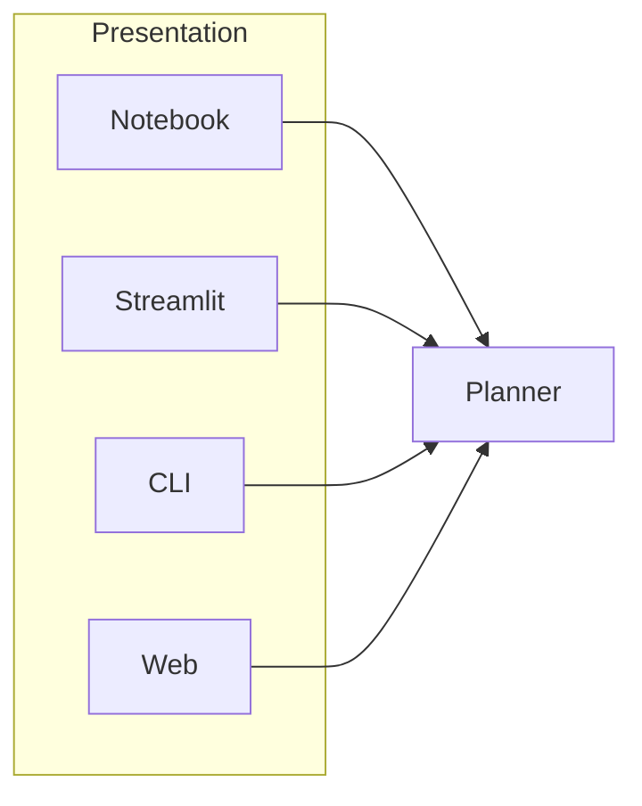

Because business logic never resides inside presentation components, new interfaces can be introduced without modifying the Planner, Memory subsystem, or Agent ecosystem.

---

## Architectural Boundary

The Presentation Layer should never contain:

- financial reasoning
- planner logic
- memory management
- validation
- tool execution

Its sole responsibility is translating user interactions into Planner requests and rendering Planner responses.

---

**End of Part 2**

The next section introduces the core intelligence of WalletMind by describing the Planner's architectural position, the Agent Ecosystem, the Memory subsystem, the Tool subsystem, and the MCP integration model.

---

# Planner Position

The Planner is the architectural center of WalletMind.

Every user request, regardless of complexity, begins with the Planner and concludes with the Planner. No AI agent, tool, or memory operation should execute unless orchestrated by the Planner.

Unlike traditional workflow engines that execute predefined pipelines, the Planner dynamically constructs an execution strategy based on the user's intent, available context, and required reasoning capabilities.

The Planner is therefore the **system orchestrator**, not the system expert.

Its purpose is to determine **how** a problem should be solved rather than **solve** the financial problem itself.

---

## Architectural Position

The Planner occupies a unique position within the architecture.

It is the only component that has architectural awareness of:

- user intent
- execution state
- capability discovery
- task dependencies
- execution ordering
- aggregation
- validation workflow

It deliberately avoids owning any financial reasoning.

This strict separation ensures that orchestration and expertise remain independent concerns.

---

## Planner Context

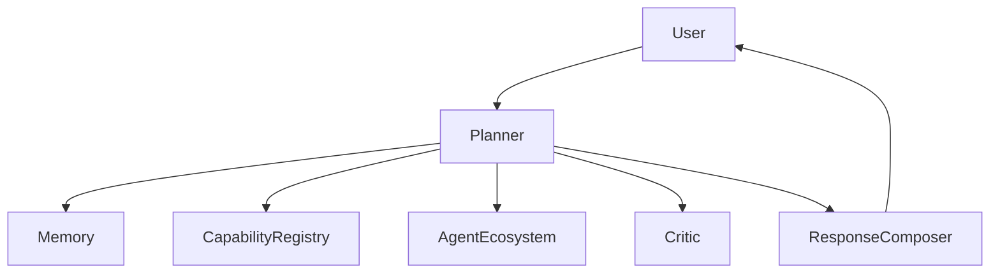

The Planner acts as the coordination hub while preserving the independence of every reasoning component.

---

# Why the Planner Exists

A traditional conversational AI system generally follows this execution model.

```mermaid
flowchart LR

User

-->

Large Language Model

-->

Response
```

This approach performs well for simple questions but becomes increasingly difficult to extend as reasoning complexity increases.

Financial planning introduces challenges such as:

- competing objectives
- long planning horizons
- uncertainty
- contextual memory
- multiple reasoning domains
- dependency management
- explainability

Rather than embedding all reasoning inside one model invocation, WalletMind decomposes reasoning into specialized tasks coordinated by the Planner.

---

# Planner Responsibilities

The Planner owns orchestration across the entire runtime.

Its responsibilities include:

| Responsibility              | Description                               |
| --------------------------- | ----------------------------------------- |
| Intent Recognition          | Understand user objectives                |
| Goal Extraction             | Convert language into structured goals    |
| Constraint Identification   | Detect planning constraints               |
| Context Retrieval           | Request relevant memory                   |
| Capability Discovery        | Determine required reasoning capabilities |
| Task Graph Construction     | Build execution graph                     |
| Scheduling                  | Determine execution order                 |
| Dependency Management       | Resolve prerequisite relationships        |
| Parallel Execution          | Execute independent tasks concurrently    |
| Result Aggregation          | Merge agent outputs                       |
| Validation Coordination     | Invoke Critic                             |
| Confidence Synthesis        | Produce overall confidence                |
| Final Response Coordination | Assemble explainable response             |

The Planner should never perform domain-specific financial reasoning.

---

# Planner Does Not Own

To preserve architectural clarity, several responsibilities intentionally belong elsewhere.

| Responsibility          | Architectural Owner   |
| ----------------------- | --------------------- |
| Budget optimization     | Budget Agent          |
| Investment reasoning    | Investment Agent      |
| Cash flow forecasting   | Cash Flow Agent       |
| Financial risk analysis | Risk Assessment Agent |
| Recommendation writing  | Insights Agent        |
| Validation              | Critic Agent          |
| Long-term storage       | Memory                |
| External APIs           | Tool Layer            |

Keeping these responsibilities separate reduces coupling and simplifies future extension.

---

# Planner Decision Pipeline

Every request follows the same conceptual planning lifecycle.

```mermaid
flowchart LR

Intent

-->

Goals

-->

Constraints

-->

Memory Retrieval

-->

Capability Discovery

-->

Task Graph

-->

Scheduling

-->

Agent Execution

-->

Aggregation

-->

Validation

-->

Response
```

Although every request follows this conceptual pipeline, the generated execution graph differs according to the user's objective.

---

# Capability Registry

The Planner reasons in terms of **capabilities**, not implementations.

Capabilities describe _what_ the system must accomplish.

Agents describe _who_ performs that work.

This level of abstraction allows the Planner to remain independent of specific agent implementations.

---

## Capability Resolution

```mermaid
flowchart LR

Goal

-->

Capability Discovery

-->

Capability Registry

-->

Agent Resolution

-->

Execution
```

For example:

| User Goal          | Required Capabilities                  |
| ------------------ | -------------------------------------- |
| Buy a Home         | Goal Planning, Cash Flow, Budget, Risk |
| Retire Early       | Investment, Goal Planning, Cash Flow   |
| Reduce Spending    | Budget Analysis                        |
| Emergency Planning | Cash Flow, Risk                        |

The Capability Registry resolves these abstract capabilities into concrete agent implementations.

This design allows future agents to be introduced without modifying Planner logic.

---

# Agent Ecosystem

WalletMind models financial reasoning as collaboration among specialized AI agents.

Each agent owns a narrowly defined reasoning domain.

No agent should attempt to solve every financial problem.

Instead, agents cooperate through Planner orchestration.

---

## Agent Ecosystem Overview

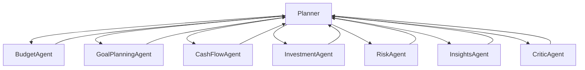

The Planner remains the only component responsible for coordinating collaboration.

---

# Agent Responsibilities

Each agent owns one primary reasoning capability.

| Agent                 | Primary Responsibility                |
| --------------------- | ------------------------------------- |
| Budget Agent          | Spending analysis and optimization    |
| Goal Planning Agent   | Goal decomposition and prioritization |
| Cash Flow Agent       | Financial forecasting                 |
| Investment Agent      | Portfolio reasoning                   |
| Risk Assessment Agent | Financial resilience analysis         |
| Insights Agent        | Recommendation synthesis              |
| Critic Agent          | Independent validation                |

Ownership is exclusive.

Duplicating responsibilities across agents is prohibited.

---

# Agent Design Philosophy

Every reasoning agent follows the same architectural philosophy.

Each agent should:

- receive structured inputs
- retrieve required context
- perform one reasoning task
- produce structured outputs
- estimate confidence
- provide supporting evidence
- remain independent of other agents

This consistency simplifies implementation while improving explainability.

---

# Agent Independence

Agents intentionally know nothing about one another.

Incorrect architecture:

```text
Budget Agent
      │
      ▼
Risk Agent
      │
      ▼
Investment Agent
```

Correct architecture:

```text
          Planner
        /    |    \
       /     |     \
 Budget   Risk   Investment
       \     |     /
        \    |    /
         Planner
```

Every interaction passes through the Planner.

This avoids hidden dependencies and circular reasoning.

---

# Agent Collaboration Model

Financial reasoning often requires several independent perspectives.

Consider the request:

> "Can I afford to retire five years earlier?"

The Planner may coordinate:

1. Goal Planning Agent
2. Cash Flow Agent
3. Investment Agent
4. Risk Assessment Agent
5. Insights Agent
6. Critic Agent

Each contributes evidence from its own domain.

The Planner aggregates these perspectives into a unified recommendation.

---

## Collaboration Sequence

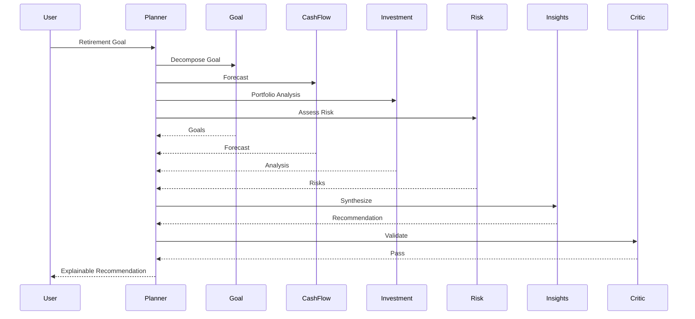

This sequence illustrates the Planner's role as the sole coordinator throughout execution.

---

# Agent Lifecycle

Every agent follows the same conceptual lifecycle.

```mermaid
flowchart LR

Structured Input

-->

Context Retrieval

-->

Reasoning

-->

Evidence Generation

-->

Confidence Estimation

-->

Structured Output
```

This uniform lifecycle enables reusable tooling, testing strategies, and notebook demonstrations.

---

# Architectural Boundaries

The Planner and Agent Ecosystem operate under several non-negotiable architectural constraints.

| Constraint                     | Description                                                |
| ------------------------------ | ---------------------------------------------------------- |
| Planner owns orchestration     | Agents never coordinate execution                          |
| Agents own reasoning           | Planner never performs financial analysis                  |
| One capability, one owner      | Prevent duplicated logic                                   |
| Stateless agents               | Persistent knowledge belongs to Memory                     |
| Planner-mediated collaboration | Agents never invoke one another directly                   |
| Structured communication       | Every interaction follows documented contracts             |
| Validation required            | Significant recommendations must be reviewed by the Critic |

These constraints preserve modularity while making the reasoning process transparent and reproducible.

---

## Design Rationale

Separating orchestration from reasoning produces several architectural advantages.

| Architectural Goal | Benefit                                           |
| ------------------ | ------------------------------------------------- |
| Modularity         | Agents evolve independently                       |
| Explainability     | Every reasoning step has a clear owner            |
| Extensibility      | New capabilities integrate without redesign       |
| Maintainability    | Responsibilities remain isolated                  |
| Reusability        | Agents participate in many workflows              |
| Educational Value  | Execution becomes easy to understand in notebooks |

This architecture closely aligns with the design philosophy of Google's Agent Development Kit, where planners coordinate specialized agents through explicit execution plans rather than embedding all reasoning inside a single conversational model.

---

# Memory Subsystem

Financial planning is fundamentally a long-term reasoning problem.

Unlike traditional conversational systems that treat each interaction independently, WalletMind is designed to accumulate contextual knowledge over time so recommendations become increasingly personalized while remaining transparent and explainable.

The Memory subsystem provides this persistent context.

It enables the Planner and specialized agents to reason using both the user's current request and relevant historical knowledge without embedding persistent state inside individual agents.

Memory is therefore a shared architectural capability rather than an implementation detail.

---

# Purpose

The Memory subsystem exists to answer one fundamental architectural question:

> **"What relevant information from previous interactions should influence the current reasoning process?"**

Instead of forcing the user to repeatedly explain financial goals, preferences, or constraints, WalletMind retrieves only the information that is relevant to the current planning task.

This improves:

- personalization
- reasoning quality
- planner efficiency
- recommendation consistency
- user experience
- explainability

---

# Architectural Position

Memory occupies a shared position within the architecture.

It is neither controlled by individual agents nor embedded within the Planner.

Instead, it operates as an independent subsystem that provides contextual knowledge to the Planner and reasoning agents.

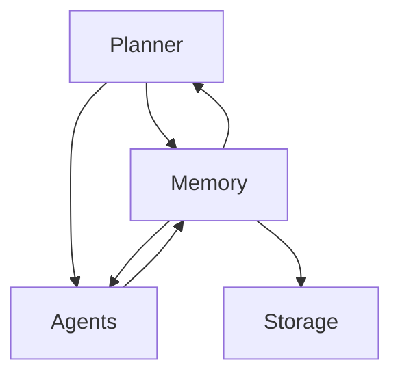

Memory remains independent of financial reasoning while supporting every reasoning component.

---

# Architectural Philosophy

WalletMind adopts a **memory-first reasoning architecture**.

Rather than allowing agents to accumulate hidden state, all persistent knowledge belongs exclusively to the Memory subsystem.

This ensures:

- deterministic agent behavior
- centralized context management
- transparent personalization
- reusable memory retrieval
- easier testing
- explainable recommendations

Agents should remain stateless whenever possible.

---

# Memory Responsibilities

The Memory subsystem owns:

| Responsibility         | Description                          |
| ---------------------- | ------------------------------------ |
| User Profile           | Persistent financial profile         |
| Goal History           | Active and completed financial goals |
| Preference Storage     | User preferences and behaviors       |
| Context Retrieval      | Relevant memory retrieval            |
| Episodic History       | Previous conversations               |
| Semantic Search        | Similar context discovery            |
| Recommendation History | Historical advice                    |
| Memory Updates         | Persist validated information        |

Memory intentionally does **not** perform:

- financial reasoning
- planning
- orchestration
- validation
- recommendation generation

Those responsibilities belong elsewhere.

---

# Memory Architecture

WalletMind separates memory into multiple conceptual layers.

Each layer serves a different reasoning purpose.

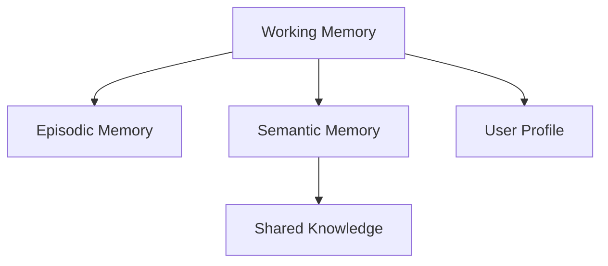

This layered model enables both short-term execution and long-term personalization.

---

# Memory Types

## Working Memory

Working Memory exists only during a single request.

It stores temporary execution context including:

- current task graph
- planner decisions
- intermediate agent outputs
- dependency state
- execution metadata

Working Memory is discarded after execution completes.

---

## Episodic Memory

Episodic Memory stores previous interactions with the user.

Examples include:

- prior financial discussions
- accepted recommendations
- rejected advice
- previous goals
- historical planner decisions

Episodic Memory helps WalletMind maintain conversational continuity.

---

## Semantic Memory

Semantic Memory stores structured knowledge extracted from previous interactions.

Examples include:

- preferred budgeting style
- investment philosophy
- recurring financial concerns
- spending habits
- savings patterns
- financial priorities

Unlike episodic memory, semantic memory represents generalized knowledge rather than specific conversations.

---

## User Profile Memory

The User Profile represents persistent financial characteristics.

Typical information includes:

- income range
- household composition
- financial goals
- planning horizon
- risk tolerance
- preferred currencies
- recurring obligations

The profile evolves gradually as WalletMind learns more about the user.

---

## Shared Knowledge

Shared Knowledge contains information that is not user-specific.

Examples include:

- financial terminology
- planning methodologies
- budgeting concepts
- investment principles
- domain reference material

This information remains separate from personalized memory.

---

# Memory Retrieval Strategy

The Planner never retrieves all available memory.

Instead, it requests only the context required for the current planning task.

The retrieval strategy follows four stages.

```mermaid
flowchart LR

User Request

-->

Planner

-->

Memory Query

-->

Relevant Context

-->

Planner
```

This selective retrieval minimizes unnecessary context while improving reasoning quality.

---

# Context Selection

The Memory subsystem evaluates relevance based on several factors.

| Factor                   | Example                     |
| ------------------------ | --------------------------- |
| Active Goal              | Home purchase               |
| Time Horizon             | Five-year plan              |
| Financial Topic          | Investing                   |
| User Preferences         | Conservative risk tolerance |
| Previous Recommendations | Earlier retirement advice   |
| Recent Activity          | Budget changes              |

Only relevant context should be returned.

---

# Memory Lifecycle

Memory follows a structured lifecycle throughout execution.


Each stage has a distinct purpose.

### Retrieve

Planner requests context.

### Use

Agents incorporate retrieved information into reasoning.

### Update

Planner proposes new knowledge.

### Validate

Only validated information becomes persistent.

### Persist

Memory stores approved context.

---

# Memory Update Principles

Not every interaction should become permanent memory.

WalletMind persists only information that satisfies predefined quality criteria.

Examples include:

- confirmed financial goals
- stable user preferences
- accepted recommendations
- corrected assumptions
- validated financial facts

Temporary reasoning should never become permanent memory.

---

# Memory Ownership

Persistent knowledge has exactly one owner.

| Information          | Owner           |
| -------------------- | --------------- |
| User Profile         | Memory          |
| Active Goals         | Memory          |
| Preferences          | Memory          |
| Conversation History | Memory          |
| Planner State        | Planner         |
| Agent Outputs        | Planner Runtime |
| Validation Results   | Planner Runtime |

This ownership model prevents duplication.

---

# Planner and Memory Relationship

The Planner is the primary consumer of Memory.

The Planner requests context before generating the execution plan.

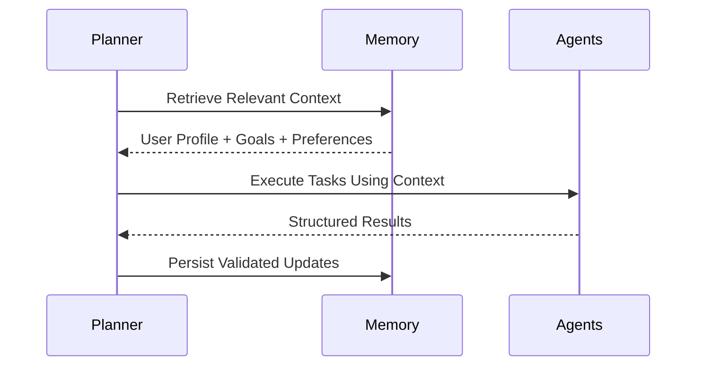

Memory remains independent of execution logic.

---

# Agent and Memory Relationship

Agents may retrieve additional context when authorized by the Planner.

Agents never own persistent memory.

```text
Planner

↓

Memory Retrieval

↓

Agent Reasoning

↓

Planner

↓

Memory Update
```

This architecture keeps reasoning deterministic while preserving personalization.

---

# Memory Design Principles

Every future enhancement to the Memory subsystem should satisfy the following principles.

| Principle                     | Description                                      |
| ----------------------------- | ------------------------------------------------ |
| Memory is Shared              | No agent owns persistent state                   |
| Retrieval Before Reasoning    | Context should inform execution                  |
| Validation Before Persistence | Only validated knowledge is stored               |
| Stateless Agents              | Memory belongs to the subsystem                  |
| Explainable Retrieval         | Users should understand why information was used |
| Minimal Retrieval             | Retrieve only what is relevant                   |
| Long-Term Personalization     | Memory improves future reasoning                 |

---

# Explainability

One of WalletMind's primary goals is transparent personalization.

Whenever memory influences a recommendation, the system should be able to explain:

- what information was retrieved
- why it was considered relevant
- how it influenced planning
- whether the information came from previous conversations or the user profile

Example:

> "This recommendation considers your previously stated goal of purchasing a home within five years and your preference for conservative investment strategies."

This transparency increases user trust while satisfying the project's explainability objectives.

---

# Design Rationale

Separating memory into an independent subsystem provides several architectural advantages.

| Design Goal     | Benefit                                      |
| --------------- | -------------------------------------------- |
| Modularity      | Memory evolves independently                 |
| Explainability  | Retrieved context remains visible            |
| Personalization | Long-term user understanding                 |
| Reusability     | All agents share one memory system           |
| Testability     | Memory can be evaluated independently        |
| ADK Alignment   | Supports planner-driven contextual reasoning |

The Memory subsystem transforms WalletMind from a stateless conversational assistant into a persistent financial reasoning partner capable of supporting long-term financial planning while remaining transparent, modular, and explainable.

---

# Tool Subsystem

The Tool Subsystem enables WalletMind to interact with deterministic capabilities that exist outside of the reasoning process.

While AI agents specialize in reasoning and decision making, tools specialize in performing concrete operations such as calculations, retrieval, simulations, and communication with external systems.

This separation is fundamental to WalletMind's architecture.

Agents decide **what** should happen.

Tools perform **how** it happens.

---

# Purpose

The Tool Subsystem exists to provide reusable, deterministic capabilities that support agent reasoning without embedding external dependencies inside individual agents.

Examples include:

- Financial calculations
- Scenario simulation
- Exchange rate retrieval
- Market information lookup
- Document retrieval
- Mathematical operations
- File access
- Structured data retrieval
- MCP communication

By encapsulating these operations into reusable tools, WalletMind maintains clean architectural boundaries between reasoning and execution.

---

# Architectural Position

The Tool Layer sits beneath the Planner and Agent layers.

It is only accessible through documented interfaces and never initiates execution on its own.

```mermaid
flowchart TD

Planner

-->

Agents

-->

Tool Layer

-->

Infrastructure

-->

External Resources
```

The Tool Layer acts as the execution bridge between AI reasoning and deterministic computation.

---

# Tool Philosophy

WalletMind follows a strict architectural philosophy regarding tools.

> **Tools execute. Agents reason.**

This distinction prevents reasoning logic from becoming coupled with implementation-specific details.

For example:

Instead of an Investment Agent directly calling a market API, the agent requests information through a Market Data Tool.

Instead of a Budget Agent performing complex calculations internally, it delegates numerical computation to a Financial Calculator Tool.

This separation keeps reasoning reusable while allowing tools to evolve independently.

---

# Responsibilities

The Tool Subsystem owns:

| Responsibility             | Description                            |
| -------------------------- | -------------------------------------- |
| External API Access        | Communicate with third-party services  |
| Deterministic Calculations | Financial and mathematical computation |
| Retrieval                  | Access structured information          |
| Simulation                 | Execute deterministic scenarios        |
| File Operations            | Read and process documents             |
| Data Formatting            | Transform structured information       |
| MCP Communication          | Interface with MCP servers             |

The Tool Layer intentionally does **not** own:

- planning
- reasoning
- orchestration
- recommendation generation
- validation

---

# Tool Architecture

The Tool Layer is composed of multiple independent tools.

Each tool performs one well-defined responsibility.

```mermaid
flowchart TD

Agents

-->

Tool Router

Tool Router

--> Financial Calculator

Tool Router

--> Market Data Tool

Tool Router

--> Forecast Tool

Tool Router

--> Document Retrieval Tool

Tool Router

--> Simulation Tool

Tool Router

--> Memory Tool

Tool Router

--> MCP Tool
```

Every tool follows the same architectural contract regardless of implementation technology.

---

# Tool Categories

WalletMind groups tools according to their architectural purpose.

| Category           | Examples                                                 |
| ------------------ | -------------------------------------------------------- |
| Calculation        | Financial formulas, loan calculations, compound interest |
| Retrieval          | Documents, structured data, knowledge lookup             |
| Market Information | Exchange rates, investment data                          |
| Simulation         | Future scenario modelling                                |
| Utility            | Date calculations, formatting, parsing                   |
| Memory Access      | Context retrieval and persistence                        |
| MCP                | Communication with external AI systems                   |

Categorizing tools simplifies capability discovery and future extension.

---

# Tool Lifecycle

Every tool invocation follows a common execution lifecycle.

```mermaid
flowchart LR

Request

-->

Validation

-->

Execution

-->

Result

-->

Planner
```

Each stage has a clearly defined purpose.

### Request

An agent requests a deterministic capability.

### Validation

Inputs are validated against the documented contract.

### Execution

The tool performs its assigned operation.

### Result

Structured outputs are returned to the requesting agent.

The Planner remains responsible for interpreting those results.

---

# Tool Execution Flow

The following sequence illustrates a typical interaction.

```mermaid
sequenceDiagram

participant Planner

participant Agent

participant Tool

participant External

Planner->>Agent: Execute Task

Agent->>Tool: Request Capability

Tool->>External: Perform Operation

External-->>Tool: Structured Result

Tool-->>Agent: Validated Output

Agent-->>Planner: Reasoning Result
```

Notice that external communication never bypasses the Tool Layer.

---

# Tool Contracts

Every tool should expose an explicit contract.

Typical contracts include:

| Field         | Purpose                |
| ------------- | ---------------------- |
| Tool Name     | Unique identifier      |
| Capability    | Supported operation    |
| Input Schema  | Accepted parameters    |
| Output Schema | Structured response    |
| Error Types   | Expected failures      |
| Version       | Compatibility tracking |

Structured contracts improve reliability while making tools easier to reuse across multiple agents.

---

# Tool Design Principles

Every tool should satisfy the following principles.

## Single Responsibility

A tool performs one capability.

Avoid monolithic utility tools.

---

## Deterministic Behaviour

Given identical inputs, tools should produce consistent outputs whenever possible.

---

## Stateless Execution

Tools should not maintain persistent state.

Persistent knowledge belongs to the Memory subsystem.

---

## Reusable Interfaces

Multiple agents should be able to invoke the same tool.

For example:

- Budget Agent
- Investment Agent
- Risk Agent

may all reuse the same Financial Calculator Tool.

---

## Replaceable Implementation

Agents should depend on documented contracts rather than implementation details.

Changing the implementation of a tool should not require changes to the Planner or reasoning agents.

---

# Relationship with the Planner

The Planner never calls external services directly.

Instead, it delegates deterministic work to the appropriate agent, which then invokes the required tool.

```text
Planner

↓

Agent

↓

Tool

↓

External Capability

↓

Tool

↓

Agent

↓

Planner
```

This architecture preserves the Planner's role as an orchestrator.

---

# Relationship with Memory

Tools may retrieve or persist information through the Memory subsystem when authorized by the Planner.

However, tools never own persistent context.

```mermaid
flowchart LR

Agent

-->

Memory Tool

-->

Memory

Memory

-->

Memory Tool

-->

Agent
```

This maintains a clear separation between execution and storage.

---

# Error Handling

Tools should report failures through structured responses rather than unstructured text.

Common failure categories include:

| Failure          | Example                           |
| ---------------- | --------------------------------- |
| Validation Error | Invalid parameters                |
| Timeout          | External service unavailable      |
| Authentication   | Missing credentials               |
| Resource Error   | Requested information unavailable |
| Internal Error   | Unexpected execution failure      |

The Planner determines whether retries are appropriate.

---

# Tool Ownership

Each deterministic capability should have exactly one architectural owner.

| Capability             | Owner                     |
| ---------------------- | ------------------------- |
| Financial Calculations | Financial Calculator Tool |
| Scenario Simulation    | Simulation Tool           |
| Market Information     | Market Data Tool          |
| Document Retrieval     | Retrieval Tool            |
| Context Retrieval      | Memory Tool               |
| MCP Communication      | MCP Tool                  |

This ownership model avoids duplicated functionality across tools.

---

# Explainability

Tool usage contributes to WalletMind's explainability.

Recommendations should identify when deterministic computations or external information influenced the final reasoning.

Example:

> "The mortgage affordability estimate was calculated using the Financial Calculator Tool based on your current income, savings, and requested loan term."

This transparency allows users and evaluators to distinguish between AI reasoning and deterministic computation.

---

# Design Rationale

Separating tools from reasoning provides several architectural benefits.

| Goal            | Benefit                                           |
| --------------- | ------------------------------------------------- |
| Modularity      | Tools evolve independently of agents              |
| Reusability     | Multiple agents share common capabilities         |
| Explainability  | Deterministic operations remain traceable         |
| Testability     | Tools can be validated independently              |
| Maintainability | External integrations remain isolated             |
| ADK Alignment   | Supports Google's tool-centric agent architecture |

The Tool Subsystem enables WalletMind to remain modular, explainable, and extensible while allowing specialized agents to focus exclusively on financial reasoning.

---

# Model Context Protocol (MCP) Subsystem

The Model Context Protocol (MCP) provides WalletMind with a standardized mechanism for connecting AI agents to external capabilities.

Rather than integrating directly with individual APIs, databases, or services, WalletMind communicates through MCP-compatible servers that expose capabilities using a consistent protocol.

This abstraction allows the architecture to remain modular, implementation-independent, and easily extensible.

The Planner and specialized agents reason about **capabilities**, while the MCP layer provides standardized access to the systems that implement those capabilities.

---

# Purpose

The MCP subsystem exists to answer one architectural question:

> **"How can WalletMind safely and consistently interact with external capabilities without coupling agents to implementation details?"**

Instead of embedding API logic inside agents, WalletMind delegates external interactions to MCP-enabled services.

This provides:

- standardized integration
- implementation independence
- reusable capability providers
- modular extension
- simplified experimentation
- improved educational value

---

# Architectural Position

The MCP subsystem resides beneath the Tool Layer.

Tools communicate with MCP servers.

Agents never communicate with MCP servers directly.

```mermaid
flowchart TD

Planner

-->

Agents

-->

Tool Layer

-->

MCP Layer

-->

MCP Servers

-->

External Systems
```

This architecture preserves the separation between reasoning and infrastructure.

---

# Why MCP?

Modern AI systems increasingly require interaction with external resources.

Examples include:

- financial databases
- document repositories
- calculators
- simulation engines
- search services
- local files
- cloud storage
- custom business logic

Connecting every agent directly to every service creates excessive coupling.

Instead, WalletMind adopts MCP as a universal integration layer.

Benefits include:

- standardized communication
- interchangeable providers
- reusable integrations
- simplified testing
- easier experimentation
- future extensibility

---

# MCP Philosophy

WalletMind treats MCP as an architectural abstraction rather than a transport protocol.

The guiding principle is:

> **Agents request capabilities. MCP provides implementations.**

Agents should never know:

- endpoint URLs
- authentication methods
- transport mechanisms
- deployment locations
- infrastructure details

These concerns belong exclusively to the MCP layer.

---

# MCP Architecture

```mermaid
flowchart LR

subgraph WalletMind

Planner

Agents

Tools

end

subgraph MCP

Router

ServerA["Financial MCP Server"]

ServerB["Document MCP Server"]

ServerC["Knowledge MCP Server"]

ServerD["Simulation MCP Server"]

end

subgraph External

FinancialAPIs

DocumentStore

KnowledgeBase

SimulationEngine

end

Planner --> Agents

Agents --> Tools

Tools --> Router

Router --> ServerA
Router --> ServerB
Router --> ServerC
Router --> ServerD

ServerA --> FinancialAPIs
ServerB --> DocumentStore
ServerC --> KnowledgeBase
ServerD --> SimulationEngine
```

Each MCP server owns a well-defined capability domain.

---

# MCP Server Responsibilities

Every MCP server should expose one coherent collection of capabilities.

Examples include:

| MCP Server        | Primary Responsibility          |
| ----------------- | ------------------------------- |
| Financial Server  | Financial data and calculations |
| Document Server   | Document retrieval              |
| Knowledge Server  | Domain reference information    |
| Simulation Server | Scenario modelling              |
| File Server       | Local file interaction          |
| Memory Server     | Persistent context access       |

This modular organization simplifies maintenance and future expansion.

---

# MCP Request Lifecycle

Every interaction with an MCP server follows the same conceptual lifecycle.

```mermaid
flowchart LR

Planner

-->

Agent

-->

Tool

-->

MCP Server

-->

Capability

-->

Structured Result

-->

Planner
```

Each layer has a distinct responsibility.

- Planner decides **what** is required.
- Agent decides **why** it is needed.
- Tool decides **how** to invoke it.
- MCP decides **where** the capability exists.

---

# MCP Communication Principles

Communication through MCP should satisfy several architectural principles.

## Structured Requests

Every request should contain:

- capability identifier
- request metadata
- structured parameters
- execution context
- request identifier

---

## Structured Responses

Every response should include:

- result
- metadata
- execution status
- confidence (if applicable)
- diagnostics

Free-form text should never be the primary machine interface.

---

# Capability Resolution

WalletMind resolves capabilities progressively.

```mermaid
flowchart LR

Goal

-->

Planner

-->

Capability

-->

Agent

-->

Tool

-->

MCP Server

-->

Capability Execution
```

Example:

User Goal:

> "Can I afford a home?"

Planner identifies:

- Mortgage calculation
- Cash flow forecast
- Risk assessment

The appropriate agent requests the Financial Calculator Tool.

The Tool communicates with the Financial MCP Server.

The MCP Server performs deterministic calculations.

Results return to the Planner through the same chain.

---

# MCP Server Independence

Each MCP server should remain independent.

Incorrect architecture:

```text
Financial Server
        │
        ▼
Document Server
        │
        ▼
Knowledge Server
```

Preferred architecture:

```text
           Tool Layer

      ↙      ↓      ↘

Financial  Document  Knowledge

    MCP        MCP       MCP
```

Servers communicate through documented interfaces rather than hidden dependencies.

---

# Planner and MCP Relationship

The Planner remains intentionally unaware of MCP implementation details.

The Planner understands:

- capabilities
- reasoning tasks
- execution plans

The Planner does **not** understand:

- transport protocols
- authentication
- server locations
- API contracts

This preserves clean architectural boundaries.

---

# Tool and MCP Relationship

Tools provide the abstraction between reasoning agents and MCP services.

```text
Planner

↓

Agent

↓

Tool

↓

MCP Server

↓

External Capability
```

Changing an MCP implementation should not require modifications to Planner logic or agent reasoning.

---

# Example Capability Mapping

| Planner Capability    | Tool                      | MCP Server     |
| --------------------- | ------------------------- | -------------- |
| Financial Calculation | Financial Calculator Tool | Financial MCP  |
| Mortgage Analysis     | Financial Calculator Tool | Financial MCP  |
| Document Search       | Retrieval Tool            | Document MCP   |
| Financial Education   | Knowledge Tool            | Knowledge MCP  |
| Scenario Simulation   | Simulation Tool           | Simulation MCP |
| User Context          | Memory Tool               | Memory MCP     |

This mapping illustrates how architectural responsibilities remain clearly separated.

---

# Explainability

WalletMind's explainability extends beyond AI reasoning.

The system should also disclose when external capabilities contributed to a recommendation.

Example:

> "Mortgage affordability was evaluated using the Financial Calculation capability provided through the Financial MCP Server."

This distinction helps users understand which conclusions originated from AI reasoning and which originated from deterministic external services.

---

# Future Extensibility

One of MCP's greatest architectural advantages is extensibility.

Future servers can be introduced without modifying existing agents.

Examples include:

- Tax Planning MCP
- Insurance MCP
- Retirement Planning MCP
- Banking MCP
- Government Data MCP
- Real Estate MCP
- Currency Exchange MCP

The Planner simply discovers new capabilities through the Capability Registry.

Existing reasoning workflows remain unchanged.

---

# Design Principles

Every MCP integration should satisfy the following principles.

| Principle                  | Description                                       |
| -------------------------- | ------------------------------------------------- |
| Capability-Oriented        | Expose capabilities rather than APIs              |
| Standardized Communication | Consistent request and response contracts         |
| Loose Coupling             | Agents never depend on infrastructure             |
| Replaceable Providers      | MCP implementations are interchangeable           |
| Single Responsibility      | One server per capability domain                  |
| Planner Independence       | Planner remains unaware of implementation details |
| Explainability             | External capability usage remains traceable       |

---

# Design Rationale

Separating external capabilities behind the Model Context Protocol provides several architectural advantages.

| Goal                 | Benefit                                             |
| -------------------- | --------------------------------------------------- |
| Modularity           | Infrastructure evolves independently                |
| Extensibility        | New capabilities integrate without redesign         |
| Maintainability      | API changes remain isolated                         |
| Reusability          | Multiple agents share the same capability providers |
| Explainability       | External contributions remain transparent           |
| Google ADK Alignment | Demonstrates modern agent interoperability patterns |

The MCP subsystem transforms WalletMind from a standalone reasoning application into an extensible AI ecosystem capable of integrating future capabilities through standardized interfaces while preserving Planner ownership, modularity, and explainability.

---

## Part III Summary

At this point, the complete architectural foundation of WalletMind has been established.

The system now consists of:

- **Planner** responsible for orchestration.
- **Specialized AI Agents** responsible for domain reasoning.
- **Memory Subsystem** responsible for long-term contextual understanding.
- **Tool Subsystem** responsible for deterministic execution.
- **MCP Subsystem** responsible for standardized external integration.

Together these components form the reasoning core of WalletMind and establish the architectural boundaries that every future subsystem must respect.

The following section builds upon this foundation by describing the **end-to-end execution lifecycle**, including request processing, task graph execution, data flow, runtime coordination, and explainability.

---

# Part IV — Runtime Architecture & Execution Lifecycle

The previous sections described the static architecture of WalletMind—its components, responsibilities, and relationships.

This section shifts focus to the **dynamic architecture**, describing how those components collaborate while processing a user request.

Rather than executing predefined workflows, WalletMind constructs an execution strategy dynamically for every request.

The resulting runtime behavior is:

- Planner-driven
- Goal-oriented
- Context-aware
- Explainable
- Modular
- Extensible

Every interaction follows the same architectural lifecycle while allowing different execution plans depending on the user's objective.

---

# Runtime Architecture

The runtime architecture represents the temporary execution environment created for each user request.

Unlike persistent system architecture, runtime architecture exists only for the duration of a request.

Once execution completes:

- runtime state is discarded
- temporary execution graphs disappear
- agent execution ends
- only validated information is persisted

This separation prevents temporary reasoning from becoming long-term knowledge.

---

## Runtime Architecture Overview

```mermaid
flowchart TD

User

-->

Planner

Planner

-->

Working Memory

Planner

-->

Task Graph

Task Graph

-->

Agent Runtime

Agent Runtime

-->

Tool Layer

Tool Layer

-->

MCP Layer

Agent Runtime

-->

Planner

Planner

-->

Critic

Critic

-->

Planner

Planner

-->

Memory Update

Memory Update

-->

Response
```

The runtime architecture demonstrates that execution is coordinated rather than hardcoded.

---

# Runtime Design Philosophy

WalletMind treats every request as a planning problem.

Rather than following predefined workflows, execution is generated dynamically according to:

- user intent
- retrieved context
- required capabilities
- task dependencies
- available tools
- validation requirements

This allows identical infrastructure to solve many different financial planning problems without modifying the underlying architecture.

---

# Runtime Principles

Every execution should satisfy the following principles.

| Principle                  | Description                                 |
| -------------------------- | ------------------------------------------- |
| Planner First              | Execution begins with planning              |
| Context Before Reasoning   | Retrieve memory before invoking agents      |
| Capabilities Before Agents | Plan required capabilities first            |
| Dynamic Scheduling         | Execution order depends on dependencies     |
| Parallel Where Possible    | Independent tasks execute concurrently      |
| Validation Before Delivery | Recommendations require Critic review       |
| Memory After Validation    | Only validated knowledge becomes persistent |

These principles govern every runtime execution.

---

# End-to-End Execution Lifecycle

Every request passes through the same conceptual lifecycle.

```mermaid
flowchart LR

Request

-->

Planning

-->

Context Retrieval

-->

Capability Discovery

-->

Task Graph

-->

Execution

-->

Aggregation

-->

Validation

-->

Memory Update

-->

Response
```

Although every request follows these phases, the generated execution graph differs according to the user's goal.

---

# Execution Phases

WalletMind divides execution into nine conceptual phases.

Each phase has a clearly defined architectural responsibility.

---

## Phase 1 — User Request

Execution begins with a natural language request.

Examples include:

- "Can I afford a home?"
- "Help me retire early."
- "Reduce my monthly expenses."
- "Should I invest more?"
- "What happens if I lose my job?"

At this stage the system has no assumptions about execution.

---

## Phase 2 — Planner Initialization

The Planner receives the request and creates a new execution context.

This temporary runtime context includes:

- Request ID
- Execution state
- Working memory
- Planner metadata
- Empty task graph

The execution context exists only for this request.

---

## Phase 3 — Intent Recognition

The Planner determines the fundamental purpose of the request.

Typical intent categories include:

| Intent       | Example                   |
| ------------ | ------------------------- |
| Planning     | Retirement planning       |
| Analysis     | Spending review           |
| Comparison   | Rent vs Buy               |
| Optimization | Reduce expenses           |
| Simulation   | Income reduction scenario |
| Education    | Explain compound interest |

Intent recognition influences every downstream planning decision.

---

## Phase 4 — Context Retrieval

Before selecting agents, the Planner retrieves only the memory required for planning.

Possible retrieved information includes:

- active goals
- financial profile
- spending preferences
- investment philosophy
- recent recommendations
- user feedback

Memory retrieval occurs before financial reasoning begins.

---

## Phase 5 — Capability Discovery

The Planner determines which reasoning capabilities are required.

Example:

User Goal

> Buy a home.

Capabilities may include:

- Goal Planning
- Budget Analysis
- Cash Flow Forecast
- Risk Assessment

Capabilities remain implementation-independent.

Only after capability discovery are concrete agents selected.

---

## Phase 6 — Task Graph Construction

The Planner transforms required capabilities into an executable dependency graph.

```mermaid
flowchart TD

Goal

-->

Budget Analysis

Goal

-->

Cash Flow

Goal

-->

Risk

Budget Analysis

-->

Recommendation

Cash Flow

-->

Recommendation

Risk

-->

Recommendation
```

This graph represents logical dependencies rather than execution order.

---

## Phase 7 — Execution Scheduling

The Planner schedules execution according to dependency analysis.

Independent tasks may execute simultaneously.

Dependent tasks wait until prerequisite outputs become available.

The objective is to maximize modularity without sacrificing explainability.

---

## Phase 8 — Agent Execution

Selected agents perform specialized reasoning.

Each agent:

- retrieves required context
- performs domain reasoning
- generates supporting evidence
- estimates confidence
- produces structured outputs

Agents never communicate directly with one another.

All coordination occurs through the Planner.

---

## Phase 9 — Aggregation

The Planner combines independent reasoning outputs into a unified recommendation.

Aggregation responsibilities include:

- merging evidence
- preserving traceability
- removing duplication
- identifying disagreements
- maintaining confidence metadata

Aggregation never invents new reasoning.

---

## Phase 10 — Validation

The Critic performs an independent review.

Validation evaluates:

- logical consistency
- unsupported assumptions
- conflicting recommendations
- completeness
- confidence alignment

Possible outcomes include:

| Result       | Planner Action                |
| ------------ | ----------------------------- |
| Pass         | Continue                      |
| Minor Issues | Refine response               |
| Major Issues | Retry selected tasks          |
| Failure      | Return transparent limitation |

---

## Phase 11 — Memory Update

Only validated information becomes persistent memory.

Examples include:

- confirmed goals
- updated preferences
- accepted recommendations
- corrected assumptions

Temporary execution artifacts are discarded.

---

## Phase 12 — Response Generation

Finally, WalletMind produces an explainable recommendation.

The response should communicate:

- recommended actions
- supporting evidence
- contributing agents
- assumptions
- confidence
- important trade-offs

Explainability is considered part of execution rather than an optional enhancement.

---

# Runtime Execution Graph

Every request produces a temporary execution graph.

```mermaid
flowchart TD

User Goal

-->

Planner

Planner

-->

Task Graph

Task Graph

-->

Budget

Task Graph

-->

Investment

Task Graph

-->

Risk

Budget

-->

Aggregation

Investment

-->

Aggregation

Risk

-->

Aggregation

Aggregation

-->

Critic

Critic

-->

Planner

Planner

-->

Response
```

The execution graph exists only during runtime.

It is discarded after execution completes.

---

# Runtime Characteristics

WalletMind's runtime possesses several important architectural characteristics.

| Characteristic           | Description                         |
| ------------------------ | ----------------------------------- |
| Dynamic                  | Generated per request               |
| Goal-Oriented            | Driven by objectives                |
| Context-Aware            | Uses retrieved memory               |
| Explainable              | Every decision is traceable         |
| Observable               | Planner decisions are visible       |
| Modular                  | Components remain independent       |
| Deterministic Interfaces | Structured communication throughout |

These characteristics distinguish WalletMind from traditional conversational AI systems that rely on monolithic prompts or fixed execution pipelines.

---

## Runtime Summary

The runtime architecture transforms WalletMind from a collection of AI agents into a coordinated reasoning system.

Rather than embedding intelligence inside a single model invocation, the runtime dynamically constructs, executes, validates, and explains a reasoning workflow tailored to each individual financial planning request.

The following section builds upon this execution model by describing how information flows between components, how agents coordinate during execution, and how WalletMind maintains explainability throughout the reasoning process.

---

# Data Flow Architecture

While the runtime architecture describes _when_ components execute, the data flow architecture describes _how information moves_ throughout the system.

WalletMind intentionally separates **control flow** from **data flow**.

- The **Planner** controls execution.
- The **Memory subsystem** provides context.
- **Agents** perform reasoning.
- **Tools** perform deterministic operations.
- **MCP servers** expose external capabilities.
- **The Critic** validates reasoning.
- **The Planner** synthesizes the final recommendation.

This separation improves modularity, observability, and explainability.

---

# High-Level Data Flow

The following diagram illustrates the movement of information during a typical request.

```mermaid
flowchart LR

User

-->

Planner

Planner

--> Memory

Memory

--> Planner

Planner

--> Agents

Agents

--> Tools

Tools

--> MCP

MCP

--> Tools

Tools

--> Agents

Agents

--> Planner

Planner

--> Critic

Critic

--> Planner

Planner

--> Memory

Planner

--> User
```

Notice that every significant interaction ultimately passes through the Planner.

No reasoning component bypasses architectural ownership boundaries.

---

# User Request Lifecycle

Every user interaction follows the same conceptual lifecycle.

```mermaid
sequenceDiagram

participant User
participant Planner
participant Memory
participant Agents
participant Tools
participant MCP
participant Critic

User->>Planner: Financial Request

Planner->>Memory: Retrieve Context

Memory-->>Planner: Relevant Memory

Planner->>Agents: Execute Tasks

Agents->>Tools: Request Capability

Tools->>MCP: Invoke Service

MCP-->>Tools: Structured Result

Tools-->>Agents: Tool Output

Agents-->>Planner: Structured Reasoning

Planner->>Critic: Validate

Critic-->>Planner: Validation Result

Planner->>Memory: Persist Updates

Planner-->>User: Explainable Recommendation
```

This lifecycle remains consistent regardless of request complexity.

Only the generated task graph changes.

---

# Planner Coordination Model

The Planner coordinates every subsystem while preserving their independence.

```mermaid
flowchart TD

Planner

--> Memory

Planner

--> Capability Registry

Planner

--> Budget Agent

Planner

--> Goal Agent

Planner

--> Cash Flow Agent

Planner

--> Investment Agent

Planner

--> Risk Agent

Planner

--> Insights Agent

Planner

--> Critic

Budget Agent --> Planner
Goal Agent --> Planner
Cash Flow Agent --> Planner
Investment Agent --> Planner
Risk Agent --> Planner
Insights Agent --> Planner
Critic --> Planner
```

The Planner acts as the single orchestration point throughout execution.

---

# Agent Coordination

Agents never communicate directly.

Instead, every interaction is mediated by the Planner.

Incorrect architecture:

```text
Budget Agent
      │
      ▼
Investment Agent
      │
      ▼
Risk Agent
```

Preferred architecture:

```text
               Planner

        ↙       ↓       ↘

   Budget   Investment   Risk

        ↖       ↑       ↗

              Planner
```

This prevents hidden dependencies while keeping every reasoning step observable.

---

# Parallel Execution

One of WalletMind's primary architectural strengths is dynamic parallel reasoning.

Whenever tasks have no dependency relationship, the Planner schedules them concurrently.

Example:

```mermaid
flowchart TD

Goal

-->

Planner

Planner

--> Budget Analysis

Planner

--> Cash Flow Forecast

Planner

--> Investment Analysis

Budget Analysis

--> Aggregation

Cash Flow Forecast

--> Aggregation

Investment Analysis

--> Aggregation

Aggregation

--> Critic
```

Parallel execution improves responsiveness without sacrificing modularity or explainability.

---

# Dependency Management

Some reasoning tasks depend upon upstream outputs.

The Planner manages these dependencies explicitly.

Example:

```mermaid
flowchart TD

Goal

-->

Cash Flow

Cash Flow

-->

Investment Strategy

Investment Strategy

-->

Risk Assessment

Risk Assessment

-->

Recommendation
```

The Planner ensures downstream tasks execute only after prerequisite information becomes available.

---

# Runtime State Management

WalletMind distinguishes between temporary execution state and persistent user knowledge.

```mermaid
flowchart TD

subgraph Runtime

Working Memory

Task Graph

Execution State

Agent Outputs

end

subgraph Persistent

User Profile

Goals

Preferences

History

end
```

Temporary execution state is discarded after completion.

Persistent knowledge remains available for future requests.

---

# Runtime State Categories

| State                  | Lifetime       | Owner   |
| ---------------------- | -------------- | ------- |
| Request Context        | Single request | Planner |
| Working Memory         | Runtime        | Planner |
| Task Graph             | Runtime        | Planner |
| Agent Outputs          | Runtime        | Planner |
| User Profile           | Persistent     | Memory  |
| Preferences            | Persistent     | Memory  |
| Financial Goals        | Persistent     | Memory  |
| Recommendation History | Persistent     | Memory  |

Separating these state types simplifies reasoning and improves reproducibility.

---

# Explainability Flow

Explainability is embedded throughout the execution lifecycle rather than added after reasoning completes.

```mermaid
flowchart LR

Planner Decision

-->

Agent Reasoning

-->

Supporting Evidence

-->

Aggregation

-->

Critic Validation

-->

Final Explanation
```

Every recommendation should be traceable back through these stages.

---

# Explainability Components

WalletMind should be able to explain:

| Question                                 | Responsible Component |
| ---------------------------------------- | --------------------- |
| Why was this recommendation generated?   | Planner               |
| Which agents contributed?                | Planner               |
| What evidence was used?                  | Agents                |
| What user context influenced reasoning?  | Memory                |
| Which tools were used?                   | Tool Layer            |
| Which external capabilities contributed? | MCP                   |
| Was reasoning validated?                 | Critic                |

This transparency builds user trust while improving notebook storytelling.

---

# Failure Handling Flow

Failures are treated as expected runtime events.

The Planner determines whether recovery is appropriate.

```mermaid
flowchart TD

Failure

-->

Planner

Planner

--> Retry

Planner

--> Alternate Capability

Planner

--> Partial Recommendation

Planner

--> Transparent Limitation
```

Recovery strategies depend upon failure type rather than applying a fixed retry policy.

---

# Failure Categories

| Failure              | Typical Response       |
| -------------------- | ---------------------- |
| Tool Timeout         | Retry Tool             |
| MCP Unavailable      | Alternate Capability   |
| Invalid Agent Output | Re-execute Agent       |
| Validation Failure   | Planner Refinement     |
| Unsupported Request  | Transparent Limitation |

Graceful degradation is preferred over silent failure.

---

# End-to-End Execution Trace

The following diagram summarizes the complete execution lifecycle.

```mermaid
flowchart TD

User

-->

Planner

Planner

--> Memory Retrieval

Memory Retrieval

--> Capability Discovery

Capability Discovery

--> Task Graph

Task Graph

--> Parallel Agents

Parallel Agents

--> Aggregation

Aggregation

--> Critic

Critic

--> Memory Update

Memory Update

--> Response

Response

--> User
```

This trace represents the canonical execution path followed by WalletMind.

Different requests may activate different agents or tools, but the architectural sequence remains consistent.

---

# Runtime Observability

Every execution should generate an observable reasoning trace.

Examples include:

- Planner decisions
- Retrieved memory
- Selected capabilities
- Activated agents
- Tool invocations
- MCP interactions
- Validation results
- Confidence scores
- Final recommendation

These traces are valuable for:

- debugging
- notebook demonstrations
- evaluation
- explainability
- future optimization

---

# Runtime Design Principles

The runtime architecture follows several guiding principles.

| Principle                | Description                                |
| ------------------------ | ------------------------------------------ |
| Planner Owns Execution   | All execution begins with the Planner      |
| Dynamic Task Graphs      | Plans are generated, not hardcoded         |
| Context Before Reasoning | Memory informs planning                    |
| Parallel by Default      | Independent tasks execute concurrently     |
| Structured Communication | Components exchange typed data             |
| Validation Required      | Critic reviews significant recommendations |
| Explainability First     | Every decision remains traceable           |
| Observable Execution     | Runtime traces support transparency        |

These principles ensure that WalletMind remains a planner-driven reasoning system rather than a collection of isolated AI agents.

---

## Part IV Summary

The runtime architecture completes the transition from static component design to dynamic execution.

Every user request follows a transparent lifecycle:

1. The **Planner** interprets intent.
2. The **Memory subsystem** provides relevant context.
3. The **Planner** constructs a task graph.
4. Specialized **Agents** perform reasoning.
5. **Tools** execute deterministic operations.
6. **MCP servers** provide external capabilities.
7. The **Planner** aggregates reasoning.
8. The **Critic** validates the recommendation.
9. **Memory** persists validated knowledge.
10. The **Planner** delivers an explainable response.

This lifecycle forms the operational foundation of WalletMind and demonstrates the planner-driven, multi-agent reasoning model that aligns with both Google's Agent Development Kit and the goals of the Kaggle AI Agents Capstone Project.

The next section defines the architectural principles, key design decisions, Google ADK alignment, Kaggle judging criteria mapping, and future extensibility strategy that guide the evolution of WalletMind.

---

# Part V — Architecture Principles, Design Decisions & Future Evolution

The previous sections described **what WalletMind is** and **how it executes**.

This section explains **why the architecture was designed this way**, documents the key architectural decisions, demonstrates alignment with Google's Agent Development Kit (ADK), maps the architecture to the Kaggle judging criteria, and defines how the system can evolve without requiring architectural redesign.

This section should be considered the architectural rationale for every major design decision throughout the repository.

---

# Architecture Principles

WalletMind follows a small number of architectural principles that guide every subsystem, every agent, and every future contribution.

These principles are intentionally stable and should change only through an Architecture Decision Record (ADR).

---

## Planner First

The Planner is the architectural center of WalletMind.

Every user request begins with planning.

Every execution graph is generated by the Planner.

No component should bypass Planner orchestration.

This guarantees:

- consistent execution
- centralized coordination
- explainable workflows
- modular reasoning

---

## Goal-Oriented Reasoning

WalletMind is designed around **user objectives**, not transactions.

Examples include:

- Buy a home
- Retire early
- Reduce expenses
- Build an emergency fund
- Improve cash flow

The Planner transforms these objectives into executable reasoning strategies.

---

## Capability Before Implementation

The Planner reasons about capabilities rather than concrete implementations.

Example:

```
Goal

↓

Capability

↓

Agent

↓

Tool

↓

MCP

↓

External System
```

This separation allows implementations to evolve independently from architectural intent.

---

## Single Responsibility

Every architectural component owns exactly one primary responsibility.

| Component    | Responsibility                  |
| ------------ | ------------------------------- |
| Planner      | Orchestration                   |
| Agents       | Domain reasoning                |
| Memory       | Persistent context              |
| Tools        | Deterministic execution         |
| MCP          | External capability integration |
| Critic       | Validation                      |
| Presentation | User interaction                |

This principle minimizes coupling and improves maintainability.

---

## Stateless Reasoning

Agents remain stateless whenever possible.

Persistent knowledge belongs exclusively to the Memory subsystem.

Benefits include:

- reproducibility
- simpler testing
- easier debugging
- predictable execution
- reusable agents

---

## Explainability by Design

Explainability is treated as a first-class architectural concern.

Every recommendation should answer:

- Why was this recommendation generated?
- Which agents contributed?
- Which memory influenced reasoning?
- Which tools were used?
- Which assumptions were made?
- How confident is the system?

Explainability is embedded into execution rather than added afterwards.

---

## Composition Over Complexity

WalletMind favors many focused components over monolithic AI systems.

Preferred:

```
Planner

↓

Specialized Agents

↓

Tools

↓

Memory
```

Avoid:

```
FinanceAgent

↓

Everything
```

This architecture encourages independent evolution.

---

# Key Architectural Decisions

Several important architectural decisions define WalletMind.

These decisions intentionally prioritize explainability, modularity, and educational value over production optimization.

---

## Decision 1 — Planner-Centric Architecture

**Decision**

The Planner owns orchestration.

**Alternative Considered**

Allow agents to coordinate themselves.

**Reason**

Centralized orchestration provides:

- better explainability
- clearer execution traces
- easier testing
- improved modularity

---

## Decision 2 — Specialized Agents

**Decision**

Separate financial reasoning into independent agents.

**Alternative Considered**

Single financial super-agent.

**Reason**

Specialized agents are:

- easier to understand
- independently testable
- reusable
- better aligned with ADK

---

## Decision 3 — Independent Memory

**Decision**

Persistent context belongs to a dedicated Memory subsystem.

**Alternative Considered**

Persistent state inside agents.

**Reason**

Independent memory:

- improves consistency
- simplifies personalization
- avoids hidden state
- enables transparent retrieval

---

## Decision 4 — Tool Abstraction

**Decision**

Agents interact with deterministic capabilities through tools.

**Reason**

Separating reasoning from execution:

- reduces coupling
- improves reuse
- simplifies testing
- enables MCP integration

---

## Decision 5 — MCP Integration

**Decision**

External capabilities are accessed through MCP.

**Reason**

MCP enables:

- standardized integration
- modular extension
- implementation independence
- future interoperability

---

## Decision 6 — Notebook-First Design

WalletMind is optimized for notebook demonstrations.

Rather than hiding internal execution, the notebook intentionally exposes:

- Planner reasoning
- task graphs
- memory retrieval
- agent collaboration
- validation
- explainability

This supports both education and competition storytelling.

---

# Why This Architecture Fits Google ADK

WalletMind was designed specifically around the architectural philosophy of Google's Agent Development Kit.

Rather than treating ADK as a library, WalletMind adopts ADK as its organizing architectural model.

---

## ADK Alignment

| Google ADK Capability     | WalletMind Architecture     |
| ------------------------- | --------------------------- |
| Planner                   | Planner Layer               |
| Multi-Agent Collaboration | Specialized Agent Ecosystem |
| Tool Calling              | Tool Subsystem              |
| Context Management        | Memory Subsystem            |
| External Integration      | MCP Layer                   |
| Structured Communication  | Agent Contracts             |
| Explainability            | Planner + Critic            |
| Extensibility             | Capability Registry         |

WalletMind intentionally demonstrates each of these capabilities through explicit architectural components.

---

## ADK Best Practices

WalletMind follows several recommended ADK design patterns.

- Planner-driven execution
- Explicit agent responsibilities
- Structured tool invocation
- Context-aware reasoning
- Modular capability composition
- Independent validation
- Clear execution traces

These patterns improve both architectural clarity and educational value.

---

# Mapping to Kaggle Judging Criteria

WalletMind is intentionally designed to maximize architectural clarity within the Kaggle AI Agents Capstone Project.

Rather than emphasizing production infrastructure, the architecture highlights advanced reasoning patterns.

---

## Competition Alignment Matrix

| Judging Focus             | WalletMind Response                       |
| ------------------------- | ----------------------------------------- |
| AI Agent Design           | Planner-driven multi-agent architecture   |
| Reasoning Quality         | Dynamic task decomposition                |
| Multi-Agent Collaboration | Specialized agents coordinated by Planner |
| Explainability            | Planner traces + Critic validation        |
| Memory                    | Persistent contextual reasoning           |
| Tool Usage                | Deterministic Tool Layer                  |
| External Integration      | MCP architecture                          |
| Educational Value         | Notebook-first storytelling               |
| Modularity                | Independent architectural layers          |
| Extensibility             | Capability-driven expansion               |

Each major subsystem directly supports one or more evaluation dimensions.

---

# Notebook Storytelling

The Kaggle notebook is considered part of the architecture rather than merely a demonstration.

Each notebook scenario should reveal the reasoning process progressively.

Recommended notebook sequence:

1. User Goal
2. Planner Analysis
3. Retrieved Memory
4. Task Graph
5. Selected Agents
6. Tool Usage
7. Agent Outputs
8. Critic Validation
9. Final Recommendation
10. Execution Summary

This structure makes the architecture understandable to readers unfamiliar with the implementation.

---

# Future Extensibility

WalletMind is intentionally designed for gradual evolution.

New capabilities should be introduced through extension rather than modification.

---

## Future Agents

Examples include:

- Retirement Planning Agent
- Insurance Agent
- Tax Planning Agent
- Education Planning Agent
- Estate Planning Agent
- Small Business Finance Agent

Existing agents should remain unchanged.

---

## Future Tools

Examples include:

- Tax Calculator
- Loan Comparison Tool
- Insurance Estimator
- Currency Conversion Tool
- Portfolio Analyzer

The Planner simply discovers additional capabilities.

---

## Future MCP Servers

Potential MCP integrations include:

- Government Financial Data
- Banking Services
- Real Estate Data
- Insurance Providers
- Pension Systems
- Financial Education Platforms

These servers integrate through existing architectural contracts.

---

## Future User Interfaces

Because presentation is isolated from reasoning, future interfaces may include:

- Streamlit
- Web applications
- Mobile applications
- Voice assistants
- Chat interfaces
- REST APIs

No changes to Planner or Agents should be required.

---

# Architectural Constraints

The following constraints preserve architectural consistency.

| Constraint           | Requirement                                             |
| -------------------- | ------------------------------------------------------- |
| Planner Required     | Every request begins with Planner orchestration         |
| Memory Isolation     | Agents never own persistent memory                      |
| Structured Contracts | Components communicate through documented schemas       |
| Validation Required  | Significant recommendations require Critic review       |
| Tool Abstraction     | External systems accessed only through Tools            |
| MCP Integration      | External capabilities remain implementation-independent |
| Explainability       | Every recommendation must be traceable                  |

Violating these constraints requires architectural review.

---

# Architectural Summary

WalletMind is intentionally designed as a **planner-driven reasoning architecture** rather than a traditional financial application.

Its architecture emphasizes:

- dynamic planning
- specialized AI agents
- persistent contextual memory
- deterministic tools
- standardized MCP integration
- independent validation
- transparent explainability

Together these components transform financial planning from a collection of isolated calculations into a collaborative reasoning process.

The resulting system demonstrates how Google's Agent Development Kit can be used to build modular, explainable, and extensible AI systems capable of solving long-horizon reasoning problems.

---

# Document Relationships

This document serves as the architectural foundation for the remainder of the repository.

The following documents expand upon the concepts introduced here.

| Document      | Purpose                       |
| ------------- | ----------------------------- |
| `planner.md`  | Detailed Planner architecture |
| `agents.md`   | Agent ecosystem specification |
| `memory.md`   | Memory subsystem architecture |
| `tools.md`    | Tool subsystem design         |
| `mcp.md`      | MCP architecture              |
| `runtime.md`  | Runtime execution model       |
| `notebook.md` | Notebook architecture         |
| `frontend.md` | Optional presentation layer   |
| `adr/`        | Architecture Decision Records |

Each document should inherit the architectural principles defined in this overview.

---

# Conclusion

WalletMind demonstrates a planner-driven, multi-agent architecture designed specifically for explainable financial reasoning.

By separating orchestration, reasoning, memory, deterministic execution, and external integration into independent architectural layers, the system remains modular, extensible, and easy to understand.

Rather than optimizing for enterprise deployment, WalletMind optimizes for:

- architectural clarity
- educational value
- notebook storytelling
- Google ADK best practices
- reproducibility
- explainable AI
- AI-assisted implementation

These qualities make WalletMind an effective reference implementation for planner-driven AI systems and a strong foundation for the Google Kaggle AI Agents: Intensive Vibe Coding Capstone Project.

---
