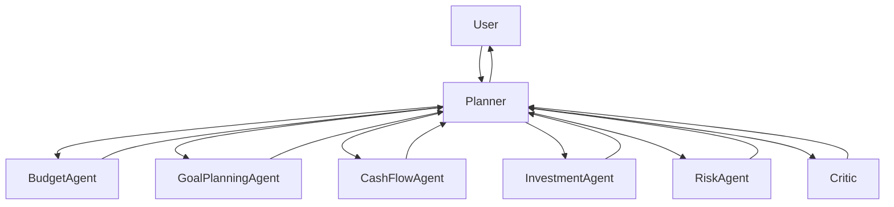
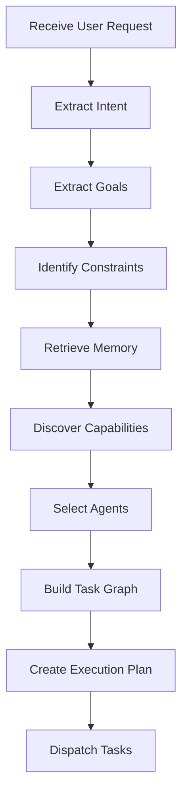
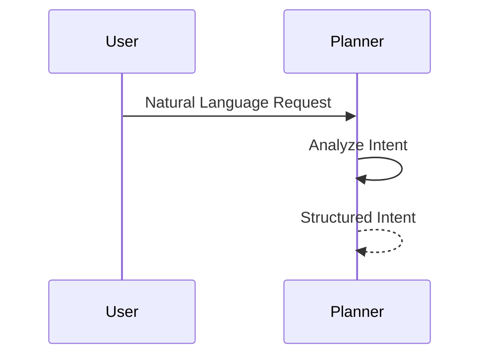
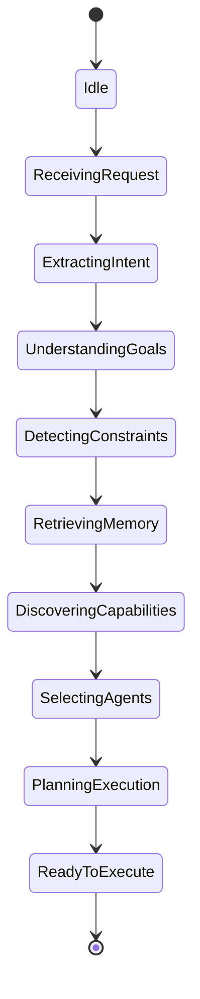
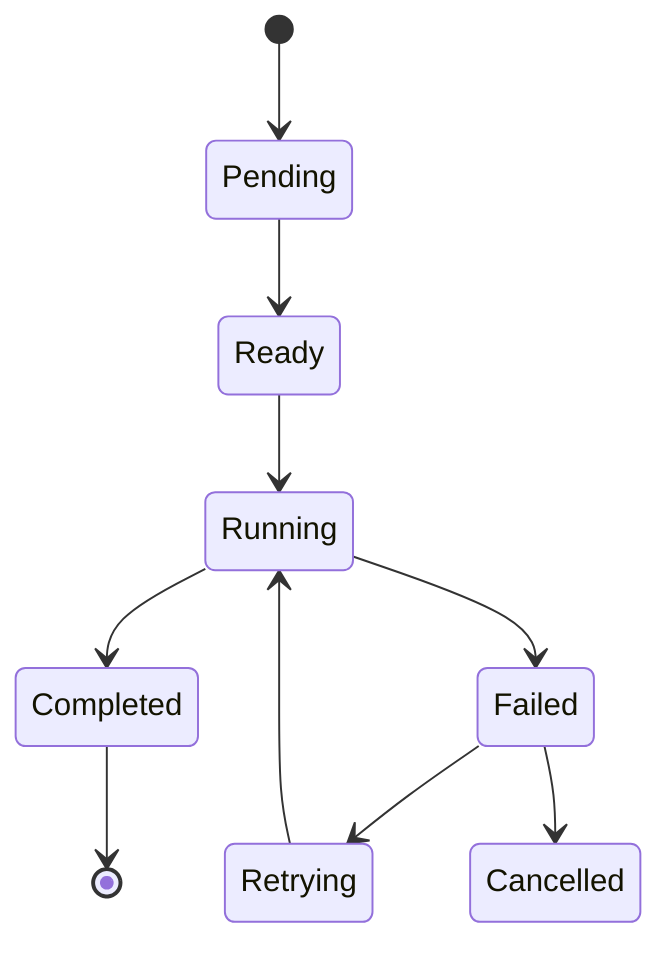
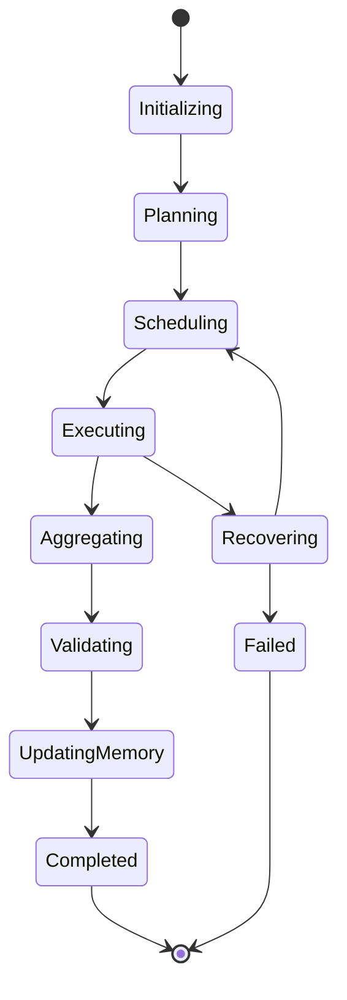

# Planner Architecture

> **Version:** 1.0.0  
> **Status:** Architecture Specification (Authoritative)  
> **Document Type:** Planner Architecture  
> **Primary Component:** `planner.py`  
> **Audience:** Contributors, AI Coding Assistants, Google ADK Evaluators, Kaggle Judges  
> **Last Updated:** July 2026

---

# Purpose

The Planner is the architectural heart of WalletMind.

This document defines the complete engineering specification for the Planner subsystem and serves as the authoritative implementation blueprint for `planner.py`.

Unlike implementation documentation, this specification focuses on architectural responsibilities, execution behavior, state transitions, orchestration strategies, and design rationale rather than source code.

The Planner exists to transform an ambiguous financial objective into an executable reasoning strategy by coordinating specialized AI agents, contextual memory, deterministic tools, validation, and explainability.

Every execution path described in WalletMind begins with the Planner.

If implementation and this document disagree, **this document takes precedence until revised through an Architecture Decision Record (ADR).**

---

# Relationship to the System Architecture

The Planner architecture builds directly upon the architectural principles established in `overview.md`.

```
overview.md
      │
      ▼
planner.md
      │
      ├── agents.md
      ├── memory.md
      ├── tools.md
      ├── mcp.md
      └── runtime.md
```

The Planner does not replace those documents.

Instead, it defines **how those architectural components collaborate during execution**.

---

# Purpose of the Planner

Financial planning is fundamentally a reasoning problem.

Unlike traditional software systems that execute predefined workflows, WalletMind must determine **how a problem should be solved before solving it**.

For example, the request:

> "Can I afford to retire five years earlier while helping pay for my children's education?"

cannot be answered by a single calculation.

The request requires the system to:

- identify multiple goals
- detect planning constraints
- retrieve long-term context
- discover required capabilities
- coordinate several specialized reasoning agents
- combine their findings
- validate conclusions
- generate an explainable recommendation

The Planner exists to perform this orchestration.

It acts as the architectural brain of WalletMind.

---

# Why a Planner Exists

Without a Planner, every user request would require manually selecting agents or embedding all reasoning into a single language model invocation.

Both approaches create significant architectural limitations.

---

## Traditional Execution

```mermaid
flowchart LR

User

-->

Large Language Model

-->

Response
```

Advantages:

- Simple implementation
- Minimal orchestration

Limitations:

- No explicit planning
- Poor explainability
- No task decomposition
- Limited modularity
- Difficult validation
- Difficult extension
- Weak collaboration

---

## Planner-Driven Execution



The Planner separates orchestration from expertise.

Each specialized component focuses exclusively on its own responsibility.

---

# Why Planner-Based Execution Is Superior

The Planner architecture provides several advantages over directly invoking AI agents.

| Planner-Driven Execution | Direct Agent Invocation   |
| ------------------------ | ------------------------- |
| Dynamic task planning    | Fixed workflows           |
| Explicit orchestration   | Implicit coordination     |
| Capability discovery     | Hardcoded agent selection |
| Explainable execution    | Limited reasoning trace   |
| Parallel scheduling      | Manual sequencing         |
| Dependency management    | Ad hoc coordination       |
| Independent validation   | Validation often omitted  |
| Easy extensibility       | Increasing coupling       |
| Reusable capabilities    | Duplicated logic          |

This separation dramatically improves maintainability, explainability, and educational value.

---

# Planner Philosophy

The Planner follows one fundamental architectural principle:

> **The Planner owns orchestration.  
> Agents own expertise.**

The Planner determines:

- what should happen
- when it should happen
- which agents participate
- what information they require
- how their outputs should be combined

The Planner never performs financial reasoning itself.

This distinction is central to WalletMind's architecture.

---

# Architectural Position

The Planner occupies the highest decision-making layer in the runtime architecture.

Every request enters through the Planner.

Every recommendation leaves through the Planner.

No subsystem may bypass Planner coordination unless explicitly documented.

---

## Planner Context Diagram

```mermaid
flowchart TD

User

-->

Planner

Planner

--> Memory

Planner

--> Capability Registry

Planner

--> Agent Ecosystem

Planner

--> Tool Layer

Planner

--> Critic

Critic

--> Planner

Planner

--> Response

Response

--> User
```

The Planner coordinates execution while preserving the independence of every other subsystem.

---

# Planner Objectives

The Planner is designed to satisfy six primary objectives.

| Objective      | Description                                       |
| -------------- | ------------------------------------------------- |
| Orchestration  | Coordinate execution without performing reasoning |
| Adaptability   | Generate execution plans dynamically              |
| Explainability | Produce traceable execution decisions             |
| Efficiency     | Execute only required capabilities                |
| Robustness     | Recover gracefully from failures                  |
| Extensibility  | Support future capabilities without redesign      |

These objectives govern every future enhancement to the Planner.

---

# Core Responsibilities

The Planner owns orchestration across the entire WalletMind architecture.

Its primary responsibilities include:

| Responsibility             | Description                                         |
| -------------------------- | --------------------------------------------------- |
| Intent Recognition         | Determine user intent                               |
| Goal Extraction            | Convert natural language into structured objectives |
| Constraint Detection       | Identify planning limitations                       |
| Memory Coordination        | Retrieve relevant context                           |
| Capability Discovery       | Determine required reasoning capabilities           |
| Agent Selection            | Map capabilities to specialized agents              |
| Task Decomposition         | Divide work into executable tasks                   |
| Dependency Analysis        | Determine prerequisite relationships                |
| Task Graph Generation      | Build executable task graph                         |
| Scheduling                 | Determine execution order                           |
| Parallel Coordination      | Execute independent tasks concurrently              |
| Aggregation                | Merge agent outputs                                 |
| Validation Coordination    | Invoke the Critic                                   |
| Confidence Synthesis       | Produce overall execution confidence                |
| Memory Update Coordination | Persist validated knowledge                         |
| Response Coordination      | Assemble explainable recommendations                |

The Planner is responsible for **coordination**, not computation.

---

# Non-Responsibilities

The Planner intentionally avoids domain-specific responsibilities.

The following capabilities belong to other architectural components.

| Capability             | Owner                       |
| ---------------------- | --------------------------- |
| Budget Optimization    | Budget Agent                |
| Investment Reasoning   | Investment Agent            |
| Cash Flow Forecasting  | Cash Flow Agent             |
| Risk Analysis          | Risk Assessment Agent       |
| Recommendation Writing | Insights Agent              |
| Long-Term Storage      | Memory Subsystem            |
| External APIs          | Tool Layer                  |
| Infrastructure         | MCP & Infrastructure Layers |

Maintaining these boundaries prevents architectural coupling.

---

# Planner Design Principles

Every future enhancement to the Planner should satisfy the following principles.

## Planner First

Every request begins with Planner orchestration.

No component should independently initiate execution.

---

## Capabilities Before Agents

The Planner reasons about capabilities first.

Agents are implementation details that fulfill those capabilities.

---

## Dynamic Planning

Execution plans are generated at runtime.

Hardcoded workflows should be avoided whenever possible.

---

## Stateless Coordination

Persistent information belongs to the Memory subsystem.

The Planner maintains only temporary execution state.

---

## Structured Communication

Every interaction between the Planner and other components uses documented, deterministic contracts.

Natural language is reserved for user-facing communication.

---

## Explainability by Default

Every Planner decision should be observable and explainable.

The Planner should always be able to answer:

- Why was this capability selected?
- Why was an agent skipped?
- Why were tasks executed in parallel?
- Why was a recommendation rejected?
- Why is confidence high or low?

---

## Validation Before Delivery

No significant recommendation should reach the user without Critic review.

Validation is considered part of execution rather than an optional post-processing step.

---

# Planner Success Criteria

The Planner is considered successful when it consistently demonstrates the following characteristics.

| Characteristic               | Description                                          |
| ---------------------------- | ---------------------------------------------------- |
| Correct Capability Selection | Only required capabilities are executed              |
| Efficient Scheduling         | Independent tasks execute concurrently               |
| Explainable Decisions        | Every planning decision is traceable                 |
| Robust Recovery              | Failures are handled gracefully                      |
| Modular Coordination         | Components remain loosely coupled                    |
| Reproducible Execution       | Equivalent inputs produce comparable plans           |
| Educational Transparency     | Planner behavior is easy to demonstrate in notebooks |

These characteristics define the Planner's role within WalletMind and establish the foundation for the detailed execution model described in subsequent sections.

---

# Part 1 Summary

This section establishes the Planner as the architectural brain of WalletMind.

The Planner is responsible for transforming user intent into an executable reasoning strategy while preserving clear ownership boundaries between orchestration, reasoning, memory, deterministic execution, and validation.

The following section introduces the Planner lifecycle, including intent extraction, goal understanding, constraint detection, capability discovery, and the state transitions that drive every execution.

---

# Part II — Planner Lifecycle & Planning Pipeline

The Planner transforms an unstructured user request into an executable reasoning strategy through a sequence of deterministic planning stages.

Rather than directly invoking AI agents, the Planner first understands the problem, retrieves relevant context, discovers the required capabilities, constructs an execution graph, and only then begins execution.

This separation ensures that execution is:

- goal-oriented
- explainable
- reproducible
- modular
- dynamically generated

Every user request follows the same conceptual planning lifecycle.

Only the generated execution plan changes.

---

# Planner Lifecycle Overview

The Planner lifecycle consists of eight architectural stages.

```mermaid
flowchart LR

Request

-->

Intent Extraction

-->

Goal Understanding

-->

Constraint Detection

-->

Memory Retrieval

-->

Capability Discovery

-->

Task Planning

-->

Execution Plan
```

Each stage has a single architectural responsibility.

---

# Planner Lifecycle



Every stage produces structured outputs that become inputs to the next stage.

The Planner never skips stages unless explicitly documented.

---

# Lifecycle Philosophy

The Planner should answer a series of increasingly specific questions.

| Stage                | Question                                  |
| -------------------- | ----------------------------------------- |
| Intent Extraction    | What does the user want?                  |
| Goal Understanding   | What objectives must be achieved?         |
| Constraint Detection | What limitations affect planning?         |
| Memory Retrieval     | What previous knowledge is relevant?      |
| Capability Discovery | What reasoning capabilities are required? |
| Agent Selection      | Which agents provide those capabilities?  |
| Task Planning        | How should work be decomposed?            |
| Execution Planning   | What is the optimal execution order?      |

This progressive refinement is fundamental to WalletMind.

---

# Stage 1 — Request Reception

Execution begins when the Planner receives a user request.

Example:

> "Can I retire five years earlier while paying for my daughter's education?"

The Planner does not immediately invoke agents.

Instead, it initializes a planning context.

---

## Planner Initialization

A new planning session is created.

Typical runtime metadata includes:

- Request ID
- Session ID
- Timestamp
- User ID
- Working Memory
- Planner State
- Empty Task Graph
- Empty Execution Plan

This state exists only during execution.

---

# Stage 2 — Intent Extraction

Intent extraction determines the primary purpose of the request.

The Planner is interested in **what kind of reasoning** is required rather than extracting detailed financial information.

---

## Intent Categories

| Intent       | Example                     |
| ------------ | --------------------------- |
| Planning     | "Help me retire early."     |
| Analysis     | "Where is my money going?"  |
| Comparison   | "Rent or buy?"              |
| Optimization | "Reduce monthly expenses."  |
| Forecast     | "Can I afford a house?"     |
| Simulation   | "What if I lose my income?" |
| Education    | "Explain index funds."      |

Intent determines the planning strategy.

---

## Multiple Intents

A request may contain multiple simultaneous intents.

Example:

> "Can I buy a house and continue investing?"

Detected intents:

- Planning
- Investment
- Trade-off Analysis

The Planner should preserve every detected intent throughout execution.

---

# Intent Extraction Sequence



The Planner converts conversational language into structured planning information.

---

# Stage 3 — Goal Understanding

Intent describes _why_ the user is interacting.

Goals describe _what must be accomplished_.

Example:

User Request

> I want to retire five years earlier.

Extracted Goal

```text
Goal:
Retire Early

Priority:
High

Planning Horizon:
Long-Term
```

Goals become the foundation of capability discovery.

---

# Goal Hierarchy

Goals frequently contain sub-goals.

```mermaid
flowchart TD

Primary Goal

-->

Retire Early

Retire Early

-->

Increase Savings

Retire Early

-->

Investment Growth

Retire Early

-->

Reduce Expenses
```

The Planner should preserve hierarchical relationships.

---

# Multiple Goals

WalletMind supports multiple simultaneous objectives.

Example:

| Goal                    | Priority |
| ----------------------- | -------- |
| Purchase Home           | High     |
| Maintain Emergency Fund | High     |
| Continue Investing      | Medium   |

The Planner must avoid discarding competing goals.

Instead, later stages evaluate trade-offs.

---

# Stage 4 — Constraint Detection

Goals define desired outcomes.

Constraints define planning boundaries.

The Planner identifies constraints before selecting capabilities.

---

## Constraint Categories

| Category    | Examples                     |
| ----------- | ---------------------------- |
| Financial   | Budget, income, debt         |
| Temporal    | Five-year target             |
| Behavioural | Conservative investor        |
| Personal    | Family obligations           |
| Geographic  | Country-specific regulations |

Constraints influence:

- capability selection
- execution order
- recommendations
- validation

---

## Example

User:

> Buy a home in five years while keeping six months of emergency savings.

Goals:

- Home purchase
- Emergency fund

Constraints:

- Five-year horizon
- Emergency fund preserved

These become planning inputs.

---

# Stage 5 — Memory Retrieval

Once goals and constraints are understood, the Planner retrieves only the information necessary for planning.

Relevant memory may include:

- financial goals
- spending preferences
- investment profile
- previous recommendations
- accepted advice
- user corrections

Memory retrieval should remain selective.

---

## Memory Retrieval Flow

```mermaid
flowchart LR

Planner

-->

Memory Query

-->

Memory

-->

Relevant Context

-->

Planner
```

Retrieving unnecessary information increases reasoning complexity.

---

# Stage 6 — Capability Discovery

The Planner reasons about **capabilities**, not implementations.

Example:

Goal

> Buy a Home

Required capabilities:

- Goal Planning
- Budget Analysis
- Cash Flow Forecast
- Risk Assessment

The Planner does not yet select specific agents.

Capabilities remain implementation independent.

---

## Capability Discovery Pipeline

```mermaid
flowchart LR

Goals

-->

Constraints

-->

Memory

-->

Capability Discovery

-->

Capability List
```

The resulting capability list becomes the input to agent selection.

---

# Capability Discovery Example

| Goal              | Capability          |
| ----------------- | ------------------- |
| Reduce Expenses   | Budget Analysis     |
| Retire Early      | Investment Planning |
| Home Purchase     | Cash Flow Forecast  |
| Income Loss       | Scenario Simulation |
| Education Funding | Goal Planning       |

Capabilities remain reusable across many different planning scenarios.

---

# Stage 7 — Agent Selection

Only after capability discovery does the Planner determine which agents participate.

Example:

| Capability          | Selected Agent   |
| ------------------- | ---------------- |
| Budget Analysis     | Budget Agent     |
| Forecasting         | Cash Flow Agent  |
| Investment Planning | Investment Agent |
| Risk Assessment     | Risk Agent       |

Agent selection remains dynamic.

No execution path should be hardcoded.

---

# Stage 8 — Planning Context

At the conclusion of the planning phase the Planner possesses:

- structured intent
- extracted goals
- planning constraints
- retrieved memory
- capability list
- selected agents

This information becomes the input to task decomposition in the next architectural phase.

---

# Planner State Machine

The Planner progresses through well-defined runtime states.



Each state has one responsibility.

State transitions are deterministic.

---

# Planner State Definitions

| State                   | Description                   |
| ----------------------- | ----------------------------- |
| Idle                    | Awaiting request              |
| ReceivingRequest        | Create planning context       |
| ExtractingIntent        | Determine request purpose     |
| UnderstandingGoals      | Build structured objectives   |
| DetectingConstraints    | Identify planning limitations |
| RetrievingMemory        | Request contextual knowledge  |
| DiscoveringCapabilities | Identify required reasoning   |
| SelectingAgents         | Resolve capability ownership  |
| PlanningExecution       | Build execution strategy      |
| ReadyToExecute          | Planning complete             |

The Planner should never execute reasoning while still in a planning state.

---

# Outputs of the Planning Phase

Successful planning produces a structured planning package.

Typical outputs include:

- Request Metadata
- Intent
- Goals
- Constraints
- Retrieved Context
- Required Capabilities
- Selected Agents
- Planning Confidence
- Planning Trace

These outputs become the input to task decomposition and execution planning.

---

# Planning Design Principles

Every planning cycle should satisfy the following principles.

| Principle                  | Description                          |
| -------------------------- | ------------------------------------ |
| Intent Before Goals        | Understand why before deciding what  |
| Goals Before Capabilities  | Objectives determine reasoning       |
| Capabilities Before Agents | Preserve implementation independence |
| Context Before Execution   | Retrieve memory first                |
| Deterministic Planning     | Produce structured outputs           |
| Explainable Decisions      | Every selection should be traceable  |
| Dynamic Execution          | Plans generated at runtime           |

---

# Part II Summary

The Planner lifecycle transforms an ambiguous user request into a structured planning package ready for execution.

At the end of this phase, the Planner has not yet performed financial reasoning.

Instead, it has determined:

- what the user wants,
- which goals must be achieved,
- what constraints exist,
- which context is relevant,
- what capabilities are required, and
- which agents will participate.

The following section builds upon this planning package by describing task decomposition, dependency graph construction, execution scheduling, and dynamic runtime planning.

---

# Part III — Task Planning & Execution Strategy

Once the Planner has completed intent extraction, goal understanding, constraint detection, context retrieval, and capability discovery, it enters the execution planning phase.

This phase converts planning information into an executable strategy that can be safely coordinated across multiple specialized AI agents.

The Planner does **not** immediately invoke agents.

Instead, it determines:

- what work must be performed
- how that work should be decomposed
- which tasks depend on one another
- which tasks may execute concurrently
- what execution strategy minimizes unnecessary work
- how results should later be aggregated and validated

Execution planning is the Planner's primary responsibility.

---

# Planning Pipeline

```mermaid
flowchart LR

Planning Context

-->

Task Decomposition

-->

Task Graph Construction

-->

Dependency Analysis

-->

Scheduling

-->

Execution Plan

-->

Agent Dispatch
```

Each stage transforms the previous stage into a progressively more executable representation.

---

# Task Decomposition

Financial planning problems are rarely solved by a single reasoning step.

Instead, the Planner decomposes complex objectives into smaller, independent reasoning tasks.

For example:

User Request:

> "Can I retire five years earlier while paying for my children's education?"

Rather than assigning the entire request to one agent, the Planner produces multiple reasoning tasks.

Example:

| Task                      | Owner Capability |
| ------------------------- | ---------------- |
| Evaluate retirement goal  | Goal Planning    |
| Forecast future cash flow | Cash Flow        |
| Evaluate investments      | Investment       |
| Assess financial risk     | Risk             |
| Generate recommendations  | Insights         |

Each task represents one reasoning responsibility.

---

# Decomposition Principles

Task decomposition follows several architectural principles.

## Single Responsibility

Each task should represent one reasoning objective.

Avoid tasks that combine unrelated responsibilities.

---

## Capability Ownership

Each task maps to one architectural capability.

A task should never require multiple capability owners.

---

## Independence

Tasks should remain independent whenever possible.

Independent tasks allow parallel execution.

---

## Explainability

Every task should have a clear purpose that can later be explained to the user.

---

# Example Task Decomposition

```text
User Goal

Retire Five Years Earlier

↓

Goal Planning

↓

Cash Flow Forecast

↓

Investment Analysis

↓

Risk Assessment

↓

Recommendation
```

This decomposition creates reusable reasoning components.

---

# Task Model

Every task created by the Planner should include structured metadata.

Typical attributes include:

| Field            | Purpose                 |
| ---------------- | ----------------------- |
| Task ID          | Unique identifier       |
| Capability       | Required reasoning      |
| Assigned Agent   | Responsible component   |
| Priority         | Scheduling importance   |
| Dependencies     | Required upstream tasks |
| Inputs           | Required data           |
| Expected Outputs | Structured result       |
| Status           | Runtime state           |

Tasks remain implementation-independent until execution begins.

---

# Task Graph Construction

After decomposition, the Planner constructs a directed task graph.

The task graph represents logical dependencies rather than execution order.

```mermaid
flowchart TD

Goal

-->

Goal Planning

Goal

-->

Cash Flow

Goal

-->

Investment

Goal Planning

-->

Recommendation

Cash Flow

-->

Recommendation

Investment

-->

Recommendation
```

Each node represents a reasoning task.

Each edge represents a dependency.

---

# Why a Task Graph?

A task graph provides several advantages.

| Benefit             | Explanation                              |
| ------------------- | ---------------------------------------- |
| Parallel execution  | Independent tasks execute simultaneously |
| Dependency tracking | Execution order becomes explicit         |
| Retry isolation     | Failed tasks can be retried individually |
| Explainability      | Every reasoning step is visible          |
| Extensibility       | New capabilities become new nodes        |

Task graphs replace rigid procedural workflows.

---

# Dependency Analysis

Not every reasoning task is independent.

Some tasks require information produced by earlier tasks.

Example:

```mermaid
flowchart TD

Cash Flow

-->

Investment Strategy

-->

Risk Assessment

-->

Recommendation
```

The Planner performs dependency analysis before scheduling execution.

---

# Dependency Categories

WalletMind recognizes three dependency types.

| Type        | Description               |
| ----------- | ------------------------- |
| Independent | No upstream requirements  |
| Sequential  | Requires previous output  |
| Aggregated  | Depends on multiple tasks |

Understanding dependency type enables optimal scheduling.

---

# Scheduling Strategy

The Planner transforms the dependency graph into an executable schedule.

Scheduling answers one question:

> **When should each task execute?**

Scheduling decisions consider:

- dependencies
- priority
- capability availability
- execution efficiency
- explainability

---

# Parallel Execution

Whenever two tasks are independent, the Planner should execute them concurrently.

Example:

```mermaid
flowchart TD

Planner

-->

Budget Analysis

Planner

-->

Investment Analysis

Planner

-->

Cash Flow Forecast

Budget Analysis

-->

Aggregation

Investment Analysis

-->

Aggregation

Cash Flow Forecast

-->

Aggregation
```

Parallel execution reduces overall runtime while preserving modularity.

---

# Sequential Execution

Some tasks require outputs generated by earlier tasks.

Example:

```mermaid
flowchart TD

Goal Planning

-->

Cash Flow Forecast

-->

Risk Assessment

-->

Insights
```

The Planner delays execution until prerequisites have completed.

---

# Mixed Execution

Most realistic financial requests contain both parallel and sequential work.

Example:

```mermaid
flowchart TD

Goal

-->

Budget Analysis

Goal

-->

Cash Flow Forecast

Budget Analysis

-->

Investment Analysis

Cash Flow Forecast

-->

Investment Analysis

Investment Analysis

-->

Risk Assessment

Risk Assessment

-->

Insights
```

This produces a partially parallel execution graph.

---

# Dynamic Execution Planning

WalletMind never relies on predefined workflows.

Instead, every execution plan is generated dynamically.

Example:

User Request:

> "Reduce grocery spending."

Execution:

```text
Planner

↓

Budget Agent

↓

Insights

↓

Critic
```

User Request:

> "Can I retire early?"

Execution:

```text
Planner

↓

Goal Planning

↓

Cash Flow

↓

Investment

↓

Risk

↓

Insights

↓

Critic
```

The Planner adapts execution according to context.

---

# Scheduling Decision Matrix

The Planner evaluates each task before scheduling.

| Question                       | Action               |
| ------------------------------ | -------------------- |
| Are dependencies satisfied?    | Execute              |
| Are dependencies missing?      | Wait                 |
| Can tasks execute together?    | Parallel             |
| Is output required downstream? | Preserve result      |
| Did execution fail?            | Retry policy         |
| Is capability unavailable?     | Graceful degradation |

This decision process is repeated until all executable tasks complete.

---

# Planner Execution Queue

The Planner maintains an execution queue throughout runtime.

Conceptually, the queue contains:

- Pending Tasks
- Running Tasks
- Completed Tasks
- Failed Tasks
- Waiting Tasks

Task state transitions occur as dependencies are resolved.

---

# Task State Lifecycle



This lifecycle applies to every task in the execution graph.

---

# Planner Pseudocode

The following pseudocode describes the conceptual execution strategy.

```text
receive planning_context

tasks = decompose(planning_context)

graph = build_dependency_graph(tasks)

schedule = create_execution_schedule(graph)

while schedule contains executable tasks:

    runnable = find_ready_tasks()

    execute runnable tasks

    update task states

    resolve dependencies

return execution_plan
```

This pseudocode describes architectural behavior rather than implementation details.

---

# Example Execution

User Request:

> "Can I afford to buy a house in five years?"

Planner output:

```
Planning Context
        │
        ▼
Goal Planning
        │
        ├────────────┐
        ▼            ▼
Cash Flow      Budget Analysis
        │            │
        └──────┬─────┘
               ▼
        Risk Assessment
               ▼
        Insights
               ▼
           Critic
```

This execution graph is generated dynamically rather than predefined.

---

# Execution Design Principles

Every execution plan should satisfy the following principles.

| Principle        | Description                               |
| ---------------- | ----------------------------------------- |
| Dynamic          | Generated at runtime                      |
| Minimal          | Execute only required tasks               |
| Explainable      | Every task has a purpose                  |
| Parallel         | Independent work executes concurrently    |
| Dependency-Aware | Respect prerequisite relationships        |
| Modular          | Tasks remain capability-focused           |
| Recoverable      | Failed tasks can be retried independently |

---

# Part III Summary

The execution planning phase transforms a structured planning context into an executable reasoning strategy.

By decomposing complex financial objectives into capability-owned tasks, constructing explicit dependency graphs, and dynamically scheduling execution, the Planner enables WalletMind to perform modular, explainable, and efficient multi-agent reasoning.

Unlike traditional workflow engines, the Planner generates execution plans dynamically for every request, allowing identical architectural components to solve many different financial planning problems without hardcoded execution paths.

The following section introduces the Planner Runtime, including execution state management, Planner events, runtime context, event lifecycle, and state transitions throughout execution.

---

# Part IV — Planner Runtime Architecture

The previous sections described how the Planner understands a request and generates an execution strategy.

This section defines **how the Planner behaves while executing that strategy**.

The runtime architecture governs:

- execution state
- event processing
- task coordination
- runtime context
- working memory
- execution monitoring
- runtime transitions

Unlike planning, which produces an execution plan, the runtime is responsible for executing that plan safely, efficiently, and transparently.

---

# Runtime Philosophy

WalletMind treats execution as a managed orchestration process rather than a sequence of function calls.

The Planner continuously observes execution, reacts to runtime events, updates execution state, and decides what should happen next.

The runtime therefore behaves like a state machine rather than a procedural workflow.

---

# Runtime Overview

```mermaid
flowchart TD

Planning

-->

Execution Context

-->

Task Scheduler

-->

Running Tasks

-->

Planner Events

-->

Execution State

-->

Planner Decisions

-->

Next Tasks

-->

Completed Execution
```

The Planner remains active throughout execution.

It never "hands off" execution entirely to agents.

---

# Runtime Responsibilities

During execution, the Planner owns:

| Responsibility          | Description               |
| ----------------------- | ------------------------- |
| Runtime initialization  | Create execution context  |
| Execution scheduling    | Dispatch tasks            |
| Dependency monitoring   | Track task completion     |
| Event processing        | Respond to runtime events |
| State transitions       | Maintain execution state  |
| Retry coordination      | Recover failed tasks      |
| Result aggregation      | Merge completed outputs   |
| Validation coordination | Invoke Critic             |
| Runtime cleanup         | Release temporary state   |

---

# Execution Context

Every request creates an isolated execution context.

The execution context contains all temporary information required during runtime.

Typical contents include:

- Request ID
- Session ID
- Planner State
- Working Memory
- Task Graph
- Execution Queue
- Completed Results
- Failed Tasks
- Runtime Metadata

Execution context is temporary.

It should never become persistent memory.

---

# Runtime Context Diagram

```mermaid
flowchart TD

Execution Context

--> Planner State

Execution Context

--> Working Memory

Execution Context

--> Task Queue

Execution Context

--> Event Queue

Execution Context

--> Completed Results

Execution Context

--> Runtime Metadata
```

Each request receives an independent runtime context.

---

# Working Memory

Working Memory stores temporary execution information.

Unlike the Memory subsystem, Working Memory exists only during runtime.

Examples include:

- active tasks
- intermediate outputs
- dependency status
- runtime variables
- execution timestamps
- planner decisions

Working Memory is destroyed after execution completes.

---

# Runtime State

The Planner progresses through several runtime states.

These states describe the Planner itself rather than individual tasks.



The Planner occupies exactly one runtime state at any given time.

---

# Runtime State Definitions

| State          | Description                 |
| -------------- | --------------------------- |
| Initializing   | Create execution context    |
| Planning       | Build execution strategy    |
| Scheduling     | Prepare runnable tasks      |
| Executing      | Dispatch tasks              |
| Aggregating    | Merge outputs               |
| Validating     | Critic review               |
| UpdatingMemory | Persist validated knowledge |
| Recovering     | Resolve runtime failures    |
| Completed      | Successful execution        |
| Failed         | Unable to recover           |

---

# Planner Events

The runtime is event-driven.

Every significant change in execution generates an event.

Events trigger Planner decisions.

Examples include:

- Request received
- Memory retrieved
- Task ready
- Task started
- Task completed
- Task failed
- Dependency resolved
- Retry requested
- Validation passed
- Validation failed
- Execution completed

The Planner reacts to these events continuously.

---

# Planner Event Flow

```mermaid
flowchart LR

Runtime Event

-->

Planner

-->

Decision

-->

State Update

-->

Next Action
```

Events drive execution forward.

---

# Runtime Event Categories

| Category   | Examples           |
| ---------- | ------------------ |
| Request    | New request        |
| Planning   | Intent extracted   |
| Memory     | Context retrieved  |
| Scheduling | Task ready         |
| Execution  | Task started       |
| Completion | Task completed     |
| Failure    | Task failed        |
| Validation | Critic completed   |
| Runtime    | Execution finished |

These categories simplify runtime monitoring.

---

# Event Processing Lifecycle

```mermaid
sequenceDiagram

participant Runtime

participant Planner

participant Scheduler

Runtime->>Planner: Event

Planner->>Planner: Update State

Planner->>Scheduler: Determine Next Tasks

Scheduler-->>Planner: Runnable Tasks

Planner->>Runtime: Dispatch
```

Every event produces a deterministic Planner decision.

---

# Task Scheduling Runtime

The Planner continuously evaluates runnable tasks.

A task becomes runnable when:

- dependencies are satisfied
- required capability exists
- execution slot is available
- no blocking failure exists

Otherwise the task remains pending.

---

# Runtime Scheduling Example

```mermaid
flowchart TD

Pending Tasks

-->

Dependency Check

-->

Runnable

Runnable

-->

Execution Queue

Execution Queue

-->

Agent Execution
```

Tasks are promoted dynamically throughout execution.

---

# Execution Queue

The Planner maintains an execution queue.

Conceptually the queue contains:

- pending tasks
- ready tasks
- running tasks
- completed tasks
- failed tasks

The queue changes continuously during execution.

---

# Runtime Queue Example

```
Pending
───────────────
Risk Assessment

Ready
───────────────
Investment Analysis

Running
───────────────
Cash Flow Forecast

Completed
───────────────
Goal Planning

Failed
───────────────
None
```

The Planner updates this queue whenever runtime events occur.

---

# Runtime Coordination

The Planner never waits for the entire workflow to complete before making decisions.

Instead it continually performs the following loop:

```text
Observe Runtime

↓

Process Events

↓

Update State

↓

Resolve Dependencies

↓

Schedule Tasks

↓

Dispatch Execution

↓

Observe Runtime
```

This loop continues until every task reaches a terminal state.

---

# Runtime Observability

The Planner records structured execution information throughout runtime.

Typical observations include:

- planner state
- active tasks
- dependency resolution
- execution order
- runtime duration
- agent participation
- retry count
- validation outcome

These observations support:

- debugging
- notebook visualization
- explainability
- evaluation

---

# Runtime Trace Example

```
Planner Initialized

↓

Intent Extracted

↓

Goals Identified

↓

Memory Retrieved

↓

Capabilities Discovered

↓

Agents Selected

↓

Task Graph Generated

↓

Budget Agent Completed

↓

Cash Flow Agent Completed

↓

Investment Agent Completed

↓

Aggregation Completed

↓

Critic Approved

↓

Memory Updated

↓

Execution Complete
```

This trace provides a complete explanation of Planner behavior.

---

# Runtime Design Principles

Every execution should satisfy the following principles.

| Principle                  | Description                        |
| -------------------------- | ---------------------------------- |
| Event Driven               | Runtime reacts to events           |
| Observable                 | Execution is fully traceable       |
| Deterministic              | State transitions are explicit     |
| Recoverable                | Runtime supports graceful recovery |
| Isolated                   | Every request has its own context  |
| Stateless Between Requests | Runtime state never persists       |
| Explainable                | Every transition is visible        |

---

# Runtime Success Criteria

A successful runtime should demonstrate:

- correct state transitions
- efficient scheduling
- proper dependency handling
- accurate event processing
- clean execution traces
- deterministic runtime behavior
- transparent execution history

---

# Part IV Summary

The Planner Runtime transforms an execution plan into a managed orchestration process.

Rather than executing a fixed sequence of function calls, the Planner continuously observes runtime events, updates execution state, resolves dependencies, schedules work, and coordinates specialized agents until execution reaches a validated conclusion.

This event-driven runtime model enables WalletMind to remain dynamic, explainable, and resilient while preserving the clear architectural boundaries established throughout the system.

The following section specifies failure handling, retry strategies, validation integration, memory integration, confidence synthesis, and execution recovery, completing the behavioral specification for `planner.py`.

---

# Part V — Resilience, Validation & Confidence Management

Planning complex financial reasoning inevitably involves uncertainty.

External services may become unavailable, AI agents may produce incomplete results, retrieved context may be insufficient, and conflicting recommendations may emerge.

Rather than treating these situations as exceptional failures, WalletMind treats them as expected runtime conditions.

The Planner is therefore responsible for maintaining execution quality through:

- runtime validation
- graceful recovery
- retry coordination
- confidence estimation
- memory synchronization
- transparent degradation

These responsibilities ensure the system remains explainable, deterministic, and trustworthy even when execution does not proceed perfectly.

---

# Design Philosophy

The Planner follows three resilience principles.

> **Recover whenever possible.**

> **Fail gracefully when recovery is impossible.**

> **Always explain what happened.**

Users should never receive silent failures.

Instead, every limitation should be represented explicitly in the execution trace and final explanation.

---

# Runtime Failure Model

Failures may occur throughout execution.

The Planner classifies failures before deciding how to respond.

```mermaid
flowchart TD

Failure

-->

Planner

Planner

-->

Classify Failure

Classify Failure

-->

Recoverable

Classify Failure

-->

Non-Recoverable

Recoverable

-->

Retry Strategy

Non-Recoverable

-->

Graceful Degradation
```

Not every failure requires execution to stop.

---

# Failure Categories

WalletMind distinguishes between several categories of runtime failures.

| Category           | Example                       | Typical Response              |
| ------------------ | ----------------------------- | ----------------------------- |
| Agent Failure      | Agent produces invalid output | Retry or substitute           |
| Tool Failure       | Calculator unavailable        | Retry tool                    |
| MCP Failure        | External service offline      | Alternative capability        |
| Validation Failure | Conflicting recommendations   | Planner refinement            |
| Memory Failure     | Missing context               | Continue with limited context |
| Dependency Failure | Required task failed          | Cancel downstream tasks       |
| Runtime Failure    | Unexpected exception          | Graceful termination          |

The Planner determines recovery strategy according to failure type.

---

# Retry Strategy

Retries are coordinated exclusively by the Planner.

Agents never retry themselves.

This preserves centralized orchestration.

---

## Retry Decision Flow

```mermaid
flowchart TD

Task Failed

-->

Planner

Planner

-->

Retry Allowed?

Retry Allowed?

-- Yes -->

Retry Task

Retry Allowed?

-- No -->

Alternative Strategy
```

Retries should always be observable.

---

# Retry Principles

The Planner should only retry when:

- failure is temporary
- dependencies remain valid
- retry budget remains available
- execution can still produce meaningful results

Retries should **not** occur indefinitely.

---

# Retry Decision Matrix

| Failure                | Retry? | Reason                     |
| ---------------------- | ------ | -------------------------- |
| Network timeout        | Yes    | Likely temporary           |
| Tool unavailable       | Yes    | External dependency        |
| Invalid parameters     | No     | Planner issue              |
| Validation failure     | No     | Requires replanning        |
| Unsupported capability | No     | Architectural limitation   |
| Temporary MCP outage   | Yes    | Recoverable infrastructure |

---

# Failure Recovery

If retry is unsuccessful, the Planner attempts recovery.

Possible recovery strategies include:

- alternate capability
- alternate tool
- partial execution
- skip non-critical task
- reduced recommendation
- transparent limitation

The objective is to preserve user value whenever possible.

---

# Recovery Workflow

```mermaid
flowchart LR

Failure

-->

Retry

Retry

-->

Success

Retry

-->

Failure

Failure

-->

Recovery Strategy

Recovery Strategy

-->

Continue Execution
```

Recovery is considered part of normal execution.

---

# Graceful Degradation

Not every request can be fully completed.

Rather than terminating execution, the Planner may produce a reduced recommendation.

Example:

Requested capabilities:

- Budget Analysis
- Cash Flow Forecast
- Investment Analysis

If the Investment capability is unavailable:

```
Budget Analysis ✓

Cash Flow ✓

Investment ✗

↓

Partial Recommendation
```

The Planner explicitly communicates missing reasoning.

---

# Dependency Recovery

Dependency failures require special handling.

```mermaid
flowchart TD

Task Failed

-->

Dependent Tasks

-->

Can Continue?

Can Continue?

-- Yes -->

Continue

Can Continue?

-- No -->

Cancel
```

Only dependent tasks should be affected.

Independent branches continue executing.

---

# Validation Integration

Validation is not a post-processing step.

It is an architectural phase coordinated by the Planner.

Every significant recommendation should be reviewed before delivery.

---

# Validation Workflow

```mermaid
flowchart LR

Agent Outputs

-->

Aggregation

-->

Critic

-->

Planner

-->

Response
```

The Critic performs an independent assessment of reasoning quality.

---

# Validation Responsibilities

The Critic evaluates:

- logical consistency
- unsupported assumptions
- conflicting evidence
- missing reasoning
- recommendation completeness
- confidence alignment

The Planner decides how to respond.

---

# Validation Outcomes

| Result           | Planner Action           |
| ---------------- | ------------------------ |
| Pass             | Continue                 |
| Minor Issue      | Refine explanation       |
| Missing Evidence | Re-execute selected task |
| Contradiction    | Re-plan execution        |
| Critical Failure | Transparent limitation   |

Validation improves trustworthiness while preserving explainability.

---

# Memory Integration

The Planner is responsible for coordinating interactions with the Memory subsystem.

Memory is accessed during three execution phases.

```mermaid
flowchart LR

Retrieve

-->

Execute

-->

Persist
```

Each phase serves a different purpose.

---

## Retrieval

Before execution:

- retrieve goals
- retrieve preferences
- retrieve financial profile
- retrieve historical recommendations

---

## Runtime Context

During execution:

- temporary context remains in Working Memory

Persistent memory is never modified.

---

## Persistence

After successful validation:

- update goals
- store accepted recommendations
- record corrected preferences
- save execution metadata

Only validated knowledge becomes long-term memory.

---

# Memory Update Policy

The Planner should never persist:

- temporary calculations
- failed reasoning
- invalid assumptions
- intermediate outputs
- rejected recommendations

Only stable knowledge should become persistent.

---

# Confidence Scoring

Every execution produces an overall confidence estimate.

Confidence is synthesized by the Planner.

Individual agents contribute confidence for their own reasoning.

The Planner combines these values into a unified execution confidence.

---

# Confidence Contributors

Typical confidence factors include:

| Factor               | Influence |
| -------------------- | --------- |
| Memory completeness  | High      |
| Agent agreement      | High      |
| Validation success   | High      |
| Tool reliability     | Medium    |
| Missing capabilities | Negative  |
| Retry count          | Negative  |
| Partial execution    | Negative  |

Confidence should reflect execution quality rather than model certainty alone.

---

# Confidence Levels

WalletMind communicates confidence using qualitative categories.

| Confidence | Meaning                                     |
| ---------- | ------------------------------------------- |
| Very High  | Strong evidence across all reasoning        |
| High       | Minor uncertainty                           |
| Moderate   | Some assumptions required                   |
| Low        | Significant missing information             |
| Very Low   | Recommendation should be treated cautiously |

These categories are easier for users to interpret than raw probabilities.

---

# Confidence Flow

```mermaid
flowchart LR

Agent Confidence

-->

Planner

Planner

-->

Validation

Validation

-->

Final Confidence
```

Validation may increase or decrease confidence.

---

# Execution Example

Example request:

> "Can I retire five years earlier?"

Execution:

```
Planner

↓

Goal Planning ✓

↓

Cash Flow ✓

↓

Investment ✓

↓

Risk Assessment ✗

↓

Retry

↓

Recovery

↓

Partial Recommendation

↓

Critic

↓

Confidence: Moderate
```

The user receives both the recommendation and a transparent explanation of the missing capability.

---

# Failure Example

Example:

```
Planner

↓

Cash Flow Agent

↓

Timeout

↓

Retry

↓

Timeout

↓

Fallback Forecast Tool

↓

Continue Execution
```

Execution continues without restarting the entire workflow.

---

# Planner Decision Matrix

| Situation            | Planner Decision                 |
| -------------------- | -------------------------------- |
| Missing dependency   | Wait                             |
| Temporary failure    | Retry                            |
| Permanent failure    | Alternate capability             |
| Validation issue     | Re-plan                          |
| Missing memory       | Continue with reduced confidence |
| Conflicting outputs  | Invoke Critic                    |
| Successful execution | Persist validated knowledge      |

---

# Design Principles

Every recovery strategy should satisfy the following principles.

| Principle                   | Description                                     |
| --------------------------- | ----------------------------------------------- |
| Planner Owns Recovery       | Agents never retry independently                |
| Recover Before Failing      | Attempt recovery whenever practical             |
| Isolated Failure            | One task should not terminate all execution     |
| Transparent Degradation     | Missing capabilities remain visible             |
| Validation Required         | Recovery does not bypass Critic                 |
| Memory Integrity            | Failed reasoning never becomes persistent       |
| Confidence Reflects Reality | Confidence decreases when uncertainty increases |

---

# Part V Summary

The resilience architecture transforms the Planner from a simple orchestrator into a robust execution manager.

By coordinating retries, recovery strategies, validation, memory synchronization, and confidence synthesis, the Planner maintains execution quality while remaining transparent about uncertainty and system limitations.

This approach ensures that WalletMind prioritizes trustworthy recommendations over perfect execution, aligning with the goals of explainable AI, Google's Agent Development Kit, and the educational objectives of the Kaggle AI Agents Capstone Project.

The following section defines the Planner's formal contracts, event schemas, JSON structures, planning outputs, and pseudocode, providing the final implementation blueprint for `planner.py`.

---

# Part VI — Planner Contracts & Data Specifications

The Planner coordinates execution through structured contracts rather than unstructured conversational exchanges.

Every stage of the planning lifecycle consumes well-defined inputs and produces deterministic outputs.

This approach provides several architectural benefits:

- predictable execution
- implementation independence
- easier testing
- explainability
- compatibility with Google ADK
- easier AI-assisted implementation

The Planner should never rely on undocumented data structures.

---

# Contract Philosophy

WalletMind distinguishes between three architectural concepts:

| Concept  | Purpose                                             |
| -------- | --------------------------------------------------- |
| Event    | Something happened                                  |
| State    | Current runtime condition                           |
| Contract | Structured information exchanged between components |

This separation keeps execution deterministic while making runtime behavior observable.

---

# Planner Input Contract

Every planning session begins with a structured request.

Conceptually, the Planner receives:

```json
{
  "request_id": "...",
  "session_id": "...",
  "timestamp": "...",
  "user_input": "...",
  "conversation_context": {},
  "metadata": {}
}
```

### Field Descriptions

| Field                | Purpose                      |
| -------------------- | ---------------------------- |
| request_id           | Unique request identifier    |
| session_id           | Conversation identifier      |
| timestamp            | Request creation time        |
| user_input           | Natural language request     |
| conversation_context | Active conversation metadata |
| metadata             | Runtime metadata             |

The Planner is responsible for enriching this structure during execution.

---

# Intent Contract

Intent extraction produces structured intent information.

Example:

```json
{
  "primary_intent": "financial_planning",
  "secondary_intents": ["investment", "risk_analysis"],
  "confidence": 0.94
}
```

### Responsibilities

Intent represents:

- why the user is interacting
- required planning strategy
- reasoning category

Intent should never contain execution decisions.

---

# Goal Contract

Goals represent structured planning objectives.

Example:

```json
{
  "goals": [
    {
      "id": "goal_001",
      "name": "Retire Early",
      "priority": "high",
      "planning_horizon": "long_term"
    }
  ]
}
```

Goals remain independent of agent implementations.

---

# Constraint Contract

Constraints describe planning boundaries.

Example:

```json
{
  "constraints": [
    {
      "type": "financial",
      "description": "Maintain emergency fund"
    },
    {
      "type": "time",
      "description": "Five year horizon"
    }
  ]
}
```

Constraints influence planning decisions but never perform reasoning.

---

# Capability Contract

Capability discovery produces implementation-independent requirements.

```json
{
  "capabilities": [
    "goal_planning",
    "cash_flow_forecasting",
    "investment_analysis",
    "risk_assessment"
  ]
}
```

Capabilities are resolved into agents later.

---

# Agent Assignment Contract

Once capabilities are resolved, the Planner assigns execution ownership.

```json
{
  "assignments": [
    {
      "capability": "cash_flow_forecasting",
      "agent": "CashFlowAgent"
    },
    {
      "capability": "investment_analysis",
      "agent": "InvestmentAgent"
    }
  ]
}
```

This contract separates planning from execution.

---

# Task Contract

Each execution task is represented by a structured object.

```json
{
  "task_id": "task_001",
  "capability": "investment_analysis",
  "assigned_agent": "InvestmentAgent",
  "priority": "high",
  "status": "pending",
  "dependencies": []
}
```

### Required Fields

| Field          | Description         |
| -------------- | ------------------- |
| task_id        | Unique identifier   |
| capability     | Required capability |
| assigned_agent | Responsible agent   |
| priority       | Scheduling priority |
| status         | Runtime state       |
| dependencies   | Upstream tasks      |

---

# Dependency Graph Contract

The Planner represents task relationships explicitly.

Conceptually:

```json
{
  "nodes": ["goal_planning", "cash_flow", "investment", "risk"],
  "edges": [
    {
      "from": "cash_flow",
      "to": "investment"
    },
    {
      "from": "investment",
      "to": "risk"
    }
  ]
}
```

This representation is independent of execution technology.

---

# Execution Plan Contract

The Planner ultimately produces an execution plan.

Example:

```json
{
  "execution_id": "...",
  "tasks": [],
  "parallel_groups": [],
  "execution_order": [],
  "validation_required": true
}
```

### Responsibilities

The execution plan defines:

- runnable tasks
- dependency ordering
- execution strategy
- validation requirements

---

# Planner Event Contract

Every runtime event follows a common structure.

```json
{
  "event_id": "...",
  "timestamp": "...",
  "event_type": "...",
  "source": "...",
  "payload": {}
}
```

This enables consistent runtime monitoring.

---

# Event Types

Examples include:

| Event                | Description             |
| -------------------- | ----------------------- |
| RequestReceived      | Planner initialized     |
| IntentExtracted      | Intent identified       |
| GoalsExtracted       | Goals created           |
| MemoryRetrieved      | Context available       |
| CapabilityDiscovered | Capabilities identified |
| TaskCreated          | Task generated          |
| TaskStarted          | Agent execution began   |
| TaskCompleted        | Successful execution    |
| TaskFailed           | Runtime failure         |
| ValidationCompleted  | Critic finished         |
| ExecutionFinished    | Planner completed       |

---

# Planner State Contract

Planner runtime state should be represented explicitly.

Example:

```json
{
  "planner_state": "Executing",
  "active_tasks": 3,
  "completed_tasks": 5,
  "failed_tasks": 0,
  "pending_tasks": 2
}
```

The Planner should never rely on implicit runtime state.

---

# Runtime Context Contract

Every execution owns an isolated runtime context.

```json
{
  "request_id": "...",
  "planner_state": "...",
  "working_memory": {},
  "task_graph": {},
  "execution_queue": [],
  "runtime_metadata": {}
}
```

This context is temporary and discarded after execution.

---

# Agent Result Contract

Agents return structured outputs.

Conceptually:

```json
{
  "agent": "InvestmentAgent",
  "task_id": "task_004",
  "confidence": 0.88,
  "evidence": [],
  "recommendations": [],
  "metadata": {}
}
```

The Planner aggregates these outputs.

---

# Validation Contract

The Critic returns a structured validation result.

```json
{
  "status": "pass",
  "issues": [],
  "confidence_adjustment": "none",
  "notes": []
}
```

Possible statuses include:

- pass
- warning
- refinement_required
- failed

---

# Memory Update Contract

Validated knowledge is persisted through a structured contract.

```json
{
  "profile_updates": [],
  "goal_updates": [],
  "preference_updates": [],
  "recommendation_history": []
}
```

Only validated information should appear here.

---

# Confidence Contract

Planner confidence combines multiple signals.

```json
{
  "overall_confidence": "high",
  "contributors": [
    {
      "source": "InvestmentAgent",
      "confidence": 0.91
    },
    {
      "source": "RiskAgent",
      "confidence": 0.84
    }
  ]
}
```

Confidence synthesis belongs exclusively to the Planner.

---

# Planner Output Contract

The Planner produces one final structured output before presentation.

```json
{
  "request_id": "...",
  "execution_summary": {},
  "recommendations": [],
  "reasoning_trace": [],
  "confidence": {},
  "validation": {},
  "memory_updates": {}
}
```

This becomes the input for the presentation layer.

---

# Contract Relationships

```mermaid
flowchart TD

PlannerInput

-->

Intent

-->

Goals

-->

Constraints

-->

Capabilities

-->

Tasks

-->

ExecutionPlan

-->

AgentResults

-->

Validation

-->

PlannerOutput
```

Each contract has exactly one producer and one primary consumer.

---

# Ownership Matrix

| Contract          | Producer           | Consumer           |
| ----------------- | ------------------ | ------------------ |
| Planner Input     | Presentation Layer | Planner            |
| Intent            | Planner            | Planner            |
| Goals             | Planner            | Planner            |
| Constraints       | Planner            | Planner            |
| Capabilities      | Planner            | Planner            |
| Task Graph        | Planner            | Scheduler          |
| Execution Plan    | Planner            | Runtime            |
| Agent Result      | Agents             | Planner            |
| Validation Result | Critic             | Planner            |
| Memory Update     | Planner            | Memory             |
| Planner Output    | Planner            | Presentation Layer |

---

# Design Principles

Every Planner contract should satisfy the following principles.

| Principle              | Description                                     |
| ---------------------- | ----------------------------------------------- |
| Structured             | Machine-readable                                |
| Explicit               | No hidden assumptions                           |
| Immutable              | Historical contracts remain unchanged           |
| Versionable            | Future evolution without breaking compatibility |
| Explainable            | Every field has a documented purpose            |
| Technology Independent | Not tied to implementation details              |

---

# Part VI Summary

The Planner contracts establish a formal communication model for WalletMind.

Rather than exchanging loosely structured information, every planning stage communicates through documented, versionable contracts that separate planning, execution, validation, memory, and presentation concerns.

These contracts provide the architectural foundation for implementing `planner.py` while remaining independent of programming language, runtime framework, or storage technology.

The following section presents the Planner's conceptual algorithms through pseudocode, execution walkthroughs, scheduling examples, and decision logic, completing the implementation blueprint.

---

# Part VII — Planner Algorithms & Execution Walkthroughs

The previous sections defined the Planner's responsibilities, runtime behavior, contracts, and execution model.

This section describes the Planner's behavior through implementation-independent pseudocode and execution examples.

The pseudocode intentionally describes **architectural logic**, not programming syntax.

It should be interpreted as a behavioral specification rather than executable code.

---

# Algorithm Philosophy

The Planner does not execute a predefined workflow.

Instead, it repeatedly performs four architectural activities:

1. Observe
2. Plan
3. Coordinate
4. Evaluate

This continuous decision loop allows WalletMind to dynamically adapt execution as runtime conditions change.

---

# Planner Algorithm Overview

```mermaid
flowchart TD

ReceiveRequest

-->

UnderstandProblem

-->

RetrieveContext

-->

DiscoverCapabilities

-->

BuildTaskGraph

-->

ScheduleExecution

-->

ExecuteTasks

-->

AggregateResults

-->

Validate

-->

PersistKnowledge

-->

GenerateResponse
```

Every successful execution follows this conceptual pipeline.

---

# High-Level Planner Algorithm

```text
Receive user request

Create execution context

Extract intent

Extract goals

Identify constraints

Retrieve relevant memory

Discover required capabilities

Resolve capabilities to agents

Generate task graph

Schedule execution

Execute tasks

Aggregate results

Validate reasoning

Persist validated knowledge

Generate explainable response

Terminate execution context
```

This algorithm represents the Planner's primary control flow.

---

# Intent Extraction Algorithm

Objective:

Convert natural language into structured planning intent.

Conceptual algorithm:

```text
Input:
    User request

Determine primary objective

Identify secondary objectives

Estimate confidence

Return structured intent
```

Example:

```
User

↓

"I want to retire early"

↓

Primary Intent

Financial Planning

↓

Secondary Intent

Investment Planning
```

---

# Goal Understanding Algorithm

Goals are extracted after intent has been identified.

```text
Input:
    Structured intent

Identify planning objectives

Determine priorities

Determine planning horizon

Identify competing goals

Return structured goals
```

Example:

```
Goal

Retire Early

Priority

High

Horizon

Long Term
```

---

# Constraint Detection Algorithm

Constraints define planning boundaries.

```text
Input:
    Goals

Identify financial constraints

Identify time constraints

Identify behavioural constraints

Identify personal constraints

Return structured constraints
```

Example constraints:

- Maintain emergency fund
- Five-year horizon
- Conservative investment profile

---

# Capability Discovery Algorithm

The Planner reasons about capabilities rather than implementations.

```text
Input:
    Goals
    Constraints
    Memory

Determine required capabilities

Remove duplicates

Prioritize capabilities

Return capability list
```

Example:

```
Goal

Buy Home

↓

Capabilities

Budget Analysis

Cash Flow

Risk

Goal Planning
```

---

# Agent Resolution Algorithm

Capabilities are mapped to specialized agents.

```text
Input

Capability List

↓

Capability Registry

↓

Resolve Responsible Agent

↓

Return Agent Assignments
```

Example:

| Capability      | Agent            |
| --------------- | ---------------- |
| Budget Analysis | Budget Agent     |
| Investment      | Investment Agent |
| Risk            | Risk Agent       |

---

# Task Decomposition Algorithm

Complex requests become smaller reasoning tasks.

```text
Input:
    Goals
    Capabilities

Create reasoning task

Assign capability owner

Assign priority

Determine dependencies

Return task list
```

The Planner never creates implementation-specific tasks.

---

# Dependency Graph Algorithm

Tasks are organized into a dependency graph.

```text
Input

Task List

↓

Analyze Dependencies

↓

Create Graph Nodes

↓

Create Graph Edges

↓

Return Dependency Graph
```

Example:

```mermaid
flowchart TD

Goal

-->

Budget

Goal

-->

Cash Flow

Cash Flow

-->

Investment

Investment

-->

Risk

Risk

-->

Insights
```

---

# Scheduling Algorithm

The Scheduler continuously evaluates task readiness.

Conceptual algorithm:

```text
while executable tasks exist

identify runnable tasks

execute independent tasks

wait for dependencies

update execution graph

repeat
```

Scheduling remains dynamic throughout execution.

---

# Parallel Scheduling Example

```mermaid
flowchart TD

Planner

-->

Budget

Planner

-->

Cash Flow

Planner

-->

Investment

Budget

-->

Aggregation

Cash Flow

-->

Aggregation

Investment

-->

Aggregation
```

The Planner maximizes safe concurrency.

---

# Sequential Scheduling Example

```mermaid
flowchart TD

Goal Planning

-->

Cash Flow

-->

Investment

-->

Risk

-->

Insights
```

Dependencies determine execution order.

---

# Runtime Coordination Algorithm

During execution the Planner continuously coordinates runtime.

Conceptually:

```text
Observe execution

Receive events

Update planner state

Resolve dependencies

Dispatch new tasks

Repeat until completion
```

The Planner remains active throughout runtime.

---

# Aggregation Algorithm

Agent outputs are merged into a unified reasoning package.

```text
Input

Agent Results

↓

Merge Evidence

↓

Remove Duplicates

↓

Identify Conflicts

↓

Generate Unified Recommendation
```

Aggregation never invents new reasoning.

---

# Validation Algorithm

Validation occurs after aggregation.

```text
Input

Recommendation

↓

Critic Review

↓

Pass

Warning

Failure

↓

Planner Decision
```

Possible Planner actions include:

- continue
- refine
- retry
- re-plan
- graceful degradation

---

# Retry Algorithm

```text
Task Failure

↓

Recoverable?

↓

Yes

Retry

↓

Success?

↓

Continue

↓

Failure

↓

Recovery Strategy
```

Retries remain under Planner control.

---

# Recovery Algorithm

Conceptually:

```text
Failure detected

Classify failure

Determine recovery strategy

Execute recovery

Update execution graph

Continue execution
```

Recovery is localized whenever possible.

---

# Confidence Synthesis Algorithm

The Planner produces one confidence estimate for the complete execution.

Conceptually:

```text
Collect agent confidence

Collect validation outcome

Evaluate missing information

Evaluate retries

Evaluate execution quality

Generate overall confidence
```

Confidence reflects execution quality rather than model certainty alone.

---

# Memory Synchronization Algorithm

Only validated information becomes persistent.

```text
Execution Complete

↓

Validation Passed

↓

Identify Persistent Knowledge

↓

Generate Memory Updates

↓

Persist
```

Temporary reasoning is discarded.

---

# End-to-End Walkthrough

Example request:

> "Can I retire five years earlier?"

Execution:

```
Receive Request

↓

Intent Extraction

↓

Goal Understanding

↓

Memory Retrieval

↓

Capability Discovery

↓

Agent Selection

↓

Task Graph

↓

Scheduling

↓

Goal Planning

↓

Cash Flow

↓

Investment

↓

Risk

↓

Aggregation

↓

Critic

↓

Confidence

↓

Memory Update

↓

Response
```

---

# Multi-Goal Walkthrough

Example:

> Buy a home while continuing retirement savings.

Planner:

```
Goals

├── Home Purchase

└── Retirement

↓

Capabilities

├── Budget

├── Cash Flow

├── Investment

└── Risk

↓

Parallel Analysis

↓

Aggregation

↓

Validation

↓

Recommendation
```

The Planner preserves both objectives.

---

# Failure Walkthrough

Scenario:

Cash Flow Agent unavailable.

Execution:

```
Cash Flow

↓

Failure

↓

Retry

↓

Failure

↓

Alternative Capability

↓

Continue Execution

↓

Reduced Confidence

↓

Transparent Recommendation
```

Execution continues whenever practical.

---

# Replanning Example

Scenario:

Validation identifies conflicting recommendations.

Execution:

```
Aggregation

↓

Critic

↓

Conflict Detected

↓

Planner

↓

Rebuild Task Graph

↓

Execute Additional Analysis

↓

Updated Recommendation
```

The Planner may generate multiple execution plans during one request.

---

# Decision Matrix

| Situation            | Planner Action       |
| -------------------- | -------------------- |
| New goal discovered  | Update task graph    |
| Missing dependency   | Delay task           |
| Independent tasks    | Parallel execution   |
| Failed task          | Retry evaluation     |
| Conflicting evidence | Invoke Critic        |
| Validation warning   | Refine reasoning     |
| Missing capability   | Graceful degradation |
| Successful execution | Persist knowledge    |

---

# Execution Guarantees

The Planner should guarantee:

- every task has one owner
- dependencies are respected
- execution is observable
- retries are controlled
- validation occurs before response
- confidence reflects execution quality
- memory updates occur only after validation

These guarantees define the expected behavior of `planner.py`.

---

# Reference Planning Workflow

```mermaid
sequenceDiagram

participant User
participant Planner
participant Memory
participant Agents
participant Critic

User->>Planner: Financial Goal

Planner->>Memory: Retrieve Context

Memory-->>Planner: Relevant Memory

Planner->>Planner: Generate Task Graph

Planner->>Agents: Execute Tasks

Agents-->>Planner: Structured Results

Planner->>Critic: Validate

Critic-->>Planner: Validation Result

Planner->>Memory: Persist Updates

Planner-->>User: Explainable Recommendation
```

This sequence represents the canonical execution model for WalletMind.

---

# Part VII Summary

This section defines the Planner's conceptual algorithms and execution behavior.

By describing planning, scheduling, coordination, aggregation, validation, recovery, and confidence synthesis through architecture-focused pseudocode, the document provides a complete behavioral blueprint for implementing `planner.py` while remaining independent of programming language or runtime framework.

The final section maps the Planner architecture to Google's Agent Development Kit, Kaggle judging criteria, future extensibility, and long-term architectural evolution.

---

# Part VIII — Architectural Alignment, Competition Mapping & Future Evolution

The previous sections defined **how the Planner works**.

This final section explains **why the Planner is designed this way**, how it aligns with Google's Agent Development Kit (ADK), how it satisfies the Kaggle AI Agents Capstone judging criteria, and how the architecture can evolve while preserving its core design principles.

This section should guide all future architectural decisions regarding `planner.py`.

---

# Design Philosophy

WalletMind treats the Planner as the **architectural brain** of the system.

Unlike traditional applications where a controller simply invokes business logic, the Planner continuously:

- understands user intent
- identifies goals
- retrieves context
- selects capabilities
- coordinates reasoning
- validates outputs
- synthesizes confidence
- explains recommendations

The Planner therefore represents an intelligent orchestration layer rather than a routing component.

---

# Why Planner-Driven Execution?

Financial planning is rarely a single-step problem.

A request like:

> "Can I retire five years earlier while paying for my children's education and buying a larger home?"

requires reasoning across multiple financial domains simultaneously.

A single LLM prompt cannot reliably provide:

- structured decomposition
- dependency management
- reusable reasoning
- validation
- execution traceability

The Planner solves these problems by separating orchestration from expertise.

---

# Planner vs Traditional Orchestration

| Traditional Workflow   | Planner-Driven Workflow           |
| ---------------------- | --------------------------------- |
| Fixed execution path   | Dynamic execution graph           |
| Hardcoded routing      | Capability discovery              |
| Static ordering        | Dependency analysis               |
| Limited explainability | Full reasoning trace              |
| Sequential execution   | Parallel execution where possible |
| Minimal recovery       | Structured recovery strategies    |
| Limited reuse          | Capability-based composition      |
| Difficult extension    | Plug-in architecture              |

The Planner transforms WalletMind from a conversational assistant into a reasoning system.

---

# Architectural Benefits

The Planner architecture provides several long-term advantages.

## Separation of Concerns

Responsibilities remain isolated.

| Responsibility       | Owner            |
| -------------------- | ---------------- |
| Planning             | Planner          |
| Financial Reasoning  | Agents           |
| Memory               | Memory Subsystem |
| External Execution   | Tool Layer       |
| External Integration | MCP              |
| Validation           | Critic           |
| Presentation         | Notebook / UI    |

No architectural layer duplicates another's responsibility.

---

## Explainability

Because every decision passes through the Planner, WalletMind can explain:

- why an agent was selected
- why a capability was required
- why tasks executed in parallel
- why a retry occurred
- why confidence changed
- why recommendations were accepted or rejected

This traceability is essential for financial decision support.

---

## Modularity

Planner-centered orchestration allows new capabilities to be introduced without redesigning the architecture.

Examples include:

- Tax Planning Agent
- Insurance Agent
- Estate Planning Agent
- ESG Portfolio Agent
- Small Business Finance Agent

The Planner simply discovers new capabilities and integrates them into future execution plans.

---

# Google ADK Alignment

WalletMind is intentionally designed around Google's Agent Development Kit architecture.

Rather than treating ADK as a software library, WalletMind adopts ADK as its architectural philosophy.

---

## ADK Capability Mapping

| Google ADK Concept   | WalletMind Planner               |
| -------------------- | -------------------------------- |
| Planner              | Planner Layer                    |
| Agent Orchestration  | Planner Runtime                  |
| Specialized Agents   | Capability-Based Agent Ecosystem |
| Tool Invocation      | Tool Layer                       |
| Context Management   | Memory Integration               |
| Multi-Step Reasoning | Task Graph                       |
| Structured Execution | Execution Plan                   |
| Explainability       | Planner Trace                    |
| Validation           | Critic Integration               |

The Planner demonstrates nearly every major architectural concept promoted by ADK.

---

## ADK Best Practices

The Planner follows several important ADK design principles.

### Dynamic Planning

Execution plans are generated during runtime.

No financial workflow is hardcoded.

---

### Capability Discovery

The Planner reasons about capabilities rather than implementations.

This keeps execution independent of specific agent implementations.

---

### Agent Specialization

Each agent owns exactly one reasoning domain.

The Planner coordinates collaboration.

---

### Structured Communication

Planner interactions use structured contracts rather than free-form messages.

---

### Explainable Execution

Every planning decision becomes part of the execution trace.

---

### Modular Composition

New agents integrate through capability discovery rather than Planner modification.

---

# Kaggle Competition Alignment

WalletMind is designed specifically for the **Google Kaggle AI Agents: Intensive Vibe Coding Capstone Project**.

The Planner directly supports multiple judging dimensions.

---

## Judging Criteria Mapping

| Competition Objective     | Planner Contribution                    |
| ------------------------- | --------------------------------------- |
| AI Agent Architecture     | Planner-driven orchestration            |
| Multi-Agent Collaboration | Capability-based coordination           |
| Reasoning Quality         | Dynamic planning and task decomposition |
| Explainability            | Execution traces and reasoning graphs   |
| Memory                    | Context-aware planning                  |
| Tool Usage                | Structured tool orchestration           |
| MCP Integration           | Capability routing through MCP          |
| Educational Value         | Observable planning process             |
| Notebook Storytelling     | Visual execution lifecycle              |
| Modularity                | Independent architectural components    |

The Planner is therefore one of the strongest demonstrations of agent engineering within WalletMind.

---

# Notebook Storytelling

The Planner is intentionally observable.

Each notebook should visualize:

1. User request
2. Intent extraction
3. Goals
4. Constraints
5. Retrieved memory
6. Capability discovery
7. Agent selection
8. Task graph
9. Execution progress
10. Validation
11. Confidence synthesis
12. Final recommendation

Rather than hiding orchestration, the notebook should expose it as part of the educational narrative.

---

# Future Evolution

The Planner is designed to evolve through extension rather than modification.

New functionality should integrate without changing existing planning behavior.

---

## Future Planning Capabilities

Potential future enhancements include:

- Hierarchical planning
- Multi-stage replanning
- Long-running workflows
- Goal negotiation
- Resource-aware scheduling
- Cost-aware planning
- Time-aware planning
- Planner self-reflection
- Learning-based plan optimization

These enhancements should build upon the existing architecture rather than replace it.

---

## Future Scheduling

Possible scheduling improvements include:

- Priority-based scheduling
- Deadline-aware execution
- Cost optimization
- Dynamic workload balancing
- Adaptive parallelism

The scheduling interface should remain stable even if scheduling algorithms evolve.

---

## Future Memory Integration

Potential enhancements include:

- Episodic memory weighting
- Semantic memory ranking
- Memory decay
- Preference evolution
- Long-term planning history

These improvements should not require changes to the Planner lifecycle.

---

## Future Agent Ecosystem

Future Planner versions should support:

- dynamically discovered agents
- multiple agents per capability
- agent ranking
- capability negotiation
- specialist selection
- fallback agents

The Planner should continue reasoning in terms of capabilities rather than concrete implementations.

---

## Future Explainability

Planner explainability may evolve to include:

- interactive execution graphs
- visual dependency trees
- confidence heatmaps
- planning timelines
- execution replay
- natural language planning summaries

These enhancements improve transparency without altering planning behavior.

---

# Architectural Constraints

To preserve the integrity of the Planner architecture, the following constraints should remain invariant.

| Constraint                             | Rationale                                |
| -------------------------------------- | ---------------------------------------- |
| Planner owns orchestration             | Prevent fragmented execution             |
| Agents remain specialized              | Preserve modular reasoning               |
| Memory remains external                | Avoid hidden state                       |
| Validation remains independent         | Improve trustworthiness                  |
| Tools remain deterministic             | Separate reasoning from execution        |
| MCP remains implementation-independent | Preserve extensibility                   |
| Contracts remain structured            | Simplify integration                     |
| Explainability remains mandatory       | Support user trust and educational value |

Any proposed enhancement that violates these constraints should be evaluated through an Architecture Decision Record (ADR).

---

# Planner Evolution Roadmap

The Planner is expected to mature incrementally.

| Phase   | Architectural Focus                 |
| ------- | ----------------------------------- |
| Phase 1 | Planner-driven orchestration        |
| Phase 2 | Dynamic capability discovery        |
| Phase 3 | Advanced scheduling                 |
| Phase 4 | Adaptive replanning                 |
| Phase 5 | Self-optimizing Planner             |
| Phase 6 | Multi-session planning              |
| Phase 7 | Collaborative planning across users |

Each phase extends the architecture without invalidating earlier design decisions.

---

# Relationship to Other Architecture Documents

This document specifies the Planner.

Other architecture documents expand specific subsystems.

| Document      | Relationship                      |
| ------------- | --------------------------------- |
| `overview.md` | Overall system architecture       |
| `agents.md`   | Agent implementation architecture |
| `memory.md`   | Memory subsystem                  |
| `tools.md`    | Tool subsystem                    |
| `mcp.md`      | MCP architecture                  |
| `runtime.md`  | Runtime execution model           |
| `notebook.md` | Notebook demonstrations           |
| `frontend.md` | Presentation layer                |

Together these documents form the complete WalletMind architecture specification.

---

# Final Architectural Summary

The Planner is the architectural brain of WalletMind.

Its responsibilities extend beyond orchestration to include planning, coordination, scheduling, recovery, validation, confidence synthesis, and explainability.

By separating orchestration from reasoning, WalletMind achieves:

- dynamic execution
- modular AI agents
- reusable capabilities
- transparent reasoning
- structured validation
- persistent contextual awareness
- educational notebook demonstrations
- straightforward AI-assisted implementation

This planner-centric architecture reflects the design philosophy of Google's Agent Development Kit while showcasing advanced agent engineering concepts suitable for the Kaggle AI Agents: Intensive Vibe Coding Capstone Project.

The Planner should remain the single authoritative coordinator for every execution within WalletMind, ensuring that future capabilities can be added through extension rather than architectural redesign.

---

## Revision Policy

This document is the authoritative engineering specification for `planner.py`.

Any architectural change affecting:

- planning lifecycle
- task decomposition
- scheduling
- runtime behavior
- event processing
- contracts
- validation
- memory integration
- confidence synthesis

should be reflected here before implementation.

**End of Planner Architecture**
