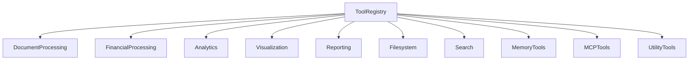
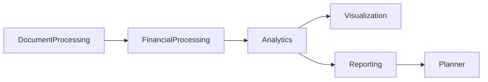
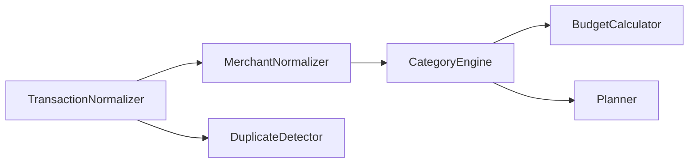
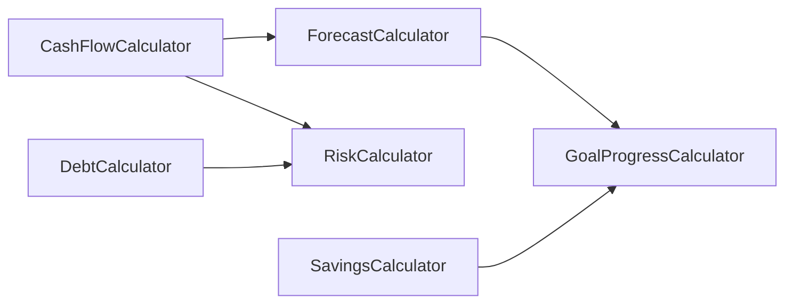
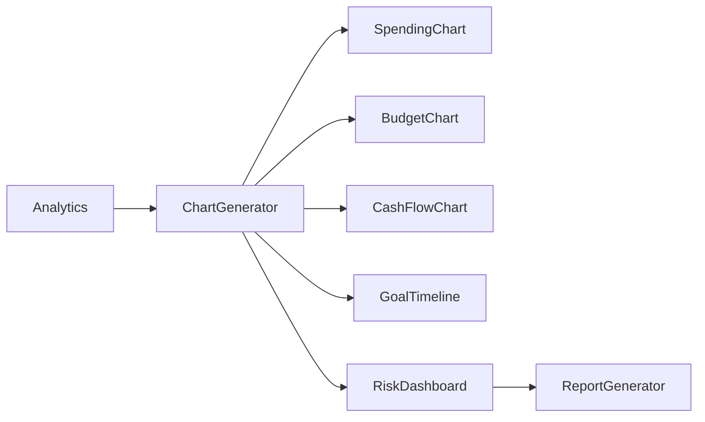
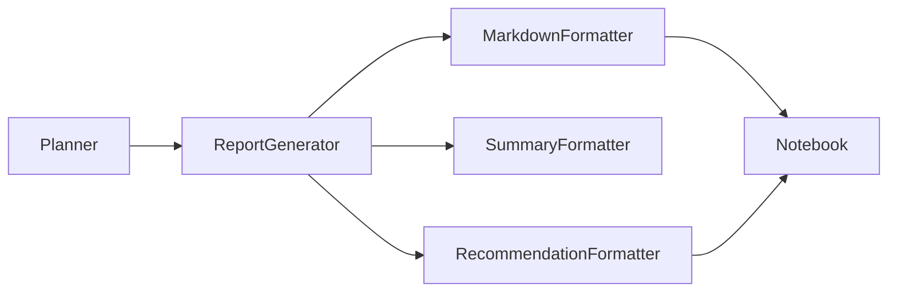
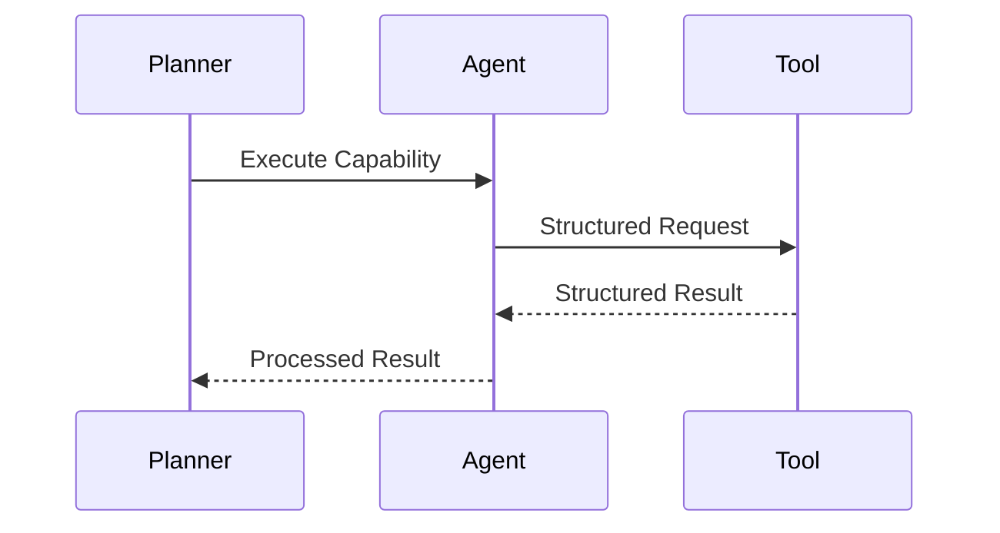

# Tool Registry Architecture

> **Version:** 1.0.0  
> **Status:** Architecture Specification (Authoritative)  
> **Document Type:** Tool Registry Architecture  
> **Primary Components:** `tools/*`  
> **Audience:** Contributors, AI Coding Assistants, Google ADK Evaluators, Kaggle Judges  
> **Last Updated:** July 2026

---

# Purpose

The Tool Registry defines every deterministic capability available to WalletMind.

Unlike AI agents, which specialize in reasoning, planning, and decision making, tools perform repeatable computational or integration tasks.

The Tool subsystem provides the execution layer that enables AI agents to interact with documents, perform calculations, generate visualizations, retrieve information, and communicate with external systems without embedding those capabilities inside prompts.

This document is the authoritative architectural specification for the WalletMind Tool Registry.

It defines:

- tool philosophy
- architectural responsibilities
- tool categories
- execution model
- ownership
- Planner interactions
- agent interactions
- security boundaries
- structured contracts
- future extensibility

Implementation details such as programming languages, libraries, APIs, or frameworks are intentionally excluded.

---

# Relationship to the System Architecture

The Tool Registry occupies the deterministic execution layer of WalletMind.

```
overview.md
      │
      ▼
planner.md
      │
      ▼
agents.md
      │
      ▼
tools.md
      │
      ▼
mcp.md
```

The Planner decides **when** tools are needed.

Agents decide **why** they are needed.

Tools determine **how** deterministic work is performed.

---

# Why WalletMind Uses Tools

Financial reasoning often depends on deterministic operations that should not be delegated to language models.

Examples include:

- parsing CSV files
- extracting PDF tables
- calculating cash flow
- generating charts
- normalizing transactions
- creating reports
- reading files
- retrieving structured information

These tasks require consistency rather than creativity.

Tools provide that consistency.

---

# Tools vs AI Agents

WalletMind intentionally separates reasoning from execution.

AI agents think.

Tools do.

This distinction is fundamental to the architecture.

| AI Agents                   | Tools                                           |
| --------------------------- | ----------------------------------------------- |
| Perform reasoning           | Perform deterministic operations                |
| Interpret financial context | Execute predefined capabilities                 |
| Generate recommendations    | Produce calculations and structured outputs     |
| Use LLM reasoning           | Use algorithms, libraries, or external services |
| Planner orchestrated        | Invoked by Planner through agents               |

---

# Why Tools Are Separate from Agents

Combining reasoning and execution inside one component creates several architectural problems.

Examples include:

- reduced modularity
- inconsistent outputs
- duplicated implementations
- difficult testing
- lower explainability

WalletMind instead separates responsibilities.

```
Reasoning

↓

Agent

↓

Tool Request

↓

Tool Execution

↓

Structured Result

↓

Agent Reasoning

↓

Planner
```

This separation makes each component easier to understand, test, and evolve independently.

---

# Tool Philosophy

WalletMind follows one guiding principle.

> **Agents reason. Tools execute.**

Every tool should perform one deterministic capability exceptionally well.

Tools should never make financial decisions.

They should never replace Planner reasoning.

---

# High-Level Responsibilities

The Tool subsystem owns the following responsibilities.

| Responsibility                     | Description                                  |
| ---------------------------------- | -------------------------------------------- |
| Parse structured documents         | Convert documents into machine-readable data |
| Execute deterministic calculations | Perform financial computations               |
| Normalize financial information    | Standardize transactions and values          |
| Generate visualizations            | Produce charts and graphs                    |
| Produce reports                    | Format structured outputs                    |
| Access external resources          | Filesystem, search, MCP                      |
| Support explainability             | Return structured, reproducible outputs      |

The Tool subsystem intentionally performs no financial reasoning.

---

# High-Level Architecture

```mermaid
flowchart TD

User

-->

Planner

Planner

-->

AI Agent

AI Agent

-->

Tool Registry

Tool Registry

-->

Tool

Tool

-->

Structured Output

Structured Output

-->

AI Agent

AI Agent

-->

Planner
```

The Planner never invokes tools directly.

Agents remain responsible for selecting the appropriate tool within the execution plan defined by the Planner.

---

# Architectural Position

The Tool subsystem occupies the deterministic execution layer.

```mermaid
flowchart TD

Presentation Layer

-->

Planner Layer

-->

Agent Layer

-->

Tool Layer

-->

MCP Layer
```

Reasoning and execution remain intentionally separated.

---

# Tool Design Principles

Every WalletMind tool should satisfy the following architectural principles.

## Single Responsibility

Each tool performs one deterministic capability.

Examples:

- CSV parsing
- chart generation
- transaction normalization

---

## Deterministic

Given identical inputs, a tool should produce identical outputs whenever possible.

---

## Stateless

Tools should not maintain long-term state.

Persistent knowledge belongs to the Memory subsystem.

---

## Explainable

Tool outputs should be structured and understandable.

Notebook demonstrations should be able to visualize tool execution.

---

## Reusable

Multiple agents should be able to invoke the same tool without modification.

---

## Planner-Compatible

Tools should integrate naturally into Planner-directed execution workflows.

---

## Implementation Independent

The architecture describes capabilities rather than specific libraries or APIs.

---

# Tool Lifecycle Overview

Every tool execution follows the same conceptual lifecycle.

```mermaid
flowchart LR

Planner Decision

-->

Agent

-->

Tool Invocation

-->

Execution

-->

Structured Result

-->

Agent

-->

Planner
```

The Planner remains responsible for overall orchestration.

---

# Tool Ownership

Ownership remains clearly defined.

| Component     | Responsibility                                      |
| ------------- | --------------------------------------------------- |
| Planner       | Determines when tools are required                  |
| AI Agent      | Chooses the appropriate tool for its reasoning task |
| Tool Registry | Provides deterministic capabilities                 |
| Tool          | Executes one capability                             |
| Memory        | Stores long-term knowledge (never tool state)       |

---

# Tool Categories Overview

WalletMind organizes tools into specialized categories.

| Category             | Purpose                                |
| -------------------- | -------------------------------------- |
| Document Processing  | Parse financial documents              |
| Financial Processing | Normalize and calculate financial data |
| Analytics            | Deterministic analysis                 |
| Visualization        | Generate charts and graphs             |
| Reporting            | Produce structured reports             |
| Filesystem           | Access local project resources         |
| Search               | Retrieve relevant information          |
| Memory               | Structured memory operations           |
| MCP                  | External capability integration        |
| Utility              | Common deterministic helpers           |

Each category will be defined in detail later in this document.

---

# Context Diagram

```mermaid
flowchart TD

User

-->

Planner

Planner

-->

Agent

Agent

-->

Tool Registry

Tool Registry

--> DocumentTools

Tool Registry

--> FinancialTools

Tool Registry

--> VisualizationTools

Tool Registry

--> ReportingTools

Tool Registry

--> SearchTools

Tool Registry

--> FilesystemTools

Tool Registry

--> MemoryTools

Tool Registry

--> MCPTools
```

The Tool Registry provides a unified abstraction over all deterministic capabilities.

---

# Why This Architecture Fits Google ADK

Google ADK encourages a clear separation between reasoning and deterministic execution.

WalletMind follows this principle by:

- assigning reasoning to specialized agents
- assigning execution to tools
- allowing the Planner to orchestrate both
- keeping tools modular and reusable
- exposing structured outputs for explainability

This separation simplifies implementation while making notebook demonstrations significantly easier to understand.

---

# Notebook Perspective

One of WalletMind's educational goals is to make deterministic execution observable.

Notebook demonstrations should visualize:

1. Planner decision
2. Agent selection
3. Tool invocation
4. Tool inputs
5. Tool outputs
6. Planner continuation

Readers should clearly see where reasoning ends and deterministic execution begins.

---

# Design Principles

Every future tool should preserve these architectural principles.

| Principle             | Description                              |
| --------------------- | ---------------------------------------- |
| Deterministic         | Same input produces consistent output    |
| Single Responsibility | One capability per tool                  |
| Stateless             | No persistent knowledge                  |
| Explainable           | Structured outputs                       |
| Planner Compatible    | Supports Planner orchestration           |
| Reusable              | Multiple agents can invoke the same tool |
| Extensible            | New tools integrate without redesign     |

---

# Part I Summary

This section establishes the architectural foundation of the WalletMind Tool Registry.

Rather than embedding deterministic operations inside AI prompts, WalletMind separates execution from reasoning by introducing a dedicated Tool subsystem. Specialized AI agents remain responsible for financial reasoning, while tools perform deterministic operations such as parsing documents, calculating financial metrics, generating visualizations, and interacting with external systems.

This separation improves modularity, explainability, reproducibility, and alignment with Google ADK's architecture principles.

The following section defines the complete Tool Registry, introducing every tool category, its responsibilities, ownership, lifecycle, and relationship to the Planner and specialized AI agents.

---

# Part II — Tool Registry & Capability Model

WalletMind organizes deterministic capabilities into a structured Tool Registry.

Rather than exposing a large collection of unrelated utilities, tools are grouped into capability domains based on the type of deterministic work they perform.

This organization improves:

- Planner orchestration
- agent specialization
- discoverability
- modularity
- extensibility
- explainability

Every tool belongs to exactly one primary capability category.

---

# Tool Registry Overview

The Tool Registry represents every deterministic capability available to WalletMind.



Each category contains tools with similar architectural responsibilities.

---

# Capability Categories

WalletMind defines ten primary tool categories.

| Category             | Responsibility                        |
| -------------------- | ------------------------------------- |
| Document Processing  | Parse financial documents             |
| Financial Processing | Normalize financial data              |
| Analytics            | Deterministic calculations            |
| Visualization        | Produce charts and graphs             |
| Reporting            | Generate structured reports           |
| Filesystem           | Read and manage project files         |
| Search               | Retrieve relevant information         |
| Memory               | Retrieve and update structured memory |
| MCP                  | External capability integration       |
| Utility              | Shared helper functionality           |

---

# Tool Discovery Philosophy

The Planner reasons about **capabilities**, not individual implementations.

For example:

```
User uploads PDF

↓

Planner

↓

Capability Needed

↓

Document Processing

↓

Statement Parser Agent

↓

PDF Parser Tool
```

This allows implementations to evolve without changing Planner logic.

---

# Document Processing Tools

Document Processing Tools convert raw financial documents into structured information.

Typical responsibilities include:

- parsing files
- extracting tables
- reading structured datasets
- normalizing formats

These tools perform extraction rather than financial reasoning.

---

## Planned Document Tools

| Tool                  | Purpose                                           |
| --------------------- | ------------------------------------------------- |
| CSV Parser            | Parse CSV transaction exports                     |
| Excel Parser          | Parse XLSX/XLS financial files                    |
| PDF Parser            | Extract structured data from PDF statements       |
| OCR Parser            | Read scanned financial documents                  |
| Transaction Extractor | Identify financial transactions                   |
| Table Extractor       | Convert tabular documents into structured records |

Primary users:

- Statement Parser Agent

---

# Financial Processing Tools

Financial Processing Tools normalize financial information before reasoning begins.

Typical responsibilities include:

- transaction normalization
- merchant normalization
- currency normalization
- financial aggregation

These tools improve consistency across financial data sources.

---

## Planned Financial Tools

| Tool                   | Purpose                         |
| ---------------------- | ------------------------------- |
| Transaction Normalizer | Standardize transactions        |
| Merchant Normalizer    | Normalize merchant names        |
| Category Engine        | Categorize spending             |
| Currency Converter     | Normalize monetary values       |
| Duplicate Detector     | Identify duplicate transactions |
| Budget Calculator      | Compute budget allocations      |

Primary users:

- Expense Intelligence Agent
- Budget Advisor Agent

---

# Analytics Tools

Analytics Tools perform deterministic financial calculations.

Unlike AI agents, they never interpret results.

They simply compute.

---

## Planned Analytics Tools

| Tool                     | Purpose                          |
| ------------------------ | -------------------------------- |
| Cash Flow Calculator     | Compute cash flow                |
| Forecast Calculator      | Generate deterministic forecasts |
| Savings Calculator       | Calculate savings projections    |
| Debt Calculator          | Debt metrics                     |
| Risk Calculator          | Financial ratios                 |
| Goal Progress Calculator | Measure goal completion          |

Primary users:

- Cash Flow Forecast Agent
- Risk Analysis Agent
- Goal Planning Agent

---

# Visualization Tools

Visualization Tools transform structured financial information into notebook-friendly graphics.

They support:

- explainability
- notebook storytelling
- financial reporting

Visualization tools never influence reasoning.

---

## Planned Visualization Tools

| Tool             | Purpose                 |
| ---------------- | ----------------------- |
| Chart Generator  | Generic chart creation  |
| Spending Charts  | Spending breakdown      |
| Budget Charts    | Budget allocation       |
| Cash Flow Charts | Forecast visualization  |
| Goal Timeline    | Milestone visualization |
| Risk Dashboard   | Financial risk overview |

Primary users:

- Report Generator Agent

---

# Reporting Tools

Reporting Tools generate structured financial documents.

Responsibilities include:

- markdown reports
- executive summaries
- notebook exports
- report formatting

These tools format information without changing its meaning.

---

## Planned Reporting Tools

| Tool                     | Purpose                     |
| ------------------------ | --------------------------- |
| Report Generator         | Financial report generation |
| Markdown Formatter       | Structured markdown output  |
| Summary Formatter        | Executive summaries         |
| Recommendation Formatter | Recommendation presentation |

Primary users:

- Report Generator Agent

---

# Filesystem Tools

Filesystem Tools provide controlled access to project resources.

Typical responsibilities include:

- reading uploaded files
- locating notebooks
- loading configuration
- accessing templates

Filesystem access remains deterministic and constrained.

---

## Planned Filesystem Tools

| Tool              | Purpose                        |
| ----------------- | ------------------------------ |
| File Reader       | Read project files             |
| Directory Browser | Locate resources               |
| Template Loader   | Retrieve report templates      |
| Notebook Loader   | Access demonstration notebooks |

Primary users:

- Statement Parser Agent
- Report Generator Agent

---

# Search Tools

Search Tools retrieve structured information required during execution.

Examples include:

- financial references
- project documentation
- indexed reports
- local search

Search tools support reasoning without performing reasoning themselves.

---

## Planned Search Tools

| Tool                       | Purpose                       |
| -------------------------- | ----------------------------- |
| Local Search               | Search repository content     |
| Financial Knowledge Search | Retrieve financial references |
| Report Search              | Locate previous reports       |
| Memory Search              | Search structured memory      |

Primary users:

- Planner
- Financial Coach Agent
- Report Generator Agent

---

# Memory Tools

Memory Tools provide deterministic interaction with the Memory subsystem.

Unlike the Memory Update Agent, these tools perform retrieval and persistence operations rather than reasoning.

---

## Planned Memory Tools

| Tool                  | Purpose                    |
| --------------------- | -------------------------- |
| Memory Retrieval Tool | Retrieve structured memory |
| Memory Update Tool    | Persist validated memory   |
| Memory Summary Tool   | Summarize memory context   |
| Embedding Lookup Tool | Semantic retrieval support |

Primary users:

- Planner
- Memory Update Agent

---

# MCP Tools

MCP Tools provide standardized access to external capabilities.

The Tool Registry treats MCP integrations as deterministic services.

Examples include:

- external financial APIs
- document services
- cloud storage
- external search
- visualization services

The Planner remains independent from external providers.

---

## Planned MCP Tools

| Tool          | Purpose                         |
| ------------- | ------------------------------- |
| MCP Client    | Generic MCP communication       |
| Financial MCP | External financial capabilities |
| Document MCP  | External document services      |
| Search MCP    | External retrieval              |
| Storage MCP   | External storage access         |

Primary users:

- Multiple agents

---

# Utility Tools

Utility Tools provide reusable deterministic helpers.

These tools support other tools rather than directly supporting financial reasoning.

---

## Planned Utility Tools

| Tool               | Purpose                     |
| ------------------ | --------------------------- |
| Date Utility       | Date normalization          |
| Currency Formatter | Monetary formatting         |
| JSON Validator     | Validate structured outputs |
| Schema Validator   | Validate contracts          |
| UUID Generator     | Generate identifiers        |
| Logging Helper     | Structured execution logs   |

Utility tools remain implementation-independent.

---

# Capability Relationships



Capabilities form logical processing pipelines while remaining independently reusable.

---

# Planner Interaction

The Planner never reasons about individual tool implementations.

Instead, it reasons about capabilities.

Example:

```
Goal:

Analyze Bank Statement

↓

Required Capabilities

• Document Processing

• Financial Processing

• Analytics

↓

Agent Selection

↓

Tool Invocation
```

This abstraction keeps Planner logic implementation-independent.

---

# Agent Interaction

Agents invoke tools only within their area of specialization.

| Agent                | Typical Tool Categories  |
| -------------------- | ------------------------ |
| Statement Parser     | Document Processing      |
| Expense Intelligence | Financial Processing     |
| Budget Advisor       | Analytics                |
| Goal Planning        | Analytics                |
| Cash Flow Forecast   | Analytics                |
| Risk Analysis        | Analytics                |
| Financial Coach      | Search                   |
| Report Generator     | Visualization, Reporting |
| Memory Update        | Memory                   |
| Validator            | Utility                  |

This preserves clear responsibility boundaries.

---

# Tool Capability Matrix

| Capability           | Deterministic | Used by Multiple Agents | Planner Visible |
| -------------------- | ------------- | ----------------------- | --------------- |
| Document Processing  | ✓             | ✓                       | ✓               |
| Financial Processing | ✓             | ✓                       | ✓               |
| Analytics            | ✓             | ✓                       | ✓               |
| Visualization        | ✓             | Limited                 | ✓               |
| Reporting            | ✓             | Limited                 | ✓               |
| Filesystem           | ✓             | ✓                       | ✓               |
| Search               | ✓             | ✓                       | ✓               |
| Memory               | ✓             | ✓                       | ✓               |
| MCP                  | ✓             | ✓                       | ✓               |
| Utility              | ✓             | ✓                       | Internal        |

---

# Design Principles

Every future tool category should satisfy these principles.

| Principle           | Description                    |
| ------------------- | ------------------------------ |
| Capability-Oriented | Organize by responsibility     |
| Deterministic       | No financial reasoning         |
| Modular             | Independent evolution          |
| Planner-Compatible  | Capability-based orchestration |
| Reusable            | Shared across agents           |
| Explainable         | Observable execution           |
| Extensible          | New tools integrate naturally  |

---

# Part II Summary

The WalletMind Tool Registry organizes deterministic capabilities into specialized domains such as document processing, financial processing, analytics, visualization, reporting, memory operations, search, filesystem access, MCP integrations, and shared utilities.

By exposing capabilities instead of implementation details, the Tool Registry enables the Planner to orchestrate complex workflows while allowing AI agents to remain focused on financial reasoning. This modular organization improves explainability, extensibility, and alignment with Google ADK's separation of reasoning and execution.

The next section defines every planned tool individually, including its purpose, inputs, outputs, dependencies, Planner usage, agent usage, failure handling, security considerations, example interactions, and structured JSON contracts.

---

# Part III-A — Document Processing Tools

Document Processing Tools transform raw financial documents into structured, machine-readable information.

These tools perform deterministic extraction and normalization.

They do **not** perform financial reasoning.

Their outputs become inputs for downstream reasoning agents.

---

# Document Processing Pipeline

```mermaid
flowchart LR

Document

-->

Document Processing

-->

Structured Data

-->

Financial Processing

-->

Planner
```

Document Processing is the first deterministic stage in WalletMind's execution pipeline.

---

# CSV Parser Tool

## Purpose

The CSV Parser converts comma-separated financial data into structured transaction records.

Typical inputs include:

- bank exports
- transaction history
- budgeting spreadsheets
- payment exports

---

## Responsibilities

- parse CSV files
- identify headers
- normalize column names
- preserve row ordering
- detect malformed records
- produce structured transactions

---

## Inputs

| Input           | Description                 |
| --------------- | --------------------------- |
| CSV File        | Uploaded transaction export |
| Parsing Options | Optional configuration      |

---

## Outputs

| Output          | Description        |
| --------------- | ------------------ |
| Transactions    | Structured records |
| Metadata        | File information   |
| Parsing Summary | Statistics         |

---

## Dependencies

- Filesystem Tool
- Schema Validator

---

## Planner Usage

Planner capability:

```
Document Processing
```

Typical invocation:

```
Statement Parser Agent

↓

CSV Parser
```

---

## Agent Usage

Primary users:

- Statement Parser Agent

---

## Failure Modes

| Failure            | Response                 |
| ------------------ | ------------------------ |
| Invalid CSV        | Structured parsing error |
| Missing columns    | Validation warning       |
| Corrupted encoding | Parsing failure          |
| Empty file         | Return empty dataset     |

---

## Security Considerations

- Read-only file access
- No external execution
- Reject malformed content
- Validate file format

---

## Example

Input

```
transactions.csv
```

Output

```json
{
  "transactions": [],
  "row_count": 240
}
```

---

## JSON Contract

```json
{
  "tool": "CSVParser",
  "input": {
    "file": "",
    "options": {}
  },
  "output": {
    "transactions": [],
    "metadata": {}
  }
}
```

---

## Future Improvements

- automatic delimiter detection
- streaming support
- multilingual headers
- duplicate detection

---

# Excel Parser Tool

## Purpose

The Excel Parser extracts structured financial information from spreadsheet files.

Supported conceptual formats include:

- XLSX
- XLS

---

## Responsibilities

- read worksheets
- detect transaction tables
- preserve numeric precision
- normalize cells
- identify headers

---

## Inputs

| Input      | Description       |
| ---------- | ----------------- |
| Excel File | Uploaded workbook |

---

## Outputs

| Output            | Description          |
| ----------------- | -------------------- |
| Structured Tables | Extracted worksheets |
| Transactions      | Normalized rows      |

---

## Dependencies

- Filesystem Tool

---

## Planner Usage

```
Document Processing

↓

Excel Parser
```

---

## Agent Usage

- Statement Parser Agent

---

## Failure Modes

- corrupted workbook
- unsupported worksheet
- empty workbook
- invalid formulas

---

## Security Considerations

- ignore executable content
- read-only processing
- validate workbook structure

---

## Example

```json
{
  "worksheets": 3,
  "transactions": []
}
```

---

## JSON Contract

```json
{
  "tool": "ExcelParser",
  "input": {
    "file": ""
  },
  "output": {
    "tables": [],
    "transactions": []
  }
}
```

---

## Future Improvements

- multi-sheet mapping
- formula evaluation
- named table extraction

---

# PDF Parser Tool

## Purpose

The PDF Parser extracts structured information from digital financial statements.

Unlike OCR, it operates on machine-readable PDFs.

---

## Responsibilities

- identify tables
- extract text
- preserve layout
- identify balances
- identify transactions

---

## Inputs

| Input         | Description                |
| ------------- | -------------------------- |
| PDF Statement | Digital financial document |

---

## Outputs

| Output           | Description           |
| ---------------- | --------------------- |
| Extracted Tables | Structured tables     |
| Transactions     | Financial records     |
| Metadata         | Statement information |

---

## Dependencies

- Filesystem Tool

---

## Planner Usage

```
Statement Parser

↓

PDF Parser
```

---

## Agent Usage

- Statement Parser Agent

---

## Failure Modes

| Failure            | Response             |
| ------------------ | -------------------- |
| Encrypted PDF      | Reject               |
| Corrupted PDF      | Parsing failure      |
| Unsupported format | Planner notification |

---

## Security Considerations

- read-only parsing
- no script execution
- validate document integrity

---

## Example

```json
{
  "statement_period": {},
  "transactions": [],
  "pages": 8
}
```

---

## JSON Contract

```json
{
  "tool": "PDFParser",
  "input": {
    "file": ""
  },
  "output": {
    "transactions": [],
    "metadata": {}
  }
}
```

---

## Future Improvements

- bank-specific layouts
- table confidence
- automatic statement detection

---

# OCR Parser Tool

## Purpose

The OCR Parser extracts information from scanned financial documents.

It is used only when structured text is unavailable.

---

## Responsibilities

- recognize text
- detect tables
- preserve document structure
- estimate extraction confidence

---

## Inputs

| Input                | Description        |
| -------------------- | ------------------ |
| Image or Scanned PDF | Financial document |

---

## Outputs

- extracted text
- extracted tables
- confidence score

---

## Dependencies

- Image processing
- OCR engine

---

## Planner Usage

Fallback after PDF parsing.

---

## Agent Usage

- Statement Parser Agent

---

## Failure Modes

- unreadable image
- poor scan quality
- rotated pages

---

## Security Considerations

- local document processing
- read-only execution

---

## Example

```json
{
  "confidence": 0.87,
  "tables": []
}
```

---

## JSON Contract

```json
{
  "tool": "OCRParser",
  "input": {
    "image": ""
  },
  "output": {
    "text": "",
    "tables": [],
    "confidence": 0.0
  }
}
```

---

## Future Improvements

- handwriting recognition
- multilingual OCR
- layout reconstruction

---

# Transaction Extractor Tool

## Purpose

The Transaction Extractor identifies financial transactions within structured document content.

It converts generic tables into transaction records.

---

## Responsibilities

- identify transaction rows
- recognize dates
- detect amounts
- identify descriptions
- detect balances

---

## Inputs

- parsed tables
- document metadata

---

## Outputs

- transaction list
- extraction confidence

---

## Dependencies

- PDF Parser
- CSV Parser
- Excel Parser
- OCR Parser

---

## Planner Usage

Invoked after successful document parsing.

---

## Agent Usage

- Statement Parser Agent

---

## Failure Modes

- ambiguous columns
- missing dates
- incomplete records

---

## Security Considerations

- structured processing only
- reject invalid records

---

## Example

```json
{
  "transactions": [{}],
  "confidence": 0.94
}
```

---

## JSON Contract

```json
{
  "tool": "TransactionExtractor",
  "input": {
    "tables": []
  },
  "output": {
    "transactions": [],
    "confidence": 0.0
  }
}
```

---

## Future Improvements

- AI-assisted extraction
- bank-specific templates
- confidence calibration

---

# Table Extractor Tool

## Purpose

The Table Extractor identifies structured tables inside financial documents.

It provides reusable table extraction independent of document type.

---

## Responsibilities

- detect tables
- preserve rows
- preserve columns
- normalize layouts

---

## Inputs

- parsed document

---

## Outputs

- structured tables

---

## Dependencies

- PDF Parser
- OCR Parser

---

## Planner Usage

Intermediate document processing capability.

---

## Agent Usage

- Statement Parser Agent

---

## Failure Modes

- merged cells
- broken layouts
- incomplete tables

---

## Security Considerations

- deterministic extraction
- read-only operation

---

## Example

```json
{
  "tables": [{}]
}
```

---

## JSON Contract

```json
{
  "tool": "TableExtractor",
  "input": {
    "document": {}
  },
  "output": {
    "tables": []
  }
}
```

---

## Future Improvements

- nested tables
- adaptive layout detection
- confidence scoring

---

# Document Processing Summary

| Tool                  | Primary Purpose                 | Primary Agent          |
| --------------------- | ------------------------------- | ---------------------- |
| CSV Parser            | Parse CSV exports               | Statement Parser Agent |
| Excel Parser          | Parse spreadsheets              | Statement Parser Agent |
| PDF Parser            | Parse digital statements        | Statement Parser Agent |
| OCR Parser            | Read scanned documents          | Statement Parser Agent |
| Transaction Extractor | Identify financial transactions | Statement Parser Agent |
| Table Extractor       | Extract structured tables       | Statement Parser Agent |

---

# Design Principles

All Document Processing Tools should satisfy the following principles.

| Principle          | Description                                       |
| ------------------ | ------------------------------------------------- |
| Deterministic      | Same document produces the same structured output |
| Read-Only          | Never modify source documents                     |
| Explainable        | Structured extraction summaries                   |
| Reusable           | Independent of financial reasoning                |
| Planner Compatible | Invoked through specialized agents                |
| Extensible         | New document formats integrate naturally          |

---

# Part III-A Summary

The Document Processing Tools form the entry point of WalletMind's deterministic execution pipeline.

They transform raw financial documents into structured transaction data without performing financial reasoning, enabling downstream agents to analyze spending, generate forecasts, assess risks, and create personalized recommendations.

The next section introduces the **Financial Processing Tools**, which normalize, categorize, and standardize extracted financial information before analytical reasoning begins.

---

# Part III-B — Financial Processing Tools

Financial Processing Tools transform structured financial records into normalized, analysis-ready financial data.

Unlike Document Processing Tools, which focus on extraction, Financial Processing Tools focus on improving data quality, consistency, and semantic meaning.

These tools perform deterministic transformations and never make financial recommendations.

---

# Financial Processing Pipeline

```mermaid
flowchart LR

Structured Transactions

-->

Transaction Normalization

-->

Merchant Normalization

-->

Category Engine

-->

Financial Calculations

-->

Planner
```

This stage prepares financial data for downstream analytical agents.

---

# Transaction Normalizer Tool

## Purpose

The Transaction Normalizer standardizes transaction records from different financial institutions into a common representation.

Different banks export transactions using different formats.

This tool ensures every transaction follows a consistent schema.

---

## Responsibilities

- normalize transaction fields
- standardize dates
- normalize amounts
- identify transaction direction
- validate required fields
- remove formatting inconsistencies

---

## Inputs

| Input        | Description                   |
| ------------ | ----------------------------- |
| Transactions | Extracted transaction records |

---

## Outputs

| Output                  | Description                      |
| ----------------------- | -------------------------------- |
| Normalized Transactions | Standardized transaction objects |

---

## Dependencies

- CSV Parser
- Excel Parser
- PDF Parser
- Transaction Extractor

---

## Planner Usage

Capability:

```
Financial Processing
```

---

## Agent Usage

Primary users:

- Expense Intelligence Agent
- Budget Advisor Agent

---

## Failure Modes

| Failure                  | Response           |
| ------------------------ | ------------------ |
| Missing amount           | Validation error   |
| Invalid date             | Reject transaction |
| Unknown transaction type | Flag for review    |

---

## Security Considerations

- read-only processing
- deterministic transformations
- preserve original values

---

## Example

Input

```json
{
  "amount": "-2500",
  "date": "01/04/2026"
}
```

Output

```json
{
  "amount": -2500.0,
  "currency": "INR",
  "date": "2026-04-01"
}
```

---

## JSON Contract

```json
{
  "tool": "TransactionNormalizer",
  "input": {
    "transactions": []
  },
  "output": {
    "normalized_transactions": []
  }
}
```

---

## Future Improvements

- international banking formats
- duplicate normalization
- confidence metadata

---

# Merchant Normalizer Tool

## Purpose

The Merchant Normalizer standardizes merchant names across different statements.

Example:

```
AMZN

Amazon

AMAZON INDIA

↓

Amazon
```

---

## Responsibilities

- normalize merchant names
- remove formatting noise
- identify aliases
- consolidate duplicate merchants

---

## Inputs

- normalized transactions

---

## Outputs

- standardized merchant names

---

## Dependencies

- Transaction Normalizer

---

## Planner Usage

Financial Processing capability.

---

## Agent Usage

- Expense Intelligence Agent

---

## Failure Modes

- unknown merchant
- ambiguous alias

---

## Security Considerations

- deterministic mapping
- preserve original merchant reference

---

## Example

```json
{
  "original": "AMZN MKTPLACE",
  "normalized": "Amazon"
}
```

---

## JSON Contract

```json
{
  "tool": "MerchantNormalizer",
  "input": {
    "transactions": []
  },
  "output": {
    "transactions": []
  }
}
```

---

## Future Improvements

- merchant knowledge base
- regional aliases
- multilingual merchants

---

# Category Engine

## Purpose

The Category Engine assigns spending categories to normalized transactions.

Example categories include:

- groceries
- transport
- healthcare
- entertainment
- utilities
- education

---

## Responsibilities

- assign spending categories
- maintain consistent categorization
- identify uncategorized transactions
- produce category confidence

---

## Inputs

- normalized transactions

---

## Outputs

- categorized transactions

---

## Dependencies

- Merchant Normalizer

---

## Planner Usage

```
Expense Analysis

↓

Category Engine
```

---

## Agent Usage

- Expense Intelligence Agent
- Budget Advisor Agent

---

## Failure Modes

| Failure             | Response                   |
| ------------------- | -------------------------- |
| Unknown merchant    | Uncategorized              |
| Multiple matches    | Lowest-confidence category |
| Missing description | Unknown                    |

---

## Security Considerations

- deterministic categorization
- preserve original transaction

---

## Example

```json
{
  "merchant": "Amazon",
  "category": "Shopping"
}
```

---

## JSON Contract

```json
{
  "tool": "CategoryEngine",
  "input": {
    "transactions": []
  },
  "output": {
    "categorized_transactions": []
  }
}
```

---

## Future Improvements

- user-defined categories
- adaptive categorization
- category confidence history

---

# Currency Converter Tool

## Purpose

The Currency Converter normalizes monetary values into the Planner's working currency.

This enables consistent financial reasoning across multiple currencies.

---

## Responsibilities

- normalize currencies
- convert exchange values
- preserve source currency
- record conversion metadata

---

## Inputs

| Input           | Description                 |
| --------------- | --------------------------- |
| Monetary values | Multi-currency transactions |

---

## Outputs

| Output           | Description           |
| ---------------- | --------------------- |
| Converted values | Standardized currency |

---

## Dependencies

- Exchange rate provider
- MCP integrations (optional)

---

## Planner Usage

Used whenever multi-currency data is detected.

---

## Agent Usage

- Cash Flow Forecast Agent
- Budget Advisor Agent
- Goal Planning Agent

---

## Failure Modes

- unavailable exchange rate
- unsupported currency
- invalid amount

---

## Security Considerations

- deterministic conversion
- preserve original currency

---

## Example

```json
{
  "original": "100 USD",
  "converted": "8345 INR"
}
```

---

## JSON Contract

```json
{
  "tool": "CurrencyConverter",
  "input": {
    "transactions": []
  },
  "output": {
    "converted_transactions": []
  }
}
```

---

## Future Improvements

- historical exchange rates
- regional currency support

---

# Duplicate Detector Tool

## Purpose

The Duplicate Detector identifies repeated financial transactions.

Duplicate detection prevents inaccurate budgeting and forecasting.

---

## Responsibilities

- detect duplicate records
- identify probable duplicates
- preserve originals
- generate duplicate summaries

---

## Inputs

- normalized transactions

---

## Outputs

- duplicate report
- cleaned transactions

---

## Dependencies

- Transaction Normalizer

---

## Planner Usage

Financial Processing capability.

---

## Agent Usage

- Expense Intelligence Agent

---

## Failure Modes

- ambiguous duplicates
- partial matches

---

## Security Considerations

- never delete original data
- deterministic comparison

---

## Example

```json
{
  "duplicates_found": 3
}
```

---

## JSON Contract

```json
{
  "tool": "DuplicateDetector",
  "input": {
    "transactions": []
  },
  "output": {
    "duplicates": []
  }
}
```

---

## Future Improvements

- fuzzy matching
- confidence scoring

---

# Budget Calculator Tool

## Purpose

The Budget Calculator performs deterministic budget calculations.

It computes totals and allocations without making recommendations.

---

## Responsibilities

- compute category totals
- calculate monthly spending
- calculate remaining budget
- aggregate expenses

---

## Inputs

- categorized transactions
- budget parameters

---

## Outputs

- budget summary
- category totals

---

## Dependencies

- Category Engine

---

## Planner Usage

```
Budget Analysis

↓

Budget Calculator
```

---

## Agent Usage

- Budget Advisor Agent

---

## Failure Modes

| Failure            | Response            |
| ------------------ | ------------------- |
| Missing categories | Partial calculation |
| Invalid values     | Validation error    |

---

## Security Considerations

- deterministic calculations
- no financial advice

---

## Example

```json
{
  "monthly_spending": 84500,
  "remaining_budget": 15500
}
```

---

## JSON Contract

```json
{
  "tool": "BudgetCalculator",
  "input": {
    "transactions": [],
    "budget": {}
  },
  "output": {
    "summary": {}
  }
}
```

---

## Future Improvements

- rolling budgets
- category forecasting
- variance calculations

---

# Financial Processing Summary

| Tool                   | Purpose                         | Primary Agent        |
| ---------------------- | ------------------------------- | -------------------- |
| Transaction Normalizer | Standardize transactions        | Expense Intelligence |
| Merchant Normalizer    | Normalize merchants             | Expense Intelligence |
| Category Engine        | Categorize spending             | Expense Intelligence |
| Currency Converter     | Normalize currencies            | Forecast, Budget     |
| Duplicate Detector     | Identify duplicate transactions | Expense Intelligence |
| Budget Calculator      | Compute budget metrics          | Budget Advisor       |

---

# Financial Processing Relationships



---

# Design Principles

All Financial Processing Tools should satisfy the following principles.

| Principle          | Description                        |
| ------------------ | ---------------------------------- |
| Deterministic      | Produce repeatable outputs         |
| Structured         | Standardized financial records     |
| Explainable        | Every transformation is observable |
| Non-Reasoning      | Never make recommendations         |
| Planner Compatible | Invoked through specialized agents |
| Reusable           | Shared across multiple agents      |

---

# Part III-B Summary

Financial Processing Tools enrich and standardize structured transaction data, creating a consistent financial representation for downstream reasoning.

By separating normalization, categorization, currency conversion, duplicate detection, and budget calculations into independent deterministic tools, WalletMind ensures that AI agents receive reliable, explainable, and reusable financial data while remaining focused exclusively on reasoning.

The next section defines the **Analytics Tools**, which perform deterministic financial calculations such as cash flow forecasting, savings projections, debt metrics, risk measurements, and goal progress calculations.

---

# Part III-C — Analytics Tools

Analytics Tools perform deterministic financial calculations that support financial reasoning.

Unlike AI agents, Analytics Tools do not interpret financial situations or recommend actions.

They simply transform structured financial data into measurable financial metrics.

These tools provide the numerical foundation for forecasting, budgeting, risk assessment, and goal planning.

---

# Analytics Pipeline

```mermaid
flowchart LR

Normalized Financial Data

-->

Analytics Tools

-->

Financial Metrics

-->

AI Agents

-->

Planner
```

Analytics Tools bridge financial data processing and AI reasoning.

---

# Cash Flow Calculator

## Purpose

The Cash Flow Calculator computes historical and current cash flow metrics.

It determines:

- total income
- total expenses
- net cash flow
- surplus
- deficit

without interpreting financial health.

---

## Responsibilities

- aggregate income
- aggregate expenses
- calculate net cash flow
- calculate monthly summaries
- identify cash flow trends

---

## Inputs

| Input             | Description             |
| ----------------- | ----------------------- |
| Financial Profile | Income and expenses     |
| Transactions      | Normalized transactions |

---

## Outputs

| Output            | Description            |
| ----------------- | ---------------------- |
| Cash Flow Summary | Net financial position |
| Monthly Metrics   | Aggregated values      |

---

## Dependencies

- Budget Calculator
- Transaction Normalizer

---

## Planner Usage

Capability:

```
Cash Flow Analysis
```

---

## Agent Usage

Primary users:

- Cash Flow Forecast Agent
- Budget Advisor Agent

---

## Failure Modes

| Failure              | Response            |
| -------------------- | ------------------- |
| Missing transactions | Partial calculation |
| Invalid amounts      | Validation error    |

---

## Security Considerations

- deterministic calculations
- preserve source values

---

## Example

```json
{
  "income": 120000,
  "expenses": 84000,
  "net_cash_flow": 36000
}
```

---

## JSON Contract

```json
{
  "tool": "CashFlowCalculator",
  "input": {
    "transactions": []
  },
  "output": {
    "cash_flow": {}
  }
}
```

---

## Future Improvements

- rolling cash flow
- seasonal analysis
- recurring income detection

---

# Forecast Calculator

## Purpose

The Forecast Calculator projects financial metrics based on deterministic assumptions.

It produces mathematical projections rather than recommendations.

---

## Responsibilities

- project balances
- project savings
- estimate future cash flow
- generate timeline projections

---

## Inputs

- cash flow summary
- goals
- financial profile

---

## Outputs

- projected balances
- forecast timeline

---

## Dependencies

- Cash Flow Calculator

---

## Planner Usage

```
Forecast Capability

↓

Forecast Calculator
```

---

## Agent Usage

- Cash Flow Forecast Agent
- Scenario Simulator Agent

---

## Failure Modes

- insufficient data
- invalid projection period

---

## Security Considerations

- deterministic forecasting
- preserve assumptions

---

## Example

```json
{
  "forecast_months": 24,
  "projected_balance": 1245000
}
```

---

## JSON Contract

```json
{
  "tool": "ForecastCalculator",
  "input": {
    "cash_flow": {},
    "months": 24
  },
  "output": {
    "forecast": {}
  }
}
```

---

## Future Improvements

- multiple forecast models
- inflation assumptions
- confidence ranges

---

# Savings Calculator

## Purpose

The Savings Calculator computes savings metrics and projections.

It measures progress without evaluating financial quality.

---

## Responsibilities

- calculate savings rate
- project savings growth
- estimate contribution totals
- compare target vs current

---

## Inputs

- income
- savings
- contributions

---

## Outputs

- savings metrics
- projected savings

---

## Dependencies

- Forecast Calculator

---

## Planner Usage

Savings Planning capability.

---

## Agent Usage

- Goal Planning Agent
- Budget Advisor Agent

---

## Failure Modes

- missing savings data
- invalid contribution values

---

## Security Considerations

- deterministic calculations
- preserve historical values

---

## Example

```json
{
  "savings_rate": 0.24,
  "projected_savings": 950000
}
```

---

## JSON Contract

```json
{
  "tool": "SavingsCalculator",
  "input": {
    "financial_profile": {}
  },
  "output": {
    "savings_summary": {}
  }
}
```

---

## Future Improvements

- compound growth
- investment growth assumptions

---

# Debt Calculator

## Purpose

The Debt Calculator computes debt-related financial metrics.

It does not recommend repayment strategies.

---

## Responsibilities

- calculate total debt
- calculate debt ratios
- compute repayment metrics
- summarize liabilities

---

## Inputs

- liabilities
- payment schedule

---

## Outputs

- debt summary
- repayment metrics

---

## Dependencies

- Financial Profile

---

## Planner Usage

Debt Analysis capability.

---

## Agent Usage

- Risk Analysis Agent
- Financial Coach Agent

---

## Failure Modes

- missing liabilities
- inconsistent balances

---

## Security Considerations

- deterministic calculations

---

## Example

```json
{
  "total_debt": 450000,
  "monthly_payment": 14500
}
```

---

## JSON Contract

```json
{
  "tool": "DebtCalculator",
  "input": {
    "liabilities": []
  },
  "output": {
    "debt_metrics": {}
  }
}
```

---

## Future Improvements

- amortization schedules
- debt payoff simulation

---

# Risk Calculator

## Purpose

The Risk Calculator computes measurable financial risk indicators.

It does not classify or interpret risk.

Interpretation belongs to the Risk Analysis Agent.

---

## Responsibilities

- calculate debt ratios
- calculate savings ratios
- compute emergency fund coverage
- calculate liquidity metrics

---

## Inputs

- financial profile
- cash flow
- liabilities

---

## Outputs

- financial ratios
- risk metrics

---

## Dependencies

- Cash Flow Calculator
- Debt Calculator

---

## Planner Usage

Risk capability.

---

## Agent Usage

- Risk Analysis Agent

---

## Failure Modes

- incomplete profile
- insufficient financial data

---

## Security Considerations

- deterministic formulas

---

## Example

```json
{
  "debt_to_income": 0.28,
  "emergency_months": 5.3
}
```

---

## JSON Contract

```json
{
  "tool": "RiskCalculator",
  "input": {
    "financial_profile": {}
  },
  "output": {
    "risk_metrics": {}
  }
}
```

---

## Future Improvements

- additional financial ratios
- configurable metrics

---

# Goal Progress Calculator

## Purpose

The Goal Progress Calculator measures progress toward financial goals.

It computes percentages and timelines without determining whether goals are realistic.

---

## Responsibilities

- calculate completion percentage
- estimate remaining amount
- estimate remaining time
- summarize goal status

---

## Inputs

- goals
- financial profile

---

## Outputs

- goal progress
- completion metrics

---

## Dependencies

- Forecast Calculator
- Savings Calculator

---

## Planner Usage

Goal Planning capability.

---

## Agent Usage

- Goal Planning Agent
- Financial Coach Agent

---

## Failure Modes

- missing goals
- invalid target dates

---

## Security Considerations

- deterministic calculations
- preserve goal definitions

---

## Example

```json
{
  "goal": "Emergency Fund",
  "completion": 72,
  "remaining": 140000
}
```

---

## JSON Contract

```json
{
  "tool": "GoalProgressCalculator",
  "input": {
    "goals": []
  },
  "output": {
    "goal_progress": []
  }
}
```

---

## Future Improvements

- milestone tracking
- dependency-aware goals

---

# Analytics Tool Relationships



Each tool computes one deterministic capability while remaining independently reusable.

---

# Analytics Summary

| Tool                     | Purpose                    | Primary Agent            |
| ------------------------ | -------------------------- | ------------------------ |
| Cash Flow Calculator     | Compute cash flow          | Cash Flow Forecast Agent |
| Forecast Calculator      | Generate projections       | Cash Flow Forecast Agent |
| Savings Calculator       | Compute savings metrics    | Goal Planning Agent      |
| Debt Calculator          | Compute debt metrics       | Risk Analysis Agent      |
| Risk Calculator          | Calculate financial ratios | Risk Analysis Agent      |
| Goal Progress Calculator | Measure goal completion    | Goal Planning Agent      |

---

# Design Principles

All Analytics Tools should satisfy the following principles.

| Principle          | Description                                 |
| ------------------ | ------------------------------------------- |
| Deterministic      | Same inputs produce the same metrics        |
| Explainable        | Every calculation is reproducible           |
| Non-Reasoning      | Never generate recommendations              |
| Modular            | One financial capability per tool           |
| Reusable           | Shared across multiple agents               |
| Planner Compatible | Selected through Planner-directed workflows |

---

# Part III-C Summary

Analytics Tools provide WalletMind with deterministic financial calculations that underpin higher-level reasoning.

By separating numerical computation from AI interpretation, WalletMind ensures that cash flow analysis, forecasting, savings calculations, debt metrics, risk indicators, and goal progress remain reproducible, explainable, and reusable across multiple planning workflows.

The next section introduces the **Visualization and Reporting Tools**, which transform structured financial insights into charts, dashboards, reports, and notebook-friendly artifacts without altering the underlying financial reasoning.

---

# Part III-D (Section 1) — Visualization Tools

Visualization Tools transform structured financial data into intuitive graphical representations.

Unlike Analytics Tools, Visualization Tools never calculate financial metrics.

Instead, they communicate already-computed information through charts, dashboards, and timelines that improve explainability and notebook storytelling.

These tools are particularly valuable for the Google Kaggle AI Agents Capstone because they make the Planner's reasoning transparent.

---

# Visualization Architecture

```mermaid
flowchart LR

Analytics

-->

Visualization Tools

-->

Charts

-->

Report Generator

-->

Notebook

-->

User
```

Visualization remains completely deterministic.

---

# Spending Chart Tool

## Purpose

Generate visual representations of categorized spending.

The tool helps users quickly understand spending distribution without performing any financial reasoning.

---

## Responsibilities

- visualize spending categories
- compare monthly spending
- highlight category proportions
- display historical spending trends

---

## Inputs

| Input                    | Description                     |
| ------------------------ | ------------------------------- |
| Categorized Transactions | Structured expense data         |
| Chart Configuration      | Optional visualization settings |

---

## Outputs

| Output         | Description          |
| -------------- | -------------------- |
| Spending Chart | Visualization object |
| Metadata       | Rendering metadata   |

---

## Dependencies

- Category Engine
- Chart Generator

---

## Planner Usage

Planner capability:

```
Visualization
```

---

## Agent Usage

Primary user:

- Report Generator Agent

---

## Failure Modes

| Failure              | Response            |
| -------------------- | ------------------- |
| Missing transactions | Empty chart         |
| Invalid categories   | Validation warning  |
| No spending data     | Empty visualization |

---

## Security Considerations

- Read-only
- No external execution
- Deterministic rendering

---

## Example

Input

```json
{
  "categories": {
    "Food": 12000,
    "Transport": 4500,
    "Entertainment": 3000
  }
}
```

Output

```json
{
  "chart_type": "pie",
  "series": 3
}
```

---

## JSON Contract

```json
{
  "tool": "SpendingChart",
  "input": {
    "categorized_transactions": []
  },
  "output": {
    "chart": {},
    "metadata": {}
  }
}
```

---

## Future Improvements

- drill-down views
- interactive legends
- yearly comparisons

---

# Budget Chart Tool

## Purpose

Visualize budget allocation and utilization.

The tool compares allocated budget against actual spending.

---

## Responsibilities

- display budget allocation
- compare budget vs actual
- visualize remaining budget
- summarize category utilization

---

## Inputs

- budget summary
- category totals

---

## Outputs

- budget chart
- comparison visualization

---

## Dependencies

- Budget Calculator
- Chart Generator

---

## Planner Usage

Budget visualization capability.

---

## Agent Usage

- Report Generator Agent

---

## Failure Modes

- incomplete budget
- missing categories

---

## Security Considerations

- deterministic rendering
- read-only inputs

---

## Example

```json
{
  "budget": 100000,
  "spent": 82000
}
```

---

## JSON Contract

```json
{
  "tool": "BudgetChart",
  "input": {
    "budget_summary": {}
  },
  "output": {
    "chart": {}
  }
}
```

---

## Future Improvements

- rolling budget comparisons
- monthly budget dashboard

---

# Cash Flow Chart Tool

## Purpose

Visualize historical and projected cash flow.

---

## Responsibilities

- display income trends
- display expense trends
- visualize net cash flow
- compare forecast periods

---

## Inputs

- cash flow summary
- forecast

---

## Outputs

- cash flow chart

---

## Dependencies

- Cash Flow Calculator
- Forecast Calculator

---

## Planner Usage

Cash Flow visualization capability.

---

## Agent Usage

- Report Generator Agent

---

## Failure Modes

- missing forecast
- incomplete history

---

## Security Considerations

- deterministic rendering

---

## Example

```json
{
  "months": 12,
  "cash_flow": []
}
```

---

## JSON Contract

```json
{
  "tool": "CashFlowChart",
  "input": {
    "forecast": {}
  },
  "output": {
    "chart": {}
  }
}
```

---

## Future Improvements

- multiple scenario overlays
- confidence intervals

---

# Goal Timeline Tool

## Purpose

Visualize financial goals across time.

---

## Responsibilities

- display milestones
- display target dates
- visualize progress
- compare goals

---

## Inputs

- goals
- goal progress

---

## Outputs

- timeline visualization

---

## Dependencies

- Goal Progress Calculator

---

## Planner Usage

Goal visualization capability.

---

## Agent Usage

- Report Generator Agent

---

## Failure Modes

- missing target dates
- incomplete goals

---

## Security Considerations

- deterministic rendering

---

## Example

```json
{
  "goals": [
    {
      "name": "Emergency Fund",
      "progress": 72
    }
  ]
}
```

---

## JSON Contract

```json
{
  "tool": "GoalTimeline",
  "input": {
    "goals": []
  },
  "output": {
    "timeline": {}
  }
}
```

---

## Future Improvements

- milestone dependencies
- interactive timelines

---

# Risk Dashboard Tool

## Purpose

Present financial risk metrics using dashboard visualizations.

The dashboard summarizes outputs from deterministic risk calculations.

---

## Responsibilities

- display financial ratios
- display emergency fund coverage
- display debt metrics
- summarize financial indicators

---

## Inputs

- risk metrics
- cash flow
- debt metrics

---

## Outputs

- dashboard visualization

---

## Dependencies

- Risk Calculator
- Chart Generator

---

## Planner Usage

Risk visualization capability.

---

## Agent Usage

- Report Generator Agent

---

## Failure Modes

| Failure         | Response           |
| --------------- | ------------------ |
| Missing metrics | Partial dashboard  |
| Invalid values  | Validation warning |

---

## Security Considerations

- deterministic rendering
- read-only inputs

---

## Example

```json
{
  "dashboard_sections": 4
}
```

---

## JSON Contract

```json
{
  "tool": "RiskDashboard",
  "input": {
    "risk_metrics": {}
  },
  "output": {
    "dashboard": {}
  }
}
```

---

## Future Improvements

- interactive dashboards
- configurable widgets
- historical comparisons

---

# Visualization Tool Relationships



---

# Visualization Tool Summary

| Tool            | Purpose                      | Primary Agent    |
| --------------- | ---------------------------- | ---------------- |
| Chart Generator | Generic visualization engine | Report Generator |
| Spending Chart  | Spending visualization       | Report Generator |
| Budget Chart    | Budget comparison            | Report Generator |
| Cash Flow Chart | Cash flow visualization      | Report Generator |
| Goal Timeline   | Goal progress timeline       | Report Generator |
| Risk Dashboard  | Risk visualization           | Report Generator |

---

## Section Summary

Visualization Tools convert deterministic financial metrics into explainable visual artifacts that enhance notebook storytelling and user understanding.

These tools remain entirely presentation-focused, ensuring that reasoning stays within specialized AI agents while visual communication remains reusable, deterministic, and modular.

The next section defines the **Reporting Tools**, which transform structured outputs and visualizations into complete financial reports, executive summaries, and recommendation documents.

---

# Part III-D (Section 2) — Reporting Tools

Reporting Tools transform structured reasoning outputs into human-readable financial reports.

Unlike AI agents, Reporting Tools never generate financial advice or perform reasoning.

Instead, they organize, format, and present validated information produced by the Planner and specialized agents.

These tools are responsible for the final presentation layer of WalletMind.

---

# Reporting Architecture

```mermaid
flowchart LR

Planner

-->

Validated Results

-->

Reporting Tools

-->

Financial Report

-->

Notebook

-->

User
```

Reporting remains deterministic and reproducible.

---

# Report Generator Tool

## Purpose

Generate structured financial reports from Planner outputs.

The Report Generator Tool assembles validated information into a consistent report structure.

---

## Responsibilities

- generate financial reports
- organize report sections
- include visualizations
- include recommendations
- generate executive summaries
- preserve reasoning traceability

---

## Inputs

| Input             | Description                |
| ----------------- | -------------------------- |
| Planner Output    | Aggregated reasoning       |
| Charts            | Visualization artifacts    |
| Recommendations   | Structured recommendations |
| Validation Result | Validation summary         |

---

## Outputs

| Output           | Description       |
| ---------------- | ----------------- |
| Financial Report | Structured report |
| Report Metadata  | Report statistics |

---

## Dependencies

- Visualization Tools
- Planner
- Validator Agent

---

## Planner Usage

Reporting capability.

---

## Agent Usage

Primary user:

- Report Generator Agent

---

## Failure Modes

| Failure                 | Response                |
| ----------------------- | ----------------------- |
| Missing charts          | Continue without charts |
| Missing recommendations | Partial report          |
| Invalid structure       | Validation error        |

---

## Security Considerations

- read-only formatting
- deterministic output
- preserve Planner attribution

---

## Example

Input

```json
{
  "recommendations": [],
  "charts": []
}
```

Output

```json
{
  "report_sections": 8,
  "status": "generated"
}
```

---

## JSON Contract

```json
{
  "tool": "ReportGenerator",
  "input": {
    "planner_output": {},
    "charts": []
  },
  "output": {
    "report": {},
    "metadata": {}
  }
}
```

---

## Future Improvements

- PDF export
- HTML reports
- notebook publishing
- interactive reports

---

# Markdown Formatter Tool

## Purpose

Convert structured reports into standardized Markdown.

Markdown is the primary reporting format used throughout WalletMind documentation and notebook demonstrations.

---

## Responsibilities

- format headings
- create tables
- organize sections
- generate lists
- preserve formatting consistency

---

## Inputs

- structured report

---

## Outputs

- markdown document

---

## Dependencies

- Report Generator

---

## Planner Usage

Formatting capability.

---

## Agent Usage

- Report Generator Agent

---

## Failure Modes

- malformed report
- unsupported formatting

---

## Security Considerations

- deterministic formatting
- no external rendering

---

## Example

```json
{
  "markdown_length": 8400
}
```

---

## JSON Contract

```json
{
  "tool": "MarkdownFormatter",
  "input": {
    "report": {}
  },
  "output": {
    "markdown": ""
  }
}
```

---

## Future Improvements

- custom templates
- multilingual formatting

---

# Summary Formatter Tool

## Purpose

Generate concise executive summaries from structured Planner outputs.

Unlike AI summarization, this tool formats existing summaries rather than creating new reasoning.

---

## Responsibilities

- format executive summaries
- organize highlights
- preserve recommendation order
- maintain readability

---

## Inputs

- planner summary
- report metadata

---

## Outputs

- executive summary

---

## Dependencies

- Report Generator

---

## Planner Usage

Summary formatting capability.

---

## Agent Usage

- Report Generator Agent

---

## Failure Modes

- missing summary
- invalid metadata

---

## Security Considerations

- deterministic formatting

---

## Example

```json
{
  "summary_sections": 4
}
```

---

## JSON Contract

```json
{
  "tool": "SummaryFormatter",
  "input": {
    "summary": {}
  },
  "output": {
    "formatted_summary": ""
  }
}
```

---

## Future Improvements

- multiple summary styles
- presentation mode

---

# Recommendation Formatter Tool

## Purpose

Present validated financial recommendations in a structured, readable format.

This tool formats recommendations without changing their content.

---

## Responsibilities

- format recommendations
- group recommendations
- preserve priority
- display confidence
- display supporting evidence

---

## Inputs

- recommendations
- confidence scores

---

## Outputs

- formatted recommendation list

---

## Dependencies

- Report Generator
- Validator Agent

---

## Planner Usage

Recommendation presentation capability.

---

## Agent Usage

- Report Generator Agent

---

## Failure Modes

| Failure                 | Response                    |
| ----------------------- | --------------------------- |
| Missing recommendations | Empty section               |
| Missing confidence      | Display recommendation only |

---

## Security Considerations

- preserve original recommendations
- deterministic ordering

---

## Example

```json
{
  "recommendation_count": 6
}
```

---

## JSON Contract

```json
{
  "tool": "RecommendationFormatter",
  "input": {
    "recommendations": [],
    "confidence": {}
  },
  "output": {
    "formatted_recommendations": []
  }
}
```

---

## Future Improvements

- adaptive layouts
- personalized presentation
- notebook widgets

---

# Reporting Workflow

```mermaid
flowchart TD

Planner

-->

Validator

Validator

-->

Report Generator Tool

Report Generator Tool

-->

Markdown Formatter

Markdown Formatter

-->

Summary Formatter

Summary Formatter

-->

Recommendation Formatter

Recommendation Formatter

-->

Final Report
```

Each reporting stage performs one deterministic responsibility.

---

# Reporting Tool Relationships



Reporting tools transform validated reasoning into presentation-ready artifacts.

---

# Reporting Tool Summary

| Tool                     | Purpose                             | Primary Agent          |
| ------------------------ | ----------------------------------- | ---------------------- |
| Report Generator         | Assemble complete financial reports | Report Generator Agent |
| Markdown Formatter       | Produce standardized Markdown       | Report Generator Agent |
| Summary Formatter        | Format executive summaries          | Report Generator Agent |
| Recommendation Formatter | Present recommendations             | Report Generator Agent |

---

# Visualization & Reporting Pipeline

```mermaid
flowchart LR

Analytics

-->

Visualization

Visualization

-->

Report Generation

Report Generation

-->

Formatting

Formatting

-->

Notebook

Notebook

-->

User
```

This pipeline preserves a clear separation between:

- financial calculations
- visualization
- report generation
- presentation

---

# Design Principles

All Visualization and Reporting Tools should satisfy the following principles.

| Principle          | Description                        |
| ------------------ | ---------------------------------- |
| Deterministic      | Produce repeatable outputs         |
| Presentation Only  | Never perform financial reasoning  |
| Structured         | Standardized report formats        |
| Explainable        | Preserve Planner reasoning trace   |
| Reusable           | Multiple report types supported    |
| Planner Compatible | Invoked through specialized agents |
| Notebook Friendly  | Optimized for demonstrations       |

---

# Part III-D Summary

Visualization and Reporting Tools form the presentation layer of WalletMind's deterministic execution architecture.

Visualization Tools convert structured financial metrics into charts, dashboards, and timelines, while Reporting Tools assemble validated reasoning into comprehensive financial reports, executive summaries, and recommendation documents.

By separating presentation from both computation and reasoning, WalletMind maintains a modular architecture in which Analytics Tools compute, AI agents reason, and Reporting Tools communicate. This separation improves explainability, notebook storytelling, and alignment with Google ADK's modular execution philosophy.

The next section defines the remaining infrastructure capabilities, including **Filesystem, Search, Memory, MCP, and Utility Tools**, completing the WalletMind Tool Registry.

---

# Part IV — Tool Execution Lifecycle

The Tool Registry defines **what** capabilities are available.

The Tool Execution Lifecycle defines **how** those capabilities are used during Planner-directed execution.

Every tool invocation follows a consistent lifecycle that ensures:

- deterministic execution
- reproducibility
- explainability
- validation
- fault tolerance
- modularity

This lifecycle is independent of individual tool implementations.

---

# Execution Philosophy

WalletMind follows one fundamental principle.

> **The Planner orchestrates. Agents decide. Tools execute.**

Each component owns a distinct responsibility.

```
Planner

↓

Agent

↓

Tool

↓

Structured Result

↓

Agent

↓

Planner
```

This separation keeps reasoning independent from deterministic execution.

---

# Tool Execution Overview

```mermaid
flowchart LR

Planner

-->

Agent Selection

-->

Tool Discovery

-->

Tool Invocation

-->

Execution

-->

Validation

-->

Structured Result

-->

Planner
```

Every execution follows this lifecycle.

---

# Execution Stages

| Stage                | Responsibility                       |
| -------------------- | ------------------------------------ |
| Planner Decision     | Determine capability requirements    |
| Agent Selection      | Select specialized reasoning agent   |
| Tool Discovery       | Identify required deterministic tool |
| Tool Invocation      | Execute tool                         |
| Validation           | Verify output integrity              |
| Result Delivery      | Return structured result             |
| Planner Continuation | Continue execution plan              |

---

# Stage 1 — Planner Decision

The Planner determines that deterministic execution is required.

Example:

```
User uploads bank statement

↓

Planner

↓

Needs Document Processing
```

The Planner reasons about capabilities rather than specific tool implementations.

---

# Stage 2 — Agent Selection

The Planner delegates responsibility to the appropriate specialized agent.

Example:

```
Planner

↓

Statement Parser Agent

↓

Document Processing Capability
```

The agent determines which tool best satisfies the requested capability.

---

# Stage 3 — Tool Discovery

Agents discover tools through the Tool Registry.

Conceptually:

```
Capability

↓

Tool Registry

↓

Matching Tool

↓

Invocation
```

Tool discovery remains implementation-independent.

---

# Tool Discovery Diagram

```mermaid
flowchart TD

Capability Request

-->

Tool Registry

Tool Registry

-->

Matching Tool

Matching Tool

-->

Agent
```

The Planner remains unaware of individual tool implementations.

---

# Stage 4 — Tool Invocation

Once a tool is selected, the agent prepares a structured request.

Conceptually:

```json
{
  "tool": "PDFParser",
  "input": {
    "file": "statement.pdf"
  }
}
```

Tool invocation should be:

- deterministic
- structured
- repeatable

---

# Tool Invocation Sequence



---

# Stage 5 — Tool Execution

The tool performs one deterministic capability.

Examples include:

- parsing
- calculations
- chart generation
- report formatting
- memory retrieval

The tool performs no reasoning.

---

# Stage 6 — Output Validation

Before results return to the Planner, outputs should be validated.

Validation includes:

- schema compliance
- completeness
- required fields
- consistency
- execution status

Invalid outputs should never silently propagate.

---

# Validation Flow

```mermaid
flowchart LR

Tool Output

-->

Validator

-->

Valid

-->

Planner

Validator

-->

Invalid

-->

Retry
```

---

# Stage 7 — Structured Result Delivery

Validated results return to the requesting agent.

Example:

```json
{
  "status": "success",
  "result": {},
  "metadata": {}
}
```

Structured outputs improve explainability and interoperability.

---

# Planner Continuation

The Planner integrates the validated tool output into the current execution plan.

Example:

```
Tool Result

↓

Planner

↓

Next Agent

↓

Continue Workflow
```

The Planner remains responsible for overall orchestration.

---

# Parallel Tool Execution

Independent tools may execute concurrently.

Example:

```mermaid
flowchart TD

Planner

-->

PDF Parser

Planner

-->

Memory Retrieval

Planner

-->

Local Search

PDF Parser

-->

Planner

Memory Retrieval

-->

Planner

Local Search

-->

Planner
```

Parallel execution reduces overall workflow latency while preserving deterministic behavior.

---

# Sequential Tool Execution

Some tools depend on previous outputs.

Example:

```mermaid
flowchart LR

PDF Parser

-->

Transaction Normalizer

-->

Category Engine

-->

Budget Calculator

-->

Planner
```

The Planner manages dependency ordering.

---

# Retry Strategy

Tool failures do not immediately terminate execution.

Typical retry scenarios include:

| Failure                    | Strategy               |
| -------------------------- | ---------------------- |
| Temporary filesystem error | Retry                  |
| Temporary MCP timeout      | Retry                  |
| Schema validation failure  | Retry after validation |
| Invalid input              | Fail immediately       |
| Unsupported file           | Escalate to Planner    |

Retries should remain deterministic and bounded.

---

# Failure Recovery

If retries fail, control returns to the Planner.

```mermaid
flowchart TD

Tool Failure

-->

Retry

Retry

-->

Success

Success

-->

Planner

Retry

-->

Failure

Failure

-->

Planner Recovery
```

Recovery strategies include:

- alternate tool
- alternate execution path
- user clarification
- graceful degradation

---

# Tool Execution Events

Each invocation generates conceptual execution events.

| Event          | Description           |
| -------------- | --------------------- |
| ToolRequested  | Capability requested  |
| ToolDiscovered | Tool identified       |
| ToolStarted    | Execution begins      |
| ToolCompleted  | Successful completion |
| ToolFailed     | Execution failure     |
| ToolRetried    | Retry initiated       |
| ToolValidated  | Output validated      |

These events improve notebook explainability.

---

# Execution Guarantees

The Tool subsystem should guarantee:

- deterministic execution
- structured outputs
- validation before delivery
- bounded retries
- Planner-controlled orchestration
- explainable execution flow

---

# Lifecycle Example

User request:

> "Analyze my bank statement."

Execution:

```
Planner

↓

Statement Parser Agent

↓

PDF Parser

↓

Transaction Normalizer

↓

Category Engine

↓

Expense Intelligence Agent

↓

Planner

↓

Report Generator
```

Each deterministic operation is isolated within a dedicated tool.

---

# Design Principles

Every future tool execution should satisfy the following principles.

| Principle        | Description                                   |
| ---------------- | --------------------------------------------- |
| Planner Directed | Planner owns orchestration                    |
| Agent Initiated  | Agents invoke tools                           |
| Deterministic    | Same input, same output                       |
| Validated        | Outputs verified before use                   |
| Explainable      | Execution remains observable                  |
| Fault Tolerant   | Controlled retries and recovery               |
| Extensible       | New tools integrate without lifecycle changes |

---

# Part IV Summary

The Tool Execution Lifecycle defines how deterministic capabilities are orchestrated within WalletMind.

Rather than allowing arbitrary tool invocation, the Planner identifies required capabilities, specialized agents select the appropriate tools, deterministic execution produces structured outputs, validation ensures correctness, and the Planner integrates the results into the ongoing workflow.

This lifecycle provides reproducible, explainable, and modular execution that aligns closely with Google ADK's separation of reasoning and deterministic capabilities.

The final section defines **Tool Governance**, including architectural policies, security principles, Google ADK alignment, Kaggle competition mapping, future extensibility, and the long-term evolution of the WalletMind Tool Registry.

---

# Part V — Tool Governance, Google ADK Alignment & Future Evolution

The previous sections defined the complete Tool Registry for WalletMind, including capability categories, deterministic tool specifications, execution lifecycle, and Planner integration.

This final section establishes the architectural principles that govern the Tool subsystem, explains its alignment with Google's Agent Development Kit (ADK), maps the design to the Kaggle AI Agents: Intensive Vibe Coding Capstone judging criteria, and defines how the Tool Registry can evolve without changing its architectural foundations.

This document should remain the authoritative specification for every deterministic capability implemented within WalletMind.

---

# Architectural Philosophy

WalletMind follows one fundamental architectural principle:

> **Reasoning belongs to AI agents. Execution belongs to deterministic tools.**

This separation prevents tools from becoming intelligent agents while allowing agents to remain lightweight and focused on financial reasoning.

The result is an architecture that is:

- modular
- explainable
- reproducible
- reusable
- easy to test

---

# Why Tools Are Separate From Agents

Although AI models are capable of performing calculations, parsing files, and formatting reports directly, embedding deterministic work inside prompts creates several architectural problems.

| Combined Agent         | Separate Tool                 |
| ---------------------- | ----------------------------- |
| Mixed responsibilities | Clear separation of concerns  |
| Difficult testing      | Independent validation        |
| Lower reproducibility  | Deterministic execution       |
| Prompt duplication     | Shared reusable capabilities  |
| Limited explainability | Observable execution pipeline |

WalletMind intentionally separates reasoning from execution to maximize transparency and maintainability.

---

# Responsibility Matrix

| Component     | Primary Responsibility         |
| ------------- | ------------------------------ |
| Planner       | Orchestrate execution          |
| AI Agents     | Financial reasoning            |
| Tool Registry | Capability discovery           |
| Tools         | Deterministic execution        |
| Memory        | Long-term contextual knowledge |
| Validator     | Quality assurance              |

Each architectural component owns exactly one primary responsibility.

---

# Tool Ownership

Every tool belongs to one capability domain.

| Capability Domain    | Owner         |
| -------------------- | ------------- |
| Document Processing  | Tool Registry |
| Financial Processing | Tool Registry |
| Analytics            | Tool Registry |
| Visualization        | Tool Registry |
| Reporting            | Tool Registry |
| Filesystem           | Tool Registry |
| Search               | Tool Registry |
| Memory Tools         | Tool Registry |
| MCP Tools            | Tool Registry |
| Utility Tools        | Tool Registry |

Ownership prevents duplicated implementations and conflicting behaviors.

---

# Tool Security Principles

Although WalletMind is designed for notebook demonstrations rather than production deployment, every tool should follow secure architectural practices.

Core principles include:

### Least Privilege

Tools should access only the resources required for their capability.

---

### Read-Only by Default

Document processing tools should never modify uploaded files.

---

### Input Validation

All tool inputs should be validated before execution.

---

### Structured Outputs

Tools should always return predictable, machine-readable results.

---

### No Hidden State

Tools should remain stateless.

Persistent information belongs exclusively to the Memory subsystem.

---

# Tool Execution Boundaries

```mermaid
flowchart TD

Planner

-->

Agent

Agent

-->

Tool

Tool

-->

Structured Output

Structured Output

-->

Planner

Tool

-. Never Performs .-> Financial Reasoning

Tool

-. Never Updates .-> Long-Term Memory
```

Architectural boundaries should remain strict.

---

# Explainability

One of WalletMind's primary educational goals is to demonstrate how AI agents collaborate.

Tool execution should therefore be fully observable.

Notebook demonstrations should visualize:

1. Planner decision
2. Agent selection
3. Tool invocation
4. Tool inputs
5. Tool outputs
6. Validation
7. Planner continuation

Readers should understand exactly where deterministic execution occurs.

---

# Tool Quality Attributes

Every future tool should satisfy the following quality attributes.

| Attribute          | Description                             |
| ------------------ | --------------------------------------- |
| Deterministic      | Same input produces the same output     |
| Stateless          | No persistent execution state           |
| Reusable           | Multiple agents may invoke the tool     |
| Modular            | One responsibility per tool             |
| Explainable        | Observable execution                    |
| Planner-Compatible | Integrates naturally with orchestration |
| Extensible         | New capabilities integrate cleanly      |

---

# Relationship to Google ADK

The Tool Registry closely mirrors Google's Agent Development Kit philosophy.

ADK encourages:

- modular capabilities
- Planner-driven orchestration
- reusable tools
- structured communication
- deterministic execution

WalletMind adopts these principles throughout its architecture.

---

# Google ADK Concept Mapping

| Google ADK Concept   | WalletMind Tool Registry       |
| -------------------- | ------------------------------ |
| Tool                 | Deterministic Tool             |
| Capability           | Tool Category                  |
| Planner              | Planner                        |
| Agent                | Specialized Financial Agent    |
| Structured Output    | JSON Contracts                 |
| Context              | Memory + Planner Context       |
| Multi-Agent Workflow | Planner-Orchestrated Execution |

This alignment simplifies future implementation using ADK.

---

# Contribution to Kaggle Judging Criteria

The Tool Registry directly supports several competition objectives.

| Kaggle Criterion      | Tool Registry Contribution          |
| --------------------- | ----------------------------------- |
| Multi-Agent Design    | Shared deterministic capabilities   |
| Planner Reasoning     | Planner-directed tool orchestration |
| Explainability        | Observable execution pipeline       |
| Notebook Storytelling | Visualized tool execution           |
| Engineering Quality   | Modular architecture                |
| Reproducibility       | Deterministic outputs               |
| Extensibility         | Capability-based design             |

The Tool Registry strengthens WalletMind's architectural narrative.

---

# Notebook Demonstrations

Notebook demonstrations should illustrate:

```text
User Request

↓

Planner

↓

Agent

↓

Tool

↓

Structured Output

↓

Planner

↓

Final Recommendation
```

Each deterministic step should be visible and explainable.

Possible notebook demonstrations include:

- CSV parsing workflow
- PDF statement extraction
- transaction normalization
- budget calculation
- chart generation
- report generation
- memory retrieval
- MCP interaction

---

# Future Tool Categories

WalletMind is intentionally extensible.

Future tool categories may include:

### Investment Analysis

Examples:

- portfolio metrics
- diversification calculations
- allocation analysis

---

### Tax Planning

Examples:

- tax estimation
- deduction analysis
- annual summaries

---

### Simulation

Examples:

- Monte Carlo simulation
- scenario comparison
- stress testing

---

### AI-Assisted Utilities

Examples:

- intelligent categorization
- document quality scoring
- semantic report indexing

Even if AI is involved internally, these capabilities should still expose deterministic interfaces to the Planner.

---

# Extension Guidelines

New tools should:

- belong to an existing capability domain when possible
- expose structured JSON contracts
- remain stateless
- perform one deterministic responsibility
- integrate through the Tool Registry
- avoid embedding financial reasoning

These guidelines preserve architectural consistency.

---

# Relationship to Other Architecture Documents

The Tool Registry works alongside the remaining WalletMind architecture.

| Document      | Relationship                    |
| ------------- | ------------------------------- |
| `overview.md` | Overall system architecture     |
| `planner.md`  | Planner orchestration           |
| `agents.md`   | Agent responsibilities          |
| `memory.md`   | Structured knowledge layer      |
| `mcp.md`      | External capability integration |
| `runtime.md`  | Runtime execution model         |
| `notebook.md` | Notebook demonstrations         |

Together these documents describe WalletMind's complete execution architecture.

---

# Engineering Summary

The WalletMind Tool Registry is built upon four complementary principles.

### Deterministic Execution

Tools perform repeatable computational work.

### Clear Separation

Reasoning belongs to AI agents.

Execution belongs to tools.

### Planner-Orchestrated Workflows

The Planner coordinates every deterministic capability.

### Explainable Engineering

Every tool invocation is observable, reproducible, and suitable for notebook-based demonstrations.

These principles make the Tool Registry modular, educational, and well aligned with Google's Agent Development Kit.

---

# Revision Policy

This document is the authoritative architectural specification for the WalletMind Tool Registry.

Changes affecting:

- tool categories
- tool responsibilities
- execution lifecycle
- Planner interactions
- structured contracts
- capability ownership
- security boundaries

should be reflected here before implementation.

---

# Final Summary

The WalletMind Tool Registry provides the deterministic execution layer that complements the system's Planner-driven multi-agent architecture.

By separating execution from reasoning, WalletMind enables specialized AI agents to focus exclusively on financial understanding while reusable tools perform document parsing, financial normalization, analytical calculations, visualization, reporting, memory access, filesystem operations, search, MCP integrations, and shared utility functions.

The Planner orchestrates these capabilities, agents determine when they are needed, and tools execute them through structured, deterministic interfaces.

This architecture delivers:

- clear separation of concerns
- reusable deterministic capabilities
- explainable execution
- modular extensibility
- Planner compatibility
- Google ADK alignment
- notebook-first storytelling
- reproducible demonstrations

Together with the Planner, Agent, and Memory architectures, the Tool Registry forms one of the core pillars of WalletMind's AI-first engineering design and provides a robust foundation for implementing an award-winning Google Kaggle AI Agents Capstone submission.

**End of Tool Registry Architecture Specification**
