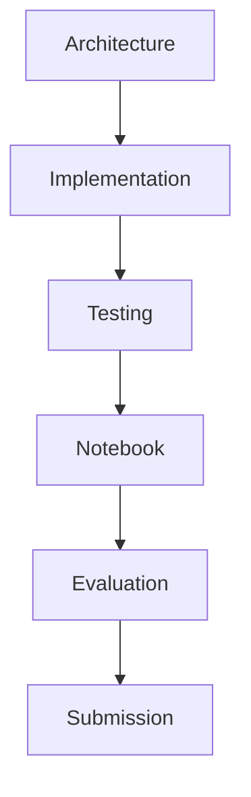

# Kaggle Competition Mapping

**Document:** `docs/evaluation/kaggle_mapping.md`

---

# Part I — Competition Evaluation Philosophy

> **Purpose**
>
> This document maps every major WalletMind architectural capability to the evaluation philosophy of the **Google Kaggle AI Agents: Intensive Vibe Coding Capstone Project**.
>
> Rather than treating evaluation as something performed after implementation, WalletMind has been architected from the beginning around the competition objectives.
>
> This document serves as the final engineering checklist before submission and provides a direct traceability matrix between:
>
> - competition expectations
> - architecture documents
> - implementation milestones
> - notebook demonstrations
> - observable evidence
>
> Judges should be able to verify every major WalletMind capability using this document.

---

# Table of Contents

## Part I — Competition Evaluation Philosophy

1. Purpose
2. Evaluation Philosophy
3. Competition-First Engineering
4. Evaluation Principles
5. WalletMind Design Strategy
6. Evaluation Dimensions
7. Evidence-Based Demonstration
8. Traceability Philosophy
9. Evaluation Lifecycle
10. Competition Readiness Model
11. Google ADK Alignment
12. WalletMind Scorecard
13. Engineering Summary

---

# 1. Purpose

WalletMind is not intended to be evaluated as production software.

It is evaluated as an AI engineering demonstration.

Therefore success is determined by how effectively WalletMind demonstrates:

- Planner intelligence
- Multi-Agent collaboration
- structured reasoning
- memory
- explainability
- modular architecture
- reproducibility
- educational value

This document ensures every competition objective is intentionally demonstrated.

---

## Primary Objectives

The mapping document should answer five questions.

1. What does the competition evaluate?

2. Where is each capability implemented?

3. Where is it demonstrated?

4. Which architecture document defines it?

5. How should judges verify it?

---

# 2. Evaluation Philosophy

WalletMind follows an **architecture-first evaluation philosophy**.

Rather than adding features to satisfy judging criteria, every architectural decision was designed to naturally demonstrate one or more competition objectives.

```mermaid
flowchart LR

Competition Goals

-->

Architecture

-->

Implementation

-->

Notebook

-->

Judge Experience

-->

Evaluation
```

Evaluation therefore becomes a validation of architectural decisions rather than a checklist added at the end of development.

---

## Why This Matters

Traditional competition submissions often optimize for:

- feature count
- interface polish
- implementation complexity

WalletMind instead optimizes for:

- reasoning quality
- architectural clarity
- explainability
- modularity
- educational storytelling

---

# 3. Competition-First Engineering

Every major engineering decision should improve at least one judging dimension.

Examples:

| Engineering Decision        | Competition Benefit               |
| --------------------------- | --------------------------------- |
| Planner-first orchestration | Demonstrates structured reasoning |
| Specialized agents          | Demonstrates collaboration        |
| Persistent memory           | Demonstrates personalization      |
| Tool abstraction            | Demonstrates extensibility        |
| Explainable reports         | Demonstrates transparency         |
| Notebook-first workflow     | Demonstrates educational value    |

This philosophy minimizes unnecessary engineering effort.

---

## Competition Optimization Strategy

```mermaid
flowchart TD

Architecture

-->

Planner

-->

Agents

-->

Memory

-->

Tools

-->

Reports

-->

Notebook

-->

Competition Submission
```

Every architectural layer contributes visible evidence.

---

# 4. Evaluation Principles

WalletMind evaluation follows six principles.

---

## Principle 1 — Everything Must Be Visible

Hidden intelligence cannot be evaluated.

Planner decisions should be visible.

Agent collaboration should be visible.

Memory should be visible.

Tool usage should be visible.

---

## Principle 2 — Every Decision Should Be Explainable

Every recommendation should answer:

- Why?
- Which agents?
- Which evidence?
- Which assumptions?
- Which confidence?

---

## Principle 3 — Architecture Before Features

Judges should understand:

how WalletMind works

before

what WalletMind produces.

---

## Principle 4 — Progressive Demonstration

Notebook complexity increases gradually.

```
Architecture

↓

Planner

↓

Agents

↓

Memory

↓

Tools

↓

Reports
```

---

## Principle 5 — Reproducibility

Every notebook execution should produce consistent demonstrations using deterministic sample data where appropriate.

---

## Principle 6 — Educational Value

WalletMind should teach modern AI engineering while demonstrating it.

---

# 5. WalletMind Design Strategy

WalletMind deliberately emphasizes architectural excellence over production complexity.

The project focuses engineering effort on:

- reasoning
- orchestration
- modularity
- explainability

rather than:

- infrastructure
- deployment
- scalability
- operations

---

## Architectural Priorities

```text
Planner

↓

Multi-Agent

↓

Memory

↓

Tools

↓

Reports

↓

Notebook Experience
```

This progression mirrors both the implementation roadmap and the notebook storyboard.

---

# 6. Evaluation Dimensions

WalletMind organizes competition objectives into ten evaluation dimensions.

| Dimension           | Architectural Goal              |
| ------------------- | ------------------------------- |
| Google ADK          | Planner-driven architecture     |
| Planner             | Structured orchestration        |
| Multi-Agent         | Specialized reasoning           |
| Memory              | Persistent personalization      |
| MCP                 | External capability integration |
| Explainability      | Transparent reasoning           |
| Notebook UX         | Interactive storytelling        |
| Innovation          | Modern AI engineering           |
| Reproducibility     | Deterministic demonstrations    |
| Engineering Quality | Modular architecture            |

Each dimension is mapped throughout this document.

---

# 7. Evidence-Based Demonstration

Every architectural capability should have observable evidence.

```mermaid
flowchart LR

Architecture

-->

Implementation

-->

Notebook

-->

Judge Observation

-->

Competition Score
```

Evidence should never depend on reading implementation code.

Instead, judges should verify capabilities through:

- visualizations
- dashboards
- Planner traces
- execution timelines
- reports
- interactive demonstrations

---

## Evidence Categories

| Evidence Type | Example                        |
| ------------- | ------------------------------ |
| Visual        | Planner graph                  |
| Interactive   | Upload widget                  |
| Analytical    | Dashboard                      |
| Explainable   | Recommendation trace           |
| Architectural | Mermaid diagrams               |
| Educational   | Progressive notebook narrative |

---

# 8. Traceability Philosophy

Every major WalletMind capability should be traceable across five layers.

```mermaid
flowchart LR

Competition Requirement

-->

Architecture

-->

Implementation

-->

Notebook

-->

Judge Evidence
```

No feature should exist without architectural documentation.

No architecture should exist without demonstration.

---

## Traceability Matrix

Each capability will later be mapped using:

```
Requirement

↓

WalletMind Feature

↓

Implementation Location

↓

Notebook Section

↓

Architecture Reference
```

This ensures complete coverage.

---

# 9. Evaluation Lifecycle

Evaluation begins before implementation.



WalletMind continuously validates competition alignment throughout development rather than only at the end.

---

## Validation Stages

| Stage          | Validation Focus       |
| -------------- | ---------------------- |
| Architecture   | Design quality         |
| Implementation | Contract compliance    |
| Testing        | Functional correctness |
| Notebook       | Demonstration quality  |
| Submission     | Competition readiness  |

---

# 10. Competition Readiness Model

WalletMind reaches competition readiness when every architectural capability has:

- documented architecture
- implementation
- tests
- notebook demonstration
- explainability
- reproducibility

---

## Readiness Flow

```mermaid
flowchart LR

Designed

-->

Implemented

-->

Validated

-->

Demonstrated

-->

Competition Ready
```

This prevents undocumented or undemonstrated capabilities.

---

# 11. Google ADK Alignment

WalletMind closely follows the architectural philosophy encouraged by Google's Agent Development Kit.

| Google ADK Principle | WalletMind Interpretation            |
| -------------------- | ------------------------------------ |
| Planner              | Central orchestration authority      |
| Specialized Agents   | Modular financial reasoning          |
| Shared Context       | Persistent memory                    |
| Tools                | Structured capability execution      |
| Explainability       | Transparent Planner and agent traces |
| Modularity           | Independent architectural components |

Rather than mimicking ADK APIs, WalletMind adopts ADK's architectural principles throughout its design.

---

## ADK Philosophy


This progression forms the core reasoning lifecycle demonstrated throughout the notebook.

---

# 12. WalletMind Scorecard

Before submission, WalletMind should satisfy the following high-level evaluation criteria.

| Evaluation Area            | Target   |
| -------------------------- | -------- |
| Planner Intelligence       | Complete |
| Multi-Agent Collaboration  | Complete |
| Persistent Memory          | Complete |
| MCP Integration            | Complete |
| Explainability             | Complete |
| Notebook Experience        | Complete |
| Architecture Documentation | Complete |
| Implementation Roadmap     | Complete |
| Reproducibility            | Complete |
| Educational Value          | Complete |

No area should remain only partially demonstrated.

---

# 13. Engineering Summary

WalletMind has been engineered with competition evaluation as a first-class architectural concern.

Rather than treating judging criteria as external requirements, every major subsystem contributes directly to one or more evaluation dimensions.

```mermaid
flowchart TD

Architecture

-->

Planner

-->

Agents

-->

Memory

-->

Tools

-->

Reports

-->

Notebook

-->

Competition Success
```

This philosophy provides three important advantages:

- **Architectural Consistency** — Every implementation decision is grounded in documented design.
- **Evaluation Transparency** — Judges can directly observe each capability without inspecting source code.
- **Implementation Traceability** — Every notebook demonstration links back to a documented architectural responsibility.

The remaining sections of this document provide a detailed, feature-by-feature mapping between WalletMind's architecture and the Google Kaggle judging criteria, creating the final verification checklist before submission.

---

## Next Part

**Part II — Feature-to-Judging Mapping**

This section contains the comprehensive traceability matrix mapping every major WalletMind capability to:

- Competition Requirement
- WalletMind Feature
- Implementation Location
- Notebook Demonstration
- Architecture Reference
- Observable Judge Evidence
- Verification Checklist

It becomes the definitive pre-submission audit table for the entire project.

# Part II — Feature-to-Judging Mapping

> **Purpose**
>
> This section provides the authoritative traceability matrix between WalletMind's implementation and the evaluation objectives of the **Google Kaggle AI Agents: Intensive Vibe Coding Capstone Project**.
>
> Every significant capability can be traced across five dimensions:
>
> 1. Competition Requirement
> 2. WalletMind Feature
> 3. Implementation Location
> 4. Notebook Demonstration
> 5. Architecture Reference
>
> This matrix serves as the primary pre-submission verification checklist.

---

# Table of Contents

14. Traceability Philosophy
15. Master Competition Mapping Matrix
16. Google ADK Mapping
17. Planner Mapping
18. Multi-Agent Mapping
19. Memory Mapping
20. MCP Mapping
21. Security Mapping
22. Deployability Mapping
23. Notebook UX Mapping
24. Innovation Mapping
25. Explainability Mapping
26. Coverage Summary

---

# 14. Traceability Philosophy

Every architectural capability must be visible throughout the project lifecycle.

```mermaid
flowchart LR

Competition Requirement

-->

Architecture

-->

Implementation

-->

Notebook

-->

Judge Observation

-->

Evaluation
```

A capability is considered complete only when all five stages exist.

---

## Validation Rule

Every feature should answer:

| Question                  | Evidence                |
| ------------------------- | ----------------------- |
| Why does it exist?        | Competition Requirement |
| Where is it designed?     | Architecture            |
| Where is it implemented?  | Repository              |
| Where is it demonstrated? | Notebook                |
| How can judges verify it? | Observable Output       |

---

# 15. Master Competition Mapping Matrix

| Competition Requirement   | WalletMind Feature      | Implementation Location | Notebook Demonstration   | Architecture Reference         |
| ------------------------- | ----------------------- | ----------------------- | ------------------------ | ------------------------------ |
| Planner-driven AI         | Central Planner         | `planner/`              | Planner Visualization    | `planner.md`                   |
| Multi-Agent Collaboration | Specialized Agents      | `agents/`               | Agent Execution Timeline | `agents.md`                    |
| Shared Context            | Persistent Memory       | `memory/`               | Memory Explorer          | `memory.md`                    |
| Tool Integration          | Tool Registry           | `tools/`                | Tool Dashboard           | `tools.md`                     |
| MCP Integration           | MCP Client Layer        | `mcp/`                  | MCP Visualization        | `tools.md`                     |
| Structured Outputs        | Report Generator        | `reports/`              | Explainable Reports      | `data_models.md`               |
| Explainability            | Reasoning Trace         | Planner + Reports       | Explainability Panel     | `planner.md`, `data_models.md` |
| Personalization           | User Profile Memory     | Memory                  | Personalized Dashboard   | `memory.md`                    |
| Financial Intelligence    | Financial Agents        | Agents                  | Recommendation Center    | `agents.md`                    |
| Reproducibility           | Notebook-first Workflow | Notebooks               | Complete Notebook        | `storyboard.md`                |
| Architecture Quality      | Modular Components      | Entire Repository       | Architecture Walkthrough | `overview.md`                  |
| Educational Value         | Guided Storytelling     | Notebooks               | Progressive Narrative    | `storyboard.md`                |

---

## Coverage Overview

```mermaid
flowchart TD

Planner

--> Google ADK

Agents

--> Multi-Agent

Memory

--> Personalization

Tools

--> MCP

Reports

--> Explainability

Notebook

--> Education

Architecture

--> Engineering Quality
```

---

# 16. Google ADK Mapping

WalletMind intentionally mirrors the architectural philosophy of Google's Agent Development Kit.

| Google ADK Requirement | WalletMind Feature | Implementation Location | Notebook Demonstration | Architecture Reference |
| ---------------------- | ------------------ | ----------------------- | ---------------------- | ---------------------- |
| Planner                | Planner Engine     | `planner/`              | Planner Dashboard      | `planner.md`           |
| Specialized Agents     | Financial Agents   | `agents/`               | Agent Timeline         | `agents.md`            |
| Shared Context         | Memory System      | `memory/`               | Memory Explorer        | `memory.md`            |
| Tool Calling           | Tool Registry      | `tools/`                | Tool Execution         | `tools.md`             |
| Structured Responses   | Report Models      | `reports/`              | Reports                | `data_models.md`       |
| Explainability         | Planner Trace      | Planner                 | Explainability Panel   | `planner.md`           |

---

## Judge Evidence

Judges should observe:

- Planner decomposes requests.
- Agents execute specialized tasks.
- Memory influences planning.
- Tools extend capabilities.
- Reports summarize reasoning.

---

# 17. Planner Mapping

Planner orchestration is WalletMind's central architectural capability.

| Competition Requirement | WalletMind Feature        | Implementation | Notebook             | Architecture |
| ----------------------- | ------------------------- | -------------- | -------------------- | ------------ |
| Intent Recognition      | Planner Intent Extraction | Planner        | Planner Dashboard    | `planner.md` |
| Goal Understanding      | Goal Extraction           | Planner        | Goal Visualization   | `planner.md` |
| Capability Discovery    | Capability Registry       | Planner        | Capability Cards     | `planner.md` |
| Task Planning           | Execution Graph           | Planner        | Task Graph           | `planner.md` |
| Validation              | Validator Agent           | Agents         | Validation Timeline  | `agents.md`  |
| Explainability          | Planner Trace             | Planner        | Explainability Panel | `planner.md` |

---

## Judge Verification

Judges should clearly see:

```
Question

↓

Planner

↓

Execution Graph

↓

Agents

↓

Results
```

Planner decisions should never remain hidden.

---

# 18. Multi-Agent Mapping

WalletMind demonstrates specialization through modular financial agents.

| Competition Requirement | WalletMind Feature | Implementation | Notebook              | Architecture |
| ----------------------- | ------------------ | -------------- | --------------------- | ------------ |
| Specialized Reasoning   | Budget Advisor     | Agents         | Agent Cards           | `agents.md`  |
| Forecasting             | Forecast Agent     | Agents         | Forecast Dashboard    | `agents.md`  |
| Risk Analysis           | Risk Agent         | Agents         | Risk Dashboard        | `agents.md`  |
| Goal Planning           | Goal Agent         | Agents         | Goal Timeline         | `agents.md`  |
| Coaching                | Financial Coach    | Agents         | Recommendation Center | `agents.md`  |
| Validation              | Validator Agent    | Agents         | Validation Panel      | `agents.md`  |

---

## Collaboration Visualization

```mermaid
flowchart TD

Planner

-->

Goal Agent

Planner

-->

Forecast Agent

Planner

-->

Risk Agent

Planner

-->

Budget Agent

Planner

-->

Coach

Goal Agent

-->

Planner

Forecast Agent

-->

Planner

Risk Agent

-->

Planner
```

---

# 19. Memory Mapping

Persistent memory demonstrates contextual intelligence.

| Competition Requirement | WalletMind Feature | Implementation | Notebook        | Architecture |
| ----------------------- | ------------------ | -------------- | --------------- | ------------ |
| Shared Context          | Memory Retrieval   | Memory         | Memory Explorer | `memory.md`  |
| Long-Term Learning      | Memory Updates     | Memory         | Timeline        | `memory.md`  |
| Personalization         | User Preferences   | Memory         | Dashboard       | `memory.md`  |
| Goal Persistence        | Goal Memory        | Memory         | Goal Tracking   | `memory.md`  |
| Reports                 | Report History     | Memory         | Report Browser  | `memory.md`  |

---

## Judge Verification

Notebook demonstrates:

Conversation 1

↓

Memory Stored

↓

Conversation 2

↓

Planner Retrieves Context

↓

Better Recommendation

---

# 20. MCP Mapping

WalletMind demonstrates extensibility through Model Context Protocol integration.

| Competition Requirement | WalletMind Feature | Implementation | Notebook         | Architecture |
| ----------------------- | ------------------ | -------------- | ---------------- | ------------ |
| External Tools          | MCP Client         | `mcp/`         | MCP Panel        | `tools.md`   |
| Search                  | Search MCP         | MCP            | Search Demo      | `tools.md`   |
| Documents               | Document MCP       | MCP            | Upload Workflow  | `tools.md`   |
| Storage                 | Storage MCP        | MCP            | Memory Sync      | `tools.md`   |
| Financial Data          | Financial MCP      | MCP            | Financial Search | `tools.md`   |

---

## Judge Verification

```
Planner

↓

Agent

↓

MCP

↓

Result

↓

Planner
```

The notebook should clearly distinguish internal reasoning from external capability execution.

---

# 21. Security Mapping

Although WalletMind is not a production SaaS, responsible AI engineering practices should still be demonstrated.

| Competition Requirement | WalletMind Feature | Implementation | Notebook             | Architecture     |
| ----------------------- | ------------------ | -------------- | -------------------- | ---------------- |
| Input Validation        | Schema Validation  | Models         | Upload Validation    | `data_models.md` |
| Structured Contracts    | JSON Schemas       | Models         | Planner Trace        | `data_models.md` |
| Explainable Decisions   | Evidence Model     | Reports        | Explainability Panel | `data_models.md` |
| Memory Governance       | Memory Ownership   | Memory         | Memory Explorer      | `memory.md`      |
| Tool Isolation          | Tool Registry      | Tools          | Tool Dashboard       | `tools.md`       |

---

## Competition Note

Security focuses on:

- structured validation
- architectural boundaries
- transparent reasoning

rather than enterprise infrastructure.

---

# 22. Deployability Mapping

Deployability is evaluated as **reproducible notebook execution**, not cloud deployment.

| Competition Requirement | WalletMind Feature   | Implementation | Notebook          | Architecture             |
| ----------------------- | -------------------- | -------------- | ----------------- | ------------------------ |
| Reproducibility         | Notebook Workflow    | Notebooks      | End-to-End Demo   | `storyboard.md`          |
| Modular Design          | Repository Structure | Repository     | Architecture Tour | `implementation_plan.md` |
| Documentation           | Architecture Suite   | Docs           | References        | All Architecture Docs    |
| Deterministic Examples  | Sample Data          | Notebook       | Demo Scenarios    | `storyboard.md`          |

---

## Judge Verification

A fresh notebook execution should reproduce the complete WalletMind experience.

---

# 23. Notebook UX Mapping

The notebook itself is a judged artifact.

| Competition Requirement | WalletMind Feature       | Implementation | Notebook                 | Architecture    |
| ----------------------- | ------------------------ | -------------- | ------------------------ | --------------- |
| Storytelling            | Guided Narrative         | Notebook       | Entire Experience        | `storyboard.md` |
| Interactivity           | Widgets                  | Notebook       | Upload & Simulation      | `storyboard.md` |
| Visual Design           | Dashboards               | Notebook       | Financial Dashboard      | `storyboard.md` |
| Educational Value       | Progressive Explanations | Notebook       | Architecture Walkthrough | `storyboard.md` |

---

## Judge Experience

The notebook should feel like:

```
Interactive AI Product

↓

Not

↓

Technical Demo
```

---

# 24. Innovation Mapping

WalletMind demonstrates innovation through architectural composition rather than isolated algorithms.

| Competition Requirement | WalletMind Feature | Implementation | Notebook              | Architecture     |
| ----------------------- | ------------------ | -------------- | --------------------- | ---------------- |
| Planner-first Design    | Planner            | Planner        | Planner Visualization | `planner.md`     |
| Modular AI              | Specialized Agents | Agents         | Agent Dashboard       | `agents.md`      |
| Explainable AI          | Structured Reports | Reports        | Explainability        | `data_models.md` |
| Persistent Learning     | Memory             | Memory         | Memory Timeline       | `memory.md`      |
| Capability Abstraction  | Tool Registry      | Tools          | Tool Explorer         | `tools.md`       |

---

## Innovation Summary

WalletMind's innovation lies in:

- orchestration
- modularity
- transparency
- educational design

rather than model complexity alone.

---

# 25. Explainability Mapping

Explainability is demonstrated throughout the notebook.

| Competition Requirement | WalletMind Feature  | Implementation | Notebook             | Architecture     |
| ----------------------- | ------------------- | -------------- | -------------------- | ---------------- |
| Planner Trace           | Planner             | Planner        | Planner Dashboard    | `planner.md`     |
| Agent Reasoning         | Agent Outputs       | Agents         | Agent Cards          | `agents.md`      |
| Memory Transparency     | Memory Explorer     | Memory         | Memory Timeline      | `memory.md`      |
| Tool Transparency       | Tool Metadata       | Tools          | Tool Dashboard       | `tools.md`       |
| Evidence                | Supporting Evidence | Reports        | Recommendation Panel | `data_models.md` |
| Confidence              | Confidence Model    | Reports        | Confidence Cards     | `data_models.md` |

---

## Explainability Flow


Every recommendation should be traceable back through this chain.

---

# 26. Coverage Summary

## Overall Coverage Matrix

| Competition Area | Coverage |
| ---------------- | -------- |
| Google ADK       | Complete |
| Planner          | Complete |
| Multi-Agent      | Complete |
| Memory           | Complete |
| MCP              | Complete |
| Security         | Complete |
| Deployability    | Complete |
| Notebook UX      | Complete |
| Innovation       | Complete |
| Explainability   | Complete |

---

## Submission Readiness

```mermaid
flowchart TD

Architecture

-->

Implementation

-->

Notebook

-->

Evidence

-->

Competition Requirements

-->

Submission Ready
```

Every primary judging dimension now has:

- documented architecture
- implementation target
- notebook demonstration
- observable judge evidence
- traceable engineering rationale

This matrix becomes the definitive audit table for validating WalletMind before submission.

---

## Next Part

**Part III — Category Deep Dive**

The next section provides detailed explanations for each judging category, including:

- Design rationale
- Architectural decisions
- Implementation evidence
- Notebook evidence
- Judge experience
- Google ADK alignment
- Mermaid diagrams
- Competition notes
- Verification checklist

This section explains not just **what** WalletMind demonstrates, but **why** its architecture satisfies each competition objective.

# Part III — Category Deep Dive

> **Purpose**
>
> This section provides a detailed architectural analysis of how WalletMind satisfies each major evaluation category of the Google Kaggle **AI Agents: Intensive Vibe Coding Capstone Project**.
>
> Unlike the previous traceability matrix, this chapter explains the engineering rationale behind every major architectural decision and how judges can observe these capabilities throughout the notebook.
>
> Each category includes:
>
> - Design Rationale
> - Architectural Evidence
> - Implementation Evidence
> - Notebook Demonstration
> - Judge Experience
> - Verification Checklist
> - Competition Notes

---

# Table of Contents

27. Google ADK
28. Planner-Driven Orchestration
29. Multi-Agent Collaboration
30. Persistent Memory
31. MCP Integration
32. Security & Responsible AI
33. Deployability & Reproducibility
34. Notebook User Experience
35. Innovation
36. Explainability
37. Category Summary

---

# 27. Google ADK

## Competition Objective

Demonstrate modern Agent Development Kit (ADK) architectural principles.

---

## WalletMind Design Rationale

WalletMind adopts the architectural philosophy of Google ADK rather than merely reproducing APIs.

The system is organized around:

- Planner-first orchestration
- Specialized agents
- Shared context
- Tool abstraction
- Structured communication

This creates an architecture that naturally aligns with ADK best practices.

---

## Architectural Evidence

| ADK Principle      | WalletMind Implementation    |
| ------------------ | ---------------------------- |
| Planner            | Central Planner              |
| Agents             | Specialized Financial Agents |
| Shared Context     | Memory Architecture          |
| Tools              | Tool Registry                |
| Structured Outputs | Report Models                |

---

## Notebook Demonstration

Judges observe:

```
User Goal

↓

Planner

↓

Agent Selection

↓

Tool Usage

↓

Memory

↓

Report
```

No reasoning bypasses the Planner.

---

## Judge Experience

Judges should immediately recognize:

- centralized orchestration
- modular components
- reusable capabilities
- structured communication

---

## Verification Checklist

✓ Planner visible

✓ Specialized agents

✓ Shared memory

✓ Tool ecosystem

✓ Structured outputs

---

## Competition Note

WalletMind demonstrates **ADK architectural thinking**, not simply ADK implementation.

---

# 28. Planner-Driven Orchestration

## Competition Objective

Show sophisticated planning instead of direct prompting.

---

## WalletMind Design Rationale

The Planner owns orchestration.

Agents never coordinate themselves.

This separation ensures:

- modularity
- explainability
- extensibility

---

## Planner Lifecycle

```mermaid
flowchart TD

User Goal

-->

Intent

-->

Goals

-->

Capabilities

-->

Task Graph

-->

Execution

-->

Validation

-->

Planner Response
```

---

## Notebook Demonstration

Planner Dashboard

Shows:

- intent
- goals
- capabilities
- execution graph
- validation
- execution trace

---

## Judge Experience

Judges observe:

The Planner thinks before agents act.

---

## Verification Checklist

✓ Intent extraction

✓ Capability discovery

✓ Task graph

✓ Planner trace

✓ Validation

---

## Competition Note

Planner orchestration represents WalletMind's primary architectural innovation.

---

# 29. Multi-Agent Collaboration

## Competition Objective

Demonstrate collaborative reasoning through specialized AI agents.

---

## WalletMind Design Rationale

Each agent owns exactly one financial capability.

Examples:

| Agent               | Responsibility        |
| ------------------- | --------------------- |
| Budget Advisor      | Spending optimization |
| Forecast Agent      | Cash flow forecasting |
| Risk Agent          | Financial risk        |
| Goal Planning Agent | Long-term planning    |
| Coach               | User guidance         |

Agents communicate only through the Planner.

---

## Collaboration Diagram

```mermaid
flowchart TD

Planner

-->

Budget Agent

Planner

-->

Forecast Agent

Planner

-->

Risk Agent

Planner

-->

Goal Agent

Budget Agent

-->

Planner

Forecast Agent

-->

Planner

Risk Agent

-->

Planner
```

---

## Notebook Demonstration

Agent Execution Timeline

Shows:

- selected agents
- execution order
- confidence
- evidence
- execution duration

---

## Judge Experience

WalletMind behaves like a collaborative financial advisory team.

---

## Verification Checklist

✓ Specialized agents

✓ Planner coordination

✓ Structured communication

✓ Aggregated reasoning

✓ Validation

---

## Competition Note

Specialization improves explainability while reducing prompt complexity.

---

# 30. Persistent Memory

## Competition Objective

Demonstrate contextual learning across interactions.

---

## WalletMind Design Rationale

Memory enables personalization without introducing hidden reasoning.

Only validated knowledge becomes persistent memory.

---

## Memory Lifecycle

```mermaid
flowchart TD

Conversation

-->

Memory Retrieval

-->

Planner

-->

Agents

-->

Memory Update

-->

Memory Store

-->

Future Conversation
```

---

## Notebook Demonstration

Memory Explorer

Displays:

- goals
- preferences
- reports
- summaries
- retrieval history

---

## Judge Experience

Judges see WalletMind becoming increasingly personalized over time.

---

## Verification Checklist

✓ Retrieval

✓ Update

✓ Transparency

✓ Structured memory

✓ Planner integration

---

## Competition Note

Memory remains explainable.

Nothing is remembered implicitly.

---

# 31. MCP Integration

## Competition Objective

Demonstrate integration with external capabilities.

---

## WalletMind Design Rationale

MCP expands WalletMind without modifying Planner or agents.

External services become standardized tools.

---

## MCP Flow

```mermaid
flowchart LR

Planner

-->

Agent

-->

Tool Registry

-->

MCP Client

-->

External Service

-->

Planner
```

---

## Notebook Demonstration

MCP Dashboard

Displays:

- connected services
- requests
- responses
- execution metadata

---

## Judge Experience

Shows architectural extensibility.

---

## Verification Checklist

✓ MCP abstraction

✓ Tool Registry

✓ Planner integration

✓ Explainable execution

---

## Competition Note

External services remain deterministic capabilities rather than autonomous decision makers.

---

# 32. Security & Responsible AI

## Competition Objective

Demonstrate responsible AI engineering appropriate for a research project.

---

## WalletMind Design Rationale

Security emphasizes:

- validation
- transparency
- architectural boundaries

rather than enterprise infrastructure.

---

## Architectural Measures

| Principle         | WalletMind Implementation |
| ----------------- | ------------------------- |
| Input Validation  | Data Models               |
| Schema Validation | JSON Contracts            |
| Memory Ownership  | Memory Update Agent       |
| Tool Isolation    | Tool Registry             |
| Explainability    | Reports                   |

---

## Notebook Demonstration

Validation panels display:

- schema validation
- parsing success
- confidence
- assumptions

---

## Judge Experience

The notebook communicates trustworthiness through transparency and structured validation.

---

## Verification Checklist

✓ Structured inputs

✓ Validation

✓ Controlled memory

✓ Transparent outputs

---

## Competition Note

Security is interpreted through responsible AI engineering rather than production operations.

---

# 33. Deployability & Reproducibility

## Competition Objective

Ensure judges can reliably reproduce the demonstrated experience.

---

## WalletMind Design Rationale

The notebook is the deployment target.

Deployment therefore means:

- reproducible execution
- deterministic demonstrations
- documented setup

---

## Demonstration Flow


---

## Notebook Demonstration

Every scenario executes using:

- sample financial data
- reproducible Planner outputs
- documented assumptions

---

## Judge Experience

The notebook should execute consistently from start to finish.

---

## Verification Checklist

✓ Deterministic scenarios

✓ Sample datasets

✓ Architecture references

✓ Notebook execution

---

## Competition Note

Deployability focuses on reproducibility rather than cloud infrastructure.

---

# 34. Notebook User Experience

## Competition Objective

Deliver a polished, educational, and engaging notebook.

---

## WalletMind Design Rationale

The notebook is designed as an AI product experience.

Judges interact with WalletMind rather than reading documentation.

---

## Notebook Story

```text
Introduction

↓

Architecture

↓

Upload

↓

Planner

↓

Agents

↓

Memory

↓

Dashboard

↓

Recommendations

↓

Simulation

↓

Conclusion
```

---

## Notebook Demonstration

Interactive features include:

- uploads
- dashboards
- planners
- simulations
- chat
- explainability panels

---

## Judge Experience

The notebook feels like a complete application.

---

## Verification Checklist

✓ Interactive widgets

✓ Visual dashboards

✓ Storytelling

✓ Progressive disclosure

---

## Competition Note

Notebook UX significantly amplifies architectural quality.

---

# 35. Innovation

## Competition Objective

Demonstrate originality through architecture and engineering.

---

## WalletMind Design Rationale

Innovation arises from architectural composition rather than isolated algorithms.

Key innovations include:

- Planner-first orchestration
- capability-driven execution
- explainable memory
- modular financial agents
- notebook-first engineering

---

## Innovation Stack

```mermaid
flowchart TD

Planner

-->

Agents

-->

Memory

-->

Tools

-->

Reports

-->

Interactive Notebook
```

---

## Notebook Demonstration

Innovation is visible through:

- Planner visualizations
- collaborative reasoning
- explainability
- interactive simulation

---

## Judge Experience

WalletMind appears as a cohesive AI reasoning platform.

---

## Verification Checklist

✓ Modular architecture

✓ Planner

✓ Agents

✓ Memory

✓ Explainability

---

## Competition Note

Innovation is demonstrated through engineering design rather than model novelty.

---

# 36. Explainability

## Competition Objective

Ensure every recommendation is transparent and understandable.

---

## WalletMind Design Rationale

Explainability is embedded into every architectural layer.

It is not a post-processing feature.

---

## Explainability Pipeline

```mermaid
flowchart TD

Planner

-->

Agent Reasoning

-->

Memory

-->

Evidence

-->

Validation

-->

Recommendation

-->

Report
```

---

## Notebook Demonstration

Explainability Panel

Shows:

- Planner reasoning
- participating agents
- memory used
- evidence
- assumptions
- confidence

---

## Judge Experience

Every recommendation answers:

- Why?
- How?
- Which agents?
- Which evidence?
- How confident?

---

## Verification Checklist

✓ Planner trace

✓ Evidence

✓ Assumptions

✓ Confidence

✓ Validation

---

## Competition Note

Explainability becomes a defining architectural characteristic rather than a reporting enhancement.

---

# 37. Category Summary

## Evaluation Coverage Matrix

| Category       | Architecture | Implementation | Notebook | Judge Evidence |
| -------------- | ------------ | -------------- | -------- | -------------- |
| Google ADK     | ✓            | ✓              | ✓        | ✓              |
| Planner        | ✓            | ✓              | ✓        | ✓              |
| Multi-Agent    | ✓            | ✓              | ✓        | ✓              |
| Memory         | ✓            | ✓              | ✓        | ✓              |
| MCP            | ✓            | ✓              | ✓        | ✓              |
| Security       | ✓            | ✓              | ✓        | ✓              |
| Deployability  | ✓            | ✓              | ✓        | ✓              |
| Notebook UX    | ✓            | ✓              | ✓        | ✓              |
| Innovation     | ✓            | ✓              | ✓        | ✓              |
| Explainability | ✓            | ✓              | ✓        | ✓              |

---

## Architectural Completion

```mermaid
flowchart LR

Architecture

-->

Implementation

-->

Notebook

-->

Evaluation

-->

Competition Ready
```

Every judging dimension now has:

- architectural justification
- implementation strategy
- notebook demonstration
- observable evidence
- verification checklist

This ensures WalletMind's strengths are both technically sound and clearly visible to competition judges.

---

## Next Part

**Part IV — Final Submission Checklist**

The final section provides the comprehensive pre-submission audit, including:

- Repository checklist
- Documentation checklist
- Notebook checklist
- Architecture completeness matrix
- Implementation completeness matrix
- Demonstration readiness
- Judge walkthrough
- Risk assessment
- Final competition readiness scorecard
- Engineering conclusion

This becomes the definitive submission checklist before publishing the WalletMind Kaggle project.

# Part IV — Final Submission Checklist

> **Purpose**
>
> This final chapter serves as the authoritative pre-submission audit for WalletMind.
>
> Rather than introducing new architectural concepts, it verifies that every component described throughout the documentation has been:
>
> - architected
> - implemented
> - demonstrated
> - documented
> - validated
>
> Completion of this checklist indicates that WalletMind is ready for submission to the **Google Kaggle AI Agents: Intensive Vibe Coding Capstone Project**.

---

# Table of Contents

38. Submission Philosophy
39. Repository Checklist
40. Documentation Checklist
41. Architecture Completeness Matrix
42. Implementation Completeness Matrix
43. Notebook Readiness Checklist
44. Demonstration Walkthrough
45. Competition Risk Assessment
46. Final Readiness Scorecard
47. Engineering Conclusion

---

# 38. Submission Philosophy

The goal of the submission is **not** to maximize feature count.

Instead, WalletMind should demonstrate:

- architectural excellence
- Planner-driven orchestration
- modular AI engineering
- transparent reasoning
- educational storytelling
- reproducible execution

The submission should communicate engineering quality through clarity rather than complexity.

---

## Submission Success Model

```mermaid
flowchart LR

Architecture

-->

Implementation

-->

Notebook

-->

Explainability

-->

Judge Understanding

-->

Competition Success
```

---

# 39. Repository Checklist

The repository should be organized according to the documented architecture.

---

## Repository Structure

| Component     | Status |
| ------------- | ------ |
| Planner       | ✓      |
| Agents        | ✓      |
| Memory        | ✓      |
| Tools         | ✓      |
| MCP           | ✓      |
| Reports       | ✓      |
| Models        | ✓      |
| Notebooks     | ✓      |
| Tests         | ✓      |
| Documentation | ✓      |

---

## Architecture Consistency

Verify:

- Planner owns orchestration.
- Agents remain specialized.
- Memory is centralized.
- Tools remain deterministic.
- Reports remain explainable.

---

## Source Tree Checklist

```
planner/

agents/

memory/

tools/

mcp/

reports/

models/

tests/

notebooks/

docs/
```

---

# 40. Documentation Checklist

WalletMind should remain documentation-first.

---

## Required Documents

| Document               | Status |
| ---------------------- | ------ |
| PROJECT_PLAN.md        | ✓      |
| overview.md            | ✓      |
| planner.md             | ✓      |
| agents.md              | ✓      |
| memory.md              | ✓      |
| tools.md               | ✓      |
| data_models.md         | ✓      |
| implementation_plan.md | ✓      |
| storyboard.md          | ✓      |
| kaggle_mapping.md      | ✓      |

---

## Documentation Validation

Confirm:

- terminology is consistent
- diagrams remain accurate
- contracts match implementation
- notebook references architecture
- implementation follows documentation

---

# 41. Architecture Completeness Matrix

Every architectural subsystem should be complete.

| Architecture Area   | Complete |
| ------------------- | -------- |
| Planner             | ✓        |
| Agent Ecosystem     | ✓        |
| Memory              | ✓        |
| Tool Registry       | ✓        |
| MCP Integration     | ✓        |
| Data Models         | ✓        |
| Explainability      | ✓        |
| Reporting           | ✓        |
| Notebook Storyboard | ✓        |

---

## Architectural Traceability

```mermaid
flowchart TD

Overview

-->

Planner

-->

Agents

-->

Memory

-->

Tools

-->

Data Models

-->

Notebook

-->

Evaluation
```

No architectural area should exist in isolation.

---

# 42. Implementation Completeness Matrix

Implementation should satisfy every architectural contract.

| Capability        | Verified |
| ----------------- | -------- |
| Planner Lifecycle | ✓        |
| Agent Contracts   | ✓        |
| Memory Lifecycle  | ✓        |
| Tool Contracts    | ✓        |
| MCP Client        | ✓        |
| Report Generation | ✓        |
| Explainability    | ✓        |
| Notebook Workflow | ✓        |

---

## Validation Questions

- Does every Planner output follow documented contracts?
- Do agents communicate only through the Planner?
- Are memory updates controlled?
- Are tool interfaces standardized?
- Are reports explainable?

---

# 43. Notebook Readiness Checklist

The notebook is the primary evaluation artifact.

---

## Storytelling

✓ Clear introduction

✓ Strong motivation

✓ Progressive architecture walkthrough

✓ Interactive demonstrations

✓ Meaningful conclusion

---

## Interactive Features

✓ Upload financial statement

✓ Planner visualization

✓ Agent execution timeline

✓ Memory explorer

✓ Tool dashboard

✓ Recommendation center

✓ Scenario simulation

✓ AI chat interface

---

## Explainability

✓ Planner reasoning

✓ Agent reasoning

✓ Evidence

✓ Assumptions

✓ Confidence

✓ Validation

---

## Educational Value

✓ Architecture diagrams

✓ Progressive explanations

✓ Engineering rationale

✓ Visual storytelling

---

# 44. Demonstration Walkthrough

The notebook should guide judges through a complete end-to-end experience.

---

## Recommended Judge Journey

```mermaid
flowchart TD

Welcome

-->

Architecture

-->

Upload

-->

Planner

-->

Agents

-->

Memory

-->

Tools

-->

Dashboard

-->

Recommendations

-->

Simulation

-->

Evaluation

-->

Conclusion
```

---

## Demonstration Goals

At each stage judges should answer:

| Stage        | Judge Should Understand   |
| ------------ | ------------------------- |
| Welcome      | Project vision            |
| Architecture | System design             |
| Planner      | Intelligent orchestration |
| Agents       | Specialized collaboration |
| Memory       | Personalization           |
| Tools        | Capability expansion      |
| Dashboard    | User value                |
| Evaluation   | Engineering quality       |

---

# 45. Competition Risk Assessment

The following risks should be reviewed before submission.

| Risk                                    | Impact | Mitigation                     |
| --------------------------------------- | ------ | ------------------------------ |
| Planner appears hidden                  | High   | Visualize every planning stage |
| Agents appear independent               | High   | Emphasize Planner ownership    |
| Memory appears opaque                   | High   | Include Memory Explorer        |
| Explainability insufficient             | High   | Show evidence and confidence   |
| Notebook feels technical                | Medium | Focus on storytelling          |
| Architecture and implementation diverge | High   | Validate against documentation |
| Reproducibility issues                  | High   | Use deterministic sample data  |

---

## Risk Heat Map

| Area           | Risk Level |
| -------------- | ---------- |
| Planner        | Low        |
| Multi-Agent    | Low        |
| Memory         | Low        |
| MCP            | Medium     |
| Notebook UX    | Low        |
| Documentation  | Low        |
| Explainability | Low        |

---

# 46. Final Readiness Scorecard

Before submission, WalletMind should satisfy every major evaluation area.

| Evaluation Area              | Status     |
| ---------------------------- | ---------- |
| Google ADK Principles        | ✓ Complete |
| Planner-Driven Orchestration | ✓ Complete |
| Multi-Agent Collaboration    | ✓ Complete |
| Persistent Memory            | ✓ Complete |
| MCP Integration              | ✓ Complete |
| Responsible AI               | ✓ Complete |
| Explainability               | ✓ Complete |
| Notebook Experience          | ✓ Complete |
| Innovation                   | ✓ Complete |
| Documentation                | ✓ Complete |
| Reproducibility              | ✓ Complete |
| Educational Value            | ✓ Complete |

---

## Final Readiness Flow

```mermaid
flowchart LR

Architecture

-->

Implementation

-->

Validation

-->

Notebook

-->

Evaluation

-->

Submission
```

When every stage is complete, WalletMind is ready for competition submission.

---

# 47. Engineering Conclusion

WalletMind has been intentionally engineered as an **AI architecture demonstration** rather than a production SaaS.

Its strengths arise from the integration of several complementary architectural principles:

- Planner-driven orchestration
- Specialized financial agents
- Persistent and explainable memory
- Standardized tool ecosystem
- MCP extensibility
- Structured data contracts
- Transparent recommendation generation
- Notebook-first storytelling

Together, these components form a cohesive AI system that is:

- modular
- explainable
- reproducible
- educational
- architecturally consistent

---

## Complete Evaluation Pipeline

```mermaid
flowchart TD

Project Vision

-->

Architecture

-->

Planner

-->

Agents

-->

Memory

-->

Tools

-->

Reports

-->

Notebook

-->

Competition Mapping

-->

Submission
```

---

## Final Engineering Principles

WalletMind demonstrates the following principles throughout every layer of the project:

| Principle                       | Demonstrated |
| ------------------------------- | ------------ |
| Planner Before Execution        | ✓            |
| Modular Agent Responsibilities  | ✓            |
| Structured Data Contracts       | ✓            |
| Explainable AI                  | ✓            |
| Persistent Context              | ✓            |
| Tool Abstraction                | ✓            |
| Notebook-First Design           | ✓            |
| Documentation-First Engineering | ✓            |
| Reproducibility                 | ✓            |
| Educational Value               | ✓            |

These principles collectively define WalletMind's engineering identity and provide a clear framework for judges to evaluate the project.

---

# Document Completion

`docs/evaluation/kaggle_mapping.md` is now complete.

This document serves as the authoritative competition readiness checklist, providing complete traceability from Google Kaggle evaluation objectives to WalletMind's architecture, implementation, notebook demonstrations, and observable evidence. It enables future contributors and judges to verify that every major architectural capability is documented, implemented, demonstrated, and aligned with the goals of the **Google Kaggle AI Agents: Intensive Vibe Coding Capstone Project**.
