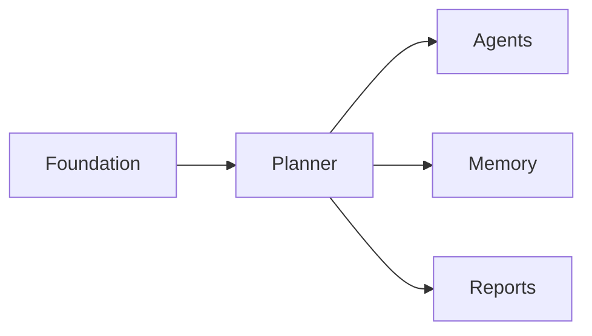
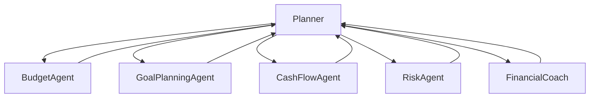
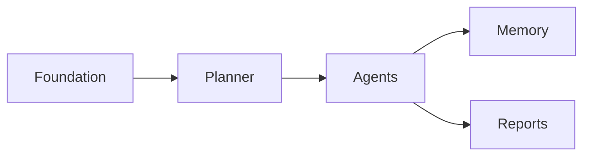

# Implementation Plan

**Document:** `docs/implementation/implementation_plan.md`

---

# Part I — Implementation Philosophy & Roadmap Overview

> **Purpose**
>
> This document defines the implementation roadmap for WalletMind.
>
> Unlike a traditional software delivery plan, this roadmap is intentionally designed for the **Google Kaggle AI Agents: Intensive Vibe Coding Capstone Project**.
>
> The objective is not to maximize feature count or production readiness. Instead, the roadmap prioritizes demonstrating exceptional AI engineering practices through planner-driven orchestration, multi-agent collaboration, persistent memory, explainability, Model Context Protocol (MCP) integrations, and notebook-first storytelling.
>
> Every milestone is designed to produce a meaningful architectural capability that can be demonstrated independently while contributing toward the final competition submission.
>
> This roadmap should be treated as the authoritative implementation sequence for both human contributors and AI coding assistants.

---

# Table of Contents

## Part I — Implementation Philosophy & Roadmap Overview

1. Purpose
2. Implementation Philosophy
3. Guiding Principles
4. Competition-First Development Strategy
5. Roadmap Design Philosophy
6. Milestone Strategy
7. Dependency Architecture
8. Overall Roadmap
9. Engineering Priorities
10. Development Workflow
11. Notebook-First Philosophy
12. Google ADK Mapping
13. Kaggle Competition Mapping

---

# 1. Purpose

WalletMind is architected as a **reasoning-first AI system**.

Consequently, implementation should prioritize architectural correctness before feature completeness.

The implementation roadmap exists to ensure that development progresses in a logical sequence where every milestone:

- builds upon validated architecture
- produces demonstrable reasoning capabilities
- remains independently testable
- contributes toward the final competition notebook
- minimizes architectural rework

Unlike production software roadmaps, this roadmap optimizes for:

- explainability
- modularity
- reproducibility
- educational value
- notebook demonstrations
- AI-assisted implementation

---

# 2. Implementation Philosophy

WalletMind follows a **documentation-first, architecture-driven implementation strategy**.

Implementation should never invent architecture.

Instead, it realizes the architecture already defined by:

- PROJECT_PLAN.md
- Architecture Overview
- Planner Architecture
- Agent Specifications
- Memory Architecture
- Tool Architecture
- Data Model Specification

Implementation therefore becomes a direct expression of documented architectural intent.

```mermaid
flowchart LR

Architecture

-->

Implementation Plan

-->

Implementation

-->

Testing

-->

Notebook Demonstration

-->

Competition Submission
```

This progression ensures that every implementation decision remains aligned with the documented engineering vision.

---

# 3. Guiding Principles

Every implementation milestone should satisfy the following principles.

---

## Planner First

Planner orchestration should exist before specialized agents.

Agents should never coordinate themselves.

---

## Memory First

Persistent contextual memory should be introduced early so subsequent agents can leverage shared knowledge.

---

## Explainability First

Every reasoning capability should be explainable before optimization begins.

A partially explainable system is preferred over a highly optimized opaque system.

---

## Notebook First

Every completed milestone should be demonstrable within a Jupyter notebook.

Notebook demonstrations serve as both validation artifacts and competition storytelling.

---

## Incremental Intelligence

WalletMind should become progressively more capable.

Each milestone should produce a meaningful increase in reasoning ability rather than merely adding isolated features.

---

## AI-Friendly Development

The implementation sequence should minimize ambiguity so future AI coding assistants can complete milestones with minimal architectural interpretation.

---

# 4. Competition-First Development Strategy

WalletMind is intentionally optimized for a research competition rather than commercial deployment.

Accordingly, implementation priorities differ significantly from traditional software projects.

| Competition Priority      | Implementation Focus |
| ------------------------- | -------------------- |
| Planner Intelligence      | Highest              |
| Multi-Agent Collaboration | Highest              |
| Explainability            | Highest              |
| Persistent Memory         | Highest              |
| Notebook Storytelling     | Highest              |
| Modular Design            | High                 |
| MCP Integration           | High                 |
| UI Polish                 | Medium               |
| Runtime Optimization      | Low                  |
| Production Infrastructure | Out of Scope         |

This prioritization ensures engineering effort directly improves judging criteria.

---

# 5. Roadmap Design Philosophy

The roadmap is organized around **architectural capabilities** rather than software layers.

Each milestone delivers a complete reasoning capability.

```mermaid
flowchart TD

Foundation

-->

Planner

-->

Agents

-->

Memory

-->

Tools

-->

Explainability

-->

Notebook Demonstration

-->

Competition Submission
```

Each capability should be independently demonstrable before the next milestone begins.

---

## Why Capability-Based Milestones?

Capability-oriented development offers several advantages.

- Earlier demonstrations
- Faster architectural validation
- Easier debugging
- Better notebook storytelling
- Reduced implementation risk
- Improved AI-assisted development

---

# 6. Milestone Strategy

Every milestone follows a consistent structure.

```text
Objective

↓

Deliverables

↓

Dependencies

↓

Implementation

↓

Testing

↓

Notebook Demonstration

↓

Acceptance Review
```

No milestone should begin until the previous milestone satisfies its acceptance criteria.

---

## Milestone Characteristics

Every milestone should:

- introduce one major architectural capability
- preserve planner ownership
- maintain modularity
- remain independently testable
- improve notebook demonstrations
- avoid architectural shortcuts

---

# 7. Dependency Architecture

Implementation dependencies intentionally mirror the runtime architecture.

```mermaid
flowchart TD

Foundation

-->

Planner

Planner

-->

Agents

Planner

-->

Memory

Agents

-->

Tools

Memory

-->

Reports

Reports

-->

Notebook

Notebook

-->

Competition Package
```

This sequence minimizes circular dependencies during implementation.

---

## Dependency Principles

A milestone should depend only upon previously completed architectural capabilities.

For example:

Planner

↓

Agent Communication

↓

Reasoning Agents

↓

Report Generation

rather than:

Report Generation

↓

Planner

which would introduce unnecessary coupling.

---

# 8. Overall Roadmap

WalletMind implementation is divided into seven architectural milestones.

| Milestone | Architectural Focus      | Outcome                                |
| --------- | ------------------------ | -------------------------------------- |
| 1         | Foundation               | Project skeleton and core architecture |
| 2         | Planner                  | Planner-driven orchestration           |
| 3         | Agent Ecosystem          | Specialized reasoning agents           |
| 4         | Memory                   | Persistent contextual reasoning        |
| 5         | Tools & MCP              | External capabilities and integrations |
| 6         | Explainability & Reports | Transparent recommendations            |
| 7         | Notebook & Submission    | Competition-ready demonstration        |

Each milestone builds directly upon the previous one while remaining independently demonstrable.

---

# 9. Engineering Priorities

Implementation decisions should be evaluated using the following priority order.

| Priority | Evaluation Question                           |
| -------- | --------------------------------------------- |
| 1        | Does this improve planner reasoning?          |
| 2        | Does this improve agent collaboration?        |
| 3        | Does this improve explainability?             |
| 4        | Does this improve notebook demonstrations?    |
| 5        | Does this preserve modularity?                |
| 6        | Does this simplify future implementation?     |
| 7        | Does this align with documented architecture? |

Features that score poorly against these priorities should be deferred.

---

# 10. Development Workflow

Each implementation milestone follows a documentation-driven engineering workflow.

```mermaid
flowchart LR

Architecture

-->

Implementation

-->

Unit Tests

-->

Integration Tests

-->

Notebook Demo

-->

Review

-->

Next Milestone
```

This workflow ensures that every capability is validated before becoming a dependency for subsequent milestones.

---

## AI Coding Assistant Workflow

Future AI coding assistants should approach every milestone by following the same sequence.

1. Review relevant architecture documents.
2. Review data contracts.
3. Implement architectural boundaries.
4. Implement reasoning logic.
5. Validate interfaces.
6. Execute automated tests.
7. Produce notebook demonstration.
8. Confirm milestone acceptance criteria.

This process minimizes architectural drift during AI-assisted development.

---

# 11. Notebook-First Philosophy

The notebook is WalletMind's primary demonstration artifact.

Every milestone should add visible capabilities to the notebook.

Example progression:

```text
Milestone 1

Project initialization

↓

Milestone 2

Planner visualization

↓

Milestone 3

Multi-agent collaboration

↓

Milestone 4

Persistent memory

↓

Milestone 5

Tool & MCP interactions

↓

Milestone 6

Explainable reports

↓

Milestone 7

Complete end-to-end financial reasoning demonstration
```

This incremental storytelling approach aligns naturally with competition judging.

---

# 12. Google ADK Mapping

The implementation roadmap closely follows the architectural philosophy of Google's Agent Development Kit.

| Google ADK Concept        | WalletMind Milestone |
| ------------------------- | -------------------- |
| Planner                   | Milestone 2          |
| Specialized Agents        | Milestone 3          |
| Shared Context            | Milestone 4          |
| Tool Integration          | Milestone 5          |
| Structured Outputs        | Milestone 6          |
| End-to-End Agent Workflow | Milestone 7          |

This progression demonstrates increasing sophistication in ADK usage while preserving architectural clarity.

---

# 13. Kaggle Competition Mapping

The implementation roadmap is intentionally aligned with the judging philosophy of the Google Kaggle **AI Agents: Intensive Vibe Coding Capstone Project**.

| Competition Criterion     | Primary Milestone |
| ------------------------- | ----------------- |
| Planner Intelligence      | 2                 |
| Multi-Agent Collaboration | 3                 |
| Persistent Memory         | 4                 |
| MCP Integration           | 5                 |
| Explainability            | 6                 |
| Notebook Storytelling     | 7                 |
| Reproducibility           | All Milestones    |
| Educational Value         | All Milestones    |

Rather than delaying demonstrations until the end of development, each milestone contributes directly to the final notebook narrative, allowing judges to observe the progressive evolution of WalletMind's reasoning architecture.

---

## Next Part

**Part II — Milestone 1: Foundation**

The next section defines the first implementation milestone in detail, including:

- Objective
- Deliverables
- Dependencies
- Acceptance Criteria
- Files Affected
- Estimated Complexity
- Notebook Demonstration
- Tests Required
- Future Improvements

This milestone establishes the architectural foundation upon which every subsequent Planner, Agent, Memory, MCP, and Explainability capability will be implemented.

# Part II — Milestone 1: Foundation

> **Milestone Objective**
>
> Establish the architectural foundation of WalletMind by implementing the core project structure, shared contracts, configuration, and development environment.
>
> This milestone intentionally contains very little financial intelligence.
>
> Instead, it creates the stable engineering platform upon which every subsequent Planner, Agent, Memory, MCP integration, and notebook demonstration will be built.
>
> By the end of this milestone, the project should have a reproducible architecture that AI coding assistants can safely extend without restructuring.

---

# Table of Contents

14. Milestone Overview
15. Objectives
16. Deliverables
17. Dependencies
18. Implementation Scope
19. Files Affected
20. Acceptance Criteria
21. Estimated Complexity
22. Notebook Demonstration
23. Tests Required
24. Risks & Mitigation
25. Future Improvements

---

# 14. Milestone Overview

## Purpose

Milestone 1 establishes the engineering skeleton of WalletMind.

Unlike later milestones, the focus is not on sophisticated reasoning.

Instead, this milestone ensures that:

- project structure is stable
- architectural boundaries are enforced
- shared interfaces exist
- data contracts are available
- documentation aligns with implementation
- notebook demonstrations can begin

The outcome is a clean, extensible repository ready for planner-driven AI development.

---

## Architectural Position

```mermaid
flowchart TD

Repository

-->

Configuration

-->

Shared Contracts

-->

Core Infrastructure

-->

Notebook Environment

-->

Future Milestones
```

Everything implemented later depends on this milestone.

---

# 15. Objectives

Milestone 1 has six primary objectives.

---

## Objective 1 — Establish Repository Structure

Create a project layout that mirrors the documented architecture.

The repository should clearly separate:

- Planner
- Agents
- Memory
- Tools
- MCP
- Reports
- Notebooks
- Tests
- Documentation

This separation reinforces architectural ownership.

---

## Objective 2 — Implement Shared Contracts

Introduce the common contracts that every subsystem will consume.

Examples include:

- identifiers
- shared metadata
- enumerations
- common interfaces
- validation schemas

These contracts reduce duplication throughout the project.

---

## Objective 3 — Establish Configuration

Provide a centralized configuration strategy.

Configuration should support:

- notebook execution
- local experimentation
- reproducibility
- AI-assisted development

Configuration should remain environment-independent.

---

## Objective 4 — Enable Documentation-Driven Development

Ensure implementation references architecture rather than inventing it.

Every major implementation area should map directly to an architecture document.

---

## Objective 5 — Prepare Notebook Environment

Configure the repository so notebook demonstrations can begin immediately.

Notebooks should become first-class engineering artifacts rather than afterthoughts.

---

## Objective 6 — Establish Development Standards

Define consistent conventions for:

- naming
- directory organization
- shared models
- logging
- testing
- documentation references

Consistency significantly improves AI-assisted implementation.

---

# 16. Deliverables

At the conclusion of this milestone, the repository should include the following architectural capabilities.

---

## Repository Organization

A directory structure consistent with the architecture documents.

---

## Shared Data Contracts

Implementation-ready representations of:

- identifiers
- shared metadata
- enums
- common validation models

---

## Configuration Layer

Centralized project configuration supporting:

- Planner
- Agents
- Memory
- MCP
- Notebook execution

---

## Documentation Integration

Clear mapping between implementation modules and architecture documents.

---

## Development Tooling

Project configured for:

- linting
- formatting
- testing
- notebook execution

without introducing unnecessary production infrastructure.

---

## Initial Notebook

A notebook demonstrating:

- repository organization
- architecture overview
- configuration loading
- shared model visualization

No financial reasoning is required at this stage.

---

# 17. Dependencies

Milestone 1 intentionally has minimal implementation dependencies.

Required inputs include:

| Dependency            | Source                     |
| --------------------- | -------------------------- |
| PROJECT_PLAN.md       | Engineering Design Bible   |
| Architecture Overview | Architecture documentation |
| Planner Architecture  | Documentation              |
| Agent Architecture    | Documentation              |
| Memory Architecture   | Documentation              |
| Tool Architecture     | Documentation              |
| Data Models           | Canonical contracts        |

No runtime Planner implementation is required.

---

## Dependency Graph


This milestone serves as the root dependency for every subsequent milestone.

---

# 18. Implementation Scope

## Included

This milestone should establish:

- repository layout
- configuration
- shared constants
- shared interfaces
- common schemas
- documentation references
- notebook scaffolding
- development tooling

---

## Explicitly Excluded

The following capabilities belong to later milestones.

- Planner reasoning
- Agent execution
- Memory persistence
- MCP integration
- Financial reasoning
- Recommendation generation
- Report generation

This deliberate limitation keeps the milestone focused.

---

# 19. Files Affected

The exact implementation may evolve, but this milestone is expected to introduce or initialize the following areas.

| Area         | Purpose                             |
| ------------ | ----------------------------------- |
| Project root | Repository organization             |
| `docs/`      | Existing architecture documentation |
| `notebooks/` | Demonstration notebooks             |
| `planner/`   | Planner package scaffold            |
| `agents/`    | Agent package scaffold              |
| `memory/`    | Memory package scaffold             |
| `tools/`     | Tool package scaffold               |
| `mcp/`       | MCP package scaffold                |
| `reports/`   | Reporting package scaffold          |
| `models/`    | Shared data contracts               |
| `tests/`     | Testing framework                   |

No implementation logic is expected beyond foundational scaffolding.

---

# 20. Acceptance Criteria

Milestone 1 is considered complete when the following conditions are satisfied.

## Repository

- Repository structure reflects documented architecture.
- Architectural ownership is visible through directories.

---

## Shared Contracts

- Canonical data models are represented.
- Shared enumerations exist.
- Common metadata structures exist.

---

## Configuration

- Configuration loads consistently.
- No component contains duplicated configuration.

---

## Documentation

- Every implementation area references its corresponding architecture document.
- Architecture remains the source of truth.

---

## Notebook

A notebook successfully demonstrates:

- repository layout
- project initialization
- shared contracts
- architectural overview

---

## Testing

Foundational tests execute successfully.

---

# 21. Estimated Complexity

| Dimension                 | Assessment |
| ------------------------- | ---------- |
| Architectural Complexity  | Low        |
| Reasoning Complexity      | None       |
| Implementation Complexity | Low        |
| Testing Complexity        | Low        |
| Documentation Complexity  | Medium     |
| Notebook Complexity       | Low        |

Overall Complexity

**Low**

This milestone intentionally minimizes implementation risk while maximizing architectural stability.

---

# 22. Notebook Demonstration

## Demonstration Goal

Show that WalletMind's engineering foundation has been established.

---

## Suggested Notebook Flow

```text
WalletMind Overview

↓

Repository Structure

↓

Architecture Documents

↓

Shared Data Models

↓

Configuration

↓

Project Initialization

↓

Next Milestones Preview
```

---

## Learning Objectives

Judges should understand:

- project organization
- documentation-first workflow
- architectural boundaries
- extensibility strategy

This notebook introduces the engineering philosophy before showcasing AI capabilities.

---

# 23. Tests Required

The emphasis is on validating engineering infrastructure rather than reasoning.

## Repository Tests

- expected directories exist
- required documentation present
- package structure valid

---

## Configuration Tests

- configuration loads correctly
- default values valid
- configuration overrides supported

---

## Data Contract Tests

- shared schemas validate correctly
- enumerations consistent
- metadata structures complete

---

## Notebook Validation

Notebook executes from start to finish without manual intervention.

---

## Documentation Validation

Architecture references remain synchronized with implementation.

---

# 24. Risks & Mitigation

| Risk                                  | Impact | Mitigation                                        |
| ------------------------------------- | ------ | ------------------------------------------------- |
| Repository drift from architecture    | High   | Keep architecture authoritative                   |
| Premature implementation of reasoning | Medium | Limit scope to foundations                        |
| Duplicate shared models               | High   | Centralize common contracts                       |
| Inconsistent naming                   | Medium | Adopt documented naming conventions               |
| Notebook ignored until later          | High   | Require notebook demonstration in every milestone |

This milestone deliberately reduces future implementation risk by establishing consistent engineering practices.

---

# 25. Future Improvements

After completing Milestone 1, the project will be ready for Planner implementation.

Potential future enhancements include:

- automated architecture validation
- documentation consistency checks
- generated schema documentation
- richer notebook visualizations
- project health dashboards
- architecture dependency visualization

These improvements should not delay progression to the Planner milestone.

---

# Milestone Summary

| Category              | Status at Completion |
| --------------------- | -------------------- |
| Repository Structure  | Established          |
| Shared Contracts      | Available            |
| Configuration         | Centralized          |
| Documentation Mapping | Complete             |
| Notebook Framework    | Operational          |
| Testing Framework     | Initialized          |
| Planner Logic         | Not Started          |
| Agent Logic           | Not Started          |
| Memory System         | Not Started          |
| MCP Integration       | Not Started          |

---

## Success Definition

Milestone 1 succeeds when WalletMind has a clean, reproducible engineering foundation that faithfully reflects the documented architecture and is ready for incremental implementation by both human contributors and AI coding assistants.

The completion of this milestone enables the project to transition confidently into **Milestone 2**, where the Planner becomes the first operational reasoning component and establishes the orchestration backbone for the entire multi-agent system.

# Part III — Milestone 2: Planner & Core Orchestration

> **Milestone Objective**
>
> Implement WalletMind's Planner as the central orchestration engine responsible for transforming user intent into structured execution plans.
>
> This milestone represents the first major AI capability of WalletMind.
>
> The Planner is intentionally implemented before specialized reasoning agents because every subsequent architectural capability depends upon Planner-driven orchestration.
>
> By the end of this milestone, WalletMind should be capable of understanding user goals, discovering required capabilities, generating execution plans, and producing explainable execution traces—even if only a small number of agents exist.

---

# Table of Contents

26. Milestone Overview
27. Objectives
28. Deliverables
29. Dependencies
30. Implementation Scope
31. Files Affected
32. Acceptance Criteria
33. Estimated Complexity
34. Notebook Demonstration
35. Tests Required
36. Risks & Mitigation
37. Future Improvements

---

# 26. Milestone Overview

## Purpose

The Planner is the architectural heart of WalletMind.

Unlike conventional chatbot routing, the Planner is responsible for reasoning about **how** a problem should be solved rather than solving the problem itself.

This milestone establishes:

- Planner execution lifecycle
- intent understanding
- goal extraction
- capability discovery
- task graph generation
- dependency resolution
- execution scheduling
- orchestration contracts
- explainable planning

Financial reasoning remains intentionally limited.

The focus is orchestration.

---

## Architectural Position

```mermaid
flowchart TD

User

-->

Planner

Planner

--> Capability Registry

Planner

--> Memory

Planner

--> Agent Requests

Planner

--> Execution Graph

Planner

--> Planner Response
```

This milestone introduces WalletMind's first operational intelligence layer.

---

# 27. Objectives

Milestone 2 has seven primary objectives.

---

## Objective 1 — Planner Initialization

Implement the Planner as the mandatory entry point for every user request.

No reasoning should bypass the Planner.

---

## Objective 2 — Intent Recognition

Enable the Planner to recognize high-level user intent.

Examples include:

- planning
- optimization
- forecasting
- simulation
- explanation
- comparison

Intent recognition drives downstream orchestration.

---

## Objective 3 — Goal Extraction

Convert conversational requests into structured planning objectives.

Example:

```
"I want to buy a home."

↓

Goal

Target

Constraints

Priority
```

Goals become Planner inputs rather than remaining free-form text.

---

## Objective 4 — Capability Discovery

Planner should identify required capabilities before selecting agents.

Example

```
Goal

↓

Capabilities

↓

Agents
```

This abstraction keeps Planner logic independent of specific implementations.

---

## Objective 5 — Execution Planning

Planner generates an execution strategy describing:

- participating agents
- dependency graph
- execution order
- parallel opportunities
- validation requirements

---

## Objective 6 — Planner Explainability

Every Planner decision should produce an explainable execution trace.

Users and notebook viewers should understand:

- why agents were selected
- why other agents were skipped
- execution order
- reasoning dependencies

---

## Objective 7 — Structured Planner Contracts

Implement the PlannerRequest and PlannerResponse contracts defined in the Data Model specification.

Planner communication should remain deterministic.

---

# 28. Deliverables

The following architectural capabilities should exist after this milestone.

---

## Operational Planner

A functioning Planner capable of orchestrating requests.

---

## Intent Recognition

Structured intent identification.

---

## Goal Extraction

Planner-generated planning goals.

---

## Capability Registry Integration

Capability discovery independent of agent implementation.

---

## Task Graph Generation

Planner produces execution graphs rather than sequential workflows.

---

## Planner Response

Structured execution summaries.

---

## Explainable Execution Trace

Notebook-friendly orchestration visualization.

---

## Initial Planner Notebook

Demonstrates:

- intent recognition
- planning
- capability discovery
- execution graph generation

---

# 29. Dependencies

Milestone 2 depends upon completion of:

| Dependency            | Source                           |
| --------------------- | -------------------------------- |
| Foundation            | Milestone 1                      |
| Planner Architecture  | docs/architecture/planner.md     |
| Data Models           | PlannerRequest / PlannerResponse |
| Architecture Overview | Runtime Architecture             |
| PROJECT_PLAN.md       | Engineering principles           |

Reasoning agents are not yet required beyond minimal placeholders.

---

## Dependency Graph



The Planner becomes the architectural dependency for every future milestone.

---

# 30. Implementation Scope

## Included

This milestone includes:

- Planner initialization
- execution lifecycle
- planner state management
- intent extraction
- goal extraction
- capability discovery
- task graph generation
- execution scheduling
- PlannerRequest
- PlannerResponse
- execution traces

---

## Explicitly Excluded

The following remain outside this milestone.

- sophisticated financial reasoning
- persistent memory updates
- report generation
- MCP integrations
- advanced forecasting
- recommendation synthesis

These belong to later milestones.

---

# 31. Files Affected

The implementation is expected to establish or significantly expand the following areas.

| Area                      | Purpose                            |
| ------------------------- | ---------------------------------- |
| `planner/`                | Planner implementation             |
| `planner/contracts/`      | PlannerRequest and PlannerResponse |
| `planner/capabilities/`   | Capability registry                |
| `planner/execution/`      | Execution planning                 |
| `planner/graph/`          | Task graph generation              |
| `planner/explainability/` | Execution traces                   |
| `models/`                 | Planner data contracts             |
| `tests/planner/`          | Planner tests                      |
| `notebooks/`              | Planner demonstration notebook     |

No specialized financial agents are fully implemented during this milestone.

---

# 32. Acceptance Criteria

Milestone 2 is complete when the following conditions are satisfied.

## Planner Entry Point

- Every request begins with Planner execution.
- No orchestration bypass exists.

---

## Intent Recognition

Planner consistently classifies supported intent categories.

---

## Goal Extraction

Natural language requests produce structured goals.

---

## Capability Discovery

Planner selects capabilities independently of specific agent implementations.

---

## Execution Graph

Planner produces a dependency-aware execution graph.

---

## Planner Contracts

PlannerRequest and PlannerResponse conform to documented data models.

---

## Explainability

Planner generates an execution trace explaining:

- selected capabilities
- execution order
- dependencies
- skipped capabilities

---

## Notebook

Notebook demonstrates complete Planner reasoning from user request to execution plan.

---

# 33. Estimated Complexity

| Dimension                | Assessment |
| ------------------------ | ---------- |
| Architectural Complexity | High       |
| Planner Complexity       | High       |
| AI Reasoning Complexity  | Medium     |
| Testing Complexity       | Medium     |
| Notebook Complexity      | Medium     |

Overall Complexity

**High**

This milestone introduces the central orchestration capability upon which the remainder of WalletMind depends.

---

# 34. Notebook Demonstration

## Demonstration Goal

Illustrate how WalletMind transforms natural language into an executable reasoning strategy.

---

## Suggested Notebook Flow

```text
User Goal

↓

Intent Recognition

↓

Goal Extraction

↓

Capability Discovery

↓

Task Graph

↓

Execution Plan

↓

Planner Response

↓

Execution Trace
```

---

## Example Scenarios

### Scenario 1

```
I want to buy a home in five years.
```

Notebook demonstrates:

- extracted goals
- required capabilities
- selected agents
- dependency graph

---

### Scenario 2

```
Help reduce my monthly expenses.
```

Notebook demonstrates:

- planner recognizes optimization intent
- minimal capability selection
- simplified execution graph

---

### Scenario 3

```
What happens if my salary decreases by 20%?
```

Notebook demonstrates:

- simulation intent
- scenario planning
- dependency ordering

---

# 35. Tests Required

## Planner Tests

Validate:

- Planner initialization
- request routing
- execution lifecycle

---

## Intent Recognition Tests

Confirm:

- supported intents
- ambiguous requests
- multiple intents

---

## Goal Extraction Tests

Verify:

- structured goals
- priorities
- constraints

---

## Capability Discovery Tests

Ensure:

- correct capability selection
- unused capabilities excluded
- extensibility preserved

---

## Task Graph Tests

Validate:

- dependency ordering
- parallel opportunities
- graph completeness

---

## Planner Contract Tests

Verify PlannerRequest and PlannerResponse schemas.

---

## Notebook Validation

Notebook executes without modification and consistently produces explainable Planner traces.

---

# 36. Risks & Mitigation

| Risk                                | Impact | Mitigation                                         |
| ----------------------------------- | ------ | -------------------------------------------------- |
| Planner accumulates financial logic | High   | Restrict Planner to orchestration responsibilities |
| Hardcoded execution paths           | High   | Generate plans dynamically from capabilities       |
| Tight coupling to agents            | High   | Plan against capabilities, not implementations     |
| Opaque planner decisions            | High   | Produce structured execution traces                |
| Premature optimization              | Medium | Prioritize correctness and explainability          |

The Planner should remain lightweight, modular, and independent of domain-specific financial expertise.

---

# 37. Future Improvements

After completing this milestone, future enhancements may include:

- adaptive planning strategies
- planner optimization heuristics
- richer dependency analysis
- execution cost estimation
- planner self-evaluation
- reusable planning templates
- execution replay
- planner benchmarking notebooks

These enhancements should preserve the Planner's architectural responsibility as an orchestrator rather than a reasoning specialist.

---

# Milestone Summary

| Category               | Status at Completion |
| ---------------------- | -------------------- |
| Planner Initialization | Complete             |
| Intent Recognition     | Complete             |
| Goal Extraction        | Complete             |
| Capability Discovery   | Complete             |
| Task Graph Generation  | Complete             |
| Execution Scheduling   | Complete             |
| Planner Contracts      | Complete             |
| Explainability         | Complete             |
| Financial Reasoning    | Minimal              |
| Persistent Memory      | Not Yet Implemented  |
| MCP Integration        | Not Yet Implemented  |

---

## Success Definition

Milestone 2 succeeds when WalletMind can consistently transform a user's financial objective into a structured, explainable execution strategy using the Planner as the sole orchestration authority.

Completion of this milestone establishes the orchestration backbone required for **Milestone 3**, where specialized reasoning agents become operational and begin executing the Planner's task graph through collaborative, modular AI reasoning.

# Part IV — Milestone 3: Multi-Agent Ecosystem

> **Milestone Objective**
>
> Implement WalletMind's specialized AI agents and establish collaborative reasoning under Planner orchestration.
>
> This milestone transforms WalletMind from a planning engine into a true multi-agent reasoning system.
>
> Unlike traditional AI applications that rely on a single large prompt, WalletMind distributes reasoning responsibilities across specialized agents, each owning a clearly defined financial capability.
>
> By the end of this milestone, the Planner should coordinate multiple independent agents, aggregate their structured outputs, and demonstrate collaborative financial reasoning.

---

# Table of Contents

38. Milestone Overview
39. Objectives
40. Deliverables
41. Dependencies
42. Implementation Scope
43. Files Affected
44. Acceptance Criteria
45. Estimated Complexity
46. Notebook Demonstration
47. Tests Required
48. Risks & Mitigation
49. Future Improvements

---

# 38. Milestone Overview

## Purpose

This milestone introduces WalletMind's domain intelligence.

The Planner already knows **how** work should be organized.

Now the system learns **how** to solve financial problems through specialized reasoning agents.

Each agent becomes responsible for one financial capability.

The Planner remains responsible for coordination.



This separation preserves architectural boundaries established in the Planner documentation.

---

# 39. Objectives

Milestone 3 has eight primary objectives.

---

## Objective 1 — Establish Specialized Agents

Implement the core financial reasoning agents defined in the architecture.

Initial agents include:

- User Profile Agent
- Statement Parser Agent
- Expense Intelligence Agent
- Budget Advisor Agent
- Goal Planning Agent
- Cash Flow Forecast Agent
- Risk Analysis Agent
- Financial Coach Agent
- Scenario Simulator Agent
- Report Generator Agent
- Validator Agent
- Memory Update Agent

Each agent should remain independent.

---

## Objective 2 — Implement Standard Agent Lifecycle

Every agent should follow the documented lifecycle.

```text
Receive Task

↓

Validate Input

↓

Retrieve Context

↓

Reason

↓

Generate Evidence

↓

Estimate Confidence

↓

Return Structured Output
```

Consistency across agents simplifies Planner orchestration.

---

## Objective 3 — Implement Agent Contracts

Every agent communicates exclusively through:

- AgentRequest
- AgentResponse

Agents should never exchange undocumented messages.

---

## Objective 4 — Demonstrate Collaborative Reasoning

The Planner should coordinate multiple agents for a single user objective.

Example

```
Goal

↓

Budget Agent

↓

Cash Flow Agent

↓

Risk Agent

↓

Planner Aggregation
```

This collaborative reasoning is central to WalletMind's architecture.

---

## Objective 5 — Capability Ownership

Each financial capability should belong to exactly one agent.

Examples:

| Capability            | Owner                    |
| --------------------- | ------------------------ |
| Budget Optimization   | Budget Advisor Agent     |
| Goal Planning         | Goal Planning Agent      |
| Cash Flow Forecasting | Cash Flow Forecast Agent |
| Risk Assessment       | Risk Analysis Agent      |
| Coaching              | Financial Coach Agent    |

Ownership prevents duplicated reasoning.

---

## Objective 6 — Explainable Agent Outputs

Every agent should provide:

- reasoning summary
- evidence
- assumptions
- confidence
- structured findings

Natural language alone is insufficient.

---

## Objective 7 — Planner Integration

All agent execution must remain Planner-driven.

Agents should never:

- invoke other agents
- modify Planner state
- bypass orchestration

---

## Objective 8 — Notebook Demonstration

Notebook scenarios should clearly visualize:

- Planner decisions
- participating agents
- collaboration
- reasoning boundaries
- aggregated results

---

# 40. Deliverables

At the completion of this milestone, WalletMind should provide the following architectural capabilities.

---

## Operational Agent Ecosystem

All documented agents exist with standardized interfaces.

---

## Agent Registration

Agents register capabilities with the Planner.

---

## Capability Registry Population

Capability Registry maps financial capabilities to responsible agents.

---

## Structured Agent Responses

Agents consistently produce:

- findings
- evidence
- confidence
- recommendations

---

## Planner Aggregation

Planner combines outputs from multiple agents into a coherent intermediate result.

---

## Multi-Agent Notebook

Notebook demonstrates collaborative reasoning across multiple financial scenarios.

---

# 41. Dependencies

This milestone depends upon:

| Dependency         | Source                       |
| ------------------ | ---------------------------- |
| Foundation         | Milestone 1                  |
| Planner            | Milestone 2                  |
| Agent Architecture | docs/architecture/agents.md  |
| Data Models        | AgentRequest / AgentResponse |
| Planner Contracts  | Milestone 2                  |

Persistent Memory implementation is intentionally deferred to Milestone 4.

---

## Dependency Graph



---

# 42. Implementation Scope

## Included

Implementation should establish:

- standardized agent framework
- agent registration
- capability ownership
- agent execution lifecycle
- structured reasoning outputs
- planner aggregation
- validator integration
- report generation placeholders

---

## Explicitly Excluded

The following remain outside this milestone.

- long-term memory persistence
- semantic retrieval
- MCP integrations
- external search
- advanced document ingestion

These capabilities belong to later milestones.

---

# 43. Files Affected

Expected implementation areas include:

| Area                    | Purpose                             |
| ----------------------- | ----------------------------------- |
| `agents/`               | Specialized agents                  |
| `agents/base/`          | Shared agent interface              |
| `agents/contracts/`     | AgentRequest and AgentResponse      |
| `planner/`              | Agent orchestration integration     |
| `planner/capabilities/` | Capability registry updates         |
| `reports/`              | Intermediate recommendation support |
| `models/`               | Agent-related contracts             |
| `tests/agents/`         | Agent testing                       |
| `notebooks/`            | Multi-agent demonstrations          |

Each agent should remain modular and independently maintainable.

---

# 44. Acceptance Criteria

Milestone 3 is complete when the following conditions are satisfied.

---

## Agent Registration

- Every implemented agent registers capabilities.
- Capability discovery succeeds through the registry.

---

## Planner Coordination

- Planner dispatches work to appropriate agents.
- No direct agent-to-agent communication exists.

---

## Agent Contracts

- All agents consume AgentRequest.
- All agents produce AgentResponse.

---

## Structured Outputs

Every agent returns:

- reasoning summary
- findings
- evidence
- confidence
- metadata

---

## Planner Aggregation

Planner successfully combines multiple agent outputs.

---

## Validator Participation

Validator Agent reviews aggregated reasoning before user delivery.

---

## Notebook

Notebook demonstrates multiple collaborative reasoning scenarios.

---

# 45. Estimated Complexity

| Dimension                | Assessment |
| ------------------------ | ---------- |
| Architectural Complexity | High       |
| Multi-Agent Complexity   | High       |
| Planner Integration      | High       |
| Testing Complexity       | High       |
| Notebook Complexity      | Medium     |

Overall Complexity

**Very High**

This milestone introduces the primary differentiator of WalletMind: modular collaborative reasoning.

---

# 46. Notebook Demonstration

## Demonstration Goal

Show that multiple specialized agents collaborate under Planner control to solve complex financial questions.

---

## Suggested Notebook Flow

```text
User Goal

↓

Planner

↓

Capability Discovery

↓

Agent Selection

↓

Parallel Agent Execution

↓

Planner Aggregation

↓

Validator Review

↓

Intermediate Recommendation
```

---

## Demonstration Scenario 1

```
I want to buy a house in five years.
```

Participating agents:

- Goal Planning
- Cash Flow Forecast
- Risk Analysis

---

## Demonstration Scenario 2

```
Help reduce my monthly spending.
```

Participating agents:

- Expense Intelligence
- Budget Advisor
- Financial Coach

---

## Demonstration Scenario 3

```
What happens if I lose my primary income?
```

Participating agents:

- Cash Flow Forecast
- Scenario Simulator
- Risk Analysis
- Financial Coach

---

## Learning Objectives

Notebook viewers should understand:

- Planner ownership
- specialization
- collaboration
- explainability
- structured reasoning

---

# 47. Tests Required

## Agent Registration Tests

Validate:

- capability registration
- duplicate capability detection
- unsupported capability handling

---

## Agent Lifecycle Tests

Confirm:

- input validation
- reasoning execution
- output validation
- confidence generation

---

## Planner Integration Tests

Verify:

- correct agent selection
- dependency ordering
- aggregation behavior

---

## Contract Tests

Validate:

- AgentRequest schema
- AgentResponse schema
- compatibility across agents

---

## Validator Tests

Ensure:

- inconsistent reasoning detected
- unsupported conclusions flagged
- confidence reviewed

---

## Notebook Validation

Notebook executes successfully and visualizes collaborative reasoning for multiple scenarios.

---

# 48. Risks & Mitigation

| Risk                               | Impact | Mitigation                                       |
| ---------------------------------- | ------ | ------------------------------------------------ |
| Overlapping agent responsibilities | High   | Maintain strict capability ownership             |
| Agents bypass Planner              | High   | Enforce Planner-only orchestration               |
| Inconsistent response formats      | High   | Standardize AgentResponse contract               |
| Excessive coupling                 | High   | Communicate only through documented interfaces   |
| Opaque reasoning                   | Medium | Require evidence and confidence from every agent |

Maintaining clear architectural boundaries is more important than maximizing the number of implemented agents.

---

# 49. Future Improvements

After completing this milestone, future enhancements may include:

- dynamic capability discovery
- adaptive agent selection
- planner-guided parallel optimization
- specialized financial domain agents
- agent performance evaluation
- reasoning quality benchmarks
- reusable reasoning templates
- agent benchmarking notebooks

These improvements should extend the agent ecosystem without altering Planner ownership or communication contracts.

---

# Milestone Summary

| Category                   | Status at Completion |
| -------------------------- | -------------------- |
| Specialized Agents         | Complete             |
| Agent Registration         | Complete             |
| Capability Ownership       | Complete             |
| Planner Integration        | Complete             |
| Multi-Agent Collaboration  | Complete             |
| Validator Integration      | Complete             |
| Structured Agent Contracts | Complete             |
| Explainable Agent Outputs  | Complete             |
| Persistent Memory          | Not Yet Implemented  |
| MCP Integration            | Not Yet Implemented  |

---

## Success Definition

Milestone 3 succeeds when WalletMind demonstrates coordinated, Planner-driven collaboration among specialized financial reasoning agents using standardized contracts, clear capability ownership, and explainable outputs.

Completion of this milestone establishes the collaborative reasoning layer required for **Milestone 4**, where persistent memory transforms isolated executions into a continuously learning and personalized AI financial concierge.

# Part V — Milestone 4: Memory System

> **Milestone Objective**
>
> Implement WalletMind's persistent memory architecture to enable long-term personalization, contextual reasoning, and cross-session continuity.
>
> This milestone transforms WalletMind from a collection of independent planner executions into an adaptive AI financial concierge capable of learning from previous interactions while maintaining transparency and explainability.
>
> By the end of this milestone, the Planner and specialized agents should retrieve, utilize, and update structured memory through documented contracts without introducing hidden state or agent-owned persistence.

---

# Table of Contents

50. Milestone Overview
51. Objectives
52. Deliverables
53. Dependencies
54. Implementation Scope
55. Files Affected
56. Acceptance Criteria
57. Estimated Complexity
58. Notebook Demonstration
59. Tests Required
60. Risks & Mitigation
61. Future Improvements

---

# 50. Milestone Overview

## Purpose

Persistent memory is one of WalletMind's primary differentiators.

Without memory, every Planner execution behaves like an isolated conversation.

With memory, WalletMind can:

- remember financial goals
- personalize recommendations
- reuse validated knowledge
- maintain conversational continuity
- improve long-term financial planning
- explain why information was remembered

Memory should improve reasoning—not replace it.

```mermaid
flowchart TD

Conversation

-->

Planner

Planner

-->

Memory Retrieval

Memory Retrieval

-->

Agents

Agents

-->

Planner

Planner

-->

Memory Update

Memory Update

-->

Memory Store

Memory Store

-->

Future Planner Execution
```

---

# 51. Objectives

Milestone 4 has eight primary objectives.

---

## Objective 1 — Implement Persistent Memory

Introduce the persistent memory subsystem described in the architecture documentation.

Memory should remain independent from:

- Planner implementation
- agent implementation
- notebook demonstrations

---

## Objective 2 — Memory Retrieval

Enable the Planner to retrieve relevant contextual information before execution planning.

Examples include:

- financial profile
- user preferences
- long-term goals
- spending behavior
- previous recommendations
- conversation summaries

Only relevant context should be retrieved.

---

## Objective 3 — Memory Updates

Implement controlled memory updates through the Memory Update Agent.

Only validated knowledge should become persistent memory.

Examples:

Store

- confirmed user goals
- stable preferences
- financial profile

Do not store

- temporary planner state
- intermediate reasoning
- failed execution attempts

---

## Objective 4 — Structured Memory Types

Implement the documented memory categories.

Examples include:

- User Profile
- Financial Profile
- Goals
- Preferences
- Conversation Summaries
- Reports
- Feedback
- Planner History

Each memory type should follow its own lifecycle.

---

## Objective 5 — Planner Integration

The Planner should retrieve memory before:

- capability discovery
- task decomposition
- execution planning

Memory should influence planning without controlling it.

---

## Objective 6 — Explainable Memory

Users should understand:

- what WalletMind remembers
- why it remembers it
- when it was learned
- which component created it

Memory must remain transparent.

---

## Objective 7 — Memory Contracts

Implement MemoryRecord and related data contracts exactly as defined in the Data Model specification.

---

## Objective 8 — Notebook Demonstration

Demonstrate long-term personalization across multiple conversations.

---

# 52. Deliverables

The following architectural capabilities should exist after this milestone.

---

## Persistent Memory Store

Structured storage for long-term contextual knowledge.

---

## Memory Retrieval

Planner retrieves relevant context before planning.

---

## Memory Update Pipeline

Validated information becomes persistent knowledge through the Memory Update Agent.

---

## Memory Search

Support structured retrieval by:

- memory type
- relevance
- recency
- associated goals

---

## Memory Explainability

Notebook demonstrates:

- retrieved memories
- update decisions
- memory evolution

---

## Conversation Continuity

Repeated notebook executions should demonstrate increasing personalization.

---

# 53. Dependencies

Milestone 4 depends upon:

| Dependency          | Source                               |
| ------------------- | ------------------------------------ |
| Foundation          | Milestone 1                          |
| Planner             | Milestone 2                          |
| Agent Ecosystem     | Milestone 3                          |
| Memory Architecture | docs/architecture/memory.md          |
| Data Models         | MemoryRecord, Conversation, Feedback |

---

## Dependency Graph


Memory builds directly upon Planner-driven multi-agent collaboration.

---

# 54. Implementation Scope

## Included

Implementation should establish:

- memory repository
- retrieval pipeline
- update pipeline
- memory categorization
- conversation summaries
- preference persistence
- planner context retrieval
- explainable memory operations

---

## Explicitly Excluded

The following remain outside this milestone.

- MCP integrations
- external vector databases
- distributed storage
- production persistence strategies
- large-scale indexing

The emphasis remains on architectural correctness rather than production infrastructure.

---

# 55. Files Affected

Expected implementation areas include:

| Area                    | Purpose                              |
| ----------------------- | ------------------------------------ |
| `memory/`               | Memory subsystem                     |
| `memory/retrieval/`     | Context retrieval                    |
| `memory/update/`        | Memory updates                       |
| `memory/types/`         | Structured memory categories         |
| `memory/search/`        | Memory lookup                        |
| `agents/memory_update/` | Memory Update Agent                  |
| `planner/`              | Memory integration                   |
| `models/`               | MemoryRecord, Conversation, Feedback |
| `tests/memory/`         | Memory testing                       |
| `notebooks/`            | Memory demonstrations                |

---

# 56. Acceptance Criteria

Milestone 4 is complete when the following conditions are satisfied.

---

## Memory Retrieval

- Planner retrieves relevant memories before planning.
- Irrelevant memories are excluded.

---

## Memory Updates

- Only validated information is persisted.
- Memory ownership remains centralized.

---

## Structured Memory

Supported memory categories are implemented.

---

## Explainability

Users can inspect:

- remembered information
- memory source
- creation time
- update history

---

## Conversation Continuity

Subsequent notebook executions demonstrate improved personalization through memory reuse.

---

## Planner Integration

Planner behavior changes appropriately when relevant memory exists.

---

## Notebook

Notebook clearly visualizes:

- retrieval
- reasoning
- updates
- future reuse

---

# 57. Estimated Complexity

| Dimension                | Assessment |
| ------------------------ | ---------- |
| Architectural Complexity | High       |
| Memory Modeling          | High       |
| Planner Integration      | High       |
| Testing Complexity       | Medium     |
| Notebook Complexity      | Medium     |

Overall Complexity

**High**

Memory introduces persistent context while preserving stateless agents and planner ownership.

---

# 58. Notebook Demonstration

## Demonstration Goal

Illustrate how WalletMind learns over time while remaining transparent about remembered knowledge.

---

## Suggested Notebook Flow

```text
Conversation 1

↓

Planner

↓

Memory Update

↓

Stored Memory

↓

Conversation 2

↓

Memory Retrieval

↓

Planner

↓

Personalized Recommendation
```

---

## Demonstration Scenario 1

### First Conversation

```
I want to buy a home within five years.
```

Planner:

- extracts goal
- Memory Update Agent stores goal

---

### Second Conversation

```
Can I afford a new car?
```

Notebook demonstrates:

Planner retrieves existing home purchase goal before planning.

---

## Demonstration Scenario 2

```
I prefer conservative investment strategies.
```

Later notebook execution demonstrates:

Planner retrieves preference before selecting capabilities.

---

## Demonstration Scenario 3

User modifies financial priorities.

Notebook demonstrates:

- memory update
- version evolution
- planner adaptation

---

## Learning Objectives

Notebook viewers should understand:

- persistent context
- explainable memory
- planner integration
- adaptive reasoning
- memory governance

---

# 59. Tests Required

## Memory Record Tests

Validate:

- schema
- ownership
- lifecycle
- version compatibility

---

## Retrieval Tests

Verify:

- relevant memories retrieved
- irrelevant memories filtered
- retrieval ordering
- planner integration

---

## Update Tests

Confirm:

- validated knowledge stored
- duplicate prevention
- update consistency
- memory categorization

---

## Planner Integration Tests

Ensure:

- planner uses retrieved context
- execution changes appropriately
- explainability preserved

---

## Conversation Tests

Validate:

- summaries generated
- continuity maintained
- conversation relationships

---

## Notebook Validation

Notebook executes multiple conversations and demonstrates persistent personalization without manual intervention.

---

# 60. Risks & Mitigation

| Risk                        | Impact | Mitigation                                           |
| --------------------------- | ------ | ---------------------------------------------------- |
| Storing temporary reasoning | High   | Persist only validated knowledge                     |
| Agent-owned memory          | High   | Centralize persistence through Memory Update Agent   |
| Excessive context retrieval | Medium | Retrieve only relevant memory                        |
| Hidden personalization      | High   | Make all remembered information explainable          |
| Memory duplication          | Medium | Use structured memory categories and ownership rules |

Maintaining a clear separation between execution state and persistent knowledge is essential to preserving WalletMind's architecture.

---

# 61. Future Improvements

After completing this milestone, future enhancements may include:

- semantic memory ranking
- adaptive retrieval strategies
- planner-guided memory prioritization
- memory quality scoring
- automated memory summarization
- temporal reasoning over memory
- richer life-event modeling
- notebook visualizations of memory evolution

These improvements should extend the documented memory architecture without introducing hidden state or compromising explainability.

---

# Milestone Summary

| Category                   | Status at Completion |
| -------------------------- | -------------------- |
| Persistent Memory          | Complete             |
| Memory Retrieval           | Complete             |
| Memory Updates             | Complete             |
| Conversation Continuity    | Complete             |
| Planner Integration        | Complete             |
| Explainable Memory         | Complete             |
| Structured Memory Models   | Complete             |
| Notebook Demonstration     | Complete             |
| MCP Integration            | Not Yet Implemented  |
| External Knowledge Sources | Not Yet Implemented  |

---

## Success Definition

Milestone 4 succeeds when WalletMind demonstrates persistent, explainable, and structured memory that meaningfully improves Planner-driven reasoning across multiple interactions while preserving modularity, transparency, and architectural boundaries.

Completion of this milestone enables **Milestone 5**, where WalletMind expands beyond its internal reasoning capabilities by integrating tools and Model Context Protocol (MCP) services, allowing agents to interact with external resources through standardized, Planner-controlled interfaces.

# Part VI — Milestone 5: Tools & MCP Integration

> **Milestone Objective**
>
> Extend WalletMind beyond internal reasoning by implementing the Tool ecosystem and Model Context Protocol (MCP) integration layer.
>
> This milestone enables specialized agents to safely interact with documents, financial data, search capabilities, memory services, visualization utilities, and external knowledge through standardized Tool interfaces orchestrated by the Planner.
>
> The emphasis is not on integrating many external services, but on demonstrating a clean, explainable, and modular Tool architecture consistent with Google Agent Development Kit (ADK) best practices.

---

# Table of Contents

62. Milestone Overview
63. Objectives
64. Deliverables
65. Dependencies
66. Implementation Scope
67. Files Affected
68. Acceptance Criteria
69. Estimated Complexity
70. Notebook Demonstration
71. Tests Required
72. Risks & Mitigation
73. Future Improvements

---

# 62. Milestone Overview

## Purpose

Until this milestone, WalletMind reasons only with information already available inside the system.

This milestone introduces controlled interaction with external capabilities.

Examples include:

- document parsing
- financial calculations
- search
- visualization
- filesystem access
- memory retrieval
- MCP services

The Planner remains responsible for deciding **when** tools should be used.

Agents remain responsible for deciding **how** tool outputs contribute to reasoning.

```mermaid
flowchart TD

Planner

-->

Agent

Agent

-->

Tool Registry

Tool Registry

-->

Local Tool

Tool Registry

-->

MCP Tool

Local Tool

-->

Agent

MCP Tool

-->

Agent

Agent

-->

Planner
```

This preserves architectural separation between reasoning and capability execution.

---

# 63. Objectives

Milestone 5 has eight primary objectives.

---

## Objective 1 — Implement Tool Registry

Introduce the centralized Tool Registry described in the Tool Architecture document.

The registry should support:

- capability discovery
- tool lookup
- metadata inspection
- version awareness

Agents should never hardcode tool implementations.

---

## Objective 2 — Implement Local Tools

Establish WalletMind's core Tool ecosystem.

Representative categories include:

- document processing
- financial calculations
- analytics
- reporting
- visualization
- utilities

These tools provide deterministic capabilities rather than autonomous reasoning.

---

## Objective 3 — Implement MCP Client Layer

Introduce a reusable Model Context Protocol client capable of communicating with external MCP-compatible services.

The implementation should preserve the abstraction that external services are simply additional tools available to agents.

---

## Objective 4 — Planner-Controlled Tool Usage

The Planner determines:

- whether tools are required
- which capabilities are needed
- execution ordering
- opportunities for parallel execution

Agents request capabilities rather than selecting arbitrary tools.

---

## Objective 5 — Standardized Tool Contracts

All tool invocations should follow documented request and response contracts.

This enables:

- validation
- reproducibility
- explainability
- notebook visualization

---

## Objective 6 — Explainable Tool Execution

Every tool invocation should capture:

- requested capability
- selected tool
- execution outcome
- validation status
- execution duration
- returned artifacts

Tool usage should become visible within notebook demonstrations.

---

## Objective 7 — MCP Demonstration

Demonstrate how WalletMind extends its reasoning through MCP-enabled capabilities without changing Planner or Agent architecture.

---

## Objective 8 — Notebook Demonstration

Illustrate Planner-controlled interaction with both local tools and MCP services.

---

# 64. Deliverables

At the conclusion of this milestone, WalletMind should include the following architectural capabilities.

---

## Tool Registry

Centralized discovery and registration of all available tools.

---

## Local Tool Ecosystem

Representative implementations for:

- document processing
- analytics
- visualization
- reporting
- utility functions

---

## MCP Client

Reusable client supporting communication with MCP-compatible services.

---

## Planner Integration

Planner incorporates tool requirements into execution planning.

---

## Agent Integration

Agents invoke capabilities through documented tool interfaces.

---

## Explainable Tool Traces

Notebook demonstrates:

- selected tool
- invocation
- returned artifact
- contribution to reasoning

---

# 65. Dependencies

Milestone 5 depends upon:

| Dependency        | Source                     |
| ----------------- | -------------------------- |
| Foundation        | Milestone 1                |
| Planner           | Milestone 2                |
| Agent Ecosystem   | Milestone 3                |
| Memory            | Milestone 4                |
| Tool Architecture | docs/architecture/tools.md |
| Data Models       | Shared contracts           |

---

## Dependency Graph


Tools extend the capabilities of existing reasoning components without altering their responsibilities.

---

# 66. Implementation Scope

## Included

Implementation should establish:

- Tool Registry
- tool discovery
- tool metadata
- standardized invocation contracts
- local tools
- MCP client abstraction
- Planner tool planning
- explainable execution traces

---

## Explicitly Excluded

The following remain outside this milestone.

- production authentication
- enterprise API gateways
- distributed tool execution
- large-scale service orchestration
- commercial deployment concerns

The objective is architectural demonstration rather than production infrastructure.

---

# 67. Files Affected

Expected implementation areas include:

| Area               | Purpose                          |
| ------------------ | -------------------------------- |
| `tools/`           | Local tool implementations       |
| `tools/registry/`  | Tool registration and discovery  |
| `tools/contracts/` | Tool request and response models |
| `mcp/`             | MCP client abstraction           |
| `planner/`         | Tool planning integration        |
| `agents/`          | Tool invocation interfaces       |
| `models/`          | Tool-related contracts           |
| `tests/tools/`     | Tool testing                     |
| `tests/mcp/`       | MCP integration tests            |
| `notebooks/`       | Tool and MCP demonstrations      |

---

# 68. Acceptance Criteria

Milestone 5 is complete when the following conditions are satisfied.

---

## Tool Registry

- Tools register successfully.
- Planner discovers available capabilities.
- Tool metadata is available for inspection.

---

## Local Tool Execution

Representative tools execute through standardized contracts.

---

## MCP Integration

WalletMind successfully communicates with MCP-compatible services through the documented abstraction layer.

---

## Planner Integration

Planner includes tool usage in execution plans when required.

---

## Explainability

Every tool invocation records:

- requested capability
- selected implementation
- execution result
- supporting metadata

---

## Notebook

Notebook demonstrates:

- Planner selects tools
- agents invoke tools
- MCP interaction
- explainable execution trace

---

# 69. Estimated Complexity

| Dimension                | Assessment |
| ------------------------ | ---------- |
| Architectural Complexity | High       |
| Tool Framework           | High       |
| MCP Integration          | Medium     |
| Planner Integration      | High       |
| Testing Complexity       | Medium     |
| Notebook Complexity      | Medium     |

Overall Complexity

**High**

This milestone significantly expands WalletMind's capabilities while preserving modular reasoning boundaries.

---

# 70. Notebook Demonstration

## Demonstration Goal

Show how WalletMind augments reasoning through deterministic tools and external MCP capabilities.

---

## Suggested Notebook Flow

```text
User Request

↓

Planner

↓

Capability Discovery

↓

Tool Planning

↓

Agent Execution

↓

Local Tool

↓

MCP Service

↓

Validated Results

↓

Planner Aggregation
```

---

## Demonstration Scenario 1

```
Analyze my uploaded credit card statement.
```

Notebook demonstrates:

- Planner identifies document processing requirement
- Statement Parser Agent invokes parsing tools
- Transactions returned for downstream reasoning

---

## Demonstration Scenario 2

```
Generate spending charts for the last six months.
```

Notebook demonstrates:

- visualization capability selection
- chart generation
- integration into reasoning pipeline

---

## Demonstration Scenario 3

```
Find current financial information relevant to my investment plan.
```

Notebook demonstrates:

- Planner requests external knowledge
- MCP client accesses compatible service
- results incorporated into explainable reasoning

---

## Learning Objectives

Notebook viewers should understand:

- capability discovery
- tool abstraction
- MCP integration
- Planner ownership
- deterministic tool execution
- separation of reasoning and capability execution

---

# 71. Tests Required

## Tool Registry Tests

Validate:

- registration
- discovery
- duplicate detection
- metadata consistency

---

## Tool Contract Tests

Verify:

- request schema
- response schema
- validation rules
- compatibility across tools

---

## Local Tool Tests

Confirm:

- deterministic outputs
- error handling
- retry behavior
- execution metadata

---

## MCP Tests

Validate:

- client initialization
- request formatting
- response handling
- graceful failure handling

---

## Planner Integration Tests

Ensure:

- Planner correctly plans tool usage
- tool execution order is preserved
- unnecessary tool invocations are avoided

---

## Notebook Validation

Notebook executes end-to-end, demonstrating local tools, MCP integration, and explainable execution without manual intervention.

---

# 72. Risks & Mitigation

| Risk                                                | Impact | Mitigation                                                       |
| --------------------------------------------------- | ------ | ---------------------------------------------------------------- |
| Agents tightly coupled to tool implementations      | High   | Invoke capabilities through the Tool Registry                    |
| Planner delegates tool selection directly to agents | High   | Planner plans capabilities; agents execute assigned capabilities |
| External services dominate reasoning                | High   | Treat MCP as supplementary evidence, not authoritative reasoning |
| Inconsistent tool contracts                         | High   | Standardize request and response interfaces                      |
| Opaque tool execution                               | Medium | Record structured execution metadata for every invocation        |

The architecture should ensure that tools enhance reasoning without becoming the reasoning engine themselves.

---

# 73. Future Improvements

After completing this milestone, future enhancements may include:

- dynamic tool discovery
- capability ranking
- planner-guided tool optimization
- richer MCP ecosystem support
- tool benchmarking
- execution caching
- notebook visualizations of tool dependency graphs
- adaptive tool selection based on historical performance

These enhancements should remain consistent with WalletMind's architecture by preserving Planner authority, standardized contracts, and explainable execution.

---

# Milestone Summary

| Category                   | Status at Completion |
| -------------------------- | -------------------- |
| Tool Registry              | Complete             |
| Local Tool Ecosystem       | Complete             |
| Tool Contracts             | Complete             |
| Planner Tool Planning      | Complete             |
| Agent Tool Integration     | Complete             |
| MCP Client                 | Complete             |
| Explainable Tool Execution | Complete             |
| Notebook Demonstration     | Complete             |
| Final Reporting            | Not Yet Complete     |
| Competition Notebook       | Not Yet Complete     |

---

## Success Definition

Milestone 5 succeeds when WalletMind demonstrates seamless integration of local tools and Model Context Protocol (MCP) services within its Planner-driven multi-agent architecture.

Completion of this milestone enables **Milestone 6**, where WalletMind transforms validated multi-agent reasoning into transparent, explainable reports and user-facing financial guidance suitable for notebook storytelling and Kaggle evaluation.

# Part VII — Milestone 6: Explainability, Reports & Competition Submission

> **Milestone Objective**
>
> Transform WalletMind from a collection of collaborating AI agents into a polished, explainable, and reproducible AI financial reasoning system suitable for the **Google Kaggle AI Agents: Intensive Vibe Coding Capstone Project**.
>
> This milestone focuses on producing transparent reasoning artifacts, notebook-first demonstrations, and a compelling competition submission rather than adding new financial capabilities.
>
> By the end of this milestone, WalletMind should demonstrate the complete Planner-driven reasoning lifecycle from user request through multi-agent collaboration, memory retrieval, tool usage, explainable reporting, and notebook storytelling.

---

# Table of Contents

74. Milestone Overview
75. Objectives
76. Deliverables
77. Dependencies
78. Implementation Scope
79. Files Affected
80. Acceptance Criteria
81. Estimated Complexity
82. Notebook Demonstration
83. Tests Required
84. Competition Readiness Checklist
85. Risks & Mitigation
86. Stretch Goals
87. Future Roadmap
88. Engineering Summary

---

# 74. Milestone Overview

## Purpose

The previous milestones implemented WalletMind's architectural capabilities.

This milestone focuses on **presenting those capabilities** in a clear, explainable, educational, and reproducible manner.

The emphasis shifts from building intelligence to communicating intelligence.

WalletMind should demonstrate:

- Planner reasoning
- Multi-Agent collaboration
- Persistent memory
- Tool orchestration
- MCP integration
- Explainable financial recommendations
- Notebook storytelling

Everything should be observable.

```mermaid
flowchart TD

User Request

-->

Planner

-->

Agents

-->

Tools

-->

Memory

-->

Planner Aggregation

-->

Explainability

-->

Report

-->

Notebook Story

-->

Competition Submission
```

---

# 75. Objectives

Milestone 6 has eight primary objectives.

---

## Objective 1 — Complete Explainable Reports

Implement the complete reporting pipeline defined in the architecture.

Every report should include:

- executive summary
- financial insights
- recommendations
- risks
- forecasts
- supporting evidence
- assumptions
- confidence
- reasoning trace

---

## Objective 2 — Planner Explainability

Notebook demonstrations should visualize:

- planner decisions
- selected capabilities
- execution graph
- dependency ordering
- validation process

The Planner should become observable rather than hidden.

---

## Objective 3 — Multi-Agent Explainability

Notebook viewers should clearly understand:

- which agents participated
- why they were selected
- their responsibilities
- returned evidence
- confidence levels

---

## Objective 4 — Memory Explainability

Demonstrate:

- retrieved memories
- stored memories
- memory evolution
- personalization
- retrieval relevance

Memory should become an educational feature.

---

## Objective 5 — Tool Explainability

Visualize:

- tool selection
- execution
- returned artifacts
- MCP interactions
- planner integration

---

## Objective 6 — End-to-End Demonstrations

Provide notebook scenarios illustrating complete WalletMind workflows.

Each scenario should exercise:

- Planner
- Agents
- Memory
- Tools
- Reports

---

## Objective 7 — Competition Packaging

Prepare the repository for submission.

The project should be:

- reproducible
- self-documenting
- educational
- easy to evaluate

---

## Objective 8 — Final Architecture Validation

Verify that implementation aligns with every architecture document.

Architecture remains authoritative.

---

# 76. Deliverables

At the conclusion of this milestone, WalletMind should provide the following.

---

## Complete Reporting Pipeline

Reports generated directly from Planner outputs.

---

## Explainability Framework

Structured reasoning visualization for:

- Planner
- Agents
- Memory
- Tools
- Reports

---

## Competition Notebook

A polished notebook demonstrating the complete system.

---

## Example Financial Scenarios

Representative financial planning examples.

---

## Reproducible Demonstrations

Notebook executes from beginning to end without manual intervention.

---

## Architecture Validation

Implementation validated against architecture documentation.

---

# 77. Dependencies

Milestone 6 depends upon:

| Dependency                 | Source                           |
| -------------------------- | -------------------------------- |
| Foundation                 | Milestone 1                      |
| Planner                    | Milestone 2                      |
| Multi-Agent Ecosystem      | Milestone 3                      |
| Memory                     | Milestone 4                      |
| Tools & MCP                | Milestone 5                      |
| Report Architecture        | docs/architecture/data_models.md |
| Architecture Documentation | Complete architecture suite      |

---

## Dependency Graph

```mermaid
flowchart LR

Foundation

-->

Planner

Planner

-->

Agents

Agents

-->

Memory

Memory

-->

Tools

Tools

-->

Reports

Reports

-->

Notebook

Notebook

-->

Competition Submission
```

---

# 78. Implementation Scope

## Included

Implementation should establish:

- report generation
- explainability views
- notebook visualizations
- execution tracing
- competition notebook
- architecture validation
- final documentation review

---

## Explicitly Excluded

The following remain outside WalletMind's implementation roadmap.

- production deployment
- enterprise infrastructure
- cloud scaling
- Kubernetes
- monitoring systems
- SLA/SLO implementation
- commercial operations
- multi-region deployment

These concerns do not improve the competition submission.

---

# 79. Files Affected

Expected implementation areas include:

| Area         | Purpose                     |
| ------------ | --------------------------- |
| `reports/`   | Final report generation     |
| `planner/`   | Explainability traces       |
| `memory/`    | Memory visualization        |
| `tools/`     | Tool execution metadata     |
| `notebooks/` | Competition notebook        |
| `docs/`      | Final documentation updates |
| `tests/`     | End-to-end validation       |

---

# 80. Acceptance Criteria

Milestone 6 is complete when the following conditions are satisfied.

---

## Planner

- Execution plans are explainable.
- Execution traces are visible.

---

## Agents

- Agent reasoning is transparent.
- Evidence and confidence displayed.

---

## Memory

- Retrieval and updates visualized.
- Personalization demonstrated.

---

## Tools

- Tool execution trace available.
- MCP interactions visible.

---

## Reports

Every report includes:

- summary
- recommendations
- risks
- forecasts
- assumptions
- evidence
- confidence
- reasoning explanation

---

## Notebook

Notebook demonstrates complete end-to-end execution.

---

## Architecture Validation

Implementation conforms to documented architecture.

---

# 81. Estimated Complexity

| Dimension                | Assessment |
| ------------------------ | ---------- |
| Architectural Complexity | Medium     |
| Explainability           | High       |
| Notebook Storytelling    | High       |
| Testing Complexity       | Medium     |
| Documentation Complexity | Medium     |

Overall Complexity

**High**

Although relatively little new reasoning is introduced, significant effort is devoted to presenting WalletMind's capabilities clearly and convincingly.

---

# 82. Notebook Demonstration

## Demonstration Goal

Tell the complete WalletMind story.

Notebook viewers should understand not only **what** WalletMind produces but also **how** and **why** it produces those results.

---

## Suggested Notebook Structure

```text
Introduction

↓

WalletMind Architecture

↓

Planner

↓

Capability Discovery

↓

Multi-Agent Collaboration

↓

Memory Retrieval

↓

Tool Execution

↓

MCP Integration

↓

Planner Aggregation

↓

Explainable Report

↓

Future Improvements
```

---

## Demonstration Scenario 1

### Long-Term Financial Planning

```
Goal:

Buy a home in five years
```

Notebook illustrates:

- Planner reasoning
- Goal Planning Agent
- Forecast Agent
- Risk Agent
- Memory retrieval
- recommendations
- explainable report

---

## Demonstration Scenario 2

### Budget Optimization

```
Reduce monthly expenses
```

Notebook demonstrates:

- transaction analysis
- Budget Advisor
- Expense Intelligence
- Financial Coach
- recommendation synthesis

---

## Demonstration Scenario 3

### Scenario Simulation

```
Income decreases by 20%
```

Notebook demonstrates:

- Planner decomposition
- Scenario Simulator
- Forecast
- Risk assessment
- comparison report

---

## Learning Objectives

The notebook should communicate:

- Planner intelligence
- modular reasoning
- explainability
- memory usage
- tool orchestration
- educational AI engineering practices

---

# 83. Tests Required

## End-to-End Workflow Tests

Validate complete execution pipeline:

- Planner
- Agents
- Memory
- Tools
- Reports

---

## Explainability Tests

Confirm:

- reasoning traces generated
- evidence included
- confidence displayed
- assumptions documented

---

## Notebook Tests

Ensure:

- execution without manual edits
- deterministic outputs where appropriate
- reproducible demonstrations

---

## Architecture Compliance Tests

Verify:

- implementation follows documented interfaces
- data contracts respected
- architectural boundaries preserved

---

## Documentation Consistency Tests

Confirm:

- implementation matches architecture
- notebooks reference documented concepts
- diagrams remain accurate

---

# 84. Competition Readiness Checklist

The final project should satisfy the following evaluation checklist.

| Capability                   | Status |
| ---------------------------- | ------ |
| Planner-driven orchestration | ✓      |
| Multi-Agent collaboration    | ✓      |
| Persistent memory            | ✓      |
| Structured tool ecosystem    | ✓      |
| MCP integration              | ✓      |
| Explainable reasoning        | ✓      |
| Notebook-first storytelling  | ✓      |
| Reproducible execution       | ✓      |
| Comprehensive documentation  | ✓      |
| Educational value            | ✓      |

---

## Submission Checklist

Before submission:

- All architecture documents complete.
- All notebooks execute successfully.
- Example scenarios validated.
- Reports generated consistently.
- Memory demonstrations verified.
- Planner traces visible.
- Documentation synchronized.

---

# 85. Risks & Mitigation

| Risk                                       | Impact | Mitigation                                                     |
| ------------------------------------------ | ------ | -------------------------------------------------------------- |
| Notebook becomes implementation-focused    | High   | Keep notebook centered on architectural reasoning              |
| Explainability omitted for some components | High   | Require traces for Planner, Agents, Memory, and Tools          |
| Reports lack supporting evidence           | Medium | Enforce evidence and assumption sections                       |
| Demonstrations too narrow                  | Medium | Include diverse financial scenarios                            |
| Documentation diverges from implementation | High   | Validate implementation against architecture before submission |

The final milestone emphasizes communication quality as much as engineering quality.

---

# 86. Stretch Goals

If time permits after all core milestones are complete, WalletMind may include additional demonstrations.

Potential stretch goals include:

- richer Planner visualizations
- alternative planning strategies
- interactive notebook controls
- advanced scenario comparisons
- memory timeline visualization
- planner execution replay
- capability heat maps
- agent collaboration analytics

Stretch goals should enhance understanding rather than increase architectural complexity.

---

# 87. Future Roadmap

Although WalletMind is optimized for the Kaggle competition, its architecture naturally supports future exploration.

Possible directions include:

| Future Direction            | Description                                         |
| --------------------------- | --------------------------------------------------- |
| Additional Financial Agents | Specialized tax, insurance, or investment reasoning |
| Expanded MCP Ecosystem      | More external capabilities                          |
| Richer Memory Models        | Life-event and temporal reasoning                   |
| Enhanced Explainability     | Interactive reasoning exploration                   |
| Advanced Notebook Tutorials | Educational walkthroughs                            |
| Research Extensions         | Planner benchmarking and agent evaluation           |

These opportunities build upon the documented architecture without requiring fundamental redesign.

---

# 88. Engineering Summary

The implementation roadmap defines a progressive path from architectural foundation to competition-ready AI reasoning system.

Across six milestones, WalletMind evolves through the following stages:

```mermaid
flowchart LR

Foundation

-->

Planner

-->

Multi-Agent Collaboration

-->

Persistent Memory

-->

Tools & MCP

-->

Explainability & Reports

-->

Competition Notebook
```

Each milestone introduces one major architectural capability while preserving:

- Planner ownership
- modular agent responsibilities
- standardized data contracts
- explainable reasoning
- notebook-first demonstrations
- reproducibility
- alignment with Google ADK principles

By following this roadmap, future AI coding assistants can implement WalletMind incrementally with minimal architectural ambiguity.

The completed project demonstrates not only a functional AI financial planning system but also a well-documented example of planner-driven, multi-agent AI engineering suitable for education, research, and evaluation in the **Google Kaggle AI Agents: Intensive Vibe Coding Capstone Project**.

---

# Document Completion

`docs/implementation/implementation_plan.md` is now complete.

This document serves as the authoritative implementation blueprint for WalletMind, defining the recommended sequence of development, milestone objectives, validation criteria, notebook demonstrations, and competition preparation while remaining faithful to the project's architecture-first philosophy.

# Part VIII — Appendix: Implementation Sequence, Deliverables Matrix & AI Coding Assistant Guide

> **Purpose**
>
> This appendix serves as the operational blueprint for implementing WalletMind after all architectural documents have been completed.
>
> Rather than introducing new architectural capabilities, it consolidates the implementation strategy into practical reference material for developers and AI coding assistants.
>
> This appendix should be consulted throughout implementation to ensure that development remains aligned with the documented architecture and the objectives of the Google Kaggle **AI Agents: Intensive Vibe Coding Capstone Project**.

---

# Table of Contents

89. Complete Milestone Timeline
90. Deliverables Matrix
91. AI Coding Assistant Workflow
92. Recommended Development Order
93. Repository Completion Checklist
94. Notebook Roadmap
95. Testing Roadmap
96. Competition Submission Checklist
97. Out-of-Scope Items
98. Final Engineering Recommendations

---

# 89. Complete Milestone Timeline

The complete WalletMind implementation roadmap is summarized below.


Each milestone should reach its acceptance criteria before work begins on the next milestone.

---

## Implementation Dependency Matrix

| Milestone   | Depends On             | Enables              |
| ----------- | ---------------------- | -------------------- |
| Foundation  | Architecture Documents | Planner              |
| Planner     | Foundation             | Agents               |
| Agents      | Planner                | Memory               |
| Memory      | Agents                 | Tool Context         |
| Tools & MCP | Memory                 | Explainable Reports  |
| Reports     | All Previous           | Competition Notebook |

---

# 90. Deliverables Matrix

| Milestone   | Primary Deliverables                                |
| ----------- | --------------------------------------------------- |
| Foundation  | Repository, shared models, configuration, notebooks |
| Planner     | Planner lifecycle, execution graph, orchestration   |
| Multi-Agent | Specialized agents, collaboration, aggregation      |
| Memory      | Persistent memory, retrieval, updates               |
| Tools & MCP | Tool registry, MCP integration, tool execution      |
| Reports     | Explainability, reporting, notebook storytelling    |

---

## Capability Progression

```text
Repository

↓

Planner

↓

Specialized Agents

↓

Persistent Memory

↓

Tool Ecosystem

↓

Explainable Reports

↓

Competition Demonstration
```

Each stage increases WalletMind's reasoning capability.

---

# 91. AI Coding Assistant Workflow

Future AI coding assistants should implement WalletMind using a documentation-first process.

## Step 1

Read:

- PROJECT_PLAN.md

---

## Step 2

Read all architecture documents.

Required order:

1. Overview
2. Planner
3. Agents
4. Memory
5. Tools
6. Data Models

---

## Step 3

Implement only the current milestone.

Avoid implementing future milestones prematurely.

---

## Step 4

Validate implementation against architecture.

Implementation should never redefine architectural boundaries.

---

## Step 5

Run milestone tests.

---

## Step 6

Update notebook demonstrations.

---

## Step 7

Proceed to the next milestone.

---

## AI Development Flow

```mermaid
flowchart TD

Read Documentation

-->

Implement Milestone

-->

Run Tests

-->

Notebook Demo

-->

Acceptance Review

-->

Next Milestone
```

---

# 92. Recommended Development Order

Within each milestone, development should generally follow this sequence.

```text
Shared Models

↓

Interfaces

↓

Planner Integration

↓

Business Logic

↓

Validation

↓

Notebook

↓

Testing

↓

Documentation Review
```

This sequence minimizes architectural drift and simplifies AI-assisted implementation.

---

# 93. Repository Completion Checklist

The repository should ultimately contain the following major areas.

| Area          | Completion Target |
| ------------- | ----------------- |
| Planner       | ✓                 |
| Agents        | ✓                 |
| Memory        | ✓                 |
| Tools         | ✓                 |
| MCP           | ✓                 |
| Reports       | ✓                 |
| Models        | ✓                 |
| Notebooks     | ✓                 |
| Tests         | ✓                 |
| Documentation | ✓                 |

---

## Documentation Checklist

The architecture suite should remain synchronized with implementation.

Required documentation includes:

- Architecture Overview
- Planner
- Agents
- Memory
- Tools
- Data Models
- Implementation Plan

No implementation should become the source of truth.

---

# 94. Notebook Roadmap

The notebook should evolve incrementally throughout implementation.

| Milestone   | Demonstration Focus            |
| ----------- | ------------------------------ |
| Foundation  | Repository & architecture      |
| Planner     | Intent recognition & planning  |
| Multi-Agent | Collaborative reasoning        |
| Memory      | Persistent personalization     |
| Tools & MCP | External capabilities          |
| Reports     | Explainability & final outputs |

---

## Final Notebook Story

```text
WalletMind

↓

Architecture

↓

Planner

↓

Agents

↓

Memory

↓

Tools

↓

MCP

↓

Explainability

↓

Reports

↓

Financial Scenarios

↓

Engineering Summary
```

The notebook should tell a coherent engineering story rather than simply executing code.

---

# 95. Testing Roadmap

Testing should progress alongside implementation.

| Stage      | Primary Focus              |
| ---------- | -------------------------- |
| Foundation | Repository & configuration |
| Planner    | Planner lifecycle          |
| Agents     | Agent contracts            |
| Memory     | Retrieval & updates        |
| Tools      | Tool execution             |
| Reports    | End-to-end workflows       |

---

## End-to-End Validation

The final implementation should validate:


Every architectural boundary should be exercised at least once.

---

# 96. Competition Submission Checklist

Before submission, verify the following.

## Architecture

- Complete architecture documentation
- Consistent terminology
- Stable data contracts

---

## Planner

- Planner-driven orchestration demonstrated
- Execution traces visible

---

## Multi-Agent Collaboration

- Multiple specialized agents
- Structured communication
- Planner aggregation

---

## Memory

- Persistent contextual memory
- Explainable retrieval
- Memory updates demonstrated

---

## Tools & MCP

- Tool Registry operational
- MCP integration demonstrated
- Explainable tool execution

---

## Reports

- Structured recommendations
- Evidence
- Assumptions
- Confidence
- Explainability

---

## Notebook

- Fully reproducible
- Educational
- Well documented
- Demonstrates complete reasoning lifecycle

---

# 97. Out-of-Scope Items

The following are intentionally excluded because they do not strengthen the competition submission.

| Area                            | Status       |
| ------------------------------- | ------------ |
| Kubernetes                      | Out of Scope |
| Microservices                   | Out of Scope |
| Multi-region deployment         | Out of Scope |
| Enterprise authentication       | Out of Scope |
| SLA/SLO                         | Out of Scope |
| Incident management             | Out of Scope |
| Corporate operations            | Out of Scope |
| Production monitoring           | Out of Scope |
| Large-scale distributed systems | Out of Scope |

Implementation effort should remain focused on AI engineering excellence.

---

# 98. Final Engineering Recommendations

WalletMind should always prioritize:

1. Planner-driven orchestration over direct agent coordination.
2. Structured data contracts over ad hoc communication.
3. Explainability over opaque optimization.
4. Modular agents over monolithic prompts.
5. Persistent memory over repeated user input.
6. Tool abstraction over hardcoded integrations.
7. Notebook storytelling over production deployment concerns.
8. Documentation-first engineering over implementation-first development.

These principles should guide every implementation decision.

---

# Final Roadmap Summary

```mermaid
flowchart TD

Architecture Documents

-->

Implementation Roadmap

-->

Planner

-->

Multi-Agent Collaboration

-->

Persistent Memory

-->

Tools & MCP

-->

Explainable Reports

-->

Notebook Demonstrations

-->

Kaggle Submission
```

The implementation roadmap intentionally emphasizes **architectural quality, educational value, reproducibility, and transparent AI engineering**. Following this sequence ensures that WalletMind evolves into a compelling demonstration of Google ADK-inspired planner-driven multi-agent design while remaining approachable for future AI coding assistants and human contributors alike.

---

# Appendix Completion

This appendix completes **`docs/implementation/implementation_plan.md`**, providing a practical execution guide that complements the architectural documentation and serves as the final implementation reference for the WalletMind project.
