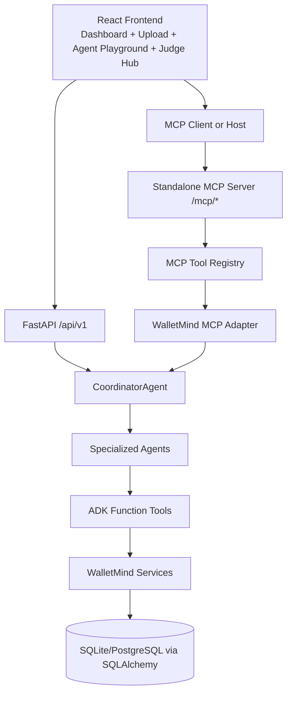
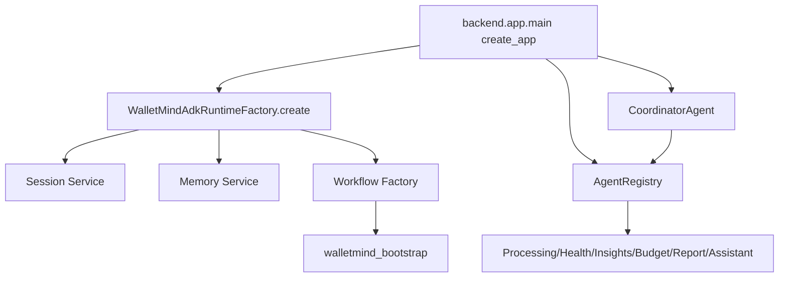
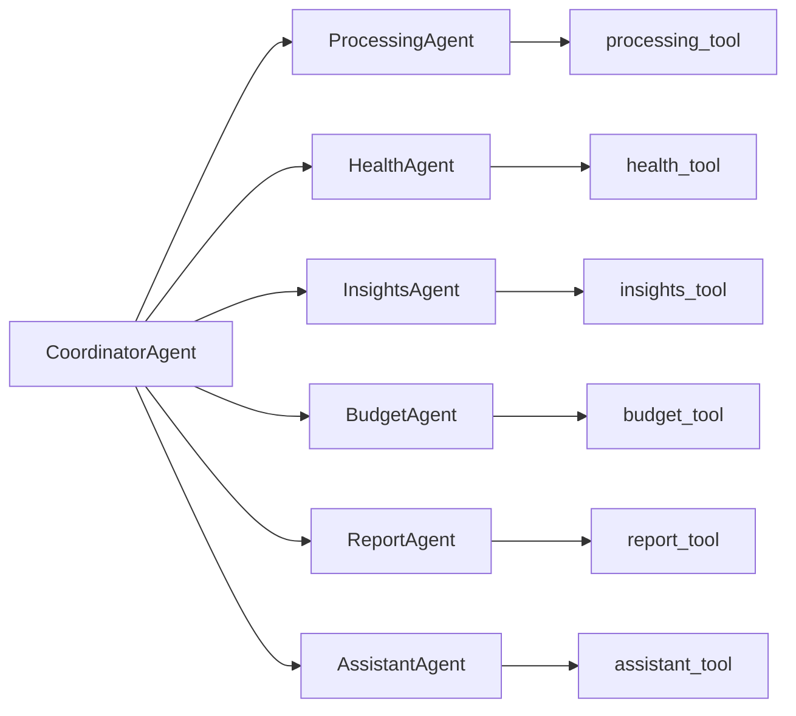
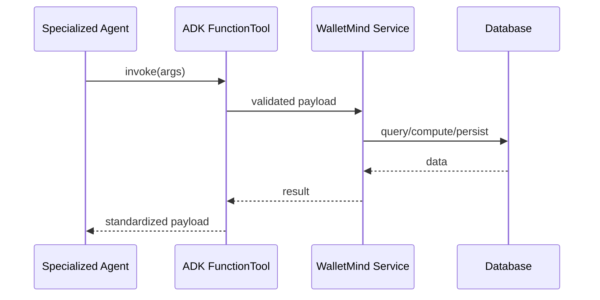
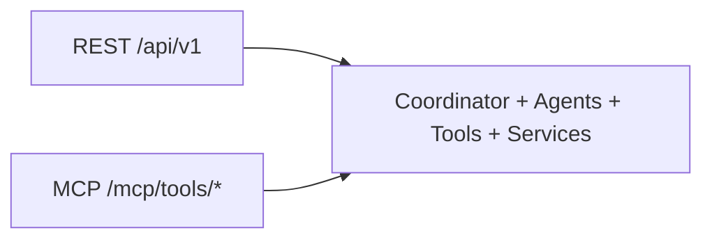
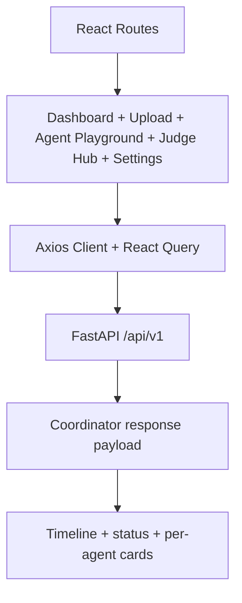
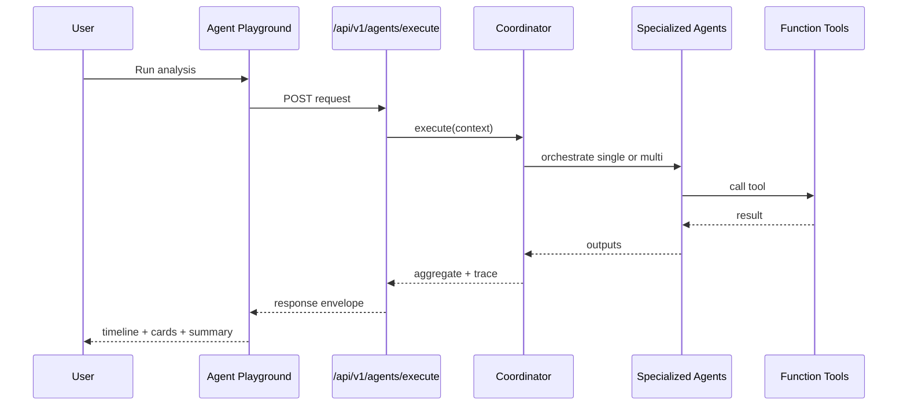

# Architecture (Judge-Friendly)

This document describes WalletMind architecture directly from implementation.

## 1) Overall System Architecture



## 2) ADK Runtime and App Bootstrapping

The FastAPI app creates and wires:

- ADK runtime via `WalletMindAdkRuntimeFactory`.
- Session and memory service factories.
- A workflow factory (current workflow graph is a bootstrap skeleton node).
- Agent registry and coordinator.



## 3) Coordinator Decision Flow

`POST /api/v1/agents/execute` resolves statement context and calls coordinator orchestration.

```mermaid
flowchart TD
    REQ[Request: query + user/session + inputs] --> RESOLVE[Resolve statement_uuid]
    RESOLVE --> INTENT[Intent and capability detection]
    INTENT --> MODE{Execution mode}
    MODE -->|single| SINGLE[Select one specialized agent]
    MODE -->|multi| MULTI[Plan multi-agent execution]
    SINGLE --> EXEC[Execute agent(s) via registry]
    MULTI --> EXEC
    EXEC --> AGG[Aggregate outputs + trace + metadata]
    AGG --> RESP[ApiResponse envelope]
```

## 4) Specialized Agent Topology



## 5) Function Tool Boundary

Function Tools are deterministic wrappers from ADK agents into service calls.



## 6) MCP Architecture

MCP server runs independently and reuses WalletMind capabilities through registry and adapter composition.

```mermaid
flowchart TD
    HOST[MCP Consumer Host] --> API[/mcp/* endpoints]
    API --> INFRA[MCPInfrastructureServer]
    INFRA --> TOOLS[MCP Tool Registry]
    INFRA --> ADAPTER[WalletMind MCP Adapter]
    ADAPTER --> WTOOLS[analyze_finances + WalletMind tools]
    WTOOLS --> COORD[CoordinatorAgent]
```

## 7) REST and MCP Shared Core

Both interfaces call the same orchestration and service layers.



## 8) Frontend Architecture



## Execution Timeline (What Judges See)



## Key Implementation Files

- Coordinator: `backend/app/agents/coordinator_agent.py`
- Agent endpoint: `backend/app/routers/agents.py`
- Runtime factory: `backend/app/adk/runtime.py`
- Workflow factory: `backend/app/adk/workflow.py`
- Specialized agents: `backend/app/agents/*_agent.py`
- Function tools: `backend/app/tools/`
- MCP server: `backend/app/mcp/server.py`
- MCP adapter and registry: `backend/app/mcp/adapter.py`, `backend/app/mcp/registry.py`
- Frontend orchestration UI: `frontend/src/pages/app-agent-playground-page.tsx`
- Frontend judge hub: `frontend/src/pages/judge-hub-page.tsx`
