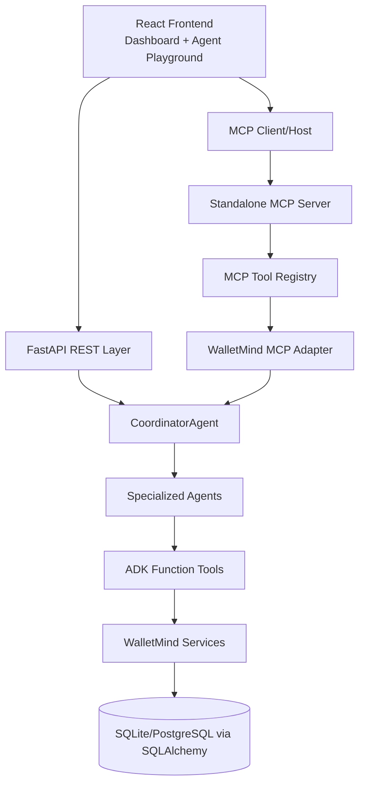
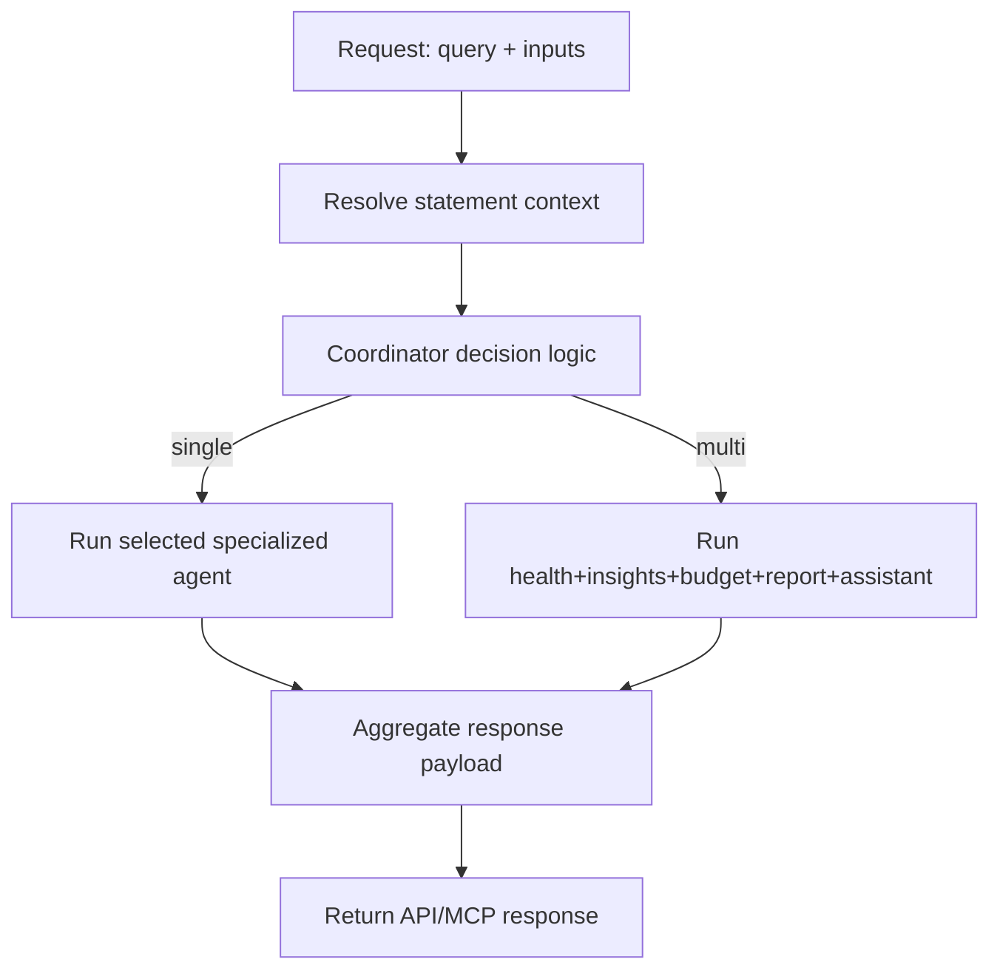
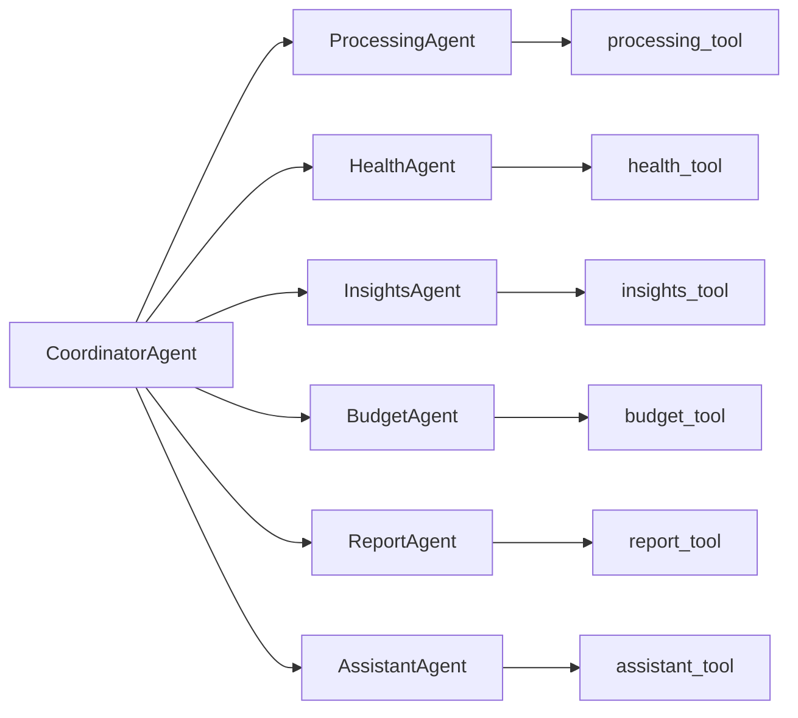
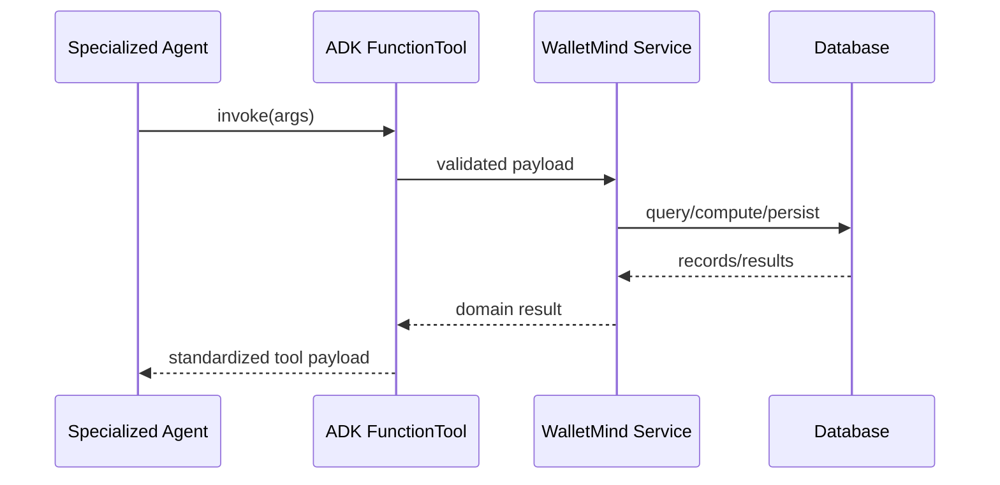
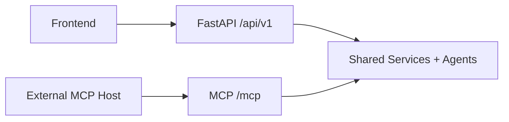
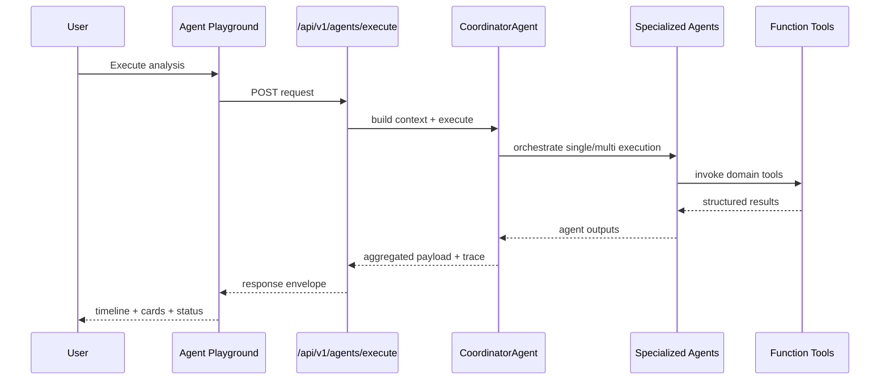

# Architecture (Judge-Friendly)

This document explains WalletMind architecture from request entry to data persistence.

## Overall Architecture



## FastAPI Layer

FastAPI provides versioned REST APIs at `/api/v1`.

Responsibilities:

- Input validation (Pydantic schemas).
- Routing for statements, assistant, AI health, and coordinator execution.
- Dependency injection for services and coordinator runtime.

## Coordinator Layer

`CoordinatorAgent` is the orchestration entry point for intelligent execution.

Responsibilities:

- Parse user intent and route execution mode.
- Decide single-agent vs multi-agent strategy.
- Aggregate specialized agent outputs.
- Produce decision metadata and execution trace.

### Coordinator Workflow



## Specialized Agent Layer

Specialized agents encapsulate one financial domain each:

- `ProcessingAgent`
- `HealthAgent`
- `InsightsAgent`
- `BudgetAgent`
- `ReportAgent`
- `AssistantAgent`

### Specialized Agent Topology



## ADK Function Tools Layer

Function Tools are the deterministic invocation boundary between agents and business services.

### Function Tool Flow



## WalletMind Services Layer

Domain services execute business and analytics logic:

- statement ingestion and processing
- transaction retrieval
- financial health computation
- spending insight generation
- budget recommendation generation
- monthly report assembly
- retrieval-grounded assistant responses

## Database Layer

SQLAlchemy-backed storage persists:

- users
- statements
- transactions
- analysis artifacts

## MCP Architecture

MCP runs independently from main FastAPI app and reuses WalletMind capabilities through adapter/registry composition.

### MCP Architecture Diagram

```mermaid
flowchart TD
    Host[MCP Consumer Host] --> MCPHTTP[/mcp/* endpoints]
    MCPHTTP --> Infra[MCPInfrastructureServer]
    Infra --> Registry[MCPToolRegistry]
    Infra --> Adapter[WalletMindMCPAdapter]
    Adapter --> Tools[Registered WalletMind Tools]
    Tools --> Coordinator[CoordinatorAgent]
```

## REST + MCP Coexistence

Both interfaces coexist without changing business logic.



## Execution Timeline Diagram


