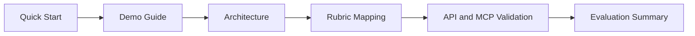

# Judge Hub: WalletMind

This folder provides a judge-first evaluation path with direct links to architecture, API validation, demo scenarios, and rubric evidence.

## Fast Evaluation Path (10 to 20 minutes)

1. Start services using [Quick Start](./QUICK_START.md).
2. Run Scenario 1 and Scenario 4 from [Demo Guide](./DEMO_GUIDE.md).
3. Confirm implementation details in [Architecture](./ARCHITECTURE.md).
4. Verify score evidence in [Rubric Mapping](./RUBRIC_MAPPING.md).
5. Spot-check API and MCP contracts in [API Examples](./API_EXAMPLES.md).

## Evaluation Flow

## Documentation Map

| Section            | Purpose                          | Link                             | Review Time |
| ------------------ | -------------------------------- | -------------------------------- | ----------- |
| Quick Start        | Run backend, frontend, MCP       | [Open](./QUICK_START.md)         | 3 min       |
| Architecture       | Code-derived system diagrams     | [Open](./ARCHITECTURE.md)        | 4 min       |
| Demo Guide         | Scenario-based judge walkthrough | [Open](./DEMO_GUIDE.md)          | 5 min       |
| Rubric Mapping     | Requirement-to-evidence matrix   | [Open](./RUBRIC_MAPPING.md)      | 3 min       |
| API Examples       | REST and MCP request samples     | [Open](./API_EXAMPLES.md)        | 3 min       |
| Evaluation Summary | Capstone concept checklist       | [Open](./EVALUATION_SUMMARY.md)  | 2 min       |
| Judge Checklist    | Final pass checklist             | [Open](./JUDGE_CHECKLIST.md)     | 2 min       |
| Screenshots Index  | Required screenshot inventory    | [Open](../screenshots/README.md) | 1 min       |

## Runtime Endpoints

- Frontend Judge Hub: http://localhost:5173/app/judge
- Frontend Agent Playground: http://localhost:5173/app/agent-playground
- REST Swagger: http://127.0.0.1:8000/docs
- MCP Swagger: http://127.0.0.1:8100/docs

## Primary Evidence Anchors

- Coordinator orchestration: `backend/app/agents/coordinator_agent.py`
- Agent execution endpoint: `backend/app/routers/agents.py`
- Runtime and workflow factory: `backend/app/adk/runtime.py`, `backend/app/adk/workflow.py`
- MCP infrastructure: `backend/app/mcp/server.py`, `backend/app/mcp/adapter.py`, `backend/app/mcp/registry.py`
- Agent Playground UI: `frontend/src/pages/app-agent-playground-page.tsx`
- Judge Hub UI: `frontend/src/pages/judge-hub-page.tsx`
