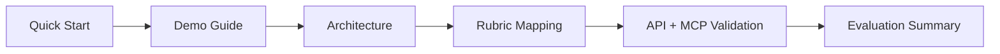

# Judge Hub: WalletMind

Welcome to the central evaluation dashboard for WalletMind.

This page is designed for first-time capstone reviewers who want a fast path through architecture, execution evidence, APIs, and rubric alignment.

## Quick Evaluation

1. Follow [📘 Quick Start](./QUICK_START.md) to run backend, frontend, and MCP.
2. Run [▶ Demo Guide](./DEMO_GUIDE.md) Scenario 1 and Scenario 4.
3. Validate architecture and rubric evidence with [🏗 Architecture](./ARCHITECTURE.md) and [🎯 Rubric Mapping](./RUBRIC_MAPPING.md).
4. Spot-check contracts with [🧪 API Examples](./API_EXAMPLES.md).

Expected total review time: 10 to 20 minutes.

## Evaluation Flow

## Documentation Map

| Section | Description | Link | Expected Review Time |
| --- | --- | --- | --- |
| 📘 Quick Start | Launch backend, frontend, and MCP quickly. | [Open](./QUICK_START.md) | 3 min |
| 🏗 Architecture | Coordinator, agents, tools, and MCP diagrams. | [Open](./ARCHITECTURE.md) | 4 min |
| ▶ Demo Guide | Scenario-based evaluator walkthrough. | [Open](./DEMO_GUIDE.md) | 5 min |
| 🎯 Rubric Mapping | Direct scorecard-to-evidence mapping. | [Open](./RUBRIC_MAPPING.md) | 3 min |
| 🧪 API Examples | Copy-paste REST and MCP validation calls. | [Open](./API_EXAMPLES.md) | 3 min |
| 📑 Evaluation Summary | One-page implementation cheat sheet. | [Open](./EVALUATION_SUMMARY.md) | 2 min |
| ✅ Judge Checklist | Fast completion checklist during review. | [Open](./JUDGE_CHECKLIST.md) | 2 min |
| 🖼 Screenshots | Required screenshot inventory and naming. | [Open](../screenshots/README.md) | 1 min |

## Architecture

| Item | Description | Link | Expected Review Time |
| --- | --- | --- | --- |
| 🧠 Coordinator | Intent routing, strategy, and aggregation. | [Coordinator View](./ARCHITECTURE.md) | 2 min |
| 🤖 Specialized Agents | Domain-specific execution model. | [Agent Topology](./ARCHITECTURE.md) | 2 min |
| 🛠 Function Tools | Deterministic tool boundary to services. | [Tool Flow](./ARCHITECTURE.md) | 1 min |
| 🔌 MCP Layer | Adapter + registry + standalone server. | [MCP Architecture](./ARCHITECTURE.md) | 2 min |

## Demo

| Item | Description | Link | Expected Review Time |
| --- | --- | --- | --- |
| ▶ End-to-End Demo | Upload to dashboard to coordinator timeline flow. | [Scenario 1](./DEMO_GUIDE.md) | 4 min |
| ▶ Multi-Agent Demo | Planner decomposition across specialized agents. | [Scenario 4](./DEMO_GUIDE.md) | 3 min |

## API

| Item | Description | Link | Expected Review Time |
| --- | --- | --- | --- |
| 🧪 REST Samples | Validate health, insights, budget, report, assistant, and coordinator endpoints. | [API Examples](./API_EXAMPLES.md) | 3 min |

## Swagger

| Item | Description | Link | Expected Review Time |
| --- | --- | --- | --- |
| 📗 REST Swagger | Interactive backend API documentation. | `http://127.0.0.1:8000/docs` | 2 min |

## MCP

| Item | Description | Link | Expected Review Time |
| --- | --- | --- | --- |
| 🔗 MCP Swagger | Interactive MCP infrastructure documentation. | `http://127.0.0.1:8100/docs` | 2 min |
| 🔍 MCP Discovery | Verify registered WalletMind tools. | [API Examples](./API_EXAMPLES.md) | 1 min |

## Agent Playground

| Item | Description | Link | Expected Review Time |
| --- | --- | --- | --- |
| 🎮 Agent Playground | Execute coordinator flows and inspect timeline + per-agent outputs. | `http://127.0.0.1:5173/app/agent-playground` | 3 min |

## Judge Hub

| Item | Description | Link | Expected Review Time |
| --- | --- | --- | --- |
| 🧭 Judge Hub UI | Frontend evaluator-oriented navigation experience. | `http://127.0.0.1:5173/app/judge` | 2 min |

## Rubric Mapping

| Item | Description | Link | Expected Review Time |
| --- | --- | --- | --- |
| 🎯 Evidence Matrix | Requirement-to-file mapping for scoring confidence. | [Rubric Mapping](./RUBRIC_MAPPING.md) | 3 min |

## Evaluation Summary

| Item | Description | Link | Expected Review Time |
| --- | --- | --- | --- |
| 📑 Cheat Sheet | Compact checklist of implemented capstone concepts. | [Evaluation Summary](./EVALUATION_SUMMARY.md) | 2 min |
