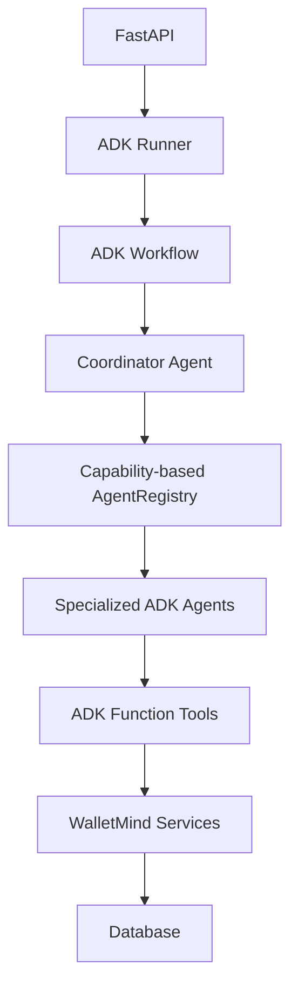

# Multi-Agent Architecture

## Overview

WalletMind multi-agent orchestration uses Google ADK runtime components with a
single coordinator that discovers specialized agents by capabilities.

## Layering

FastAPI
-> Google ADK Runner
-> Google ADK Workflow
-> Coordinator Agent
-> Capability-based Agent Registry
-> Specialized ADK Agents
-> Google ADK Function Tools
-> Existing WalletMind Services
-> Database

## Coordinator Responsibilities

The coordinator is the only orchestration intelligence component and handles:

- Intent recognition
- Capability resolution
- Agent discovery through AgentRegistry
- Workflow plan creation
- Specialized agent execution
- Execution trace collection
- Decision record generation
- Aggregation and failure isolation

The coordinator does not perform business logic, financial calculations,
database access, or direct service invocations.

## Workflow Design

The coordinator exposes a transport-agnostic workflow descriptor per execution.
Current strategy is sequential execution with explicit metadata for:

- Future parallel execution support
- Retry support
- Failure isolation support

## Capability Routing

Coordinator resolves user intent to a capability list, then queries AgentRegistry
with `discover_by_capability()` to select agents.

Examples:

- health intent -> financial_health
- budgeting intent -> budget
- analysis intent -> financial_health, insights, budget, monthly_report, chat

## Execution Modes

- Single-agent mode: one capability, one selected specialized agent.
- Multi-agent mode: ordered capability pipeline for full analysis.

## Smart Statement Resolution

`POST /api/v1/agents/execute` supports smart context resolution:

- If `inputs.statement_uuid` exists, it is used directly.
- If missing, WalletMind resolves the most recent processed statement through
  existing `StatementUploadService` methods (no direct database access).
- If multiple processed statements exist, the API returns a structured 422
  validation response listing selectable candidates.
- Coordinator execution does not silently guess statement selection.

## Decision Record

Each orchestration includes a decision record with:

- intent
- capabilities
- selected_agents
- reason
- execution_mode
- execution_timestamp

## Execution Trace

Each execution trace step includes:

- agent_name
- status
- started_at
- ended_at
- duration_ms
- execution_order
- error

## Aggregation

Coordinator returns a structured payload containing:

- overall_status
- decision_record
- execution_trace
- individual_agent_results
- metadata

Aggregation is orchestration-only and does not alter business semantics.

## Architecture Diagram

