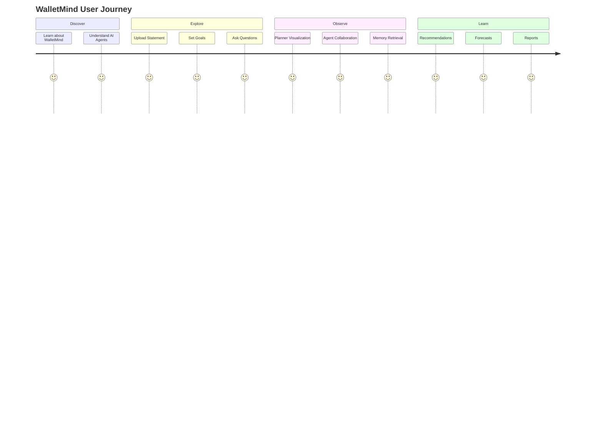
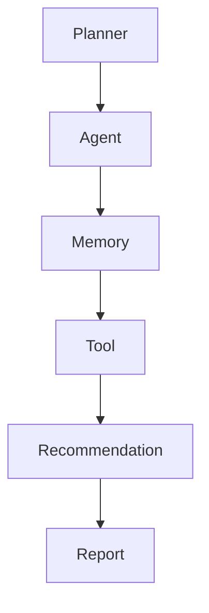
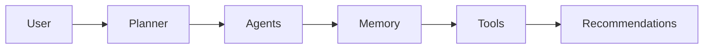
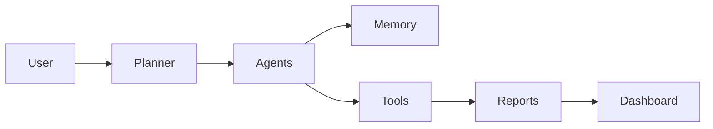
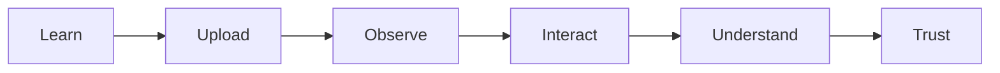
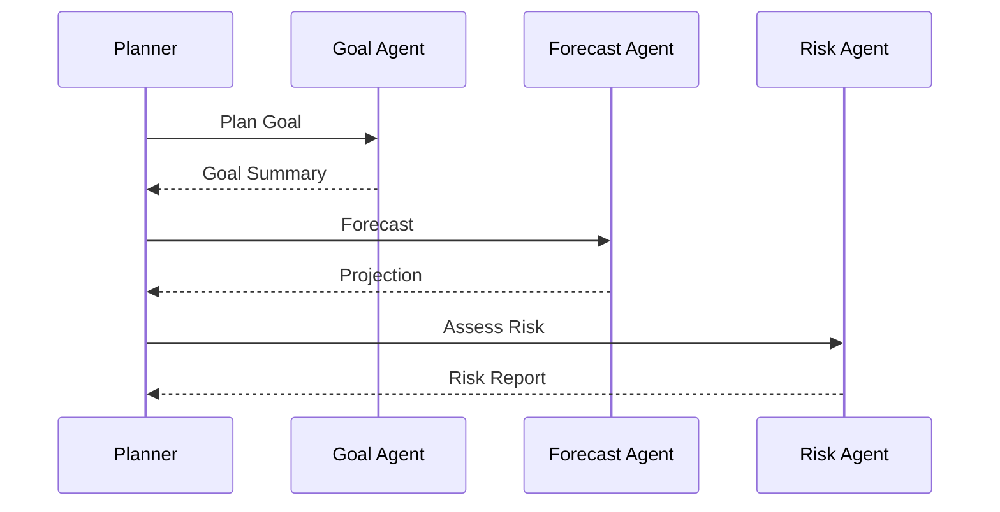
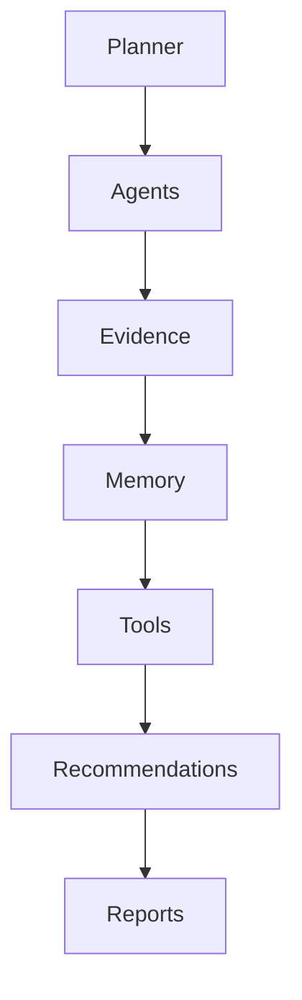

# Notebook Storyboard

**Document:** `docs/notebook/storyboard.md`

---

# Part I — Notebook Vision & Storytelling Philosophy

> **Purpose**
>
> This document defines the complete storytelling experience for the WalletMind Kaggle notebook.
>
> Unlike a traditional machine learning notebook or technical walkthrough, WalletMind's notebook is designed as an **interactive AI product demonstration**.
>
> Every section should help judges understand not only **what WalletMind does**, but **how it reasons**, **why it makes decisions**, and **how Google's Agent Development Kit (ADK) architectural principles are applied**.
>
> The notebook is the primary presentation artifact of the project and should feel like a guided product experience rather than a sequence of code cells.

---

# Table of Contents

## Part I — Vision & Storytelling Philosophy

1. Notebook Purpose
2. Storytelling Philosophy
3. Competition Objectives
4. Notebook Design Principles
5. User Journey
6. Judge Journey
7. Narrative Architecture
8. Notebook Experience Flow
9. Interaction Philosophy
10. Visual Design Guidelines
11. Explainability Philosophy
12. Google ADK Mapping
13. Kaggle Competition Mapping

---

# 1. Notebook Purpose

The WalletMind notebook has one primary objective:

> Demonstrate a modern Planner-driven, Multi-Agent AI system solving real financial planning problems in an explainable and engaging way.

The notebook should never feel like:

- a software demo
- an API tutorial
- a collection of code snippets
- a research paper
- a static report

Instead, it should feel like interacting with an intelligent financial planning assistant.

The notebook becomes the **product experience**.

---

## Primary Goals

The notebook should:

- educate
- impress
- explain
- visualize reasoning
- demonstrate architecture
- showcase engineering quality
- remain reproducible

---

# 2. Storytelling Philosophy

WalletMind tells a story.

The story is not about code.

The story is about **AI reasoning**.

Instead of asking:

> "How do we execute code?"

The notebook asks:

> "How does an intelligent financial AI think?"

The narrative follows a natural progression.

```mermaid
flowchart LR

Problem

-->

Understanding

-->

Planning

-->

Reasoning

-->

Memory

-->

Tools

-->

Insights

-->

Recommendations

-->

Future Planning
```

Every notebook section advances this story.

---

## Guiding Narrative

The notebook should make judges feel like they are watching an AI financial advisor think aloud.

Instead of hidden reasoning:

```
User Question

↓

Answer
```

WalletMind reveals:

```
User Question

↓

Planner Thinking

↓

Agent Collaboration

↓

Memory Retrieval

↓

Tool Usage

↓

Validation

↓

Recommendation

↓

Explanation
```

Transparency becomes part of the experience.

---

# 3. Competition Objectives

The notebook is optimized specifically for the Google Kaggle **AI Agents: Intensive Vibe Coding Capstone Project**.

Rather than maximizing technical complexity, it maximizes architectural clarity.

The notebook should clearly demonstrate:

| Competition Objective     | Notebook Focus               |
| ------------------------- | ---------------------------- |
| Planner Intelligence      | Visible orchestration        |
| Multi-Agent Collaboration | Agent execution timeline     |
| Memory                    | Persistent personalization   |
| MCP                       | External capability usage    |
| Explainability            | Reasoning traces             |
| Educational Value         | Architecture explanations    |
| Reproducibility           | Deterministic demonstrations |

Every notebook section should reinforce at least one competition objective.

---

# 4. Notebook Design Principles

The notebook follows six design principles.

---

## Principle 1 — Story Before Technology

Every visualization should answer:

> Why does this matter?

before explaining:

> How was it implemented?

---

## Principle 2 — Architecture is Visible

Architecture should never remain hidden.

Judges should continuously see:

- Planner
- Agents
- Memory
- Tools
- Reports

working together.

---

## Principle 3 — Progressive Disclosure

Do not overwhelm users immediately.

Reveal complexity gradually.

Example:

```
Problem

↓

Planner

↓

Agents

↓

Memory

↓

Tools

↓

Reports
```

Each section introduces one major concept.

---

## Principle 4 — Interactive Exploration

Readers should explore rather than simply observe.

Possible interactions include:

- uploading statements
- changing goals
- selecting scenarios
- viewing planner traces
- inspecting memory
- comparing forecasts

---

## Principle 5 — Explain Everything

Every AI decision should answer:

- Why?
- Which agent?
- Which evidence?
- Which assumptions?
- How confident?

---

## Principle 6 — Notebook First

Every architectural capability should become visible somewhere inside the notebook.

Hidden capabilities have little educational value.

---

# 5. User Journey

Although designed for Kaggle judges, the notebook should simulate the experience of a real WalletMind user.



The notebook should feel like onboarding into an intelligent AI system.

---

# 6. Judge Journey

The notebook is ultimately evaluated by judges.

Their experience differs slightly from that of a typical user.

The notebook should continuously answer:

- What problem exists?
- Why AI agents?
- Why Planner-driven reasoning?
- Why multiple agents?
- Why memory?
- Why MCP?
- Why explainability?

---

## Judge Narrative

```text
Interesting Problem

↓

Elegant Architecture

↓

Planner Intelligence

↓

Agent Collaboration

↓

Persistent Memory

↓

Tool Integration

↓

Explainable Reasoning

↓

Practical Financial Advice

↓

Well Engineered Solution
```

Every section should strengthen confidence in the overall architecture.

---

# 7. Narrative Architecture

The notebook should behave like a guided product tour.

```mermaid
flowchart TD

Welcome

-->

Problem

-->

Architecture

-->

Product Demo

-->

Planner

-->

Agents

-->

Memory

-->

Tools

-->

Reports

-->

Dashboard

-->

Scenario Simulation

-->

Evaluation

-->

Conclusion
```

The narrative should transition smoothly between sections rather than feeling like independent notebook cells.

---

## Storytelling Layers

WalletMind presents three parallel stories.

### Story 1

The user's financial journey.

### Story 2

The AI's reasoning journey.

### Story 3

The engineering architecture.

All three should progress simultaneously.

---

# 8. Notebook Experience Flow

The notebook should gradually increase sophistication.

| Stage        | User Experience                     |
| ------------ | ----------------------------------- |
| Introduction | Understand WalletMind               |
| Problem      | Why financial planning is difficult |
| Architecture | Why AI agents help                  |
| Interaction  | Upload financial data               |
| Planner      | Observe orchestration               |
| Agents       | Observe collaboration               |
| Memory       | Observe personalization             |
| Tools        | Observe capability expansion        |
| Reports      | Receive recommendations             |
| Dashboard    | Explore results                     |
| Simulation   | Experiment with scenarios           |
| Conclusion   | Reflect on architecture             |

This gradual progression keeps the notebook engaging.

---

# 9. Interaction Philosophy

The notebook should minimize passive reading.

Instead, encourage exploration.

Potential interactive elements include:

- upload widgets
- dropdown menus
- sliders
- expandable panels
- interactive diagrams
- scenario selectors
- comparison tables

Interaction should reinforce understanding rather than add unnecessary complexity.

---

## Interaction Progression

```text
Observe

↓

Interact

↓

Experiment

↓

Understand

↓

Trust
```

This progression mirrors how users naturally learn.

---

# 10. Visual Design Guidelines

The notebook should maintain a consistent visual language.

---

## Section Headers

Every major section should begin with:

- title
- short explanation
- visual illustration
- expected outcome

---

## Diagrams

Prefer architecture diagrams over large blocks of text.

Examples include:

- Planner flowcharts
- Agent collaboration diagrams
- Memory lifecycle
- Tool interactions
- Execution timelines

---

## Color Philosophy

Use visual emphasis consistently.

Suggested semantic mapping:

| Concept    | Visual Meaning |
| ---------- | -------------- |
| Planner    | Coordination   |
| Agents     | Collaboration  |
| Memory     | Persistence    |
| Tools      | Capability     |
| Reports    | User Value     |
| Validation | Trust          |

The notebook should remain visually clean and uncluttered.

---

# 11. Explainability Philosophy

Explainability is not a single notebook section.

It is a recurring theme.

Every important decision should answer:

- Why?
- How?
- Which evidence?
- Which assumptions?
- Which agents?
- How confident?

---

## Explainability Layers



Each layer contributes additional context.

By the end of the notebook, judges should trust WalletMind because its reasoning has remained transparent throughout.

---

# 12. Google ADK Mapping

The notebook should explicitly demonstrate how WalletMind aligns with Google's Agent Development Kit philosophy.

| Google ADK Concept   | Notebook Demonstration |
| -------------------- | ---------------------- |
| Planner              | Planner visualization  |
| Agent Collaboration  | Execution timeline     |
| Shared Context       | Memory explorer        |
| Tool Usage           | Tool execution trace   |
| Structured Outputs   | Explainable reports    |
| Modular Architecture | Architecture diagrams  |

Rather than discussing ADK abstractly, each concept should be illustrated through interactive notebook experiences.

---

# 13. Kaggle Competition Mapping

Every major notebook section should strengthen one or more judging dimensions.

| Kaggle Evaluation Focus   | Notebook Representation           |
| ------------------------- | --------------------------------- |
| AI Agent Architecture     | Architecture walkthrough          |
| Planner Intelligence      | Planner visualization             |
| Multi-Agent Collaboration | Agent execution dashboard         |
| Memory                    | Memory explorer                   |
| MCP Integration           | Tool & MCP demonstration          |
| Explainability            | Reasoning trace                   |
| Educational Value         | Progressive explanations          |
| Reproducibility           | End-to-end deterministic workflow |

The notebook should conclude with judges understanding not only that WalletMind works, but also why its architecture represents a strong example of modern Planner-driven AI engineering.

---

## Next Part

**Part II — Opening Experience**

The next section designs the opening experience of the notebook as if it were launching an interactive AI product.

It will include:

- Hero section
- Welcome screen
- Problem statement
- Why AI Agents
- Why Planner-driven reasoning
- WalletMind overview
- Architecture preview
- Interactive landing experience
- Visual design
- Images
- Animations
- Judge experience
- Competition storytelling

# Part II — Opening Experience

> **Purpose**
>
> The opening experience establishes the first impression of WalletMind.
>
> Within the first few minutes, judges should understand:
>
> - What WalletMind is
> - Why it exists
> - Why Planner-driven AI Agents are appropriate
> - Why the architecture is different from a traditional chatbot
> - What they are about to experience
>
> This section functions as the **landing page** of the notebook and should feel like launching a polished AI product rather than opening a technical notebook.

---

# Table of Contents

14. Welcome Experience
15. Hero Section
16. Project Overview
17. The Financial Planning Problem
18. Why AI Agents?
19. Why Planner-Driven Reasoning?
20. WalletMind Architecture Preview
21. User Journey Preview
22. Notebook Navigation
23. Judge Experience
24. Competition Mapping

---

# 14. Welcome Experience

## Purpose

Create excitement.

Immediately communicate that WalletMind is **not another budgeting application**.

Instead, present it as an intelligent financial reasoning system.

---

## Experience

The notebook opens with a polished landing page.

```
--------------------------------------------------------

💡 WalletMind

Your Multi-Agent AI Financial Planner

Planner-driven reasoning

Memory-powered personalization

Explainable recommendations

Google ADK inspired architecture

--------------------------------------------------------
```

---

## Expected User Reaction

Instead of thinking:

> "Another finance notebook."

Judges should think:

> "This feels like an AI product."

---

## Visual Components

Hero banner

Architecture illustration

AI agent illustration

Planner illustration

Simple financial dashboard preview

---

## Suggested Images

- WalletMind logo
- Planner-centric architecture graphic
- Financial dashboard mockup
- AI collaboration illustration

---

## Animation (Optional)

Fade-in introduction

```
WalletMind

↓

Planner

↓

Agents

↓

Memory

↓

Recommendations
```

---

# 15. Hero Section

## Purpose

Communicate WalletMind's identity in one screen.

---

## Suggested Layout

```text
---------------------------------------------------

WalletMind

Planner-Driven AI Financial Intelligence

"Helping users understand,
plan, and improve their financial future
through collaborative AI agents."

[ Upload Statement ]

[ Explore Demo ]

---------------------------------------------------
```

---

## Widgets

Optional buttons

- Upload Sample Statement
- Run Interactive Demo
- Learn About Architecture

---

## Visualizations

Minimal animation

Planner icon

Agent icons

Memory icon

Report icon

Connected through arrows

---

## Expected Output

Judges understand:

- WalletMind solves financial planning
- AI agents collaborate
- Everything is explainable

---

# 16. Project Overview

## Purpose

Explain WalletMind in less than two minutes.

Avoid implementation details.

---

## Suggested Content

WalletMind is an AI financial planning assistant that combines:

- Planner-driven orchestration
- Specialized AI agents
- Persistent memory
- Explainable reasoning
- Financial intelligence
- Notebook-first demonstrations

Instead of answering questions directly, WalletMind plans how to solve financial problems.

---

## Visualization



---

## Judge Experience

Judges immediately understand:

Planner

↓

Reasoning

↓

Recommendation

instead of

Prompt

↓

LLM

↓

Answer

---

# 17. The Financial Planning Problem

## Purpose

Explain why traditional financial applications are insufficient.

---

## Suggested Narrative

Modern financial planning requires combining:

- transactions
- goals
- budgets
- future planning
- risk
- cash flow
- user preferences

No single calculation answers these questions.

Instead, they require reasoning.

---

## Visualization

Traditional

```text
Statement

↓

Charts

↓

Done
```

WalletMind

```text
Statement

↓

Planner

↓

Agents

↓

Memory

↓

Simulation

↓

Recommendation
```

---

## Infographic

| Traditional Apps  | WalletMind          |
| ----------------- | ------------------- |
| Static Reports    | Dynamic Planning    |
| Charts            | Reasoning           |
| Rules             | AI Agents           |
| History           | Future Planning     |
| One-Time Analysis | Continuous Learning |

---

## Judge Experience

Understand why AI agents are appropriate.

---

# 18. Why AI Agents?

## Purpose

Introduce specialization.

---

## Suggested Story

No human financial advisor performs every task simultaneously.

Instead, specialists collaborate.

WalletMind mirrors this approach.

---

## Visualization

```mermaid
flowchart TD

Planner

-->

Budget Agent

Planner

-->

Risk Agent

Planner

-->

Forecast Agent

Planner

-->

Financial Coach

Planner

-->

Report Generator
```

---

## Agent Cards

Display attractive cards.

```
Budget Advisor

Optimizes spending

-----------------------

Risk Agent

Identifies vulnerabilities

-----------------------

Forecast Agent

Projects future finances

-----------------------

Coach

Provides personalized advice
```

---

## Animation

Cards appear one by one as Planner activates them.

---

## Expected Output

Judges understand:

Specialization improves reasoning.

---

# 19. Why Planner-Driven Reasoning?

## Purpose

Explain why Planner is the architectural centerpiece.

---

## Suggested Explanation

Without a Planner

```
User

↓

Single Prompt

↓

Single Response
```

With Planner

```
User

↓

Planner

↓

Task Graph

↓

Agent Selection

↓

Execution

↓

Aggregation

↓

Validation

↓

Recommendation
```

---

## Visualization

```mermaid
flowchart TD

Question

-->

Planner

Planner

-->

Capability Discovery

Planner

-->

Task Planning

Planner

-->

Execution Graph

Execution Graph

-->

Agents
```

---

## Interactive Widget

Expandable planner steps.

Example

```
✓ Intent

✓ Goals

✓ Constraints

✓ Capabilities

✓ Task Graph

✓ Validation
```

---

## Judge Experience

Planner becomes understandable before any execution occurs.

---

# 20. WalletMind Architecture Preview

## Purpose

Provide a high-level architectural overview without overwhelming readers.

---

## Visualization



---

## Architecture Cards

Planner

Responsible for orchestration

---

Agents

Responsible for reasoning

---

Memory

Responsible for personalization

---

Tools

Responsible for capabilities

---

Reports

Responsible for explainability

---

## Expected Output

Readers understand system boundaries.

---

# 21. User Journey Preview

## Purpose

Preview what the notebook will demonstrate.

---

## Timeline

```text
Upload Statement

↓

Planner

↓

Agents

↓

Memory

↓

Forecast

↓

Recommendations

↓

Simulation

↓

Chat

↓

Dashboard
```

---

## Visual Roadmap

Use milestone-style progress indicators.

```
✓ Introduction

○ Upload

○ Planner

○ Agents

○ Memory

○ Dashboard

○ Reports
```

---

## Animation

Current section highlighted.

Remaining sections faded.

---

# 22. Notebook Navigation

## Purpose

Prepare readers for the notebook structure.

---

## Interactive Navigation

Large clickable section cards.

```
Architecture

Upload Data

Planner

Agent Execution

Memory

Dashboard

Recommendations

Scenario Simulation

Chat Interface

Evaluation
```

---

## Visual Design

Grid layout

Large icons

Consistent colors

Minimal text

---

## Judge Experience

Feels like navigating an application.

---

# 23. Judge Experience

The opening experience should accomplish the following.

Within 2–3 minutes judges should know:

✓ What WalletMind is

✓ Why it matters

✓ Why Planner architecture matters

✓ Why multiple agents exist

✓ Why memory is useful

✓ Why notebook demonstrations are valuable

✓ Why this architecture differs from conventional LLM applications

---

## Emotional Journey

```text
Curiosity

↓

Understanding

↓

Confidence

↓

Excitement

↓

Engagement
```

The notebook should continuously build confidence in the engineering decisions.

---

# 24. Competition Mapping

Every element of the opening experience intentionally reinforces the competition objectives.

| Notebook Element      | Competition Focus      |
| --------------------- | ---------------------- |
| Hero Section          | Product Vision         |
| Problem Statement     | Real-world relevance   |
| AI Agent Introduction | Multi-Agent Design     |
| Planner Overview      | Google ADK Philosophy  |
| Architecture Preview  | Engineering Excellence |
| User Journey          | Educational Value      |
| Navigation            | Notebook Storytelling  |

---

## Section Summary

At the conclusion of the opening experience, judges should feel they are about to explore a sophisticated AI system rather than read a technical notebook.

The notebook should have established:

- WalletMind's purpose
- the financial planning challenge
- the need for Planner-driven orchestration
- the role of specialized AI agents
- the importance of memory and explainability
- the overall architecture
- the journey that the notebook will guide them through

The next section transitions from explanation to interaction by allowing judges to begin using WalletMind through document upload, planner execution, and live AI reasoning.

---

# Part III — Interactive AI Experience

> **Purpose**
>
> This section transforms the notebook from an architectural presentation into an interactive AI experience.
>
> Rather than simply describing WalletMind, judges begin interacting with it.
>
> Every interaction should expose another layer of the Planner-driven architecture while maintaining the feeling of using an intelligent financial assistant.
>
> The notebook should continuously answer one question:
>
> **"How does WalletMind think?"**

---

# Table of Contents

25. Interactive Experience Philosophy
26. Financial Data Upload
27. Statement Preview
28. Planner Visualization
29. Capability Discovery
30. Task Graph Visualization
31. Live Agent Execution
32. Memory Explorer
33. Tool & MCP Visualization
34. Execution Timeline
35. Judge Experience
36. Competition Mapping

---

# 25. Interactive Experience Philosophy

## Purpose

This marks the transition from explanation to interaction.

The notebook should now behave like a modern AI application.

Instead of reading documentation, judges begin exploring WalletMind.

---

## Story Progression



Each interaction should reveal another architectural layer.

---

## Design Goals

Every interaction should be:

- intuitive
- visual
- explainable
- reproducible
- educational

No interaction should feel like executing notebook cells.

---

# 26. Financial Data Upload

## Purpose

Allow judges to begin using WalletMind naturally.

Uploading a financial statement becomes the catalyst for the entire reasoning pipeline.

---

## Experience

The notebook presents a clean upload interface.

```
--------------------------------------

📄 Upload Financial Statement

Supported

✓ PDF

✓ CSV

✓ Excel

--------------------------------------

[ Upload ]

or

[ Load Sample Dataset ]

--------------------------------------
```

---

## Widgets

Recommended

- File Upload
- Sample Dataset Dropdown
- Example Statements
- Reset Button

---

## Expected Output

After upload:

```
✓ File received

✓ Statement detected

✓ Parsing ready

Planner initialization begins...
```

---

## Visualization

Animated upload progress

↓

Document icon expands

↓

Planner activates

---

## Judge Experience

The notebook immediately feels interactive rather than static.

---

# 27. Statement Preview

## Purpose

Build confidence before reasoning begins.

Users should understand what WalletMind received.

---

## Visualization

Display:

- institution
- statement period
- detected accounts
- transaction count
- currencies
- extraction confidence

---

## Example Layout

```
Statement Summary

Institution

Example Bank

Period

January 2026

Transactions

184

Currency

USD

Parser Confidence

98%
```

---

## Additional Visualization

Mini transaction preview

| Date  | Merchant | Amount |
| ----- | -------- | ------ |
| Jan 4 | Grocery  | -82    |
| Jan 5 | Payroll  | +4200  |
| Jan 8 | Coffee   | -6     |

---

## Charts

Optional

Transaction distribution

Category breakdown

Monthly totals

---

## Judge Experience

Confidence that WalletMind correctly understood the uploaded data.

---

# 28. Planner Visualization

## Purpose

This becomes the centerpiece of the notebook.

Judges should watch the Planner think.

---

## Visualization

```mermaid
flowchart TD

User Goal

-->

Intent Detection

-->

Goal Extraction

-->

Capability Discovery

-->

Task Graph

-->

Execution Plan
```

---

## Planner Dashboard

Display

Intent

Planning

Goals

Buy Home

Capabilities

Forecast

Risk

Budget

Execution Mode

Parallel

Status

Planning...

---

## Animation

Planner steps illuminate sequentially.

```
Intent

✓

↓

Goals

✓

↓

Capabilities

✓

↓

Execution Graph

✓
```

---

## Interactive Widget

Expandable Planner reasoning.

```
▼ Why did Planner select Forecast Agent?

▼ Why Risk Agent?

▼ Why Budget Agent?
```

---

## Expected Output

Judges understand:

- Planner reasoning
- execution strategy
- orchestration logic

---

# 29. Capability Discovery

## Purpose

Explain how Planner converts goals into capabilities.

---

## Visualization


---

## Example

```
Goal

Buy Home

↓

Capabilities

Cash Flow

Risk

Savings

↓

Agents

Forecast

Risk

Goal Planning
```

---

## Capability Cards

```
Cash Flow

Required

-------------------

Risk

Required

-------------------

Scenario Simulation

Optional
```

---

## Animation

Capabilities appear before agents.

This reinforces:

Planner chooses capabilities first.

---

## Judge Experience

Highlights modular architecture.

---

# 30. Task Graph Visualization

## Purpose

Demonstrate Planner orchestration.

---

## Visualization

```mermaid
graph TD

Planner

-->

Goal Planning

Planner

-->

Budget

Planner

-->

Forecast

Forecast

-->

Risk

Risk

-->

Recommendation

Recommendation

-->

Report
```

---

## Interactive Graph

Nodes highlight during execution.

Completed nodes

Green

Running

Blue

Pending

Gray

---

## Widget

Execution speed slider

Allows replay.

---

## Expected Output

Judges understand dependency management.

---

# 31. Live Agent Execution

## Purpose

Visualize collaborative reasoning.

---

## Agent Dashboard

```
Planner

↓

Goal Planning Agent

Running

↓

Budget Agent

Completed

↓

Forecast Agent

Running

↓

Risk Agent

Waiting
```

---

## Agent Cards

Each displays:

Purpose

Confidence

Evidence

Status

Execution Time

---

## Example

```
Budget Advisor

Status

Complete

Confidence

94%

Evidence

Budget imbalance detected
```

---

## Animation

Cards activate in execution order.

---

## Sequence Diagram



---

## Judge Experience

Feels like observing a collaborative AI team.

---

# 32. Memory Explorer

## Purpose

Reveal WalletMind's persistent memory.

---

## Visualization

Memory timeline

```
Goal

Buy Home

↓

Preference

Conservative Investor

↓

Budget

Monthly Savings

↓

Conversation Summary
```

---

## Interactive Widget

Expandable memory records.

```
▼ Goals

▼ Preferences

▼ Financial Profile

▼ Reports

▼ Feedback
```

---

## Memory Update Animation

```
Planner

↓

Memory Update

↓

Stored

↓

Future Retrieval
```

---

## Expected Output

Judges understand:

WalletMind remembers meaningful information.

---

# 33. Tool & MCP Visualization

## Purpose

Show how external capabilities integrate into reasoning.

---

## Visualization

```mermaid
flowchart LR

Planner

-->

Agent

-->

Tool Registry

Tool Registry

-->

Document Parser

Tool Registry

-->

Forecast Tool

Tool Registry

-->

MCP Service

MCP Service

-->

Agent
```

---

## Dashboard

Display:

Selected Tool

Reason

Execution Time

Returned Artifact

Validation

---

## Example

```
Tool

PDF Parser

Purpose

Extract Transactions

Status

Completed

Confidence

99%
```

---

## MCP Panel

```
Connected Services

✓ Financial Search

✓ Document Service

✓ Storage
```

---

## Judge Experience

Illustrates extensibility without overwhelming detail.

---

# 34. Execution Timeline

## Purpose

Summarize the complete AI reasoning process in a single visual.

---

## Timeline

```text
Upload

↓

Planner

↓

Capabilities

↓

Agents

↓

Memory

↓

Tools

↓

Validation

↓

Recommendations

↓

Report
```

---

## Interactive Timeline

Each stage expands to reveal:

- inputs
- outputs
- participating agents
- execution duration
- evidence

---

## Dashboard Metrics

Display:

Planner Decisions

6

Agents

5

Tools

3

Memory Records

4

Execution Time

4.2 seconds

Confidence

93%

---

## Animation

Timeline progresses automatically during execution.

---

# 35. Judge Experience

By this point judges should feel they are interacting with an intelligent financial reasoning platform.

They should understand:

✓ Planner orchestration

✓ Agent specialization

✓ Capability discovery

✓ Memory retrieval

✓ Tool execution

✓ MCP integration

✓ Explainable reasoning

without reading implementation details.

---

## Emotional Journey

```text
Interaction

↓

Curiosity

↓

Discovery

↓

Understanding

↓

Confidence

↓

Engagement
```

The notebook should maintain momentum toward the financial insights presented in the following sections.

---

# 36. Competition Mapping

| Interactive Component | Competition Objective    |
| --------------------- | ------------------------ |
| Upload Experience     | Real-world usability     |
| Statement Preview     | Data understanding       |
| Planner Visualization | Google ADK orchestration |
| Capability Discovery  | Planner intelligence     |
| Task Graph            | Multi-agent planning     |
| Live Agent Execution  | Agent collaboration      |
| Memory Explorer       | Persistent context       |
| Tool & MCP Panel      | External capabilities    |
| Execution Timeline    | Explainability           |
| Interactive Widgets   | Educational value        |

---

# Section Summary

At the conclusion of the Interactive AI Experience, judges should no longer perceive WalletMind as a notebook.

Instead, it should feel like an interactive AI application that transparently exposes its internal reasoning architecture.

The notebook has now demonstrated:

- financial document ingestion
- Planner-driven orchestration
- capability discovery
- collaborative agent execution
- persistent memory
- tool integration
- explainable execution flow

The remaining notebook sections will shift attention from **how WalletMind reasons** to **what financial value that reasoning produces**, including dashboards, recommendations, scenario simulations, conversational interaction, evaluation, and final reflections.

---

## Next Part

**Part IV — Financial Intelligence Experience**

This section designs the user-facing intelligence layer of WalletMind, including:

- Financial dashboard
- Spending analytics
- Goal tracking
- Cash flow forecasts
- Risk analysis
- Recommendations
- Explainability panels
- Scenario simulation
- AI chat interface
- Interactive financial exploration
- Visual storytelling optimized for Kaggle judging

# Part IV — Financial Intelligence Experience

> **Purpose**
>
> This section represents the climax of the WalletMind notebook.
>
> Up to this point, judges have observed _how_ WalletMind reasons.
>
> This section demonstrates _why that reasoning matters_ by transforming planner outputs into actionable financial intelligence.
>
> Instead of showing raw AI outputs, WalletMind presents polished, explainable financial insights through an interactive dashboard that feels like a modern AI product.

---

# Table of Contents

37. Financial Intelligence Philosophy
38. AI Financial Dashboard
39. Spending Intelligence
40. Budget Analysis
41. Goal Planning Dashboard
42. Cash Flow Forecast
43. Risk Intelligence
44. Recommendation Center
45. Explainability Panel
46. Scenario Simulation
47. AI Financial Chat
48. Judge Experience
49. Competition Mapping

---

# 37. Financial Intelligence Philosophy

## Purpose

This section answers the user's ultimate question:

> **"What should I do next?"**

Rather than exposing intermediate reasoning artifacts, WalletMind synthesizes them into meaningful financial guidance.

The notebook shifts from architecture to value.

---

## Narrative Transition

```mermaid
flowchart LR

Planner

-->

Agents

-->

Memory

-->

Evidence

-->

Insights

-->

Recommendations

-->

User Decisions
```

The notebook should now feel less like an engineering demonstration and more like a financial planning experience.

---

## Design Goals

Every visualization should be:

- actionable
- explainable
- personalized
- interactive
- visually intuitive
- directly traceable to Planner reasoning

---

# 38. AI Financial Dashboard

## Purpose

Provide a unified overview of the user's financial health.

This dashboard becomes the "home screen" of WalletMind.

---

## Layout

```
-----------------------------------------------------

WalletMind Financial Dashboard

Financial Health Score

82 / 100

Monthly Savings

$1,240

Goal Progress

64%

Projected Savings

$72,000

Risk Level

Medium

Planner Confidence

94%

-----------------------------------------------------
```

---

## Dashboard Cards

Recommended cards include:

- Financial Health Score
- Monthly Income
- Monthly Expenses
- Savings Rate
- Cash Flow
- Active Goals
- Forecast Confidence
- Planner Confidence
- Recommendation Count

---

## Charts

Recommended charts:

- Income vs Expenses
- Spending Categories
- Monthly Cash Flow
- Goal Progress
- Savings Growth
- Forecast Timeline

---

## Widgets

- Time Range Selector
- Goal Selector
- Currency Selector
- Refresh Analysis
- Export Report

---

## Expected Output

Judges immediately understand the user's financial situation without reading detailed reports.

---

# 39. Spending Intelligence

## Purpose

Transform raw transaction data into explainable spending insights.

---

## Visualization

Pie Chart

```
Housing

35%

Food

18%

Transportation

12%

Entertainment

10%

Savings

25%
```

---

## Additional Charts

- Monthly Spending Trend
- Top Merchants
- Spending Heatmap
- Daily Spending Calendar
- Category Comparison

---

## Interactive Widgets

- Category Filter
- Merchant Search
- Date Range
- Expense Threshold Slider

---

## AI Insights Panel

Example:

```
Planner Insight

Dining expenses increased by 22%
compared to the previous month.

Expense Intelligence Agent identified
three recurring subscription services
that may be unnecessary.
```

---

## Judge Experience

Demonstrates that WalletMind produces reasoning rather than simple visualizations.

---

# 40. Budget Analysis

## Purpose

Explain how WalletMind evaluates budgeting behavior.

---

## Visualization

```mermaid
flowchart LR

Transactions

-->

Budget Analysis

-->

Budget Advisor

-->

Recommendations
```

---

## Dashboard

Display:

Budget

Actual Spending

Difference

Recommendation

---

Example

| Category      | Budget | Actual | Status |
| ------------- | ------ | ------ | ------ |
| Food          | 500    | 610    | ⚠      |
| Housing       | 1400   | 1390   | ✓      |
| Entertainment | 300    | 420    | ⚠      |

---

## Charts

- Budget vs Actual
- Monthly Budget Trend
- Savings Allocation
- Overspending Timeline

---

## Planner Explanation

```
Budget Advisor selected because
Planner identified spending optimization
as a required capability.
```

---

# 41. Goal Planning Dashboard

## Purpose

Visualize long-term financial objectives.

---

## Dashboard

Example

```
Goal

Buy Home

Progress

64%

Projected Completion

April 2031

Confidence

91%
```

---

## Goal Timeline

```text
Today

↓

Savings

↓

Investment

↓

Target

↓

Goal Achieved
```

---

## Interactive Widgets

- Goal Editor
- Add Goal
- Modify Timeline
- Adjust Monthly Savings

---

## Charts

- Goal Progress
- Milestone Timeline
- Savings Projection
- Multi-Goal Comparison

---

## AI Insights

```
Goal Planning Agent recommends
increasing monthly savings by $250
to reach your target six months earlier.
```

---

# 42. Cash Flow Forecast

## Purpose

Allow judges to see WalletMind reason about the future.

---

## Visualization

Forecast Line Chart

```
Balance

^

|

|

|_________

+------------------>

Months
```

---

## Forecast Dashboard

Display

Current Savings

Future Savings

Projected Income

Projected Expenses

Forecast Confidence

---

## Interactive Widgets

- Forecast Duration
- Inflation Assumption
- Salary Increase
- Savings Rate

---

## Scenario Comparison

```
Current Plan

↓

72k

Improved Savings

↓

89k

Reduced Expenses

↓

95k
```

---

## Judge Experience

Demonstrates predictive reasoning rather than descriptive analytics.

---

# 43. Risk Intelligence

## Purpose

Visualize financial risks identified by WalletMind.

---

## Dashboard

```
Risk Level

Medium

Emergency Fund

Low

Debt Exposure

Low

Income Stability

Moderate
```

---

## Risk Gauge

```
Low

Medium

High
```

---

## Charts

- Risk Distribution
- Financial Stability Radar
- Emergency Fund Progress
- Debt Exposure

---

## AI Explanation

```
Risk Analysis Agent identified
that emergency savings cover
only 2.3 months of expenses.
```

---

## Interactive Widget

"What changes if..."

Modify:

- salary
- expenses
- debt
- investments

Risk recalculates automatically.

---

# 44. Recommendation Center

## Purpose

Present WalletMind's synthesized recommendations.

This becomes the notebook's primary value proposition.

---

## Recommendation Cards

```
Recommendation

Increase monthly savings

Impact

High

Confidence

95%

Reason

Goal Planning + Forecast

Supported By

3 Agents
```

---

## Recommendation Categories

- Budget
- Savings
- Risk
- Goals
- Cash Flow
- Investments
- Lifestyle

---

## Widgets

- Sort by Impact
- Sort by Confidence
- Filter by Agent
- Filter by Goal

---

## Judge Experience

Recommendations feel evidence-based rather than generated.

---

# 45. Explainability Panel

## Purpose

Demonstrate complete reasoning transparency.

---

## Interactive Tree

```text
Recommendation

↓

Planner

↓

Agents

↓

Evidence

↓

Memory

↓

Tools

↓

Confidence
```

---

## Expandable Sections

```
▼ Planner Decisions

▼ Participating Agents

▼ Retrieved Memory

▼ Evidence

▼ Assumptions

▼ Confidence

▼ Validation
```

---

## Expected Output

Judges understand exactly why every recommendation exists.

---

# 46. Scenario Simulation

## Purpose

Allow users to explore hypothetical financial futures.

---

## Scenario Builder

```
Salary

+10%

Expenses

-5%

Savings

+200

↓

Run Simulation
```

---

## Simulation Flow

```mermaid
flowchart TD

Scenario

-->

Planner

-->

Forecast Agent

-->

Risk Agent

-->

Recommendation

-->

Comparison Report
```

---

## Charts

- Baseline vs Scenario
- Forecast Comparison
- Goal Timeline Changes
- Risk Difference

---

## Suggested Scenarios

- Income reduction
- Salary increase
- Home purchase
- New loan
- Increased savings
- Early retirement

---

## Judge Experience

Highlights Planner adaptability and agent collaboration.

---

# 47. AI Financial Chat

## Purpose

End the notebook with the feeling of interacting with a real AI financial advisor.

---

## Chat Interface

```
You

Can I retire five years earlier?

WalletMind

Planner is analyzing your request...

✓ Goal Planning Agent

✓ Forecast Agent

✓ Risk Agent

Recommendation ready.
```

---

## Live Planner Indicator

```
Planning...

Selecting Agents...

Retrieving Memory...

Running Forecast...

Generating Report...
```

---

## Suggested Questions

- Can I afford a new car?
- Should I reduce subscriptions?
- What if my income changes?
- How can I save faster?
- Which goal should I prioritize?

---

## Judge Experience

Leaves a lasting impression of WalletMind as an intelligent conversational financial planning system rather than a static analysis notebook.

---

# 48. Judge Experience

By the end of the Financial Intelligence Experience, judges should have observed:

✓ Personalized financial dashboard

✓ Explainable recommendations

✓ Goal tracking

✓ Predictive forecasting

✓ Risk analysis

✓ Interactive simulations

✓ Transparent AI reasoning

✓ Conversational financial planning

The notebook should now feel comparable to a polished AI-powered financial planning product.

---

## Emotional Journey

```text
Understanding

↓

Insight

↓

Confidence

↓

Exploration

↓

Trust

↓

Engagement
```

The focus shifts from demonstrating architecture to demonstrating practical user value.

---

# 49. Competition Mapping

| Notebook Component    | Kaggle Evaluation Focus   |
| --------------------- | ------------------------- |
| Financial Dashboard   | User Experience           |
| Spending Intelligence | Financial Reasoning       |
| Budget Analysis       | Specialized Agents        |
| Goal Planning         | Planner Coordination      |
| Forecast Dashboard    | Predictive Intelligence   |
| Risk Dashboard        | Multi-Agent Collaboration |
| Recommendation Center | Explainability            |
| Explainability Panel  | Transparent AI            |
| Scenario Simulation   | Interactive Reasoning     |
| AI Chat               | End-to-End AI Experience  |

---

# Section Summary

This section transforms WalletMind into a complete AI financial planning experience.

By combining Planner orchestration, specialized agents, persistent memory, structured tools, and explainable reports, the notebook demonstrates how advanced AI architecture translates into meaningful financial guidance.

Judges should leave this section believing that WalletMind is more than an architectural showcase—it is an engaging, transparent, and educational AI product.

---

## Next Part

**Part V — Evaluation & Competition Experience**

The final section concludes the notebook with:

- AI system analytics
- Planner performance dashboard
- Agent collaboration metrics
- Memory analytics
- Evaluation framework
- Google ADK alignment
- Kaggle judging alignment
- Future work
- Final engineering summary
- Closing experience

This final chapter ties together the complete story, leaving judges with a clear understanding of WalletMind's architectural strengths and its value as a Planner-driven, multi-agent AI system.

# Part V — Evaluation & Competition Experience

> **Purpose**
>
> The final notebook chapter completes WalletMind's story.
>
> Rather than introducing new functionality, it reflects on everything demonstrated throughout the notebook and explicitly connects WalletMind's architecture to the goals of the **Google Kaggle AI Agents: Intensive Vibe Coding Capstone Project**.
>
> Judges should leave this section understanding not only that WalletMind works, but also why its architecture represents an exemplary application of Planner-driven AI engineering.
>
> This chapter acts as the notebook's "grand finale."

---

# Table of Contents

50. AI System Analytics
51. Planner Analytics
52. Multi-Agent Analytics
53. Memory Analytics
54. Tool & MCP Analytics
55. Explainability Dashboard
56. End-to-End Evaluation
57. Google ADK Alignment
58. Kaggle Competition Alignment
59. Future Evolution
60. Closing Experience
61. Engineering Reflection

---

# 50. AI System Analytics

## Purpose

Provide judges with a high-level overview of WalletMind's overall behavior during the notebook demonstration.

Rather than showing infrastructure metrics, visualize **reasoning metrics**.

---

## Dashboard

```
WalletMind Execution Summary

Planner Executions

12

Agent Executions

48

Memory Retrievals

18

Memory Updates

9

Tool Invocations

26

MCP Calls

6

Reports Generated

8

Average Confidence

93%
```

---

## Visualizations

Recommended charts:

- Planner executions over time
- Agent utilization
- Tool usage distribution
- Memory growth
- Recommendation categories
- Confidence distribution

---

## KPI Cards

```
Planner Decisions

76

Capabilities Selected

34

Goals Evaluated

12

Recommendations Produced

31

Scenario Simulations

9
```

---

## Judge Experience

The dashboard reinforces that WalletMind is an intelligent reasoning system rather than a single LLM prompt.

---

# 51. Planner Analytics

## Purpose

Highlight the Planner as WalletMind's architectural centerpiece.

---

## Planner Dashboard

Display

- detected intents
- goals extracted
- capabilities discovered
- task graphs generated
- validation passes
- execution modes

---

## Planner Lifecycle Visualization

```mermaid
flowchart LR

Intent

-->

Goals

-->

Capabilities

-->

Task Graph

-->

Execution

-->

Validation

-->

Planner Response
```

---

## Charts

Recommended

- Intent frequency
- Capability usage
- Parallel vs sequential execution
- Planner confidence
- Task graph complexity

---

## Interactive Widget

Planner replay.

Users can step through every Planner decision.

```
Step 1

Intent

↓

Next

↓

Step 2

Capabilities

↓

Next
```

---

## Judge Experience

Demonstrates thoughtful orchestration instead of prompt chaining.

---

# 52. Multi-Agent Analytics

## Purpose

Show how specialized agents collaborated throughout the notebook.

---

## Agent Dashboard

Display

| Agent          | Invocations | Avg Confidence |
| -------------- | ----------- | -------------- |
| Budget Advisor | 8           | 94%            |
| Forecast       | 11          | 93%            |
| Risk Analysis  | 7           | 91%            |
| Goal Planning  | 6           | 95%            |
| Coach          | 9           | 92%            |

---

## Collaboration Network

```mermaid
graph TD

Planner

-->

Goal Agent

Planner

-->

Forecast Agent

Planner

-->

Risk Agent

Planner

-->

Coach

Planner

-->

Budget Agent
```

---

## Charts

- Agent utilization
- Capability ownership
- Confidence comparison
- Execution duration
- Recommendation contribution

---

## Judge Experience

Clearly demonstrates specialization.

---

# 53. Memory Analytics

## Purpose

Illustrate WalletMind's evolving understanding of the user.

---

## Dashboard

```
Memory Records

28

Goals

5

Preferences

6

Financial Profiles

2

Conversation Summaries

9

Reports

6
```

---

## Timeline

```text
Conversation 1

↓

Goal Stored

↓

Conversation 2

↓

Preference Stored

↓

Conversation 3

↓

Recommendation Improved
```

---

## Charts

Recommended

- Memory growth
- Memory types
- Retrieval frequency
- Update frequency
- Goal evolution

---

## Interactive Widget

Memory browser.

Users inspect stored memories.

```
▼ Goals

▼ Preferences

▼ Reports

▼ Feedback
```

---

## Judge Experience

Highlights personalization and long-term reasoning.

---

# 54. Tool & MCP Analytics

## Purpose

Demonstrate how WalletMind extends reasoning through deterministic capabilities.

---

## Dashboard

Display

```
Document Tools

12

Analytics Tools

18

Visualization Tools

7

MCP Services

4

Successful Calls

98%
```

---

## Tool Distribution

Pie chart

```
Document

35%

Analytics

28%

Visualization

20%

Memory

12%

MCP

5%
```

---

## MCP Overview

```
Connected Services

✓ Document MCP

✓ Financial MCP

✓ Search MCP

✓ Storage MCP
```

---

## Judge Experience

Shows modular extensibility.

---

# 55. Explainability Dashboard

## Purpose

Summarize WalletMind's transparency.

---

## Dashboard

Display

```
Recommendations

31

Evidence Items

84

Planner Decisions

76

Assumptions

18

Validation Passes

31

Average Confidence

93%
```

---

## Explainability Tree



---

## Interactive Widget

Inspect recommendation reasoning.

```
Recommendation

↓

Planner

↓

Agent Outputs

↓

Evidence

↓

Confidence

↓

Validation
```

---

## Judge Experience

Confirms every recommendation is traceable.

---

# 56. End-to-End Evaluation

## Purpose

Summarize the complete WalletMind pipeline.

---

## Complete Flow

```mermaid
flowchart LR

Upload

-->

Planner

-->

Capability Discovery

-->

Agents

-->

Memory

-->

Tools

-->

Validation

-->

Reports

-->

Dashboard

-->

Chat
```

---

## Evaluation Matrix

| Capability     | Demonstrated |
| -------------- | ------------ |
| Planner        | ✓            |
| Multi-Agent    | ✓            |
| Memory         | ✓            |
| MCP            | ✓            |
| Explainability | ✓            |
| Forecasting    | ✓            |
| Simulation     | ✓            |
| Reporting      | ✓            |

---

## Final Workflow

```
Question

↓

Planner

↓

Reasoning

↓

Validation

↓

Recommendation

↓

Explanation
```

---

# 57. Google ADK Alignment

## Purpose

Explicitly connect WalletMind's architecture to Google ADK concepts.

---

## Mapping Table

| Google ADK Concept | WalletMind Notebook   |
| ------------------ | --------------------- |
| Planner            | Planner Visualization |
| Multi-Agent        | Agent Dashboard       |
| Shared Context     | Memory Explorer       |
| Tool Usage         | Tool Dashboard        |
| Structured Outputs | Reports               |
| Explainability     | Explainability Panel  |

---

## Visualization

```mermaid
flowchart LR

ADK Planner

-->

WalletMind Planner

ADK Agents

-->

WalletMind Agents

ADK Tools

-->

WalletMind Tools

ADK Memory

-->

WalletMind Memory
```

---

## Judge Experience

Makes architectural alignment immediately visible.

---

# 58. Kaggle Competition Alignment

## Purpose

Demonstrate that WalletMind directly addresses competition objectives.

---

## Competition Matrix

| Kaggle Objective          | Notebook Evidence        |
| ------------------------- | ------------------------ |
| Planner Intelligence      | Planner visualization    |
| Multi-Agent Collaboration | Agent execution          |
| Memory                    | Memory explorer          |
| MCP                       | Tool dashboard           |
| Explainability            | Reasoning trace          |
| Educational Value         | Interactive explanations |
| Reproducibility           | Notebook execution       |
| Architecture              | Mermaid diagrams         |

---

## Judge Checklist

```
✓ Planner

✓ Multi-Agent

✓ Memory

✓ MCP

✓ Explainability

✓ Notebook Story

✓ Documentation

✓ Reproducibility
```

---

# 59. Future Evolution

## Purpose

Conclude by demonstrating that WalletMind's architecture naturally supports future research.

---

## Roadmap Visualization

```mermaid
timeline

title WalletMind Evolution

Foundation
: Planner

Multi-Agent
: Memory

Tools
: Explainability

Future

: Investment Agents

: Tax Planning

: Insurance Advisor

: Retirement Planner

: Advanced MCP

: Research Platform
```

---

## Future Ideas

Possible research extensions include:

- tax optimization agents
- insurance planning
- retirement planning
- investment reasoning
- financial education mode
- collaborative planning
- richer scenario simulations
- planner benchmarking

---

## Judge Experience

Leaves judges with the impression of an extensible research platform.

---

# 60. Closing Experience

## Purpose

Provide an emotionally satisfying conclusion.

The notebook should finish as elegantly as it began.

---

## Closing Screen

```
WalletMind

Planner-Driven Financial Intelligence

Thank you for exploring
our AI Agent architecture.

Planner

✓

Agents

✓

Memory

✓

Tools

✓

Explainability

✓

Reports

✓
```

---

## Closing Visualization

```mermaid
flowchart LR

Architecture

-->

Reasoning

-->

Insights

-->

Confidence

-->

Better Financial Decisions
```

---

## Final Message

Suggested narrative:

> WalletMind demonstrates how Planner-driven orchestration, specialized AI agents, persistent memory, structured tools, and explainable reasoning can work together to solve complex financial planning problems in a transparent and educational manner.

---

# 61. Engineering Reflection

## Purpose

Conclude with the architectural lessons demonstrated throughout the notebook.

---

## Key Takeaways

WalletMind illustrates that effective AI systems benefit from:

- Planner-driven orchestration instead of monolithic prompting.
- Specialized agents with clear capability ownership.
- Persistent memory for long-term personalization.
- Deterministic tools that augment reasoning.
- Explainable outputs that build user trust.
- Notebook-first storytelling that makes AI engineering accessible and reproducible.

---

## Architectural Summary

```mermaid
flowchart TD

Planner

-->

Agents

-->

Memory

-->

Tools

-->

Evidence

-->

Recommendations

-->

Reports

-->

User
```

---

## Final Engineering Principles

| Principle             | Demonstrated |
| --------------------- | ------------ |
| Planner First         | ✓            |
| Modular Agents        | ✓            |
| Structured Memory     | ✓            |
| Explainable AI        | ✓            |
| Tool Abstraction      | ✓            |
| Notebook Storytelling | ✓            |
| Google ADK Alignment  | ✓            |
| Reproducibility       | ✓            |

---

# Notebook Completion

`docs/notebook/storyboard.md` is now complete.

This storyboard defines the complete narrative, interaction model, and visual experience for the WalletMind Kaggle notebook. Rather than functioning as a linear execution script, it serves as the blueprint for an interactive AI product demonstration that showcases Planner-driven orchestration, multi-agent collaboration, persistent memory, MCP integrations, explainability, and educational AI engineering.

The storyboard is intentionally optimized for the **Google Kaggle AI Agents: Intensive Vibe Coding Capstone Project**, ensuring that every notebook section contributes to both technical understanding and compelling competition storytelling.

# Part VI — Appendix: Notebook Production Guide & Presentation Blueprint

> **Purpose**
>
> This appendix serves as the production guide for implementing the WalletMind Kaggle notebook.
>
> While Parts I–V describe **what experience the notebook should provide**, this appendix defines **how that experience should be assembled into a polished, competition-ready demonstration**.
>
> The notebook should be treated as the primary product interface for WalletMind rather than a supporting artifact.

---

# Table of Contents

62. Notebook Design System
63. Visual Identity
64. User Interface Components
65. Animation Guidelines
66. Notebook Performance Strategy
67. Accessibility Guidelines
68. Reproducibility Strategy
69. Presentation Flow
70. Judge Time Budget
71. Competition Scoring Optimization
72. AI Coding Assistant Implementation Guide
73. Production Checklist
74. Engineering Summary

---

# 62. Notebook Design System

## Purpose

Maintain a consistent visual language throughout the notebook.

Readers should always know where they are in the experience.

---

## Section Template

Every major notebook section should begin with:

```text
Section Title

Short explanation

Architecture context

Expected outcome

Interactive experience
```

---

## Standard Layout

```text
Title

↓

Problem

↓

Visualization

↓

Interactive Controls

↓

AI Reasoning

↓

Explanation

↓

Key Takeaways
```

This consistent structure reduces cognitive load while reinforcing the architectural story.

---

## Design Principles

Every section should contain:

- one primary objective
- one major visualization
- one interactive element
- one explainability panel
- one concise summary

---

# 63. Visual Identity

## Purpose

WalletMind should have a recognizable visual identity.

The notebook should feel cohesive from beginning to end.

---

## Suggested Visual Language

| Element   | Style               |
| --------- | ------------------- |
| Planner   | Central coordinator |
| Agents    | Modular cards       |
| Memory    | Timeline or archive |
| Tools     | Utility icons       |
| Reports   | Document cards      |
| Dashboard | KPI cards           |

---

## Icon Suggestions

| Concept  | Suggested Icon |
| -------- | -------------- |
| Planner  | 🧠             |
| Agents   | 🤖             |
| Memory   | 🧩             |
| Tools    | 🛠️             |
| Reports  | 📄             |
| Goals    | 🎯             |
| Forecast | 📈             |
| Risk     | ⚠️             |

---

## Typography Guidelines

Prefer:

- short headings
- concise explanations
- visual emphasis over long paragraphs
- consistent spacing

---

# 64. User Interface Components

## Purpose

Standardize reusable notebook components.

---

## Recommended Components

### KPI Cards

Display:

- Financial Health
- Planner Confidence
- Active Goals
- Recommendations
- Risk Score

---

### Expandable Panels

Examples:

```
▼ Planner Reasoning

▼ Agent Evidence

▼ Memory Retrieval

▼ Tool Execution

▼ Recommendation Details
```

---

### Timeline Component

Used for:

- Planner execution
- Memory evolution
- Goal progress
- Scenario comparison

---

### Status Indicators

```
Planning

Running

Completed

Validated
```

These provide continuous feedback during demonstrations.

---

# 65. Animation Guidelines

## Purpose

Animations should explain architecture rather than decorate the notebook.

---

## Recommended Animations

### Planner Animation

```text
Intent

↓

Goal

↓

Capabilities

↓

Execution Graph
```

---

### Agent Animation

Cards appear sequentially as the Planner dispatches work.

---

### Memory Animation

```
Retrieve

↓

Use

↓

Update

↓

Store
```

---

### Tool Animation

```
Planner

↓

Agent

↓

Tool

↓

Result

↓

Planner
```

---

### Report Animation

```
Evidence

↓

Reasoning

↓

Recommendation

↓

Report
```

---

## Design Rule

Animations should always reinforce architectural understanding.

---

# 66. Notebook Performance Strategy

## Purpose

Ensure the notebook remains responsive and reproducible.

---

## Recommendations

Prefer:

- cached intermediate artifacts
- deterministic sample datasets
- reusable visualizations
- lightweight demonstrations

Avoid:

- unnecessary recomputation
- long-running examples
- repetitive outputs
- duplicate visualizations

---

## Demonstration Strategy

Use progressively richer examples rather than increasingly larger datasets.

---

# 67. Accessibility Guidelines

## Purpose

Ensure notebook content is easy to understand for a broad audience.

---

## Recommendations

- Use descriptive headings.
- Explain every visualization.
- Avoid relying solely on color.
- Provide concise captions.
- Define technical terminology before use.

---

## Diagram Guidelines

Every Mermaid diagram should be accompanied by a brief explanation describing its purpose.

---

# 68. Reproducibility Strategy

## Purpose

The notebook should execute consistently across environments.

---

## Reproducibility Checklist

- deterministic sample data
- fixed demonstration scenarios
- documented assumptions
- consistent outputs
- architecture-aligned execution

---

## Demonstration Modes

| Mode                | Purpose                     |
| ------------------- | --------------------------- |
| Sample Dataset      | Default notebook experience |
| User Upload         | Interactive exploration     |
| Scenario Simulation | Educational experimentation |

---

# 69. Presentation Flow

The complete notebook should follow this narrative.

```mermaid
flowchart TD

Welcome

-->

Problem

-->

Architecture

-->

Upload

-->

Planner

-->

Agents

-->

Memory

-->

Tools

-->

Dashboard

-->

Recommendations

-->

Simulation

-->

Evaluation

-->

Conclusion
```

Each section should naturally transition into the next.

---

# 70. Judge Time Budget

The notebook should be engaging regardless of how much time a judge spends exploring it.

| Time Available | Experience                                               |
| -------------- | -------------------------------------------------------- |
| 2 minutes      | Hero section and architecture overview                   |
| 5 minutes      | Planner and agent demonstrations                         |
| 10 minutes     | Memory, tools, dashboard, recommendations                |
| 20+ minutes    | Complete interactive exploration and scenario simulation |

This layered approach ensures value at every depth of engagement.

---

# 71. Competition Scoring Optimization

Each notebook section should intentionally reinforce the competition themes.

| Notebook Section | Primary Competition Objective |
| ---------------- | ----------------------------- |
| Introduction     | Vision & Problem Definition   |
| Architecture     | AI Engineering Quality        |
| Planner          | Google ADK Orchestration      |
| Agents           | Multi-Agent Collaboration     |
| Memory           | Persistent Context            |
| Tools            | Capability Expansion          |
| Reports          | Explainability                |
| Dashboard        | User Experience               |
| Simulation       | Interactive Reasoning         |
| Conclusion       | Educational Value             |

---

# 72. AI Coding Assistant Implementation Guide

Future AI coding assistants should implement the notebook in the following order.

```text
Notebook Skeleton

↓

Section Layouts

↓

Widgets

↓

Visualizations

↓

Planner Views

↓

Agent Views

↓

Memory Views

↓

Tool Views

↓

Reports

↓

Scenario Simulation

↓

Evaluation

↓

Final Polish
```

Each notebook section should map directly to the corresponding architecture documentation.

---

# 73. Production Checklist

Before considering the notebook complete, verify:

## Storytelling

- ✓ Clear beginning, middle, and conclusion
- ✓ Smooth transitions
- ✓ Progressive disclosure

---

## Architecture

- ✓ Planner visible
- ✓ Agents visible
- ✓ Memory visible
- ✓ Tools visible
- ✓ Reports visible

---

## Explainability

- ✓ Evidence displayed
- ✓ Confidence displayed
- ✓ Assumptions documented
- ✓ Planner reasoning visible

---

## User Experience

- ✓ Interactive widgets
- ✓ Clear dashboards
- ✓ Scenario simulations
- ✓ Conversational flow

---

## Competition Readiness

- ✓ Google ADK concepts demonstrated
- ✓ Multi-agent collaboration visible
- ✓ Memory showcased
- ✓ MCP integration explained
- ✓ Notebook fully reproducible

---

# 74. Engineering Summary

The WalletMind notebook is intentionally designed as an **interactive AI product demonstration** rather than a conventional computational notebook.

Across the complete storyboard, readers experience:

```mermaid
flowchart LR

Vision

-->

Architecture

-->

Interaction

-->

Reasoning

-->

Personalization

-->

Insights

-->

Evaluation

-->

Reflection
```

The notebook simultaneously tells three complementary stories:

1. **The User Story** — Helping someone make better financial decisions.
2. **The AI Story** — Demonstrating Planner-driven reasoning, specialized agents, memory, and tools.
3. **The Engineering Story** — Showcasing modular architecture, explainability, reproducibility, and Google ADK-inspired design.

By treating the notebook as the primary product experience, WalletMind transforms complex AI engineering concepts into an accessible, transparent, and educational narrative that aligns closely with the goals of the **Google Kaggle AI Agents: Intensive Vibe Coding Capstone Project**.

---

# Document Completion

`docs/notebook/storyboard.md` is now complete.

This storyboard serves as the authoritative blueprint for building the WalletMind notebook experience, ensuring that future AI coding assistants can implement a polished, interactive, and competition-ready demonstration that faithfully reflects the project's architecture-first philosophy.
