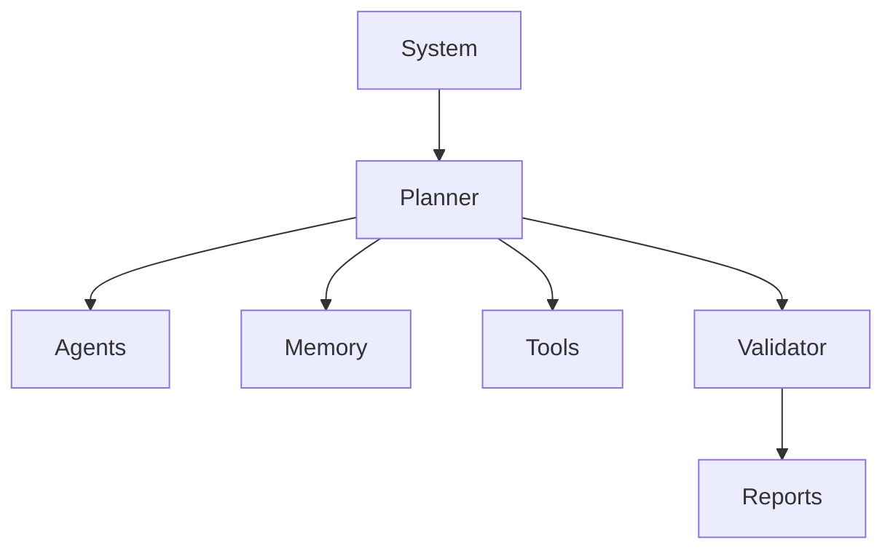
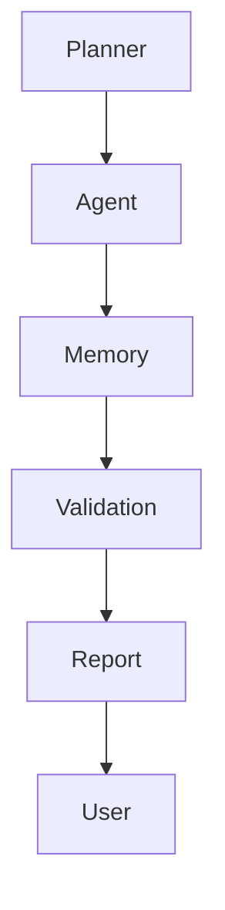
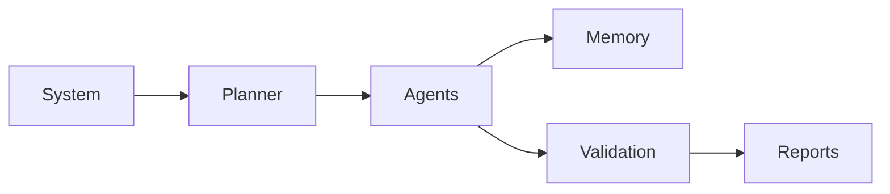
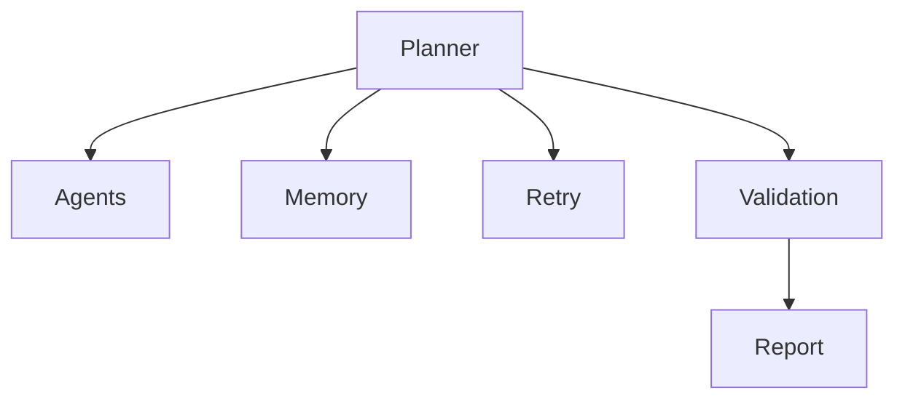
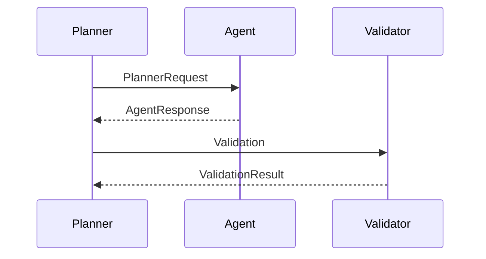

# Prompt Engineering Standards

**Document:** `docs/prompts/prompt_standards.md`

---

# Part I — Prompt Engineering Philosophy

> **Purpose**
>
> This document defines the authoritative prompt engineering standards for WalletMind.
>
> Prompts are treated as **architectural components**, not implementation details.
>
> Every prompt—from the top-level System Prompt to specialized Agent prompts—must follow consistent design principles that emphasize modularity, explainability, reproducibility, and Planner-driven orchestration.
>
> This document becomes the single source of truth for all future prompt development.

---

# Table of Contents

## Part I — Prompt Engineering Philosophy

1. Purpose
2. Prompt Engineering Philosophy
3. Prompt Architecture
4. Prompt Hierarchy
5. Prompt Design Principles
6. Prompt Lifecycle
7. Prompt Ownership
8. Prompt Boundaries
9. Explainability Philosophy
10. Prompt Design Goals
11. Google ADK Alignment
12. Kaggle Competition Mapping
13. Engineering Summary

---

# 1. Purpose

WalletMind is a **Planner-driven Multi-Agent AI system**.

Prompts therefore represent architectural interfaces between reasoning components rather than isolated instructions given to an LLM.

The objective of this document is to ensure that every future prompt:

- has a clearly defined responsibility
- follows consistent structure
- produces deterministic outputs
- supports explainability
- integrates with Planner orchestration
- remains easy to improve over time

---

## Primary Objectives

This standard exists to guarantee:

- consistency
- modularity
- maintainability
- traceability
- reproducibility

---

## Scope

This document applies to every prompt used by WalletMind including:

- System prompts
- Planner prompts
- Agent prompts
- Memory prompts
- Critic prompts
- Validation prompts
- Retry prompts

---

# 2. Prompt Engineering Philosophy

WalletMind treats prompts as **architecture**, not text.

Instead of writing large monolithic prompts, WalletMind decomposes reasoning into specialized prompt responsibilities.

```mermaid
flowchart LR

System Prompt

-->

Planner Prompt

Planner Prompt

-->

Agent Prompts

Agent Prompts

-->

Memory Prompt

Agent Prompts

-->

Tool Calls

Planner

-->

Validator

Validator

-->

Reports
```

Each prompt performs one architectural role.

---

## Prompting Philosophy

Rather than asking:

> "How do we make one prompt smarter?"

WalletMind asks:

> "How should multiple prompts collaborate?"

---

## Architectural Characteristics

Prompts should be:

- specialized
- modular
- composable
- explainable
- deterministic

---

# 3. Prompt Architecture

WalletMind follows a layered prompt architecture.

```mermaid
flowchart TD

System Prompt

-->

Planner Prompt

Planner Prompt

-->

Specialized Agent Prompts

Specialized Agent Prompts

-->

Memory Prompt

Specialized Agent Prompts

-->

Tool Prompt

Memory Prompt

-->

Validator Prompt

Tool Prompt

-->

Validator Prompt

Validator Prompt

-->

Report Prompt
```

Every layer introduces exactly one new responsibility.

---

## Architectural Layers

| Layer     | Responsibility        |
| --------- | --------------------- |
| System    | Global behavior       |
| Planner   | Orchestration         |
| Agent     | Specialized reasoning |
| Memory    | Context management    |
| Tool      | Capability execution  |
| Validator | Output verification   |
| Report    | User communication    |

---

# 4. Prompt Hierarchy

WalletMind prompts follow a strict hierarchy.

```
System Prompt

↓

Planner Prompt

↓

Agent Prompt

↓

Memory Prompt

↓

Tool Interaction

↓

Validator Prompt

↓

Report Prompt
```

Prompts should never bypass this hierarchy.

---

## Hierarchical Rules

Planner owns orchestration.

Agents own reasoning.

Memory owns context.

Tools provide deterministic capabilities.

Validators verify outputs.

Reports communicate results.

---

# 5. Prompt Design Principles

WalletMind follows ten core prompt engineering principles.

---

## Principle 1 — Single Responsibility

Every prompt should have one clearly defined purpose.

Examples:

Planner Prompt

Responsible for planning.

Budget Prompt

Responsible for budgeting.

Memory Prompt

Responsible for memory operations.

---

## Principle 2 — Planner Ownership

Only the Planner decides:

- execution order
- participating agents
- dependencies
- retries

Agent prompts must never self-orchestrate.

---

## Principle 3 — Structured Outputs

Every prompt should produce structured outputs.

Prefer:

- JSON
- documented schemas
- explicit fields

Avoid free-form responses whenever possible.

---

## Principle 4 — Explainability

Every prompt should explain:

- reasoning
- assumptions
- confidence
- limitations

Opaque outputs are discouraged.

---

## Principle 5 — Context Awareness

Prompts should consume only the context required for their task.

Avoid unnecessary prompt expansion.

---

## Principle 6 — Determinism

Equivalent inputs should produce equivalent structured outputs whenever practical.

---

## Principle 7 — Modularity

Prompt improvements should not require rewriting unrelated prompts.

---

## Principle 8 — Explicit Constraints

Prompts should clearly state:

- responsibilities
- limitations
- prohibited behaviors
- expected outputs

---

## Principle 9 — Validation

Every significant prompt output should be validated before downstream use.

---

## Principle 10 — Evolution

Prompts should evolve through versioning rather than ad hoc modification.

---

# 6. Prompt Lifecycle

Every WalletMind prompt follows the same lifecycle.


The lifecycle encourages continuous improvement while preserving reproducibility.

---

## Lifecycle Stages

| Stage          | Purpose                 |
| -------------- | ----------------------- |
| Design         | Define responsibilities |
| Review         | Verify architecture     |
| Implementation | Create prompt           |
| Testing        | Validate behavior       |
| Validation     | Confirm output quality  |
| Deployment     | Integrate into system   |
| Revision       | Improve over time       |

---

# 7. Prompt Ownership

Prompt ownership mirrors WalletMind's architectural ownership.

| Prompt           | Owner            |
| ---------------- | ---------------- |
| System Prompt    | Platform         |
| Planner Prompt   | Planner          |
| Agent Prompt     | Individual Agent |
| Memory Prompt    | Memory System    |
| Tool Prompt      | Tool Layer       |
| Validator Prompt | Validator Agent  |
| Report Prompt    | Report Generator |

Ownership should never overlap.

---

## Ownership Diagram



Planner remains the central coordination authority.

---

# 8. Prompt Boundaries

Prompt boundaries preserve modularity.

---

## System Prompt

Defines global behavior.

Should never solve user tasks.

---

## Planner Prompt

Creates execution plans.

Should never perform financial analysis.

---

## Agent Prompt

Performs specialized reasoning.

Should never coordinate other agents.

---

## Memory Prompt

Retrieves and updates context.

Should never generate recommendations.

---

## Validator Prompt

Evaluates outputs.

Should never modify Planner decisions.

---

## Report Prompt

Communicates findings.

Should never perform new reasoning.

---

# 9. Explainability Philosophy

Explainability begins inside prompts.

Every prompt should expose:

- reasoning
- evidence
- assumptions
- uncertainty
- confidence

---

## Explainability Pipeline



Explainability is cumulative.

Each prompt contributes additional transparency.

---

# 10. Prompt Design Goals

Prompt engineering within WalletMind prioritizes the following goals.

| Goal                | Description                  |
| ------------------- | ---------------------------- |
| Consistency         | Uniform prompt structure     |
| Modularity          | Independent prompt evolution |
| Explainability      | Transparent reasoning        |
| Reproducibility     | Stable outputs               |
| Maintainability     | Easy updates                 |
| Planner Integration | Architecture alignment       |
| Educational Value   | Readable prompt design       |

---

## Design Philosophy

Prompt complexity should increase only when it improves reasoning quality.

Complex prompts are not inherently better prompts.

---

# 11. Google ADK Alignment

WalletMind prompt engineering aligns with Google's Agent Development Kit philosophy.

| Google ADK Concept | Prompt Interpretation    |
| ------------------ | ------------------------ |
| Planner            | Planner Prompt           |
| Specialized Agents | Agent Prompts            |
| Shared Context     | Memory Prompt            |
| Tools              | Tool Interaction Prompts |
| Structured Outputs | JSON Responses           |
| Explainability     | Prompt Transparency      |

Rather than embedding all logic into a single prompt, WalletMind distributes reasoning across specialized prompts.

---

## ADK Prompt Flow

```mermaid
flowchart LR

Planner Prompt

-->

Agent Prompt

-->

Memory Prompt

-->

Tool Prompt

-->

Validator Prompt

-->

Report Prompt
```

---

# 12. Kaggle Competition Mapping

Prompt engineering directly supports several competition objectives.

| Competition Focus   | Prompt Standard Contribution |
| ------------------- | ---------------------------- |
| Planner             | Planner Prompt Architecture  |
| Multi-Agent         | Specialized Agent Prompts    |
| Memory              | Memory Prompt Standards      |
| Explainability      | Structured Prompt Outputs    |
| Educational Value   | Prompt Documentation         |
| Reproducibility     | Deterministic Prompt Design  |
| Engineering Quality | Prompt Governance            |

The prompt architecture itself becomes evidence of thoughtful AI engineering.

---

# 13. Engineering Summary

WalletMind treats prompts as **first-class architectural artifacts**.

Every prompt is designed to fulfill a specific responsibility within the Planner-driven ecosystem rather than acting as an all-purpose instruction set.

```mermaid
flowchart TD

System Prompt

-->

Planner Prompt

-->

Agent Prompts

-->

Memory

-->

Validation

-->

Reports
```

This layered approach provides:

- modular reasoning
- architectural clarity
- prompt reuse
- structured outputs
- explainability
- reproducibility
- maintainability

By standardizing prompt design at the architectural level, WalletMind ensures that future prompt development remains consistent with its Planner-first philosophy and the objectives of the Google Kaggle **AI Agents: Intensive Vibe Coding Capstone Project**.

---

## Next Part

**Part II — Prompt Types & Standards**

This section defines detailed standards for every prompt category:

- System Prompts
- Planner Prompts
- Agent Prompts
- Critic Prompts
- Memory Prompts
- Retry Prompts
- Validation Prompts

For each prompt type it will define:

- Purpose
- Responsibilities
- Inputs
- Outputs
- Required sections
- Prompt template structure
- Design rationale
- Constraints
- Failure handling
- Architectural boundaries

# Part II — Prompt Types & Standards

> **Purpose**
>
> This section defines the architectural standards for every prompt category used throughout WalletMind.
>
> Each prompt type has a clearly defined responsibility, ownership boundary, lifecycle, and expected output.
>
> Prompts should never overlap in responsibility.
>
> Every future prompt should conform to the standards defined in this document.

---

# Table of Contents

14. Prompt Classification
15. System Prompt Standard
16. Planner Prompt Standard
17. Agent Prompt Standard
18. Critic Prompt Standard
19. Memory Prompt Standard
20. Retry Prompt Standard
21. Validation Prompt Standard
22. Prompt Composition Rules
23. Prompt Boundaries
24. Prompt Selection Matrix

---

# 14. Prompt Classification

WalletMind organizes prompts according to architectural responsibility rather than model capability.

```mermaid
flowchart TD

System Prompt

-->

Planner Prompt

Planner Prompt

-->

Agent Prompt

Planner Prompt

-->

Memory Prompt

Planner Prompt

-->

Retry Prompt

Planner Prompt

-->

Validation Prompt

Planner Prompt

-->

Critic Prompt

Critic Prompt

-->

Report Prompt
```

---

## Prompt Taxonomy

| Prompt Type | Responsibility              | Owner            |
| ----------- | --------------------------- | ---------------- |
| System      | Global AI behavior          | Platform         |
| Planner     | Task orchestration          | Planner          |
| Agent       | Domain reasoning            | Individual Agent |
| Memory      | Context retrieval & updates | Memory System    |
| Critic      | Quality assessment          | Validator        |
| Retry       | Recovery strategy           | Planner          |
| Validation  | Output verification         | Validator        |

---

# 15. System Prompt Standard

## Purpose

The System Prompt establishes WalletMind's overall identity and behavioral constraints.

It defines **how WalletMind behaves**, not **how it solves individual tasks**.

---

## Responsibilities

The System Prompt should define:

- overall personality
- architectural boundaries
- response philosophy
- explainability expectations
- output discipline
- safety constraints

---

## Should Include

- project identity
- architectural philosophy
- Planner-first behavior
- transparency expectations
- structured output expectations

---

## Should NOT Include

- financial reasoning
- budgeting logic
- forecasting logic
- parsing logic
- execution plans

Those belong to specialized prompts.

---

## Inputs

- user request
- notebook context
- session metadata

---

## Outputs

System behavior only.

No business logic.

---

## Prompt Structure

```text
Identity

↓

Mission

↓

Behavior

↓

Architecture Constraints

↓

Output Rules

↓

Safety Rules
```

---

## Success Criteria

✓ Consistent behavior

✓ Stable personality

✓ Architecture awareness

✓ Explainable responses

---

# 16. Planner Prompt Standard

## Purpose

The Planner Prompt converts user objectives into executable plans.

It never performs financial reasoning.

---

## Responsibilities

Planner Prompt should:

- identify intent
- understand goals
- identify constraints
- discover capabilities
- select agents
- create task graph
- determine dependencies
- plan execution

---

## Inputs

- user request
- retrieved memory
- available capabilities
- tool registry
- planner state

---

## Outputs

PlannerResponse

Containing:

- execution graph
- selected agents
- required tools
- validation strategy
- execution order

---

## Prompt Structure

```text
Intent

↓

Goals

↓

Constraints

↓

Capabilities

↓

Agent Selection

↓

Task Graph

↓

Validation Plan
```

---

## Should NOT

- generate recommendations
- forecast finances
- analyze transactions
- retrieve memory directly

---

## Success Criteria

✓ Complete execution graph

✓ Appropriate agent selection

✓ Explainable planning

---

# 17. Agent Prompt Standard

## Purpose

Agent Prompts perform specialized reasoning.

Each agent owns exactly one capability.

---

## Responsibilities

Agent prompts:

- solve assigned task
- reason within domain
- explain findings
- return structured outputs

---

## Inputs

- PlannerRequest
- assigned capability
- retrieved memory
- tool results

---

## Outputs

AgentResponse

Including:

- findings
- evidence
- confidence
- assumptions
- limitations

---

## Prompt Structure

```text
Role

↓

Objective

↓

Available Context

↓

Reasoning Instructions

↓

Evidence

↓

Output Schema
```

---

## Should NOT

- orchestrate execution
- call unrelated agents
- update memory directly
- rewrite Planner decisions

---

## Success Criteria

✓ Domain-specific reasoning

✓ Structured outputs

✓ High explainability

---

# 18. Critic Prompt Standard

## Purpose

Critic Prompts evaluate reasoning quality.

They assess outputs without replacing them.

---

## Responsibilities

Review:

- logical consistency
- completeness
- assumptions
- evidence quality
- confidence calibration
- formatting

---

## Inputs

- PlannerResponse
- AgentResponses
- evidence
- report draft

---

## Outputs

CriticResponse

Including:

- issues found
- severity
- suggested improvements
- validation status

---

## Prompt Structure

```text
Input Review

↓

Consistency Check

↓

Evidence Check

↓

Confidence Review

↓

Improvement Suggestions
```

---

## Should NOT

- create new recommendations
- change planner ownership
- invent evidence

---

## Success Criteria

✓ Reliable review

✓ Actionable feedback

✓ Objective evaluation

---

# 19. Memory Prompt Standard

## Purpose

Memory Prompts retrieve and update contextual knowledge.

---

## Responsibilities

Retrieve:

- user profile
- financial profile
- goals
- preferences
- summaries
- reports

Update:

- validated knowledge only

---

## Inputs

Planner context

Memory query

Conversation summary

---

## Outputs

MemoryResponse

Containing:

- retrieved records
- relevance
- timestamps
- ownership

---

## Prompt Structure

```text
Memory Request

↓

Retrieval

↓

Filtering

↓

Relevance

↓

Structured Response
```

---

## Should NOT

- generate recommendations
- modify Planner state
- perform financial analysis

---

## Success Criteria

✓ Relevant retrieval

✓ Controlled updates

✓ Explainable memory usage

---

# 20. Retry Prompt Standard

## Purpose

Retry Prompts recover gracefully from failures.

Retries improve execution quality without changing architectural responsibilities.

---

## Responsibilities

Determine:

- retry necessity
- retry strategy
- missing information
- recovery instructions

---

## Inputs

- failure reason
- planner state
- previous output

---

## Outputs

RetryDecision

Containing:

- retry yes/no
- reason
- updated instructions

---

## Prompt Structure

```text
Failure

↓

Diagnosis

↓

Recovery Strategy

↓

Retry Decision
```

---

## Retry Principles

Prefer:

- minimal retries
- targeted recovery
- deterministic behavior

Avoid:

- repeating identical prompts
- infinite retry loops
- changing Planner ownership

---

## Success Criteria

✓ Efficient recovery

✓ Stable execution

✓ Minimal duplication

---

# 21. Validation Prompt Standard

## Purpose

Validation Prompts verify output correctness before downstream processing.

---

## Responsibilities

Validate:

- schema compliance
- completeness
- required fields
- confidence
- formatting
- consistency

---

## Inputs

Structured outputs

Expected schema

Validation rules

---

## Outputs

ValidationResult

Containing:

- valid
- errors
- warnings
- recommendations

---

## Prompt Structure

```text
Schema Validation

↓

Field Validation

↓

Consistency

↓

Decision
```

---

## Should NOT

- rewrite outputs
- perform new reasoning
- change Planner decisions

---

## Success Criteria

✓ Reliable validation

✓ Clear errors

✓ Deterministic decisions

---

# 22. Prompt Composition Rules

Prompts should compose rather than overlap.



---

## Composition Principles

Every prompt should:

- consume structured inputs
- produce structured outputs
- expose confidence
- document assumptions

Avoid hidden dependencies.

---

# 23. Prompt Boundaries

Prompt responsibilities should remain isolated.

| Prompt     | Must Do                 | Must Never Do         |
| ---------- | ----------------------- | --------------------- |
| System     | Define behavior         | Perform reasoning     |
| Planner    | Plan execution          | Solve financial tasks |
| Agent      | Domain reasoning        | Orchestrate workflow  |
| Memory     | Retrieve/update context | Recommend actions     |
| Critic     | Review outputs          | Replace reasoning     |
| Retry      | Recover execution       | Change architecture   |
| Validation | Verify outputs          | Generate insights     |

---

## Boundary Diagram



No prompt should bypass the Planner's orchestration authority.

---

# 24. Prompt Selection Matrix

The Planner selects prompt types based on execution requirements.

| Situation                | Prompt Used           |
| ------------------------ | --------------------- |
| Initialize conversation  | System Prompt         |
| Build execution plan     | Planner Prompt        |
| Analyze budget           | Budget Agent Prompt   |
| Forecast finances        | Forecast Agent Prompt |
| Retrieve user goals      | Memory Prompt         |
| Validate report          | Validation Prompt     |
| Review reasoning quality | Critic Prompt         |
| Recover from failure     | Retry Prompt          |

---

## Prompt Flow

```text
System

↓

Planner

↓

Specialized Agent

↓

Memory

↓

Validation

↓

Critic

↓

Report
```

Each prompt contributes one clearly defined architectural capability.

---

# Part II Summary

WalletMind defines seven standardized prompt categories, each with:

- a single architectural responsibility
- clear ownership
- documented inputs and outputs
- strict behavioral boundaries
- structured prompt composition rules

This architecture prevents prompt overlap, simplifies maintenance, improves explainability, and enables future AI coding assistants to extend WalletMind consistently without introducing monolithic prompt designs.

---

## Next Part

**Part III — Prompt Contracts & Output Standards**

This section will define:

- Output formatting rules
- JSON output standards
- JSON schema conventions
- Structured reasoning requirements
- Confidence reporting
- Explainability requirements
- Planner ↔ Agent communication contracts
- Prompt chaining rules
- Response validation standards
- Examples of standardized prompt outputs

# Part III — Prompt Contracts & Output Standards

> **Purpose**
>
> This section defines the standardized communication contracts used by every prompt in WalletMind.
>
> Rather than allowing prompts to exchange arbitrary natural language, WalletMind requires structured, machine-readable outputs that support:
>
> - Planner orchestration
> - Multi-agent collaboration
> - Validation
> - Memory updates
> - Explainability
> - Reproducibility
>
> Every prompt should behave as a well-defined architectural component with explicit inputs and outputs.

---

# Table of Contents

25. Prompt Contract Philosophy
26. Standard Output Principles
27. JSON Output Standards
28. JSON Schema Conventions
29. Structured Reasoning Requirements
30. Confidence Reporting
31. Explainability Standards
32. Planner ↔ Agent Contracts
33. Agent ↔ Memory Contracts
34. Prompt Chaining Rules
35. Validation Requirements
36. Contract Evolution Guidelines
37. Engineering Summary

---

# 25. Prompt Contract Philosophy

WalletMind treats prompts as components that communicate through **contracts**, not conversations.

Every prompt consumes structured data and produces structured data.


Each arrow represents a documented contract.

---

## Design Goals

Prompt contracts should be:

- deterministic
- explicit
- versioned
- machine-readable
- easy to validate
- human-readable

---

## Architectural Rule

Never rely on parsing free-form prose between prompts.

Prefer explicit structured outputs.

---

# 26. Standard Output Principles

Every prompt output should satisfy six principles.

---

## Principle 1 — Structured

Outputs should follow documented schemas.

Avoid ad hoc fields.

---

## Principle 2 — Complete

Required fields should always exist.

Never omit mandatory information.

---

## Principle 3 — Deterministic

Equivalent inputs should produce equivalent structures.

Field ordering should remain stable where practical.

---

## Principle 4 — Explainable

Every significant conclusion should include supporting evidence.

---

## Principle 5 — Validatable

Outputs should be independently verifiable by the Validation Prompt.

---

## Principle 6 — Extensible

Schemas should allow future additions without breaking existing consumers.

---

# 27. JSON Output Standards

WalletMind standardizes all prompt communication using JSON-like contracts.

---

## Required Top-Level Structure

Every prompt response should contain:

```json
{
  "metadata": {},
  "result": {},
  "reasoning": {},
  "confidence": {},
  "validation": {}
}
```

---

## Metadata Section

Purpose

Describe execution context.

Recommended fields

```json
{
  "prompt_type": "...",
  "prompt_version": "...",
  "agent": "...",
  "timestamp": "...",
  "request_id": "..."
}
```

---

## Result Section

Purpose

Primary output.

Should contain:

- structured findings
- recommendations
- plans
- memory records
- validation results

depending on prompt type.

---

## Reasoning Section

Purpose

Expose explainability.

Should summarize:

- approach
- assumptions
- evidence
- limitations

without revealing hidden chain-of-thought.

---

## Confidence Section

Purpose

Quantify confidence.

---

## Validation Section

Purpose

Describe output quality.

---

# 28. JSON Schema Conventions

All schemas should follow consistent naming.

---

## Naming Rules

Use:

camelCase

Example

```json
"userProfile"
```

Avoid

```
User_Profile

user_profile

USERPROFILE
```

---

## Field Naming

Prefer descriptive names.

Good

```
goalProgress

forecastConfidence

riskLevel
```

Avoid

```
g1

conf

riskValue2
```

---

## Required vs Optional

Document every field.

Example

| Field       | Required |
| ----------- | -------- |
| id          | ✓        |
| confidence  | ✓        |
| explanation | ✓        |
| metadata    | ✓        |
| notes       | Optional |

---

## Version Field

Every contract should include:

```json
{
  "schemaVersion": "1.0"
}
```

---

# 29. Structured Reasoning Requirements

WalletMind requires explainable reasoning without exposing internal hidden reasoning.

---

## Required Reasoning Elements

Every reasoning section should include:

- objective
- supporting evidence
- assumptions
- constraints
- confidence summary

---

## Example Structure

```json
{
  "reasoning": {
    "objective": "...",
    "evidence": [],
    "assumptions": [],
    "constraints": [],
    "summary": "..."
  }
}
```

---

## Design Principle

Summarize reasoning.

Do not expose internal deliberation.

---

# 30. Confidence Reporting

Confidence should be standardized across all prompts.

---

## Confidence Components

| Component    | Purpose              |
| ------------ | -------------------- |
| Overall      | Final confidence     |
| Evidence     | Evidence quality     |
| Completeness | Information coverage |
| Consistency  | Logical consistency  |

---

## Example

```json
{
  "confidence": {
    "overall": 0.93,
    "evidence": 0.95,
    "completeness": 0.9,
    "consistency": 0.94
  }
}
```

---

## Confidence Guidelines

Confidence should reflect:

- available evidence
- uncertainty
- missing information

Never use arbitrary values.

---

# 31. Explainability Standards

Explainability is mandatory.

Every significant output should answer:

- Why?
- Based on what?
- With what assumptions?
- How certain?

---

## Explainability Structure

```json
{
  "explanation": {
    "summary": "...",
    "evidence": [],
    "assumptions": [],
    "limitations": []
  }
}
```

---

## Explainability Rule

Recommendations should never appear without supporting rationale.

---

# 32. Planner ↔ Agent Contracts

Planner communicates with agents using standardized requests.

---

## Planner Request

Should include:

```json
{
  "task": {},
  "goal": {},
  "constraints": {},
  "memory": {},
  "expectedOutput": {}
}
```

---

## Agent Response

Should include:

```json
{
  "status": "...",
  "findings": {},
  "confidence": {},
  "recommendations": [],
  "explanation": {}
}
```

---

## Communication Flow



---

# 33. Agent ↔ Memory Contracts

Memory interactions should remain standardized.

---

## Memory Retrieval Request

```json
{
  "query": "...",
  "memoryTypes": [],
  "context": {}
}
```

---

## Memory Retrieval Response

```json
{
  "records": [],
  "relevance": {},
  "summary": {}
}
```

---

## Memory Update Request

```json
{
  "record": {},
  "reason": "...",
  "owner": "...",
  "validation": {}
}
```

---

## Memory Flow

```mermaid
flowchart LR

Agent

-->

Memory Retrieval

-->

Planner

Planner

-->

Memory Update
```

---

# 34. Prompt Chaining Rules

Prompt chaining should preserve architectural boundaries.

---

## Standard Chain

```text
System

↓

Planner

↓

Agent

↓

Memory

↓

Validation

↓

Critic

↓

Report
```

---

## Rules

Each prompt should:

- consume validated inputs
- produce validated outputs
- avoid hidden dependencies
- preserve ownership boundaries

---

## Never Allow

```
Agent

↓

Another Agent

↓

Another Agent

↓

Planner
```

Planner remains the orchestration authority.

---

# 35. Validation Requirements

Every prompt output should be validated before downstream use.

---

## Validation Checklist

Verify:

- schema
- required fields
- consistency
- confidence
- completeness
- formatting

---

## Validation Result

```json
{
  "valid": true,
  "errors": [],
  "warnings": [],
  "score": 0.97
}
```

---

## Validation Pipeline

```mermaid
flowchart TD

Prompt Output

-->

Schema Validation

-->

Consistency Check

-->

Confidence Check

-->

Accepted
```

---

# 36. Contract Evolution Guidelines

Prompt contracts should evolve predictably.

---

## Versioning Rules

Every schema should include:

```json
{
  "schemaVersion": "1.0"
}
```

---

## Evolution Principles

Prefer:

- additive changes
- backward compatibility
- documented revisions

Avoid:

- breaking field names
- removing required fields
- undocumented changes

---

## Change Categories

| Change               | Compatibility |
| -------------------- | ------------- |
| Add optional field   | Compatible    |
| Add required field   | Major Version |
| Rename field         | Major Version |
| Remove field         | Major Version |
| Improve descriptions | Compatible    |

---

# 37. Engineering Summary

WalletMind's prompt contracts provide a consistent communication framework across the entire Planner-driven architecture.

```mermaid
flowchart TD

Planner

-->

Structured Requests

-->

Agent

-->

Structured Responses

-->

Validation

-->

Reports
```

The contract standards ensure:

- deterministic communication
- modular prompt composition
- schema validation
- explainability
- reproducibility
- future extensibility

By requiring every prompt to follow documented contracts, WalletMind enables reliable multi-agent collaboration while remaining accessible to future AI coding assistants and human contributors.

---

## Next Part

**Part IV — Prompt Governance**

The final section defines the long-term governance of WalletMind prompts, including:

- Prompt versioning
- Prompt review workflow
- Prompt testing strategy
- Regression testing
- Evaluation methodology
- Prompt quality metrics
- Prompt anti-patterns
- Documentation requirements
- Maintenance strategy
- Future prompt evolution

This becomes the authoritative governance guide for all prompt engineering within WalletMind.

# Part IV — Prompt Governance

> **Purpose**
>
> This section defines how WalletMind prompts are governed throughout their lifecycle.
>
> Prompt engineering is treated as an engineering discipline rather than an ad hoc activity.
>
> Every prompt should be:
>
> - documented
> - reviewed
> - versioned
> - tested
> - reproducible
> - continuously improved
>
> This governance model ensures that WalletMind's prompt ecosystem remains consistent with its Planner-driven architecture as the project evolves.

---

# Table of Contents

38. Prompt Governance Philosophy
39. Prompt Versioning
40. Prompt Review Workflow
41. Prompt Testing Strategy
42. Regression Testing
43. Prompt Quality Metrics
44. Prompt Review Checklist
45. Prompt Anti-Patterns
46. Documentation Standards
47. Prompt Maintenance
48. Future Prompt Evolution
49. Engineering Summary

---

# 38. Prompt Governance Philosophy

Prompt engineering should follow the same engineering discipline applied to:

- architecture
- APIs
- data models
- interfaces

Prompts are architectural assets.

They should never become undocumented implementation details.

---

## Governance Lifecycle


Every prompt should progress through this lifecycle.

---

## Governance Objectives

WalletMind prompt governance aims to provide:

- consistency
- traceability
- quality
- explainability
- maintainability

---

# 39. Prompt Versioning

Every prompt must have an explicit version.

---

## Version Format

```
Major.Minor.Patch
```

Examples

```
1.0.0

1.1.0

2.0.0
```

---

## Version Rules

### Major

Breaking architectural change.

Examples

- prompt responsibility changes
- output schema changes
- role changes

---

### Minor

Backward-compatible improvements.

Examples

- improved instructions
- clearer constraints
- better examples
- enhanced explainability

---

### Patch

Small corrections.

Examples

- typo fixes
- wording improvements
- formatting
- documentation

---

## Prompt Metadata

Every prompt should declare:

```yaml
name: PlannerPrompt

version: 1.0.0

owner: Planner

status: Stable

last_reviewed: YYYY-MM-DD
```

---

# 40. Prompt Review Workflow

Every prompt modification should undergo structured review.

---

## Review Flow

```mermaid
flowchart TD

Proposal

-->

Architecture Review

-->

Prompt Review

-->

Testing

-->

Validation

-->

Approval

-->

Release
```

---

## Review Questions

Does the prompt:

- preserve architecture?
- respect ownership?
- improve reasoning?
- increase explainability?
- remain deterministic?
- maintain contracts?

---

## Review Participants

| Role          | Responsibility       |
| ------------- | -------------------- |
| Architecture  | Boundaries           |
| Planner       | Orchestration        |
| Domain Expert | Financial reasoning  |
| Validator     | Output quality       |
| Documentation | Prompt specification |

---

# 41. Prompt Testing Strategy

Prompts should be tested like software components.

---

## Test Categories

| Category       | Purpose                     |
| -------------- | --------------------------- |
| Unit           | Individual prompt           |
| Integration    | Prompt interactions         |
| Regression     | Prevent quality degradation |
| Schema         | Output validation           |
| Explainability | Evidence quality            |
| Robustness     | Edge cases                  |

---

## Test Flow

```mermaid
flowchart LR

Prompt

-->

Test Inputs

-->

Execution

-->

Validation

-->

Quality Score
```

---

## Example Test Cases

Planner Prompt

- simple request
- complex request
- ambiguous request
- missing information

Agent Prompt

- normal scenario
- incomplete data
- conflicting evidence

Memory Prompt

- retrieval
- updates
- empty memory

---

# 42. Regression Testing

Prompt improvements should never reduce existing quality.

---

## Regression Objectives

Verify:

- schema unchanged
- Planner behavior unchanged
- explainability maintained
- confidence remains stable

---

## Regression Pipeline

```mermaid
flowchart TD

Prompt Update

-->

Historical Tests

-->

Comparison

-->

Quality Report

-->

Approval
```

---

## Regression Metrics

Compare:

- accuracy
- consistency
- completeness
- formatting
- confidence
- validation success

---

# 43. Prompt Quality Metrics

WalletMind evaluates prompt quality using measurable criteria.

---

## Primary Metrics

| Metric          | Description              |
| --------------- | ------------------------ |
| Correctness     | Produces expected output |
| Consistency     | Stable across runs       |
| Explainability  | Provides rationale       |
| Completeness    | Covers required fields   |
| Structure       | Valid JSON/schema        |
| Confidence      | Appropriate calibration  |
| Maintainability | Easy to modify           |
| Readability     | Clear prompt design      |

---

## Secondary Metrics

- prompt length
- modularity
- instruction clarity
- ambiguity
- constraint coverage

---

## Example Quality Dashboard

```
Correctness

97%

Explainability

95%

Consistency

94%

Validation

99%

Readability

96%
```

---

# 44. Prompt Review Checklist

Every prompt should satisfy the following checklist before approval.

---

## Architecture

✓ Single responsibility

✓ Planner ownership respected

✓ No duplicated responsibilities

---

## Structure

✓ Clear sections

✓ Inputs documented

✓ Outputs documented

✓ Constraints documented

---

## Explainability

✓ Evidence required

✓ Assumptions documented

✓ Confidence included

---

## Validation

✓ Schema compliant

✓ Required fields present

✓ Deterministic structure

---

## Documentation

✓ Version updated

✓ Examples reviewed

✓ Review date recorded

---

# 45. Prompt Anti-Patterns

WalletMind explicitly discourages the following prompt designs.

---

## Anti-Pattern 1

### Monolithic Prompt

```
One prompt performs:

Planning

Reasoning

Memory

Validation

Reporting
```

Problem

Difficult to maintain.

Poor explainability.

---

## Anti-Pattern 2

### Agent Self-Orchestration

```
Agent

↓

Calls Other Agents

↓

Coordinates Execution
```

Problem

Violates Planner ownership.

---

## Anti-Pattern 3

### Hidden Reasoning

Outputs recommendation without explanation.

Problem

Poor transparency.

---

## Anti-Pattern 4

### Free-Form Outputs

Unstructured text.

Problem

Impossible to validate reliably.

---

## Anti-Pattern 5

### Prompt Duplication

Multiple prompts implementing identical logic.

Problem

Maintenance complexity.

---

## Anti-Pattern 6

### Implicit Memory

Agent silently assumes previous context.

Problem

Violates explicit memory architecture.

---

## Anti-Pattern Summary

| Anti-Pattern       | Avoid Because               |
| ------------------ | --------------------------- |
| Monolithic prompts | Poor modularity             |
| Self-orchestration | Breaks Planner design       |
| Hidden reasoning   | Poor explainability         |
| Free-form outputs  | Difficult validation        |
| Prompt duplication | Maintenance burden          |
| Implicit memory    | Architectural inconsistency |

---

# 46. Documentation Standards

Every prompt should be documented using a standard template.

---

## Required Sections

- Name
- Purpose
- Owner
- Version
- Inputs
- Outputs
- Responsibilities
- Constraints
- JSON schema
- Examples
- Review history

---

## Documentation Template

```text
Prompt Name

↓

Purpose

↓

Responsibilities

↓

Inputs

↓

Outputs

↓

Constraints

↓

Version

↓

Examples
```

---

# 47. Prompt Maintenance

Prompt evolution should be incremental.

---

## Maintenance Cycle


---

## Improvement Sources

Prompts may improve through:

- notebook observations
- evaluation results
- regression testing
- architecture reviews
- competition feedback

---

## Maintenance Principles

Prefer:

- small improvements
- documented revisions
- measurable benefits

Avoid:

- unnecessary rewrites
- undocumented changes
- architectural drift

---

# 48. Future Prompt Evolution

WalletMind's prompt architecture should support future expansion.

---

## Possible Future Enhancements

Planner

- adaptive planning prompts
- planning strategies
- planner benchmarking

---

Agents

- richer specialization
- collaborative prompting
- domain refinement

---

Memory

- semantic retrieval prompts
- temporal reasoning
- long-term planning

---

Validation

- automated quality scoring
- self-consistency checks
- multi-stage validation

---

Reports

- audience-specific prompts
- educational explanations
- interactive summaries

---

## Evolution Principles

Future prompts should remain:

- modular
- explainable
- versioned
- architecture-driven
- backward compatible where practical

---

# 49. Engineering Summary

Prompt engineering within WalletMind is governed by the same architectural principles that guide the rest of the project.

```mermaid
flowchart TD

Prompt Design

-->

Documentation

-->

Review

-->

Testing

-->

Validation

-->

Release

-->

Continuous Improvement
```

This governance model ensures that prompts remain:

- architecturally consistent
- modular
- testable
- explainable
- reproducible
- maintainable

By treating prompts as first-class engineering artifacts rather than informal instructions, WalletMind establishes a sustainable foundation for future AI development and collaboration.

---

# Document Completion

`docs/prompts/prompt_standards.md` is now complete.

This document serves as the authoritative prompt engineering specification for WalletMind. It defines the philosophy, architecture, standards, contracts, governance, and evolution strategy for every prompt used throughout the Planner-driven multi-agent system, ensuring consistency with the project's architecture-first approach and the objectives of the **Google Kaggle AI Agents: Intensive Vibe Coding Capstone Project**.
